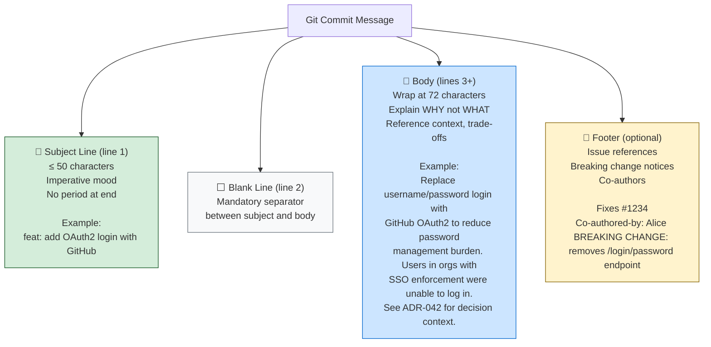
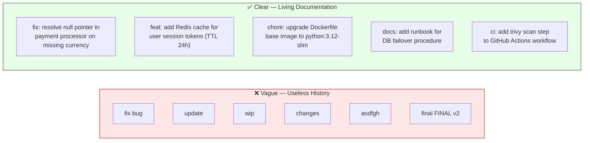
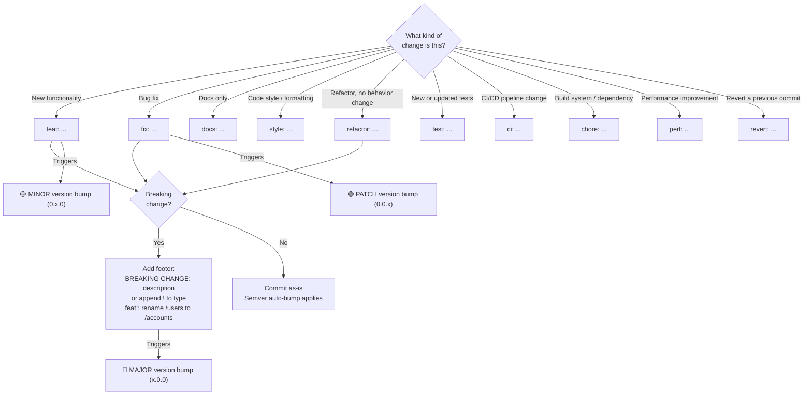
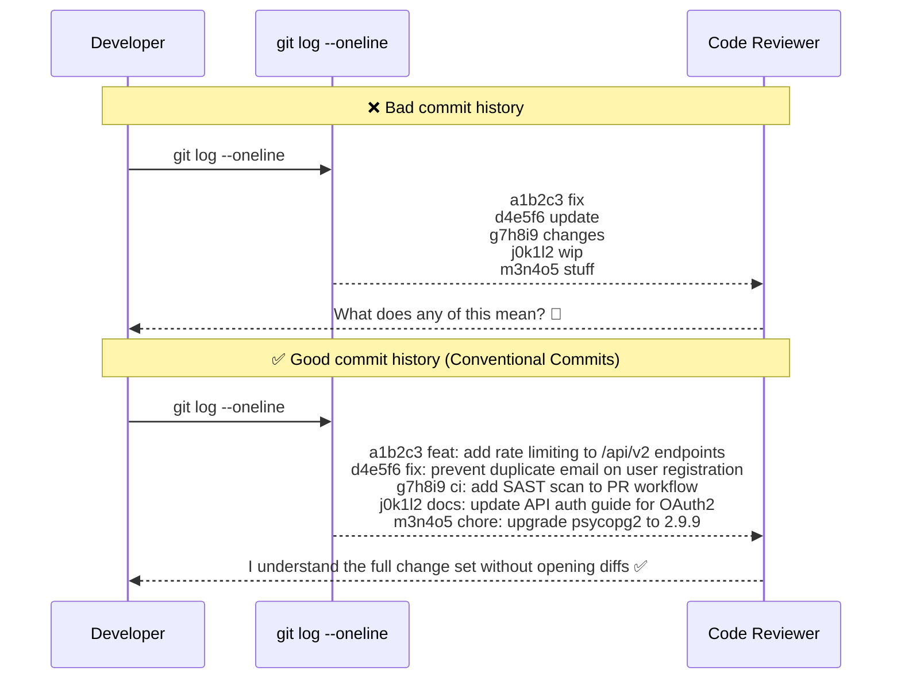

# 🌿 Git Interview Question 1 — Git Commit Messages


---

## ❓ The Question

> **"How do you include a commit message in Git? Why are descriptive commit messages important?"**

**Alternate phrasings you may hear:**
- "What is the `-m` flag in `git commit` and when do you use it?"
- "What makes a good Git commit message?"
- "Have you followed any commit message conventions in your team?"
- "What is Conventional Commits and why do teams adopt it?"
- "How do Git commit messages help in code reviews and incident investigations?"
- "What happens if you forget to include a commit message?"

---

## 🎯 Why Interviewers Ask This

This question seems simple but is a strong signal of professional Git maturity. Interviewers ask this to assess:

- **Communication discipline**: Do you treat commit history as documentation, or as a personal scratch pad?
- **Team collaboration awareness**: Have you experienced the pain of reviewing a repo full of "fix", "update", "wip" messages?
- **Convention knowledge**: Are you aware of standards like Conventional Commits that enable automation (CHANGELOG generation, semantic versioning, CI triggers)?
- **Code review efficiency**: Do you understand that good commit messages reduce review time by giving context before the reviewer reads a single line of diff?

> 💡 **Instant win**: Most candidates say "I use `git commit -m` to add a message." You stand out by explaining Conventional Commits format, why the subject line should be 50 characters, and how good messages enable `git bisect`, automated CHANGELOGs, and faster incident postmortems.

---

## 📖 Key Terminologies

| Term | Meaning |
|---|---|
| **Commit** | A snapshot of staged changes saved permanently to the repository's history |
| **Commit message** | Human-readable description attached to a commit explaining what changed and why |
| **`-m` flag** | Inline flag to pass a short commit message directly in the terminal |
| **Subject line** | The first line of a commit message — should be ≤ 50 characters, imperative mood |
| **Body** | Optional extended explanation after a blank line — explains *why* not *what* |
| **Footer** | Optional section for metadata — issue references, breaking change notices, co-authors |
| **Conventional Commits** | A specification for structured commit messages — enables automation and semantic versioning |
| **`git log`** | Command to browse the commit history and their messages |
| **`git bisect`** | Binary search through commit history to find which commit introduced a bug — relies heavily on clear messages |
| **Semantic versioning (semver)** | Version numbering scheme (MAJOR.MINOR.PATCH) that can be automated from Conventional Commit types |
| **CHANGELOG** | Auto-generated release notes derived from Conventional Commits |
| **Amend** | `git commit --amend` — modify the most recent commit message or content before pushing |

---

## 🗣️ How to Answer (Structured)

**1. Cover the basic syntax:**

> "You include a commit message using the `-m` flag: `git commit -m 'your message here'`. Without `-m`, Git opens your configured editor — usually Vim or Nano — where you can write a multi-line message with a subject and body."

**2. Explain why messages matter:**

> "Commit messages are the primary way developers communicate intent across time. When I'm debugging an incident at 2am and running `git log`, a commit message like 'fix: prevent null pointer in payment processor when currency is missing' tells me immediately whether this commit is relevant. A message like 'fix bug' tells me nothing — I have to open the diff and reverse-engineer the intent."

**3. Describe good vs bad message anatomy:**

> "A good commit message follows the 50/72 rule — the subject line is 50 characters max, written in imperative mood ('add', 'fix', 'update' — not 'added' or 'adding'), followed by a blank line, then a body wrapped at 72 characters explaining *why* the change was made. The subject is what shows in `git log --oneline` and GitHub PR previews. The body is for future-you at 2am."

**4. Mention Conventional Commits if experienced:**

> "In my team we follow the Conventional Commits specification — prefix every commit with a type like `feat:`, `fix:`, `docs:`, `chore:`, `ci:`, `refactor:`. This lets us auto-generate CHANGELOGs with `conventional-changelog`, and our CI pipeline automatically bumps the semantic version — `feat` bumps MINOR, `fix` bumps PATCH, anything with `BREAKING CHANGE` in the footer bumps MAJOR."

---

## 🔐 Security Perspective (DevSecOps)

Clear commit messages are a security and compliance tool:

- **Audit trail**: In regulated environments (SOC 2, ISO 27001, PCI-DSS), the commit history is part of the change management audit trail. Vague messages fail audit reviews.
- **Incident response**: During a security incident, `git log --since="2 days ago"` with clear messages pinpoints suspicious changes in minutes vs hours.
- **Secret exposure**: If a developer accidentally commits a secret, a clear commit message like `add API keys for testing` makes it trivially detectable in `git log` — auditors and SAST tools scan commit messages too.
- **`git blame` forensics**: Security reviews trace when and why security-critical code changed — clear messages make this fast.

```bash
# Audit commits touching secrets-related files in last 30 days
git log --since="30 days ago" --all -- '*.env' 'secrets/*' '*config*' \
  --format="%h %ad %an: %s" --date=short

# Find commits that might have accidentally included credentials
git log --all --oneline | grep -i -E "key|token|password|secret|credential"
```

---

## 🖼️ Visuals

### Anatomy of a Well-Structured Commit Message



---

### Good vs Bad Commit Messages



---

### Conventional Commits — Type Decision Flow



---

### Git Log Readability — The Difference Matters



---

## ⚙️ Hands-On: Git Commit Message Commands

### Basic Commit with Message

```bash
# Stage changes
git add .
git add src/payment/processor.py    # stage specific file

# Commit with inline message
git commit -m "fix: resolve null pointer in payment processor"

# Commit with subject + body (multi-line using -m twice)
git commit \
  -m "feat: add OAuth2 login with GitHub" \
  -m "Replace username/password login with GitHub OAuth2.
Users in orgs with SSO enforcement could not log in.
Adds GitHubStrategy to passport config.

Fixes #1234"

# Open editor for a full multi-line message
git commit     # opens $EDITOR (Vim, Nano, VS Code, etc.)
```

### Amending the Last Commit Message

```bash
# Fix a typo in the last commit message (before pushing)
git commit --amend -m "feat: add OAuth2 login with GitHub"

# Open editor to edit last commit message
git commit --amend

# Amend without changing message (add forgotten file)
git add forgotten-file.py
git commit --amend --no-edit
```

### Viewing Commit History

```bash
# Compact one-line view (subject only)
git log --oneline

# Full message with author, date, and body
git log

# Last N commits
git log -5

# With diff stats
git log --stat

# Search commit messages
git log --grep="OAuth"
git log --grep="fix" --oneline

# Commits by author
git log --author="Bhargav" --oneline

# Commits in a date range
git log --since="2025-01-01" --until="2025-01-31" --oneline

# Visual branch graph
git log --oneline --graph --decorate --all
```

### Git Bisect — Why Good Messages Matter

```bash
# Binary search through history to find bug-introducing commit
git bisect start
git bisect bad                  # current commit is broken
git bisect good v1.5.0          # this tag was known good

# Git checks out midpoint commit
# You test the app — is it broken?
git bisect bad    # or: git bisect good

# Git narrows down — repeat until found:
# "d4e5f6 is the first bad commit"
# d4e5f6: fix: prevent duplicate email on user registration
# → Instantly know the context of the bug-introducing commit

git bisect reset  # return to HEAD
```

### Setting Up Commit Message Templates

```bash
# Create a team commit message template
cat > ~/.gitmessage.txt << 'EOF'
# <type>(<scope>): <subject>  ← 50 chars max
# |<---- 50 chars ---->|
# type: feat|fix|docs|style|refactor|test|ci|chore|perf|revert
# scope: optional, e.g. (auth), (api), (db)

# Body: explain WHY (not what). Wrap at 72 chars.
# |<---- 72 chars ------------------------------------------------->|

# Footer: issue refs, breaking changes, co-authors
# Fixes #123
# BREAKING CHANGE: description
# Co-authored-by: Name <email>
EOF

# Set as default commit template
git config --global commit.template ~/.gitmessage.txt

# Set preferred editor (VS Code)
git config --global core.editor "code --wait"
```

### Enforcing Commit Messages with Git Hooks

```bash
# .git/hooks/commit-msg — enforces Conventional Commits format
#!/bin/sh
COMMIT_MSG_FILE=$1
COMMIT_MSG=$(cat "$COMMIT_MSG_FILE")

# Pattern: type(scope): subject
PATTERN="^(feat|fix|docs|style|refactor|test|ci|chore|perf|revert)(\(.+\))?: .{1,50}"

if ! echo "$COMMIT_MSG" | grep -qE "$PATTERN"; then
  echo "❌ Invalid commit message format."
  echo "   Expected: <type>(<scope>): <subject>"
  echo "   Example:  feat(auth): add GitHub OAuth2 login"
  echo "   Types: feat|fix|docs|style|refactor|test|ci|chore|perf|revert"
  exit 1
fi
```

```bash
# Using commitlint (Node.js) — industry standard hook
npm install --save-dev @commitlint/cli @commitlint/config-conventional

# commitlint.config.js
module.exports = { extends: ['@commitlint/config-conventional'] };

# With Husky pre-commit framework
npx husky add .husky/commit-msg 'npx --no -- commitlint --edit "$1"'
```

---

## 📄 Conventional Commits — Full Reference

### Format

```
<type>[optional scope][optional !]: <description>

[optional body]

[optional footer(s)]
```

### Type Reference

| Type | Semver Bump | Use When |
|---|---|---|
| `feat` | MINOR | Adding a new feature visible to users |
| `fix` | PATCH | Fixing a bug visible to users |
| `feat!` / `fix!` | MAJOR | Any breaking API or behavior change |
| `docs` | None | Documentation only |
| `style` | None | Formatting, whitespace — no logic change |
| `refactor` | None | Code restructure — no feature or bug change |
| `perf` | PATCH | Performance improvement |
| `test` | None | Adding or updating tests |
| `ci` | None | CI/CD pipeline changes |
| `chore` | None | Build tools, dependency updates, non-src changes |
| `revert` | Varies | Reverting a previous commit |

### Real-World Examples

```bash
# Feature with scope
git commit -m "feat(auth): add OAuth2 login with GitHub"

# Bug fix referencing issue
git commit -m "fix(payment): prevent null pointer when currency is missing

The payment processor was throwing a NullPointerException when
the 'currency' field was absent from the request body. Added
null check with default to USD.

Fixes #1234"

# Breaking change
git commit -m "feat!: rename /api/v1/users to /api/v2/accounts

BREAKING CHANGE: The /users endpoint has been removed.
All clients must update to /accounts. See migration guide
in docs/api-migration.md"

# CI change
git commit -m "ci: add Trivy vulnerability scan to PR workflow"

# Dependency bump
git commit -m "chore: upgrade Django from 4.2.0 to 4.2.18 (security)"

# Docs only
git commit -m "docs: add architecture decision record for event sourcing"

# Revert with reason
git commit -m "revert: feat(auth): add OAuth2 login with GitHub

Reverts commit a1b2c3. OAuth2 provider is down in EU region,
reverting until failover strategy is in place.

See incident INC-2024-089."
```

---

## ⚠️ Common Gotchas

| Gotcha | Problem | Fix |
|---|---|---|
| **Vague messages** | `fix bug`, `update`, `wip` — unusable history | Describe what changed AND why in subject line |
| **Past tense subject** | `fixed the login bug` — inconsistent with Git convention | Use imperative: `fix: resolve login redirect loop` |
| **Subject > 50 chars** | Truncated in `git log --oneline`, GitHub PR view | Keep subject ≤ 50 chars; move detail to body |
| **Forgetting the blank line** | Body runs into subject — `git log` displays incorrectly | Mandatory blank line between subject and body |
| **No body when needed** | Complex change with no explanation is impossible to review later | If `why` is non-obvious, always add a body |
| **Amending pushed commits** | `git commit --amend` after push rewrites history — causes conflicts for teammates | Only amend commits not yet pushed to shared branches |
| **Committing unrelated changes** | One big commit mixes feature + bug fix + refactor | Atomic commits — one logical change per commit |

---

## ✅ Best Practices (2024)

1. **Adopt Conventional Commits** in team projects — enables automated CHANGELOG, semantic versioning, and CI triggers.
2. **Atomic commits** — each commit should represent one logical change. If `git log --oneline` reads like a feature list, your commits are appropriately scoped.
3. **Subject line = imperative mood, ≤ 50 chars** — "add", "fix", "remove" — not "added", "adding", "I added".
4. **Body explains WHY** — the diff shows *what* changed; the body explains the reasoning, context, or trade-off that future maintainers need.
5. **Reference issues in footer** — `Fixes #1234` auto-closes GitHub issues on merge; `Refs #5678` links without closing.
6. **Use `--amend` freely before pushing** — clean up typos and forgotten files before the commit reaches the shared branch.
7. **Enforce standards with hooks** — `commitlint` + Husky makes the convention automatic, not optional.

---

## 🌍 Real-World Scenario

**Scenario**: Your team has a production incident — users can't check out in the e-commerce app. The on-call engineer runs `git log` to find what changed in the last 24 hours:

**Before good commit practices:**
```
git log --oneline --since="24 hours ago"
# a1b2c3 fix
# d4e5f6 update
# g7h8i9 stuff
# j0k1l2 wip2
# → Engineer must open every diff. 45-minute investigation.
```

**After good commit practices:**
```
git log --oneline --since="24 hours ago"
# a1b2c3 feat(checkout): add promo code validation before payment
# d4e5f6 refactor(cart): extract discount calculation to CartService
# g7h8i9 chore: upgrade stripe-java SDK from 23.1.0 to 24.0.0
# j0k1l2 fix(auth): correct session timeout from 30s to 30min

# → Engineer immediately suspects g7h8i9 (major SDK version bump)
# → git show g7h8i9 → confirms Stripe SDK breaking change in v24
# → git revert g7h8i9 → incident resolved in 8 minutes
```

The difference: 45 minutes vs 8 minutes. That is the value of descriptive commit messages under incident pressure.

---

## 🔄 Commit Message vs Other Git Concepts

| Concept | Purpose | Command |
|---|---|---|
| **Commit message** | Human context for a change snapshot | `git commit -m "..."` |
| **Branch name** | Context for a feature/fix in progress | `git checkout -b feat/oauth-login` |
| **Tag** | Mark a specific release point | `git tag -a v2.1.0 -m "Release 2.1.0"` |
| **PR/MR description** | Broader context for a batch of commits | GitHub/GitLab UI |
| **CHANGELOG** | Aggregated release notes | Auto-generated from Conventional Commits |
| **`git notes`** | Attach metadata to commits post-hoc | `git notes add -m "Deployed to prod"` |

---

## 📋 Quick Reference Cheat Sheet

```bash
# --- Committing ---
git commit -m "feat: add OAuth2 login"                    # inline message
git commit -m "fix: resolve null pointer" -m "Body here"  # subject + body
git commit                                                  # open editor
git commit --amend -m "corrected message"                  # fix last message
git commit --amend --no-edit                               # add file to last commit

# --- Viewing History ---
git log                          # full log
git log --oneline                # compact subject only
git log --oneline -10            # last 10
git log --grep="feat"            # search messages
git log --author="Bhargav"       # by author
git log --since="1 week ago"     # by date
git log --stat                   # with file change counts
git log --oneline --graph --all  # visual branch tree

# --- Conventional Commit Types ---
# feat | fix | docs | style | refactor | test | ci | chore | perf | revert
# Breaking: append ! or add BREAKING CHANGE footer
```

---

## 🧠 Summary

| Concept | One-Liner |
|---|---|
| **`git commit -m`** | Inline flag to attach a message to the commit snapshot |
| **Why messages matter** | Commit history = living documentation; vague messages = useless history under incident pressure |
| **Subject line rules** | ≤ 50 chars, imperative mood, no period — "add", not "added" |
| **Body** | Explains WHY the change was made — mandatory for non-obvious changes |
| **Footer** | Issue references (`Fixes #123`), breaking change notices, co-authors |
| **Conventional Commits** | Structured format (`feat/fix/chore:`) enabling CHANGELOG automation and semver bumps |
| **`--amend`** | Fix the last commit message or add a forgotten file — safe before pushing |
| **commitlint + Husky** | Enforce commit message format automatically via Git hooks |
| **Incident value** | Clear commit messages reduce MTTR — `git log` becomes a diagnostic tool |
