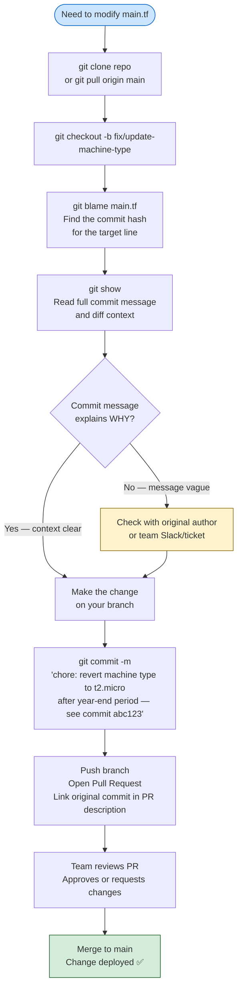
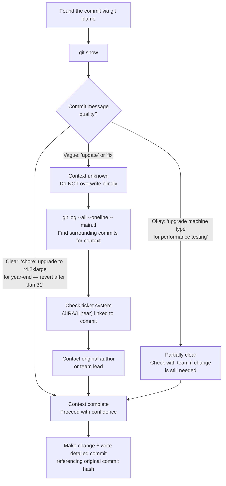
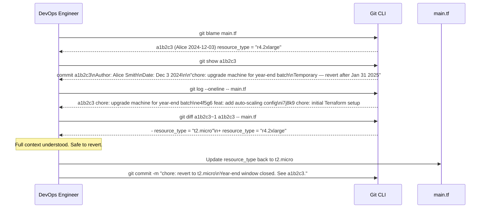

# 🌿 Git Interview Question 2 — Managing IaC Changes with Git Blame & History


---

## ❓ The Question

> **"You need to update a Terraform file (`main.tf`) that was last changed 30 days ago. How do you approach this change responsibly?"**

**Alternate phrasings you may hear:**
- "How do you investigate the history of a file in Git before modifying it?"
- "What is `git blame` and when do you use it?"
- "A colleague changed the machine type in a Terraform file a month ago. How do you find out why before overwriting it?"
- "How would you trace who last modified a specific line of infrastructure code?"
- "Walk me through your process for making changes to a shared IaC repository."
- "How do you prevent accidentally reverting an intentional change when updating infrastructure files?"

---

## 🎯 Why Interviewers Ask This

This question tests a critical DevOps engineering skill: **responsible change management in shared codebases**. Interviewers ask this to assess:

- **Collaborative instincts**: Do you blindly overwrite, or do you investigate context first?
- **Git tooling depth**: Do you know `git blame`, `git log -p`, `git show`, and how to use them effectively?
- **IaC discipline**: Infrastructure changes have real production consequences — overwriting a carefully chosen instance type without context can cause outages or cost spikes.
- **Workflow maturity**: Do you branch before making changes? Do you write meaningful commit messages explaining *why*?

> 💡 **Instant win**: Most candidates say "I'd just change the value and commit." You stand out by describing the full investigation — `git blame` to find the commit, `git show <hash>` to read the message and diff, checking with the author if needed, and documenting your reasoning in the new commit message.

---

## 📖 Key Terminologies

| Term | Meaning |
|---|---|
| **`git blame`** | Annotates each line of a file with the commit hash, author, and timestamp that last modified it |
| **`git log -p`** | Shows full patch (diff) for each commit — the most detailed history view |
| **`git log --follow`** | Tracks history across file renames — critical for IaC files that get reorganized |
| **`git show <hash>`** | Displays the full details (message, diff, author, date) of a specific commit |
| **`git diff`** | Shows differences between commits, branches, or working tree vs staged |
| **`git annotate`** | Alias for `git blame` — same output, alternative syntax |
| **Branch isolation** | Creating a feature/fix branch before making changes — prevents committing directly to `main` |
| **Infrastructure-as-Code (IaC)** | Defining infrastructure (VMs, networks, DBs) in version-controlled code files (Terraform, Pulumi, CloudFormation) |
| **`main.tf`** | Primary Terraform configuration file — contains resource definitions, providers, and variable bindings |
| **Commit hash** | SHA-1 identifier uniquely representing a specific commit — used with `git show`, `git revert`, `git cherry-pick` |
| **`git log --since / --until`** | Filter commits by date range — useful for auditing changes within a specific window |
| **Working tree** | The actual files in your local directory — what you see and edit |

---

## 🗣️ How to Answer (Structured)

A strong answer to this question demonstrates a systematic, investigative mindset. Here is the proven workflow:

**1. Don't just edit — investigate first:**

> "Before I touch any line in a shared IaC file, my first question is: why was it changed to this value in the first place? That context determines whether my proposed change is safe or whether I'm about to undo a deliberate decision."

**2. Clone and branch:**

> "I clone the repository if I don't have it locally, and immediately create a new branch. I never make changes directly on `main` for infrastructure code — `git checkout -b fix/update-machine-type-to-t2micro`."

**3. Use `git blame` to find the origin commit:**

> "I run `git blame main.tf` and look at the line I want to change. `git blame` shows me the commit hash, author name, and timestamp for that exact line. So I can see it was changed by Alice on December 3rd with commit `a1b2c3`."

**4. Use `git show` to read the full commit:**

> "I run `git show a1b2c3` to read Alice's commit message and see the full diff. If her message says 'chore: upgrade to r4.2xlarge for year-end reporting — revert after Jan 31' — then I know the context completely and can proceed confidently. If the message just says 'update', I need to check with Alice before overwriting."

**5. Make the change and document it:**

> "Once I understand the context, I make the update and write a detailed commit message: `chore: revert machine type to t2.micro after year-end reporting window — r4.2xlarge was temporary per Alice's commit a1b2c3`. Future engineers will have the full story."

**6. Open a PR:**

> "I push the branch and open a Pull Request. The PR description links back to the original commit and explains the rationale. Team review catches anything I may have missed."

---

## 🔐 Security Perspective (DevSecOps)

Investigating change history before modifying IaC files is not just good practice — it is a security and compliance requirement:

- **Change Management Audit**: SOC 2 and ISO 27001 require documented evidence of who changed infrastructure and why. `git blame` + `git log` is your audit trail.
- **Accidental Privilege Escalation**: An IaC change that "accidentally" reverts a security hardening (e.g., removes `--no-public-ip`) could expose infrastructure. Investigation reveals whether the original value was a security control.
- **Cost Control**: Overwriting a cost-optimized instance type without context can spike cloud bills instantly.
- **Blast Radius Awareness**: `git log --stat main.tf` shows how frequently this file changes and how many resources it controls — important before any modification.

```bash
# Security audit — who changed security-critical IaC files in last 90 days?
git log --since="90 days ago" \
  --format="%h %ad %an: %s" \
  --date=short \
  -- "*.tf" "*.yaml" "security*"

# Check if a specific security setting was ever changed
git log -S "no_public_ip = false" --all --oneline -- main.tf
```

---

## 🖼️ Visuals

### Reference Diagrams (Source: KodeKloud)


*The question scenario: a `main.tf` file with machine type changed 30 days ago — should you simply update it, or investigate the history first?*


*Step-by-step workflow: `git clone → create branch → review GitHub UI → git blame → analyze commit messages → make changes → commit`.*

---

### Responsible IaC Change Workflow



---

### `git blame` Output — Reading It

```mermaid
flowchart LR
    subgraph BlameOutput["git blame main.tf — annotated output"]
        direction TB
        L1["a1b2c3d (Alice Smith  2024-12-03) resource_type = 'r4.2xlarge'"]
        L2["e4f5g6h (Bob Jones   2024-11-01) instance_count = 3"]
        L3["i7j8k9l (Alice Smith  2024-11-01) region = 'us-east-1'"]
        L4["m0n1o2p (Carol Wu    2024-10-15) tags = { env = 'prod' }"]
    end

    subgraph Reading["What each column means"]
        direction TB
        C1["a1b2c3d → Commit hash\n→ use with git show a1b2c3d"]
        C2["Alice Smith → Author\n→ who last modified this line"]
        C3["2024-12-03 → Date\n→ when it was last changed"]
        C4["resource_type = ... → The actual line content"]
    end

    BlameOutput --> Reading
```



---

### Investigation Decision Tree



---

### `git log` Filtering for History Investigation



---

## ⚙️ Hands-On: Git History Investigation Commands

### Step 1 — Clone and Branch

```bash
# Clone the repository
git clone https://github.com/myorg/infrastructure.git
cd infrastructure

# Always check current state before branching
git log --oneline -5
git status

# Create an isolated branch for your change
git checkout -b fix/update-machine-type-t2micro

# Or with Git 2.23+
git switch -c fix/update-machine-type-t2micro
```

### Step 2 — `git blame`: Who Changed What and When

```bash
# Full blame — shows hash, author, date, line content
git blame main.tf

# Example output:
# a1b2c3d4 (Alice Smith   2024-12-03 09:15:42 +0530 12)   instance_type = "r4.2xlarge"
# e5f6g7h8 (Bob Jones     2024-11-01 14:22:11 +0530 13)   instance_count = 3
# i9j0k1l2 (Alice Smith   2024-11-01 14:22:11 +0530 14)   region         = "us-east-1"

# Blame with line numbers displayed
git blame -n main.tf

# Blame for specific line range only (lines 10–20)
git blame -L 10,20 main.tf

# Blame ignoring whitespace changes
git blame -w main.tf

# Blame tracking renames (if file was moved)
git blame -M main.tf
git blame -C main.tf   # detect lines copied from other files
```

### Step 3 — `git show`: Full Context of the Commit

```bash
# Show full commit details — message, author, diff
git show a1b2c3d4

# Show only the commit message (no diff)
git show a1b2c3d4 --no-patch

# Show only the diff (no header)
git show a1b2c3d4 --stat

# Show changes to a specific file in that commit
git show a1b2c3d4 -- main.tf

# Formatted one-liner
git show a1b2c3d4 --format="%h %an %ad: %s" --no-patch --date=short
```

### Step 4 — `git log`: Full File History

```bash
# All commits that touched main.tf
git log --oneline -- main.tf

# With full diff for each commit
git log -p -- main.tf

# With number of lines changed
git log --stat -- main.tf

# Follow across renames
git log --follow --oneline -- terraform/main.tf

# Filter by date
git log --since="60 days ago" --oneline -- main.tf

# Filter by content change (pickaxe search)
# Find commits that added or removed "r4.2xlarge"
git log -S "r4.2xlarge" --oneline -- main.tf

# Find commits whose diff matches a regex
git log -G "instance_type\s*=" --oneline -- main.tf

# Find commits by a specific author
git log --author="Alice" --oneline -- main.tf
```

### Step 5 — `git diff`: Compare Versions

```bash
# What changed in a specific commit (vs its parent)
git diff a1b2c3d4~1 a1b2c3d4 -- main.tf

# Difference between two commits
git diff e5f6g7h8 a1b2c3d4 -- main.tf

# What changed between 30 days ago and now
git diff "main@{30 days ago}" main -- main.tf

# What's in your working tree vs last commit
git diff HEAD -- main.tf

# What's staged vs last commit
git diff --cached -- main.tf
```

### Step 6 — Make the Change and Commit with Context

```bash
# Edit the file
vim main.tf
# Change: instance_type = "r4.2xlarge" → instance_type = "t2.micro"

# Stage and verify
git add main.tf
git diff --cached                 # review staged changes one more time

# Commit with full context
git commit -m "chore: revert instance_type to t2.micro

Year-end batch processing window closed (was Jan 31 2025).
Reverting the temporary r4.2xlarge upgrade from commit a1b2c3d4
(Alice Smith, 2024-12-03) back to t2.micro for cost optimization.

Monthly cost impact of r4.2xlarge vs t2.micro: ~\$620/month.

Refs: INC-2025-012"

# Push branch
git push origin fix/update-machine-type-t2micro
```

### Step 7 — GitHub UI: Git Blame in Browser

```
In GitHub:
1. Navigate to the file: terraform/main.tf
2. Click the "Blame" button (top-right of file view)
3. Each line shows: commit hash (clickable) | author | time ago
4. Click a commit hash → see full commit message and diff in context
5. Use "View blame prior to this change" to go back further in history
```

---

## 📄 Real Scenario — Terraform IaC Change Investigation

```hcl
# main.tf — current state
resource "aws_instance" "app_server" {
  ami           = "ami-0c55b159cbfafe1f0"
  instance_type = "r4.2xlarge"         # ← target line to investigate
  count         = 3

  tags = {
    Name        = "app-server"
    Environment = "production"
  }
}
```

```bash
# Investigation flow:
$ git blame main.tf | grep instance_type
a1b2c3d4 (Alice Smith  2024-12-03 09:15:42)   instance_type = "r4.2xlarge"

$ git show a1b2c3d4
commit a1b2c3d4
Author: Alice Smith <alice@example.com>
Date:   Tue Dec 3 09:15:42 2024

    chore: temporarily upgrade to r4.2xlarge for year-end ETL batch

    Our annual reporting job requires significantly more memory (256GB RAM)
    than the standard t2.micro provides. Upgrading for Dec 15 – Jan 31
    batch window. Remember to revert after Jan 31 to avoid unnecessary cost.

    Monthly cost delta: ~$620/month extra.

    Refs: INFRA-4521

diff --git a/main.tf b/main.tf
-  instance_type = "t2.micro"
+  instance_type = "r4.2xlarge"
```

**Outcome**: The investigation reveals this was intentional and time-bounded. The engineer can now safely revert with full context documented in the new commit.

---

## 📄 Python File Example — `git blame` for Application Code

```python
# calculator.py — current state
def calculator(a, b):
    result = a + b
    print(result)

def tax():
    print("tax")
```

```bash
$ git blame calculator.py
^abc1234 (Bob Jones    2024-09-15)  def calculator(a, b):
^abc1234 (Bob Jones    2024-09-15)      result = a + b
f7e6d5c4 (Alice Smith  2024-10-22)      print(result)
^abc1234 (Bob Jones    2024-09-15)
b3c2d1e0 (Carol Wu     2024-11-10)  def tax():
b3c2d1e0 (Carol Wu     2024-11-10)      print("tax")

# Hover over f7e6d5c4 in GitHub UI or run:
$ git show f7e6d5c4 --no-patch
# Author: Alice Smith
# Date:   Oct 22 2024
# "refactor: add print output to calculator for debugging"
# → Now you know Alice added print() for debugging — may be intentional or temporary
```

---

## ⚠️ Common Gotchas

| Gotcha | Problem | Fix |
|---|---|---|
| **Overwriting without investigation** | Reverting a security hardening or cost-optimization change silently | Always run `git blame` + `git show` before modifying any IaC line |
| **Committing to `main` directly** | One broken push breaks everyone's work and skips review | Always `git checkout -b` before making any change |
| **Blame shows only last modifier** | A line reformatted for style may hide the real logic author | Use `git log -S "value"` or `-G "pattern"` to find the semantic change |
| **File renamed — history lost** | `git blame newname.tf` shows no history before the rename | Use `git blame -M` or `git log --follow` to trace through renames |
| **Commit hash changes after rebase** | Referencing `a1b2c3` in a commit message — hash may not exist after rebase | Use `git log --grep` or issue tracker refs in addition to hashes |
| **Not pulling before branching** | Creating a branch off stale `main` causes avoidable merge conflicts | Always `git pull origin main` before `git checkout -b` |
| **`git diff` on wrong comparison** | `git diff main.tf` shows working tree vs staged — not what you want | Use `git diff HEAD -- main.tf` for working tree vs last commit |

---

## ✅ Best Practices (2024)

1. **Always investigate before modifying shared IaC** — `git blame` + `git show` is a 30-second habit that prevents 30-minute incidents.
2. **Branch first, always** — even for one-line changes in infrastructure code. Direct commits to `main` bypass review.
3. **Reference original commits in new commit messages** — future engineers should be able to trace the full context chain.
4. **Use `git log -S "pattern"`** to search for when a specific value was introduced — more reliable than blame for traced changes.
5. **Require meaningful commit messages in team policy** — the entire investigative workflow breaks down if commits say "update".
6. **Link commits to tickets** — `Refs: INFRA-4521` in the commit footer creates a searchable trail between code and decision documentation.
7. **Use `git log --follow`** for IaC files that get reorganized — Terraform modules are frequently moved between directories.

---

## 🌍 Real-World Scenario

**Scenario**: A DevOps engineer at a fintech company notices the production Terraform config uses `db.r5.4xlarge` for RDS. The cost report shows $8,000/month on that instance. The engineer wants to downsize it to `db.t3.medium`.

**Without investigation:**
```bash
# Just change the value and commit
sed -i 's/db.r5.4xlarge/db.t3.medium/' main.tf
git commit -m "update db instance type"
# → Deployed to production
# → Database OOM-kills under normal load within 2 hours
# → 4-hour outage while reverting
```

**With proper investigation:**
```bash
git blame main.tf | grep instance_class
# 9f8e7d6c (Sarah Chen  2024-08-15) instance_class = "db.r5.4xlarge"

git show 9f8e7d6c
# Author: Sarah Chen
# "perf: upgrade RDS to r5.4xlarge for in-memory processing
#  Our risk scoring model requires 128GB RAM — tested on staging.
#  Downgrading below r5.2xlarge will cause OOM under normal load.
#  Baseline analysis in Confluence: INFRA-3892"

# → Engineer reads this, checks with Sarah, understands the constraint
# → Explores right-sizing within r5 family instead
# → No outage. 2-week investigation leads to reserved instance purchase ($4,000/month saving)
```

---

## 🔄 Related Git Commands Summary

| Purpose | Command |
|---|---|
| Annotate every line with last modifier | `git blame <file>` |
| Full commit details + diff | `git show <hash>` |
| All commits touching a file | `git log --oneline -- <file>` |
| Full diffs in file history | `git log -p -- <file>` |
| Find when a value was introduced | `git log -S "value" -- <file>` |
| Find commits matching a pattern | `git log -G "regex" -- <file>` |
| History across file renames | `git log --follow -- <file>` |
| Compare two commits for a file | `git diff <hash1> <hash2> -- <file>` |
| Changes in working tree vs HEAD | `git diff HEAD -- <file>` |
| Blame across renames | `git blame -M <file>` |
| Blame a specific line range | `git blame -L 10,20 <file>` |

---

## 📋 Quick Reference Cheat Sheet

```bash
# --- Investigation Workflow ---
git clone <repo-url>
git pull origin main
git checkout -b fix/update-<description>

git blame main.tf                         # find who changed target line
git blame -L 12,15 main.tf               # specific line range
git show <hash>                           # full commit details
git show <hash> --no-patch               # message only, no diff

git log --oneline -- main.tf             # file history
git log -p -- main.tf                    # file history with diffs
git log --follow -- main.tf              # across renames
git log -S "r4.2xlarge" -- main.tf       # when value was introduced
git diff <hash>~1 <hash> -- main.tf      # what that commit changed

# --- Making the Change ---
# Edit file
git add main.tf
git diff --cached                         # verify staged changes
git commit -m "chore: revert to t2.micro
<body explaining why, referencing original commit hash>"

git push origin fix/update-<description>
# Open Pull Request
```

---

## 🧠 Summary

| Concept | One-Liner |
|---|---|
| **Core principle** | Never modify shared IaC without investigating why it is the way it is |
| **`git blame`** | Annotates each line with the last commit hash, author, and date — entry point for any investigation |
| **`git show <hash>`** | Reveals the full commit message and diff — answers the "why" question |
| **`git log -S "value"`** | Pickaxe search — finds the exact commit that introduced or removed a specific string |
| **`git log --follow`** | Tracks file history across renames — essential for evolving IaC structures |
| **Branch before changing** | `git checkout -b fix/branch-name` — every IaC change needs its own branch for review |
| **Document in commit message** | Reference the original commit hash and your reasoning — creates a traceable history chain |
| **GitHub Blame UI** | Visual `git blame` in browser — clickable commits, "View blame prior to this change" navigation |
| **DevSecOps value** | `git blame` + `git log` = live audit trail for IaC changes — satisfies SOC 2 change management evidence |
