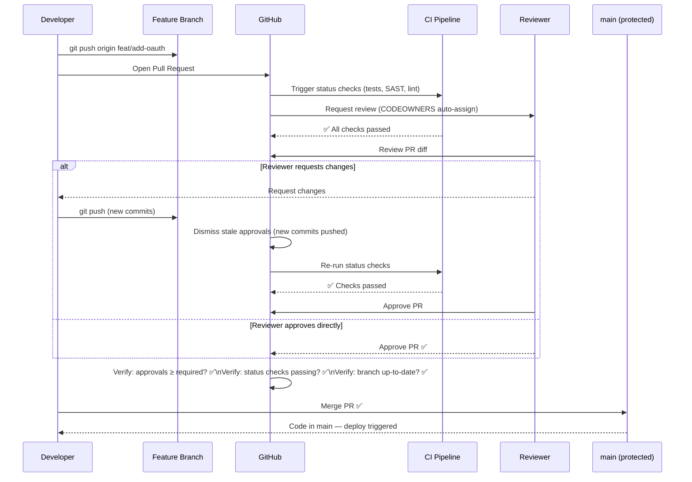
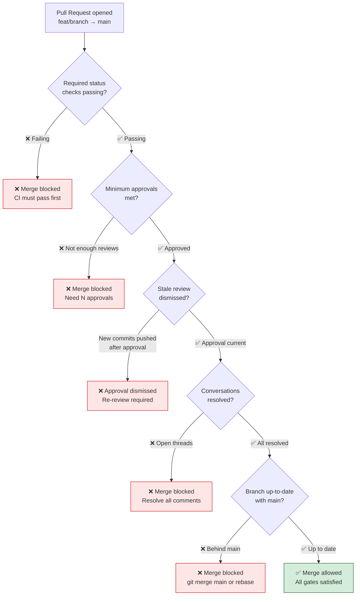
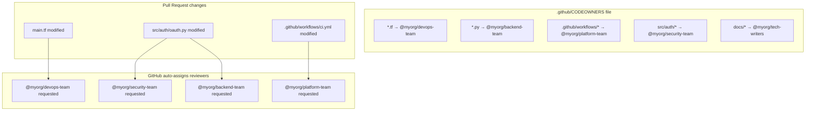

# 🌿 Git Interview Question 3 — Branch Protection Rules in GitHub


---

## ❓ The Question

> **"What is branch protection in GitHub and why is it important? How do you configure it?"**

**Alternate phrasings you may hear:**
- "How do you prevent developers from pushing directly to the `main` branch?"
- "What GitHub settings do you use to enforce code review before merging?"
- "Explain the pull request workflow and how branch protection enforces it."
- "What are required status checks in GitHub and how do they work?"
- "How does CODEOWNERS integrate with branch protection?"
- "What happens when a developer tries to force-push to a protected branch?"

---

## 🎯 Why Interviewers Ask This

Branch protection is a foundational DevOps practice that separates hobby projects from production-grade engineering. Interviewers ask this to check:

- **Process maturity**: Do you enforce peer review, or does anyone merge anything at any time?
- **CI/CD integration awareness**: Do you know how branch protection enforces passing CI checks before merge?
- **Security posture**: Can you explain why direct pushes to `main` are a security and stability risk?
- **Team workflow design**: Have you actually configured these rules, or are you describing them from a user's perspective?

> 💡 **Instant win**: Most candidates say "branch protection requires a code review before merging." You stand out by describing the full rule set — required reviewers, required status checks (CI tests), CODEOWNERS for automatic reviewer assignment, dismiss stale reviews, and how `--force-push` is blocked — and explaining *why* each rule exists.

---

## 📖 Key Terminologies

| Term | Meaning |
|---|---|
| **Branch protection rule** | A GitHub setting applied to a branch pattern that enforces specific requirements before code can be merged or pushed |
| **Pull Request (PR)** | A request to merge code from a feature branch into a target branch — the unit of review |
| **Required reviewers** | Minimum number of approving reviews a PR must receive before it can be merged |
| **Status check** | An external service (CI pipeline, SAST scanner) that reports pass/fail on a commit — can be required for merge |
| **Required status checks** | Branch protection setting that blocks merge until all specified checks pass |
| **CODEOWNERS** | A file that maps file/directory patterns to required reviewers — GitHub automatically requests review from them |
| **Signed commits** | Commits cryptographically signed with GPG or SSH key — proves author identity |
| **Force push** | `git push --force` — rewrites remote history. Branch protection can block this on protected branches |
| **Stale review dismissal** | Automatically dismisses PR approvals when new commits are pushed — prevents approving old code, then sneaking in bad code |
| **Merge queue** | GitHub feature (Enterprise/Teams) that serializes merges and runs CI on combined branch state before merging |
| **Branch pattern** | Glob pattern matching branch names for a rule — `main`, `release/*`, `v[0-9]*` |
| **Bypass list** | Accounts or apps that can bypass branch protection — should be empty or limited to automation |

---

## 🗣️ How to Answer (Structured)

**1. Define the problem branch protection solves:**

> "Without branch protection, any developer with write access to a repository can push directly to `main` at any time — no review, no CI check, no approval. In a team of 10 engineers, that's 10 people who could accidentally (or maliciously) push untested, unreviewed code straight to production. Branch protection adds a mandatory gate."

**2. Explain the core rules:**

> "The most important rules are: require a pull request before merging — nobody can push to `main` directly, everything must go through a PR; require a minimum number of approving reviews — typically 1 or 2 reviewers must approve; and require status checks to pass — the CI pipeline must be green before merge is allowed."

**3. Cover advanced settings:**

> "Beyond the basics, you also want to enable 'dismiss stale pull request approvals when new commits are pushed' — otherwise a developer can get approval on a clean diff and then push malicious code before merging. You should also enable 'restrict who can push to matching branches' and 'block force pushes' so history can't be rewritten."

**4. Mention CODEOWNERS:**

> "CODEOWNERS is a file in the repository root or `.github/` directory that maps paths to required reviewers. For example, infrastructure files like `*.tf` automatically require review from the DevOps team, and security-sensitive files require the security team — this is enforced by GitHub, not just convention."

**5. Cover how to configure it:**

> "You configure this in the repository Settings → Branches → Branch protection rules → Add rule. You enter the branch pattern — `main`, or `release/*` for all release branches — then tick the rules you want. It's not enabled by default; organizations must proactively set this up."

---

## 🔐 Security Perspective (DevSecOps)

Branch protection is a primary DevSecOps control:

| Security Control | Branch Protection Setting | Why It Matters |
|---|---|---|
| **Prevent unauthorized changes** | Require PR + minimum approvals | Malicious or accidental direct pushes to main are blocked |
| **Code review as security gate** | Required reviewers on sensitive paths (CODEOWNERS) | Security-critical code must be reviewed by security team |
| **Supply chain integrity** | Require signed commits | Cryptographically proves commits come from claimed author — prevents commit spoofing |
| **Immutable history** | Block force pushes | Prevents covering tracks — commit history cannot be rewritten on protected branches |
| **CI security scans** | Require SAST/secret scan status checks | Code with vulnerabilities or leaked secrets cannot be merged |
| **Compliance audit** | All changes must flow through PRs | Creates a complete, auditable record of every change for SOC 2 / ISO 27001 |

```yaml
# Example: GitHub Actions SAST as required status check
# .github/workflows/security.yml
name: Security Scan
on: [pull_request]
jobs:
  sast:
    runs-on: ubuntu-latest
    steps:
      - uses: actions/checkout@v4
      - name: Run Semgrep SAST
        uses: semgrep/semgrep-action@v1
        with:
          config: auto
      - name: Scan for secrets
        uses: trufflesecurity/trufflehog@main
        with:
          path: ./
          base: ${{ github.event.repository.default_branch }}
# This workflow's "sast" job becomes a required status check
```

---

## 🖼️ Visuals

### Reference Diagrams (Source: KodeKloud)


*A typical GitHub repository workflow: changes committed to a working branch, a pull request opened to merge into master/main, branch protection ensuring every PR is reviewed before merge.*


*GitHub Settings → Branches → Branch Protection Rules: configuring required pull requests, status checks, and other merge gates.*


*Extended branch protection options: requiring conversation resolution, signed commits, and linear history before merging.*

---

### Branch Protection Workflow — PR Lifecycle



---

### Branch Protection Rules — Decision Tree for Merge



---

### CODEOWNERS — Automatic Reviewer Assignment



---

## ⚙️ Hands-On: Configuring Branch Protection

### Via GitHub UI

```
1. Go to: https://github.com/<org>/<repo>/settings/branches
2. Under "Branch protection rules" → click "Add branch protection rule"
3. Branch name pattern: main   (or release/* for all release branches)

4. Check the following settings:

   ✅ Require a pull request before merging
      ✅ Require approvals: 2
      ✅ Dismiss stale pull request approvals when new commits are pushed
      ✅ Require review from Code Owners
      ✅ Require approval of the most recent reviewable push

   ✅ Require status checks to pass before merging
      ✅ Require branches to be up to date before merging
      Add status checks: [ci/tests, security/sast, lint/eslint]

   ✅ Require conversation resolution before merging

   ✅ Require signed commits

   ✅ Require linear history   (enforces squash or rebase merges — no merge commits)

   ✅ Do not allow bypassing the above settings
      (Removes admin bypass — even repo owners must follow rules)

   ✅ Restrict who can push to matching branches
      Add: [github-actions[bot], release-automation]

   ✅ Block force pushes
   ✅ Block deletions

5. Click "Create" or "Save changes"
```

### Via GitHub CLI (`gh`)

```bash
# Install GitHub CLI
brew install gh
gh auth login

# Create branch protection rule via CLI
gh api \
  --method PUT \
  /repos/myorg/myrepo/branches/main/protection \
  --field required_status_checks='{"strict":true,"contexts":["ci/tests","security/sast"]}' \
  --field enforce_admins=true \
  --field required_pull_request_reviews='{"required_approving_review_count":2,"dismiss_stale_reviews":true,"require_code_owner_reviews":true}' \
  --field restrictions=null \
  --field required_linear_history=true \
  --field allow_force_pushes=false \
  --field allow_deletions=false \
  --field block_creations=false \
  --field required_conversation_resolution=true

# View current protection rules
gh api /repos/myorg/myrepo/branches/main/protection | jq '.'

# Check if a branch is protected
gh api /repos/myorg/myrepo/branches/main | jq '.protected'
```

### Via Terraform (Infrastructure as Code)

```hcl
# Manage branch protection declaratively — no manual UI clicks
resource "github_branch_protection" "main" {
  repository_id = github_repository.myrepo.node_id
  pattern       = "main"

  enforce_admins                  = true   # admins must follow rules too
  require_signed_commits          = true
  required_linear_history         = true
  require_conversation_resolution = true
  allows_force_pushes             = false
  allows_deletions                = false

  required_pull_request_reviews {
    required_approving_review_count = 2
    dismiss_stale_reviews           = true
    require_code_owner_reviews      = true
    restrict_dismissals             = true
    dismissal_restrictions          = ["myorg/lead-engineers"]
  }

  required_status_checks {
    strict   = true           # branch must be up-to-date with main
    contexts = [
      "ci/tests",
      "security/sast",
      "lint/eslint",
    ]
  }

  restrict_pushes {
    push_allowances = [
      "myorg/release-automation",
    ]
  }
}

# Also protect release/* branches
resource "github_branch_protection" "release" {
  repository_id = github_repository.myrepo.node_id
  pattern       = "release/*"

  required_pull_request_reviews {
    required_approving_review_count = 1
    require_code_owner_reviews      = true
  }

  required_status_checks {
    strict   = true
    contexts = ["ci/tests"]
  }

  allows_force_pushes = false
  allows_deletions    = false
}
```

---

## 📄 CODEOWNERS File

```bash
# .github/CODEOWNERS (or CODEOWNERS in repo root / docs/)

# Default owners for everything not explicitly matched
*  @myorg/engineering-leads

# Terraform and infrastructure files — DevOps team must review
*.tf                          @myorg/devops-team
*.tfvars                      @myorg/devops-team
terraform/                    @myorg/devops-team

# CI/CD pipeline changes — platform team must review
.github/workflows/            @myorg/platform-team
.github/actions/              @myorg/platform-team
Dockerfile*                   @myorg/platform-team

# Authentication and authorization — security team must review
src/auth/                     @myorg/security-team
src/middleware/auth*          @myorg/security-team
**/permissions.py             @myorg/security-team

# Database migrations — data team must review
migrations/                   @myorg/data-team @myorg/backend-leads

# Specific high-value files
package.json                  @myorg/frontend-leads
requirements.txt              @myorg/backend-leads
go.mod                        @myorg/backend-leads

# Docs
docs/                         @myorg/tech-writers
*.md                          @myorg/tech-writers
```

```bash
# CODEOWNERS + branch protection = automatic enforcement
# If feat/oauth-login touches src/auth/oauth.py:
# → GitHub automatically requests review from @myorg/security-team
# → "Require review from Code Owners" rule prevents merge until security team approves
# → No manual process, no chance of forgetting
```

---

## 📄 Required Status Checks — CI Integration

```yaml
# .github/workflows/ci.yml
# These job names become the required status check context strings

name: CI

on:
  pull_request:
    branches: [main, release/*]

jobs:
  # Required check: "ci/tests"
  tests:
    name: ci/tests
    runs-on: ubuntu-latest
    steps:
      - uses: actions/checkout@v4
      - name: Run unit tests
        run: pytest --cov=src tests/
      - name: Upload coverage
        uses: codecov/codecov-action@v4

  # Required check: "security/sast"
  sast:
    name: security/sast
    runs-on: ubuntu-latest
    steps:
      - uses: actions/checkout@v4
      - name: Semgrep SAST scan
        uses: semgrep/semgrep-action@v1
      - name: Secret scanning
        uses: trufflesecurity/trufflehog@main
        with:
          base: ${{ github.event.pull_request.base.sha }}
          head: ${{ github.event.pull_request.head.sha }}

  # Required check: "lint/eslint"
  lint:
    name: lint/eslint
    runs-on: ubuntu-latest
    steps:
      - uses: actions/checkout@v4
      - name: Run ESLint
        run: npx eslint src/ --ext .js,.ts
```

```
In GitHub Settings → Branch Protection Rule:
✅ Require status checks to pass before merging
   ✅ Require branches to be up to date before merging
   Search and add:  ci/tests
                    security/sast
                    lint/eslint
```

---

## ⚠️ Common Gotchas

| Gotcha | Problem | Fix |
|---|---|---|
| **Not enforcing admins** | Repository admins bypass all protection rules — creates a backdoor | Enable "Do not allow bypassing the above settings" |
| **Status check not showing up** | Can't add check until the CI workflow has run at least once in the repo | Push a PR first to trigger the workflow, then add the check |
| **Stale review dismissal off** | Reviewer approves clean diff, developer pushes malicious code before merging | Always enable "Dismiss stale pull request approvals when new commits are pushed" |
| **CODEOWNERS not applied** | File exists but reviews not being auto-requested | Must enable "Require review from Code Owners" in branch protection settings |
| **Branch pattern too narrow** | Only protecting `main` but not `release/*` | Add separate rules for all long-lived protected branches |
| **Required check name mismatch** | CI job renamed but branch protection still references old name | Update branch protection rule whenever CI job names change |
| **Force push not blocked** | History can be rewritten on protected branch | Enable "Block force pushes" — no exceptions |
| **Branch not up-to-date** | `Strict` status checks off — tests pass on stale code | Enable "Require branches to be up to date before merging" |

---

## ✅ Best Practices (2024)

1. **Protect all long-lived branches** — `main`, `develop`, `release/*`, `hotfix/*` — not just `main`.
2. **Require at least 2 approvals for production-facing repos** — one reviewer can miss issues; two rarely both do.
3. **Always enable stale review dismissal** — the most commonly overlooked but critical security setting.
4. **Manage branch protection as IaC** — use Terraform `github_branch_protection` resource so rules are version-controlled and consistent across repos.
5. **Use CODEOWNERS for security-sensitive paths** — `src/auth/`, `*.tf`, `.github/workflows/` should auto-require specialized reviewers.
6. **Require linear history** — enforces squash or rebase merges, keeping `git log --oneline` readable and `git bisect` effective.
7. **Require signed commits** — especially for infrastructure repos — proves author identity via GPG or SSH signing.
8. **Add "Do not allow bypassing"** — even org admins should go through PR review for critical repos.

---

## 🌍 Real-World Scenario

**Scenario**: A startup's infrastructure repository had no branch protection. A developer, debugging a production issue at midnight, pushed an untested change directly to `main`. The change introduced a misconfigured security group that exposed port 22 (SSH) to `0.0.0.0/0`. The breach was discovered two days later during a routine audit.

**Post-incident branch protection setup:**

```
Rules enabled on main:
✅ Require PR — direct push to main now impossible
✅ Require 2 approvals — two pairs of eyes on every infra change
✅ Require CODEOWNERS review — *.tf requires @devops-team
✅ Require status checks:
   - terraform/plan (Terraform plan must succeed)
   - security/tfsec  (tfsec IaC security scanner)
   - security/checkov (Checkov policy checker)
✅ Dismiss stale reviews
✅ Block force pushes
✅ Require signed commits

Result:
- The midnight direct push would have been rejected
- Even with a PR, tfsec would have flagged the 0.0.0.0/0 security group rule
- Two reviewers would have caught it before merge
- Total exposure time: 0 days instead of 2
```

---

## 🔄 Branch Protection Across Different Platforms

| Platform | Feature | Configuration |
|---|---|---|
| **GitHub** | Branch protection rules | Settings → Branches → Add rule |
| **GitLab** | Protected branches | Settings → Repository → Protected Branches |
| **Bitbucket** | Branch permissions | Repository settings → Branch permissions |
| **Azure DevOps** | Branch policies | Project settings → Repositories → Policies |
| **All platforms** | Equivalent controls | Required reviewers, CI checks, force push blocking |

```yaml
# GitLab equivalent — .gitlab-ci.yml + protected branch config
# In GitLab UI: Settings → Repository → Protected Branches
# - Allowed to merge: Developers + Maintainers
# - Allowed to push: No one (force PR workflow)
# - Require approval: 2 approvals

# Azure DevOps equivalent — branch policy via Azure CLI
az repos policy approver-count create \
  --allow-downvotes false \
  --blocking true \
  --branch main \
  --creator-vote-counts false \
  --enabled true \
  --minimum-approver-count 2 \
  --repository-id <repo-id> \
  --org https://dev.azure.com/myorg \
  --project myproject \
  --reset-on-source-push true
```

---

## 📋 Quick Reference Cheat Sheet

```bash
# --- GitHub UI Path ---
# Settings → Branches → Branch protection rules → Add rule

# --- Key Settings to Always Enable ---
# ✅ Require a pull request before merging
#    ✅ Require N approvals (≥ 2 for production repos)
#    ✅ Dismiss stale reviews when new commits are pushed
#    ✅ Require review from Code Owners
# ✅ Require status checks to pass
#    ✅ Require branches to be up to date (strict mode)
#    Add: [ci/tests, security/sast, ...]
# ✅ Require conversation resolution
# ✅ Require signed commits
# ✅ Block force pushes
# ✅ Block deletions
# ✅ Do not allow bypassing (lock out admins too)

# --- GitHub CLI Commands ---
gh api /repos/ORG/REPO/branches/main/protection | jq '.'
gh api /repos/ORG/REPO/branches | jq '.[].protected'

# --- Terraform Resource ---
# resource "github_branch_protection" "main" { ... }

# --- CODEOWNERS location ---
# .github/CODEOWNERS  or  CODEOWNERS  or  docs/CODEOWNERS

# --- Test your setup ---
# Try: git push origin main  (should be rejected)
# Try: Open PR without approvals → Merge button grayed out
# Try: Open PR with failing CI → Merge button grayed out
```

---

## 🧠 Summary

| Concept | One-Liner |
|---|---|
| **Branch protection** | GitHub setting that enforces gates (reviews, CI checks) before any code reaches a protected branch |
| **Not default** | Must be explicitly configured in Settings → Branches → Branch protection rules |
| **Required approvals** | Minimum N reviewers must approve a PR — typically 1 for dev, 2 for production repos |
| **Required status checks** | CI jobs (tests, SAST, lint) must pass before merge is enabled — integrates pipeline as a merge gate |
| **Dismiss stale reviews** | New commits after approval invalidate the approval — prevents "approve clean, sneak in bad code" |
| **CODEOWNERS** | Maps file paths to required reviewers — security team auto-assigned to `src/auth/`, DevOps to `*.tf` |
| **Block force pushes** | Prevents `git push --force` on protected branches — history is immutable |
| **Enforce on admins** | "Do not allow bypassing" closes the admin backdoor — everyone follows the rules |
| **As IaC** | Manage via Terraform `github_branch_protection` — version-controlled, consistent across repos |
| **DevSecOps value** | All production changes auditable via PRs; security scans enforced before merge; no unauthorized deployments |
