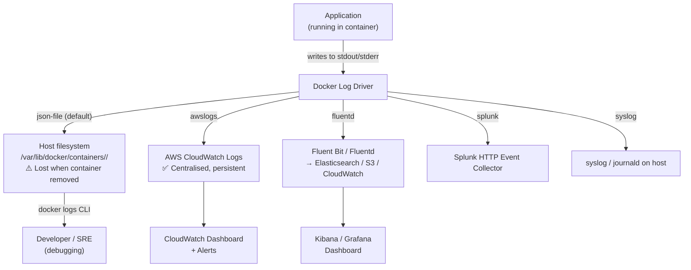

# Docker Question 1 — How Do You View and Filter Docker Container Logs?

> **Section:** Docker &nbsp;|&nbsp; **Topic:** Container Logging &nbsp;|&nbsp; **Level:** Beginner–Mid &nbsp;|&nbsp; **Frequency:** Very High
>
> _Part of the DevOps & DevSecOps Interview Preparation series._

---

## ❓ The Question

> **"How would you view the last 200 lines of logs from a running Docker container?"**

You may also hear this phrased as:

- "How do you debug a Docker container that's behaving unexpectedly?"
- "What command do you use to check what a container is doing right now?"
- "How do you follow live logs from a Docker container?"
- "How do you configure log retention for Docker containers in production?"
- "What log drivers does Docker support?"

---

## 🎯 Why Interviewers Ask This

This question looks deceptively simple — but it tests whether you actually work with Docker daily or just know the theory. Interviewers ask it to verify:

- You know the **core Docker CLI commands** used in real troubleshooting scenarios.
- You understand **log filtering flags** (`--tail`, `--since`, `--follow`) — not just `docker logs` bare.
- You know **log drivers** — where logs go in production (not just to the container's stdout).
- You connect logging to **observability** — logs are one of the three pillars alongside metrics and traces.
- For DevSecOps: you understand **log retention**, **centralised logging**, and **audit trail requirements**.

> **The instant win:** Answer the exact question first — `docker container logs --tail 200 <name>` — then expand to `--follow` for live streaming, log drivers for production, and centralised log aggregation. That arc shows practical depth.

---

## 📖 Key Terminologies

| Term | Plain-English Meaning |
|------|----------------------|
| **docker logs** | The CLI command to retrieve logs from a container's stdout/stderr. |
| **stdout / stderr** | Standard output (normal logs) and standard error (error logs). Docker captures both by default. |
| **`--tail`** | Flag to show only the last N lines of output. `--tail 200` shows the last 200 lines. |
| **`--follow` / `-f`** | Stream logs in real time — like `tail -f` on a file. New log lines appear as they are written. |
| **`--since`** | Show logs written after a specific time (e.g., `--since 30m` = last 30 minutes). |
| **`--until`** | Show logs written before a specific time. |
| **`--timestamps` / `-t`** | Add a timestamp to each log line. |
| **Log driver** | The mechanism Docker uses to store/forward container logs. Default: `json-file`. Alternatives: `awslogs`, `fluentd`, `splunk`, `syslog`. |
| **json-file driver** | Docker's default log driver — writes logs as JSON to files on the host under `/var/lib/docker/containers/<id>/`. |
| **awslogs driver** | Sends container logs directly to AWS CloudWatch Logs — no log agent needed. |
| **Fluentd / Fluent Bit** | Log aggregation agents that collect logs from containers and forward them to Elasticsearch, S3, CloudWatch, etc. |
| **Log rotation** | Automatically limiting log file size and count to prevent disk exhaustion. Configured via `--log-opt max-size` and `--log-opt max-file`. |

---

## 🗣️ How to Answer (Structured)

**1) Give the direct answer first:**
> "To view the last 200 lines from a container called `webapp`, I'd run:
> `docker container logs --tail 200 webapp`
> The `--tail` flag takes a number and returns only that many lines from the end of the log output."

**2) Mention live-follow for active debugging:**
> "If I'm actively debugging a problem and want to watch logs in real time, I'd add `--follow`:
> `docker container logs --tail 200 --follow webapp`
> This streams new log lines as they appear — like `tail -f` on a regular file. I'd use Ctrl+C to stop."

**3) Mention time-based filtering:**
> "For incidents where I know roughly when something happened, `--since` is more useful than `--tail`:
> `docker container logs --since 30m webapp`
> That gives me everything from the last 30 minutes without guessing a line count."

**4) Explain where logs go in production:**
> "In production we don't rely on `docker logs` — containers are ephemeral and local log files disappear with them. We configure a log driver to ship logs to a centralised system. On AWS I'd use the `awslogs` driver to send directly to CloudWatch Logs. In a Kubernetes environment, Fluent Bit runs as a DaemonSet and forwards logs to CloudWatch or Elasticsearch."

**5) Close with the DevOps/debugging mindset:**
> "When a container is misbehaving, `docker logs` is my first stop — but I combine it with `docker inspect` for config details and `docker stats` for resource usage. Together those three commands give me 90% of what I need to diagnose a container issue."

---

## 🔐 Security Perspective (DevSecOps)

Logs are not just a debugging tool — they are a **critical security asset**:

- **Centralise logs before the container dies** — Containers are ephemeral. If a container is compromised and then restarted, local logs are lost. Centralising via a log driver (awslogs, fluentd) ensures logs survive even if the container is destroyed — preserving the forensic trail.

- **Never log sensitive data** — Applications running in containers often log request/response bodies. If those contain passwords, tokens, PII, or credit card numbers, they'll appear in `docker logs` and in your log aggregation system. Audit what your containers log and ensure sensitive fields are masked or excluded.

- **Log retention for compliance** — SOC 2, PCI-DSS, and HIPAA each require specific log retention periods (90 days to 1 year). Configure CloudWatch Logs retention policies or S3 lifecycle rules to meet these requirements. The default `json-file` driver with no rotation is not compliant.

- **Log tampering detection** — In high-security environments, logs should be written to an immutable destination (e3.g., S3 with Object Lock, or a WORM-compliant log service) so they cannot be altered after a security incident. If an attacker gains container access and clears stdout, a centralised log system captures what they deleted.

- **Audit `docker logs` access** — In production, knowing *who* ran `docker logs` on a sensitive container is itself an audit requirement. Docker daemon socket access should be controlled (only admins), and access should be logged via auditd on the host.

- **Log injection attacks** — If user input can flow into log messages, an attacker can inject fake log lines (log forgery) or exploit log parsers (e.g., the Log4Shell vulnerability — `${jndi:...}` in a logged field). Sanitise user input before logging it.

> **One-liner for the room:** *"`docker logs` is for debugging in development. In production, every container log should be flowing to a centralised, tamper-evident system before the container even thinks about restarting."*

---

## 🖼️ Visuals

### Mermaid — Docker Logging Architecture



### Mermaid — `docker logs` Flag Decision Tree

```mermaid
flowchart TD
    Q["What do I need?"]
    Q --> A["Last N lines\nquick snapshot"]
    Q --> B["Watch live\nas it happens"]
    Q --> C["Everything since\na specific time"]
    Q --> D["Exact timestamps\non each line"]

    A --> CMD1["`docker logs --tail 200 <name>`"]
    B --> CMD2["`docker logs --follow <name>`\nor combine:\n`docker logs --tail 50 -f <name>`"]
    C --> CMD3["`docker logs --since 30m <name>`\nor\n`docker logs --since 2024-01-15T10:00:00 <name>`"]
    D --> CMD4["`docker logs -t <name>`\n(add --tail or --since as needed)"]
```

---

## 📊 Quick Reference — `docker logs` Flags

| Flag | Short | Example | Use Case |
|------|-------|---------|----------|
| `--tail` | | `--tail 200` | Last N lines — quick snapshot without scrolling |
| `--follow` | `-f` | `-f` | Live stream — watch in real time |
| `--since` | | `--since 30m` | Time-based — after a relative or absolute time |
| `--until` | | `--until 2024-01-15T12:00:00` | Time-based — before a specific time |
| `--timestamps` | `-t` | `-t` | Show timestamp for each log line |
| Combine | | `--tail 100 -f -t` | Last 100 lines then live stream with timestamps |

---

## 🛠️ Hands-On: Commands & Configuration

### 1) Core `docker logs` commands

```bash
# View all logs from a container
docker container logs webapp

# Last 200 lines only
docker container logs --tail 200 webapp

# Follow live (stream as new lines arrive — Ctrl+C to exit)
docker container logs --follow webapp

# Combine: last 50 lines then follow live
docker container logs --tail 50 --follow webapp

# Add timestamps to each line
docker container logs --timestamps webapp

# Logs from the last 30 minutes
docker container logs --since 30m webapp

# Logs between two timestamps
docker container logs \
  --since 2024-01-15T10:00:00Z \
  --until 2024-01-15T10:30:00Z \
  webapp

# Combine all useful flags for incident debugging
docker container logs \
  --tail 200 \
  --follow \
  --timestamps \
  webapp

# Grep for errors (pipe docker logs to grep)
docker container logs --tail 500 webapp 2>&1 | grep -i "error\|exception\|fatal"

# Count error lines in last 1000 lines
docker container logs --tail 1000 webapp 2>&1 | grep -ic "error"
```

### 2) Configure log driver at container run time

```bash
# Use awslogs driver — sends directly to CloudWatch (no agent needed)
docker run -d \
  --name webapp \
  --log-driver awslogs \
  --log-opt awslogs-region=us-east-1 \
  --log-opt awslogs-group=/app/production/webapp \
  --log-opt awslogs-stream=webapp-$(hostname) \
  --log-opt awslogs-create-group=true \
  my-app:latest

# Use json-file with rotation (prevent disk exhaustion)
docker run -d \
  --name webapp \
  --log-driver json-file \
  --log-opt max-size=50m \
  --log-opt max-file=5 \
  my-app:latest

# Use fluentd driver
docker run -d \
  --name webapp \
  --log-driver fluentd \
  --log-opt fluentd-address=localhost:24224 \
  --log-opt tag=docker.webapp \
  my-app:latest

# Use syslog driver
docker run -d \
  --name webapp \
  --log-driver syslog \
  --log-opt syslog-address=tcp://log-server:514 \
  --log-opt syslog-facility=daemon \
  --log-opt tag=webapp \
  my-app:latest
```

### 3) Set default log driver for all containers (Docker daemon config)

```json
// /etc/docker/daemon.json — applies to ALL containers on this host
{
  "log-driver": "awslogs",
  "log-opts": {
    "awslogs-region": "us-east-1",
    "awslogs-group": "/docker/production",
    "awslogs-create-group": "true",
    "max-size": "50m",
    "max-file": "5"
  }
}
```

```bash
# Reload Docker daemon after changing daemon.json
sudo systemctl reload docker

# Verify the log driver is applied
docker info | grep "Logging Driver"
# Output: Logging Driver: awslogs
```

### 4) Docker Compose — log driver and rotation per service

```yaml
# docker-compose.yml
version: "3.9"

services:
  webapp:
    image: my-app:latest
    logging:
      driver: "awslogs"
      options:
        awslogs-region: "us-east-1"
        awslogs-group: "/app/production/webapp"
        awslogs-stream: "webapp"
        awslogs-create-group: "true"

  nginx:
    image: nginx:1.25-alpine
    logging:
      driver: "json-file"
      options:
        max-size: "20m"
        max-file: "3"

  worker:
    image: my-worker:latest
    logging:
      driver: "fluentd"
      options:
        fluentd-address: "localhost:24224"
        tag: "docker.worker"
```

### 5) Inspect container log config and find log file on host

```bash
# Check which log driver a running container is using
docker inspect webapp --format '{{.HostConfig.LogConfig.Type}}'
# Output: json-file  (or awslogs, fluentd, etc.)

# Find the log file on the host (json-file driver only)
docker inspect webapp --format '{{.LogPath}}'
# Output: /var/lib/docker/containers/<id>/<id>-json.log

# View the raw JSON log file directly (host-level access)
sudo tail -f /var/lib/docker/containers/<id>/<id>-json.log | \
  jq -r '.log'

# Check disk usage of all container logs
sudo du -sh /var/lib/docker/containers/*/
sudo du -sh /var/lib/docker/containers/ | sort -rh | head -10
```

### 6) Fluent Bit DaemonSet config (Kubernetes — collects all pod logs)

```yaml
# fluent-bit-configmap.yaml
apiVersion: v1
kind: ConfigMap
metadata:
  name: fluent-bit-config
  namespace: logging
data:
  fluent-bit.conf: |
    [SERVICE]
        Flush         5
        Log_Level     info
        Daemon        off
        Parsers_File  parsers.conf

    [INPUT]
        Name              tail
        Tag               kube.*
        Path              /var/log/containers/*.log
        Parser            docker
        DB                /var/log/flb_kube.db
        Mem_Buf_Limit     50MB
        Skip_Long_Lines   On
        Refresh_Interval  10

    [FILTER]
        Name                kubernetes
        Match               kube.*
        Kube_URL            https://kubernetes.default.svc:443
        Kube_CA_File        /var/run/secrets/kubernetes.io/serviceaccount/ca.crt
        Kube_Token_File     /var/run/secrets/kubernetes.io/serviceaccount/token
        Merge_Log           On
        Keep_Log            Off
        K8S-Logging.Parser  On
        K8S-Logging.Exclude Off

    [OUTPUT]
        Name              cloudwatch_logs
        Match             kube.*
        region            us-east-1
        log_group_name    /eks/production
        log_stream_prefix from-fluent-bit-
        auto_create_group true
```

---

## 🤖 AI & The New Trend (2024–2025)

> Container logging is evolving toward AI-assisted analysis and centralised observability platforms that go far beyond `docker logs`.

### How AI is changing container log management

- **AWS CloudWatch Logs Insights + Generative AI** — CloudWatch Logs Insights now supports natural language queries via Amazon Q. Instead of writing a complex Logs Insights query syntax, you can ask "show me all containers that logged errors in the last hour" and the AI generates the query. This is dramatically faster for on-call engineers under pressure.

- **AI-powered anomaly detection in logs** — AWS DevOps Guru for Logs (2024) and Datadog's AI log alerting automatically detect unusual log patterns — no need to define regex alert rules for every possible error format. The ML model learns your normal log patterns and alerts on deviations.

- **OpenTelemetry for structured logging** — The 2024 standard for container logging is OpenTelemetry (OTEL) structured logs — JSON-formatted, with trace IDs, span IDs, and severity levels embedded. This allows correlation between a log line, the trace it belongs to, and the metric spike — a capability `docker logs` plain text cannot provide.

- **Log compression and cost optimisation (FinOps)** — CloudWatch Logs data ingestion costs can be significant at scale. Tools like Coralogix, Cribl Stream, and Vector (from Datadog) now intelligently sample, compress, and route logs — sending only actionable logs to expensive destinations and routing bulk debug logs to cheap S3 storage. DevOps engineers are increasingly involved in log pipeline cost management.

- **eBPF-based log collection** — Next-generation agents like Falco and Cilium use eBPF to capture container logs and syscall events at the kernel level — bypassing the Docker daemon entirely. This is faster, lower overhead, and harder for an attacker to evade than sidecar-based logging.

### Mention this in interviews:

> "In day-to-day debugging I use `docker logs --tail 200 -f`, but in production every container ships logs to CloudWatch via the awslogs driver. We've recently started using structured OTEL logging so we can correlate log lines directly with traces in X-Ray — that's what makes production debugging fast."

---

## ✅ Prerequisites (be solid on these first)

- **Docker fundamentals** — What a container is, how to run one (`docker run`), how to list containers (`docker ps`), how to stop/remove (`docker stop`, `docker rm`).
- **stdout / stderr concept** — Docker captures everything a process writes to standard output and standard error. Applications must log to stdout/stderr (not to files inside the container) for `docker logs` to work.
- **Basic Linux CLI** — `grep`, `tail`, `pipe (|)` — you'll combine these with `docker logs` constantly.
- **Container lifecycle** — Containers are ephemeral. When removed, their local logs are gone. This is *why* external log drivers matter.
- **AWS basics (optional but valuable)** — Knowing what CloudWatch Logs is and how log groups/streams work makes the awslogs driver discussion much richer.

---

## 📚 Further Reading (current docs)

- **Docker logs CLI reference** — <https://docs.docker.com/engine/reference/commandline/container_logs/>
- **Docker logging drivers overview** — <https://docs.docker.com/config/containers/logging/configure/>
- **awslogs driver** — <https://docs.docker.com/config/containers/logging/awslogs/>
- **Fluentd log driver** — <https://docs.docker.com/config/containers/logging/fluentd/>
- **Fluent Bit documentation** — <https://docs.fluentbit.io/manual/>
- **OpenTelemetry logging** — <https://opentelemetry.io/docs/specs/otel/logs/>
- **AWS CloudWatch Logs Insights** — <https://docs.aws.amazon.com/AmazonCloudWatch/latest/logs/AnalyzingLogData.html>
- **KodeKloud lesson (video):** <https://learn.kodekloud.com/user/courses/devops-interview-preparation-course/module/955d2fcf-4c92-4480-b86e-081d67d83e88/lesson/0a74b90c-33d9-4499-ac9b-ae4acbcf2a34>

---

## 🔁 Related / Follow-up Questions (they often go here next)

1. **"What is the difference between `docker logs` and checking logs inside the container?"** → `docker logs` reads from the Docker daemon's captured stdout/stderr — it works even if the container is stopped. `docker exec -it <name> cat /var/log/app.log` reads a file *inside* the container — only works if the app writes to a file AND the container is running. `docker logs` is preferred because it works regardless of where the app writes.

2. **"What happens to container logs when a container is removed?"** → With the default `json-file` driver, logs are stored at `/var/lib/docker/containers/<id>/`. When the container is removed with `docker rm`, the log file is deleted too. This is why production containers must use an external log driver (awslogs, fluentd) that ships logs out before the container dies.

3. **"How do you prevent container logs from filling up the host disk?"** → Configure log rotation via `--log-opt max-size=50m --log-opt max-file=5` — keeps maximum 5 files of 50MB each (250MB total per container). Set this in `/etc/docker/daemon.json` as a global default so every container inherits it.

4. **"What log drivers does Docker support?"** → `json-file` (default), `local`, `none`, `syslog`, `journald`, `gelf` (Graylog), `fluentd`, `awslogs` (CloudWatch), `splunk`, `etwlogs` (Windows), `gcplogs` (Google Cloud). For AWS environments, `awslogs` is the standard choice. For multi-destination routing, `fluentd` or `fluent-bit` give the most flexibility.

5. **"How do you view logs from multiple containers at the same time?"** → Docker doesn't have a native multi-container log command. Options: (1) `docker-compose logs -f` streams logs from all services in a Compose project with service name prefixes. (2) `stern` (a popular open-source tool) tails logs from multiple Kubernetes pods matching a pattern. (3) Centralised logging (CloudWatch, ELK) — query across all containers in a dashboard.

6. **"Why should applications log to stdout/stderr instead of to a file?"** → The "Twelve-Factor App" principle: treat logs as event streams, not files. Logging to stdout/stderr means: Docker (or Kubernetes) captures it automatically, no app-level log rotation needed, the log driver routes it wherever the infrastructure team decides, and it works uniformly across all languages and frameworks without app-specific configuration.

7. **"How do you correlate a log line with a specific request in a distributed system?"** → Through distributed tracing. Each request gets a unique trace ID injected at the entry point (API gateway or ALB). The trace ID is propagated in HTTP headers and logged in every service that handles the request. In CloudWatch Logs Insights you can query `filter traceId = "abc123"` to get all log lines across all containers for that single user request.

8. **"What is the `--since` flag and when is it more useful than `--tail`?"** → `--tail 200` gives you the last N lines regardless of time — useful when you don't know when something happened. `--since 30m` gives you everything from the last 30 minutes regardless of volume — useful during an incident when you know the approximate start time. For "it broke around 2:15 PM", use `--since 2024-01-15T14:10:00Z --until 2024-01-15T14:20:00Z`.

---

> 📌 **30-second interview summary:** `docker container logs --tail 200 <name>` shows the last 200 lines of a container's stdout/stderr output. Add `--follow` (`-f`) to stream live. Add `--since 30m` to filter by time. Add `--timestamps` (`-t`) for timestamp prefixes. In production, `docker logs` is a development/debugging tool — containers should use an external log driver (`awslogs` for CloudWatch, `fluentd` for multi-destination) so logs are centralised, persistent, and available even after the container is removed. From a DevSecOps perspective: never log sensitive data, configure log rotation to prevent disk exhaustion, and ensure logs are retained in a tamper-evident system to satisfy audit and compliance requirements.
