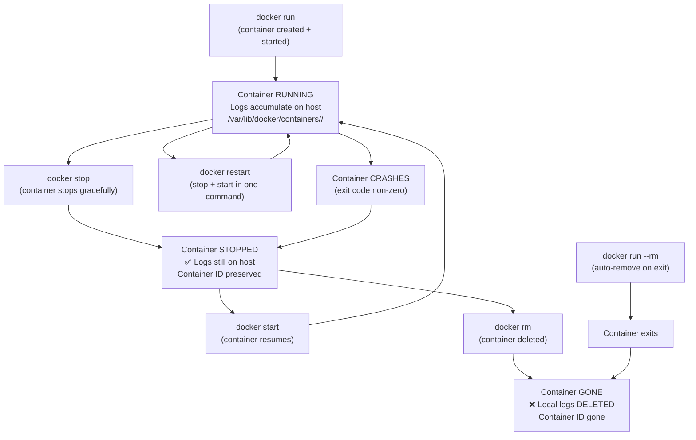
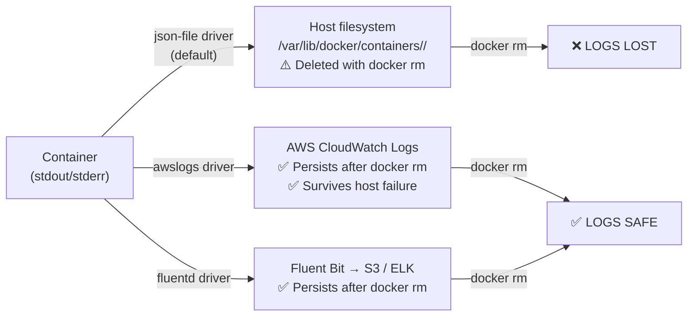

# Docker Question 2 — What Happens to Container Logs When You Restart a Container?

> **Section:** Docker &nbsp;|&nbsp; **Topic:** Container Logging / Stateless Containers &nbsp;|&nbsp; **Level:** Beginner–Mid &nbsp;|&nbsp; **Frequency:** High
>
> _Part of the DevOps & DevSecOps Interview Preparation series._

---

## ❓ The Question

> **"What happens to container logs when you restart a container? Are they lost or do they persist?"**

You may also hear this phrased as:

- "Are Docker containers stateless? What does that mean for logs?"
- "What is the difference between stopping a container and deleting it?"
- "If I run `docker rm` on a container, what happens to its logs?"
- "How do you ensure logs are not lost when a container crashes and restarts?"
- "What's the difference between `docker stop` + `docker start` vs `docker rm` + `docker run`?"

---

## 🎯 Why Interviewers Ask This

This question **traps candidates who know Docker commands but don't understand the underlying model**. It tests:

- Whether you understand the **stateless container model** — and what "stateless" actually means for logs specifically.
- Whether you know the **difference between a restart and a deletion** — two very different events with very different consequences.
- Whether you know **where logs are actually stored** — on the host, not inside the container's writable layer.
- Whether you understand **why centralised logging exists** — because relying on local container logs is a production anti-pattern.
- For DevSecOps: whether you think about **log preservation as a security and compliance control**, not just a debugging convenience.

> **The instant win:** Many candidates say "containers are stateless so logs are lost on restart" — that's wrong. Logs persist across restart, stop, and start. They're only lost when the container is *deleted*. Saying this clearly and confidently immediately separates you.

---

## 📖 Key Terminologies

| Term | Plain-English Meaning |
|------|----------------------|
| **Stateless container** | A container that does not store persistent application data internally between runs. The *application state* (e.g., database records) is external; but the container's own metadata and logs on the host are preserved until deletion. |
| **Container restart** | The process of stopping and starting an existing container (`docker restart` or `docker stop` + `docker start`). The container ID stays the same. Logs persist. |
| **Container deletion** | Removing a container completely (`docker rm`). The container ID is gone, and the local json-file logs are deleted with it. |
| **Writable layer** | Each container has a thin writable layer on top of its image layers (copy-on-write). Files written inside the container live here. This layer is removed on `docker rm`. |
| **json-file log driver** | Docker's default log driver. Stores logs as JSON on the host at `/var/lib/docker/containers/<id>/<id>-json.log`. Survives restart; deleted with `docker rm`. |
| **Log rotation** | Limiting the size and count of log files. On restart, the application may open a new log file — `docker logs` still shows accumulated output from the current container's lifetime. |
| **`docker restart`** | Stops and starts the container in one command. Same as `docker stop` + `docker start`. Container ID unchanged. Logs accumulate. |
| **`docker rm`** | Permanently removes the container and its writable layer (including local logs). Irreversible. |
| **`--rm` flag** | When passed to `docker run`, automatically deletes the container when it exits. Logs are immediately lost on exit. Common for one-off tasks; never for production services. |
| **Volume mount** | Mounting a host directory or named volume into the container. Files written to the mount path persist regardless of container deletion. Used to preserve logs from inside the container. |
| **Centralised logging** | Shipping logs to an external system (CloudWatch, Splunk, ELK) via a log driver before the container is removed, ensuring logs survive deletion. |

---

## 🗣️ How to Answer (Structured)

**1) Correct the common misconception first:**
> "This is a question that trips people up because of the phrase 'containers are stateless.' Stateless refers to *application data* — but the container's logs are a different matter. When you restart a container — whether that's `docker restart`, `docker stop` followed by `docker start`, or a crash-and-restart by Docker — the logs are *not* lost. They persist."

**2) Explain where logs are stored:**
> "Docker's default log driver (`json-file`) writes logs to the host filesystem at `/var/lib/docker/containers/<container-id>/`. That path is on the host, not inside the container. A restart doesn't touch that file — it keeps accumulating. So `docker logs myapp` after a restart still shows everything from before the restart."

**3) State clearly when logs ARE lost:**
> "Logs are only lost when the container is *deleted* — `docker rm myapp`. That removes the container's writable layer and the associated log file on the host. If your container is running with `--rm` (auto-remove on exit), logs disappear the moment it stops."

**4) Mention the log rotation edge case:**
> "One subtle point: if the application itself does log rotation inside the container — for example, rotating `/var/log/app.log` on startup — `docker logs` might show output from a fresh log file after restart. But that's the application's behaviour, not Docker deleting anything."

**5) Close with the production best practice:**
> "In production, we don't rely on local log files surviving or not — we use an external log driver like `awslogs` to ship every log line to CloudWatch Logs in real time. That way logs are preserved even if the container crashes, is restarted, or is deleted. Local log files are a development convenience, not a production strategy."

---

## 🔐 Security Perspective (DevSecOps)

Log persistence is not just an operational concern — it has direct security and compliance implications:

- **Forensic evidence preservation** — If a container is compromised and then restarted or killed, local logs may be overwritten or lost. External log drivers ensure the attacker's activity is captured before they can clear traces. A restart without external logging is a potential evidence gap.

- **`docker rm` as a cover-up vector** — An attacker with Docker daemon access can delete a container and its logs with a single command. If logs are only stored locally, there's nothing to audit. External logging closes this gap — logs are already off the host before `docker rm` runs.

- **`--rm` flag in CI/CD security pipelines** — Test containers and security scanner containers often run with `--rm` for cleanup. Ensure the scanner outputs results to a file or stdout (captured by CI) before exit — don't rely on inspecting logs from an auto-removed container.

- **Log retention for compliance** — SOC 2, PCI-DSS, and HIPAA require log retention for defined periods (90 days to 1 year). A container that is regularly removed and recreated (e.g., deployments) will have gaps in local log history. Centralised logging is the only compliant approach for regularly replaced containers.

- **Immutable log trail** — In regulated environments, logs must be immutable (non-deletable for the retention period). `aws s3 put-object-lock` or CloudWatch log group retention policies provide this. Local Docker json-file logs can be deleted with `docker rm` — not immutable.

> **One-liner for the room:** *"Restart = logs survive. Delete = logs gone. That's the rule. In production, both are irrelevant because every log line is already in CloudWatch before the container makes any decisions about its lifecycle."*

---

## 🖼️ Visuals

### Mermaid — Container Lifecycle vs. Log Persistence



### Mermaid — Where Logs Live: Local vs. External



### Source images — KodeKloud


---

## 📊 Quick Comparison — Container Actions vs. Log Fate

| Action | Command | Container ID | Local Logs | External Logs |
|--------|---------|-------------|-----------|---------------|
| **Restart** | `docker restart <name>` | ✅ Same | ✅ Preserved | ✅ Preserved |
| **Stop** | `docker stop <name>` | ✅ Same | ✅ Preserved | ✅ Preserved |
| **Start** | `docker start <name>` | ✅ Same | ✅ Preserved | ✅ Preserved |
| **Crash + auto-restart** | Docker restart policy | ✅ Same | ✅ Preserved | ✅ Preserved |
| **Delete** | `docker rm <name>` | ❌ Gone | ❌ **Deleted** | ✅ Preserved |
| **Auto-delete on exit** | `docker run --rm` | ❌ Gone | ❌ **Deleted** | ✅ Preserved |
| **Host reboot** | OS restart | ✅ Same | ✅ Preserved* | ✅ Preserved |

> *Provided the Docker daemon restarts the container automatically via restart policy.

---

## 🛠️ Hands-On: Commands & Configuration

### 1) Prove logs persist across restart

```bash
# 1. Start a container that logs every second
docker run -d --name logtest alpine \
  sh -c 'i=0; while true; do echo "log line $i at $(date)"; i=$((i+1)); sleep 1; done'

# 2. Check logs (you'll see lines accumulating)
docker logs --tail 5 logtest

# 3. Restart the container
docker restart logtest

# 4. Check logs again — ALL previous lines are still there
docker logs --tail 10 logtest
# Output: lines from BEFORE the restart AND after

# 5. Count total lines (proves accumulation, not reset)
docker logs logtest 2>&1 | wc -l
```

### 2) Prove logs are lost on deletion

```bash
# Run and generate some logs
docker run -d --name lostlogs alpine \
  sh -c 'for i in $(seq 1 20); do echo "important log $i"; sleep 0.5; done'

sleep 15

# Check logs exist
docker logs lostlogs | wc -l
# Output: 20

# Delete the container
docker rm -f lostlogs

# Try to read logs — container gone
docker logs lostlogs
# Error: No such container: lostlogs
# Logs are permanently deleted
```

### 3) Use a restart policy for crash recovery

```bash
# always: restart on crash AND on Docker daemon restart
docker run -d \
  --name webapp \
  --restart always \
  my-app:latest

# unless-stopped: restart on crash, but NOT if manually stopped
docker run -d \
  --name webapp \
  --restart unless-stopped \
  my-app:latest

# on-failure:5 — restart up to 5 times on non-zero exit
docker run -d \
  --name webapp \
  --restart on-failure:5 \
  my-app:latest

# Check restart count and last exit code
docker inspect webapp \
  --format 'RestartCount={{.RestartCount}} ExitCode={{.State.ExitCode}}'
```

### 4) Preserve application log files across container deletion using volumes

```bash
# Mount a host directory for application logs (survives docker rm)
docker run -d \
  --name webapp \
  --volume /var/log/webapp:/app/logs \
  my-app:latest

# Now even after docker rm, log files are at /var/log/webapp on the host
docker rm -f webapp
ls /var/log/webapp/
# app.log  error.log  access.log — still there!

# Docker Compose equivalent
# docker-compose.yml
# services:
#   webapp:
#     volumes:
#       - /var/log/webapp:/app/logs
```

### 5) Find and inspect log file directly on the host

```bash
# Get the exact log file path for a running container
docker inspect webapp --format '{{.LogPath}}'
# Output: /var/lib/docker/containers/abc123.../abc123...-json.log

# View the raw JSON log (requires root/sudo)
sudo tail -f $(docker inspect webapp --format '{{.LogPath}}') | jq -r '.log'

# Check log file size for a container
docker inspect webapp --format '{{.LogPath}}' | \
  xargs sudo du -sh
```

### 6) External logging — awslogs driver (logs survive deletion)

```bash
# Run with awslogs — logs go to CloudWatch immediately
docker run -d \
  --name webapp \
  --restart unless-stopped \
  --log-driver awslogs \
  --log-opt awslogs-region=us-east-1 \
  --log-opt awslogs-group=/app/production \
  --log-opt awslogs-stream=webapp \
  --log-opt awslogs-create-group=true \
  my-app:latest

# Delete the container
docker rm -f webapp

# Logs are STILL in CloudWatch — query them
aws logs get-log-events \
  --log-group-name /app/production \
  --log-stream-name webapp \
  --limit 50 \
  --query 'events[*].message' \
  --output text
```

---

## 🤖 AI & The New Trend (2024–2025)

> Container log persistence becomes even more critical — and complex — in modern cloud-native architectures where containers are replaced frequently.

### How the landscape is evolving

- **Ephemeral containers are more ephemeral than ever** — In 2024, Kubernetes deployments, serverless containers (AWS Fargate, Cloud Run), and spot-instance-based ECS tasks mean containers are regularly terminated and replaced. A container might live for minutes. Relying on local log persistence — even across restarts — is increasingly irrelevant. External logging from the very first log line is the only safe approach.

- **Crash loop analysis with AI** — When a container crashes and restarts repeatedly (CrashLoopBackOff in Kubernetes), the logs from the crashed instance are often gone before a human can inspect them. AWS DevOps Guru and tools like Komodor now capture and analyse log snapshots from crashed containers automatically, summarising the root cause without requiring a human to race the restart cycle.

- **Structured logging makes persistence smarter** — With OpenTelemetry structured logs (JSON with trace IDs, severity, service name), centralised log systems can deduplicate, correlate, and retain only actionable logs. Instead of storing terabytes of raw container output indefinitely, intelligent pipelines (Cribl, Vector) route error-level logs to long-term storage and drop debug logs after 24 hours — reducing cost while keeping the important data.

- **eBPF-based forensic capture** — Tools like Falco capture container activity at the kernel level continuously. Even if a container is deleted before an investigation starts, eBPF-captured syscall logs and network events are preserved in a separate stream. This is the 2024 answer to "how do you investigate a deleted container?"

### Mention this in interviews:

> "In production, the restart-vs-delete distinction is mostly academic because we use the awslogs driver — every log line leaves the host the moment it's written. If a container crashes, restarts five times, and gets replaced by a new deployment, the full history is still in CloudWatch. The container lifecycle doesn't dictate the log lifecycle anymore."

---

## ✅ Prerequisites (be solid on these first)

- **Docker container lifecycle basics** — `docker run`, `docker stop`, `docker start`, `docker restart`, `docker rm`. Know what each does and what state the container ends up in.
- **What a container writable layer is** — The thin copy-on-write layer on top of the image. Changes (including files written by the app) live here and are removed with `docker rm`.
- **Docker logging from Q1** — Understanding of the `json-file` log driver and where logs are stored on the host. This question builds directly on that foundation.
- **`docker inspect`** — How to look up container metadata including log path, restart count, and exit code.
- **Volume mounts** — Enough to understand why mounting `/var/log` to a host path preserves log files across container deletion.

---

## 📚 Further Reading (current docs)

- **Docker container restart policies** — <https://docs.docker.com/config/containers/start-containers-automatically/>
- **Docker storage and writable layer** — <https://docs.docker.com/storage/storagedriver/>
- **Docker volumes** — <https://docs.docker.com/storage/volumes/>
- **Docker logging drivers** — <https://docs.docker.com/config/containers/logging/configure/>
- **Twelve-Factor App — Logs** — <https://12factor.net/logs>
- **AWS CloudWatch Logs — retention policies** — <https://docs.aws.amazon.com/AmazonCloudWatch/latest/logs/Working-with-log-groups-and-streams.html>
- **KodeKloud lesson (video):** <https://learn.kodekloud.com/user/courses/devops-interview-preparation-course/module/955d2fcf-4c92-4480-b86e-081d67d83e88/lesson/4dacf563-13ed-42de-aa08-ddad5ab9e195>

---

## 🔁 Related / Follow-up Questions (they often go here next)

1. **"What does 'containers are stateless' actually mean?"** → It means the container itself doesn't store persistent *application state* — database records, user uploads, session data should live outside the container in volumes, managed databases, or object storage. However, the container's metadata, logs, and writable layer *do* exist temporarily until deletion. Stateless ≠ no data at all; it means no data you depend on surviving a recreation.

2. **"What is the difference between `docker stop` and `docker kill`?"** → `docker stop` sends SIGTERM to the main process (PID 1), waits for a graceful shutdown (default 10 seconds), then sends SIGKILL. `docker kill` sends SIGKILL immediately — no grace period. For log integrity, `docker stop` is safer — it gives the application time to flush buffered log output before terminating.

3. **"What happens to logs when Kubernetes kills a pod?"** → Same principle: the pod's local logs (written to `/var/log/containers/` on the node) persist until the pod is evicted and the node reclaims space. However, in Kubernetes you always use a log aggregator (Fluent Bit DaemonSet → CloudWatch/Elasticsearch) because pods are replaced so frequently. Kubernetes also keeps logs of the *previous* container instance: `kubectl logs <pod> --previous` shows the last crashed container's output.

4. **"How do you debug a container that crashes immediately on startup?"** → The container may exit before you can `docker exec` into it. Use `docker logs <name>` to see stdout/stderr from the crashed instance (logs persist even if the container is stopped). `docker inspect <name>` shows the `ExitCode` and `Error` fields. If the container auto-removed with `--rm`, you need to re-run *without* `--rm` and with `--entrypoint sh` to get a shell for investigation.

5. **"What is `docker run --rm` and when should you use it?"** → `--rm` automatically removes the container when it exits. Use it for: one-off tasks (running a migration, generating a certificate), CI test containers, and any container where you don't need to inspect logs after exit. Never use it for long-running services — if it crashes, you lose the log evidence needed to diagnose why.

6. **"How do you check why a container keeps restarting?"** → `docker inspect <name> --format '{{.State.ExitCode}} {{.RestartCount}}'` — shows exit code and restart count. `docker logs <name>` — shows accumulated output including crash messages. If it's a Kubernetes pod: `kubectl describe pod <name>` shows events including OOMKilled, and `kubectl logs <name> --previous` shows the last crashed instance's output.

7. **"What is a Docker restart policy and which should you use in production?"** → `no` (default — don't restart), `always` (restart on any exit, including Docker daemon restart), `unless-stopped` (restart on crash, but respect manual `docker stop`), `on-failure[:N]` (restart only on non-zero exit, up to N times). For production services: `unless-stopped` or `always`. For batch jobs: `on-failure:3`. For development: `no`.

---

> 📌 **30-second interview summary:** Container logs persist across **restart**, **stop**, and **start** — they are stored on the host at `/var/lib/docker/containers/<id>/` and survive the container's restart cycle. Logs are only lost when the container is **deleted** (`docker rm`) or when `--rm` auto-removes it on exit. In production, this distinction matters less than it seems — because containers should use an external log driver (awslogs, fluentd) that ships every log line to a centralised system in real time, making local log persistence irrelevant. The container lifecycle and the log lifecycle become independent.
