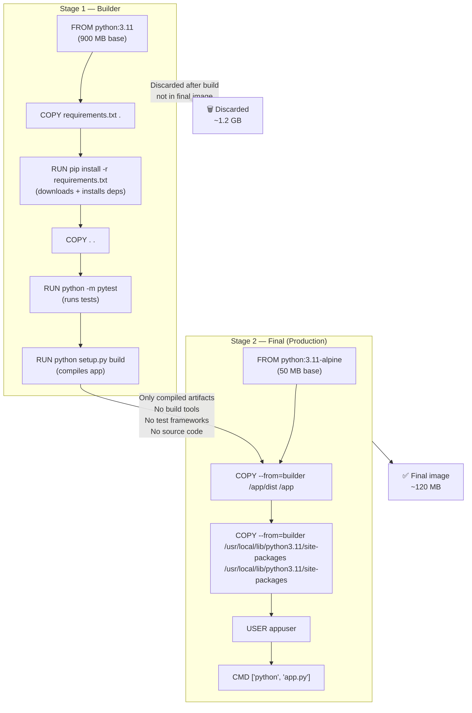
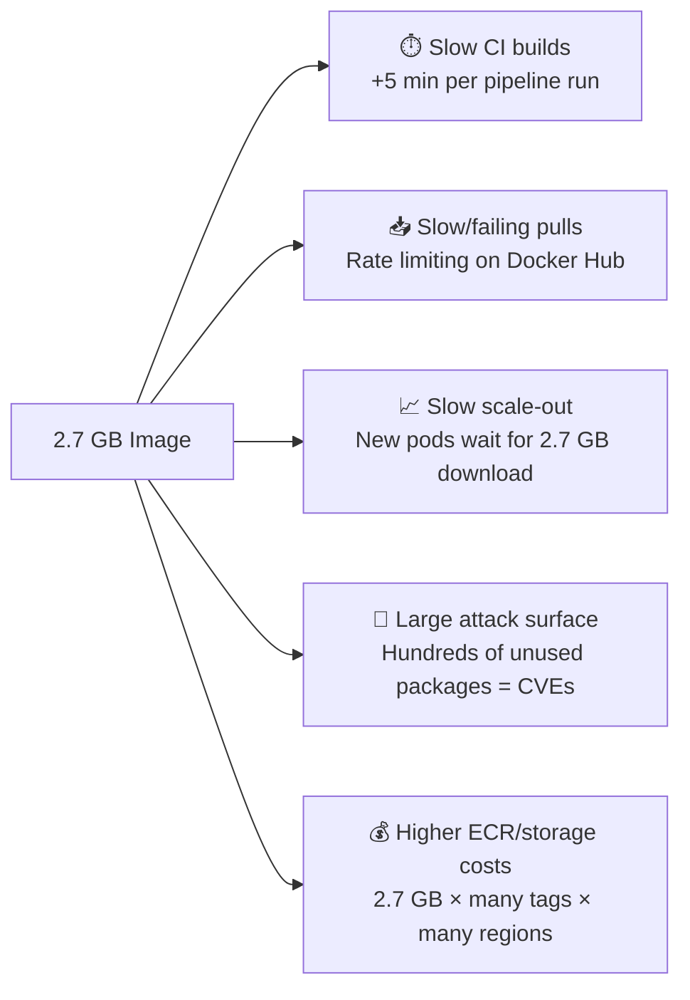

# Docker Question 3 — How Do You Optimise a Large Docker Image?

> **Section:** Docker &nbsp;|&nbsp; **Topic:** Image Optimisation / Multi-Stage Builds &nbsp;|&nbsp; **Level:** Mid (2–5 yrs) &nbsp;|&nbsp; **Frequency:** Very High
>
> _Part of the DevOps & DevSecOps Interview Preparation series._

---

## ❓ The Question

> **"You have a Docker image that is 2.7 GB. How do you evaluate whether this is a problem, and what strategies would you use to reduce it?"**

You may also hear this phrased as:

- "How do you reduce the size of a Docker image?"
- "What is a multi-stage Docker build and why is it useful?"
- "Why should you use Alpine base images?"
- "What are the best practices for writing an optimised Dockerfile?"
- "How does image size affect your CI/CD pipeline and production deployments?"

---

## 🎯 Why Interviewers Ask This

Docker image size is a practical problem that hits every team working with containers at scale. Interviewers ask this to validate:

- You understand the **real-world impact** of bloated images — slow builds, failed pulls, API rate limits, increased attack surface.
- You know the **four core optimisation strategies** — Alpine base images, multi-stage builds, removing unnecessary packages, pinning versions.
- You can write a **production-grade Dockerfile** — not just one that works, but one that is lean and secure.
- You connect image size to **CI/CD performance** — a 2.7 GB image adds minutes to every pipeline run and every deployment.
- For DevSecOps: larger images mean a **larger attack surface** — more packages, more CVEs, more to patch.

> **The instant win:** Don't just say "use Alpine." Lead with the evaluation — "first I'd ask: is this complexity justified for the application?" — then give the four strategies in order. That shows engineering judgement, not just memorised tips.

---

## 📖 Key Terminologies

| Term | Plain-English Meaning |
|------|----------------------|
| **Base image** | The starting image a Dockerfile builds on — e.g., `FROM python:3.11`. Everything in the base image is included in your final image. |
| **Alpine Linux** | A minimal Linux distribution (~5 MB). Alpine-based images (`python:3.11-alpine`) are dramatically smaller than full Debian/Ubuntu variants. |
| **Multi-stage build** | A Dockerfile technique that uses multiple `FROM` statements. An early stage builds the app; the final stage copies only the compiled artifacts — discarding the build toolchain. |
| **Layer** | Each instruction in a Dockerfile (`RUN`, `COPY`, `ADD`) creates a new image layer. Layers are cached and stacked. Unnecessary layers bloat the image. |
| **Layer caching** | Docker reuses unchanged layers from cache during builds. Ordering Dockerfile instructions from least-to-most frequently changed maximises cache hits. |
| **`.dockerignore`** | A file that prevents specified files/directories from being sent to the Docker build context — similar to `.gitignore`. Reduces build context size and prevents secrets from entering the image. |
| **`RUN --mount=type=cache`** | BuildKit feature that caches package manager downloads across builds without baking them into the image layer. |
| **Distroless images** | Google's minimal images containing only the application runtime and its dependencies — no shell, no package manager. Extremely small and secure. |
| **`docker image ls`** | Lists images with their sizes. |
| **`docker history`** | Shows all layers of an image and their individual sizes — helps identify which instruction is bloating the image. |
| **`dive`** | An open-source tool that lets you interactively inspect each layer of a Docker image and see exactly what files each layer adds. |
| **Version pinning** | Specifying exact package versions (`requests==2.31.0`) rather than latest, preventing unexpected transitive dependency additions. |

---

## 🗣️ How to Answer (Structured)

**1) Start with the evaluation question — don't assume it's always a problem:**
> "The first question I'd ask is: what does this image contain and what does the application actually need? A 2.7 GB image might be justified for a data science workload with heavy ML libraries — but for a simple Python Flask API, that's almost certainly excessive and I'd want to optimise it."

**2) Explain the real-world impact of the large size:**
> "A bloated image causes four concrete problems: longer build times slow down the CI pipeline; large image pulls can fail or trigger rate limiting from registries like Docker Hub; scaling becomes painful because every new pod or instance needs to pull the image; and from a security perspective, every extra package is a potential CVE that needs patching."

**3) Strategy 1 — Alpine base image:**
> "The first thing I'd do is swap the base image. If it's using `python:3.11` (which is Debian-based at ~900 MB), switching to `python:3.11-alpine` brings that down to ~50 MB. The trade-off is that Alpine uses `musl libc` instead of `glibc`, which can cause compatibility issues with some C extensions — but for most Python/Node apps it works fine."

**4) Strategy 2 — Multi-stage build:**
> "The biggest size wins usually come from multi-stage builds. The build stage compiles the app, downloads dependencies, runs tests. The final stage starts fresh from a minimal base and copies only the compiled artifacts — no build tools, no compilers, no test frameworks in production. I've seen images go from 1.2 GB to 120 MB this way."

**5) Strategy 3 & 4 — Remove packages and pin versions:**
> "I'd also clean up after package installation in a single RUN layer — `apt-get install ... && apt-get clean && rm -rf /var/lib/apt/lists/*`. And I'd pin all dependency versions to prevent `pip install` or `npm install` from pulling extra transitive dependencies that weren't in the original build."

**6) Close with the tool for diagnosis:**
> "To identify *what* is bloating an image before optimising, I use `docker history <image>` to see which layer is the largest, or the `dive` tool which gives an interactive layer-by-layer breakdown."

---

## 🔐 Security Perspective (DevSecOps)

Image size and security are directly linked — every extra package is a potential vulnerability:

- **Smaller image = smaller attack surface** — A 2.7 GB image almost certainly contains hundreds of packages the application never uses at runtime. Every package is a potential CVE. `python:3.11-alpine` has a fraction of the packages of `python:3.11-slim`, meaning far fewer vulnerabilities to track and patch.

- **Distroless images for production** — Google's distroless images (`gcr.io/distroless/python3`) contain only the language runtime — no shell (`/bin/sh`), no package manager (`apt`, `apk`), no `curl`. An attacker who gains container access cannot run arbitrary commands. For production-hardened deployments this is the gold standard.

- **No secrets in image layers** — A common source of bloat and security risk: credentials, `.env` files, or SSH keys accidentally `COPY`-d into the image. Use `.dockerignore` to exclude these files. Even if you delete them in a later `RUN` layer, the secret is preserved in the earlier layer — multi-stage builds eliminate this risk by starting fresh.

- **Run container image scans before pushing** — Use Trivy, Snyk, or AWS ECR's built-in scan to detect CVEs in your image layers before they reach production. A smaller image with fewer packages produces fewer scan findings and shorter remediation cycles.

- **Run as non-root** — Large base images often default to running as root. Add `USER appuser` to your Dockerfile. This is a separate concern from size but is part of the same "lean and secure" philosophy.

- **Pin base image digests, not just tags** — `FROM python:3.11-alpine` is mutable — the tag can be updated with a different (potentially compromised) image. `FROM python:3.11-alpine@sha256:abc123...` pins to a specific immutable digest. Use this in production Dockerfiles.

> **One-liner for the room:** *"Every megabyte you remove from a Docker image removes a potential CVE, a potential secret, and seconds from every deployment. Optimisation isn't just a performance win — it's a security win."*

---

## 🖼️ Visuals

### Mermaid — Multi-Stage Build: How it reduces size



### Mermaid — Image Size Impact Chain



### Source image — KodeKloud


---

## 📊 Quick Comparison — Optimisation Strategies

| Strategy | Typical Size Reduction | Trade-off | Best For |
|----------|----------------------|-----------|----------|
| **Alpine base image** | 800 MB → 50 MB base | `musl libc` incompatibility with some C libs | Python, Node, Go apps |
| **Distroless image** | No shell/pkg manager | Harder to debug; no exec into shell | Production Go/Java/Python |
| **Multi-stage build** | 1.2 GB → 120 MB | Slightly more complex Dockerfile | Any compiled/interpreted app |
| **Remove apt cache** | 50–200 MB per layer | Must do it in the same `RUN` statement | Any Debian/Ubuntu base |
| **Pin versions** | Prevents bloat creep | Needs updating when upgrading | All images |
| **`.dockerignore`** | Reduces build context | One-time config | All images |
| **`--no-install-recommends`** | 50–500 MB | Some optional features unavailable | Debian/Ubuntu `apt-get` |

---

## 🛠️ Hands-On: Commands & Configuration

### 1) Diagnose what's bloating an image

```bash
# Check image size
docker image ls my-app
# REPOSITORY   TAG       IMAGE ID       CREATED        SIZE
# my-app       latest    abc123         2 hours ago    2.71GB

# Inspect layer-by-layer breakdown
docker history my-app:latest
# IMAGE          CREATED        CREATED BY                     SIZE
# abc123         2 hours ago    CMD ["python", "app.py"]       0B
# def456         2 hours ago    COPY . /app                    450MB   <-- large!
# ...

# Use dive for interactive layer analysis (install first)
brew install dive            # macOS
sudo apt-get install dive    # Ubuntu

dive my-app:latest
# Interactive TUI — shows each layer, files added/removed, wasted space
```

### 2) Optimised Dockerfile — Python Flask (before vs after)

```dockerfile
# ❌ BEFORE — Unoptimised (typically 900 MB+)
FROM python:3.11
WORKDIR /app
COPY . .
RUN pip install -r requirements.txt
EXPOSE 5000
CMD ["python", "app.py"]
```

```dockerfile
# ✅ AFTER — Optimised multi-stage with Alpine (~80 MB)
# Stage 1: Builder — install dependencies
FROM python:3.11-alpine AS builder

WORKDIR /app

# Install build dependencies (needed for some C extensions)
RUN apk add --no-cache gcc musl-dev libffi-dev

# Pin and install dependencies into a prefix
COPY requirements.txt .
RUN pip install --no-cache-dir --prefix=/install -r requirements.txt

# Stage 2: Production — lean final image
FROM python:3.11-alpine AS production

WORKDIR /app

# Copy only installed packages from builder — no build tools
COPY --from=builder /install /usr/local

# Copy only the application code needed at runtime
COPY src/ ./src/
COPY app.py .

# Create non-root user
RUN addgroup -S appgroup && adduser -S appuser -G appgroup
USER appuser

EXPOSE 5000
CMD ["python", "app.py"]
```

### 3) Multi-stage build — Go application (ideal case for distroless)

```dockerfile
# Stage 1: Build the Go binary
FROM golang:1.22-alpine AS builder

WORKDIR /app
COPY go.mod go.sum ./
RUN go mod download

COPY . .
RUN CGO_ENABLED=0 GOOS=linux go build -ldflags="-w -s" -o server .

# Stage 2: Distroless final image (~20 MB total)
FROM gcr.io/distroless/static-debian12

WORKDIR /app
COPY --from=builder /app/server .

# Non-root by default in distroless
USER nonroot:nonroot

EXPOSE 8080
ENTRYPOINT ["/app/server"]
```

### 4) Optimised Dockerfile — Node.js

```dockerfile
# Stage 1: Install and build
FROM node:20-alpine AS builder

WORKDIR /app
COPY package*.json ./

# Install ALL deps (including devDependencies for build)
RUN npm ci

COPY . .
RUN npm run build

# Stage 2: Production runtime only
FROM node:20-alpine AS production

WORKDIR /app

# Copy only production deps
COPY package*.json ./
RUN npm ci --omit=dev && npm cache clean --force

# Copy built artifacts from builder
COPY --from=builder /app/dist ./dist

RUN addgroup -S app && adduser -S app -G app
USER app

EXPOSE 3000
CMD ["node", "dist/server.js"]
```

### 5) Apt-get best practices (Debian/Ubuntu base)

```dockerfile
# ✅ Correct — clean in the same RUN layer to avoid bloating the layer
RUN apt-get update && apt-get install -y \
    curl \
    git \
    --no-install-recommends \
  && apt-get clean \
  && rm -rf /var/lib/apt/lists/*

# ❌ Wrong — cleaning in a separate layer doesn't reduce image size
# The packages are already baked into the previous layer
RUN apt-get update && apt-get install -y curl git
RUN apt-get clean && rm -rf /var/lib/apt/lists/*  # Too late!
```

### 6) `.dockerignore` — prevent build context bloat

```dockerignore
# .dockerignore — prevents these from entering the build context

# Version control
.git
.gitignore

# Development files
.env
.env.*
*.env

# Dependencies (will be installed inside container)
node_modules/
__pycache__/
*.pyc
.venv/
venv/

# Test and docs
tests/
docs/
*.md
*.test.js
*.spec.py

# CI/CD configs
.github/
.gitlab-ci.yml
Jenkinsfile

# IDE files
.idea/
.vscode/
*.swp

# Build artifacts (will be rebuilt inside container)
dist/
build/
*.egg-info/
```

### 7) Scan image for CVEs before pushing

```bash
# Scan with Trivy (free, open-source)
trivy image my-app:latest

# Show only HIGH and CRITICAL vulnerabilities
trivy image --severity HIGH,CRITICAL my-app:latest

# Output as JSON for CI/CD integration
trivy image --format json --output trivy-results.json my-app:latest

# Fail the build if any CRITICAL CVEs found
trivy image --exit-code 1 --severity CRITICAL my-app:latest

# Compare before and after optimisation
trivy image python:3.11 2>&1 | grep "Total:"
trivy image python:3.11-alpine 2>&1 | grep "Total:"
# Before: Total: 847 (UNKNOWN: 5, LOW: 312, MEDIUM: 310, HIGH: 198, CRITICAL: 22)
# After:  Total: 4  (LOW: 3, MEDIUM: 1)
```

---

## 🤖 AI & The New Trend (2024–2025)

> Docker image optimisation is getting smarter with AI-assisted tooling and new BuildKit features.

### How the landscape is evolving

- **Docker Scout (2024)** — Docker's built-in image analysis tool. `docker scout cves my-app:latest` shows CVEs layer-by-layer. `docker scout recommendations` suggests specific base image upgrades that reduce your vulnerability count. Integrated directly into `docker build` and Docker Desktop — no separate tool install needed.

- **AI-generated Dockerfiles** — Amazon Q Developer, GitHub Copilot, and Dockerfile-specific AI tools now generate optimised multi-stage Dockerfiles from natural language descriptions. The shift for DevOps engineers: review AI-generated Dockerfiles critically for security issues (running as root, secrets in ENV, `COPY . .` too early) rather than writing from scratch.

- **BuildKit cache mounts** — BuildKit's `RUN --mount=type=cache` mounts a persistent cache for package managers without baking downloaded packages into the layer. This gives you the speed of cached installs without the image size cost — a feature only available since Docker 23.x but now standard.

- **Slim.ai and DockerSlim** — Tools that automatically analyse a running container to determine which files are actually used at runtime, then generate a minimal image containing only those files. Reported size reductions of 30×. Still experimental for complex apps but increasingly production-ready.

- **OCI Image spec and reproducible builds** — The 2024 push toward reproducible image builds means pinning not just package versions but base image digests (`FROM python:3.11-alpine@sha256:...`) and using build attestations (SBOM — Software Bill of Materials) to prove what's in each image. This is now a compliance requirement at many enterprises.

### Mention this in interviews:

> "Beyond manual optimisation, I now use Docker Scout to get CVE counts per layer and base image recommendations. Combined with Trivy in the CI pipeline as a quality gate, we've reduced average image sizes by 60% and critical CVEs by 90% over the past year."

---

## ✅ Prerequisites (be solid on these first)

- **Dockerfile syntax fundamentals** — `FROM`, `RUN`, `COPY`, `ADD`, `ENV`, `EXPOSE`, `CMD`, `ENTRYPOINT`. Know what each does and what layer it creates.
- **How Docker layers work** — Every `RUN`/`COPY`/`ADD` creates a layer. Layers are stacked. The final image size is the sum of all layers. Deleting a file in a later layer doesn't remove it from the earlier layer — it's still there.
- **`docker build` command** — `docker build -t my-app:latest .` — the build context (`.`) is sent to the daemon; `.dockerignore` filters it.
- **Package managers** — `pip` (Python), `npm` (Node), `apt-get` (Debian/Ubuntu), `apk` (Alpine). Know how to install, clean, and pin versions for each.
- **Basic Linux filesystem** — Where package managers store their caches (`/var/lib/apt/lists/`, `/root/.cache/pip/`) so you know what to clean up.

---

## 📚 Further Reading (current docs)

- **Docker multi-stage builds** — <https://docs.docker.com/build/building/multi-stage/>
- **Docker BuildKit** — <https://docs.docker.com/build/buildkit/>
- **Docker Scout** — <https://docs.docker.com/scout/>
- **Alpine Linux Docker Hub** — <https://hub.docker.com/_/alpine>
- **Distroless images (Google)** — <https://github.com/GoogleContainerTools/distroless>
- **Trivy (image scanner)** — <https://trivy.dev/>
- **dive (layer inspector)** — <https://github.com/wagoodman/dive>
- **Docker `.dockerignore` reference** — <https://docs.docker.com/engine/reference/builder/#dockerignore-file>
- **KodeKloud lesson (video):** <https://learn.kodekloud.com/user/courses/devops-interview-preparation-course/module/955d2fcf-4c92-4480-b86e-081d67d83e88/lesson/da18f029-09c6-43f1-8060-d1e295c766d6>

---

## 🔁 Related / Follow-up Questions (they often go here next)

1. **"What is a multi-stage Docker build?"** → A Dockerfile that uses multiple `FROM` statements. Each `FROM` starts a new stage. The final stage copies only what it needs from earlier stages using `COPY --from=<stage>`. Build toolchains, test runners, and source code stay in earlier stages and are discarded — only compiled artifacts make it to the final image.

2. **"Why use Alpine instead of Ubuntu as a base image?"** → Alpine is ~5 MB vs Ubuntu's ~80 MB (and Debian's ~120 MB). It uses `musl libc` and `busybox` to stay minimal. Fewer packages = fewer CVEs to track. The trade-off: some packages compiled for `glibc` don't work on `musl` — in those cases use `python:3.11-slim` (Debian-based but stripped) as a middle ground.

3. **"What is the difference between `CMD` and `ENTRYPOINT`?"** → `ENTRYPOINT` defines the main executable — it's the command that always runs and can't be overridden without `--entrypoint`. `CMD` provides default arguments to the entrypoint. If only `CMD` is set, it's the full command. Common pattern: `ENTRYPOINT ["python"]` + `CMD ["app.py"]` — users can override `app.py` but not `python`. For scripts: `ENTRYPOINT ["./entrypoint.sh"]`.

4. **"Why should you clean apt/apk caches in the same RUN layer as the install?"** → Docker layers are immutable snapshots. If you install packages in one `RUN` and clean in the next, the downloaded cache files are baked into the first layer permanently — the clean layer only hides them in the final image view but they're still in the layer stack. Combining install + clean in a single `RUN` with `&&` means only the final state (after cleaning) gets stored in the layer.

5. **"What is `.dockerignore` and why does it matter?"** → `.dockerignore` prevents files from being included in the build context sent to the Docker daemon. Without it, `node_modules/` (hundreds of MB), `.git/` (potentially GB), and `.env` files (secrets) all get sent to the daemon on every `docker build`. `.dockerignore` is one of the easiest wins for both build speed and security.

6. **"How do you scan a Docker image for vulnerabilities?"** → `trivy image my-app:latest` — gives a CVE list by severity (CRITICAL, HIGH, MEDIUM, LOW). In CI/CD: `trivy image --exit-code 1 --severity CRITICAL my-app:latest` fails the build if any critical CVEs are present. Also: `docker scout cves` (Docker's native tool), `snyk container test my-app:latest` (Snyk), or AWS ECR's built-in scan on push.

7. **"What are distroless images and when should you use them?"** → Distroless images (Google: `gcr.io/distroless/`) contain only the language runtime — no shell, no package manager, no utilities. This makes them extremely secure (no shell = attacker can't run commands even with container access) and small. Use for production Go and Java workloads especially. Downside: you can't `docker exec` into them to debug — use a debug variant (`gcr.io/distroless/python3:debug`) which adds a busybox shell.

8. **"How does image size affect Kubernetes deployments?"** → On first pod schedule to a node, the full image must be pulled. A 2.7 GB image on a cold node adds 2–5 minutes to startup. With HPA scaling up under traffic, this delay is dangerous. Smaller images = faster cold starts, faster rollout, faster recovery from node failures. Use `imagePullPolicy: IfNotPresent` in production and pre-pull images to nodes via a DaemonSet to eliminate pull time on scale events.

---

> 📌 **30-second interview summary:** A 2.7 GB Docker image is likely excessive for a simple application and causes four real problems: slow CI builds, failed/slow image pulls, registry rate limiting, and a large security attack surface (more packages = more CVEs). The four optimisation strategies are: (1) switch to an Alpine base image (`python:3.11-alpine` vs `python:3.11` saves ~850 MB), (2) use multi-stage builds to discard the build toolchain from the final image, (3) clean package caches in the same `RUN` layer as the install, and (4) pin package versions to prevent dependency creep. Use `docker history` and `dive` to diagnose which layer is responsible for the bloat before optimising.
