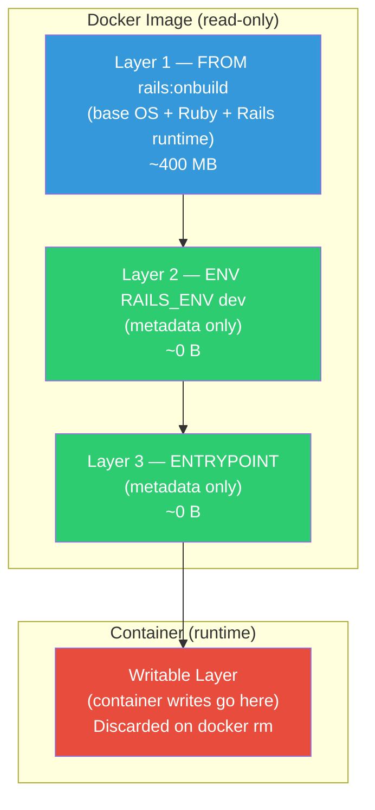
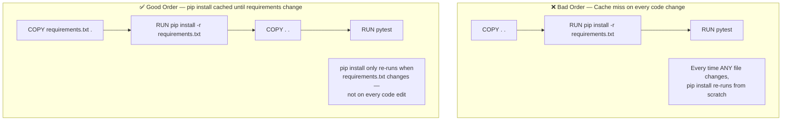
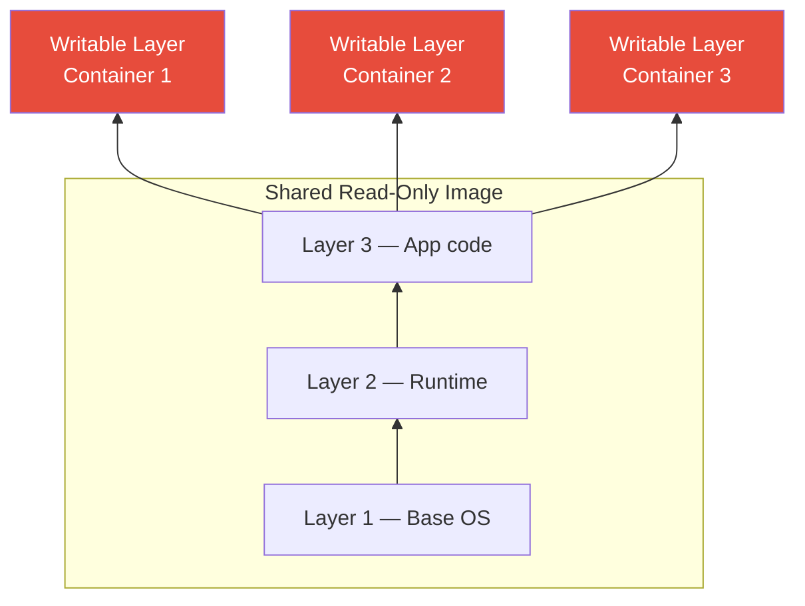

# Docker Question 4 — What is the Difference Between a Docker Image and Docker Layers?

> **Section:** Docker &nbsp;|&nbsp; **Topic:** Image Internals / Layer Architecture &nbsp;|&nbsp; **Level:** Beginner–Mid &nbsp;|&nbsp; **Frequency:** High
>
> _Part of the DevOps & DevSecOps Interview Preparation series._

---

## ❓ The Question

> **"What is the difference between a Docker image and Docker layers?"**

You may also hear this phrased as:

- "How are Docker images structured internally?"
- "What does each instruction in a Dockerfile create?"
- "How does layer caching work in Docker builds?"
- "What is the writable layer and how does it relate to the image layers?"
- "Why do Docker images share layers between them?"

---

## 🎯 Why Interviewers Ask This

This is a foundational Docker internals question that separates candidates who have used Docker from those who truly understand it. Interviewers ask it to verify:

- You understand the **union filesystem model** — how Docker stacks read-only layers to form a complete filesystem.
- You know that **each Dockerfile instruction creates a layer** — and can reason about which instructions are expensive vs. cheap.
- You understand **layer caching** — why instruction order matters for build performance.
- You can explain the **writable container layer** — the thin layer added on `docker run` that separates image state from container state.
- For DevSecOps: layers carry **CVEs and secrets** — understanding layers explains why you can't "delete a secret" by removing it in a later layer.

> **The instant win:** Lead with the clean analogy — "a Docker image is a read-only stack of layers; each Dockerfile instruction adds one layer; together they form the complete filesystem" — then connect it to caching, size optimisation, and security. That arc proves you understand it at depth.

---

## 📖 Key Terminologies

| Term | Plain-English Meaning |
|------|----------------------|
| **Docker image** | A read-only, ordered stack of layers that together form a complete filesystem. The blueprint for creating containers. |
| **Docker layer** | A single filesystem delta — the set of files added, modified, or deleted by one Dockerfile instruction. Read-only once built. |
| **Union filesystem (UnionFS)** | The technology Docker uses to stack layers. It presents multiple layers as a single merged filesystem to the container. Implementations: OverlayFS (default), AUFS, devicemapper. |
| **Read-only layer** | Every layer in an image is immutable after creation. Multiple containers can share the same read-only layers without copying. |
| **Writable layer (container layer)** | A thin read-write layer added on top of the image layers when a container is started. All container writes go here. Discarded on `docker rm`. |
| **`docker history`** | CLI command that shows all layers of an image: their size, creation time, and the Dockerfile instruction that created them. |
| **Layer cache** | Docker's build cache. If a layer's instruction and its inputs haven't changed, Docker reuses the cached layer instead of rebuilding. |
| **Cache invalidation** | When a layer's inputs change (e.g., a file changes), Docker rebuilds that layer AND all layers after it — even if those haven't changed. |
| **`COPY` vs `ADD`** | Both create a layer. `COPY` is simple (local files only). `ADD` can fetch URLs and auto-extract archives — but should be avoided unless needed (unpredictable behaviour). |
| **Image digest** | A SHA256 hash of the image manifest (which includes all layer digests). Uniquely identifies an exact image version — unlike tags, digests are immutable. |
| **Layer deduplication** | If two images share an identical layer (same SHA256), Docker stores it only once on disk — saving storage space. |

---

## 🗣️ How to Answer (Structured)

**1) Define both terms clearly:**
> "A Docker image is a complete, read-only filesystem blueprint made up of multiple stacked layers. A layer is just the delta — the changes — produced by a single Dockerfile instruction. The image is the whole stack; a layer is one slice of that stack."

**2) Walk through the example Dockerfile:**
> "Take a simple Dockerfile:
> `FROM rails:onbuild` — this pulls the base image, which itself is already a stack of layers.
> `ENV RAILS_ENV dev` — this adds a new, very thin layer that sets an environment variable.
> `ENTRYPOINT ["bundle", "exec", "logica"]` — this adds another thin layer recording the entrypoint metadata.
> The final image is all three stacked together, presented as one unified filesystem to the container."

**3) Explain the writable layer:**
> "When you run a container from that image, Docker adds one more layer on top — the writable container layer. All writes the running container makes — log files, temp files, any changes — go into this layer. The image layers underneath stay completely unchanged. That's why you can run ten containers from the same image simultaneously: they all share the same read-only layers and each has their own thin writable layer on top."

**4) Connect to layer caching:**
> "Understanding layers is essential for efficient builds. Docker checks each instruction against its cache. If nothing has changed, it reuses the cached layer and skips rebuilding. The key rule: put instructions that change infrequently at the top (`FROM`, `RUN apt-get install`) and instructions that change frequently at the bottom (`COPY . .`). That way most layers are cache hits and builds are fast."

**5) Close with the security implication:**
> "There's also an important security implication. If you accidentally `COPY` a secret into a layer and then delete it in the next `RUN rm secret.txt`, the secret is still in the earlier layer — it's read-only and permanent. Anyone who pulls the image can inspect that layer and find the secret. Multi-stage builds fix this because the final stage starts fresh with no history from the build stage."

---

## 🔐 Security Perspective (DevSecOps)

Layer immutability is both a feature and a security consideration:

- **Secrets baked into layers are permanent** — A common mistake: `COPY .env /app/.env` in one layer, then `RUN rm /app/.env` in the next. The `.env` file is gone from the *final* filesystem view, but the layer that added it still exists in the image. `docker history --no-trunc` or layer extraction tools (`dive`, `crane`) can recover it. The fix: never `COPY` secrets into the image at all. Use build-time secrets via `RUN --mount=type=secret` (BuildKit) or runtime secrets via environment variables and Secrets Manager.

- **CVEs are layer-scoped** — When Trivy or Docker Scout scans an image, it inspects each layer for vulnerable package versions. A CVE in a base image layer (`FROM ubuntu:20.04`) requires a base image update — you can't patch it from a higher layer without rebuilding from scratch. This is why keeping base images updated and minimal matters.

- **Layer sharing enables efficient patching** — When the base image is updated (e.g., `FROM python:3.11-alpine` gets a security patch), rebuilding your image picks up the new base layer. All images sharing that base layer automatically get the fix on rebuild. This is the "patch once, benefit everywhere" model of layered images.

- **`docker history --no-trunc` exposes build commands** — Anyone who pulls your image can run `docker history --no-trunc my-app:latest` and see every `RUN` command that built it — including any accidentally embedded credentials, internal URLs, or sensitive configuration. Use multi-stage builds and never pass secrets as `ENV` or `ARG` in production Dockerfiles.

- **Image signing and layer attestation** — Docker Content Trust (DCT) and Sigstore/Cosign allow you to sign images and verify that layers haven't been tampered with between build and deployment. This is the supply chain security layer — ensuring the image running in production is exactly what CI built.

> **One-liner for the room:** *"Every layer is permanent and inspectable. Build secrets never go into a layer — they're injected at runtime. And any CVE in a base layer requires a rebuild from the updated base, not a patch on top."*

---

## 🖼️ Visuals

### Mermaid — Docker Image Layer Stack



### Mermaid — Layer Caching: Why Instruction Order Matters



### Mermaid — Writable Layer: Multiple Containers from One Image



> Three containers share the same read-only image layers — only their writable layers differ. No duplication, minimal disk usage.

---

## 📊 Quick Comparison — Docker Image vs Docker Layer

| | **Docker Image** | **Docker Layer** |
|---|-----------------|-----------------|
| **What it is** | Complete read-only filesystem stack | A single filesystem delta (one instruction's changes) |
| **Created by** | `docker build` (assembles all layers) | Each Dockerfile instruction (`FROM`, `RUN`, `COPY`, `ENV`, etc.) |
| **Read/Write** | Read-only | Read-only (once built) |
| **Standalone?** | ✅ Yes — can be pulled, tagged, pushed | ❌ No — only meaningful as part of an image stack |
| **Shared between images?** | No (but layers within can be shared) | ✅ Yes — identical layers shared via SHA256 deduplication |
| **Identified by** | Tag (`my-app:1.4`) or digest (`sha256:abc...`) | SHA256 digest of its content |
| **Inspected with** | `docker image ls`, `docker inspect` | `docker history`, `dive` |
| **Writable?** | No | Only the container layer (added at runtime) |

---

## 🛠️ Hands-On: Commands & Configuration

### 1) Inspect layers with `docker history`

```bash
# Build an image from the example Dockerfile
cat > Dockerfile << 'EOF'
FROM python:3.11-alpine
ENV APP_ENV production
RUN apk add --no-cache curl
COPY app.py /app/app.py
ENTRYPOINT ["python", "/app/app.py"]
EOF

docker build -t layertest:latest .

# Inspect all layers
docker history layertest:latest
# IMAGE         CREATED        CREATED BY                            SIZE
# abc123        5 minutes ago  ENTRYPOINT ["python", "/app/app.py"]  0B
# def456        5 minutes ago  COPY app.py /app/app.py               1.2kB
# ghi789        5 minutes ago  RUN apk add --no-cache curl           4.5MB
# jkl012        5 minutes ago  ENV APP_ENV production                 0B
# mno345        3 days ago     (base python:3.11-alpine layers)      ~50MB

# Show full command without truncation
docker history --no-trunc layertest:latest

# Show layer sizes only (identify the biggest layers)
docker history layertest:latest --format "{{.Size}}\t{{.CreatedBy}}" | sort -rh
```

### 2) Inspect layers with `dive`

```bash
# Install dive
brew install dive          # macOS
wget https://github.com/wagoodman/dive/releases/download/v0.12.0/dive_0.12.0_linux_amd64.deb
sudo apt install ./dive_*.deb   # Ubuntu/Debian

# Launch interactive layer inspector
dive layertest:latest
# Navigate: Tab = switch between layers panel and filetree panel
# Arrow keys = select layer / navigate files
# Ctrl+U = show only changed files in this layer
# Ctrl+Space = collapse/expand directories

# Non-interactive: check for wasted space (for CI/CD)
CI=true dive layertest:latest
# Output: Result:PASS  Total Image size: 56 MB  Potential wasted space: 0 B
```

### 3) Demonstrate cache invalidation

```bash
# Create a simple project
mkdir cachetest && cd cachetest
echo "requests==2.31.0" > requirements.txt
echo "print('hello')" > app.py

cat > Dockerfile << 'EOF'
FROM python:3.11-alpine
COPY requirements.txt .
RUN pip install --no-cache-dir -r requirements.txt
COPY app.py .
CMD ["python", "app.py"]
EOF

# First build — all layers built fresh
time docker build -t cachetest:v1 .
# real 45s (pip install takes time)

# Second build, no changes — ALL layers cached
time docker build -t cachetest:v2 .
# real 0.5s (all cache hits)

# Change app.py only
echo "print('world')" > app.py

# Third build — only the COPY app.py layer rebuilds
time docker build -t cachetest:v3 .
# real 0.8s (pip install still cached — requirements.txt unchanged)
# This is why order matters!

# Change requirements.txt — invalidates pip install and everything after
echo "requests==2.31.0\nflask==3.0.0" > requirements.txt

time docker build -t cachetest:v4 .
# real 48s (pip install re-runs, cache miss)
```

### 4) Extract and inspect a specific layer

```bash
# Save image as tar archive
docker save layertest:latest -o layertest.tar

# Extract and examine the layer structure
mkdir layertest-extracted && tar xf layertest.tar -C layertest-extracted
ls layertest-extracted/
# blobs/  index.json  manifest.json  oci-layout

# Read the manifest to find layer digests
cat layertest-extracted/manifest.json | jq '.[0].Layers'

# Extract a specific layer and inspect its contents
mkdir layer-contents
tar xf layertest-extracted/<layer-sha256>.tar.gz -C layer-contents
ls layer-contents/
# Reveals exactly what files that instruction added to the filesystem
```

### 5) BuildKit secret mount — keep secrets out of layers

```dockerfile
# syntax=docker/dockerfile:1.6
FROM python:3.11-alpine

WORKDIR /app

COPY requirements.txt .

# Secret is mounted at build time but NEVER baked into any layer
RUN --mount=type=secret,id=pip_token \
    PIP_INDEX_URL=$(cat /run/secrets/pip_token) \
    pip install --no-cache-dir -r requirements.txt

COPY app.py .
CMD ["python", "app.py"]
```

```bash
# Pass the secret at build time (never appears in any layer)
docker build \
  --secret id=pip_token,src=./pip_token.txt \
  -t my-app:latest .

# Verify: secret is NOT in any layer
docker history --no-trunc my-app:latest | grep pip_token
# (no output — secret was never committed to a layer)
```

### 6) Check layer deduplication (disk savings)

```bash
# Build two images from the same Alpine base
docker pull python:3.11-alpine
docker pull node:20-alpine

# Both use the same Alpine base layers — Docker stores them once
docker system df
# TYPE            TOTAL     ACTIVE    SIZE      RECLAIMABLE
# Images          5         3         450MB     120MB (shared layers not counted twice)

# Show all layers and their disk usage
docker system df -v | head -30
```

---

## 🤖 AI & The New Trend (2024–2025)

> Docker's layer model is stable and well-understood — but the tooling around inspecting, securing, and optimising layers is advancing rapidly.

### How the landscape is evolving

- **Software Bill of Materials (SBOM) per layer** — Docker BuildKit (v0.11+) can generate an SBOM at build time: `docker build --sbom=true`. The SBOM lists every package in every layer, their versions, and licenses. This is becoming a compliance requirement (US Executive Order on Cybersecurity, EU Cyber Resilience Act) and allows precise CVE tracking at the layer level.

- **Docker Scout layer-level CVE attribution** — `docker scout cves --format sarif my-app:latest` now shows exactly which layer introduced a vulnerable package. This enables targeted fixes: if the CVE is in the base image layer, update the base; if it's in your `RUN pip install` layer, update the package version.

- **Sigstore / Cosign layer signing** — Each layer can now be cryptographically signed with Cosign. Kubernetes admission controllers (Kyverno, OPA Gatekeeper) can verify at deploy time that every image layer was signed by a trusted build system. An unsigned or tampered layer blocks the deployment — supply chain security at the layer level.

- **OCI Artifacts and referrers** — The OCI spec now supports attaching metadata (SBOMs, vulnerability reports, signatures) to an image via the referrers API. This means layer-level security metadata travels with the image through registries — visible in ECR, Docker Hub, and GitHub Container Registry.

- **BuildKit cache backends** — BuildKit now supports remote cache backends (S3, GitHub Actions cache, registry cache). When you push a cache manifest to ECR alongside your image, any CI runner can pull layer caches and rebuild only changed layers — even on a fresh runner with no local cache. This dramatically speeds up CI builds at scale.

### Mention this in interviews:

> "Understanding layers isn't just academic — it directly informs how I write Dockerfiles for cache efficiency, how I prevent secrets from leaking into image history, and how I interpret Trivy scan results. With Docker Scout I can now see exactly which layer a CVE lives in, which tells me whether I need to update my base image or my app dependencies."

---

## ✅ Prerequisites (be solid on these first)

- **Dockerfile syntax** — `FROM`, `RUN`, `COPY`, `ENV`, `ENTRYPOINT`, `CMD`. Know what each does before understanding what layer each creates.
- **What a filesystem is** — Files, directories, permissions. Docker layers are filesystem snapshots — understanding "what changed" requires knowing what a filesystem state looks like.
- **`docker build` basics** — How to build an image, what the build context is, what the output lines mean (`Step 1/5 : FROM python:3.11-alpine`).
- **`docker run` basics** — How to start a container from an image. The writable layer concept becomes concrete once you understand that a container is "image + writable layer."
- **SHA256 hashes** — Each layer is identified by a SHA256 hash of its content. If the content is the same, the hash is the same — this is how deduplication works.

---

## 📚 Further Reading (current docs)

- **Docker storage drivers and layers** — <https://docs.docker.com/storage/storagedriver/>
- **OverlayFS storage driver** — <https://docs.docker.com/storage/storagedriver/overlayfs-driver/>
- **Docker BuildKit secrets** — <https://docs.docker.com/build/building/secrets/>
- **`docker history` reference** — <https://docs.docker.com/engine/reference/commandline/image_history/>
- **dive — layer inspector** — <https://github.com/wagoodman/dive>
- **Docker Scout** — <https://docs.docker.com/scout/>
- **Sigstore / Cosign** — <https://docs.sigstore.dev/>
- **OCI image spec** — <https://github.com/opencontainers/image-spec>
- **KodeKloud lesson (video):** <https://learn.kodekloud.com/user/courses/devops-interview-preparation-course/module/955d2fcf-4c92-4480-b86e-081d67d83e88/lesson/6d74a167-127d-48d9-9451-c1f2b5bc5833>

---

## 🔁 Related / Follow-up Questions (they often go here next)

1. **"How does Docker layer caching work?"** → Docker checks each build instruction against a cache keyed by the instruction content and the parent layer's ID. If both match, the cached layer is reused. Cache is invalidated the moment any layer's inputs change — and all subsequent layers must rebuild too. This is why ordering matters: stable instructions first, volatile instructions last.

2. **"What is the writable container layer?"** → When you `docker run`, Docker adds a thin read-write layer on top of the image's read-only layers. All writes the container makes (logs, temp files, database files) go into this layer only. The image layers beneath stay immutable. When the container is removed, this writable layer is discarded.

3. **"Can two containers share the same image layers?"** → Yes — and they do by default. The read-only image layers are stored once on disk and mounted (via OverlayFS) into every container that uses them. Ten containers from the same image share the same read-only layers; each has its own thin writable layer. This is extremely storage-efficient.

4. **"Why can't you delete a secret from a Docker image after it's been added?"** → Docker layers are immutable. If `COPY secret.txt /app/secret.txt` creates layer 3, and `RUN rm /app/secret.txt` creates layer 4, the secret is gone from the *final filesystem view* but layer 3 still exists in the image and can be inspected with `docker history` or by extracting the tar. The fix: never add secrets to any layer — use BuildKit `--mount=type=secret` or runtime secret injection.

5. **"What is the difference between `COPY` and `ADD` in a Dockerfile?"** → Both copy files into the image and create a layer. `COPY` is explicit: copies a local file or directory as-is. `ADD` has extra behaviour: it can fetch URLs (but `curl` in `RUN` is more explicit and controllable) and auto-extracts `.tar` archives. Best practice: use `COPY` unless you specifically need `ADD`'s extra features — `ADD` can introduce unexpected content.

6. **"What is OverlayFS?"** → The default storage driver Docker uses to implement the layered filesystem. OverlayFS presents multiple read-only directories (layers) merged with a read-write directory (container layer) as a single unified filesystem to the container. It uses a copy-on-write strategy: files are only copied to the writable layer when they are modified.

7. **"How do you reduce the number of layers in a Dockerfile?"** → Chain multiple commands in a single `RUN` using `&&`. Instead of three `RUN` instructions, one `RUN` with `&&` creates one layer. Example: `RUN apt-get update && apt-get install -y curl && apt-get clean && rm -rf /var/lib/apt/lists/*`. Fewer layers = smaller image and simpler history.

8. **"What does `docker image prune` do?"** → Removes dangling images — images that have no tag and are not referenced by any container. These are typically intermediate build layers from previous builds that have been superseded. `docker image prune -a` removes all unused images (not just dangling ones). Use it to reclaim disk space on build hosts.

---

> 📌 **30-second interview summary:** A Docker image is a complete, read-only filesystem built from an ordered stack of layers. Each Dockerfile instruction (`FROM`, `RUN`, `COPY`, `ENV`, `ENTRYPOINT`) creates one layer — a delta showing what changed relative to the previous layer. Layers are immutable once created: they can be shared between images (deduplication by SHA256), cached to speed up rebuilds, and inspected with `docker history` or `dive`. When a container starts, Docker adds one writable layer on top — all runtime writes go there, leaving the image layers untouched. The security implication: secrets accidentally added in any layer are permanently recoverable, even if "deleted" by a later instruction — which is why secrets must never enter a layer at all.
