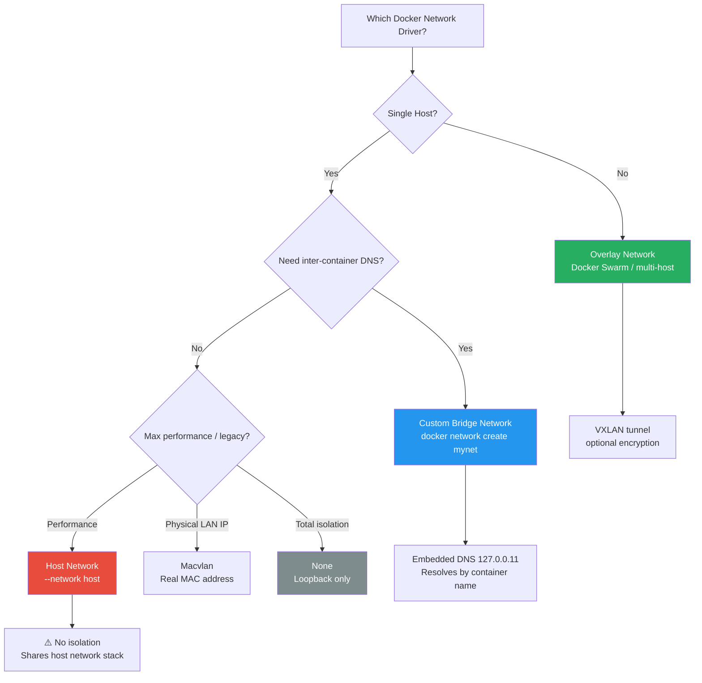
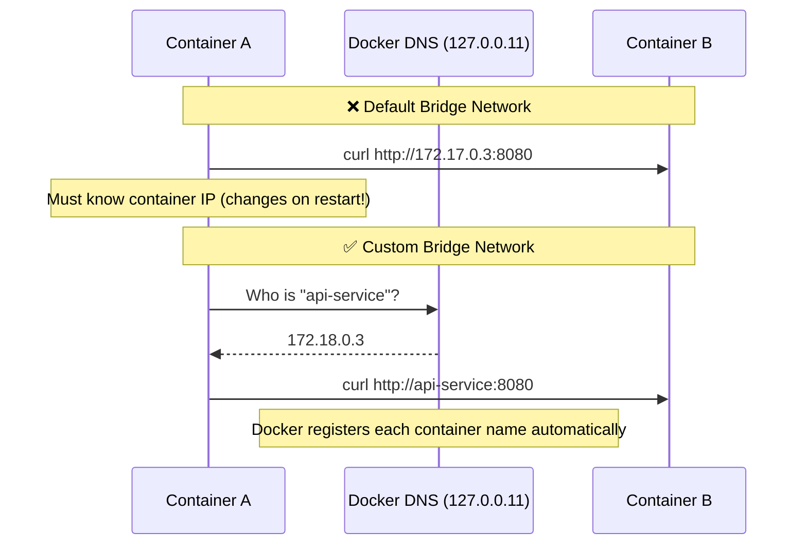
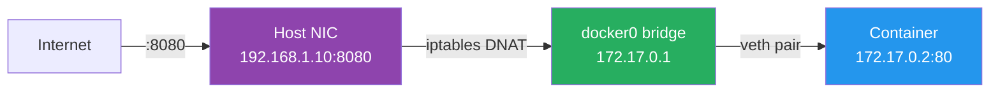
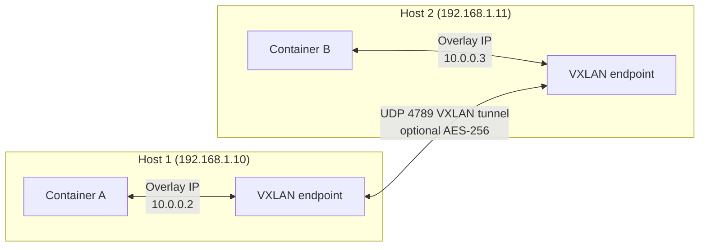

# 🐳 Docker Interview Question — Networking Modes & Container Communication


---

## ❓ The Question

> **"Explain Docker networking modes. How do containers communicate with each other and with the outside world?"**

**Alternate phrasings you may hear:**
- "What is the difference between bridge, host, and overlay networks in Docker?"
- "How does Docker DNS work? How do containers find each other by name?"
- "Why can two containers on the same host not talk to each other by default?"
- "What happens when you run `docker run -p 8080:80`? Explain the networking path."
- "How would you set up container networking for a microservices application?"

---

## 🎯 Why Interviewers Ask This

Docker networking is where containers meet the real world — and where most misconfigurations and security issues happen. Interviewers use this question to test whether you understand:

- **Network isolation**: Can you explain why containers are isolated by default?
- **Service discovery**: How do microservices find each other without hardcoding IPs?
- **Port publishing mechanics**: What actually happens under the hood with `-p`?
- **Multi-host networking**: How does overlay networking enable distributed systems?
- **Security posture**: Do you know the risks of `--network host` and default bridge links?

> 💡 **Instant win**: Most candidates know `bridge` and `host` exist. You stand out by explaining **why custom bridge networks have automatic DNS while the default bridge does not** — this is a subtle but critical distinction.

---

## 📖 Key Terminologies

| Term | Meaning |
|---|---|
| **Network Driver** | Plugin that implements the networking behaviour (bridge, host, overlay, etc.) |
| **Default Bridge (`docker0`)** | Auto-created bridge network; containers communicate via IP only, no DNS |
| **Custom Bridge** | User-created bridge network; containers resolve each other by container name |
| **Host Network** | Container shares the host's network namespace — no isolation, no NAT |
| **Overlay Network** | Multi-host virtual network used by Docker Swarm; encrypts cross-node traffic |
| **Macvlan** | Assigns a real MAC/IP from the LAN to the container — appears as a physical device |
| **None Network** | Completely isolated — no network interface except loopback |
| **CNM** | Container Network Model — Docker's networking specification (Sandbox, Endpoint, Network) |
| **veth pair** | Virtual Ethernet pair connecting container namespace to the bridge |
| **iptables NAT** | Docker's mechanism for port publishing and outbound masquerading |
| **Embedded DNS** | Docker's built-in DNS resolver (127.0.0.11) active on custom networks |

---

## 🗣️ How to Answer (Structured)

A strong answer walks through each driver, highlights the default-vs-custom bridge distinction, and finishes with security awareness. Here is a proven structure:

**1. Start with the mental model:**

> "Docker networking is built on the Container Network Model (CNM). Every container gets a *sandbox* (its own network namespace), connected to a *network* through an *endpoint*. The network driver — bridge, host, overlay — determines how that endpoint behaves."

**2. Cover the five main drivers:**

> "**Bridge** is the default for single-host deployments. Docker creates a `docker0` bridge on the host; each container gets a veth pair connecting it to that bridge. Containers can reach the internet via NAT, and you publish ports with `-p`. The key gotcha: the *default* bridge network only allows inter-container communication by IP — there's no DNS. If you create a *custom* bridge network with `docker network create`, containers can talk to each other by name because Docker's embedded DNS resolver (127.0.0.11) registers every container."

> "**Host** removes all network isolation — the container shares the host's network stack directly. Port 80 in the container IS port 80 on the host. This gives the lowest latency but is a security risk in production."

> "**Overlay** spans multiple Docker hosts. It encapsulates traffic in VXLAN tunnels. This is how Docker Swarm services communicate across nodes. You can optionally encrypt the overlay with `--opt encrypted`."

> "**Macvlan** assigns a real MAC and IP from your physical LAN to the container. Useful for legacy apps that expect to appear on the network as a real device. Requires promiscuous mode on the NIC."

> "**None** gives the container only a loopback interface — total isolation, used for batch jobs or security-sensitive workloads."

**3. Explain the DNS resolution difference (this is the key differentiator):**

> "On the default bridge, if I want container A to reach container B, I have to use B's IP address — and those change on restart. On a custom bridge, Docker's embedded DNS maps container names to IPs automatically, so I can just `curl http://api-service:8080` from any container on the same network."

**4. Explain port publishing:**

> "When I run `-p 8080:80`, Docker adds an iptables DNAT rule: any traffic hitting the host on port 8080 is redirected to the container's IP on port 80. Docker also creates a `docker-proxy` process as a fallback for loopback traffic. The container itself only sees port 80."

**5. Close with a production pattern:**

> "In production I always create named custom bridge networks per service group — frontend, backend, database. Containers only join the networks they need, which enforces least-privilege network isolation without any additional firewall rules."

---

## 🔐 Security Perspective (DevSecOps)

Docker networking misconfigurations are a top container escape and lateral movement vector. Key risks:

| Risk | Impact | Mitigation |
|---|---|---|
| **`--network host`** | Container can bind any host port, sniff host traffic | Avoid in production; use bridge or overlay |
| **Default bridge `--link`** | Legacy feature; creates environment variable leaks | Replace with custom networks |
| **Unrestricted inter-container traffic** | Compromised container can reach all others on the same bridge | Segment networks; use `--icc=false` on the daemon |
| **Unencrypted overlay** | Cross-node traffic visible in VXLAN | Use `--opt encrypted` on overlay networks |
| **Exposed Docker socket (`/var/run/docker.sock`)** | Full control of host networking and all containers | Never mount socket in containers; use API proxies |
| **Privileged + host network** | Equivalent to root on the host | Block via OPA/Kyverno admission policies |

> 🔒 **One-liner**: *"The most dangerous network setting is `--network host` combined with `--privileged` — that combination gives a container unrestricted access to every port and interface on the host. Block it at the admission controller level before workloads ever reach production."*

In a DevSecOps pipeline, enforce network policies at three layers:
1. **Build**: Scan Dockerfile for `--network host` patterns with Hadolint
2. **Deploy**: Kubernetes NetworkPolicy or Calico to restrict pod-to-pod traffic
3. **Runtime**: Falco rules to alert on unexpected network connections from containers

---

## 🖼️ Visuals

### Docker Network Drivers — Decision Flow



---

### Custom Bridge vs Default Bridge — DNS Difference



---

### Port Publishing — iptables NAT Path



---

### Multi-Host Overlay Network (Docker Swarm)



---

## 📊 Quick Comparison

| Feature | Default Bridge | Custom Bridge | Host | Overlay | Macvlan | None |
|---|---|---|---|---|---|---|
| **Inter-container DNS** | ❌ | ✅ by name | N/A | ✅ | ❌ | N/A |
| **Network isolation** | Partial | ✅ | ❌ None | ✅ | Partial | ✅ Full |
| **Port publishing needed** | ✅ | ✅ | ❌ | ✅ | ❌ (real IP) | N/A |
| **Multi-host** | ❌ | ❌ | ❌ | ✅ | ❌ | ❌ |
| **Use case** | Quick tests | Production microservices | High-perf / legacy | Swarm services | Physical LAN integration | Batch / security |
| **Security risk** | Medium | Low | High | Low (+ encrypt) | Medium | None |

---

## 🛠️ Hands-On: Commands & Syntax

### 1. Inspect default networks

```bash
# List all networks
docker network ls

# Output:
# NETWORK ID     NAME      DRIVER    SCOPE
# a1b2c3d4e5f6   bridge    bridge    local
# b2c3d4e5f6a1   host      host      local
# c3d4e5f6a1b2   none      null      local

# Inspect the default bridge
docker network inspect bridge
```

---

### 2. Default bridge — IP-only communication (no DNS)

```bash
# Start two containers on default bridge
docker run -d --name app1 nginx:alpine
docker run -d --name app2 alpine sleep 3600

# Try to reach app1 by name from app2 — FAILS
docker exec app2 wget -qO- http://app1
# wget: bad address 'app1'

# Must use IP — fragile, changes on restart
APP1_IP=$(docker inspect -f '{{range.NetworkSettings.Networks}}{{.IPAddress}}{{end}}' app1)
docker exec app2 wget -qO- http://$APP1_IP
```

---

### 3. Custom bridge — DNS works automatically

```bash
# Create a custom bridge network
docker network create --driver bridge app-network

# Start containers on the custom network
docker run -d --name api-service --network app-network nginx:alpine
docker run -d --name frontend --network app-network alpine sleep 3600

# Reach api-service by NAME — works!
docker exec frontend wget -qO- http://api-service
# Returns nginx welcome page

# Verify DNS resolver
docker exec frontend cat /etc/resolv.conf
# nameserver 127.0.0.11  ← Docker's embedded DNS
# options ndots:0
```

---

### 4. Connect a running container to a second network

```bash
# A container can be on multiple networks simultaneously
docker network connect backend-network frontend

# Verify
docker inspect frontend --format '{{json .NetworkSettings.Networks}}' | jq 'keys'
# ["app-network", "backend-network"]
```

---

### 5. Port publishing mechanics

```bash
# -p host_port:container_port
docker run -d -p 8080:80 --name webserver nginx:alpine

# Verify iptables DNAT rule (on Linux host)
sudo iptables -t nat -L DOCKER -n | grep 8080
# DNAT  tcp  --  0.0.0.0/0  0.0.0.0/0  tcp dpt:8080 to:172.17.0.2:80

# Bind to specific interface only (security best practice)
docker run -d -p 127.0.0.1:8080:80 --name local-only nginx:alpine

# Publish all exposed ports randomly
docker run -d -P nginx:alpine
docker port <container_id>   # shows assigned ports
```

---

### 6. Host network

```bash
# Container shares host network — no -p needed
docker run -d --network host --name host-nginx nginx:alpine
# Nginx is now directly on host port 80

# Confirm — container has same IP as host
docker exec host-nginx ip addr show eth0
```

---

### 7. Overlay network (Docker Swarm)

```bash
# Initialize Swarm (run once on manager node)
docker swarm init --advertise-addr <manager-ip>

# Create encrypted overlay network
docker network create \
  --driver overlay \
  --opt encrypted \
  --subnet 10.0.9.0/24 \
  secure-overlay

# Deploy a service on the overlay
docker service create \
  --name api \
  --network secure-overlay \
  --replicas 3 \
  nginx:alpine

# Services resolve each other by service name via overlay DNS
```

---

### 8. Macvlan network

```bash
# Create macvlan network attached to physical interface
docker network create \
  --driver macvlan \
  --subnet 192.168.1.0/24 \
  --gateway 192.168.1.1 \
  --ip-range 192.168.1.240/28 \
  -o parent=eth0 \
  macvlan-net

# Container gets a real LAN IP
docker run -d \
  --network macvlan-net \
  --ip 192.168.1.241 \
  --name physical-app \
  nginx:alpine
```

---

### 9. Network security hardening

```bash
# Disable inter-container communication on default bridge
# Add to /etc/docker/daemon.json:
cat <<EOF | sudo tee /etc/docker/daemon.json
{
  "icc": false,
  "ip-forward": true,
  "log-driver": "json-file",
  "log-opts": {
    "max-size": "10m",
    "max-file": "3"
  }
}
EOF
sudo systemctl restart docker

# With icc=false, containers on the default bridge cannot talk to each other
# Custom networks still work (explicit allow)
```

---

### 10. Docker Compose multi-network example

```yaml
# docker-compose.yml — proper network segmentation
version: "3.9"

services:
  frontend:
    image: nginx:alpine
    networks:
      - frontend-net
    ports:
      - "80:80"

  api:
    image: myapp:latest
    networks:
      - frontend-net   # reachable by frontend
      - backend-net    # can reach database

  database:
    image: postgres:16-alpine
    networks:
      - backend-net    # NOT reachable by frontend directly
    environment:
      POSTGRES_PASSWORD_FILE: /run/secrets/db_password
    secrets:
      - db_password

networks:
  frontend-net:
    driver: bridge
  backend-net:
    driver: bridge
    internal: true    # no outbound internet access

secrets:
  db_password:
    file: ./secrets/db_password.txt
```

---

### 11. Diagnose networking issues

```bash
# Check container's network config
docker inspect <container> --format '{{json .NetworkSettings}}' | jq .

# Test DNS resolution from inside container
docker exec <container> nslookup other-service
docker exec <container> cat /etc/resolv.conf

# Test connectivity
docker exec <container> ping -c 3 other-service
docker exec <container> curl -v http://other-service:8080/health

# Trace the route
docker exec <container> traceroute 8.8.8.8

# View active iptables rules Docker created
sudo iptables -t nat -L -n -v | grep DOCKER
sudo iptables -L DOCKER-ISOLATION-STAGE-1 -n -v
```

---

## 🤖 AI & The New Trend (2024–2025)

Docker networking continues to evolve alongside the broader container ecosystem:

**eBPF-based networking (replacing iptables):**
Tools like Cilium use eBPF to handle container networking at the kernel level — bypassing iptables entirely. This delivers significantly better performance at scale (10x fewer CPU cycles for NAT) and enables richer observability. Docker Desktop started integrating eBPF-based features in 2024.

**Service mesh integration:**
In 2024–2025, the pattern of sidecar-less service meshes (Istio Ambient mode, Linkerd 2.x) gained traction. These use Node-level proxies (ztunnel) instead of per-pod sidecars, reducing the overhead of mTLS and traffic policy enforcement on container networks.

**Docker's own networking improvements (2024):**
- `docker network connect` now supports `--ip6` for IPv6 assignment
- BuildKit network modes expanded for better build-time dependency resolution
- Docker Desktop 4.x introduced improved DNS handling on macOS (replacing the legacy `com.docker.vpnkit`)

**AI-assisted network policy generation:**
Tools like Codeium, Copilot, and dedicated security platforms (Prisma Cloud, Wiz) can now auto-generate Kubernetes NetworkPolicy manifests by analysing observed container traffic patterns — moving from "open by default" to "deny by default with observed allowlists" without manual YAML authoring.

---

## ✅ Prerequisites

Before this question, you should be comfortable with:

- **Linux networking basics**: What is a network namespace? What is a bridge interface?
- **Docker fundamentals**: Running containers, docker run flags, images vs containers
- **IP addressing**: Subnets, NAT, port forwarding — at a conceptual level
- **Docker Compose**: Multi-service definitions, the `networks:` key
- **iptables basics**: What DNAT/SNAT rules do (not writing them, just reading)

You do NOT need to memorise iptables syntax — understanding *that* Docker uses them for port publishing is enough.

---

## 📚 Further Reading

- [Docker Networking Overview — Official Docs](https://docs.docker.com/network/)
- [Docker Bridge Network Driver](https://docs.docker.com/network/drivers/bridge/)
- [Docker Overlay Networks](https://docs.docker.com/network/drivers/overlay/)
- [Macvlan Network Driver](https://docs.docker.com/network/drivers/macvlan/)
- [Docker and iptables](https://docs.docker.com/network/packet-filtering-firewalls/)
- [Cilium — eBPF-based networking](https://cilium.io/get-started/)
- [Container Networking from Scratch (Ivan Velichko)](https://iximiuz.com/en/posts/container-networking-is-simple/)

---

## 🔁 Related / Follow-up Questions

1. **"How does Kubernetes networking differ from Docker networking?"**
   → Kubernetes uses a flat pod network (CNI plugins like Calico, Flannel) — every pod gets a unique IP and can reach every other pod without NAT by default.

2. **"What is a CNI plugin and how does it relate to Docker networking?"**
   → CNI (Container Network Interface) is the CNCF standard; Docker uses CNM. Kubernetes uses CNI plugins; Docker Swarm uses Docker's built-in overlay.

3. **"How would you restrict which containers can talk to your database container?"**
   → Create a dedicated `backend-net` with `internal: true`; only attach the API container and DB container to it. Add `--icc=false` at the daemon level.

4. **"What is the difference between `-p 80:80` and `--network host`?"**
   → `-p` publishes a specific port via iptables NAT, keeping isolation. `--network host` removes all isolation — the container owns the host's entire network stack.

5. **"How do you enable mTLS between containers?"**
   → Use a service mesh (Envoy sidecar, Istio, Linkerd) or Docker Swarm's built-in overlay encryption (`--opt encrypted`).

6. **"How does Docker DNS resolve service names in Docker Compose?"**
   → Compose creates a custom bridge network per project. Docker's embedded DNS (127.0.0.11) auto-registers each service name, making `http://api:8080` resolve without any hosts-file edits.

7. **"What happens to network config when a container restarts?"**
   → IP addresses can change on restart within the default bridge. Custom networks reassign the same name, so DNS still works. Macvlan assignments are stable if you set `--ip` explicitly.

8. **"How would you debug a container that cannot reach the internet?"**
   → Check: `docker exec <c> curl https://8.8.8.8` (bypasses DNS), then `curl https://google.com` (tests DNS). Verify `ip-forward=1` on the host (`sysctl net.ipv4.ip_forward`). Check iptables FORWARD chain for DROP rules.

---

## 📌 30-Second Interview Summary

> **Docker has five network drivers: bridge, host, overlay, macvlan, and none.**
>
> **Bridge** is the default for single-host containers. The *default* bridge network only allows containers to communicate by IP — there is no DNS. A *custom* bridge network (`docker network create`) enables Docker's embedded DNS (127.0.0.11), so containers find each other by name. This is the most important distinction to know.
>
> **Host** shares the host's network stack — zero isolation, zero NAT overhead, but a security risk.
>
> **Overlay** spans multiple Docker hosts using VXLAN tunnels — the backbone of Docker Swarm services, with optional AES encryption.
>
> **Macvlan** gives containers a real MAC and IP on the physical LAN, useful for legacy apps.
>
> In production: always use **custom bridge networks**, segment by service tier (frontend / backend / database), set `internal: true` on the database network, and never use `--network host` or `--icc` open in untrusted environments.
