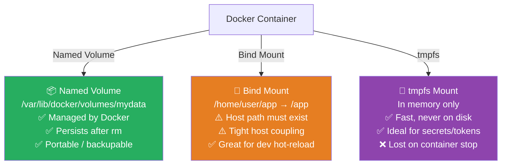
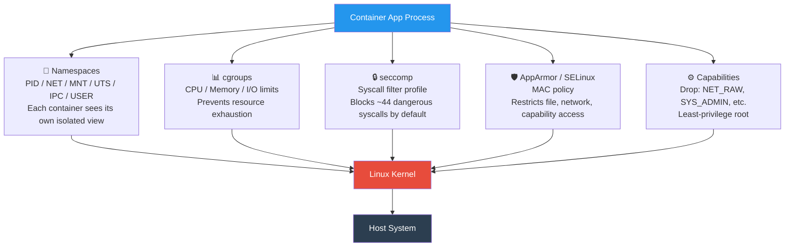
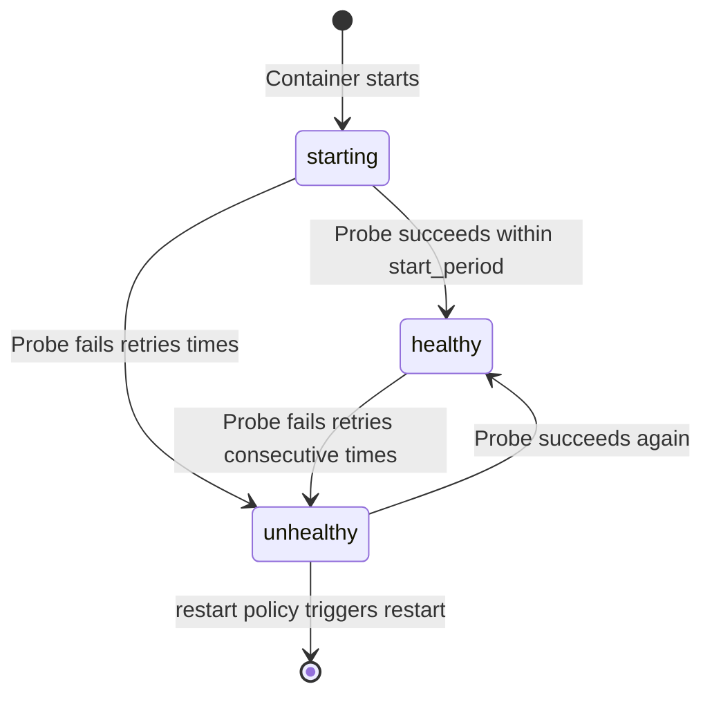
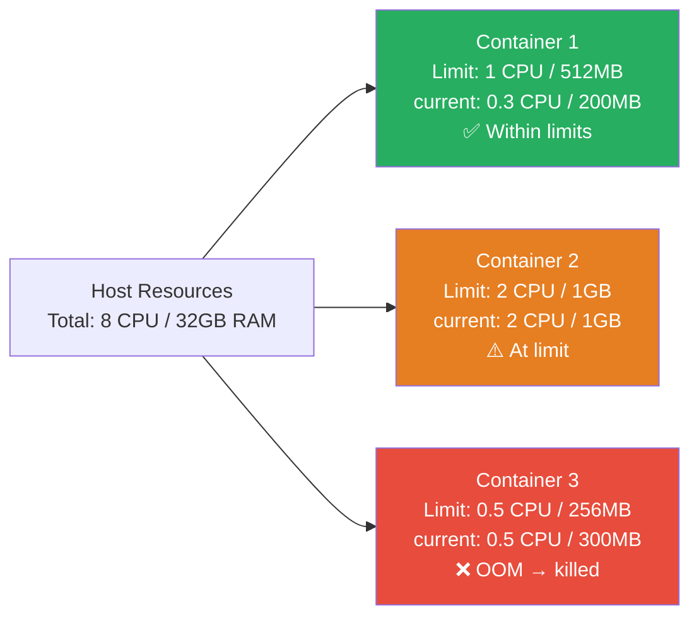
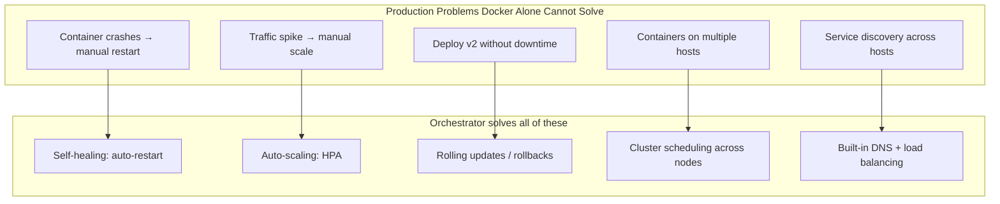
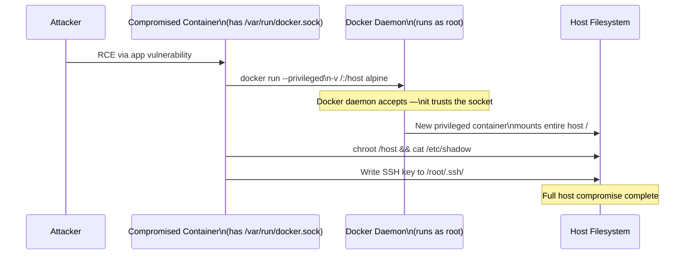

# 🐳 Docker — Important Concepts Reference (Medium / Hard)


> **This file covers 9 high-value Docker interview topics in one place.**
> Each section follows interview-ready structure: concept explanation → visual diagram → hands-on commands → security perspective → quick comparison.

---

## 📋 Table of Contents

| # | Topic | Level |
|---|---|---|
| [1](#1-docker-volumes-vs-bind-mounts-vs-tmpfs) | Docker Volumes vs Bind Mounts vs tmpfs | Medium |
| [2](#2-docker-security-namespaces-cgroups-seccomp-apparmor-capabilities-rootless) | Docker Security — Namespaces, cgroups, seccomp, AppArmor, Capabilities, Rootless | Hard |
| [3](#3-docker-compose-advanced-features) | Docker Compose Advanced Features | Medium |
| [4](#4-multi-stage-build-advanced-patterns) | Multi-Stage Build Advanced Patterns | Medium |
| [5](#5-docker-health-checks) | Docker Health Checks | Medium |
| [6](#6-docker-resource-limits-cpu--memory) | Docker Resource Limits — CPU & Memory | Medium |
| [7](#7-docker-registry-image-signing--content-trust) | Docker Registry, Image Signing & Content Trust | Medium/Hard |
| [8](#8-container-orchestration-basics) | Container Orchestration Basics | Medium |
| [9](#9-docker-socket-security) | Docker Socket Security | Hard |

---

---

## 1. Docker Volumes vs Bind Mounts vs tmpfs

### ❓ The Question

> **"What is the difference between Docker volumes, bind mounts, and tmpfs mounts? When would you use each?"**

**Alternate phrasings:**
- "How do you persist data in Docker containers?"
- "If a container crashes, will the data inside it be lost?"
- "Why do we use named volumes instead of bind mounts in production?"

---

### 🎯 Why Interviewers Ask This

Data persistence is fundamental to production container design. Interviewers want to know if you understand that the container's writable layer is ephemeral — and which mechanism to reach for depending on the use case (stateful databases, config injection, in-memory secrets).

> 💡 **Instant win**: Explain that named volumes are managed entirely by Docker (stored under `/var/lib/docker/volumes/`), survive container deletion, can be backed up with `docker run --volumes-from`, and are portable across hosts — whereas bind mounts depend on the host directory structure.

---

### 📖 Key Terminologies

| Term | Meaning |
|---|---|
| **Writable layer** | The container's ephemeral R/W layer — lost when container is removed |
| **Named volume** | Docker-managed persistent storage; lives at `/var/lib/docker/volumes/<name>` |
| **Anonymous volume** | Volume without a name; created by `VOLUME` in Dockerfile; hard to manage |
| **Bind mount** | Host directory mounted into container; host path must exist |
| **tmpfs mount** | In-memory filesystem; never written to disk; lost on stop |
| **Volume driver** | Plugin to store volumes remotely (NFS, AWS EFS, Azure Disk, etc.) |

---

### 🖼️ Visual — Storage Types Comparison



---

### 📊 Quick Comparison

| Feature | Named Volume | Bind Mount | tmpfs |
|---|---|---|---|
| **Managed by Docker** | ✅ | ❌ | ✅ |
| **Persists after `docker rm`** | ✅ | ✅ (host file) | ❌ |
| **Writable from host** | Via docker cp | ✅ Direct | ❌ |
| **Portable** | ✅ | ❌ (host-specific) | N/A |
| **Use for DB data** | ✅ Best choice | ⚠️ Dev only | ❌ |
| **Use for config files** | ✅ | ✅ | ❌ |
| **Use for secrets/tokens** | ❌ | ❌ | ✅ Best choice |
| **Use for dev hot-reload** | ❌ | ✅ Best choice | ❌ |

---

### 🛠️ Hands-On Commands

```bash
# ── Named Volume ──────────────────────────────────────────────
# Create a named volume
docker volume create postgres-data

# Use named volume in a container
docker run -d \
  --name postgres \
  -v postgres-data:/var/lib/postgresql/data \
  -e POSTGRES_PASSWORD=secret \
  postgres:16-alpine

# Inspect the volume (see mountpoint on host)
docker volume inspect postgres-data
# "Mountpoint": "/var/lib/docker/volumes/postgres-data/_data"

# Backup a volume
docker run --rm \
  -v postgres-data:/data \
  -v $(pwd):/backup \
  alpine tar czf /backup/postgres-backup.tar.gz /data

# List and prune unused volumes
docker volume ls
docker volume prune    # removes all volumes not used by any container


# ── Bind Mount ────────────────────────────────────────────────
# Mount current directory into container (dev hot-reload)
docker run -d \
  --name dev-app \
  -v $(pwd)/src:/app/src \
  -p 3000:3000 \
  node:20-alpine npm run dev

# Read-only bind mount (inject config, prevent container writing to host)
docker run -d \
  -v $(pwd)/nginx.conf:/etc/nginx/nginx.conf:ro \
  nginx:alpine


# ── tmpfs Mount ───────────────────────────────────────────────
# Mount tmpfs for in-memory secrets (never hits disk)
docker run -d \
  --name secure-app \
  --tmpfs /run/secrets:rw,noexec,nosuid,size=10m \
  myapp:latest

# tmpfs in Docker Compose
# volumes:
#   - type: tmpfs
#     target: /run/secrets
#     tmpfs:
#       size: 10485760  # 10MB


# ── Docker Compose volumes ────────────────────────────────────
# docker-compose.yml
# services:
#   db:
#     image: postgres:16-alpine
#     volumes:
#       - db-data:/var/lib/postgresql/data       # named volume
#       - ./init.sql:/docker-entrypoint-initdb.d/init.sql:ro  # bind mount
#   app:
#     volumes:
#       - type: tmpfs
#         target: /tmp/tokens
# volumes:
#   db-data:
#     external: false   # Docker manages it
```

---

### 🔐 Security Perspective

- **Never bind-mount `/` or `/etc`** — a misconfigured container can overwrite host system files
- **Use `:ro` (read-only) for config bind mounts** — prevents container from modifying host files
- **tmpfs for secrets** — tokens, API keys, or session data should never be written to disk
- **Volume drivers for cloud**: In AWS, use `rexray/ebs` or EFS mount helpers so data lives on encrypted EBS/EFS, not bare host disk

---

---

## 2. Docker Security — Namespaces, cgroups, seccomp, AppArmor, Capabilities, Rootless

### ❓ The Question

> **"How does Docker isolate containers from the host and from each other? Explain the Linux kernel security mechanisms Docker uses."**

**Alternate phrasings:**
- "What is the difference between a container and a VM from a security perspective?"
- "How do you harden a Docker container in production?"
- "What is rootless Docker and why does it matter?"
- "What are Linux capabilities and why does Docker drop them?"

---

### 🎯 Why Interviewers Ask This

This is a **hard-level** question that separates engineers who've run containers from engineers who understand them. Docker doesn't create VMs — it uses Linux kernel primitives. Knowing these primitives tells the interviewer you understand container escape risks, the attack surface, and how to harden workloads.

> 💡 **Instant win**: State clearly that Docker containers share the host kernel — unlike VMs. Container isolation is entirely dependent on kernel namespaces, cgroups, and security modules. A kernel vulnerability can break container isolation entirely.

---

### 📖 Key Terminologies

| Mechanism | Purpose |
|---|---|
| **Namespaces** | Isolate process view (PID, NET, MNT, UTS, IPC, USER) |
| **cgroups** | Limit and account for resource usage (CPU, memory, disk I/O) |
| **seccomp** | Filter which syscalls a container process can make |
| **AppArmor / SELinux** | Mandatory Access Control — restrict file/network access by policy |
| **Capabilities** | Fine-grained breakdown of root privileges; Docker drops most by default |
| **Rootless Docker** | Docker daemon and containers run as non-root user |
| **Privileged mode** | `--privileged` gives container ALL capabilities + disables seccomp — dangerous |
| **User namespace** | Maps container root (UID 0) to an unprivileged UID on the host |

---

### 🖼️ Visual — Docker Security Layers



---

### 🛠️ Hands-On Commands

```bash
# ── Namespaces ────────────────────────────────────────────────
# See container's namespaces
docker run -d --name test nginx:alpine
PID=$(docker inspect -f '{{.State.Pid}}' test)
ls -la /proc/$PID/ns/
# lrwxrwxrwx  net -> net:[4026532xxx]   ← unique to this container
# lrwxrwxrwx  pid -> pid:[4026532yyy]

# Container sees PID 1 (nginx), host sees the real PID
docker exec test ps aux
# PID   USER  COMMAND
#   1   root  nginx: master process

# Host sees the same process with its real PID
ps aux | grep nginx

# USER namespace — map container root to unprivileged host UID
# In /etc/docker/daemon.json:
# { "userns-remap": "default" }
# Now container UID 0 maps to host UID 100000 — not real root


# ── cgroups ───────────────────────────────────────────────────
# Limit memory to 256MB and CPUs to 0.5
docker run -d \
  --name limited-app \
  --memory 256m \
  --memory-swap 256m \
  --cpus 0.5 \
  nginx:alpine

# Verify limits
docker stats limited-app --no-stream
cat /sys/fs/cgroup/memory/docker/<container_id>/memory.limit_in_bytes


# ── seccomp ───────────────────────────────────────────────────
# View default seccomp profile
curl -o default-seccomp.json \
  https://raw.githubusercontent.com/moby/moby/master/profiles/seccomp/default.json

# Run with custom seccomp (block specific syscalls)
docker run --security-opt seccomp=./my-seccomp.json myapp:latest

# Run with NO seccomp (dangerous — only for debugging)
docker run --security-opt seccomp=unconfined myapp:latest

# List syscalls blocked by default (partial)
# - reboot, kexec_load (reboot host)
# - mount (mount filesystems)
# - ptrace (trace other processes)
# - create_module (load kernel modules)


# ── Capabilities ──────────────────────────────────────────────
# Docker default: drops ~14 capabilities, keeps ~13 safe ones
# Show capabilities of a running container
docker exec test cat /proc/1/status | grep Cap

# Run with ALL capabilities dropped (most secure)
docker run \
  --cap-drop ALL \
  --cap-add NET_BIND_SERVICE \
  nginx:alpine
# Container can bind port 80 but nothing else

# NEVER use --privileged in production:
docker run --privileged myapp  # ← grants ALL capabilities + disables seccomp + apparmor

# Check if a container is privileged
docker inspect <container> --format '{{.HostConfig.Privileged}}'


# ── AppArmor ──────────────────────────────────────────────────
# Docker loads the 'docker-default' AppArmor profile automatically on supported systems
docker inspect <container> --format '{{.AppArmorProfile}}'
# docker-default

# Apply a custom AppArmor profile
docker run --security-opt apparmor=my-profile myapp:latest

# Load a custom AppArmor profile
apparmor_parser -r -W /etc/apparmor.d/docker-my-profile


# ── Rootless Docker ───────────────────────────────────────────
# Install rootless mode (Ubuntu/Debian)
dockerd-rootless-setuptool.sh install

# The daemon itself runs as your user — no root required
systemctl --user start docker
export DOCKER_HOST=unix://$XDG_RUNTIME_DIR/docker.sock
docker run hello-world

# Rootless containers: even if container escapes, attacker gets YOUR user, not root
```

---

### 🔐 Security Hardening Checklist

```bash
# Minimal production container security flags:
docker run -d \
  --read-only \                        # read-only root filesystem
  --cap-drop ALL \                     # drop all capabilities
  --cap-add NET_BIND_SERVICE \         # add back only what's needed
  --no-new-privileges \                # prevent privilege escalation via setuid
  --security-opt seccomp=./profile.json \
  --security-opt apparmor=docker-default \
  --user 1001:1001 \                   # run as non-root UID
  --memory 256m \
  --cpus 0.5 \
  myapp:latest
```

---

### 📊 Quick Comparison — Security Mechanisms

| Mechanism | What it stops | Default state |
|---|---|---|
| **Namespaces** | Container sees host PIDs/network/files | Always active |
| **cgroups** | Resource exhaustion / DoS | Active; no limits unless set |
| **seccomp** | Dangerous syscalls (reboot, mount, ptrace) | Active (default profile) |
| **AppArmor** | File/network access violations | Active on Ubuntu hosts |
| **Capabilities** | Overprivileged root operations | 14 dropped by default |
| **Rootless** | Root daemon compromise | Opt-in only |
| **`--no-new-privileges`** | setuid/setgid escalation | Off by default |
| **`--read-only`** | Container writing to own filesystem | Off by default |

---

---

## 3. Docker Compose Advanced Features

### ❓ The Question

> **"What are some advanced Docker Compose features you've used in production? How do you handle secrets, health check dependencies, and environment-specific overrides?"**

---

### 🎯 Why Interviewers Ask This

Most candidates know `docker-compose up`. Interviewers want to see if you've used Compose beyond the basics — secrets management, override files for environment parity, `depends_on` with health conditions, profiles, and extension fields.

---

### 🛠️ Hands-On — Advanced Compose Patterns

#### A. Override files for environment parity

```bash
# Base configuration
# docker-compose.yml

# Development overrides
# docker-compose.override.yml  ← auto-loaded by Compose

# Production overrides
# docker-compose.prod.yml

# Apply specific override
docker compose -f docker-compose.yml -f docker-compose.prod.yml up -d
```

```yaml
# docker-compose.yml (base)
version: "3.9"
services:
  api:
    image: myapp:${IMAGE_TAG:-latest}
    environment:
      - APP_ENV=${APP_ENV:-development}
    ports:
      - "8080:8080"

# docker-compose.override.yml (dev — auto-loaded)
services:
  api:
    build: .           # build locally in dev
    volumes:
      - ./src:/app/src  # hot-reload
    environment:
      - DEBUG=true

# docker-compose.prod.yml
services:
  api:
    deploy:
      replicas: 3
      resources:
        limits:
          cpus: "0.5"
          memory: 256M
    restart: always
    logging:
      driver: awslogs
      options:
        awslogs-group: /myapp/api
        awslogs-region: us-east-1
```

---

#### B. `depends_on` with health conditions (Compose v3.9+)

```yaml
services:
  api:
    image: myapp:latest
    depends_on:
      db:
        condition: service_healthy     # wait for DB to be healthy
      redis:
        condition: service_started     # just started is enough

  db:
    image: postgres:16-alpine
    healthcheck:
      test: ["CMD-SHELL", "pg_isready -U postgres"]
      interval: 5s
      timeout: 5s
      retries: 5
      start_period: 10s

  redis:
    image: redis:7-alpine
    healthcheck:
      test: ["CMD", "redis-cli", "ping"]
      interval: 5s
      timeout: 3s
      retries: 3
```

---

#### C. Secrets management (Compose + Docker Swarm secrets)

```yaml
services:
  api:
    image: myapp:latest
    secrets:
      - db_password
      - jwt_secret
    environment:
      DB_PASSWORD_FILE: /run/secrets/db_password

secrets:
  db_password:
    file: ./secrets/db_password.txt   # dev: from file
    # external: true                  # prod: from Swarm secret store
  jwt_secret:
    file: ./secrets/jwt_secret.txt
```

```python
# In application code — read secret from file, not env var
import os
with open(os.environ['DB_PASSWORD_FILE']) as f:
    db_password = f.read().strip()
```

---

#### D. Profiles — conditional service activation

```yaml
services:
  api:
    image: myapp:latest
    # no profile = always started

  swagger-ui:
    image: swaggerapi/swagger-ui
    profiles: ["docs"]     # only start with --profile docs

  pgadmin:
    image: dpage/pgadmin4
    profiles: ["debug"]    # only start with --profile debug
```

```bash
# Start only core services
docker compose up -d

# Start with swagger-ui
docker compose --profile docs up -d

# Start with all debug tools
docker compose --profile docs --profile debug up -d
```

---

#### E. Extension fields (YAML anchors — DRY config)

```yaml
# Reusable logging config via YAML anchors
x-logging: &default-logging
  driver: json-file
  options:
    max-size: "10m"
    max-file: "3"

x-restart-policy: &restart-always
  restart: always

services:
  api:
    image: myapp:latest
    <<: *restart-always
    logging: *default-logging

  worker:
    image: myworker:latest
    <<: *restart-always
    logging: *default-logging
```

---

#### F. Useful Compose commands

```bash
# Show config after variable substitution and merging overrides
docker compose config

# Scale a service
docker compose up -d --scale worker=5

# View logs for a specific service, follow
docker compose logs -f api

# Run a one-off command in a service container
docker compose run --rm api python manage.py migrate

# Force recreate even if config hasn't changed
docker compose up -d --force-recreate

# Watch for changes and live-reload (Compose Watch — 2023+)
docker compose watch

# Remove stopped containers and their volumes
docker compose down -v
```

---

---

## 4. Multi-Stage Build Advanced Patterns

### ❓ The Question

> **"Show me advanced multi-stage build patterns beyond the basic builder → runner pattern. How do you use build arguments, cache mounts, and parallel stages?"**

---

### 🎯 Why Interviewers Ask This

Q3 covered the basics of multi-stage builds. This section focuses on production-grade patterns: BuildKit cache mounts for faster CI, parallel stages, build arguments for environment differentiation, and target-based builds.

---

### 🛠️ Advanced Multi-Stage Patterns

#### A. Parallel stages + cache mounts (BuildKit)

```dockerfile
# syntax=docker/dockerfile:1.6
# IMPORTANT: first line enables BuildKit extended syntax

# ── Stage 1a: Download Go dependencies (cached separately) ──
FROM golang:1.22-alpine AS go-deps
WORKDIR /app
COPY go.mod go.sum ./
# Cache mount: /root/pkg/mod is reused across builds if go.sum unchanged
RUN --mount=type=cache,target=/root/pkg/mod \
    go mod download

# ── Stage 1b: Download Node dependencies (runs in parallel) ──
FROM node:20-alpine AS node-deps
WORKDIR /ui
COPY ui/package.json ui/package-lock.json ./
# Cache mount for npm
RUN --mount=type=cache,target=/root/.npm \
    npm ci --prefer-offline

# ── Stage 2a: Build Go binary ──
FROM go-deps AS go-build
COPY . .
RUN --mount=type=cache,target=/root/pkg/mod \
    --mount=type=cache,target=/root/.cache/go-build \
    CGO_ENABLED=0 go build -ldflags="-s -w" -o /app/server ./cmd/server

# ── Stage 2b: Build UI ──
FROM node-deps AS ui-build
COPY ui/ ./
RUN npm run build

# ── Final stage: minimal runtime image ──
FROM gcr.io/distroless/static-debian12 AS production
COPY --from=go-build /app/server /server
COPY --from=ui-build /ui/dist /static
USER nonroot:nonroot
ENTRYPOINT ["/server"]
```

```bash
# Build with BuildKit enabled (default in Docker 23+)
DOCKER_BUILDKIT=1 docker build --target production -t myapp:latest .

# Build only the go-build stage (useful for CI unit tests)
docker build --target go-build -t myapp:test .

# Inspect build cache
docker buildx du
```

---

#### B. Build arguments for environment-specific images

```dockerfile
FROM node:20-alpine AS base
WORKDIR /app
COPY package*.json ./
RUN npm ci

FROM base AS development
ENV NODE_ENV=development
RUN npm install --include=dev
CMD ["npm", "run", "dev"]

FROM base AS production
ARG BUILD_VERSION=unknown
ARG BUILD_DATE=unknown
ENV NODE_ENV=production
LABEL org.opencontainers.image.version=$BUILD_VERSION
LABEL org.opencontainers.image.created=$BUILD_DATE
COPY . .
RUN npm run build && npm prune --production
CMD ["node", "dist/server.js"]
```

```bash
# Build for production with version metadata
docker build \
  --target production \
  --build-arg BUILD_VERSION=$(git describe --tags) \
  --build-arg BUILD_DATE=$(date -u +%Y-%m-%dT%H:%M:%SZ) \
  -t myapp:$(git describe --tags) .
```

---

#### C. Secret mounts during build (never in image layers)

```dockerfile
# syntax=docker/dockerfile:1.6
FROM python:3.12-slim AS build
# Install from private PyPI without baking credentials into an image layer
RUN --mount=type=secret,id=pip_conf,dst=/root/.config/pip/pip.conf \
    pip install --no-cache-dir -r requirements.txt
```

```bash
# Pass secret at build time — NOT stored in image
docker buildx build \
  --secret id=pip_conf,src=./pip.conf \
  -t myapp:latest .
```

---

---

## 5. Docker Health Checks

### ❓ The Question

> **"What is a Docker health check? How does it affect container orchestration? Show me a production-grade health check."**

---

### 🎯 Why Interviewers Ask This

Without a health check, Docker (and Kubernetes) considers a container healthy the moment its process starts — even if the app inside is still initialising or has crashed. Health checks enable self-healing infrastructure. Interviewers use this to see if you build observable, production-ready containers.

> 💡 **Instant win**: Explain the three states — `starting`, `healthy`, `unhealthy` — and that `depends_on: condition: service_healthy` in Compose and Kubernetes liveness/readiness probes both depend on this concept.

---

### 🖼️ Visual — Health Check State Machine



---

### 🛠️ Health Check Syntax & Patterns

```dockerfile
# ── Dockerfile HEALTHCHECK ────────────────────────────────────

# HTTP endpoint health check
HEALTHCHECK --interval=30s \
            --timeout=10s \
            --start-period=40s \
            --retries=3 \
  CMD curl -f http://localhost:8080/health || exit 1

# TCP port check (for non-HTTP services)
HEALTHCHECK --interval=10s --timeout=5s --retries=3 \
  CMD nc -z localhost 5432 || exit 1

# Custom script health check
HEALTHCHECK --interval=30s --timeout=10s --retries=3 \
  CMD ["/app/healthcheck.sh"]
```

```bash
# ── Runtime health check override ────────────────────────────
docker run -d \
  --health-cmd="curl -f http://localhost:8080/health || exit 1" \
  --health-interval=30s \
  --health-timeout=10s \
  --health-start-period=40s \
  --health-retries=3 \
  myapp:latest

# Disable health check
docker run --no-healthcheck myapp:latest

# ── Check health status ───────────────────────────────────────
docker inspect --format='{{.State.Health.Status}}' <container>
# starting | healthy | unhealthy

# View health check log (last 5 results)
docker inspect --format='{{json .State.Health}}' <container> | jq .

# Wait for container to be healthy in scripts
until [ "$(docker inspect -f '{{.State.Health.Status}}' myapp)" = "healthy" ]; do
  echo "Waiting for myapp to be healthy..."
  sleep 2
done
echo "myapp is healthy!"
```

---

#### Production health check endpoint (Python/Flask)

```python
# app.py — structured health endpoint
from flask import Flask, jsonify
import psycopg2, redis, os

app = Flask(__name__)

@app.route('/health')
def health():
    checks = {}
    status_code = 200

    # Check DB connectivity
    try:
        conn = psycopg2.connect(os.environ['DATABASE_URL'], connect_timeout=3)
        conn.close()
        checks['database'] = 'ok'
    except Exception as e:
        checks['database'] = f'error: {str(e)}'
        status_code = 503

    # Check Redis
    try:
        r = redis.from_url(os.environ['REDIS_URL'], socket_timeout=3)
        r.ping()
        checks['redis'] = 'ok'
    except Exception as e:
        checks['redis'] = f'error: {str(e)}'
        status_code = 503

    return jsonify({'status': 'ok' if status_code == 200 else 'degraded',
                    'checks': checks}), status_code
```

---

---

## 6. Docker Resource Limits — CPU & Memory

### ❓ The Question

> **"How do you prevent a single container from consuming all CPU and memory on a host? What happens when a container exceeds its memory limit?"**

---

### 🎯 Why Interviewers Ask This

Without resource limits, one poorly behaved container can DoS an entire host and take down every other container running on it. This question tests operational maturity — knowing not just *how* to set limits but *what happens* when they're breached.

> 💡 **Instant win**: Explain that when a container exceeds its memory limit, the Linux OOM (Out of Memory) killer terminates the container process — it's a hard kill, not a graceful shutdown. Memory *swap* limits prevent the container from using swap as a fallback.

---

### 🖼️ Visual — cgroup Resource Control



---

### 🛠️ Resource Limit Commands

```bash
# ── Memory limits ─────────────────────────────────────────────
# Hard memory limit: 512MB
# Swap limit == memory limit: no swap allowed
docker run -d \
  --memory 512m \
  --memory-swap 512m \         # swap = memory means no swap
  --memory-reservation 256m \  # soft limit (scheduling hint)
  --oom-kill-disable=false \   # allow OOM killer (default true)
  myapp:latest

# If --memory-swap > --memory: container gets (swap - memory) of actual swap
# --memory 512m --memory-swap 1g → 512MB RAM + 512MB swap

# ── CPU limits ────────────────────────────────────────────────
# Limit to 1.5 CPUs (CFS quota/period)
docker run -d \
  --cpus 1.5 \
  myapp:latest

# Pin to specific CPU cores (affinity)
docker run -d \
  --cpuset-cpus "0,1" \      # only run on CPU 0 and 1
  myapp:latest

# CPU shares (relative weight — only matters under contention)
docker run -d --cpu-shares 512 low-priority-job   # default is 1024
docker run -d --cpu-shares 2048 high-priority-api

# ── I/O limits ────────────────────────────────────────────────
# Limit block I/O read to 10MB/s on /dev/sda
docker run -d \
  --device-read-bps /dev/sda:10mb \
  --device-write-bps /dev/sda:10mb \
  myapp:latest

# ── Monitor resource usage ────────────────────────────────────
# Live stats for all containers
docker stats

# Stats snapshot (no stream)
docker stats --no-stream --format \
  "table {{.Name}}\t{{.CPUPerc}}\t{{.MemUsage}}\t{{.MemPerc}}"

# ── Docker Compose resource limits ───────────────────────────
# docker-compose.yml
# services:
#   api:
#     image: myapp:latest
#     deploy:
#       resources:
#         limits:
#           cpus: "0.5"
#           memory: 256M
#         reservations:
#           cpus: "0.25"
#           memory: 128M
```

---

### 📊 What Happens When Limits Are Hit

| Limit breached | Behaviour |
|---|---|
| **Memory hard limit** | OOM killer terminates container process (exit code 137) |
| **Memory swap limit** | Container cannot use swap; OOM kill sooner |
| **CPU limit** | CPU is throttled (process slowed, not killed) |
| **No limits set** | Container can consume 100% of host CPU/RAM |

```bash
# Detect OOM kills
docker inspect <container> --format '{{.State.OOMKilled}}'
# true

# In kernel logs
dmesg | grep -i "oom kill"
```

---

---

## 7. Docker Registry, Image Signing & Content Trust

### ❓ The Question

> **"How do you securely distribute Docker images? Explain Docker Content Trust, image signing, and how you'd set up a private registry."**

---

### 🎯 Why Interviewers Ask This

Supply chain attacks on container images are a top threat vector (SolarWinds, log4shell — attackers inject malicious layers). Interviewers want to know if you can verify image integrity and provenance, not just `docker pull`.

> 💡 **Instant win**: Distinguish between Docker Content Trust (Notary v1, enabled by `DOCKER_CONTENT_TRUST=1`) and Sigstore/Cosign (the modern 2023+ standard used by Google, AWS, and the CNCF). Most engineers only know DCT — knowing Cosign puts you ahead.

---

### 🛠️ Registry & Image Signing

#### A. Private registry with authentication

```bash
# Run a local registry
docker run -d \
  --name registry \
  -p 5000:5000 \
  -v registry-data:/var/lib/registry \
  -v $(pwd)/certs:/certs \
  -e REGISTRY_HTTP_TLS_CERTIFICATE=/certs/domain.crt \
  -e REGISTRY_HTTP_TLS_KEY=/certs/domain.key \
  -e REGISTRY_AUTH=htpasswd \
  -e REGISTRY_AUTH_HTPASSWD_REALM="Registry Realm" \
  -e REGISTRY_AUTH_HTPASSWD_PATH=/auth/htpasswd \
  registry:2

# Create user credentials
docker run --rm --entrypoint htpasswd \
  httpd:2 -Bbn myuser mypassword > auth/htpasswd

# Push/pull to private registry
docker login registry.mycompany.com
docker tag myapp:latest registry.mycompany.com/myapp:latest
docker push registry.mycompany.com/myapp:latest
```

---

#### B. Docker Content Trust (legacy — Notary v1)

```bash
# Enable DCT globally
export DOCKER_CONTENT_TRUST=1

# Now docker pull verifies signature; unsigned images are rejected
docker pull nginx:alpine      # ✅ signed — works
docker pull myrepo/unsigned   # ❌ unsigned — blocked

# Sign and push an image
docker trust key generate mykey
docker trust signer add --key mykey.pub myuser registry.example.com/myapp
docker trust sign registry.example.com/myapp:latest

# View trust data
docker trust inspect --pretty registry.example.com/myapp:latest
```

---

#### C. Cosign (Sigstore — modern standard, 2023+)

```bash
# Install cosign
brew install cosign  # macOS
# or: curl -O https://github.com/sigstore/cosign/releases/latest/...

# Generate a key pair
cosign generate-key-pair

# Sign an image (after pushing to registry)
docker push myregistry.com/myapp:v1.2.3
cosign sign --key cosign.key myregistry.com/myapp:v1.2.3

# Verify a signature
cosign verify --key cosign.pub myregistry.com/myapp:v1.2.3

# Sign with a certificate (keyless — Sigstore Fulcio CA, 2024 standard)
cosign sign myregistry.com/myapp:v1.2.3
# Uses OIDC identity (GitHub Actions, Google, etc.) — no key file needed!

# Verify keyless signature
cosign verify \
  --certificate-identity=https://github.com/myorg/myrepo/.github/workflows/build.yml@refs/heads/main \
  --certificate-oidc-issuer=https://token.actions.githubusercontent.com \
  myregistry.com/myapp:v1.2.3
```

---

#### D. Vulnerability scanning with Trivy

```bash
# Scan an image before pushing
trivy image --exit-code 1 --severity HIGH,CRITICAL myapp:latest

# Scan with SBOM generation
trivy image --format cyclonedx --output sbom.json myapp:latest

# Attach SBOM to image (cosign + Trivy)
cosign attach sbom --sbom sbom.json myregistry.com/myapp:v1.2.3
cosign verify-attestation --key cosign.pub \
  --type cyclonedx myregistry.com/myapp:v1.2.3
```

---

#### E. GitHub Actions — build, sign, push pipeline

```yaml
# .github/workflows/build.yml
name: Build and Sign
on:
  push:
    tags: ['v*']

jobs:
  build-and-sign:
    runs-on: ubuntu-latest
    permissions:
      contents: read
      packages: write
      id-token: write    # Required for keyless cosign signing

    steps:
      - uses: actions/checkout@v4

      - name: Install Cosign
        uses: sigstore/cosign-installer@v3

      - name: Log in to GHCR
        uses: docker/login-action@v3
        with:
          registry: ghcr.io
          username: ${{ github.actor }}
          password: ${{ secrets.GITHUB_TOKEN }}

      - name: Build and push
        id: build
        uses: docker/build-push-action@v5
        with:
          push: true
          tags: ghcr.io/${{ github.repository }}:${{ github.ref_name }}

      - name: Sign image (keyless)
        run: |
          cosign sign --yes \
            ghcr.io/${{ github.repository }}@${{ steps.build.outputs.digest }}
```

---

---

## 8. Container Orchestration Basics

### ❓ The Question

> **"What is container orchestration? What problem does Kubernetes solve that Docker alone cannot? When would you use Docker Swarm vs Kubernetes?"**

---

### 🎯 Why Interviewers Ask This

Docker runs containers on a single host. The moment you need high availability, auto-scaling, rolling updates, or multi-host deployment, you need an orchestrator. This question bridges Docker knowledge into the broader ecosystem.

---

### 🖼️ Visual — Orchestration Capabilities



---

### 📊 Docker Swarm vs Kubernetes

| Feature | Docker Swarm | Kubernetes |
|---|---|---|
| **Setup complexity** | Simple (`docker swarm init`) | High (kubeadm, EKS, GKE, etc.) |
| **Learning curve** | Low | High |
| **Auto-scaling** | Manual only | ✅ HPA, VPA, KEDA |
| **Rolling updates** | ✅ Built-in | ✅ Built-in |
| **Service discovery** | ✅ Built-in DNS | ✅ CoreDNS |
| **Secrets** | ✅ Native | ✅ + External Secrets |
| **Ecosystem / integrations** | Limited | Vast (CNCF) |
| **Multi-cloud / hybrid** | Limited | ✅ Strong |
| **Production adoption (2024)** | Declining | Dominant |
| **Best for** | Small teams, simple apps | Complex, large-scale workloads |

---

### 🛠️ Docker Swarm Quick Start

```bash
# Initialise a Swarm (on manager node)
docker swarm init --advertise-addr <manager-ip>

# Add worker nodes (run on each worker)
docker swarm join --token <token> <manager-ip>:2377

# Deploy a stack (docker-compose.yml compatible)
docker stack deploy -c docker-compose.yml myapp

# Scale a service
docker service scale myapp_api=5

# Rolling update with zero downtime
docker service update \
  --image myapp:v2 \
  --update-parallelism 2 \
  --update-delay 10s \
  myapp_api

# Rollback
docker service rollback myapp_api

# View service status
docker service ls
docker service ps myapp_api
```

---

### 🛠️ Kubernetes Equivalent Concepts

| Docker / Swarm concept | Kubernetes equivalent |
|---|---|
| `docker run` | Pod |
| `docker service` | Deployment |
| Named volume | PersistentVolumeClaim |
| `--network overlay` | Service (ClusterIP/NodePort) |
| `docker stack deploy` | `kubectl apply -f` |
| Swarm secret | Kubernetes Secret |
| `--health-cmd` | Liveness/Readiness Probe |
| `--memory 256m` | `resources.limits.memory: 256Mi` |

---

---

## 9. Docker Socket Security

### ❓ The Question

> **"Why is mounting the Docker socket (`/var/run/docker.sock`) into a container dangerous? How do you mitigate it?"**

---

### 🎯 Why Interviewers Ask This

This is a **hard-level** question because it touches on a common real-world misconfiguration. The Docker socket is effectively a root backdoor — any process with access to it can spawn privileged containers, escape to the host, read secrets, and fully compromise the machine.

> 💡 **Instant win**: State that mounting `/var/run/docker.sock` into a container is equivalent to giving that container root access to the host. It's a container escape waiting to happen. Attackers who compromise a container with socket access can immediately break out.

---

### 🖼️ Visual — Docker Socket Attack Path



---

### 🛠️ Hands-On — Attack Demo & Mitigations

```bash
# ── THE ATTACK (never do in production — demo only) ──────────
# If a container has the Docker socket mounted:
docker run -v /var/run/docker.sock:/var/run/docker.sock -it alpine sh

# From inside the compromised container, escape to host:
apk add docker-cli
docker run --rm -v /:/host --privileged alpine \
  chroot /host sh -c "cat /etc/passwd"
# ← you now have root access to the host filesystem


# ── MITIGATION 1: Don't mount the socket ─────────────────────
# Simply: don't do -v /var/run/docker.sock:/var/run/docker.sock
# Use dedicated APIs or CI agents that don't need Docker access


# ── MITIGATION 2: Docker Socket Proxy (Tecnativa) ───────────
# Run a restricted proxy that only allows safe API calls
docker run -d \
  --name docker-socket-proxy \
  -e CONTAINERS=1 \     # allow only: list containers
  -e IMAGES=1 \         # allow only: list images
  -e POST=0 \           # BLOCK all POST requests (no create/run)
  -v /var/run/docker.sock:/var/run/docker.sock \
  tecnativa/docker-socket-proxy

# Connect other containers to the proxy (not the real socket)
docker run -d \
  -e DOCKER_HOST=tcp://docker-socket-proxy:2375 \
  portainer/portainer-ce


# ── MITIGATION 3: Rootless Docker ────────────────────────────
# Even if socket is exposed, daemon runs as non-root user
dockerd-rootless-setuptool.sh install
systemctl --user start docker


# ── MITIGATION 4: Kubernetes — avoid hostPath docker.sock ────
# In Kubernetes, use Tekton, Kaniko, or Buildah for in-cluster builds
# instead of mounting the Docker socket

# Kaniko example — builds images without Docker socket
# containers:
# - name: kaniko
#   image: gcr.io/kaniko-project/executor:latest
#   args:
#     - --dockerfile=Dockerfile
#     - --destination=myregistry.com/myapp:latest
#   volumeMounts:
#     - name: docker-config
#       mountPath: /kaniko/.docker


# ── MITIGATION 5: OPA/Kyverno policy ─────────────────────────
# Kubernetes admission policy to block Docker socket mounts
# (Kyverno ClusterPolicy)
# spec:
#   rules:
#   - name: deny-docker-socket
#     match:
#       resources:
#         kinds: [Pod]
#     validate:
#       message: "Docker socket mount is not allowed"
#       deny:
#         conditions:
#           - key: "{{ request.object.spec.volumes[].hostPath.path }}"
#             operator: AnyIn
#             value: ["/var/run/docker.sock", "/var/run/crio.sock"]
```

---

### 📊 Risk Levels — Docker Socket Exposure

| Scenario | Risk | Recommendation |
|---|---|---|
| **App container + docker.sock mounted** | 🔴 Critical | Never do this |
| **CI runner + docker.sock** | 🟠 High | Use Kaniko/Buildah/Buildkit instead |
| **Portainer + docker.sock (host)** | 🟠 High | Use socket proxy or rootless |
| **Portainer + socket proxy** | 🟡 Medium | Acceptable with `POST=0` |
| **Monitoring tool (read-only APIs)** | 🟢 Low | Use socket proxy with read-only rules |

---

---

## 🔁 Cross-Cutting Interview Questions

These topics often get combined in real interviews:

1. **"How do volumes interact with multi-stage builds?"**
   → Volumes are runtime concepts; multi-stage builds are build-time. You cannot `VOLUME` data between stages — use `COPY --from=stage`. At runtime, mount a volume over the app's data directory.

2. **"How do you enforce resource limits AND health checks together in Compose?"**
   → Use `deploy.resources.limits` for CPU/memory and `healthcheck:` + `depends_on: condition: service_healthy` for startup ordering.

3. **"If a container is unhealthy, does Docker restart it automatically?"**
   → Only if a `restart` policy is set (`restart: on-failure` or `restart: unless-stopped`). Without a restart policy, an unhealthy container stays running in `unhealthy` state. In Kubernetes, `livenessProbe` failure triggers an automatic restart.

4. **"How do seccomp and capabilities work together?"**
   → They're complementary layers. Capabilities control what privileged operations the process *identity* can perform (e.g., `CAP_NET_BIND_SERVICE`). seccomp controls which *syscalls* the process can call regardless of identity. Drop capabilities first, then apply seccomp for defence-in-depth.

5. **"If you sign an image with Cosign but don't enforce verification, what's the point?"**
   → Signing creates a verifiable audit trail but enforcement requires a policy. Use Kyverno or OPA Gatekeeper with a Cosign admission webhook to reject unsigned images at deploy time.

---

## 📌 30-Second Summary — All 9 Topics

> **Volumes**: Use named volumes for databases, bind mounts for dev hot-reload, tmpfs for in-memory secrets. The container writable layer is ephemeral — always externalise state.
>
> **Security**: Docker isolation = namespaces (view isolation) + cgroups (resource limits) + seccomp (syscall filter) + AppArmor (file access MAC) + capabilities (fine-grained root). Rootless Docker removes the daemon's root requirement. Never use `--privileged`.
>
> **Compose advanced**: Override files for environment parity, `depends_on: condition: service_healthy` for startup ordering, secrets via `/run/secrets`, profiles for optional services.
>
> **Multi-stage advanced**: BuildKit cache mounts slash CI build times. Parallel stages. `--target` for test-only builds. `--mount=type=secret` for build-time credentials that never appear in layers.
>
> **Health checks**: Three states — starting → healthy → unhealthy. OOM kill on unhealthy = exit 137. `depends_on: condition: service_healthy` requires a defined healthcheck.
>
> **Resource limits**: `--memory` = hard limit → OOM kill on breach. `--cpus` = throttle (no kill). Always set both in production.
>
> **Image signing**: Docker Content Trust (legacy Notary v1) vs Cosign/Sigstore (modern standard). Keyless signing via OIDC is the 2024+ best practice. Enforce with admission controllers.
>
> **Orchestration**: Docker alone = single host. Swarm = simple multi-host. Kubernetes = production standard for auto-scaling, self-healing, rolling updates, and the full CNCF ecosystem.
>
> **Docker socket security**: Mounting `/var/run/docker.sock` = root backdoor. Use Kaniko for in-cluster builds, socket proxy for read-only access, and OPA/Kyverno to block socket mounts at the platform level.
