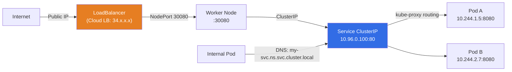
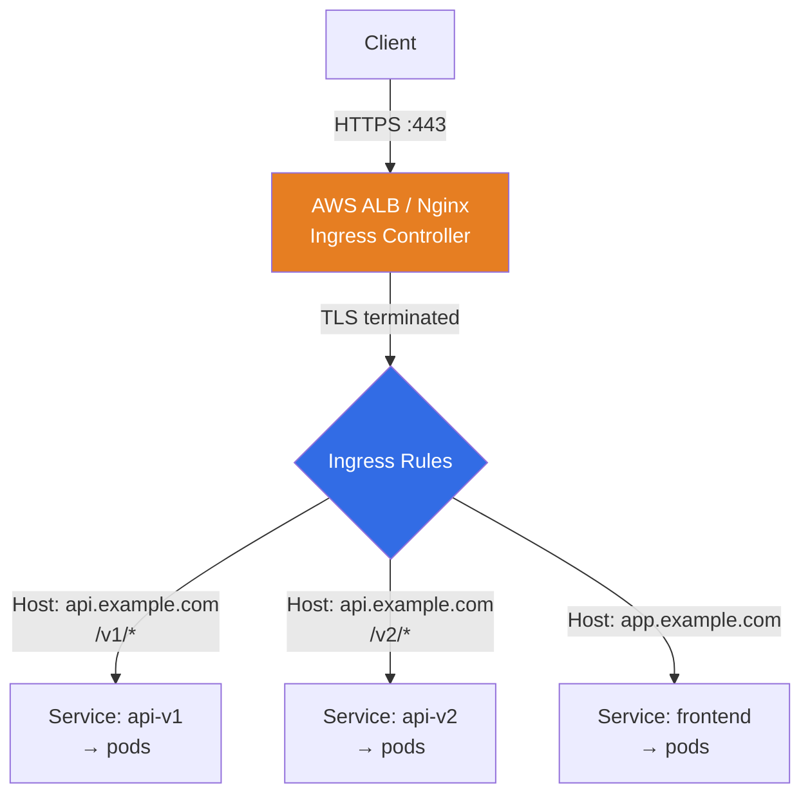
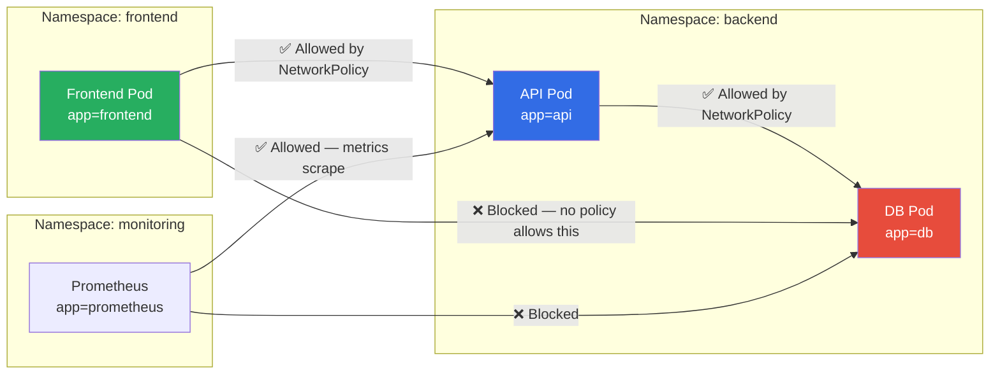
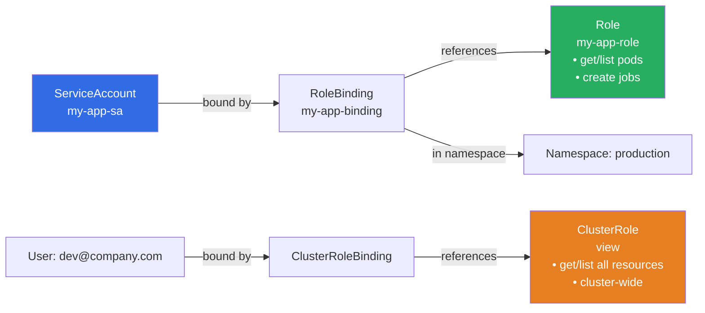
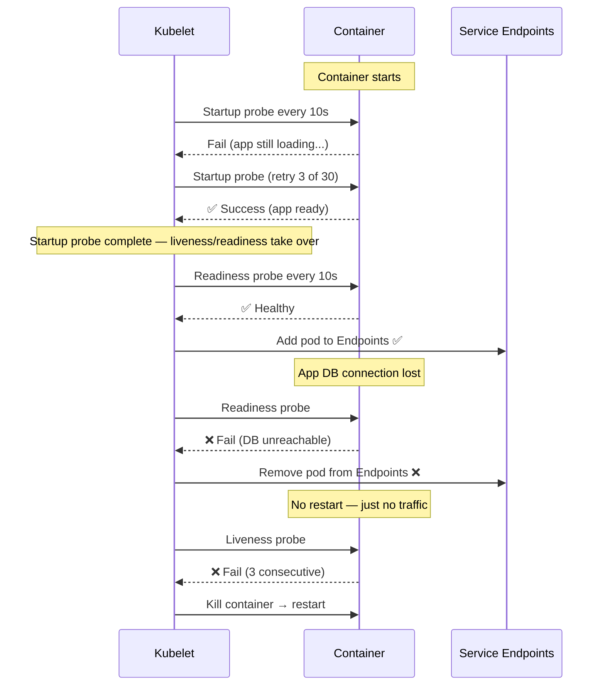
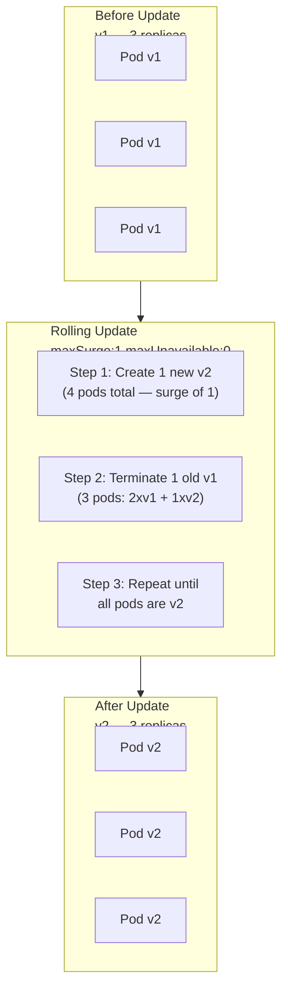
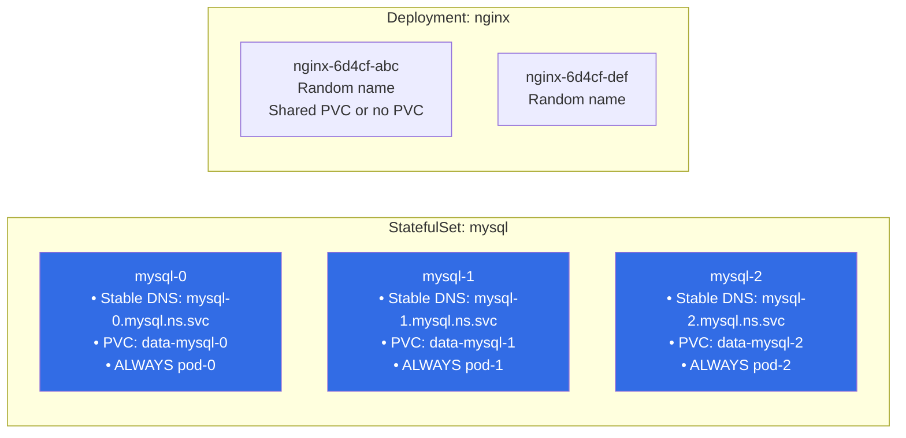
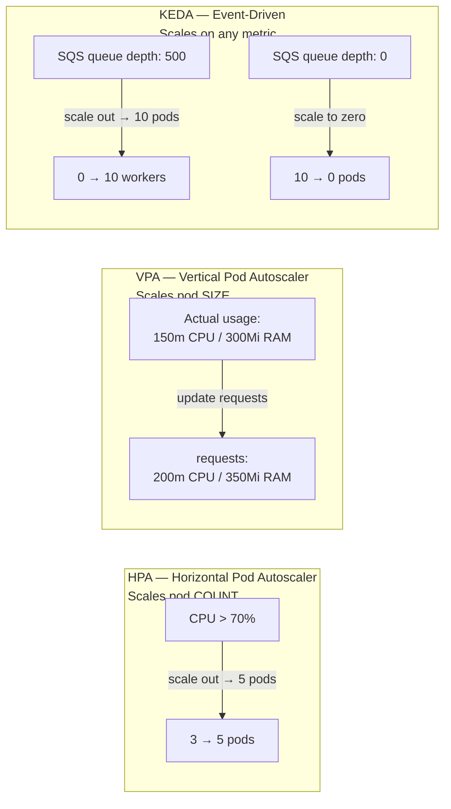
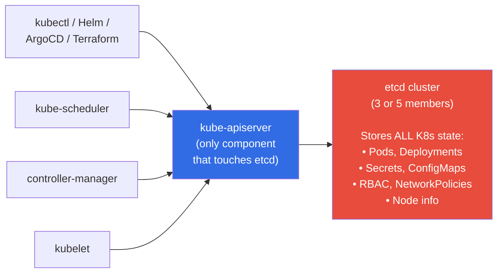
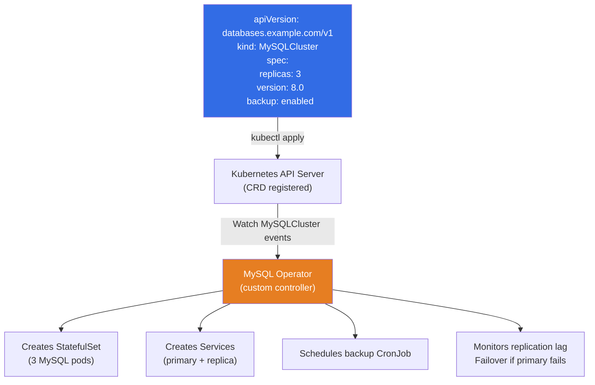

# ☸️ Kubernetes — Important Interview Questions (Medium / Hard)


> **This file covers 16 high-value Kubernetes interview topics not addressed in Q1–Q8.**
> Each section: question → why interviewers ask → key concepts → structured answer → diagram → hands-on commands → comparison table → follow-up questions.

---

## 📋 Table of Contents

| # | Topic | Level |
|---|---|---|
| [1](#1-kubernetes-services--clusterip-nodeport-loadbalancer-externalname) | Kubernetes Services — ClusterIP, NodePort, LoadBalancer, ExternalName | Medium |
| [2](#2-ingress--ingress-controllers) | Ingress & Ingress Controllers | Medium |
| [3](#3-network-policies--pod-to-pod-traffic-restriction) | Network Policies — Pod-to-Pod Traffic Restriction | Hard |
| [4](#4-rbac--roles-clusterroles-rolebindings-serviceaccounts) | RBAC — Roles, ClusterRoles, RoleBindings, ServiceAccounts | Medium/Hard |
| [5](#5-configmaps-vs-secrets--injection-methods) | ConfigMaps vs Secrets — Injection Methods | Medium |
| [6](#6-liveness-readiness--startup-probes) | Liveness, Readiness & Startup Probes | Medium |
| [7](#7-deployment-rolling-updates--rollbacks) | Deployment Rolling Updates & Rollbacks | Medium |
| [8](#8-statefulsets--vs-deployments) | StatefulSets — vs Deployments | Medium/Hard |
| [9](#9-daemonsets) | DaemonSets | Medium |
| [10](#10-jobs--cronjobs) | Jobs & CronJobs | Medium |
| [11](#11-hpa-vs-vpa-vs-keda--autoscaling) | HPA vs VPA vs KEDA — Autoscaling | Medium/Hard |
| [12](#12-pod-disruption-budgets-pdb) | Pod Disruption Budgets (PDB) | Medium |
| [13](#13-etcd--role-backup--restore) | etcd — Role, Backup & Restore | Hard |
| [14](#14-crds--operators) | CRDs & Operators | Hard |
| [15](#15-pod-security-standards-pss) | Pod Security Standards (PSS) | Hard |
| [16](#16-kubernetes-troubleshooting-scenarios) | Kubernetes Troubleshooting Scenarios | Hard |

---
---

## 1. Kubernetes Services — ClusterIP, NodePort, LoadBalancer, ExternalName

### ❓ The Question
> **"What are the different Kubernetes Service types and when would you use each?"**

### 🎯 Why Interviewers Ask This
Services are how pods are exposed inside and outside the cluster. Every Kubernetes workload needs them. This tests whether you can design network access patterns for microservices.

> 💡 **Instant win**: Explain that a Service provides a **stable virtual IP (ClusterIP)** that doesn't change even as pods behind it come and go. kube-proxy on each node maintains iptables/eBPF rules that redirect traffic from the ClusterIP to the actual pod IPs. This is fundamentally different from directly calling a pod IP, which changes on restart.

### 📖 Key Concepts

| Service Type | Accessible from | Use case |
|---|---|---|
| **ClusterIP** | Inside cluster only | Microservice-to-microservice communication |
| **NodePort** | Outside cluster via `NodeIP:NodePort` | Dev/test, on-prem without cloud LB |
| **LoadBalancer** | Outside cluster via cloud load balancer IP | Production ingress, cloud environments |
| **ExternalName** | Inside cluster via DNS alias | Point to external services by name |
| **Headless** (`clusterIP: None`) | DNS resolves to pod IPs directly | StatefulSets, direct pod addressing |

### 🖼️ Visual



### 🛠️ Hands-On

```yaml
# ClusterIP — default, internal only
apiVersion: v1
kind: Service
metadata:
  name: api-service
spec:
  selector:
    app: api
  ports:
    - port: 80          # service port
      targetPort: 8080  # pod port
  type: ClusterIP       # default if omitted

---
# NodePort — external access via node IP
apiVersion: v1
kind: Service
metadata:
  name: api-nodeport
spec:
  selector:
    app: api
  ports:
    - port: 80
      targetPort: 8080
      nodePort: 30080   # range: 30000-32767
  type: NodePort

---
# LoadBalancer — cloud-provisioned external LB
apiVersion: v1
kind: Service
metadata:
  name: api-lb
  annotations:
    service.beta.kubernetes.io/aws-load-balancer-type: "nlb"
spec:
  selector:
    app: api
  ports:
    - port: 443
      targetPort: 8443
  type: LoadBalancer

---
# ExternalName — DNS alias to external service
apiVersion: v1
kind: Service
metadata:
  name: prod-db
  namespace: staging
spec:
  type: ExternalName
  externalName: prod-postgres.rds.amazonaws.com

---
# Headless — used with StatefulSets
apiVersion: v1
kind: Service
metadata:
  name: mysql-headless
spec:
  clusterIP: None       # headless
  selector:
    app: mysql
  ports:
    - port: 3306
```

```bash
# DNS resolution inside cluster
kubectl exec -it my-pod -- nslookup api-service.default.svc.cluster.local

# Check endpoints backing a service
kubectl get endpoints api-service

# Describe service to see port mapping
kubectl describe svc api-service
```

### 🔁 Follow-up Questions
1. **"What is the difference between a Service and an Ingress?"** → Service exposes a set of pods at L4 (TCP/UDP). Ingress operates at L7 (HTTP/HTTPS) — it routes based on hostname and URL path, provides TLS termination, and consolidates multiple services behind one load balancer IP.
2. **"What happens if a pod matching the Service selector crashes?"** → The Endpoints controller removes the failed pod's IP from the Service's Endpoints object within seconds. kube-proxy updates its rules, and new traffic no longer routes to the crashed pod.
3. **"What is a headless Service and when is it used?"** → Setting `clusterIP: None` makes the Service headless — DNS returns the pod IPs directly instead of a virtual IP. StatefulSets use headless Services so each pod gets a stable DNS name like `mysql-0.mysql-headless.default.svc.cluster.local`.

---
---

## 2. Ingress & Ingress Controllers

### ❓ The Question
> **"What is a Kubernetes Ingress? How does it differ from a LoadBalancer Service? How do you configure TLS and path-based routing?"**

### 🎯 Why Interviewers Ask This
Every production cluster exposes HTTP services. Ingress is the standard answer. This tests whether you can design cost-efficient, TLS-enabled HTTP routing without spinning up a cloud LB per service.

> 💡 **Instant win**: Explain that an Ingress *resource* is just a YAML rule declaration — it does nothing by itself. An **Ingress Controller** (Nginx, Traefik, AWS ALB, Istio Gateway) is the actual component that reads those rules and configures a proxy. Without a controller deployed in the cluster, Ingress resources are ignored.

### 🖼️ Visual



### 🛠️ Hands-On

```yaml
# ingress.yaml — TLS + path-based routing
apiVersion: networking.k8s.io/v1
kind: Ingress
metadata:
  name: api-ingress
  namespace: production
  annotations:
    nginx.ingress.kubernetes.io/rewrite-target: /
    nginx.ingress.kubernetes.io/ssl-redirect: "true"
    cert-manager.io/cluster-issuer: "letsencrypt-prod"
spec:
  ingressClassName: nginx        # which controller handles this
  tls:
    - hosts:
        - api.example.com
      secretName: api-tls-cert   # cert-manager populates this Secret
  rules:
    - host: api.example.com
      http:
        paths:
          - path: /v1
            pathType: Prefix
            backend:
              service:
                name: api-v1
                port:
                  number: 80
          - path: /v2
            pathType: Prefix
            backend:
              service:
                name: api-v2
                port:
                  number: 80
    - host: app.example.com
      http:
        paths:
          - path: /
            pathType: Prefix
            backend:
              service:
                name: frontend
                port:
                  number: 80
```

```bash
# Install Nginx Ingress Controller via Helm
helm repo add ingress-nginx https://kubernetes.github.io/ingress-nginx
helm install ingress-nginx ingress-nginx/ingress-nginx \
  --namespace ingress-nginx --create-namespace

# Install cert-manager for automatic TLS
helm repo add jetstack https://charts.jetstack.io
helm install cert-manager jetstack/cert-manager \
  --namespace cert-manager --create-namespace \
  --set installCRDs=true

# Check ingress status
kubectl get ingress -n production
kubectl describe ingress api-ingress -n production

# Get the external IP of the ingress controller
kubectl get svc -n ingress-nginx ingress-nginx-controller
```

### 🔁 Follow-up Questions
1. **"What is the difference between `pathType: Prefix` and `pathType: Exact`?"** → `Exact` only matches the literal path. `Prefix` matches the path and any sub-path. `/api` Prefix matches `/api`, `/api/v1`, `/api/users`, etc. Use `Exact` for single endpoint exposure, `Prefix` for routing to a service that handles a path hierarchy.
2. **"How does cert-manager automate TLS certificate issuance?"** → cert-manager watches Ingress resources annotated with a ClusterIssuer reference. When it finds one, it creates an ACME (Let's Encrypt) challenge, completes the HTTP-01 or DNS-01 challenge to prove domain ownership, retrieves the certificate, and stores it in the Kubernetes Secret named in the Ingress's `tls.secretName`.

---
---

## 3. Network Policies — Pod-to-Pod Traffic Restriction

### ❓ The Question
> **"By default, can any pod in a Kubernetes cluster communicate with any other pod? How do Network Policies restrict this?"**

### 🎯 Why Interviewers Ask This
The default Kubernetes network model is flat and open — all pods can reach all other pods. Network Policies are the primary tool for zero-trust micro-segmentation. This is a hard-level question that distinguishes candidates who understand K8s security architecture.

> 💡 **Instant win**: State that Network Policies are enforced by the CNI plugin — not by the Kubernetes core. If your CNI (e.g., Flannel) does not support Network Policies, the resources are accepted by the API server but completely ignored. Only CNI plugins like **Calico, Cilium, or Weave** actually enforce them.

### 🖼️ Visual



### 🛠️ Hands-On

```yaml
# Step 1: Default deny-all ingress in a namespace (baseline zero-trust)
apiVersion: networking.k8s.io/v1
kind: NetworkPolicy
metadata:
  name: default-deny-ingress
  namespace: backend
spec:
  podSelector: {}         # applies to ALL pods in namespace
  policyTypes:
    - Ingress             # deny all incoming traffic
```

```yaml
# Step 2: Allow only frontend pods to reach the API
apiVersion: networking.k8s.io/v1
kind: NetworkPolicy
metadata:
  name: allow-frontend-to-api
  namespace: backend
spec:
  podSelector:
    matchLabels:
      app: api            # this policy applies to api pods
  policyTypes:
    - Ingress
  ingress:
    - from:
        - namespaceSelector:
            matchLabels:
              kubernetes.io/metadata.name: frontend
          podSelector:
            matchLabels:
              app: frontend       # AND — both conditions must match
      ports:
        - protocol: TCP
          port: 8080
```

```yaml
# Step 3: Allow API to reach DB on port 5432
apiVersion: networking.k8s.io/v1
kind: NetworkPolicy
metadata:
  name: allow-api-to-db
  namespace: backend
spec:
  podSelector:
    matchLabels:
      app: db
  policyTypes:
    - Ingress
  ingress:
    - from:
        - podSelector:
            matchLabels:
              app: api      # same namespace — no namespaceSelector needed
      ports:
        - protocol: TCP
          port: 5432
```

```yaml
# Allow egress to kube-dns (required or DNS breaks)
apiVersion: networking.k8s.io/v1
kind: NetworkPolicy
metadata:
  name: allow-dns-egress
  namespace: backend
spec:
  podSelector: {}
  policyTypes:
    - Egress
  egress:
    - to:
        - namespaceSelector:
            matchLabels:
              kubernetes.io/metadata.name: kube-system
      ports:
        - protocol: UDP
          port: 53
        - protocol: TCP
          port: 53
```

```bash
# Test connectivity between pods
kubectl exec -it frontend-pod -n frontend -- curl http://api-service.backend:8080/health
# Should succeed

kubectl exec -it frontend-pod -n frontend -- curl http://db-service.backend:5432
# Should be blocked (connection refused / timeout)

# List network policies in a namespace
kubectl get networkpolicy -n backend
kubectl describe networkpolicy allow-frontend-to-api -n backend
```

### 🔁 Follow-up Questions
1. **"What is the difference between `podSelector` and `namespaceSelector` in a NetworkPolicy?"** → `podSelector` matches pods by label within the same namespace as the policy. `namespaceSelector` matches pods in namespaces with matching labels. When both appear in the same `from` entry, they are ANDed (must match both). When they appear as separate list items, they are ORed.
2. **"If you apply a default-deny NetworkPolicy, what breaks first?"** → DNS resolution breaks — pods can no longer reach CoreDNS on port 53. Always add an explicit egress rule allowing UDP/TCP 53 to the `kube-system` namespace alongside any default-deny policy.

---
---

## 4. RBAC — Roles, ClusterRoles, RoleBindings, ServiceAccounts

### ❓ The Question
> **"How does Kubernetes RBAC work? Explain the difference between Role and ClusterRole, and when you would use a ServiceAccount."**

### 🎯 Why Interviewers Ask This
Security misconfigurations in RBAC are the #1 cause of Kubernetes cluster compromises. This tests whether you understand the principle of least privilege in Kubernetes.

> 💡 **Instant win**: Explain that a `Role` is namespaced — it grants permissions within one namespace. A `ClusterRole` is cluster-wide — it grants permissions across all namespaces or on non-namespaced resources like nodes and PersistentVolumes. Binding a ClusterRole to a RoleBinding scopes it to one namespace — this is a common pattern for reusable permission sets.

### 🖼️ Visual



### 🛠️ Hands-On

```yaml
# Role — namespaced permissions
apiVersion: rbac.authorization.k8s.io/v1
kind: Role
metadata:
  name: pod-reader
  namespace: production
rules:
  - apiGroups: [""]               # "" = core API group
    resources: ["pods", "pods/log"]
    verbs: ["get", "list", "watch"]
  - apiGroups: ["apps"]
    resources: ["deployments"]
    verbs: ["get", "list", "patch"]  # can update deployments
```

```yaml
# RoleBinding — bind Role to a ServiceAccount
apiVersion: rbac.authorization.k8s.io/v1
kind: RoleBinding
metadata:
  name: pod-reader-binding
  namespace: production
subjects:
  - kind: ServiceAccount
    name: my-app-sa
    namespace: production
  - kind: User
    name: developer@company.com   # OIDC user
    apiGroup: rbac.authorization.k8s.io
roleRef:
  kind: Role
  name: pod-reader
  apiGroup: rbac.authorization.k8s.io
```

```yaml
# ClusterRole — non-namespaced or cross-namespace permissions
apiVersion: rbac.authorization.k8s.io/v1
kind: ClusterRole
metadata:
  name: node-reader
rules:
  - apiGroups: [""]
    resources: ["nodes", "persistentvolumes"]
    verbs: ["get", "list", "watch"]
  - apiGroups: ["storage.k8s.io"]
    resources: ["storageclasses"]
    verbs: ["get", "list"]
```

```yaml
# ServiceAccount — pod identity for RBAC
apiVersion: v1
kind: ServiceAccount
metadata:
  name: my-app-sa
  namespace: production
  annotations:
    eks.amazonaws.com/role-arn: arn:aws:iam::123456789:role/my-app-role  # IRSA
automountServiceAccountToken: false   # disable auto-mount for security
```

```bash
# Check what a ServiceAccount can do
kubectl auth can-i list pods \
  --as=system:serviceaccount:production:my-app-sa \
  -n production
# yes / no

# List all roles in a namespace
kubectl get roles,rolebindings -n production

# Audit who has cluster-admin
kubectl get clusterrolebindings -o json | \
  jq '.items[] | select(.roleRef.name=="cluster-admin") | .subjects'

# Create role quickly with kubectl
kubectl create role pod-reader \
  --verb=get,list,watch \
  --resource=pods \
  -n production

# Create binding quickly
kubectl create rolebinding pod-reader-binding \
  --role=pod-reader \
  --serviceaccount=production:my-app-sa \
  -n production
```

### 🔁 Follow-up Questions
1. **"What is IRSA and why is it better than using node IAM roles?"** → IRSA (IAM Roles for Service Accounts) maps a Kubernetes ServiceAccount to an AWS IAM role via OIDC federation. Each pod gets its own AWS identity — only the pods with that ServiceAccount can assume that role. Node IAM roles grant ALL pods on a node the same AWS permissions, violating least-privilege.
2. **"What is `automountServiceAccountToken: false` and when should you use it?"** → By default, Kubernetes automatically mounts the ServiceAccount token into every pod at `/var/run/secrets/kubernetes.io/serviceaccount/token`. A compromised pod can use this token to call the Kubernetes API. Set `automountServiceAccountToken: false` on ServiceAccounts or Pods that don't need to call the K8s API.

---
---

## 5. ConfigMaps vs Secrets — Injection Methods

### ❓ The Question
> **"What is the difference between a ConfigMap and a Secret? What are the ways to inject them into a pod?"**

### 🎯 Why Interviewers Ask This
Configuration and secret management is a daily task. Interviewers want to know if you understand the security difference between ConfigMaps and Secrets, and which injection method is appropriate for which use case.

> 💡 **Instant win**: State that Kubernetes Secrets are **not encrypted by default** — they are base64-encoded, which is encoding, not encryption. In production, always enable etcd encryption at rest (`EncryptionConfiguration`) or use external secrets management (AWS Secrets Manager, HashiCorp Vault via External Secrets Operator).

### 🛠️ Hands-On

```yaml
# ConfigMap — non-sensitive configuration
apiVersion: v1
kind: ConfigMap
metadata:
  name: app-config
  namespace: production
data:
  APP_ENV: "production"
  LOG_LEVEL: "info"
  config.yaml: |
    database:
      host: postgres.production.svc
      port: 5432
      name: myapp

---
# Secret — sensitive data (base64 encoded, optionally encrypted at rest)
apiVersion: v1
kind: Secret
metadata:
  name: app-secrets
  namespace: production
type: Opaque
stringData:                    # stringData auto-encodes to base64
  DB_PASSWORD: "s3cr3t-p@ss"
  API_KEY: "sk-abcdef123456"
  tls.crt: |
    -----BEGIN CERTIFICATE-----
    ...
```

```yaml
# Injection Method 1: Environment variables from ConfigMap
spec:
  containers:
    - name: app
      image: myapp:latest
      envFrom:
        - configMapRef:
            name: app-config       # all keys become env vars
        - secretRef:
            name: app-secrets      # all secret keys become env vars
      env:
        - name: DB_HOST            # single key from ConfigMap
          valueFrom:
            configMapKeyRef:
              name: app-config
              key: database_host

# Injection Method 2: Mounted as files (best for multi-line config)
spec:
  containers:
    - name: app
      volumeMounts:
        - name: config-vol
          mountPath: /etc/config
          readOnly: true
        - name: secret-vol
          mountPath: /etc/secrets
          readOnly: true
  volumes:
    - name: config-vol
      configMap:
        name: app-config
    - name: secret-vol
      secret:
        secretName: app-secrets
        defaultMode: 0400          # owner read-only for security
```

```bash
# Create ConfigMap from file
kubectl create configmap nginx-config --from-file=nginx.conf

# Create Secret from literal values
kubectl create secret generic db-creds \
  --from-literal=username=admin \
  --from-literal=password=secret123

# Create TLS secret
kubectl create secret tls my-tls \
  --cert=tls.crt \
  --key=tls.key

# Decode a secret value
kubectl get secret app-secrets -o jsonpath='{.data.DB_PASSWORD}' | base64 -d

# ConfigMap live update — mounted volume updates within ~1 min
# Env vars do NOT update — pod must restart for env var changes
kubectl edit configmap app-config
```

### 📊 Comparison

| Feature | ConfigMap | Secret |
|---|---|---|
| **Stored as** | Plain text | Base64-encoded |
| **Encrypted at rest** | ❌ (unless etcd encryption enabled) | ❌ by default (same) |
| **For** | Non-sensitive config | Passwords, tokens, TLS certs |
| **Max size** | 1MB | 1MB |
| **Live mount updates** | ✅ Volume mounts (~60s) | ✅ Volume mounts (~60s) |
| **Env var updates** | ❌ Pod restart required | ❌ Pod restart required |

### 🔁 Follow-up Questions
1. **"How do you implement proper secrets management in production Kubernetes?"** → Use the External Secrets Operator (ESO) to sync secrets from AWS Secrets Manager, GCP Secret Manager, or HashiCorp Vault into Kubernetes Secrets. The ESO creates and rotates Kubernetes Secret objects from the external store — the actual secret value never lives in Git, only a reference to it does.
2. **"What is the difference between `envFrom` and `env.valueFrom`?"** → `envFrom` bulk-injects all keys from a ConfigMap or Secret as environment variables. `env.valueFrom` injects a single specific key. Use `envFrom` for convenience, `env.valueFrom` when you need to rename keys or be selective about what's injected.

---
---

## 6. Liveness, Readiness & Startup Probes

### ❓ The Question
> **"What is the difference between liveness, readiness, and startup probes in Kubernetes? What happens when each fails?"**

### 🎯 Why Interviewers Ask This
Probes are how Kubernetes knows if your container is alive and ready to serve traffic. Misconfigured probes cause either unnecessary restarts (liveness too aggressive) or traffic sent to unhealthy pods (missing readiness probe). This tests production-grade container design.

> 💡 **Instant win**: The key distinction: **liveness failure = container restart** (kubelet kills and restarts the container). **Readiness failure = traffic removal** (pod is removed from the Service's Endpoints, no restart). **Startup probe** buys slow-starting containers time before liveness kicks in — without it, a slow JVM app gets killed during its 60-second startup.

### 🖼️ Visual



### 🛠️ Hands-On

```yaml
spec:
  containers:
    - name: app
      image: myapp:latest

      # Startup probe — runs FIRST, disables liveness until it succeeds
      # 30 failures × 10s = 300s max startup time
      startupProbe:
        httpGet:
          path: /health/startup
          port: 8080
        failureThreshold: 30
        periodSeconds: 10

      # Liveness probe — failure = container restart
      livenessProbe:
        httpGet:
          path: /health/live
          port: 8080
        initialDelaySeconds: 0    # startup probe handles delay
        periodSeconds: 15
        timeoutSeconds: 5
        failureThreshold: 3       # 3 failures = restart

      # Readiness probe — failure = removed from Service Endpoints
      readinessProbe:
        httpGet:
          path: /health/ready
          port: 8080
        initialDelaySeconds: 5
        periodSeconds: 10
        timeoutSeconds: 3
        failureThreshold: 3
        successThreshold: 1

      # TCP probe (for non-HTTP services like databases)
      # livenessProbe:
      #   tcpSocket:
      #     port: 5432
      #   periodSeconds: 10

      # Exec probe (run command inside container)
      # livenessProbe:
      #   exec:
      #     command: ["pg_isready", "-U", "postgres"]
      #   periodSeconds: 10
```

### 📊 Comparison

| Probe | Action on failure | Use case |
|---|---|---|
| **Liveness** | Restart container | Detect deadlocks, hung processes |
| **Readiness** | Remove from Service Endpoints | Detect overload, dependency failure |
| **Startup** | Restart container (like liveness) | Slow-starting apps (JVM, Python) |

---
---

## 7. Deployment Rolling Updates & Rollbacks

### ❓ The Question
> **"How do rolling updates work in Kubernetes Deployments? How do you roll back a failed deployment?"**

### 🎯 Why Interviewers Ask This
Zero-downtime deployments are a baseline production requirement. This tests whether you understand deployment strategies and how to recover quickly from a bad release.

### 🖼️ Visual



### 🛠️ Hands-On

```yaml
# deployment.yaml — with rolling update strategy
apiVersion: apps/v1
kind: Deployment
metadata:
  name: api
spec:
  replicas: 3
  strategy:
    type: RollingUpdate
    rollingUpdate:
      maxSurge: 1          # max extra pods during update (above desired)
      maxUnavailable: 0    # min 0 pods unavailable — zero downtime
  selector:
    matchLabels:
      app: api
  template:
    metadata:
      labels:
        app: api
    spec:
      containers:
        - name: api
          image: myapp:v1
```

```bash
# Update the image — triggers rolling update
kubectl set image deployment/api api=myapp:v2

# Watch rollout progress
kubectl rollout status deployment/api
# Waiting for deployment "api" rollout to finish: 1 out of 3 new replicas have been updated...

# View rollout history
kubectl rollout history deployment/api
# REVISION  CHANGE-CAUSE
# 1         <none>
# 2         kubectl set image deployment/api api=myapp:v2

# Annotate for history (good practice)
kubectl annotate deployment/api \
  kubernetes.io/change-cause="Upgrade to v2 — fixes login bug #1234"

# Rollback to previous revision
kubectl rollout undo deployment/api

# Rollback to specific revision
kubectl rollout undo deployment/api --to-revision=1

# Pause rollout (e.g., check canary)
kubectl rollout pause deployment/api

# Resume
kubectl rollout resume deployment/api

# Scale a deployment
kubectl scale deployment/api --replicas=5
```

### 🔁 Follow-up Questions
1. **"What is the difference between `Recreate` and `RollingUpdate` strategy?"** → `Recreate` terminates ALL existing pods before creating new ones — causes downtime but is simpler and avoids two versions running simultaneously (useful when schema migrations are not backward-compatible). `RollingUpdate` replaces pods incrementally — zero downtime but requires the app to handle two versions running at the same time briefly.
2. **"How do you set a revision limit on a Deployment?"** → Set `spec.revisionHistoryLimit` (default 10). Older ReplicaSets beyond this limit are garbage-collected. Set to 0 to disable rollback history entirely, or increase it for important production services.

---
---

## 8. StatefulSets — vs Deployments

### ❓ The Question
> **"What is a StatefulSet and when would you use it instead of a Deployment?"**

### 🎯 Why Interviewers Ask This
Running databases, Kafka, Elasticsearch, or any stateful application in Kubernetes requires StatefulSets. The distinctions between StatefulSet and Deployment reveal deep understanding of Kubernetes pod identity and storage.

> 💡 **Instant win**: The three unique guarantees of StatefulSets: **stable network identity** (pod-0, pod-1 are persistent names), **stable storage** (each pod gets its own PVC via `volumeClaimTemplates` that persists through pod restarts), and **ordered deployment/scaling** (pods start and stop in sequence: 0→1→2 up, 2→1→0 down). Deployments offer none of these.

### 🖼️ Visual



### 🛠️ Hands-On

```yaml
# statefulset.yaml — MySQL with dedicated storage per replica
apiVersion: apps/v1
kind: StatefulSet
metadata:
  name: mysql
  namespace: production
spec:
  serviceName: mysql-headless    # must reference headless service
  replicas: 3
  selector:
    matchLabels:
      app: mysql
  updateStrategy:
    type: RollingUpdate
    rollingUpdate:
      partition: 0               # set to N to only update pods >= N
  template:
    metadata:
      labels:
        app: mysql
    spec:
      containers:
        - name: mysql
          image: mysql:8.0
          env:
            - name: MYSQL_ROOT_PASSWORD
              valueFrom:
                secretKeyRef:
                  name: mysql-secret
                  key: root-password
          volumeMounts:
            - name: data
              mountPath: /var/lib/mysql
          resources:
            requests:
              cpu: "500m"
              memory: "1Gi"
            limits:
              cpu: "1"
              memory: "2Gi"
  # volumeClaimTemplates: one PVC created per pod
  volumeClaimTemplates:
    - metadata:
        name: data
      spec:
        accessModes: ["ReadWriteOnce"]
        storageClassName: gp3-encrypted
        resources:
          requests:
            storage: 50Gi

---
# Headless Service — required for stable DNS per pod
apiVersion: v1
kind: Service
metadata:
  name: mysql-headless
  namespace: production
spec:
  clusterIP: None          # headless
  selector:
    app: mysql
  ports:
    - port: 3306
```

```bash
# StatefulSet pods are created in order: mysql-0, then mysql-1, then mysql-2
kubectl get pods -l app=mysql -w

# Each pod has a stable DNS name
kubectl exec -it mysql-0 -- mysql -u root -p -e "SELECT @@hostname"
# mysql-0

# Access a specific pod directly
kubectl exec -it mysql-1 -- bash

# Scale (new pods are added in order)
kubectl scale statefulset mysql --replicas=5
# mysql-3 and mysql-4 created in sequence

# Delete pod — StatefulSet recreates it with the SAME name and PVC
kubectl delete pod mysql-1
# mysql-1 is recreated, reattaches data-mysql-1 PVC

# Check PVCs
kubectl get pvc -n production
# data-mysql-0   Bound   ...
# data-mysql-1   Bound   ...
# data-mysql-2   Bound   ...
```

### 📊 Comparison

| Feature | Deployment | StatefulSet |
|---|---|---|
| **Pod names** | Random suffix (`app-6d4cf-abc`) | Ordinal index (`app-0`, `app-1`) |
| **Network identity** | Changes on restart | Stable — same DNS name always |
| **Storage** | Shared PVC or none | Dedicated PVC per pod via `volumeClaimTemplates` |
| **Start order** | Parallel | Sequential (0, 1, 2...) |
| **Stop order** | Parallel | Reverse sequential (2, 1, 0) |
| **Use case** | Stateless microservices | Databases, Kafka, Elasticsearch |

---
---

## 9. DaemonSets

### ❓ The Question
> **"What is a DaemonSet and when would you use one?"**

### 🎯 Why Interviewers Ask This
DaemonSets are the mechanism for node-level infrastructure — if you've ever used Fluentd, Datadog agent, Calico, or Falco in Kubernetes, they all run as DaemonSets.

> 💡 **Instant win**: A DaemonSet ensures exactly **one pod runs on every node** (or every node matching a selector). When a new node joins the cluster, the DaemonSet controller automatically schedules a pod on it. When a node is removed, the pod is garbage-collected. No replicas field — the count is determined by the number of nodes.

### 🛠️ Hands-On

```yaml
# daemonset.yaml — Fluent Bit log forwarder on every node
apiVersion: apps/v1
kind: DaemonSet
metadata:
  name: fluent-bit
  namespace: logging
spec:
  selector:
    matchLabels:
      app: fluent-bit
  updateStrategy:
    type: RollingUpdate
    rollingUpdate:
      maxUnavailable: 1     # update one node at a time
  template:
    metadata:
      labels:
        app: fluent-bit
    spec:
      serviceAccountName: fluent-bit-sa
      tolerations:
        # DaemonSets need to tolerate system taints to run on all nodes
        - key: node-role.kubernetes.io/control-plane
          operator: Exists
          effect: NoSchedule
        - key: node.kubernetes.io/disk-pressure
          operator: Exists
          effect: NoSchedule
      containers:
        - name: fluent-bit
          image: fluent/fluent-bit:3.1
          resources:
            limits:
              cpu: "200m"
              memory: "128Mi"
          volumeMounts:
            - name: varlog
              mountPath: /var/log
              readOnly: true
            - name: varlibdockercontainers
              mountPath: /var/lib/docker/containers
              readOnly: true
      volumes:
        - name: varlog
          hostPath:
            path: /var/log
        - name: varlibdockercontainers
          hostPath:
            path: /var/lib/docker/containers
      # Run on specific nodes only (optional)
      # nodeSelector:
      #   node-type: worker
```

```bash
# View DaemonSet status
kubectl get daemonset -n logging
# NAME         DESIRED   CURRENT   READY   UP-TO-DATE   AVAILABLE
# fluent-bit   5         5         5       5            5

# One pod per node
kubectl get pods -l app=fluent-bit -o wide -n logging
# NAME               NODE
# fluent-bit-abc     node1
# fluent-bit-def     node2
# fluent-bit-ghi     node3
```

---
---

## 10. Jobs & CronJobs

### ❓ The Question
> **"What is the difference between a Job and a CronJob in Kubernetes? When would you use them over a Deployment?"**

### 🎯 Why Interviewers Ask This
Batch processing, data pipelines, database migrations, and scheduled reports all use Jobs/CronJobs. This tests whether you can model non-continuous workloads in Kubernetes.

> 💡 **Instant win**: The key difference from Deployments: Jobs run **to completion** and then stop. The pod exits with code 0 when done. A Deployment restarts pods that exit. For one-time tasks (DB migration, report generation) use a Job. For scheduled recurring tasks (nightly backup, hourly report) use a CronJob.

### 🛠️ Hands-On

```yaml
# job.yaml — database migration (one-time)
apiVersion: batch/v1
kind: Job
metadata:
  name: db-migration-v2-1
spec:
  completions: 1          # total successful completions needed
  parallelism: 1          # pods running in parallel
  backoffLimit: 3         # retry on failure (max 3 retries)
  activeDeadlineSeconds: 300   # timeout — kill if not done in 5 min
  ttlSecondsAfterFinished: 3600  # auto-delete after 1 hour
  template:
    spec:
      restartPolicy: Never   # OnFailure or Never (not Always)
      containers:
        - name: migration
          image: myapp:v2
          command: ["python", "manage.py", "migrate"]
          env:
            - name: DATABASE_URL
              valueFrom:
                secretKeyRef:
                  name: db-secret
                  key: url

---
# cronjob.yaml — nightly database backup
apiVersion: batch/v1
kind: CronJob
metadata:
  name: db-backup
spec:
  schedule: "0 2 * * *"       # 2 AM every day (UTC)
  concurrencyPolicy: Forbid   # don't start new if previous still running
  successfulJobsHistoryLimit: 3
  failedJobsHistoryLimit: 3
  startingDeadlineSeconds: 300  # skip if missed by 5 min
  jobTemplate:
    spec:
      backoffLimit: 2
      template:
        spec:
          restartPolicy: OnFailure
          containers:
            - name: backup
              image: postgres:16-alpine
              command:
                - /bin/sh
                - -c
                - |
                  pg_dump $DATABASE_URL | gzip > /backup/$(date +%Y%m%d).sql.gz
                  aws s3 cp /backup/$(date +%Y%m%d).sql.gz s3://my-backups/
```

```bash
# Trigger a CronJob manually (one-off run)
kubectl create job --from=cronjob/db-backup manual-backup-20240901

# Watch job pods
kubectl get pods -l job-name=db-migration-v2-1 --watch

# View job completion status
kubectl get job db-migration-v2-1
# NAME               COMPLETIONS   DURATION   AGE
# db-migration-v2-1  1/1           45s        2m

# Check logs
kubectl logs job/db-migration-v2-1
```

### 📊 Comparison

| Feature | Job | CronJob | Deployment |
|---|---|---|---|
| **Runs until** | Completion (exit 0) | Completion (each run) | Indefinitely |
| **Scheduling** | Manual/once | Cron schedule | Always running |
| **Restart** | On failure only | On failure only | Always |
| **Use case** | DB migration, batch | Backups, reports | Web servers, APIs |

---
---

## 11. HPA vs VPA vs KEDA — Autoscaling

### ❓ The Question
> **"Explain the three autoscaling options in Kubernetes. When would you choose HPA, VPA, or KEDA?"**

### 🎯 Why Interviewers Ask This
Cost efficiency and availability both depend on right-sizing. This is a hard question because it requires knowing all three tools and their trade-offs.

### 🖼️ Visual



### 🛠️ Hands-On

```yaml
# HPA — scale based on CPU/memory
apiVersion: autoscaling/v2
kind: HorizontalPodAutoscaler
metadata:
  name: api-hpa
spec:
  scaleTargetRef:
    apiVersion: apps/v1
    kind: Deployment
    name: api
  minReplicas: 2
  maxReplicas: 20
  metrics:
    - type: Resource
      resource:
        name: cpu
        target:
          type: Utilization
          averageUtilization: 70
    - type: Resource
      resource:
        name: memory
        target:
          type: AverageValue
          averageValue: "400Mi"
  behavior:
    scaleDown:
      stabilizationWindowSeconds: 300   # wait 5 min before scaling down
    scaleUp:
      stabilizationWindowSeconds: 0     # scale up immediately
```

```yaml
# KEDA ScaledObject — scale on SQS queue depth
apiVersion: keda.sh/v1alpha1
kind: ScaledObject
metadata:
  name: sqs-worker-scaler
spec:
  scaleTargetRef:
    name: sqs-worker-deployment
  minReplicaCount: 0        # scale to ZERO when idle
  maxReplicaCount: 50
  cooldownPeriod: 300
  triggers:
    - type: aws-sqs-queue
      metadata:
        queueURL: https://sqs.us-east-1.amazonaws.com/123456/my-queue
        queueLength: "10"          # 1 pod per 10 messages
        awsRegion: us-east-1
      authenticationRef:
        name: keda-aws-credentials
```

### 📊 Comparison

| Feature | HPA | VPA | KEDA |
|---|---|---|---|
| **Scales** | Pod count | Pod resource size | Pod count |
| **Based on** | CPU/memory | Historical usage | Any event/metric |
| **Scale to zero** | ❌ | N/A | ✅ |
| **Compatible with HPA** | — | ⚠️ Conflict (don't use both CPU) | ✅ |
| **Use case** | Web APIs, stateless services | Right-sizing, cost optimisation | Queues, events, external metrics |

---
---

## 12. Pod Disruption Budgets (PDB)

### ❓ The Question
> **"What is a Pod Disruption Budget and why is it important during cluster maintenance?"**

### 🎯 Why Interviewers Ask This
PDBs are the safety net for voluntary disruptions — drains, rolling updates, node upgrades. Without them, `kubectl drain` could take down all pods of a deployment simultaneously.

> 💡 **Instant win**: PDBs only apply to **voluntary disruptions** (kubectl drain, cluster autoscaler scale-down, rolling updates). They do NOT protect against involuntary disruptions (node crash, OOM kill, kubelet eviction under pressure). To protect against those, ensure redundancy with `replicas >= 2` and spread across zones.

### 🛠️ Hands-On

```yaml
# pdb.yaml — always keep at least 2 api pods running
apiVersion: policy/v1
kind: PodDisruptionBudget
metadata:
  name: api-pdb
spec:
  minAvailable: 2        # at least 2 pods must be available during disruption
  # OR use maxUnavailable:
  # maxUnavailable: 1    # at most 1 pod unavailable at a time
  selector:
    matchLabels:
      app: api
```

```bash
# Check PDB status
kubectl get pdb
# NAME      MIN AVAILABLE   MAX UNAVAILABLE   ALLOWED DISRUPTIONS
# api-pdb   2               N/A               1     ← currently 3 pods, 1 can be disrupted

# If ALLOWED DISRUPTIONS = 0, kubectl drain will block until a pod becomes available
kubectl drain node1 --ignore-daemonsets
# evicting pod production/api-abc123 ...
# error: Cannot evict pod as it would violate the pod's disruption budget.
```

---
---

## 13. etcd — Role, Backup & Restore

### ❓ The Question
> **"What is etcd in Kubernetes? How do you back it up and restore from a backup?"**

### 🎯 Why Interviewers Ask This
etcd is the single source of truth for all Kubernetes cluster state. Losing etcd without a backup means losing the entire cluster configuration. This is a hard-level question that tests operational maturity.

> 💡 **Instant win**: State that etcd stores every Kubernetes object — Deployments, Services, ConfigMaps, Secrets, RBAC rules, everything — as key-value pairs. The API server is the only component that reads from and writes to etcd directly. All other components (scheduler, controller-manager) go through the API server. This is why the API server is the "front door" to Kubernetes.

### 🖼️ Visual



### 🛠️ Hands-On

```bash
# ── Backup etcd ──────────────────────────────────────────────
# etcdctl snapshot save (run on a control plane node)
ETCDCTL_API=3 etcdctl snapshot save /backup/etcd-snapshot-$(date +%Y%m%d-%H%M%S).db \
  --endpoints=https://127.0.0.1:2379 \
  --cacert=/etc/kubernetes/pki/etcd/ca.crt \
  --cert=/etc/kubernetes/pki/etcd/server.crt \
  --key=/etc/kubernetes/pki/etcd/server.key

# Verify snapshot
ETCDCTL_API=3 etcdctl snapshot status /backup/etcd-snapshot-20240901.db \
  --write-out=table
# +----------+----------+------------+------------+
# |   HASH   | REVISION | TOTAL KEYS | TOTAL SIZE |
# +----------+----------+------------+------------+
# | 9e4e8a35 |   452100 |       1123 |    4.3 MB  |
# +----------+----------+------------+------------+

# ── Restore etcd from snapshot ────────────────────────────────
# 1. Stop the API server (remove manifest to stop static pod)
mv /etc/kubernetes/manifests/kube-apiserver.yaml /tmp/

# 2. Restore snapshot to a new data directory
ETCDCTL_API=3 etcdctl snapshot restore /backup/etcd-snapshot-20240901.db \
  --data-dir=/var/lib/etcd-restored \
  --name=master-1 \
  --initial-cluster=master-1=https://127.0.0.1:2380 \
  --initial-advertise-peer-urls=https://127.0.0.1:2380

# 3. Update etcd manifest to point to new data directory
# Edit /etc/kubernetes/manifests/etcd.yaml
# Change: --data-dir=/var/lib/etcd → --data-dir=/var/lib/etcd-restored
# Change: hostPath for etcd data volume to match

# 4. Restore API server manifest
mv /tmp/kube-apiserver.yaml /etc/kubernetes/manifests/

# 5. Verify cluster is back
kubectl get nodes
kubectl get pods -A

# ── Automated backup with CronJob ─────────────────────────────
# In production, run etcdctl snapshot save as a CronJob
# and upload snapshot to S3:
# aws s3 cp /backup/etcd-snapshot-*.db s3://my-etcd-backups/
```

---
---

## 14. CRDs & Operators

### ❓ The Question
> **"What is a Custom Resource Definition (CRD) in Kubernetes? What is the Operator pattern and why is it useful?"**

### 🎯 Why Interviewers Ask This
Operators are the modern way to manage complex stateful applications (databases, message brokers) in Kubernetes. Understanding CRDs shows you understand Kubernetes extensibility — a hard-level topic.

> 💡 **Instant win**: A CRD extends the Kubernetes API with a new resource type. An Operator is a controller that watches CRDs and encodes domain-specific operational knowledge (how to deploy, scale, backup, and failover a database) in code. Instead of a human running `kubectl exec` to failover MySQL, the Operator does it automatically based on cluster state.

### 🖼️ Visual



### 🛠️ Hands-On

```yaml
# Example CRD definition (simplified)
apiVersion: apiextensions.k8s.io/v1
kind: CustomResourceDefinition
metadata:
  name: mysqlclusters.databases.example.com
spec:
  group: databases.example.com
  versions:
    - name: v1
      served: true
      storage: true
      schema:
        openAPIV3Schema:
          type: object
          properties:
            spec:
              type: object
              properties:
                replicas:
                  type: integer
                  minimum: 1
                version:
                  type: string
  scope: Namespaced
  names:
    plural: mysqlclusters
    singular: mysqlcluster
    kind: MySQLCluster

---
# Custom Resource — using the CRD
apiVersion: databases.example.com/v1
kind: MySQLCluster
metadata:
  name: prod-mysql
spec:
  replicas: 3
  version: "8.0"
  storageGB: 100
  backup:
    enabled: true
    schedule: "0 2 * * *"
    destination: s3://my-backups/mysql
```

```bash
# List all CRDs in the cluster
kubectl get crds

# Common Operator-managed CRDs
kubectl get prometheuses.monitoring.coreos.com    # Prometheus Operator
kubectl get kafkas.kafka.strimzi.io              # Strimzi Kafka Operator
kubectl get postgresclusters.postgres-operator.crunchydata.com

# Install an operator via Helm (e.g., Prometheus Operator)
helm repo add prometheus-community https://prometheus-community.github.io/helm-charts
helm install kube-prometheus-stack \
  prometheus-community/kube-prometheus-stack \
  --namespace monitoring --create-namespace
```

---
---

## 15. Pod Security Standards (PSS)

### ❓ The Question
> **"What are Pod Security Standards in Kubernetes? How do they replace the deprecated Pod Security Policy?"**

### 🎯 Why Interviewers Ask This
PSP was deprecated in K8s 1.21 and removed in 1.25. PSS is the built-in replacement. Any cluster security discussion now involves PSS.

> 💡 **Instant win**: PSS defines three levels — **Privileged** (unrestricted), **Baseline** (prevents known escalation paths), and **Restricted** (strongly hardened, follows current best practices). They are enforced at the namespace level via labels. No webhook or CRD needed — it's built into the API server admission controller.

### 🛠️ Hands-On

```bash
# Apply PSS to a namespace via labels
# Mode: enforce (reject), audit (log), warn (warn but allow)

# Restricted — most secure — deny privileged containers, require non-root
kubectl label namespace production \
  pod-security.kubernetes.io/enforce=restricted \
  pod-security.kubernetes.io/enforce-version=latest \
  pod-security.kubernetes.io/warn=restricted \
  pod-security.kubernetes.io/audit=restricted

# Baseline — prevents known privilege escalations
kubectl label namespace staging \
  pod-security.kubernetes.io/enforce=baseline

# Check what labels a namespace has
kubectl get namespace production --show-labels

# Test a pod that would be rejected under Restricted
kubectl run privileged-test \
  --image=nginx \
  --overrides='{"spec":{"containers":[{"name":"test","image":"nginx","securityContext":{"privileged":true}}]}}' \
  -n production
# Error: pods "privileged-test" is forbidden: violates PodSecurity "restricted:latest":
# privileged (container "test" must not set securityContext.privileged=true)
```

```yaml
# Pod that satisfies Restricted PSS
apiVersion: v1
kind: Pod
metadata:
  name: secure-pod
  namespace: production    # namespace has enforce=restricted
spec:
  securityContext:
    runAsNonRoot: true
    runAsUser: 1000
    runAsGroup: 3000
    fsGroup: 2000
    seccompProfile:
      type: RuntimeDefault
  containers:
    - name: app
      image: myapp:latest
      securityContext:
        allowPrivilegeEscalation: false
        readOnlyRootFilesystem: true
        capabilities:
          drop: ["ALL"]
      volumeMounts:
        - name: tmp
          mountPath: /tmp
  volumes:
    - name: tmp
      emptyDir: {}         # writable scratch space since root FS is read-only
```

---
---

## 16. Kubernetes Troubleshooting Scenarios

### ❓ The Question
> **"Walk me through how you would troubleshoot the following Kubernetes issues..."**

This section covers the most common real-world troubleshooting scenarios asked in interviews.

---

### Scenario A — Pod stuck in `CrashLoopBackOff`

```bash
# What it means: container starts, crashes, K8s backs off before restarting
kubectl get pod my-pod
# STATUS: CrashLoopBackOff

# Step 1: Get exit code and last state
kubectl describe pod my-pod
# Last State: Terminated
#   Exit Code: 1          ← application error
#   Exit Code: 137        ← OOM kill (memory limit hit)
#   Exit Code: 139        ← segfault

# Step 2: Get logs of the crashed container (previous run)
kubectl logs my-pod --previous

# Step 3: If image pull issue
# STATUS: ImagePullBackOff
kubectl describe pod my-pod | grep -A5 Events
# Failed to pull image "myapp:v2": rpc error: ... not found

# Fix: verify image tag exists in registry
docker pull myapp:v2   # test locally

# Step 4: If OOM (137) — increase memory limit
kubectl edit deployment myapp
# increase resources.limits.memory
```

---

### Scenario B — Pod stuck in `Pending`

```bash
# Diagnose pending pod — always start with describe
kubectl describe pod my-pod | grep -A10 Events

# Most common causes and fixes:
# 1. Insufficient resources
# Events: 0/5 nodes available: 5 Insufficient memory
kubectl top nodes                      # check utilisation
kubectl describe nodes | grep -A5 "Allocated resources"
# Fix: reduce resource requests, or add nodes

# 2. No matching node (affinity / nodeSelector)
# Events: 0/5 nodes available: 5 node(s) didn't match Pod's node affinity
kubectl get nodes --show-labels        # check node labels
kubectl edit deployment myapp          # fix nodeAffinity rules

# 3. PVC not bound
kubectl get pvc -n <namespace>
# STATUS: Pending
kubectl describe pvc my-pvc | grep Events
# Fix: check StorageClass, AZ mismatch

# 4. Namespace ResourceQuota exceeded
kubectl describe resourcequota -n <namespace>
# Used: cpu 10/10 ← quota exhausted
```

---

### Scenario C — Service not reachable

```bash
# Service exists but pods are not getting traffic
kubectl get svc my-svc
kubectl get endpoints my-svc
# ENDPOINTS: <none>   ← NO pods matching selector!

# Step 1: Verify selector matches pod labels
kubectl get svc my-svc -o jsonpath='{.spec.selector}'
# {"app":"api"}

kubectl get pods --show-labels | grep api
# No pods with app=api label!

# Fix: labels on pods must match service selector exactly
kubectl edit deployment api
# Add/fix labels.app: api in pod template

# Step 2: If endpoints exist but service still unreachable
kubectl exec -it debug-pod -- curl http://my-svc:80
# Test from another pod in same namespace

# Step 3: Check DNS resolution
kubectl exec -it debug-pod -- nslookup my-svc.default.svc.cluster.local
# Check CoreDNS pods are running
kubectl get pods -n kube-system -l k8s-app=kube-dns
```

---

### Scenario D — Node `NotReady`

```bash
# Node shows NotReady
kubectl get nodes
# NAME    STATUS     ROLES    AGE
# node2   NotReady   worker   5d

# Step 1: Describe the node
kubectl describe node node2 | grep -A10 Conditions
# KubeletNotReady  container runtime network not ready

# Step 2: SSH to the node, check kubelet
ssh node2
systemctl status kubelet
journalctl -u kubelet -n 50 --no-pager

# Common causes:
# - kubelet crashed: systemctl restart kubelet
# - CNI plugin broken: check /etc/cni/net.d/, restart CNI daemonset
# - Disk pressure: df -h, free up space
# - Node rebooted without rejoining: kubeadm token create + re-join
# - Certificate expired: kubeadm certs check-expiration

# Step 3: Check system-level
free -h     # memory
df -h       # disk
top         # CPU
```

---

### Scenario E — etcd snapshot restore (disaster recovery)

```bash
# Full DR procedure — cluster state lost
# 1. Stop API server on all control plane nodes
mv /etc/kubernetes/manifests/kube-apiserver.yaml /tmp/
mv /etc/kubernetes/manifests/kube-controller-manager.yaml /tmp/
mv /etc/kubernetes/manifests/kube-scheduler.yaml /tmp/

# 2. Restore etcd
ETCDCTL_API=3 etcdctl snapshot restore /backup/etcd-latest.db \
  --data-dir=/var/lib/etcd-new

# 3. Update etcd manifest with new data dir
sed -i 's|/var/lib/etcd|/var/lib/etcd-new|g' \
  /etc/kubernetes/manifests/etcd.yaml

# 4. Start control plane back up
mv /tmp/kube-apiserver.yaml /etc/kubernetes/manifests/
mv /tmp/kube-controller-manager.yaml /etc/kubernetes/manifests/
mv /tmp/kube-scheduler.yaml /etc/kubernetes/manifests/

# 5. Verify
kubectl get nodes
kubectl get pods -A
```

---

### 🛠️ Essential Troubleshooting Commands Reference

```bash
# ── Pod Debugging ─────────────────────────────────────────────
kubectl describe pod <pod> -n <ns>              # events + conditions
kubectl logs <pod> -n <ns> -c <container>       # current logs
kubectl logs <pod> -n <ns> --previous           # logs before crash
kubectl exec -it <pod> -n <ns> -- sh            # shell into pod
kubectl debug node/<node> -it --image=busybox   # node debug pod (K8s 1.23+)

# ── Node Debugging ────────────────────────────────────────────
kubectl describe node <node>                    # conditions, taints, capacity
kubectl top nodes                               # CPU/memory usage
kubectl get node <node> -o yaml | grep -A5 conditions

# ── Cluster State ─────────────────────────────────────────────
kubectl get events --sort-by='.lastTimestamp' -A   # all events newest first
kubectl get events -n <ns> --field-selector reason=Failed
kubectl get componentstatuses                      # control plane health
kubectl cluster-info dump                          # full cluster dump (large)

# ── Network Debugging ─────────────────────────────────────────
kubectl get endpoints -n <ns>                   # check service endpoints
kubectl run netshoot --image=nicolaka/netshoot -it --rm  # network debug pod
# Inside netshoot:
# curl http://<service>.<namespace>
# nslookup <service>.<namespace>.svc.cluster.local
# tcpdump -i eth0 port 80

# ── Resource Issues ───────────────────────────────────────────
kubectl top pods -n <ns> --containers           # per-container usage
kubectl describe resourcequota -n <ns>          # quota usage
kubectl get limitrange -n <ns>                  # default limits
```

---

## 📌 Master Summary — All 16 Topics in One View

| Topic | Key one-liner |
|---|---|
| **Services** | ClusterIP (internal), NodePort (external via node), LoadBalancer (cloud LB), ExternalName (DNS alias) |
| **Ingress** | L7 HTTP routing at one IP; Ingress resource = rules only; Ingress Controller = the actual proxy |
| **Network Policies** | Default: all pods can reach all pods. NP restricts. Enforced by CNI only. Always allow DNS egress |
| **RBAC** | Role=namespaced. ClusterRole=cluster-wide. Binding attaches to users/SAs. IRSA for AWS pod identity |
| **ConfigMap vs Secret** | Both base64 at rest. Secrets for sensitive data. Use ESO for real secrets management |
| **Probes** | Liveness=restart. Readiness=remove from Endpoints. Startup=buy startup time |
| **Rolling Updates** | maxSurge=extra pods during update. maxUnavailable=pods that can be down. `rollout undo` to rollback |
| **StatefulSets** | Stable pod names, stable DNS, dedicated PVCs per pod, ordered start/stop. For databases |
| **DaemonSets** | One pod per node. Auto-schedules on new nodes. For infrastructure agents |
| **Jobs/CronJobs** | Job=run to completion. CronJob=scheduled Job. restartPolicy=Never or OnFailure |
| **HPA/VPA/KEDA** | HPA=scale count on CPU/mem. VPA=resize requests. KEDA=scale on any event, scale-to-zero |
| **PDB** | Voluntary disruption protection. minAvailable or maxUnavailable. Doesn't protect against crashes |
| **etcd** | Single source of truth. Backup with `etcdctl snapshot save`. Only API server touches etcd directly |
| **CRDs/Operators** | CRD=new API type. Operator=controller that manages CRD instances with domain knowledge |
| **Pod Security Standards** | Privileged/Baseline/Restricted. Enforced via namespace labels. Replaces deprecated PSP |
| **Troubleshooting** | CrashLoopBackOff=check logs. Pending=check events+resources. Service down=check endpoints |
