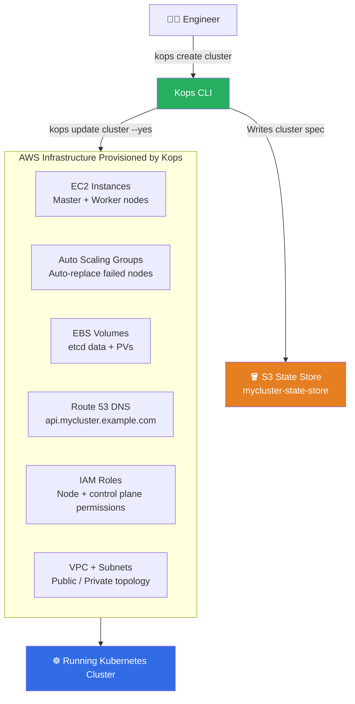
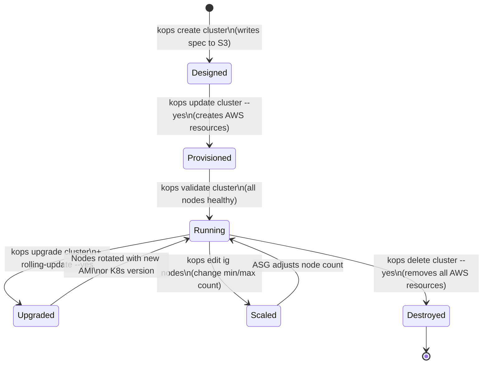
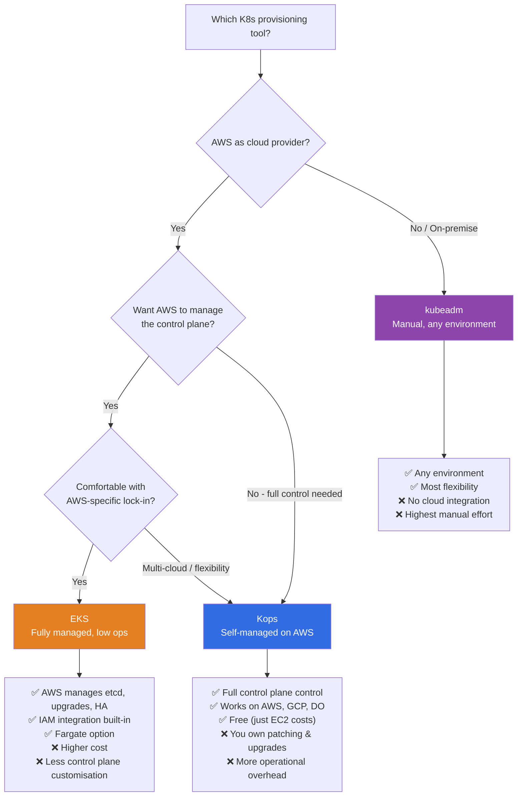

# ☸️ Kubernetes Interview Question 1 — Kubernetes Kops


---

## ❓ The Question

> **"What is Kops? How does it help with Kubernetes cluster management?"**

**Alternate phrasings you may hear:**
- "How would you set up a Kubernetes cluster on AWS without using EKS?"
- "What is the difference between Kops, kubeadm, and EKS?"
- "When would you use Kops over a managed Kubernetes service?"
- "Describe the lifecycle management capabilities of Kops."
- "How does Kops integrate with AWS services like Route 53 and Auto Scaling Groups?"

---

## 🎯 Why Interviewers Ask This

Kops is a classic interview touchstone because it tests whether you understand Kubernetes cluster provisioning at a deeper level than just "I used EKS." Interviewers ask this to assess:

- **Cluster provisioning awareness**: Do you know what happens under the hood when a Kubernetes cluster is created in the cloud?
- **Cloud service integration**: Can you explain how Kubernetes nodes, storage, DNS, and scaling are wired together with cloud primitives?
- **Tool selection judgment**: Do you know when to reach for Kops vs EKS vs kubeadm, and why?
- **Lifecycle thinking**: Can you manage a cluster beyond day-1 creation — upgrades, scaling, teardown?

> 💡 **Instant win**: Most candidates describe Kops as "a tool to create Kubernetes clusters." You stand out by explaining that Kops automates the **full lifecycle** — create, upgrade, scale, and destroy — and that it provisions and configures all the **surrounding cloud infrastructure** (EC2, EBS, ASG, Route 53, IAM roles) that a self-managed cluster needs, which managed services like EKS abstract away entirely.

---

## 📖 Key Terminologies

| Term | Meaning |
|---|---|
| **Kops** | Kubernetes Operations — CLI tool for deploying and managing self-managed K8s clusters in the cloud |
| **State store** | S3 bucket (on AWS) where Kops stores cluster configuration and state |
| **Cluster spec** | YAML manifest describing the desired cluster topology — instance types, node counts, networking, etc. |
| **Auto Scaling Group (ASG)** | AWS mechanism that Kops uses to manage node pools and automatically replace failed nodes |
| **Route 53** | AWS DNS service; Kops uses it to register the cluster's API server endpoint |
| **EBS (Elastic Block Store)** | AWS block storage; Kops provisions EBS volumes for etcd and persistent volumes |
| **kubeadm** | Lower-level Kubernetes bootstrap tool; does not provision cloud infrastructure |
| **EKS** | AWS Elastic Kubernetes Service — fully managed K8s control plane; AWS handles etcd, upgrades, HA |
| **etcd** | Distributed key-value store that is K8s's brain — Kops sets it up and backs it up on EBS |
| **IG (Instance Group)** | Kops concept for a pool of EC2 instances with the same role (master or worker) |
| **Gossip DNS** | Kops's built-in DNS option using `.k8s.local` suffix — no Route 53 required for private clusters |

---

## 🗣️ How to Answer (Structured)

A strong answer covers what Kops is, what it automates, when to use it, and how it compares to alternatives. Here is a proven structure:

**1. Define Kops clearly:**

> "Kops — short for Kubernetes Operations — is an open-source CLI tool that automates the complete lifecycle of Kubernetes clusters on cloud platforms. I think of it as the `kubectl` equivalent, but for clusters themselves rather than workloads running inside them."

**2. Explain what it actually automates on AWS:**

> "When I use Kops to create a cluster on AWS, it doesn't just install Kubernetes — it provisions all the surrounding infrastructure automatically: EC2 instances for master and worker nodes, EBS volumes for etcd storage, Auto Scaling Groups so failed nodes are replaced automatically, IAM roles so nodes can interact securely with AWS APIs, and Route 53 DNS records so the API server is reachable by name. Without Kops, I would have to configure all of that manually."

**3. Explain the state store concept:**

> "Kops uses an S3 bucket as its state store — the desired cluster configuration is written there as YAML specs. This means the cluster definition is version-controllable and reproducible. If I need to rebuild the cluster, I point Kops at the same S3 bucket and it recreates everything exactly."

**4. Cover the full lifecycle:**

> "Beyond day-1 creation, Kops supports the full lifecycle: I can upgrade the Kubernetes version with a rolling update, add or remove instance groups to scale capacity, modify node types, and finally destroy the cluster and all its resources cleanly when it's no longer needed. This is particularly useful for short-lived load testing or development clusters."

**5. State when you would use it:**

> "I would use Kops when I need a self-managed Kubernetes cluster in AWS and EKS is not an option — for example, in air-gapped environments, when I need very specific control over the control plane configuration, or when I'm working in a cloud environment where EKS isn't available (like an older region, or DigitalOcean or GCP). For most production workloads today, I'd lean towards a managed service like EKS because it reduces operational overhead, but Kops is invaluable when I need that level of control."

---

## 🔐 Security Perspective (DevSecOps)

Self-managed Kubernetes clusters created with Kops carry more security responsibility than managed services — the operator owns the control plane.

| Security Area | Kops Consideration | Recommendation |
|---|---|---|
| **IAM roles** | Kops creates IAM roles for nodes; they should follow least-privilege | Audit and tighten IAM policies post-creation |
| **etcd encryption** | etcd stores all cluster secrets in plaintext by default | Enable `encryptionConfig` in Kops cluster spec |
| **API server access** | By default, API server is internet-accessible via Route 53 | Set `api.access` to your VPC CIDR or bastion IP range |
| **Node OS patching** | Kops uses Amazon Linux / Ubuntu; operator owns OS updates | Use Kops rolling update to rotate nodes on new AMIs |
| **State store security** | S3 bucket holds full cluster config including certs | Enable S3 server-side encryption + block public access |
| **Kubernetes version** | Kops supports upgrading — self-managed clusters lag if not maintained | Maintain within N-1 of latest stable K8s version |
| **Network policy** | Kops supports Calico, Cilium — not enforced by default | Choose a CNI that supports NetworkPolicy and enable it |

> 🔒 **One-liner**: *"With Kops you own the control plane — that means etcd encryption, API server access controls, IAM least-privilege, and node OS patching are your responsibility, not the cloud provider's. Always encrypt the state store S3 bucket and restrict API server access to your VPC CIDR on day one."*

---

## 🖼️ Visuals

### Kops Cluster Creation Flow on AWS



---

### Kops Cluster Lifecycle



---

### Kops vs EKS vs kubeadm — Decision Flow



---

## 📊 Quick Comparison

| Feature | Kops | EKS | kubeadm | k3s |
|---|---|---|---|---|
| **Control plane managed by** | You | AWS | You | You |
| **Cloud integration** | ✅ Deep (EC2, ASG, EBS, R53) | ✅ Native | ❌ Manual | ❌ Manual |
| **Supported clouds** | AWS, GCP, DigitalOcean | AWS only | Any | Any |
| **etcd management** | Auto (on EBS) | Fully managed | Manual | SQLite / embedded |
| **K8s upgrades** | Rolling update command | Managed by AWS | Manual | Via k3s binary |
| **Cost** | EC2 costs only | EC2 + EKS fee ($0.10/hr/cluster) | EC2 costs only | Low (lightweight) |
| **Production readiness** | ✅ High | ✅ Highest | ✅ With expertise | ⚠️ Edge/dev |
| **Best for** | Self-managed AWS clusters | Production AWS workloads | On-prem / any cloud | Edge / lightweight |

---

## 🛠️ Hands-On: Commands & Syntax

### 1. Install Kops

```bash
# macOS
brew install kops

# Linux (x86_64)
curl -Lo kops https://github.com/kubernetes/kops/releases/download/$(curl -s https://api.github.com/repos/kubernetes/kops/releases/latest | grep tag_name | cut -d '"' -f 4)/kops-linux-amd64
chmod +x kops
sudo mv kops /usr/local/bin/kops

# Verify
kops version
```

---

### 2. Prerequisites — AWS setup

```bash
# Install and configure AWS CLI
aws configure
# AWS Access Key ID: <your-key>
# AWS Secret Access Key: <your-secret>
# Default region: us-east-1

# Create S3 state store bucket (versioning required for rollback)
aws s3 mb s3://my-kops-state-store --region us-east-1
aws s3api put-bucket-versioning \
  --bucket my-kops-state-store \
  --versioning-configuration Status=Enabled

# Encrypt the state store (security best practice)
aws s3api put-bucket-encryption \
  --bucket my-kops-state-store \
  --server-side-encryption-configuration \
  '{"Rules":[{"ApplyServerSideEncryptionByDefault":{"SSEAlgorithm":"AES256"}}]}'

# Set environment variables
export KOPS_STATE_STORE=s3://my-kops-state-store
export NAME=mycluster.k8s.local    # .k8s.local = gossip DNS (no Route53 needed)
```

---

### 3. Create a cluster

```bash
# Create cluster spec (does NOT provision yet — just writes to S3)
kops create cluster \
  --name=${NAME} \
  --cloud=aws \
  --zones=us-east-1a,us-east-1b \
  --master-size=t3.medium \
  --node-size=t3.medium \
  --node-count=2 \
  --networking=calico \
  --topology=private \
  --bastion \
  --state=${KOPS_STATE_STORE}

# Review the generated cluster spec
kops edit cluster ${NAME}

# Review instance groups
kops get ig --name ${NAME}
kops edit ig nodes --name ${NAME}

# Actually provision the cluster on AWS
kops update cluster ${NAME} --yes

# Wait for cluster to be ready (takes 5-10 minutes)
kops validate cluster --wait 10m
```

---

### 4. Work with the cluster

```bash
# Export kubeconfig to interact with the cluster
kops export kubeconfig ${NAME} --admin

# Confirm kubectl is connected
kubectl get nodes
kubectl get pods -A

# List all clusters in the state store
kops get clusters

# Get detailed cluster info
kops get cluster ${NAME} -o yaml

# List instance groups
kops get ig --name ${NAME}
```

---

### 5. Scale the cluster

```bash
# Edit the nodes instance group to change count
kops edit ig nodes --name ${NAME}
# Change minSize and maxSize in the editor

# Apply the change with a rolling update
kops update cluster ${NAME} --yes
kops rolling-update cluster ${NAME} --yes

# Add a new instance group (e.g., GPU nodes)
kops create ig gpu-nodes \
  --name=${NAME} \
  --subnet us-east-1a \
  --role=Node

kops edit ig gpu-nodes --name=${NAME}
# Set machineType: p3.xlarge, nodeLabels: role=gpu
kops update cluster ${NAME} --yes
```

---

### 6. Upgrade Kubernetes version

```bash
# Check available K8s versions
kops upgrade cluster ${NAME} --yes

# Preview what will change
kops update cluster ${NAME}

# Apply the upgrade
kops update cluster ${NAME} --yes

# Rolling update — replaces nodes one-by-one
kops rolling-update cluster ${NAME} --yes

# Validate after upgrade
kops validate cluster ${NAME}
```

---

### 7. Destroy the cluster

```bash
# Preview what will be deleted
kops delete cluster ${NAME}

# Actually delete all AWS resources
kops delete cluster ${NAME} --yes

# Verify all resources are gone
aws ec2 describe-instances --filters "Name=tag:KubernetesCluster,Values=${NAME}"
```

---

### 8. Kops with a custom cluster spec (advanced)

```yaml
# cluster-spec.yaml — customised for production
apiVersion: kops.k8s.io/v1alpha2
kind: Cluster
metadata:
  name: mycluster.example.com
spec:
  kubernetesVersion: 1.30.0
  cloudProvider: aws
  dnsZone: example.com
  networkCIDR: 10.0.0.0/16
  networking:
    calico: {}
  topology:
    masters: private
    nodes: private
    dns:
      type: Private
  api:
    loadBalancer:
      type: Internal
    access:
      - 10.0.0.0/8    # restrict API server to internal network only
  etcdClusters:
    - etcdMembers:
        - instanceGroup: master-us-east-1a
          name: a
      name: main
      encryptionAtRest: true    # encrypt etcd data at rest
  kubeAPIServer:
    auditLogPath: /var/log/kube-apiserver-audit.log
    auditLogMaxAge: 30
    auditPolicyFile: /etc/kubernetes/audit-policy.yaml
```

```bash
# Apply the custom spec
kops replace -f cluster-spec.yaml
kops update cluster mycluster.example.com --yes
```

---

## 🤖 AI & The New Trend (2024–2025)

**Kops in the modern landscape:**

Kops remains relevant but its positioning has shifted. In 2024–2025:

- **EKS Auto Mode (2024)**: AWS launched EKS Auto Mode, which automates node provisioning (similar to what Kops does) while keeping the control plane managed. This closes the gap between EKS and Kops for teams that wanted node-level control without self-managing the control plane.

- **Kops + Cluster API (CAPI)**: The Kubernetes project's Cluster API provides a declarative, Kubernetes-native way to manage cluster lifecycle. Kops is exploring CAPI integration so clusters become first-class Kubernetes objects — managed with `kubectl` instead of a separate CLI.

- **GitOps for cluster provisioning**: Teams now combine Kops with Flux or ArgoCD to store cluster specs in Git and apply changes through automated pipelines, rather than running `kops update` manually. This means a PR review becomes a cluster change review.

- **AI-assisted cluster sizing**: Tools like AWS Compute Optimizer and Karpenter (for EKS) use ML to recommend instance types and auto-provision right-sized nodes based on workload patterns — reducing the manual instance group tuning that Kops traditionally required.

- **Security scanning of Kops clusters**: `kube-bench` (CIS Benchmark tool) and `kube-hunter` are now commonly run against Kops-created clusters as part of CI pipelines to catch misconfigurations before promotion to production.

---

## ✅ Prerequisites

Before this question, you should be comfortable with:

- **Kubernetes basics**: What are nodes, pods, the control plane, etcd, and the API server?
- **AWS fundamentals**: What are EC2, S3, IAM, Route 53, VPC, and Auto Scaling Groups?
- **kubectl**: Running basic commands — `get nodes`, `get pods`, `describe`
- **CLI tooling**: Comfortable running commands in a terminal, working with YAML files
- **DNS concepts**: What an A record is, how a subdomain resolves — Kops uses Route 53 or gossip DNS

---

## 📚 Further Reading

- [Kops Official Documentation](https://kops.sigs.k8s.io/)
- [Kops Getting Started on AWS](https://kops.sigs.k8s.io/getting_started/aws/)
- [Kops GitHub Repository](https://github.com/kubernetes/kops)
- [Kops vs EKS — AWS Blog](https://aws.amazon.com/blogs/containers/)
- [Cluster API (CAPI) — CNCF Project](https://cluster-api.sigs.k8s.io/)
- [CIS Kubernetes Benchmark — kube-bench](https://github.com/aquasecurity/kube-bench)
- [Kops Networking Options](https://kops.sigs.k8s.io/networking/)

---

## 🔁 Related / Follow-up Questions

1. **"What is the difference between Kops and kubeadm?"**
   → Kops provisions the full cloud infrastructure (EC2, EBS, ASG, Route 53) AND installs Kubernetes. kubeadm only bootstraps the Kubernetes components on machines that already exist — you must provision the VMs yourself. Kops = infrastructure + Kubernetes; kubeadm = Kubernetes only.

2. **"Why would you choose EKS over Kops in production?"**
   → EKS manages the control plane (etcd, API server HA, K8s upgrades) so you don't need to worry about control plane failures or patching. With Kops you own those — a master node failure requires manual intervention. For most production workloads, the reduced operational overhead of EKS is worth the additional cost.

3. **"How does Kops handle high availability for the control plane?"**
   → Kops supports multi-master setups — you deploy an odd number of master nodes (3 or 5) across multiple availability zones, each with its own etcd member. This ensures the control plane survives the failure of one AZ.

4. **"What is the Kops state store and why is it important?"**
   → The state store (an S3 bucket) holds the cluster's desired configuration as YAML specs. It acts as the source of truth — if you lose the state store, Kops cannot manage the cluster. That's why versioning and encryption on the S3 bucket are mandatory.

5. **"How do you perform a zero-downtime Kubernetes version upgrade with Kops?"**
   → Run `kops upgrade cluster`, then `kops update cluster --yes`, then `kops rolling-update cluster --yes`. The rolling update drains each node before replacing it, so workloads are rescheduled to healthy nodes throughout the upgrade.

6. **"What networking options does Kops support?"**
   → Kops supports multiple CNI plugins: Calico (NetworkPolicy + BGP), Cilium (eBPF-based, 2024 recommended), Flannel (simple overlay), Weave, and Amazon VPC CNI (for native AWS IP assignment). The choice affects NetworkPolicy support and performance.

7. **"Can you use Kops with Terraform?"**
   → Yes. `kops update cluster --target=terraform` generates Terraform HCL instead of applying directly. This lets teams version-control the cloud resources and apply them through a standard Terraform pipeline with plan/apply review stages.

---

## 📌 30-Second Interview Summary

> **Kops (Kubernetes Operations) is an open-source CLI tool that automates the full lifecycle of self-managed Kubernetes clusters on cloud platforms — primarily AWS.**
>
> When you run `kops create cluster`, it writes a cluster spec to an S3 state store. When you run `kops update cluster --yes`, it provisions everything the cluster needs: EC2 instances for control plane and worker nodes, EBS volumes for etcd, Auto Scaling Groups for self-healing node pools, IAM roles for cloud API access, and Route 53 DNS records for the API server endpoint.
>
> Beyond creation, Kops supports rolling Kubernetes version upgrades, node scaling, and clean cluster deletion — all from a single CLI.
>
> **When to use Kops**: when you need a self-managed cluster on AWS (or GCP, DigitalOcean), need full control over the control plane configuration, or are operating in an environment where managed services like EKS are not available. For most greenfield production workloads on AWS, EKS reduces operational overhead — but Kops is the right tool when you need that control-plane-level control.
