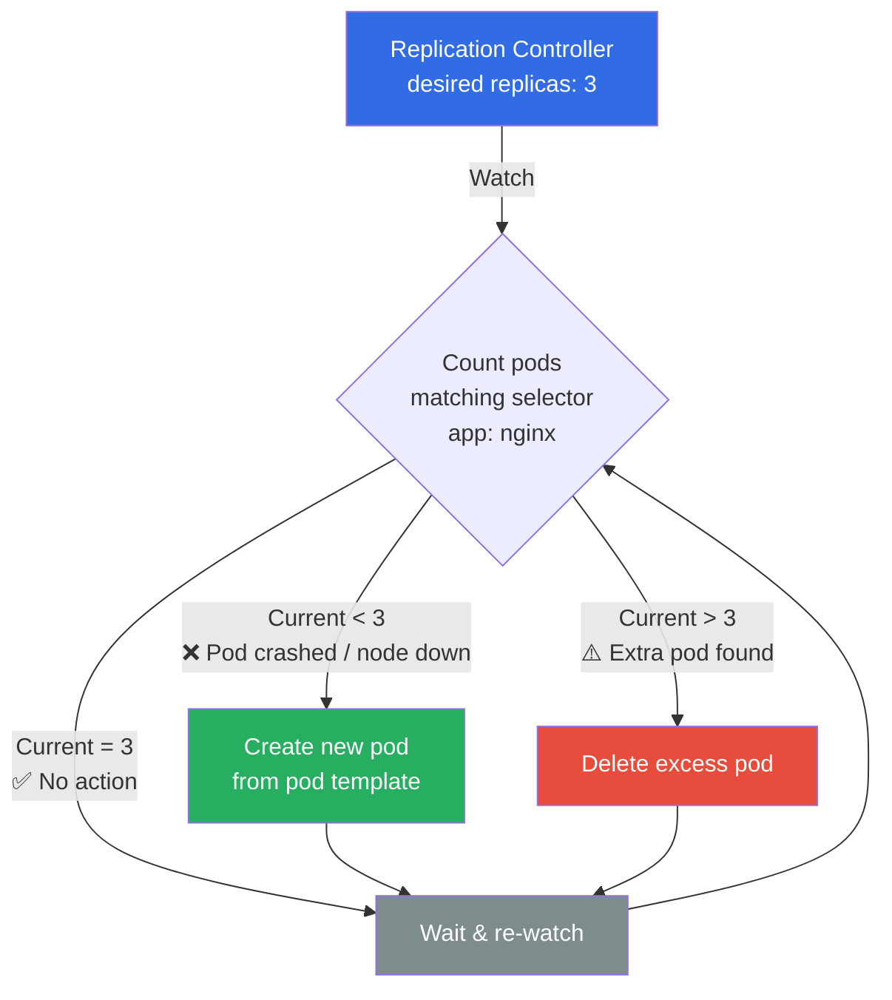
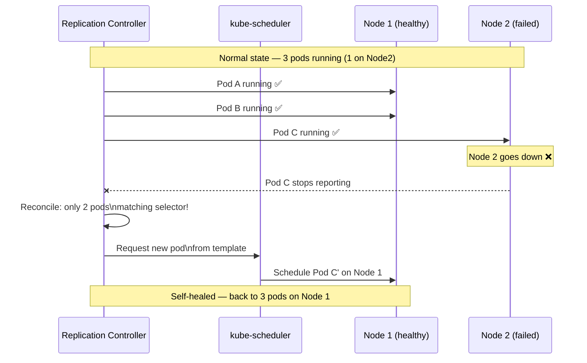
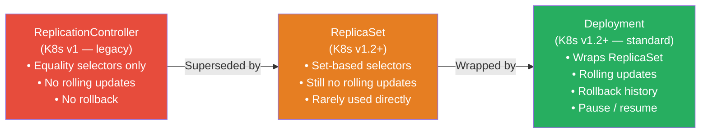
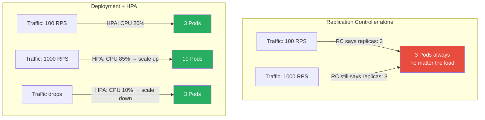

# ☸️ Kubernetes Interview Question 2 — Replication Controller


---

## ❓ The Question

> **"What is a Replication Controller in Kubernetes? What problem does it solve?"**

**Alternate phrasings you may hear:**
- "How does Kubernetes ensure that a specific number of pods is always running?"
- "What is the difference between a ReplicationController and a ReplicaSet?"
- "Why has the ReplicationController been deprecated in favour of ReplicaSet and Deployments?"
- "How does horizontal scaling work at the pod level in Kubernetes?"
- "What happens when a pod managed by a ReplicationController crashes?"

---

## 🎯 Why Interviewers Ask This

The Replication Controller is one of the foundational Kubernetes concepts — it introduced the idea of **desired state** for pod counts. Understanding it demonstrates you grasp the core Kubernetes control loop philosophy: *observe current state → compare to desired state → reconcile*.

Interviewers ask this to test:

- **Kubernetes fundamentals**: Do you understand how Kubernetes maintains high availability?
- **Evolution awareness**: Do you know that RC is legacy, and why ReplicaSet + Deployment replaced it?
- **Scaling concepts**: Can you distinguish between static replica maintenance and dynamic auto-scaling (HPA)?
- **Spec reading**: Can you read and write a K8s YAML manifest with selectors, labels, and pod templates?

> 💡 **Instant win**: Most candidates explain what a Replication Controller does. You stand out by explaining **why it was superseded** — ReplicaSet uses set-based label selectors (`In`, `NotIn`, `Exists`) instead of RC's equality-only selectors, and Deployments wrap ReplicaSets to add rolling updates and rollback capability. In modern Kubernetes you almost never use RC directly.

---

## 📖 Key Terminologies

| Term | Meaning |
|---|---|
| **Replication Controller (RC)** | Legacy K8s object that maintains a fixed number of pod replicas using equality-based selectors |
| **Desired state** | The replica count declared in the spec — the RC's goal is to always match this |
| **Current state** | The actual number of running pods that match the RC's selector |
| **Reconciliation loop** | The control loop that continuously compares desired vs current state and acts to correct drift |
| **Pod template** | The spec section inside RC that defines what each managed pod looks like |
| **Selector** | Label query used to identify which pods the RC owns and counts |
| **Equality-based selector** | Only supports `=` and `!=` operators — used by RC |
| **Set-based selector** | Supports `In`, `NotIn`, `Exists` — used by ReplicaSet (RC's successor) |
| **ReplicaSet (RS)** | Modern replacement for RC; same purpose but richer selectors |
| **Deployment** | Higher-level object that wraps a ReplicaSet and adds rolling updates + rollbacks |
| **HPA** | Horizontal Pod Autoscaler — dynamically adjusts replica count based on metrics (CPU, RPS, custom) |

---

## 🗣️ How to Answer (Structured)

A strong answer covers what the RC does, how it works, its limitations, and where it fits in the evolution toward Deployments. Here is a proven structure:

**1. Define the problem it solves:**

> "In a production Kubernetes cluster, pods can fail at any time — the node they're on crashes, the container runs out of memory, or the application itself exits unexpectedly. Without any controller managing them, those pods would simply be gone and the application would lose capacity. The Replication Controller solves this by acting as a watchdog — it guarantees that a specified number of identical pods is always running."

**2. Explain the reconciliation loop:**

> "The Replication Controller continuously runs a control loop. It counts the pods that match its label selector, compares that count to the desired replica number in the spec, and takes corrective action: if there are too few pods it creates new ones from the pod template, and if there are too many — for example if someone manually created extra pods with matching labels — it deletes the excess. This 'observe → compare → reconcile' pattern is the fundamental design philosophy of all Kubernetes controllers."

**3. Give a concrete example:**

> "If my RC spec says `replicas: 3` and one node running an nginx pod goes down, within seconds the RC detects that only 2 pods are running, and it immediately schedules a third pod on another available node. The application never drops below 3 running instances."

**4. Address the static scaling limitation:**

> "It is important to clarify that the Replication Controller maintains whatever number you define in the YAML — it does not adjust that number automatically based on load. If traffic doubles, the RC still runs 3 pods. For dynamic, demand-driven scaling you need a Horizontal Pod Autoscaler layered on top."

**5. Explain why it's legacy:**

> "In modern Kubernetes, you would never use a bare ReplicationController. It has been superseded first by ReplicaSet, which supports richer set-based label selectors, and then by Deployments, which wrap ReplicaSets to add declarative rolling updates, rollback history, and pause/resume capabilities. The Replication Controller still exists for backward compatibility but is effectively deprecated."

---

## 🔐 Security Perspective (DevSecOps)

Even though RC is a legacy object, its security principles carry forward to ReplicaSets and Deployments:

| Security Area | Concern | Best Practice |
|---|---|---|
| **Overprivileged pod template** | RC creates pods from its template — if the template has `privileged: true`, every replica is privileged | Always define `securityContext` in the pod template; set `runAsNonRoot: true`, `allowPrivilegeEscalation: false` |
| **No resource limits in template** | RC pods without CPU/memory limits can exhaust node resources | Set `resources.limits` and `resources.requests` in every pod template |
| **Broad label selectors** | A wide selector might accidentally claim pods you didn't intend | Use specific, namespaced labels like `app: nginx`, `env: prod`, `version: v1` |
| **Namespace isolation** | RC manages pods only in its own namespace | Deploy RCs in dedicated namespaces; use RBAC to restrict who can create/delete RCs |
| **Image tag `latest`** | RC pods with `image: nginx` (implicit `:latest`) pull unpredictably | Always pin image tags (`nginx:1.27.0`) and enforce with admission policies (OPA/Kyverno) |

> 🔒 **One-liner**: *"A Replication Controller is only as secure as its pod template — always add a `securityContext` with `runAsNonRoot: true`, `allowPrivilegeEscalation: false`, and explicit resource limits to every template, whether it's in an RC, ReplicaSet, or Deployment."*

---

## 🖼️ Visuals

### Replication Controller — Reconciliation Loop



---

### Pod Failure & Self-Healing Flow



---

### RC vs ReplicaSet vs Deployment — Evolution



---

### Static RC Scaling vs Dynamic HPA Scaling



---

## 📊 Quick Comparison

| Feature | ReplicationController | ReplicaSet | Deployment |
|---|---|---|---|
| **API version** | `v1` (core) | `apps/v1` | `apps/v1` |
| **Label selector type** | Equality only (`=`, `!=`) | Set-based (`In`, `NotIn`, `Exists`) | Set-based |
| **Rolling updates** | ❌ Manual | ❌ Manual | ✅ Built-in |
| **Rollback** | ❌ | ❌ | ✅ `kubectl rollout undo` |
| **Pause / resume** | ❌ | ❌ | ✅ |
| **Recommended for production** | ❌ Legacy | ⚠️ Use via Deployment | ✅ Yes |
| **Used directly today** | Almost never | Rarely (owned by Deployment) | Always |
| **HPA compatible** | ✅ | ✅ | ✅ |

---

## 🛠️ Hands-On: Commands & Syntax

### 1. Full ReplicationController YAML

```yaml
# rc.yaml
apiVersion: v1
kind: ReplicationController
metadata:
  name: nginx-rc
  namespace: default
  labels:
    app: nginx
    managed-by: rc-demo
spec:
  replicas: 3
  selector:
    app: nginx          # equality-based only: key=value
  template:
    metadata:
      name: nginx
      labels:
        app: nginx      # must match selector above
    spec:
      containers:
        - name: nginx
          image: nginx:1.27.0     # always pin image tags
          ports:
            - containerPort: 80
          resources:
            requests:
              cpu: "100m"
              memory: "64Mi"
            limits:
              cpu: "200m"
              memory: "128Mi"
      securityContext:
        runAsNonRoot: true
        runAsUser: 101
```

---

### 2. Apply and inspect

```bash
# Create the ReplicationController
kubectl apply -f rc.yaml

# Verify RC is running
kubectl get rc
# NAME       DESIRED   CURRENT   READY   AGE
# nginx-rc   3         3         3       30s

# Detailed RC status
kubectl describe rc nginx-rc

# See the pods it created (note generated name suffix)
kubectl get pods -l app=nginx
# NAME             READY   STATUS    RESTARTS   AGE
# nginx-rc-4xkj9   1/1     Running   0          45s
# nginx-rc-7plmv   1/1     Running   0          45s
# nginx-rc-qrt2n   1/1     Running   0          45s
```

---

### 3. Observe self-healing

```bash
# Delete one pod manually — RC recreates it instantly
kubectl delete pod nginx-rc-4xkj9

# Watch the RC recreate the pod in real time
kubectl get pods -l app=nginx --watch
# nginx-rc-4xkj9   1/1     Terminating
# nginx-rc-b8p2x   0/1     Pending      ← RC created new pod
# nginx-rc-b8p2x   1/1     Running
```

---

### 4. Scale the RC

```bash
# Scale using kubectl scale
kubectl scale rc nginx-rc --replicas=5

# Verify
kubectl get rc nginx-rc
# NAME       DESIRED   CURRENT   READY
# nginx-rc   5         5         5

# Scale back down
kubectl scale rc nginx-rc --replicas=2

# Edit spec directly
kubectl edit rc nginx-rc
# Change spec.replicas in the editor — RC applies immediately
```

---

### 5. Delete RC without deleting pods (orphan)

```bash
# Delete RC but keep the pods running
kubectl delete rc nginx-rc --cascade=orphan

# Pods still exist — now unmanaged (orphaned)
kubectl get pods -l app=nginx
# Still running, but no RC watching them now

# Delete RC AND all its pods (default behaviour)
kubectl delete rc nginx-rc
```

---

### 6. Equivalent modern approach — Deployment (recommended)

```yaml
# deployment.yaml — the modern equivalent of rc.yaml above
apiVersion: apps/v1
kind: Deployment
metadata:
  name: nginx-deployment
spec:
  replicas: 3
  selector:
    matchLabels:
      app: nginx
  strategy:
    type: RollingUpdate
    rollingUpdate:
      maxSurge: 1
      maxUnavailable: 0
  template:
    metadata:
      labels:
        app: nginx
    spec:
      containers:
        - name: nginx
          image: nginx:1.27.0
          ports:
            - containerPort: 80
          resources:
            requests:
              cpu: "100m"
              memory: "64Mi"
            limits:
              cpu: "200m"
              memory: "128Mi"
      securityContext:
        runAsNonRoot: true
        runAsUser: 101
```

```bash
# Apply the Deployment
kubectl apply -f deployment.yaml

# Check rollout status
kubectl rollout status deployment/nginx-deployment

# View rollout history
kubectl rollout history deployment/nginx-deployment

# Rolling update — change image version
kubectl set image deployment/nginx-deployment nginx=nginx:1.27.2

# Rollback if needed
kubectl rollout undo deployment/nginx-deployment
```

---

### 7. Add HPA for dynamic scaling (on top of Deployment)

```yaml
# hpa.yaml
apiVersion: autoscaling/v2
kind: HorizontalPodAutoscaler
metadata:
  name: nginx-hpa
spec:
  scaleTargetRef:
    apiVersion: apps/v1
    kind: Deployment
    name: nginx-deployment
  minReplicas: 3
  maxReplicas: 10
  metrics:
    - type: Resource
      resource:
        name: cpu
        target:
          type: Utilization
          averageUtilization: 70
```

```bash
kubectl apply -f hpa.yaml
kubectl get hpa nginx-hpa
# NAME        REFERENCE                     TARGETS   MINPODS   MAXPODS   REPLICAS
# nginx-hpa   Deployment/nginx-deployment   15%/70%   3         10        3
```

---

## 🤖 AI & The New Trend (2024–2025)

**Replication Controller in the modern landscape:**

The ReplicationController itself is a legacy object and sees no active development. However, the concepts it introduced remain central to how modern Kubernetes works:

- **KEDA (Kubernetes Event-Driven Autoscaling, 2024)**: Where HPA scales on CPU/memory, KEDA scales on any event source — queue depth, HTTP request rate, database row count, Kafka lag, and 60+ other triggers. KEDA creates and manages HPA objects under the hood, extending the same "desired replica count" reconciliation loop the RC pioneered.

- **Argo Rollouts**: Extends the Deployment concept with advanced delivery strategies like canary, blue-green, and analysis-based progressive delivery — all built on the same ReplicaSet foundation that replaced RC.

- **VPA (Vertical Pod Autoscaler)**: While HPA scales pod *count*, VPA scales pod *size* (CPU/memory requests and limits) based on observed usage. Using HPA + VPA together gives full right-sizing of your workloads.

- **AI-powered scaling (2025 trend)**: Platforms like Karpenter (node-level) and tools like Predictive HPA use ML models trained on historical load patterns to pre-scale before traffic spikes arrive, rather than reacting after the fact. The foundational replica controller loop remains — only the signal driving it becomes smarter.

---

## ✅ Prerequisites

Before this question, you should be comfortable with:

- **Kubernetes architecture basics**: What are pods, nodes, the control plane, and the API server?
- **kubectl fundamentals**: `apply`, `get`, `describe`, `delete`, `scale`
- **Labels and selectors**: How labels are applied to pods and how selectors filter them
- **YAML syntax**: Reading and writing basic Kubernetes manifests
- **Container basics**: What an image, container port, and restart policy are

---

## 📚 Further Reading

- [Kubernetes Docs — ReplicationController](https://kubernetes.io/docs/concepts/workloads/controllers/replicationcontroller/)
- [Kubernetes Docs — ReplicaSet](https://kubernetes.io/docs/concepts/workloads/controllers/replicaset/)
- [Kubernetes Docs — Deployments](https://kubernetes.io/docs/concepts/workloads/controllers/deployment/)
- [Kubernetes Docs — Horizontal Pod Autoscaler](https://kubernetes.io/docs/tasks/run-application/horizontal-pod-autoscale/)
- [KEDA — Kubernetes Event-Driven Autoscaling](https://keda.sh/)
- [Argo Rollouts — Progressive Delivery](https://argoproj.github.io/rollouts/)
- [Kubernetes API Deprecation Policy](https://kubernetes.io/docs/reference/using-api/deprecation-policy/)

---

## 🔁 Related / Follow-up Questions

1. **"What is the difference between a ReplicationController and a ReplicaSet?"**
   → Both maintain a desired pod count. The key difference is the selector type: RC uses equality-based selectors (`app=nginx`) while ReplicaSet uses set-based selectors (`app in (nginx, apache)`). ReplicaSet also has a separate `matchLabels`/`matchExpressions` field in its spec rather than a flat `selector`. In practice, you never use either directly — you use Deployments.

2. **"Why do we use Deployments instead of ReplicaSets directly?"**
   → A Deployment wraps a ReplicaSet and adds rolling update logic. When you change the pod template (e.g., update the image), the Deployment creates a new ReplicaSet, scales it up while scaling down the old one, and keeps the old ReplicaSet around for rollback. A bare ReplicaSet gives none of this — you'd have to manage the update manually.

3. **"What happens when a node running RC-managed pods goes down?"**
   → The node controller marks the node as `NotReady`. After the pod eviction timeout (default 5 minutes), the pods on that node are marked `Unknown`. The RC's control loop detects fewer healthy pods than desired and schedules replacements on other available nodes.

4. **"How does the RC selector work? What if a manually created pod matches the selector?"**
   → The RC counts ALL pods matching its selector — including pods you created manually with matching labels. If manual pods push the count above `replicas`, the RC will delete the excess. This is why label hygiene matters — use specific labels to avoid unintended ownership.

5. **"Can a Replication Controller span multiple namespaces?"**
   → No. An RC is namespaced — it only manages pods within its own namespace. For multi-namespace deployments, you would deploy separate RCs (or Deployments) in each namespace.

6. **"What is the difference between static scaling (RC) and dynamic scaling (HPA)?"**
   → An RC maintains whatever static replica count is set in its spec — it never changes the count on its own. An HPA monitors a metric (CPU utilisation, memory, custom metrics) and automatically increases or decreases the replica count on the target object (Deployment/ReplicaSet) within configured `minReplicas` and `maxReplicas` bounds.

7. **"If you delete a ReplicationController, are its pods also deleted?"**
   → By default yes — `kubectl delete rc nginx-rc` cascades and deletes all managed pods. To keep pods alive while removing the RC, use `kubectl delete rc nginx-rc --cascade=orphan`. The pods continue running but are no longer managed.

---

## 📌 30-Second Interview Summary

> **A Replication Controller is a Kubernetes object that ensures a specified number of identical pod replicas is always running in the cluster.**
>
> It runs a continuous reconciliation loop: count pods matching its label selector → compare to `spec.replicas` → create pods if there are too few, delete if there are too many. This makes the cluster self-healing — if a pod crashes or a node goes down, the RC automatically schedules replacements.
>
> **Important limitation**: the RC maintains a *static* replica count defined in the YAML. It does not scale automatically with traffic — for that you need a Horizontal Pod Autoscaler.
>
> **Modern usage**: The ReplicationController is legacy. In practice, you always use a **Deployment**, which wraps a **ReplicaSet** (the RC's successor with richer selectors) and adds rolling updates, rollback history, and pause/resume capabilities. The RC concept is still valuable to understand because it explains the control-loop philosophy that underpins all Kubernetes controllers.
