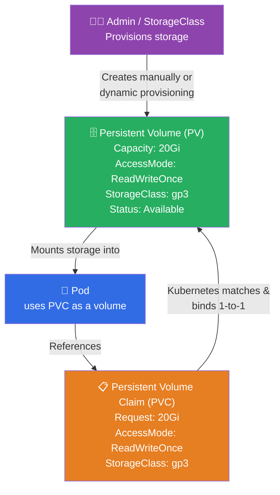
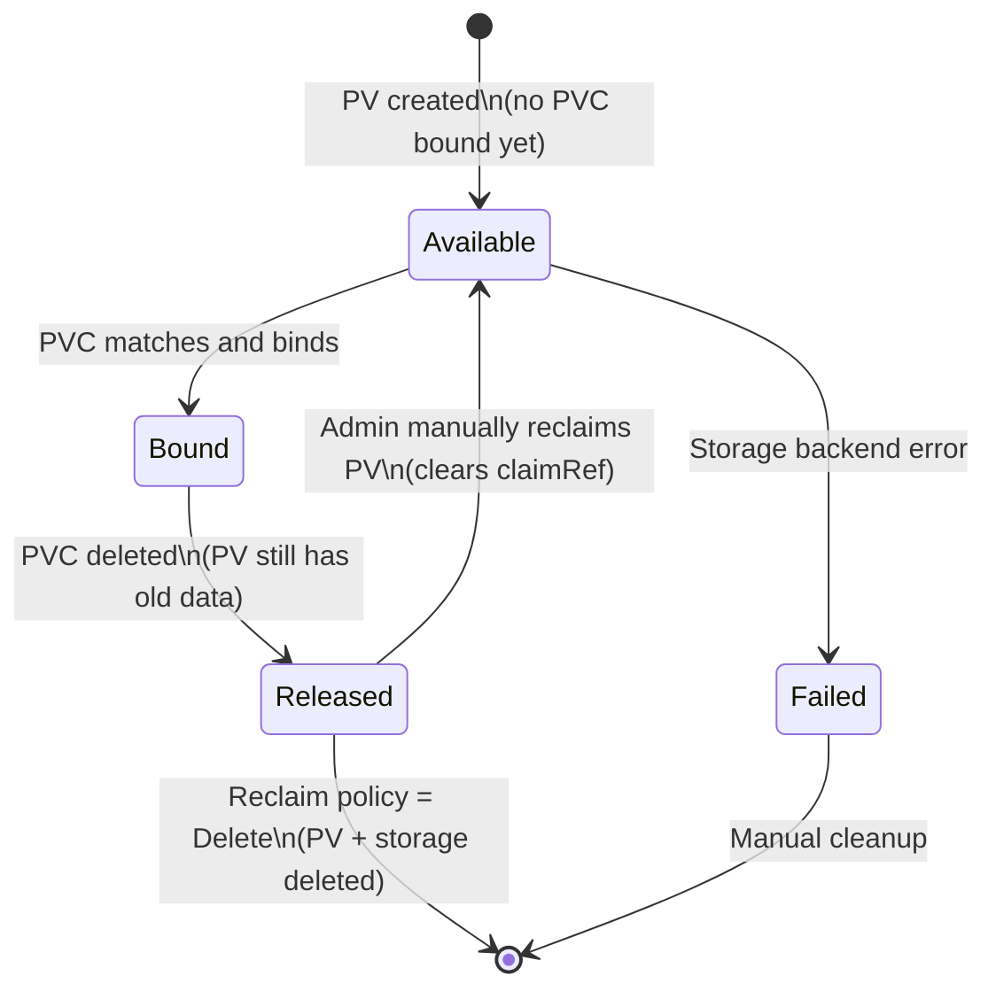
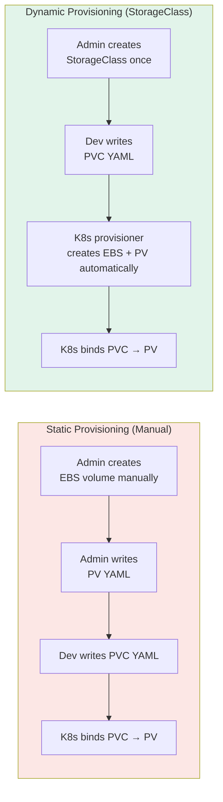
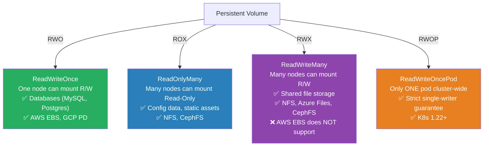

# ☸️ Kubernetes Interview Question 3 — Persistent Volumes & Persistent Volume Claims


---

## ❓ The Question

> **"What are Persistent Volumes (PV) and Persistent Volume Claims (PVC) in Kubernetes? How do they work together?"**

**Alternate phrasings you may hear:**
- "How does Kubernetes manage persistent storage for stateful applications?"
- "What is the difference between a PV and a PVC?"
- "How does dynamic provisioning with StorageClass work?"
- "What are the access modes in Kubernetes PVs?"
- "What happens to a PV when the PVC that is bound to it is deleted?"

---

## 🎯 Why Interviewers Ask This

Persistent storage is one of the hardest parts of running stateful workloads in Kubernetes. Without understanding PVs and PVCs, you cannot reliably run databases, message queues, or any application that needs to survive pod restarts.

Interviewers ask this to assess:

- **Storage architecture understanding**: Do you know the separation between cluster-level storage resources (PV) and pod-level storage requests (PVC)?
- **Access mode knowledge**: Can you select the right access mode for a database vs a shared read volume?
- **Dynamic provisioning**: Do you know what StorageClass is and how it eliminates manual PV creation?
- **Reclaim policy awareness**: Do you know what happens to data when a PVC is deleted?
- **Production readiness**: Can you write a complete PV + PVC + Pod YAML stack?

> 💡 **Instant win**: Most candidates describe PV as "storage" and PVC as "a request for storage." You stand out by explaining the **full binding lifecycle** (Available → Bound → Released), the three **reclaim policies** (Retain, Delete, Recycle), the **four access modes**, and — critically — that in modern Kubernetes you almost never create PVs manually because **StorageClass + dynamic provisioning** creates the PV automatically when a PVC is submitted.

---

## 📖 Key Terminologies

| Term | Meaning |
|---|---|
| **Persistent Volume (PV)** | A cluster-level storage resource representing a piece of storage provisioned by an admin or dynamically by a StorageClass |
| **Persistent Volume Claim (PVC)** | A pod's request for storage — specifies size, access mode, and optionally StorageClass |
| **StorageClass** | A Kubernetes object that defines a storage provisioner and parameters; enables dynamic PV creation |
| **Dynamic Provisioning** | PV is automatically created by the StorageClass provisioner when a PVC is submitted — no manual PV needed |
| **Binding** | A 1-to-1 match between a PVC and a PV; once bound, no other PVC can claim that PV |
| **Access Mode** | How the volume can be mounted — ReadWriteOnce, ReadOnlyMany, ReadWriteMany, ReadWriteOncePod |
| **Reclaim Policy** | What happens to a PV when its PVC is deleted — Retain, Delete, or Recycle (deprecated) |
| **Volume Plugin / CSI** | The driver that connects Kubernetes to actual storage (AWS EBS, GCP PD, NFS, Ceph, etc.) |
| **CSI (Container Storage Interface)** | The standard API for storage drivers; replaced in-tree volume plugins from K8s 1.23+ |
| **PV Phases** | The lifecycle states a PV can be in: Available, Bound, Released, Failed |
| **volumeBindingMode** | StorageClass setting: `Immediate` (bind at PVC creation) or `WaitForFirstConsumer` (bind at pod scheduling) |

---

## 🗣️ How to Answer (Structured)

**1. Start with the problem:**

> "In Kubernetes, pods are ephemeral — when a pod restarts, any data written inside the container's filesystem is lost. For stateful applications like databases, that's unacceptable. Persistent Volumes solve this by providing storage that outlives any individual pod."

**2. Define PV and PVC with the right separation of concerns:**

> "A Persistent Volume is a cluster-level resource — it represents an actual piece of storage that has been provisioned, either manually by an admin or automatically by a StorageClass. It is completely independent of any pod; it exists in the cluster until explicitly deleted.
>
> A Persistent Volume Claim is a namespace-level resource — it is a pod's request for storage. The PVC declares what the pod needs: how much capacity, what access mode, and optionally which StorageClass. Kubernetes then finds a matching PV and binds them together in a 1-to-1 relationship."

**3. Use the analogy:**

> "I like to think of it like renting an office. The PV is the office building — it exists, it has space, it has a specific address. The PVC is the rental agreement — it says 'I need 50 square metres on the second floor.' Once the lease is signed, that office is yours and no one else can rent it. The pod is the employee who actually walks in and uses the space."

**4. Explain dynamic provisioning:**

> "In modern Kubernetes, you rarely create PVs manually. Instead, you define a StorageClass — for example, using the AWS EBS CSI driver. When a pod submits a PVC requesting 20Gi with that StorageClass, the provisioner automatically creates the EBS volume, registers it as a PV, and binds it to the PVC. This is dynamic provisioning — the storage comes into existence on demand."

**5. Cover reclaim policies:**

> "When a PVC is deleted, what happens to the PV depends on its reclaim policy. `Delete` means the underlying storage is also deleted — convenient for ephemeral workloads. `Retain` means the PV and the data stay, but the PV moves to a Released state and must be manually reclaimed before it can be reused — important for production databases where you never want accidental data deletion."

---

## 🔐 Security Perspective (DevSecOps)

| Security Area | Risk | Best Practice |
|---|---|---|
| **Encryption at rest** | PV data stored unencrypted on disk | Use StorageClass with encrypted volumes (AWS EBS `encrypted: "true"`, GCP `disk-encryption-key`) |
| **Encryption in transit** | Data moving between pod and storage node unencrypted | Use CSI drivers that support TLS; for NFS use Kerberos or VPN |
| **PVC RBAC** | Any pod in a namespace can claim any PVC | Use RBAC to restrict `create`/`delete` on PVCs; use namespaced quotas |
| **Reclaim policy** | `Delete` reclaim policy can cause accidental data loss | Default to `Retain` for production databases; automate backups before deletion |
| **hostPath volumes** | Mounting host paths bypasses PV/PVC abstraction entirely | Block `hostPath` volumes with OPA/Kyverno admission policies |
| **PV over-provisioning** | A PVC requesting 10Ti could provision enormous cloud storage | Use `ResourceQuota` per namespace to cap total PVC storage requests |
| **Snapshot access** | Volume snapshots expose raw data backups | Restrict `VolumeSnapshot` creation/access with RBAC |

> 🔒 **One-liner**: *"Always set `Retain` as the reclaim policy on PVs backing production databases — it guarantees that even if a PVC is accidentally deleted, the underlying data survives. Pair this with encrypted StorageClasses and namespace ResourceQuotas to prevent both data loss and runaway cloud storage costs."*

---

## 🖼️ Visuals

### Reference Diagram (Source: KodeKloud)

**Pod → PVC → PV → Storage flow:**


---

### PV / PVC Binding Flow



---

### PV Lifecycle — State Machine



---

### Static vs Dynamic Provisioning



---

### Access Modes Visual Guide



---

## 📊 Quick Comparison

| Feature | Persistent Volume (PV) | Persistent Volume Claim (PVC) |
|---|---|---|
| **Scope** | Cluster-wide | Namespaced |
| **Created by** | Admin or dynamic provisioner | Developer / pod spec |
| **Represents** | Actual storage resource | Request for storage |
| **Lifecycle** | Independent of pods | Tied to namespace/workload |
| **Binding** | 1 PV ↔ 1 PVC only | Must match PV capacity + access mode |
| **Survives pod deletion** | ✅ Yes | ✅ Yes (unless PVC also deleted) |
| **Survives PVC deletion** | Depends on reclaim policy | N/A |

---

### Reclaim Policy Comparison

| Policy | PV after PVC deletion | Data after PVC deletion | Use case |
|---|---|---|---|
| **Delete** | PV deleted | Data deleted | Ephemeral workloads, dev/test |
| **Retain** | PV moves to `Released` | Data preserved | Production databases |
| **Recycle** *(deprecated)* | PV scrubbed (`rm -rf`) | Data deleted | Legacy only — avoid |

---

## 🛠️ Hands-On: Commands & Syntax

### 1. Static Provisioning — Manual PV + PVC + Pod

```yaml
# pv.yaml — Admin creates this
apiVersion: v1
kind: PersistentVolume
metadata:
  name: postgres-pv
  labels:
    type: local
    app: postgres
spec:
  capacity:
    storage: 20Gi
  accessModes:
    - ReadWriteOnce
  persistentVolumeReclaimPolicy: Retain
  storageClassName: manual
  hostPath:
    path: /mnt/data/postgres   # dev/test only — use EBS/NFS in production
```

```yaml
# pvc.yaml — Developer creates this
apiVersion: v1
kind: PersistentVolumeClaim
metadata:
  name: postgres-pvc
  namespace: production
spec:
  accessModes:
    - ReadWriteOnce
  storageClassName: manual
  resources:
    requests:
      storage: 20Gi
```

```yaml
# pod-with-pvc.yaml — Pod references the PVC
apiVersion: v1
kind: Pod
metadata:
  name: postgres-pod
  namespace: production
spec:
  containers:
    - name: postgres
      image: postgres:16-alpine
      env:
        - name: PGDATA
          value: /var/lib/postgresql/data/pgdata
      volumeMounts:
        - mountPath: /var/lib/postgresql/data
          name: postgres-storage
      resources:
        requests:
          cpu: "250m"
          memory: "256Mi"
        limits:
          cpu: "500m"
          memory: "512Mi"
  volumes:
    - name: postgres-storage
      persistentVolumeClaim:
        claimName: postgres-pvc    # reference the PVC by name
```

---

### 2. Dynamic Provisioning — StorageClass + PVC only

```yaml
# storageclass.yaml — Admin creates this ONCE
apiVersion: storage.k8s.io/v1
kind: StorageClass
metadata:
  name: gp3-encrypted
  annotations:
    storageclass.kubernetes.io/is-default-class: "true"
provisioner: ebs.csi.aws.com          # AWS EBS CSI driver
parameters:
  type: gp3
  encrypted: "true"
  fsType: ext4
volumeBindingMode: WaitForFirstConsumer  # bind only when pod is scheduled
reclaimPolicy: Retain                    # protect production data
allowVolumeExpansion: true               # allow PVC resize
```

```yaml
# dynamic-pvc.yaml — Developer submits this; PV is auto-created
apiVersion: v1
kind: PersistentVolumeClaim
metadata:
  name: app-data-pvc
  namespace: production
spec:
  accessModes:
    - ReadWriteOnce
  storageClassName: gp3-encrypted    # references the StorageClass above
  resources:
    requests:
      storage: 50Gi
```

```bash
# Submit the PVC — AWS EBS volume is created automatically
kubectl apply -f dynamic-pvc.yaml

# Check PVC status
kubectl get pvc -n production
# NAME           STATUS   VOLUME                                     CAPACITY   STORAGECLASS
# app-data-pvc   Bound    pvc-a1b2c3d4-...                           50Gi       gp3-encrypted
```

---

### 3. Inspect PV and PVC state

```bash
# List all PVs in the cluster
kubectl get pv
# NAME          CAPACITY   ACCESS MODES   RECLAIM POLICY   STATUS   CLAIM
# postgres-pv   20Gi       RWO            Retain           Bound    production/postgres-pvc

# List PVCs in a namespace
kubectl get pvc -n production

# Detailed PV info (see binding, storageClass, etc.)
kubectl describe pv postgres-pv

# Detailed PVC info
kubectl describe pvc postgres-pvc -n production

# Check events if PVC is stuck in Pending
kubectl describe pvc app-data-pvc -n production | grep -A5 Events
# Common cause: no matching PV, or WaitForFirstConsumer waiting for pod
```

---

### 4. Expand a PVC (requires `allowVolumeExpansion: true`)

```bash
# Edit PVC to increase storage request
kubectl edit pvc app-data-pvc -n production
# Change: storage: 50Gi → storage: 100Gi

# Or patch directly
kubectl patch pvc app-data-pvc -n production \
  -p '{"spec":{"resources":{"requests":{"storage":"100Gi"}}}}'

# Verify expansion
kubectl get pvc app-data-pvc -n production
# CAPACITY shows 100Gi once resized (may require pod restart for filesystem resize)
```

---

### 5. Manually reclaim a Released PV (Retain policy)

```bash
# After PVC is deleted, PV moves to Released state — data is intact
kubectl get pv postgres-pv
# STATUS: Released

# Remove the old claimRef so PV becomes Available again
kubectl patch pv postgres-pv \
  -p '{"spec":{"claimRef": null}}'

# PV is now Available and can be bound by a new PVC
kubectl get pv postgres-pv
# STATUS: Available
```

---

### 6. Volume Snapshots (CSI — K8s 1.20+)

```yaml
# volumesnapshotclass.yaml
apiVersion: snapshot.storage.k8s.io/v1
kind: VolumeSnapshotClass
metadata:
  name: csi-aws-vsc
driver: ebs.csi.aws.com
deletionPolicy: Retain

---
# Take a snapshot of a PVC
apiVersion: snapshot.storage.k8s.io/v1
kind: VolumeSnapshot
metadata:
  name: postgres-snap-20240901
  namespace: production
spec:
  volumeSnapshotClassName: csi-aws-vsc
  source:
    persistentVolumeClaimName: postgres-pvc
```

```bash
kubectl apply -f snapshot.yaml
kubectl get volumesnapshot -n production
# NAME                       READYTOUSE   SOURCEPVC       RESTORESIZE
# postgres-snap-20240901     true         postgres-pvc    20Gi
```

---

### 7. ResourceQuota — cap PVC storage per namespace

```yaml
# namespace-quota.yaml
apiVersion: v1
kind: ResourceQuota
metadata:
  name: storage-quota
  namespace: production
spec:
  hard:
    requests.storage: "500Gi"          # total PVC storage in namespace
    persistentvolumeclaims: "10"       # max number of PVCs
    gp3-encrypted.storageclass.storage.k8s.io/requests.storage: "500Gi"
```

---

## 🤖 AI & The New Trend (2024–2025)

**Storage in modern Kubernetes (2024–2025):**

- **CSI (Container Storage Interface) is now the only standard**: In-tree volume plugins (awsElasticBlockStore, gcePersistentDisk) were fully removed from the Kubernetes core in v1.27–1.29. All storage is now delivered via CSI drivers — AWS EBS CSI, GCP PD CSI, Azure Disk CSI, Rook-Ceph, etc. Any PV YAML using old in-tree plugin types needs migration.

- **Volume snapshots went GA**: The `VolumeSnapshot` API (backed by CSI) is now stable. This enables point-in-time backups of PVCs directly within Kubernetes, making database snapshot workflows first-class K8s citizens.

- **Velero for backup and DR**: Velero (VMware) is the standard tool for backing up both Kubernetes objects and PVC data together. In 2024, Velero added native CSI snapshot integration — a single `velero backup create` captures both your workload YAML and the underlying volume snapshot.

- **ReadWriteOncePod (RWOP)**: Introduced in K8s 1.22 and went GA in 1.29. This new access mode guarantees only a single pod cluster-wide can mount the volume with write access — solving split-brain issues in databases where `ReadWriteOnce` (node-level) wasn't strict enough.

- **AI on storage**: Cloud providers are applying ML to storage tiering — AWS EBS gp3 Intelligent Tiering and Google Hyperdisk can automatically move cold data to cheaper storage tiers based on access patterns. In Kubernetes, this is transparent to PVCs but reduces cost without manual intervention.

---

## ✅ Prerequisites

Before this question, you should be comfortable with:

- **Kubernetes pods and deployments**: Understand how pods are scheduled and restarted
- **YAML manifests**: Reading and writing Kubernetes object specs
- **kubectl basics**: `apply`, `get`, `describe`, `delete`
- **Cloud storage basics**: What EBS, NFS, and block storage are conceptually
- **Kubernetes namespaces**: PVCs are namespaced; PVs are cluster-scoped — this distinction matters

---

## 📚 Further Reading

- [Kubernetes Docs — Persistent Volumes](https://kubernetes.io/docs/concepts/storage/persistent-volumes/)
- [Kubernetes Docs — StorageClass](https://kubernetes.io/docs/concepts/storage/storage-classes/)
- [Kubernetes Docs — Volume Snapshots](https://kubernetes.io/docs/concepts/storage/volume-snapshots/)
- [AWS EBS CSI Driver](https://github.com/kubernetes-sigs/aws-ebs-csi-driver)
- [Velero — Backup and Migrate K8s Resources](https://velero.io/docs/)
- [Rook-Ceph — Cloud-Native Storage for Kubernetes](https://rook.io/)
- [CSI Driver List — Kubernetes SIGs](https://kubernetes-csi.github.io/docs/drivers.html)

---

## 🔁 Related / Follow-up Questions

1. **"What happens to a PVC when the pod using it is deleted?"**
   → Nothing — the PVC continues to exist independently of the pod. The data is preserved. A new pod can mount the same PVC using `claimName`. The PVC is only deleted if you explicitly run `kubectl delete pvc`.

2. **"What is `WaitForFirstConsumer` volumeBindingMode and why does it matter?"**
   → With `Immediate`, the PV/EBS volume is created as soon as the PVC is submitted — which might be in a different AZ than where the pod gets scheduled, causing a mount failure. `WaitForFirstConsumer` delays PV creation until a pod is scheduled, ensuring the volume is created in the correct AZ/zone.

3. **"Can two pods share the same PVC?"**
   → It depends on the access mode. `ReadWriteOnce` allows mounting on one node (multiple pods on the same node is technically allowed but risky). `ReadWriteMany` allows multiple pods on different nodes to mount simultaneously. `ReadWriteOncePod` strictly allows only one pod cluster-wide.

4. **"What is a StorageClass and how does it differ from a PV?"**
   → A StorageClass is a template/policy that describes a class of storage — which provisioner to use, what disk type, whether to encrypt. A PV is the actual storage instance. StorageClass + PVC triggers dynamic creation of a PV; without StorageClass you must create PVs manually.

5. **"How do you resize a PVC?"**
   → Edit the PVC's `spec.resources.requests.storage` to a larger value. This requires `allowVolumeExpansion: true` on the StorageClass. For some volume types (like ext4 on EBS), the pod may need to be restarted for the filesystem to reflect the new size after the underlying volume is resized.

6. **"What is the difference between `emptyDir` and a PVC?"**
   → `emptyDir` is a temporary volume that exists for the lifetime of the pod — when the pod is deleted, the data is gone. It lives on the node. A PVC-backed volume is persistent — it outlives the pod, can be remounted by new pods, and lives on dedicated storage (EBS, NFS, etc.). Use `emptyDir` for scratch space/caching; use PVCs for any data that must survive pod restarts.

7. **"How do you back up PVC data in Kubernetes?"**
   → The recommended approach is Velero with CSI snapshot integration. It captures both the Kubernetes objects (Deployment, Service, ConfigMap) and the underlying volume snapshot in one backup operation. Alternatively, use `kubectl exec` to run a database dump inside the pod and stream it to external storage, or use a CronJob that runs a backup tool.

---

## 📌 30-Second Interview Summary

> **Persistent Volumes (PV) and Persistent Volume Claims (PVC) are Kubernetes's abstraction layer for storage.**
>
> A **PV** is a cluster-level storage resource — it represents actual storage (an EBS volume, NFS share, or Ceph block device). It exists independently of any pod.
>
> A **PVC** is a namespace-level storage request — a pod declares what it needs: how much capacity, what access mode, and optionally which StorageClass. Kubernetes binds a PVC to a matching PV in a 1-to-1 relationship.
>
> **Dynamic provisioning** eliminates manual PV creation: a StorageClass defines the provisioner, and when a PVC is submitted, the provisioner automatically creates the PV and binds it. This is the modern, standard approach on cloud environments.
>
> **Key distinctions to know**: access modes (ReadWriteOnce for databases, ReadWriteMany for shared data), reclaim policies (Retain keeps data after PVC deletion, Delete removes it), and `WaitForFirstConsumer` binding mode which ensures volumes are created in the correct availability zone.
>
> PVs and PVCs are what make stateful applications — databases, message queues, file stores — possible to run reliably in Kubernetes.
