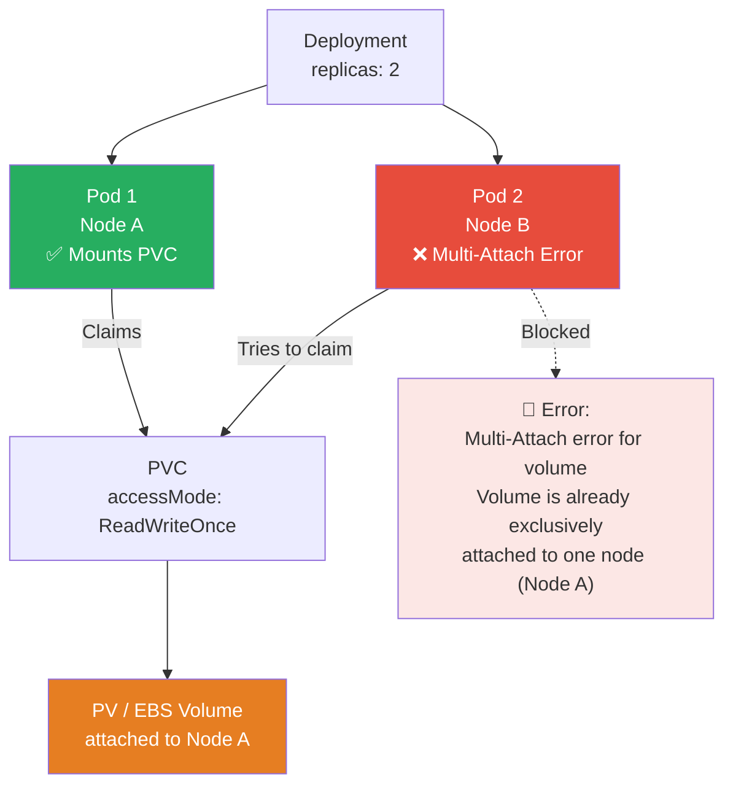
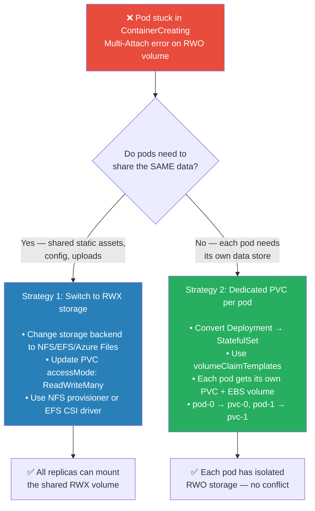
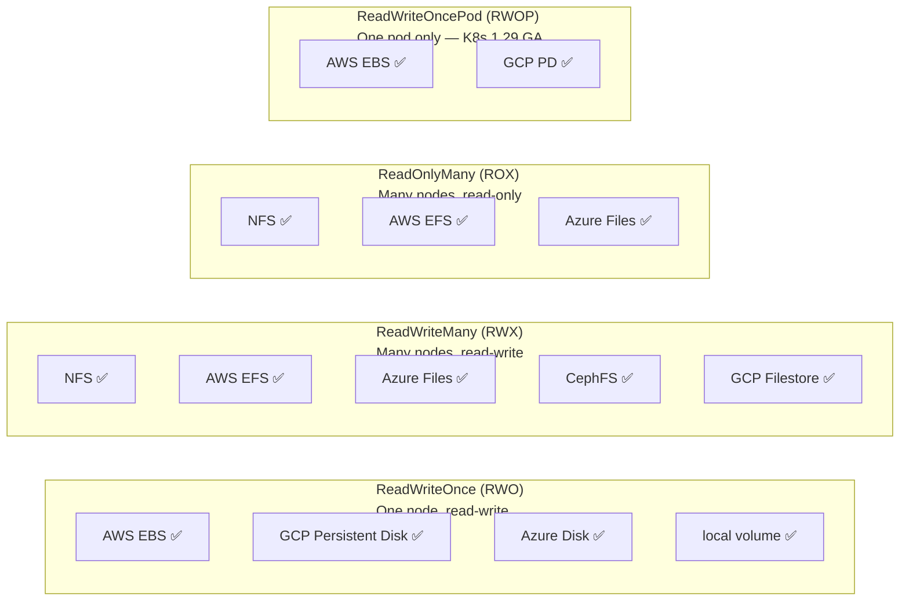
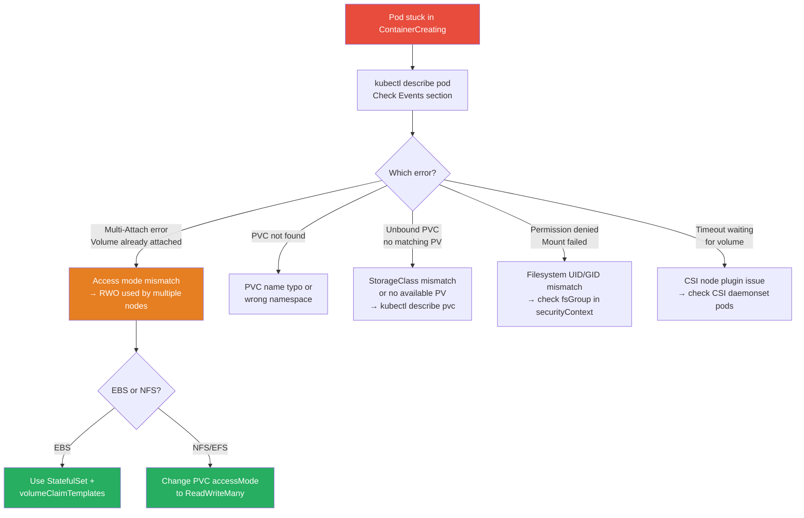

# ☸️ Kubernetes Interview Question 4 — Volume Access Mode Errors & Troubleshooting


---

## ❓ The Question

> **"A pod is encountering an access error when attempting to use a volume. How would you diagnose and resolve this?"**

**Alternate phrasings you may hear:**
- "Two pods are trying to share the same PVC but one of them fails to mount. What is the likely cause?"
- "What is the difference between ReadWriteOnce and ReadWriteMany access modes?"
- "A deployment was scaled to 3 replicas and now pods are stuck in `ContainerCreating`. The events mention a volume mount error. What do you check first?"
- "Which access mode should you use for a shared NFS volume vs an AWS EBS volume?"
- "How do you troubleshoot a PVC that is stuck in `Pending`?"

---

## 🎯 Why Interviewers Ask This

This is a **practical scenario question** — interviewers use it to test whether you can diagnose real-world Kubernetes storage problems, not just recite definitions. The volume access error is one of the most common issues teams hit when scaling workloads.

Interviewers are checking:

- **Hands-on debugging instincts**: Do you go straight to `kubectl describe pod` and `kubectl describe pvc`?
- **Access mode knowledge**: Can you identify that RWO allows only one node, making it incompatible with multi-replica deployments?
- **Resolution judgment**: Do you know the two valid fixes — changing to RWX storage vs giving each pod its own volume?
- **Storage backend awareness**: Do you know which storage backends support which access modes (EBS = RWO only, NFS = RWX)?

> 💡 **Instant win**: Most candidates say "change to ReadWriteMany." You stand out by explaining that **not all storage backends support RWX** — AWS EBS is physically incapable of supporting ReadWriteMany, so for EBS-backed workloads the correct fix is to use `volumeClaimTemplates` in a StatefulSet so each pod gets its own dedicated PVC. Changing the access mode field alone won't fix an EBS volume — you must also use a storage backend that actually supports concurrent writes.

---

## 📖 Key Terminologies

| Term | Meaning |
|---|---|
| **ReadWriteOnce (RWO)** | Volume can be mounted read-write by pods on a **single node** only |
| **ReadWriteMany (RWX)** | Volume can be mounted read-write by pods on **multiple nodes** simultaneously |
| **ReadOnlyMany (ROX)** | Volume can be mounted **read-only** by pods on multiple nodes |
| **ReadWriteOncePod (RWOP)** | Volume can be mounted read-write by exactly **one pod** cluster-wide (K8s 1.22+, GA in 1.29) |
| **Multi-attach error** | The error thrown when a second node tries to attach an RWO volume already attached to another node |
| **ContainerCreating** | Pod state where volume mounting is in progress or has failed |
| **volumeClaimTemplates** | StatefulSet field that creates a dedicated PVC per pod replica automatically |
| **CSI driver** | The storage driver that enforces access mode constraints at the infrastructure level |
| **NFS** | Network File System — supports RWX; multiple nodes can mount simultaneously |
| **AWS EBS** | Block storage — supports RWO only; physically attached to one EC2 instance at a time |

---

## 🗣️ How to Answer (Structured)

**1. Start with the diagnostic approach:**

> "My first step is always to look at the pod events. I run `kubectl describe pod <pod-name>` and scroll to the Events section at the bottom. For a volume access error, I typically see a message like `Multi-Attach error for volume: Volume is already exclusively attached to one node`. That immediately tells me the volume has an RWO access mode and a second pod or node is trying to attach it."

**2. Explain the root cause:**

> "The root cause is an access mode mismatch. ReadWriteOnce means the volume can only be mounted read-write by pods running on a single node. If I have a Deployment with 2 or more replicas, and those replicas get scheduled on different nodes, only the first pod will successfully mount the volume. The second pod's node will get the Multi-Attach error because the EBS volume is already attached to the first node."

**3. Present both resolution strategies:**

> "There are two valid fixes depending on the workload. First, if the application genuinely needs multiple pods to share the same data simultaneously — like a web server reading shared static assets — I switch to a storage backend that supports ReadWriteMany, such as NFS, AWS EFS, or Azure Files, and update the PVC's access mode accordingly.
>
> Second, if each pod doesn't need to share data but just needs its own persistent storage — like a database where each replica should have its own independent data directory — I use a StatefulSet with `volumeClaimTemplates`. This creates a dedicated PVC per pod automatically, so pod-0 gets its own EBS volume and pod-1 gets a completely separate EBS volume. Each pod has RWO access to its own storage."

**4. Add the important nuance about EBS:**

> "One thing to be careful about: you cannot just change the access mode field in a PVC to ReadWriteMany if the underlying storage is AWS EBS. EBS is a block device that physically attaches to one EC2 instance — the access mode field in the YAML would say RWX, but the CSI driver would still reject the multi-attach because the hardware doesn't support it. For RWX on AWS, you must switch to EFS (Elastic File System), which is built on NFS and genuinely supports concurrent multi-node access."

---

## 🔐 Security Perspective (DevSecOps)

| Security Area | Risk | Best Practice |
|---|---|---|
| **RWX volumes and data isolation** | Multiple pods writing to the same NFS share can corrupt each other's data | Use subdirectories per application and filesystem-level ACLs to isolate write areas |
| **hostPath as a workaround** | Engineers sometimes use `hostPath` to bypass access mode issues — it gives container access to the host filesystem | Block `hostPath` volumes with OPA/Kyverno policies; it's a container escape vector |
| **Overly broad RWOP/RWX** | Using RWX when RWO would suffice increases the attack surface | Apply the principle of least privilege to access modes — use the most restrictive mode your workload allows |
| **NFS without auth** | Plain NFS has no authentication — any pod that can reach the NFS server can mount any export | Use NFS with Kerberos (NFSv4 sec=krb5) or network-level isolation (VPC private subnets, security groups) |
| **EFS encryption** | AWS EFS (RWX) data is unencrypted by default | Enable EFS encryption at rest when creating the filesystem; use the `aws-efs-csi-driver` encrypted StorageClass |
| **Multi-tenant PVC isolation** | In shared clusters, pods in one namespace could target PVs from another namespace if RBAC is weak | Use namespaced ResourceQuota and RBAC to restrict cross-namespace PVC access |

> 🔒 **One-liner**: *"Never use `hostPath` as a workaround for volume access mode issues — it bypasses all Kubernetes storage abstractions and gives the container direct access to the host node's filesystem, which is a well-known container escape path. Fix the access mode or use the right storage backend instead."*

---

## 🖼️ Visuals

### Reference Diagrams (Source: KodeKloud)

**Pod volume access modes — two-pod scenario:**


**Impact of access modes — Multi-Attach error on RWO when Pod 2 tries to attach:**


---

### The Access Error Scenario



---

### Resolution Path — Two Strategies



---

### Access Modes — Which Backend Supports What



---

### Troubleshooting Decision Tree



---

## 📊 Quick Comparison

### Access Modes

| Mode | Short | Mount type | Concurrent nodes | Common storage |
|---|---|---|---|---|
| **ReadWriteOnce** | RWO | R/W | Single node only | EBS, GCP PD, Azure Disk |
| **ReadWriteMany** | RWX | R/W | Multiple nodes | NFS, EFS, Azure Files, CephFS |
| **ReadOnlyMany** | ROX | Read-only | Multiple nodes | NFS, EFS, ConfigMap projections |
| **ReadWriteOncePod** | RWOP | R/W | Single pod only | EBS, GCP PD (K8s 1.29+) |

---

### Fix Strategy Comparison

| | Strategy 1: Switch to RWX | Strategy 2: volumeClaimTemplates |
|---|---|---|
| **When to use** | Pods share the same data | Pods need independent storage |
| **Storage change needed** | Yes — must use NFS/EFS/CephFS | No — keep EBS/block storage |
| **Workload type** | Deployments (stateless + shared FS) | StatefulSets (databases, brokers) |
| **Data shared** | ✅ All pods see same files | ❌ Each pod has isolated data |
| **Example use case** | Shared upload directory, static assets | MySQL replica, Kafka broker |

---

## 🛠️ Hands-On: Commands & Syntax

### 1. Diagnose the error

```bash
# Step 1 — check pod status
kubectl get pods -n <namespace>
# NAME            READY   STATUS              RESTARTS   AGE
# app-pod-0       1/1     Running             0          5m
# app-pod-1       0/1     ContainerCreating   0          2m   ← stuck

# Step 2 — describe the failing pod (look at Events)
kubectl describe pod app-pod-1 -n <namespace>
# Events:
#   Warning  FailedAttachVolume  ...  Multi-Attach error for volume "pvc-abc123"
#            Volume is already exclusively attached to one node and can't be attached to another

# Step 3 — check the PVC
kubectl describe pvc my-pvc -n <namespace>
# Access Modes:  RWO          ← here is the problem
# Status:        Bound
# Volume:        pvc-abc123

# Step 4 — check the PV
kubectl describe pv pvc-abc123
# Access Modes:  RWO
# StorageClass:  gp3          ← EBS: cannot support RWX
```

---

### 2. Fix Strategy 1 — Switch to EFS + ReadWriteMany

```yaml
# efs-storageclass.yaml
apiVersion: storage.k8s.io/v1
kind: StorageClass
metadata:
  name: efs-sc
provisioner: efs.csi.aws.com
parameters:
  provisioningMode: efs-ap
  fileSystemId: fs-0123456789abcdef0    # your EFS filesystem ID
  directoryPerms: "700"
reclaimPolicy: Retain
```

```yaml
# rwx-pvc.yaml
apiVersion: v1
kind: PersistentVolumeClaim
metadata:
  name: shared-pvc
  namespace: production
spec:
  accessModes:
    - ReadWriteMany          # ← changed from ReadWriteOnce
  storageClassName: efs-sc   # ← EFS supports RWX; EBS does not
  resources:
    requests:
      storage: 20Gi
```

```yaml
# deployment-with-rwx.yaml
apiVersion: apps/v1
kind: Deployment
metadata:
  name: web-app
spec:
  replicas: 3
  selector:
    matchLabels:
      app: web-app
  template:
    metadata:
      labels:
        app: web-app
    spec:
      containers:
        - name: web
          image: nginx:1.27-alpine
          volumeMounts:
            - mountPath: /var/www/uploads
              name: shared-storage
      volumes:
        - name: shared-storage
          persistentVolumeClaim:
            claimName: shared-pvc    # all 3 replicas share this PVC
```

---

### 3. Fix Strategy 2 — StatefulSet with volumeClaimTemplates

```yaml
# statefulset-with-dedicated-pvcs.yaml
apiVersion: apps/v1
kind: StatefulSet
metadata:
  name: mysql
  namespace: production
spec:
  serviceName: mysql
  replicas: 2
  selector:
    matchLabels:
      app: mysql
  template:
    metadata:
      labels:
        app: mysql
    spec:
      containers:
        - name: mysql
          image: mysql:8.0
          env:
            - name: MYSQL_ROOT_PASSWORD
              valueFrom:
                secretKeyRef:
                  name: mysql-secret
                  key: root-password
          volumeMounts:
            - mountPath: /var/lib/mysql
              name: mysql-data
  volumeClaimTemplates:            # ← creates dedicated PVC per replica
    - metadata:
        name: mysql-data
      spec:
        accessModes:
          - ReadWriteOnce          # ← EBS RWO is fine — each pod gets its own
        storageClassName: gp3-encrypted
        resources:
          requests:
            storage: 50Gi
# Result:
#   mysql-0 → PVC mysql-data-mysql-0 → its own EBS volume
#   mysql-1 → PVC mysql-data-mysql-1 → its own EBS volume
```

```bash
# Verify StatefulSet pods each have their own PVC
kubectl get pvc -n production
# NAME                    STATUS   VOLUME          CAPACITY   ACCESS MODES
# mysql-data-mysql-0      Bound    pvc-aaa...      50Gi       RWO
# mysql-data-mysql-1      Bound    pvc-bbb...      50Gi       RWO
```

---

### 4. Fix a PVC stuck in Pending

```bash
# PVC in Pending — investigate
kubectl describe pvc my-pvc -n production
# Events:
#   Warning  ProvisioningFailed  ...  no persistent volumes available for this claim
#            and no storage class is set

# Common causes + fixes:
# 1. No default StorageClass → set one
kubectl patch storageclass gp3-encrypted \
  -p '{"metadata": {"annotations":{"storageclass.kubernetes.io/is-default-class":"true"}}}'

# 2. Wrong StorageClass name in PVC → edit PVC (must delete and recreate — spec is immutable)
kubectl delete pvc my-pvc
# edit storageClassName in yaml, then:
kubectl apply -f my-pvc.yaml

# 3. WaitForFirstConsumer — PVC stays Pending until pod is scheduled (expected behaviour)
kubectl get events -n production --sort-by='.lastTimestamp'
# Normal  WaitForFirstConsumer  PVC is waiting for the first consumer to be created
```

---

### 5. Fix fsGroup permission errors

```yaml
# If pod fails with "Permission denied" on the mounted volume
# Add fsGroup to pod's securityContext — K8s chowns the volume to this GID
spec:
  securityContext:
    fsGroup: 1000          # all volume files will be owned by GID 1000
    runAsUser: 1000
    runAsNonRoot: true
  containers:
    - name: app
      image: myapp:latest
      volumeMounts:
        - mountPath: /data
          name: app-storage
```

---

### 6. Verify NFS volume (manual static PV)

```yaml
# nfs-pv.yaml — for an existing NFS server
apiVersion: v1
kind: PersistentVolume
metadata:
  name: nfs-pv
spec:
  capacity:
    storage: 100Gi
  accessModes:
    - ReadWriteMany          # NFS supports RWX
  persistentVolumeReclaimPolicy: Retain
  nfs:
    server: 10.0.1.50        # NFS server IP
    path: /exports/shared
---
apiVersion: v1
kind: PersistentVolumeClaim
metadata:
  name: nfs-pvc
spec:
  accessModes:
    - ReadWriteMany
  resources:
    requests:
      storage: 100Gi
```

---

## 🤖 AI & The New Trend (2024–2025)

**Volume access in modern Kubernetes (2024–2025):**

- **ReadWriteOncePod (RWOP) went GA in K8s 1.29 (2024)**: This new access mode solves a long-standing gap. `ReadWriteOnce` prevents mounting on multiple *nodes* but technically allows multiple pods on the same node to mount the same volume. For strict single-writer databases, `ReadWriteOncePod` enforces a truly exclusive single-pod write lock cluster-wide — eliminating split-brain risk.

- **AWS EFS CSI Driver maturity**: The EFS CSI driver is now stable and widely adopted for RWX workloads on AWS. The dynamic provisioning via `efs-ap` (EFS Access Points) creates isolated directory trees per PVC, giving each application its own namespace within the shared EFS filesystem without cross-contamination.

- **Ceph/Rook for on-premise RWX**: For on-prem or hybrid clusters, Rook-Ceph is the dominant choice for both RWO (block) and RWX (filesystem via CephFS). As of 2024, Rook is a CNCF Graduated project and considered production-ready.

- **Volume populators (K8s 1.24+ alpha → 1.30 beta)**: A new mechanism that allows PVCs to be pre-populated with data from a snapshot or custom source at creation time — useful for spinning up read-only copies of a dataset across many pods without NFS.

- **AI-driven storage observability**: Tools like Datadog and Grafana now surface PVC access mode mismatches as automated recommendations in their Kubernetes dashboards, reducing mean-time-to-diagnosis for storage errors from hours to minutes.

---

## ✅ Prerequisites

Before this question, you should be comfortable with:

- **PV and PVC concepts**: What they are, how binding works (K8s-Q3)
- **Deployments vs StatefulSets**: The key difference — Deployments create identical pods; StatefulSets create ordered, uniquely-named pods with stable storage
- **kubectl describe and events**: Where to find error messages for pods and PVCs
- **Cloud storage basics**: What EBS, EFS, and NFS are conceptually and how they differ
- **StorageClass**: How dynamic provisioning works

---

## 📚 Further Reading

- [Kubernetes Docs — Access Modes](https://kubernetes.io/docs/concepts/storage/persistent-volumes/#access-modes)
- [Kubernetes Docs — StatefulSets and volumeClaimTemplates](https://kubernetes.io/docs/concepts/workloads/controllers/statefulset/#volume-claim-templates)
- [AWS EFS CSI Driver](https://github.com/kubernetes-sigs/aws-efs-csi-driver)
- [ReadWriteOncePod — K8s 1.29 GA](https://kubernetes.io/blog/2023/12/19/read-write-once-pod-access-mode-ga/)
- [Rook-Ceph — Cloud-Native Storage](https://rook.io/docs/rook/latest/)
- [Troubleshooting Persistent Volume Claims](https://kubernetes.io/docs/tasks/debug/debug-application/debug-running-pod/)

---

## 🔁 Related / Follow-up Questions

1. **"Why can't you just change an existing PVC's access mode to fix the error?"**
   → PVC specs are immutable after creation — you cannot change `accessModes` or `storageClassName` in place. You must delete the PVC (and ensure data is backed up or not needed), update the YAML, and recreate it. The bound PV may also need to be updated or replaced if the storage backend doesn't support the new access mode.

2. **"When would you use a StatefulSet instead of a Deployment?"**
   → Use a StatefulSet when pods need stable network identities (pod-0, pod-1), ordered startup/shutdown, or dedicated persistent storage per replica via `volumeClaimTemplates`. Databases (MySQL, Postgres, Kafka, Elasticsearch) are the classic use case. Use a Deployment when pods are stateless and interchangeable.

3. **"What is the difference between `ReadWriteOnce` and `ReadWriteOncePod`?"**
   → `ReadWriteOnce` restricts write access to pods running on a single node — but two pods on the same node can both mount the volume. `ReadWriteOncePod` (RWOP, GA in K8s 1.29) restricts write access to exactly one pod cluster-wide, regardless of which node it runs on. RWOP is the stricter, safer option for databases.

4. **"You have 3 Nginx replicas that all need to serve the same static files. The files are updated by a separate content-management pod. What storage setup would you use?"**
   → Use a `ReadWriteMany` PVC backed by NFS or AWS EFS. The CMS pod mounts the PVC with write access and updates files. All 3 Nginx replicas mount the same PVC and serve the latest files. Since EFS supports RWX, all four pods can mount simultaneously.

5. **"A StatefulSet pod was deleted and rescheduled. Did it get its old PVC back?"**
   → Yes. StatefulSets bind pods to PVCs by ordinal index — `pod-0` always gets PVC `data-pod-0`. When `pod-0` is rescheduled, it reattaches to the same PVC and thus the same underlying data. The PVC is not deleted when the pod is deleted, only when the StatefulSet itself is deleted with `--cascade`.

6. **"What does `fsGroup` in the pod's `securityContext` do for volumes?"**
   → `fsGroup` sets the GID (group ID) that Kubernetes uses to `chown` the volume's files when mounting. This ensures the container's process (running as a non-root user) can read and write the volume. Without `fsGroup`, a volume created as root may deny write access to a pod running as UID 1000.

---

## 📌 30-Second Interview Summary

> **A pod encountering a volume access error is almost always caused by an access mode mismatch — specifically, a `ReadWriteOnce` volume being targeted by pods on multiple nodes simultaneously.**
>
> `ReadWriteOnce` allows read-write access from pods on a single node only. When a Deployment scales to multiple replicas scheduled on different nodes, only the first pod successfully mounts the volume. The second pod's node gets a `Multi-Attach error` and the pod stays in `ContainerCreating`.
>
> **There are two fixes:**
> 1. If pods need to share the same data → switch to a `ReadWriteMany` storage backend (NFS, AWS EFS, CephFS) and update the PVC's access mode. Note: EBS cannot support RWX regardless of what the YAML says — you must change the storage backend.
> 2. If each pod needs independent storage → convert the Deployment to a StatefulSet with `volumeClaimTemplates`. Each pod replica gets its own dedicated PVC and EBS volume, eliminating the conflict.
>
> **Diagnose with**: `kubectl describe pod <name>` → Events section → look for `Multi-Attach error`. Then `kubectl describe pvc` to confirm the access mode. Fix the storage backend and access mode to match your workload's actual sharing requirements.
