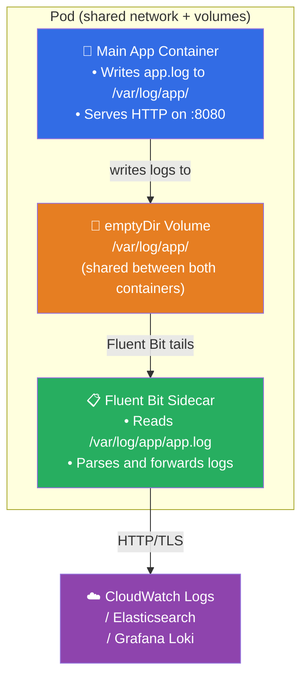
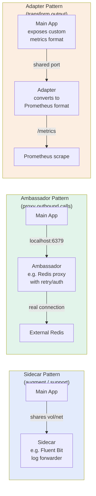
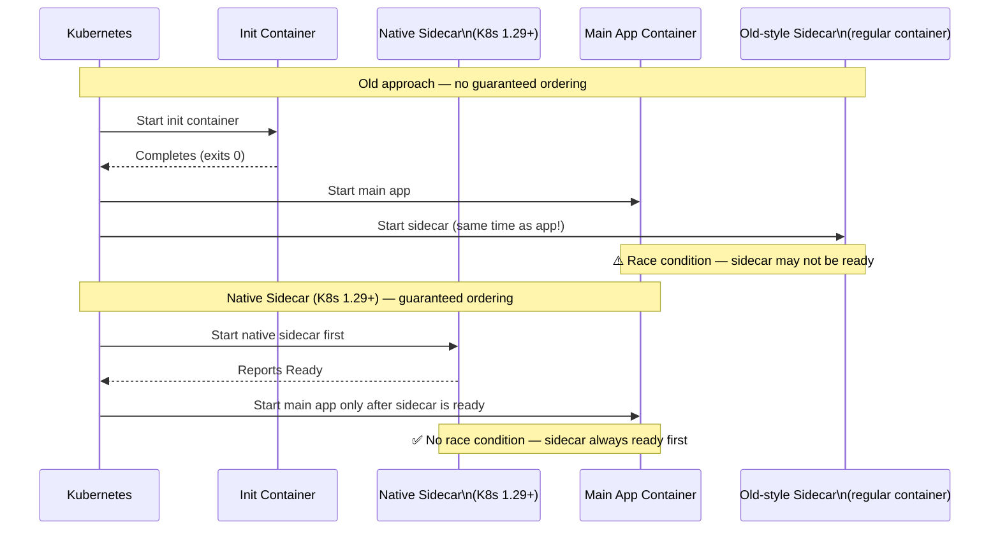
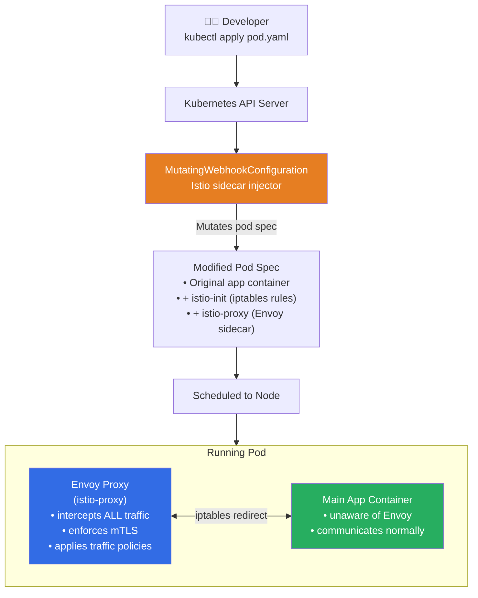

# ☸️ Kubernetes Interview Question 5 — Sidecar Containers


---

## ❓ The Question

> **"What is a sidecar container in Kubernetes? When and why would you use one?"**

**Alternate phrasings you may hear:**
- "How would you implement centralised logging without changing the main application container?"
- "Explain the sidecar pattern in the context of Kubernetes pods."
- "How does Istio inject sidecars, and what do they do?"
- "What is the difference between an init container and a sidecar container?"
- "How do you collect logs from a container that writes to a file instead of stdout?"

---

## 🎯 Why Interviewers Ask This

The sidecar pattern is one of the most widely used multi-container pod designs in production Kubernetes. It demonstrates that you understand the Pod as a unit of composition — not just a single container wrapper. Interviewers use this question to assess:

- **Pod design patterns**: Do you know the three multi-container patterns — sidecar, ambassador, adapter?
- **Separation of concerns**: Can you explain why logging, proxying, and metrics collection belong in sidecars rather than the main app?
- **Real-world tooling**: Can you name actual sidecar implementations — Fluent Bit for logging, Envoy for service mesh, Vault Agent for secrets injection?
- **Native sidecar feature (K8s 1.29+)**: Do you know that Kubernetes now has first-class sidecar support, and why it matters for startup ordering?

> 💡 **Instant win**: Most candidates describe the sidecar as "a helper container in the same pod." You stand out by explaining the **shared namespace** model — sidecar and main container share the same network (same localhost), same storage volumes, and same lifecycle — and by giving concrete examples: Fluent Bit reading logs from a shared `emptyDir`, or Envoy intercepting all inbound/outbound network traffic via iptables rules injected by Istio.

---

## 📖 Key Terminologies

| Term | Meaning |
|---|---|
| **Sidecar container** | An additional container in a Pod that augments or supports the main application container |
| **Pod** | The smallest deployable unit in Kubernetes — one or more containers sharing network and storage namespaces |
| **Shared namespace** | Containers in the same Pod share the same IP address (localhost), same volumes, same IPC namespace |
| **emptyDir** | A temporary shared volume that allows containers in the same Pod to exchange files |
| **Fluent Bit** | Lightweight log forwarder — commonly used as a sidecar to ship logs to CloudWatch, Elasticsearch, Loki, etc. |
| **Envoy** | High-performance proxy — used as a sidecar by Istio for traffic management and mTLS |
| **Istio** | Service mesh that auto-injects an Envoy sidecar into every pod via a MutatingWebhookConfiguration |
| **Init container** | A container that runs to completion **before** app containers start — used for setup/initialisation only |
| **Native sidecar (K8s 1.29+)** | A first-class sidecar defined with `restartPolicy: Always` inside `initContainers` — starts before app containers and runs for the pod's lifetime |
| **Adapter pattern** | A sidecar that transforms the app's output format (e.g., converts proprietary metrics to Prometheus format) |
| **Ambassador pattern** | A sidecar that acts as a proxy to external services (e.g., adding auth headers, retrying failed calls) |

---

## 🗣️ How to Answer (Structured)

**1. Define the sidecar and the shared Pod model:**

> "A sidecar container is a secondary container that runs alongside the main application container inside the same Kubernetes Pod. Because containers in the same Pod share the same network namespace — meaning they communicate over localhost — and the same mounted volumes, a sidecar can observe, extend, or augment the main container without any code changes to the application itself."

**2. Explain the logging use case concretely:**

> "The most common use case I've worked with is centralised logging. Many legacy applications write logs to a file on disk rather than stdout. In Kubernetes, only stdout/stderr logs are captured by the container runtime — file-based logs are invisible to `kubectl logs`. By adding a Fluent Bit sidecar and a shared `emptyDir` volume, the main app writes its log file to the shared volume, and Fluent Bit reads from it and forwards the logs to CloudWatch or Elasticsearch. The application code doesn't change at all — the sidecar absorbs the concern."

**3. Name the three multi-container patterns:**

> "Sidecar is one of three recognised multi-container pod patterns. The **sidecar** augments the main container — logging, metrics, or secrets injection. The **ambassador** proxies outbound connections from the app — for example, adding retry logic or auth headers when calling an external API. The **adapter** transforms the main container's output into a format expected by an external system — like converting app-specific metrics to Prometheus exposition format."

**4. Mention the service mesh connection:**

> "The most sophisticated sidecar deployment is a service mesh like Istio. Istio's control plane uses a MutatingWebhookConfiguration to automatically inject an Envoy proxy sidecar into every pod in labelled namespaces. The Envoy sidecar intercepts all inbound and outbound traffic via iptables rules, enabling mTLS, traffic shaping, circuit breaking, and distributed tracing — completely transparently to the application."

**5. Mention native sidecars (K8s 1.29+):**

> "One historical limitation of the sidecar pattern was startup ordering — if the sidecar wasn't ready before the main app started, there could be a window where logs or traffic were dropped. Kubernetes 1.29 introduced native sidecar support: you declare the sidecar inside `initContainers` with `restartPolicy: Always`, and Kubernetes guarantees it starts before and stays running alongside the main containers for the pod's entire lifetime."

---

## 🔐 Security Perspective (DevSecOps)

| Security Area | Risk | Best Practice |
|---|---|---|
| **Sidecar privilege** | A sidecar with broad permissions running in the same pod can escalate privileges or read app secrets | Apply the same strict `securityContext` to sidecars as to main containers — `runAsNonRoot: true`, `readOnlyRootFilesystem: true` |
| **Shared volume data exposure** | Shared `emptyDir` volumes expose log data (which may include secrets) to all containers in the pod | Ensure log data is sanitised before writing; use `tmpfs` for sensitive shared data |
| **Istio/Envoy sidecar injection** | Auto-injection can be misconfigured, leaving pods without mTLS on sensitive namespaces | Label namespaces with `istio-injection: enabled` and audit with `istioctl analyze` |
| **Sidecar image supply chain** | Third-party sidecar images (Fluent Bit, Envoy) introduce additional container images into your pods | Pin sidecar image versions, run Trivy scans in CI, sign sidecar images with Cosign |
| **Log forwarding credentials** | Fluent Bit sidecars need credentials to ship logs (CloudWatch IAM, Elasticsearch API key) | Use Kubernetes Secrets or IRSA (IAM Roles for Service Accounts) — never hardcode creds in the sidecar config |
| **Resource starvation** | A runaway sidecar can consume CPU/memory that the main app needs | Set explicit `resources.limits` on every sidecar container |

> 🔒 **One-liner**: *"A sidecar shares the pod's network and volumes, which means a compromised or misconfigured sidecar has the same access to localhost endpoints and shared files as the main application. Always apply `readOnlyRootFilesystem: true`, `runAsNonRoot: true`, and explicit resource limits to every sidecar — not just the main container."*

---

## 🖼️ Visuals

### Reference Diagram (Source: KodeKloud)

**Sidecar containers for logging — containers, pods, and log forwarding:**


---

### Sidecar Logging Architecture



---

### Three Multi-Container Pod Patterns



---

### Init Container vs Sidecar vs Native Sidecar



---

### Istio Auto-Inject Sidecar Flow



---

## 📊 Quick Comparison

### Sidecar vs Init Container vs Regular Container

| Feature | Init Container | Sidecar (old-style) | Native Sidecar (K8s 1.29+) |
|---|---|---|---|
| **Runs before app starts** | ✅ Always | ❌ Concurrent with app | ✅ Guaranteed |
| **Runs during app lifetime** | ❌ Exits before app starts | ✅ | ✅ |
| **Restarts with app** | N/A | ✅ (same restart policy) | ✅ (restartPolicy: Always) |
| **Blocks app startup** | ✅ | ❌ | ✅ (waits for ready) |
| **Use case** | One-time setup (migrations, config fetch) | Logging, proxies, metrics | Logging, proxies where ordering matters |
| **API field** | `spec.initContainers` | `spec.containers` | `spec.initContainers` + `restartPolicy: Always` |

---

### Common Sidecar Use Cases

| Pattern | Sidecar Tool | What It Does |
|---|---|---|
| **Logging** | Fluent Bit, Fluentd | Tails log files, parses, forwards to central system |
| **Metrics** | Prometheus exporter | Scrapes app-specific metrics, exposes `/metrics` |
| **Service mesh proxy** | Envoy (Istio/Linkerd) | mTLS, load balancing, circuit breaking, tracing |
| **Secrets injection** | Vault Agent | Fetches secrets from Vault, writes to shared volume |
| **Config sync** | git-sync | Pulls config from Git repo into shared volume |
| **Security scanner** | Falco eBPF probe | Monitors syscalls for anomalous behaviour |
| **Tracing** | Jaeger agent | Collects trace spans and batches to Jaeger collector |

---

## 🛠️ Hands-On: Commands & Syntax

### 1. Fluent Bit sidecar for log forwarding (file → CloudWatch)

```yaml
# pod-with-fluent-bit-sidecar.yaml
apiVersion: v1
kind: Pod
metadata:
  name: app-with-logging
  namespace: production
spec:
  containers:
    # ── Main Application Container ──────────────────────────
    - name: app
      image: myapp:latest
      volumeMounts:
        - name: log-volume
          mountPath: /var/log/app      # app writes logs here
      resources:
        limits:
          cpu: "500m"
          memory: "256Mi"

    # ── Fluent Bit Sidecar ───────────────────────────────────
    - name: fluent-bit
      image: fluent/fluent-bit:3.1     # always pin version
      volumeMounts:
        - name: log-volume
          mountPath: /var/log/app      # same path — reads app's logs
          readOnly: true               # sidecar only reads, never writes
        - name: fluent-bit-config
          mountPath: /fluent-bit/etc
      resources:
        limits:
          cpu: "100m"
          memory: "64Mi"
      securityContext:
        runAsNonRoot: true
        runAsUser: 1000
        readOnlyRootFilesystem: true
        allowPrivilegeEscalation: false

  volumes:
    - name: log-volume
      emptyDir: {}                     # shared between app + sidecar
    - name: fluent-bit-config
      configMap:
        name: fluent-bit-config
```

```yaml
# fluent-bit-configmap.yaml
apiVersion: v1
kind: ConfigMap
metadata:
  name: fluent-bit-config
  namespace: production
data:
  fluent-bit.conf: |
    [SERVICE]
        Flush         5
        Log_Level     info

    [INPUT]
        Name          tail
        Path          /var/log/app/*.log
        Tag           app.*
        Refresh_Interval 5

    [FILTER]
        Name          record_modifier
        Match         app.*
        Record        pod_name ${HOSTNAME}
        Record        namespace production

    [OUTPUT]
        Name          cloudwatch_logs
        Match         app.*
        region        us-east-1
        log_group_name /myapp/production
        log_stream_prefix pod-
        auto_create_group true
```

---

### 2. Native Sidecar (Kubernetes 1.29+)

```yaml
# native-sidecar.yaml — guaranteed startup ordering
apiVersion: v1
kind: Pod
metadata:
  name: app-native-sidecar
spec:
  initContainers:
    # ── Native Sidecar — starts BEFORE main app, runs forever ──
    - name: fluent-bit
      image: fluent/fluent-bit:3.1
      restartPolicy: Always            # ← this makes it a native sidecar
      volumeMounts:
        - name: log-volume
          mountPath: /var/log/app
          readOnly: true
      resources:
        limits:
          cpu: "100m"
          memory: "64Mi"

  containers:
    # ── Main App — starts only AFTER fluent-bit is Ready ────────
    - name: app
      image: myapp:latest
      volumeMounts:
        - name: log-volume
          mountPath: /var/log/app

  volumes:
    - name: log-volume
      emptyDir: {}
```

---

### 3. git-sync sidecar — keep config in sync from Git

```yaml
apiVersion: apps/v1
kind: Deployment
metadata:
  name: nginx-with-git-sync
spec:
  replicas: 2
  selector:
    matchLabels:
      app: nginx
  template:
    metadata:
      labels:
        app: nginx
    spec:
      containers:
        # ── Main Nginx container ────────────────────────────────
        - name: nginx
          image: nginx:1.27-alpine
          volumeMounts:
            - name: html-volume
              mountPath: /usr/share/nginx/html

        # ── git-sync sidecar — pulls updates every 60 seconds ──
        - name: git-sync
          image: registry.k8s.io/git-sync/git-sync:v4.2.1
          env:
            - name: GITSYNC_REPO
              value: https://github.com/myorg/website-content
            - name: GITSYNC_BRANCH
              value: main
            - name: GITSYNC_ROOT
              value: /git
            - name: GITSYNC_PERIOD
              value: 60s
          volumeMounts:
            - name: html-volume
              mountPath: /git
          resources:
            limits:
              cpu: "50m"
              memory: "32Mi"

      volumes:
        - name: html-volume
          emptyDir: {}
```

---

### 4. Vault Agent sidecar — secrets injection

```yaml
# Vault Agent sidecar injects secrets into a shared volume
# (Vault Injector auto-injects this via annotations)
apiVersion: v1
kind: Pod
metadata:
  name: app-with-vault
  annotations:
    vault.hashicorp.com/agent-inject: "true"
    vault.hashicorp.com/role: "myapp"
    vault.hashicorp.com/agent-inject-secret-config.env: "secret/data/myapp/config"
    vault.hashicorp.com/agent-inject-template-config.env: |
      {{- with secret "secret/data/myapp/config" -}}
      export DB_PASSWORD="{{ .Data.data.db_password }}"
      export API_KEY="{{ .Data.data.api_key }}"
      {{- end }}
spec:
  serviceAccountName: myapp-vault-sa   # IRSA or K8s SA bound to Vault role
  containers:
    - name: app
      image: myapp:latest
      command: ["/bin/sh", "-c"]
      args: ["source /vault/secrets/config.env && ./start.sh"]
      volumeMounts:
        - name: vault-secrets
          mountPath: /vault/secrets
          readOnly: true
```

---

### 5. Inspect sidecar containers

```bash
# List all containers in a pod (including sidecars)
kubectl get pod app-with-logging -o jsonpath='{.spec.containers[*].name}'
# app fluent-bit

# View logs of a specific container in a multi-container pod
kubectl logs app-with-logging -c app          # main app logs
kubectl logs app-with-logging -c fluent-bit   # sidecar logs

# Stream logs from a specific sidecar
kubectl logs -f app-with-logging -c fluent-bit

# Exec into the sidecar for debugging
kubectl exec -it app-with-logging -c fluent-bit -- sh

# Check the shared emptyDir volume from main container
kubectl exec -it app-with-logging -c app -- ls /var/log/app

# View all container statuses
kubectl get pod app-with-logging -o jsonpath='{.status.containerStatuses[*].name}'
kubectl describe pod app-with-logging | grep -A3 "Container ID"
```

---

## 🤖 AI & The New Trend (2024–2025)

**Sidecar evolution in modern Kubernetes (2024–2025):**

- **Native sidecar containers went stable (K8s 1.29, 2024)**: The `restartPolicy: Always` field in `initContainers` is now the official way to define sidecars. It solves the historical startup ordering problem and ensures sidecars are properly handled during pod termination (sidecar stops after the main containers stop, not before). This is a significant production reliability improvement.

- **Sidecar-less service meshes (Ambient Mode)**: Istio Ambient mode (GA in Istio 1.22, 2024) replaces per-pod Envoy sidecars with a node-level proxy (ztunnel) plus optional per-namespace L7 waypoint proxies. This reduces per-pod overhead dramatically — no more 100MB Envoy sidecar memory per pod. Linkerd is exploring similar approaches.

- **OpenTelemetry Collector as a sidecar**: In 2024, the CNCF OpenTelemetry project standardised the pattern of running an OTel Collector sidecar alongside application pods to collect traces, metrics, and logs in a single agent — replacing separate Jaeger agent, Prometheus exporter, and Fluent Bit sidecars with one unified collector.

- **AI observability sidecars**: Emerging tools attach lightweight eBPF-based sidecars that use ML models to detect anomalous API call patterns, latency spikes, or memory growth trends in real time — adding observability intelligence without code changes to the application.

---

## ✅ Prerequisites

Before this question, you should be comfortable with:

- **Kubernetes Pod fundamentals**: What a pod is, how containers share network and storage namespaces within a pod
- **kubectl multi-container commands**: `kubectl logs -c <container>`, `kubectl exec -c <container>`
- **Volumes and emptyDir**: How containers in the same pod can share a temporary filesystem (K8s-Q3)
- **ConfigMaps**: How to inject configuration files into containers
- **Basic logging concepts**: What stdout/stderr vs file-based logging means in containerised environments

---

## 📚 Further Reading

- [Kubernetes Docs — Sidecar Containers (K8s 1.29+)](https://kubernetes.io/docs/concepts/workloads/pods/sidecar-containers/)
- [Kubernetes Docs — Init Containers](https://kubernetes.io/docs/concepts/workloads/pods/init-containers/)
- [Fluent Bit — Kubernetes Logging](https://docs.fluentbit.io/manual/installation/kubernetes)
- [Istio — Sidecar Injection](https://istio.io/latest/docs/setup/additional-setup/sidecar-injection/)
- [Istio Ambient Mode — Sidecar-less Service Mesh](https://istio.io/latest/docs/ambient/)
- [Vault Agent Injector](https://developer.hashicorp.com/vault/docs/platform/k8s/injector)
- [git-sync — Kubernetes SIGs](https://github.com/kubernetes/git-sync)
- [OpenTelemetry Collector](https://opentelemetry.io/docs/collector/)

---

## 🔁 Related / Follow-up Questions

1. **"What is the difference between a sidecar container and an init container?"**
   → An init container runs to completion *before* any app containers start — it is used for one-time setup tasks like database migrations, config downloads, or waiting for a dependency. A sidecar runs *alongside* the main container for the pod's entire lifetime. Init containers exit; sidecars keep running.

2. **"How do containers in the same pod communicate with each other?"**
   → They share the same network namespace, so they can communicate over `localhost` with any port. Container A can call Container B on `localhost:8080` directly — no Service or DNS resolution needed. They also share mounted volumes for file-based communication.

3. **"Why would you use a sidecar for logging instead of just shipping logs from the main app?"**
   → Separation of concerns — the application developer shouldn't need to know about the logging infrastructure (CloudWatch vs Elasticsearch vs Loki). The sidecar makes logging a platform concern. It also handles log enrichment, parsing, and buffering without touching application code, and continues working even if the app is updated to a new version.

4. **"How does Istio know which pods to inject sidecars into?"**
   → Istio uses a `MutatingWebhookConfiguration` that intercepts pod creation API calls. If the pod is in a namespace labelled `istio-injection: enabled`, or the pod has the annotation `sidecar.istio.io/inject: "true"`, Istio's sidecar injector mutates the pod spec to add the `istio-proxy` (Envoy) container and an `istio-init` init container that sets up iptables redirect rules.

5. **"What happens to the sidecar when the main container crashes?"**
   → In classic multi-container pods, all containers share the pod's restart policy — if the pod restarts, all containers (including sidecars) restart. With native sidecars (K8s 1.29+), the sidecar has `restartPolicy: Always` independently of the main containers. If the sidecar crashes, it restarts without affecting the main container. If the main container crashes and the pod restarts, the sidecar is guaranteed to be ready before the main container starts again.

6. **"Can a sidecar container access environment variables from the main container?"**
   → No — environment variables are scoped per container. However, containers in the same pod can share data by writing to and reading from a shared volume (emptyDir), or by communicating over localhost. Secrets and ConfigMaps mounted as volumes are accessible to all containers that mount them.

7. **"How would you prevent a sidecar from consuming too many resources?"**
   → Set explicit `resources.requests` and `resources.limits` on the sidecar container. Without limits, a misbehaving Fluent Bit or Envoy sidecar could starve the main application. Also set `--cpu-quota` via cgroups at the OS level if running outside Kubernetes. Monitor sidecar resource usage via `kubectl top pod --containers`.

---

## 📌 30-Second Interview Summary

> **A sidecar container is a secondary container that runs alongside the main application container inside the same Kubernetes Pod. Because containers in the same pod share the same network namespace (localhost) and mounted volumes, a sidecar can observe and extend the main container without any code changes to the application.**
>
> The most common use case is **centralised logging**: the main app writes logs to a file on a shared `emptyDir` volume, and a Fluent Bit sidecar reads from that file and forwards logs to CloudWatch, Elasticsearch, or Grafana Loki. Other use cases include Envoy proxies for service mesh (Istio), Vault Agent for secrets injection, git-sync for config synchronisation, and Prometheus exporters for metrics adaptation.
>
> **Key distinctions**: a sidecar runs for the pod's entire lifetime (unlike init containers, which exit before the app starts). In Kubernetes 1.29+, native sidecar support (`restartPolicy: Always` in `initContainers`) guarantees the sidecar starts and becomes ready *before* the main container — eliminating the startup race condition that plagued classic multi-container pod designs.
>
> In security-conscious environments, always apply the same `securityContext` hardening to sidecars as to main containers — they run in the same trust boundary.
