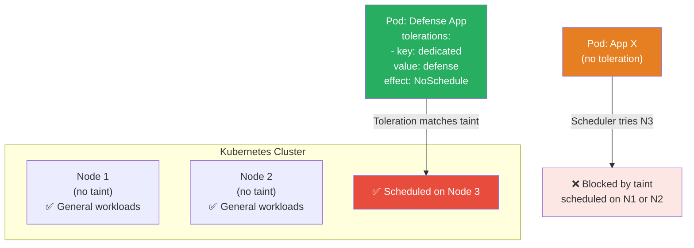
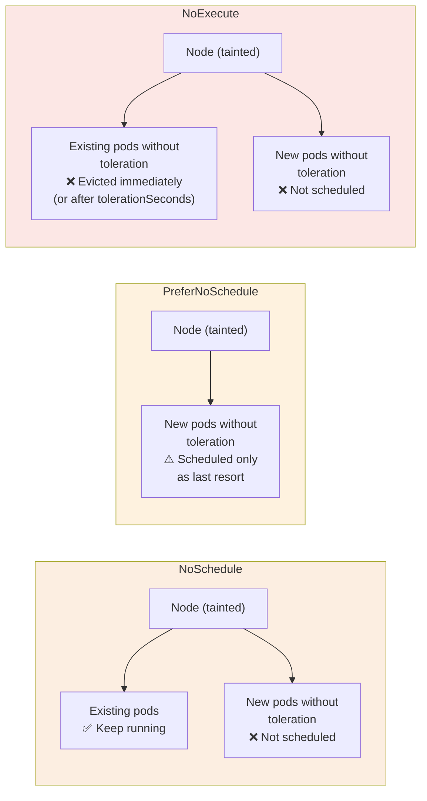
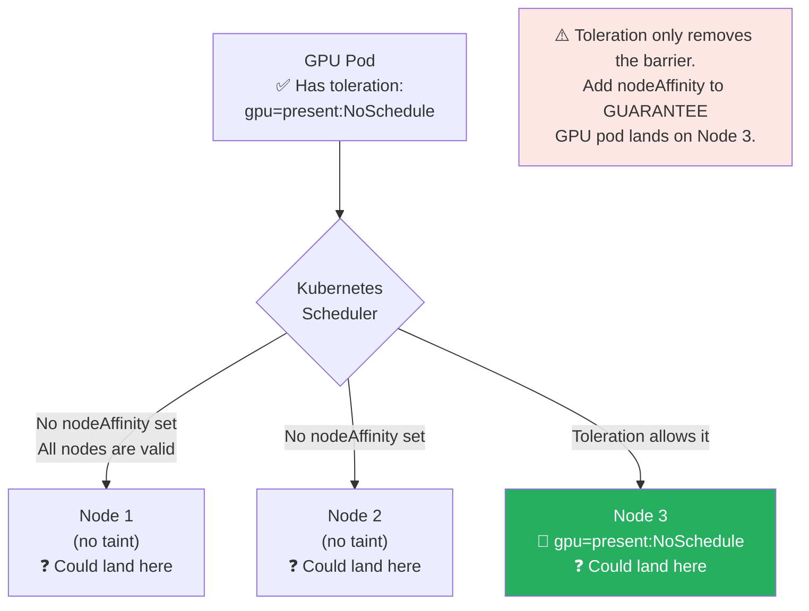
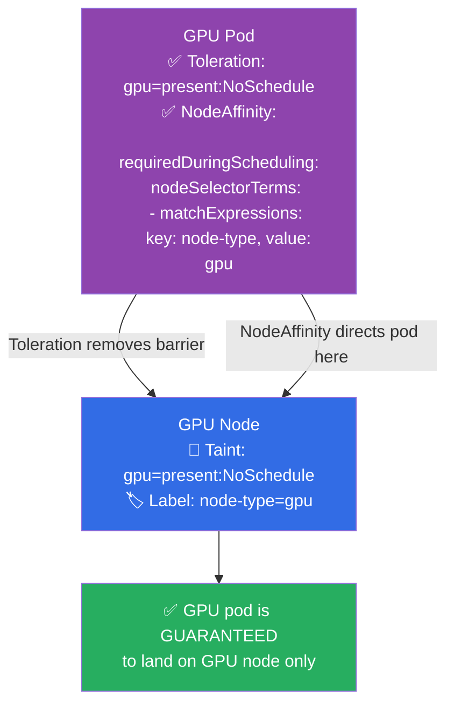

# ☸️ Kubernetes Interview Question 6 — Taints and Tolerations


---

## ❓ The Question

> **"How do you schedule specific pods exclusively on designated nodes in Kubernetes? Explain taints and tolerations."**

**Alternate phrasings you may hear:**
- "What are Kubernetes taints and tolerations, and how do they work together?"
- "How would you dedicate a node to a specific application or team?"
- "What is the difference between `NoSchedule`, `PreferNoSchedule`, and `NoExecute`?"
- "How do you prevent pods from being scheduled on a node during maintenance?"
- "What is the difference between taints/tolerations and node affinity?"

---

## 🎯 Why Interviewers Ask This

Pod scheduling control is a fundamental platform engineering skill. Production clusters almost always have specialised nodes — GPU nodes for ML workloads, high-memory nodes for databases, bare-metal nodes for latency-sensitive apps — and you need a mechanism to ensure the right pods land on the right nodes.

Interviewers ask this to test:

- **Scheduling fundamentals**: Do you understand that the Kubernetes scheduler respects constraints beyond just resource availability?
- **Taint effects knowledge**: Can you distinguish between `NoSchedule` (no new pods), `PreferNoSchedule` (soft rule), and `NoExecute` (evict existing pods)?
- **Real-world patterns**: Do you know the dedicated node pattern, GPU isolation, and maintenance drain pattern?
- **Comparison judgment**: Do you know when to use taints/tolerations vs node affinity vs node selectors — and when to combine them?

> 💡 **Instant win**: Most candidates explain that taints repel pods and tolerations allow pods to bypass taints. You stand out by explaining that **tolerations are permissive, not prescriptive** — a pod with a toleration *can* be scheduled on a tainted node, but it is not *guaranteed* to land there. To guarantee a pod lands on a specific node you must combine tolerations with **node affinity** or **nodeSelector**. Tolerations alone only remove the barrier; they don't direct the pod.

---

## 📖 Key Terminologies

| Term | Meaning |
|---|---|
| **Taint** | A key-value label applied to a node that repels pods which don't explicitly tolerate it |
| **Toleration** | A field in a pod spec that says "I can be scheduled on a node with this taint" |
| **Effect** | The action taken when a pod does not tolerate a taint — `NoSchedule`, `PreferNoSchedule`, or `NoExecute` |
| **NoSchedule** | New pods without a matching toleration will not be scheduled on the tainted node |
| **PreferNoSchedule** | Scheduler tries to avoid placing pods on the node but will if no other options exist |
| **NoExecute** | New pods won't be scheduled AND existing pods without matching toleration are evicted |
| **tolerationSeconds** | Optional field on `NoExecute` toleration — pod is evicted after this many seconds |
| **Node Affinity** | Rules that attract pods to specific nodes based on node labels — complements taints/tolerations |
| **nodeSelector** | Simpler form of node affinity — requires exact label match on the node |
| **Taint key** | The identifier part of a taint — e.g., `dedicated`, `gpu`, `node.kubernetes.io/not-ready` |
| **System taints** | Taints automatically added by Kubernetes — e.g., `node.kubernetes.io/not-ready:NoExecute` |

---

## 🗣️ How to Answer (Structured)

**1. Use the analogy to open:**

> "I like to think of taints and tolerations like a VIP section at a concert. The VIP section has a 'No General Admission' sign — that's the taint. Regular attendees can't enter. But guests with a VIP wristband — that's the toleration — are allowed in. The taint on the node repels all pods by default; only pods with the matching toleration in their spec can be scheduled there."

**2. Define both sides clearly:**

> "A taint is applied to a node using `kubectl taint nodes <node-name> key=value:Effect`. It marks the node as having a special characteristic and repels any pod that doesn't explicitly acknowledge it. A toleration is defined in the pod's spec under `tolerations`. It tells the scheduler that this pod is willing to be placed on a node carrying that specific taint."

**3. Walk through the three effects:**

> "`NoSchedule` is the most common — any new pod without a matching toleration is blocked from being scheduled on that node. Existing pods are not affected. `PreferNoSchedule` is a soft version — the scheduler tries to avoid the node but will use it as a last resort. `NoExecute` is the strictest — it not only blocks new pods but also evicts any existing pods that don't tolerate the taint. This is the effect Kubernetes itself uses when a node becomes unhealthy: it applies `node.kubernetes.io/not-ready:NoExecute` and your pods are evicted unless they have a matching toleration with a `tolerationSeconds` grace period."

**4. Address the key limitation:**

> "One important subtlety: tolerations are permissive, not prescriptive. A toleration removes the barrier — it allows a pod to be scheduled on a tainted node — but it does not guarantee the pod will land there. If I taint node-3 for GPU workloads and add a toleration to my GPU pod, the GPU pod could still land on node-1 or node-2 if the scheduler finds them suitable. To actually pin a pod to a specific node, I combine the toleration with a `nodeSelector` or `nodeAffinity` rule that matches a label on the target node."

**5. Give a real-world scenario:**

> "In my experience, the most common patterns are: first, dedicated nodes for a specific team or application — taint the nodes, add tolerations only to that team's pod templates, and add nodeAffinity to ensure they land there. Second, GPU node isolation — `kubectl taint nodes gpu-node-1 nvidia.com/gpu=present:NoSchedule` ensures only ML workloads with the right toleration consume the expensive GPU instances. Third, node maintenance — `kubectl taint nodes node-1 maintenance=true:NoExecute` immediately evicts all intolerant pods and prevents new scheduling while you patch the node."

---

## 🔐 Security Perspective (DevSecOps)

| Security Area | Risk | Best Practice |
|---|---|---|
| **Workload isolation** | Sensitive workloads (PCI, HIPAA) co-located with general workloads on the same nodes | Taint dedicated compliance nodes; only compliance-certified pods carry the toleration |
| **Overly broad tolerations** | A pod with `operator: Exists` (tolerates ALL taints) can land on any node including restricted ones | Audit pod tolerations with OPA/Kyverno — reject `operator: Exists` without explicit approval |
| **System taint bypass** | A pod tolerating `node.kubernetes.io/not-ready:NoExecute` stays on an unhealthy node longer — may mask issues | Only set `tolerationSeconds` on system taints for critical system pods (DaemonSets); not general workloads |
| **Namespace-level enforcement** | Any developer in any namespace can add a toleration to their pod spec | Use admission controllers (Kyverno/OPA Gatekeeper) to restrict which namespaces can use specific tolerations |
| **Node resource exhaustion** | Tolerated pods pile onto a dedicated node and exhaust resources | Combine taints/tolerations with resource limits and LimitRanges on the namespace |
| **Taint removal** | Accidentally removing a taint opens a restricted node to all pods | Use RBAC to restrict `kubectl taint` to cluster-admin roles only |

> 🔒 **One-liner**: *"Never use `operator: Exists` as a blanket toleration in production pod specs — it tolerates every taint on every node including system taints like `node.kubernetes.io/disk-pressure` and custom security isolation taints, effectively making your pod ignore all scheduling restrictions. Enforce this with a Kyverno ClusterPolicy that denies pods with `operator: Exists` tolerations outside of system namespaces."*

---

## 🖼️ Visuals

### Taint and Toleration — Cluster Scheduling Scenario



---

### Three Taint Effects Compared



---

### Tolerations Are Permissive, Not Prescriptive



---

### Combining Taints + Tolerations + Node Affinity (Best Practice)



---

## 📊 Quick Comparison

### Taint Effects

| Effect | Blocks new pods? | Evicts existing pods? | Softness |
|---|---|---|---|
| **NoSchedule** | ✅ Yes | ❌ No | Hard rule |
| **PreferNoSchedule** | ⚠️ Tries to avoid | ❌ No | Soft / best-effort |
| **NoExecute** | ✅ Yes | ✅ Yes (immediately or after `tolerationSeconds`) | Strictest |

---

### Taints & Tolerations vs Node Affinity vs nodeSelector

| Feature | Taints & Tolerations | Node Affinity | nodeSelector |
|---|---|---|---|
| **Direction** | Node repels pods | Pod attracted to nodes | Pod attracted to nodes |
| **Who sets it** | Cluster admin (on node) | Developer (in pod spec) | Developer (in pod spec) |
| **Strength** | Hard (NoSchedule/NoExecute) or Soft | Hard or Soft (`required`/`preferred`) | Hard only |
| **Handles eviction** | ✅ NoExecute | ❌ | ❌ |
| **Best for** | Dedicated nodes, isolation, maintenance | Workload placement preferences | Simple label matching |
| **Guarantees placement** | ❌ (permissive only) | ✅ (with `required`) | ✅ |
| **Combine for** | Dedicated + guaranteed placement | — | — |

---

## 🛠️ Hands-On: Commands & Syntax

### 1. Apply and inspect taints on nodes

```bash
# Apply a taint to a node
kubectl taint nodes node3 dedicated=defense:NoSchedule

# Apply a NoExecute taint (evicts existing pods too)
kubectl taint nodes node1 maintenance=true:NoExecute

# Apply a GPU taint
kubectl taint nodes gpu-node-1 nvidia.com/gpu=present:NoSchedule

# View taints on all nodes
kubectl describe nodes | grep -A3 Taints
# Or for a specific node:
kubectl describe node node3 | grep Taint
# Taints: dedicated=defense:NoSchedule

# Remove a taint (add minus at the end)
kubectl taint nodes node3 dedicated=defense:NoSchedule-

# Remove all taints with a specific key
kubectl taint nodes node3 dedicated-
```

---

### 2. Add toleration to a Pod spec

```yaml
# defense-pod.yaml — pod that tolerates the dedicated taint
apiVersion: v1
kind: Pod
metadata:
  name: defense-app
  namespace: defense
spec:
  tolerations:
    - key: "dedicated"
      operator: "Equal"        # key=value must match exactly
      value: "defense"
      effect: "NoSchedule"
  containers:
    - name: defense-app
      image: defense-app:latest
      resources:
        limits:
          cpu: "500m"
          memory: "512Mi"
```

---

### 3. Toleration with `Exists` operator (matches any value)

```yaml
# Tolerate the key regardless of its value
tolerations:
  - key: "dedicated"
    operator: "Exists"       # matches dedicated=anything:NoSchedule
    effect: "NoSchedule"

# Tolerate ALL taints on a node (use with extreme caution)
tolerations:
  - operator: "Exists"       # no key specified — matches every taint
```

---

### 4. Guaranteed placement — Toleration + nodeAffinity combined

```yaml
# gpu-workload.yaml — lands ONLY on GPU nodes, guaranteed
apiVersion: apps/v1
kind: Deployment
metadata:
  name: ml-training
spec:
  replicas: 2
  selector:
    matchLabels:
      app: ml-training
  template:
    metadata:
      labels:
        app: ml-training
    spec:
      # Step 1: Toleration removes the NoSchedule barrier on GPU nodes
      tolerations:
        - key: "nvidia.com/gpu"
          operator: "Equal"
          value: "present"
          effect: "NoSchedule"

      # Step 2: NodeAffinity pins the pod to GPU-labelled nodes
      affinity:
        nodeAffinity:
          requiredDuringSchedulingIgnoredDuringExecution:
            nodeSelectorTerms:
              - matchExpressions:
                  - key: node-type
                    operator: In
                    values:
                      - gpu

      containers:
        - name: ml-trainer
          image: pytorch/pytorch:2.3.0-cuda12.1-cudnn8-runtime
          resources:
            limits:
              nvidia.com/gpu: 1        # request 1 GPU
              cpu: "4"
              memory: "16Gi"
```

---

### 5. Node maintenance — cordon, drain, taint

```bash
# ── Method 1: Cordon (soft — no new pods, existing stay) ──
kubectl cordon node1
# node/node1 cordoned
# Effect: node gets taint node.kubernetes.io/unschedulable:NoSchedule

# Uncordon after maintenance
kubectl uncordon node1

# ── Method 2: Drain (evicts all pods, then cordons) ──────
kubectl drain node1 \
  --ignore-daemonsets \        # DaemonSet pods are exempt
  --delete-emptydir-data \     # delete pods using emptyDir
  --grace-period=60            # give pods 60s to terminate gracefully

# After maintenance, uncordon to re-enable scheduling
kubectl uncordon node1

# ── Method 3: Manual NoExecute taint ─────────────────────
kubectl taint nodes node1 maintenance=true:NoExecute
# All pods without matching toleration are evicted immediately
```

---

### 6. NoExecute with `tolerationSeconds` (graceful eviction)

```yaml
# Pod spec — stay on unhealthy node for 300 seconds before eviction
# Useful for critical system pods that need time to gracefully shutdown
tolerations:
  - key: "node.kubernetes.io/not-ready"
    operator: "Exists"
    effect: "NoExecute"
    tolerationSeconds: 300     # evicted after 300s on not-ready node

  - key: "node.kubernetes.io/unreachable"
    operator: "Exists"
    effect: "NoExecute"
    tolerationSeconds: 300
```

---

### 7. Multi-tenant dedicated nodes (team isolation)

```bash
# Label and taint nodes for team-alpha
kubectl label nodes node4 node5 team=alpha
kubectl taint nodes node4 node5 team=alpha:NoSchedule

# Pods in team-alpha namespace get the toleration via a MutatingWebhook
# or directly in their deployment spec:
```

```yaml
# team-alpha deployment
spec:
  template:
    spec:
      tolerations:
        - key: "team"
          operator: "Equal"
          value: "alpha"
          effect: "NoSchedule"
      affinity:
        nodeAffinity:
          requiredDuringSchedulingIgnoredDuringExecution:
            nodeSelectorTerms:
              - matchExpressions:
                  - key: team
                    operator: In
                    values: ["alpha"]
```

---

### 8. View system-managed taints (Kubernetes auto-applies these)

```bash
# These taints are automatically managed by Kubernetes:
# node.kubernetes.io/not-ready:NoExecute         ← node is not ready
# node.kubernetes.io/unreachable:NoExecute        ← node is unreachable
# node.kubernetes.io/memory-pressure:NoSchedule  ← node is low on memory
# node.kubernetes.io/disk-pressure:NoSchedule    ← node is low on disk
# node.kubernetes.io/pid-pressure:NoSchedule     ← node is low on PIDs
# node.kubernetes.io/unschedulable:NoSchedule    ← node is cordoned

# View current taints on all nodes
kubectl get nodes -o custom-columns=\
NAME:.metadata.name,\
TAINTS:.spec.taints
```

---

## 🤖 AI & The New Trend (2024–2025)

**Taints and tolerations in the modern landscape (2024–2025):**

- **Karpenter — taints applied automatically to provisioned nodes (2024)**: AWS Karpenter (now CNCF Incubating) provisions EC2 nodes on demand based on pending pod requirements. When you define a NodePool in Karpenter with `taints`, Karpenter automatically applies those taints to every node it provisions from that pool — meaning dedicated GPU or spot instance node pools with proper isolation are self-managing without any manual `kubectl taint`.

- **Cluster Autoscaler + node groups**: In EKS managed node groups, you can configure taints directly in the Launch Template or via the `eks:node-group` API. These taints are applied automatically to new nodes in the group — useful for maintaining dedicated node group isolation at scale without manual intervention.

- **Kubernetes 1.29+ — Pod Scheduling Readiness**: A new `schedulingGates` field on pods allows pods to declare they are not ready to be scheduled yet — complementing taints/tolerations by letting applications control their own scheduling readiness (e.g., waiting for external provisioning to complete before Kubernetes attempts to schedule them).

- **OPA/Kyverno policies for toleration governance (2024 best practice)**: Teams now enforce toleration policies at the admission layer — only pods in the `gpu-workloads` namespace can carry the `nvidia.com/gpu` toleration; only the `system` namespace can use `operator: Exists`. This prevents unauthorised workloads from bypassing node isolation.

- **AI/ML workload isolation trend**: With the explosion of GPU-intensive AI/ML workloads in 2024–2025, the `nvidia.com/gpu:NoSchedule` taint pattern has become a standard across EKS, GKE, and AKS. NVIDIA's GPU Operator automatically manages this taint on GPU nodes as part of its lifecycle management.

---

## ✅ Prerequisites

Before this question, you should be comfortable with:

- **Kubernetes nodes and pods**: What a node is, how pods are scheduled to nodes by the kube-scheduler
- **Labels and selectors**: How key-value pairs are applied to nodes and pods (taints use the same key-value model)
- **kubectl describe node**: Reading node details including current taints
- **Pod spec structure**: Where `tolerations` and `affinity` fields sit in a pod YAML
- **Node affinity basics**: `requiredDuringScheduling` vs `preferredDuringScheduling`

---

## 📚 Further Reading

- [Kubernetes Docs — Taints and Tolerations](https://kubernetes.io/docs/concepts/scheduling-eviction/taint-and-toleration/)
- [Kubernetes Docs — Node Affinity](https://kubernetes.io/docs/concepts/scheduling-eviction/assign-pod-node/#node-affinity)
- [Kubernetes Docs — Assigning Pods to Nodes](https://kubernetes.io/docs/concepts/scheduling-eviction/assign-pod-node/)
- [Karpenter — Node Pool Taints](https://karpenter.sh/docs/concepts/nodepools/)
- [NVIDIA GPU Operator](https://docs.nvidia.com/datacenter/cloud-native/gpu-operator/latest/index.html)
- [Kyverno — Policy for Tolerations](https://kyverno.io/policies/)
- [kubectl taint reference](https://kubernetes.io/docs/reference/generated/kubectl/kubectl-commands#taint)

---

## 🔁 Related / Follow-up Questions

1. **"What is the difference between taints/tolerations and node affinity?"**
   → Taints are set on nodes and repel pods — they are a push mechanism applied by cluster admins. Node affinity is set on pods and attracts them to specific nodes — it is a pull mechanism applied by developers. Taints handle eviction (`NoExecute`); node affinity does not. For guaranteed dedicated placement, use both together: taint the node to repel everyone else, and add node affinity to the authorised pod to pull it to that specific node.

2. **"How does `kubectl cordon` differ from applying a `NoSchedule` taint manually?"**
   → `kubectl cordon` applies the system taint `node.kubernetes.io/unschedulable:NoSchedule` — it prevents new pod scheduling but does not evict existing pods. `kubectl drain` goes further: it cordons the node AND gracefully evicts all pods. Manually applying a `NoExecute` taint immediately evicts all non-tolerating pods without the graceful eviction workflow drain provides.

3. **"What happens to DaemonSet pods on a tainted node?"**
   → DaemonSet pods are automatically given tolerations for all system taints (`node.kubernetes.io/not-ready`, `unschedulable`, `memory-pressure`, etc.) by the DaemonSet controller. For custom taints, you must explicitly add the toleration to the DaemonSet's pod template — otherwise DaemonSet pods will also be blocked by the custom taint.

4. **"If a node is tainted with `NoExecute`, how do you keep a critical pod running on it anyway?"**
   → Add a toleration to the pod spec for that specific taint with `effect: NoExecute`. Optionally set `tolerationSeconds` to allow a grace period before eviction. This is how system pods (kube-proxy, CoreDNS, CNI plugins) tolerate the `node.kubernetes.io/not-ready:NoExecute` taint and stay on degraded nodes for a configurable window.

5. **"Can a node have multiple taints?"**
   → Yes — a node can have multiple taints with different keys and effects. A pod must have a toleration matching **every** taint on the node to be schedulable there. If a pod tolerates 2 out of 3 taints, the un-tolerated taint's effect still applies. This lets you layer multiple isolation rules on a single node.

6. **"What is `PreferNoSchedule` used for in practice?"**
   → It is a soft version of `NoSchedule` — the scheduler will try to avoid placing pods on the node but will schedule them there as a last resort if no other nodes are available. It is commonly used during pre-maintenance preparation (warning workloads away from a node before full drain) or for marking nodes that are running hot without immediately impacting availability.

---

## 📌 30-Second Interview Summary

> **Taints and tolerations control which pods are allowed to be scheduled on which nodes in Kubernetes.**
>
> A **taint** is applied to a node with `kubectl taint nodes <node> key=value:Effect`. It repels all pods that don't explicitly tolerate it. A **toleration** in a pod's spec says "I acknowledge this taint and can be scheduled on that node."
>
> There are three taint effects: `NoSchedule` blocks new pods; `PreferNoSchedule` is a soft block (scheduler avoids but doesn't enforce); `NoExecute` both blocks new pods and evicts existing ones — useful for node maintenance or when Kubernetes marks a node as unhealthy.
>
> **Critical nuance**: tolerations are permissive, not prescriptive. A pod with a toleration *can* land on a tainted node, but without `nodeAffinity` it might still land elsewhere. To guarantee a pod lands on specific nodes, always combine tolerations with node affinity.
>
> **Common real-world patterns**: GPU node isolation (`nvidia.com/gpu:NoSchedule`), compliance workload dedicated nodes, multi-tenant team isolation, and node maintenance drain (`NoExecute` to evict all pods before patching).
