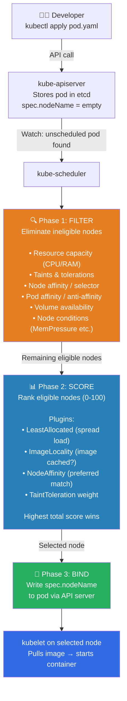
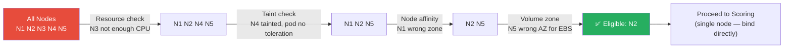
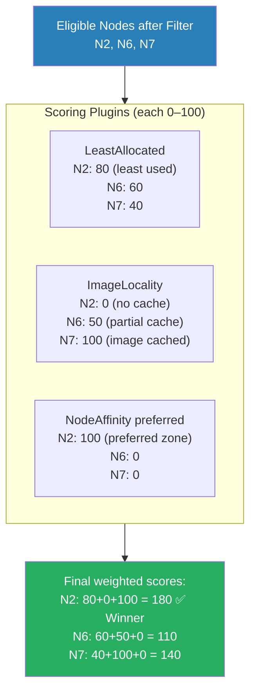
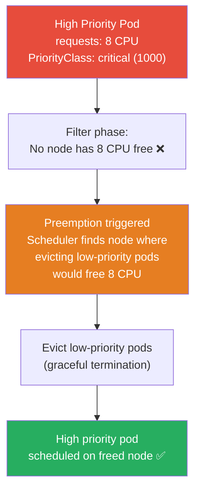

# ☸️ Kubernetes Interview Question 7 — The Kubernetes Scheduler


---

## ❓ The Question

> **"How does the Kubernetes scheduler assign pods to worker nodes? Walk me through the process."**

**Alternate phrasings you may hear:**
- "What happens internally when a pod is created and needs to be scheduled?"
- "How does the scheduler decide which node is best for a pod?"
- "What is the difference between the filtering phase and the scoring phase?"
- "A pod is stuck in `Pending` state. How do you diagnose and fix it?"
- "What is a custom scheduler and when would you use one?"

---

## 🎯 Why Interviewers Ask This

The scheduler is the brain of Kubernetes workload placement. Understanding it demonstrates you can reason about *why* pods land where they do — critical when diagnosing `Pending` pods, designing multi-tenant clusters, or optimising costs with spot/preemptible nodes.

Interviewers ask this to assess:

- **Control plane knowledge**: Do you understand the scheduler's role among the control plane components?
- **Filter & score internals**: Can you name the key filtering constraints and scoring criteria?
- **Operational debugging**: Do you know how to diagnose a pod stuck in `Pending` by reading scheduler events?
- **Advanced scheduling**: Are you aware of the scheduler plugin framework, custom schedulers, and scheduling profiles?

> 💡 **Instant win**: Most candidates describe scheduling as "the scheduler picks the best node." You stand out by walking through the **three concrete phases** — Filter (eliminate ineligible nodes), Score (rank remaining nodes), Bind (write the nodeName to the pod spec via the API server) — and explaining that the scheduler watches the API server for unscheduled pods (those with no `nodeName`) rather than being pushed work. This control-loop design is the same pattern used by all Kubernetes controllers.

---

## 📖 Key Terminologies

| Term | Meaning |
|---|---|
| **kube-scheduler** | The control plane component responsible for assigning pods to nodes |
| **Scheduling cycle** | The end-to-end process: watch unbound pod → filter → score → bind |
| **Binding** | Writing the selected `nodeName` into the pod's spec via the API server |
| **Filter phase** | Eliminates nodes that cannot run the pod (resource, taints, affinity constraints) |
| **Score phase** | Ranks remaining nodes on a 0-100 scale; highest score wins |
| **Plugin framework** | Extension points in the scheduler (PreFilter, Filter, Score, Bind, etc.) — pluggable since K8s 1.19 |
| **Scheduling profile** | A named set of plugins — allows multiple schedulers to coexist or one scheduler to behave differently per pod |
| **PriorityClass** | Assigns a priority number to pods — higher priority pods preempt lower priority ones |
| **Preemption** | If no node can fit a high-priority pod, the scheduler evicts lower-priority pods to make room |
| **Node pressure** | When a node runs low on memory, CPU, or disk — adds system taints to prevent scheduling |
| **Pod disruption budget (PDB)** | Minimum availability constraint — scheduler and draining tools respect PDBs during eviction |
| **QoS class** | Burstable / Guaranteed / BestEffort — affects which pods are evicted first under pressure |

---

## 🗣️ How to Answer (Structured)

**1. Set the context — where the scheduler sits:**

> "The kube-scheduler is one of the core control plane components, running alongside the API server, controller manager, and etcd. It is responsible for one specific job: watching the Kubernetes API server for pods that have been created but have no `nodeName` assigned yet — those are unscheduled pods — and then deciding which node each pod should run on."

**2. Explain the watch-based trigger:**

> "The scheduler doesn't get pushed work. It runs a control loop that watches the API server. When a new pod appears without a `spec.nodeName`, the scheduler picks it up and begins the scheduling cycle. This is the same event-driven reconciliation pattern that all Kubernetes controllers use."

**3. Walk through the three phases — Filter, Score, Bind:**

> "The scheduling cycle has three phases. First, **Filtering**: the scheduler takes the full list of nodes and eliminates any that cannot run this pod. Filtering checks resource capacity (does the node have enough CPU and memory to satisfy the pod's requests?), taints and tolerations, node affinity and node selector rules, pod affinity and anti-affinity, and whether any volume the pod needs can be attached to that node. Nodes that fail any filter are removed from consideration.
>
> Second, **Scoring**: the remaining nodes are each given a score from 0 to 100 based on multiple criteria. Common scoring plugins favour nodes that are least loaded (to spread workloads), nodes that already have the required container image cached (to avoid a slow pull), and nodes that match preferred affinity rules. The scores from all active plugins are summed with weights, and the node with the highest total score is selected.
>
> Third, **Binding**: the scheduler writes the selected node's name into the pod's `spec.nodeName` field via the API server. The kubelet on the selected node sees the update and begins pulling the container image and starting the pod."

**4. Mention real-time node metadata:**

> "The scheduler always has up-to-date information because every kubelet continuously reports node health and resource usage to the API server. The scheduler reads this live data — current CPU and memory consumed, conditions like `MemoryPressure` or `DiskPressure`, and the list of currently scheduled pods with their resource requests — to accurately assess each node's available capacity before scoring."

**5. Close with preemption:**

> "If the scheduler cannot find any node that passes filtering — for example, no node has enough memory for a high-priority ML training pod — it can trigger preemption. It selects a node where evicting one or more lower-priority pods would free enough resources, evicts those pods, and schedules the high-priority pod in their place."

---

## 🔐 Security Perspective (DevSecOps)

| Security Area | Risk | Best Practice |
|---|---|---|
| **Priority class abuse** | A developer creates a high `PriorityClass` and evicts production workloads | Restrict `PriorityClass` creation to cluster-admins via RBAC; define a max priority per namespace using LimitRange or OPA |
| **Scheduler impersonation** | A malicious actor writes directly to `spec.nodeName` — bypassing scheduler filters entirely | Use admission webhooks (OPA/Kyverno) to reject pods with `spec.nodeName` pre-set; only the scheduler should set this field |
| **Uncontrolled scheduling** | Pods without resource requests/limits land on any node — can cause noisy-neighbour resource exhaustion | Enforce `resources.requests` and `resources.limits` via LimitRange in every namespace |
| **Sensitive workload placement** | PCI/HIPAA workloads co-located with general workloads on same nodes | Use taints + node affinity to isolate sensitive nodes; the scheduler then cannot place general pods there (K8s-Q6) |
| **Custom scheduler privilege** | A custom scheduler running in-cluster needs RBAC to write `bindings` and `events` | Grant the minimum required roles — only `create` on `pods/binding` and `create` on `events` |

> 🔒 **One-liner**: *"Never allow developers to set `spec.nodeName` directly in pod manifests — it bypasses every scheduler filter including taints, node affinity, and resource checks. Enforce this with an admission policy that rejects any pod with a pre-set `spec.nodeName`."*

---

## 🖼️ Visuals

### Full Scheduling Cycle — End to End



---

### Filter Phase — Nodes Eliminated Step by Step



---

### Score Phase — Ranking Eligible Nodes



---

### Preemption Flow



---

## 📊 Quick Comparison

### Key Filter Plugins (Phase 1)

| Filter Plugin | What it checks |
|---|---|
| **NodeResourcesFit** | Node has enough CPU, memory, ephemeral storage for pod requests |
| **TaintToleration** | Pod tolerates all node taints |
| **NodeAffinity** | Node matches pod's `requiredDuringScheduling` node affinity rules |
| **PodAffinity** | Co-location or anti-affinity rules with other pods |
| **NodeUnschedulable** | Node is not cordoned (`spec.unschedulable: false`) |
| **VolumeBinding** | Required PVCs can be satisfied on this node (zone matching) |
| **NodePorts** | Required host ports are available on the node |

---

### Key Score Plugins (Phase 2)

| Score Plugin | What it favours |
|---|---|
| **LeastAllocated** | Nodes with most remaining CPU/memory (spreads load) |
| **MostAllocated** | Nodes with least remaining resources (bin-packing — cost saving) |
| **ImageLocality** | Nodes that already have the container image cached |
| **NodeAffinity** | Nodes matching `preferredDuringScheduling` affinity rules |
| **TaintToleration** | Nodes with fewer taints that match pod tolerations |
| **InterPodAffinity** | Nodes near (or away from) specified other pods |

---

## 🛠️ Hands-On: Commands & Syntax

### 1. Diagnose a pod stuck in Pending

```bash
# Step 1 — confirm pod is Pending
kubectl get pod my-pod -n production
# NAME      READY   STATUS    RESTARTS   AGE
# my-pod    0/1     Pending   0          5m

# Step 2 — read scheduler events on the pod
kubectl describe pod my-pod -n production
# Events:
#   Warning  FailedScheduling  ...  0/5 nodes are available:
#   2 Insufficient cpu,
#   2 node(s) had untolerated taint {dedicated: gpu},
#   1 node(s) didn't match Pod's node affinity/selector.

# Step 3 — check node resource availability
kubectl top nodes
kubectl describe nodes | grep -A5 "Allocated resources"

# Step 4 — check if PVC is bound (volume scheduling issue)
kubectl get pvc -n production
# If Pending → StorageClass or zone mismatch
```

---

### 2. View scheduler logs (control plane)

```bash
# View kube-scheduler logs (if scheduler runs as a pod)
kubectl logs -n kube-system -l component=kube-scheduler --tail=100

# On kubeadm clusters
kubectl logs -n kube-system kube-scheduler-<master-node> --tail=50 | grep -i "error\|warn\|pod"

# Increase scheduler verbosity (for debugging)
# Edit kube-scheduler manifest: /etc/kubernetes/manifests/kube-scheduler.yaml
# Add to command args: --v=4
```

---

### 3. PriorityClass — control pod preemption

```yaml
# high-priority-class.yaml
apiVersion: scheduling.k8s.io/v1
kind: PriorityClass
metadata:
  name: high-priority
value: 1000              # higher number = higher priority
globalDefault: false
preemptionPolicy: PreemptLowerPriority   # default — can evict lower pods
description: "Critical production workloads"

---
# low-priority-class.yaml
apiVersion: scheduling.k8s.io/v1
kind: PriorityClass
metadata:
  name: low-priority
value: 100
preemptionPolicy: Never   # will not evict others, but can itself be evicted
description: "Batch/background jobs"
```

```yaml
# pod using a PriorityClass
spec:
  priorityClassName: high-priority
  containers:
    - name: app
      image: myapp:latest
```

---

### 4. Pod Affinity and Anti-Affinity (scoring influence)

```yaml
# Place pod on same node as pods labelled app=cache (affinity)
# AND ensure no two replicas on the same node (anti-affinity)
spec:
  affinity:
    podAffinity:
      requiredDuringSchedulingIgnoredDuringExecution:
        - labelSelector:
            matchExpressions:
              - key: app
                operator: In
                values: ["cache"]
          topologyKey: kubernetes.io/hostname   # same node

    podAntiAffinity:
      preferredDuringSchedulingIgnoredDuringExecution:
        - weight: 100
          podAffinityTerm:
            labelSelector:
              matchExpressions:
                - key: app
                  operator: In
                  values: ["api"]
            topologyKey: kubernetes.io/hostname  # spread across nodes
```

---

### 5. Topology Spread Constraints (even distribution)

```yaml
# Spread pods evenly across availability zones
spec:
  topologySpreadConstraints:
    - maxSkew: 1                              # max difference in pod count between zones
      topologyKey: topology.kubernetes.io/zone
      whenUnsatisfiable: DoNotSchedule        # hard constraint
      labelSelector:
        matchLabels:
          app: api
    - maxSkew: 2
      topologyKey: kubernetes.io/hostname     # also spread across nodes
      whenUnsatisfiable: ScheduleAnyway       # soft constraint
      labelSelector:
        matchLabels:
          app: api
```

---

### 6. Multiple scheduler profiles (K8s 1.18+)

```yaml
# kube-scheduler-config.yaml — two profiles in one scheduler binary
apiVersion: kubescheduler.config.k8s.io/v1
kind: KubeSchedulerConfiguration
profiles:
  - schedulerName: default-scheduler
    plugins:
      score:
        enabled:
          - name: NodeResourcesLeastAllocated  # spread by default
            weight: 1

  - schedulerName: bin-pack-scheduler          # separate profile for batch jobs
    plugins:
      score:
        disabled:
          - name: NodeResourcesLeastAllocated
        enabled:
          - name: NodeResourcesMostAllocated   # pack tightly to save cost
            weight: 1
```

```yaml
# Pod that uses the bin-pack scheduler profile
spec:
  schedulerName: bin-pack-scheduler   # opt-in to specific profile
  containers:
    - name: batch-job
      image: batch:latest
```

---

### 7. Manually assign a pod to a node (bypass scheduler)

```yaml
# For debugging or emergency — sets nodeName directly
# ⚠️ Bypasses ALL scheduler filters — use only for troubleshooting
spec:
  nodeName: node2         # pod goes directly to node2, no scheduling
  containers:
    - name: debug
      image: busybox
      command: ["sleep", "3600"]
```

```bash
# Check which node a pod is assigned to
kubectl get pod my-pod -o jsonpath='{.spec.nodeName}'

# Check what resource requests are causing Pending
kubectl get pod my-pod -o jsonpath='{.spec.containers[*].resources}'
```

---

### 8. ResourceQuota — namespace-level scheduling guardrails

```yaml
# Prevent pods from consuming excessive cluster resources
apiVersion: v1
kind: ResourceQuota
metadata:
  name: production-quota
  namespace: production
spec:
  hard:
    requests.cpu: "20"
    requests.memory: "40Gi"
    limits.cpu: "40"
    limits.memory: "80Gi"
    pods: "50"
    count/deployments.apps: "20"
```

---

## 🤖 AI & The New Trend (2024–2025)

**Scheduler evolution in modern Kubernetes (2024–2025):**

- **Karpenter — reactive node provisioning (CNCF Incubating, 2024)**: Rather than choosing among existing nodes, Karpenter works alongside the scheduler to provision brand-new EC2 nodes in response to pending pods — selecting optimal instance types using ML-driven bin-packing. Karpenter watches for pods that the scheduler marked as unschedulable (no node passed filtering) and provisions a right-sized node for exactly those pods, then the scheduler reschedules them. This makes the "scheduling = choosing from existing nodes" model feel legacy.

- **Descheduler — proactive rebalancing (CNCF Sandbox → 2024)**: While kube-scheduler places pods when they're first created, the Descheduler periodically re-evaluates whether existing pod placements are still optimal and evicts pods to let them be rescheduled better. Useful after cluster scale-up (hot pods on old nodes, new nodes empty) or after policy changes.

- **Scheduler Plugin Framework maturity**: The `scheduling.k8s.io/v1` config API is stable. Teams now write custom scheduling plugins as Go plugins loaded into the scheduler binary — for example, priority plugins that factor in cloud spot instance pricing or carbon intensity of cloud regions (green scheduling).

- **Topology-aware scheduling for AI workloads**: In 2024–2025, scheduler extensions for GPU topology awareness (NVLink, NUMA nodes) ensure that multi-GPU training pods land on nodes where GPUs are connected via fast NVLink fabric — a pure scheduling optimisation that can 2–3x training throughput without any code changes.

---

## ✅ Prerequisites

Before this question, you should be comfortable with:

- **Kubernetes control plane**: What kube-apiserver, etcd, controller-manager, and kube-scheduler each do
- **Pod resource requests and limits**: The difference between `requests` (used for scheduling) and `limits` (used for enforcement)
- **Taints and tolerations**: Filter phase checks these (K8s-Q6)
- **Node labels**: Scheduler uses them for affinity and topology spread
- **kubectl describe pod**: Reading pod Events to find scheduling failure reasons

---

## 📚 Further Reading

- [Kubernetes Docs — Kubernetes Scheduler](https://kubernetes.io/docs/concepts/scheduling-eviction/kube-scheduler/)
- [Kubernetes Docs — Scheduler Configuration](https://kubernetes.io/docs/reference/scheduling/config/)
- [Kubernetes Docs — Pod Priority and Preemption](https://kubernetes.io/docs/concepts/scheduling-eviction/pod-priority-preemption/)
- [Kubernetes Docs — Topology Spread Constraints](https://kubernetes.io/docs/concepts/workloads/pods/pod-topology-spread-constraints/)
- [Scheduler Plugin Framework — SIG Scheduling](https://kubernetes.io/docs/concepts/scheduling-eviction/scheduling-framework/)
- [Karpenter — Node Auto-Provisioning](https://karpenter.sh/)
- [Descheduler — CNCF Project](https://github.com/kubernetes-sigs/descheduler)

---

## 🔁 Related / Follow-up Questions

1. **"What is the difference between `requests` and `limits` in the context of scheduling?"**
   → The scheduler uses `requests` to determine node fit — it subtracts the sum of all pods' requests from the node's total capacity to determine available headroom. `limits` are not used for scheduling decisions; they are enforced at runtime by the container runtime (cgroups). A pod with no `requests` set is treated as requesting zero resources, so it can land anywhere — but it may also be the first evicted under memory pressure.

2. **"Why would a pod stay in `Pending` even when there appear to be available nodes?"**
   → Common causes: resource requests exceed per-node capacity, a `requiredDuringScheduling` node affinity rule matches no nodes, a taint on all suitable nodes has no matching toleration, the required PVC is in a different availability zone than the available nodes (`WaitForFirstConsumer` StorageClass issue), or the namespace `ResourceQuota` for CPU or memory is exhausted.

3. **"What is preemption and how does it work?"**
   → Preemption is triggered when a high-priority pod cannot be scheduled because no node passes the filter phase. The scheduler searches for a node where evicting one or more lower-priority pods would free enough resources to fit the high-priority pod. It evicts those pods gracefully (honouring termination grace periods and PodDisruptionBudgets), then binds the high-priority pod to that node.

4. **"What is the difference between `requiredDuringSchedulingIgnoredDuringExecution` and `preferredDuringScheduling`?"**
   → `requiredDuringScheduling` is a hard constraint — if no node satisfies it, the pod stays in Pending forever. It is checked in the **Filter** phase. `preferredDuringScheduling` is a soft constraint — nodes matching it score higher in the **Score** phase, but the pod will still be scheduled even if no preferred node is available.

5. **"How do Topology Spread Constraints relate to pod anti-affinity?"**
   → Both distribute pods across nodes, but in different ways. Pod anti-affinity says "don't schedule this pod on a node that already has a pod with label X." Topology Spread Constraints say "spread pods such that the difference in count across zones/nodes is no more than `maxSkew`." TSC is more flexible — it works at any topology level (zone, node, rack) and handles skew rather than binary allow/deny.

6. **"Can a pod specify which scheduler to use?"**
   → Yes — set `spec.schedulerName` to the name of a custom scheduler or a scheduler profile. If the field is omitted, `default-scheduler` is used. Pods with a non-existent `schedulerName` stay in Pending forever because no scheduler picks them up.

7. **"What does the kubelet do after the scheduler assigns a nodeName?"**
   → The kubelet on the selected node watches the API server for pods assigned to its node. When it sees a pod with its node's name, it: checks whether the container images are already cached (pulls if not), sets up volumes and mounts, creates the network namespace, and instructs the container runtime (containerd/CRI-O) to start the containers. It then reports pod status back to the API server.

---

## 📌 30-Second Interview Summary

> **The Kubernetes scheduler is a control plane component that watches the API server for pods with no `spec.nodeName` — unscheduled pods — and assigns each one to the most suitable worker node.**
>
> The scheduling cycle has three phases:
> 1. **Filter**: Eliminate nodes that cannot run the pod. Checks include resource capacity (CPU/memory requests), taints and tolerations, node and pod affinity rules, volume availability, and node health conditions.
> 2. **Score**: Rank the remaining eligible nodes from 0–100. Plugins favour least-loaded nodes (LeastAllocated), nodes with the image already cached (ImageLocality), and nodes matching preferred affinity rules. Highest total score wins.
> 3. **Bind**: Write the winning node's name into `spec.nodeName` via the API server. The kubelet on that node then starts the pod.
>
> Every worker node's kubelet continuously reports health and resource metrics to the API server, giving the scheduler real-time data for accurate filtering and scoring.
>
> If no node passes filtering for a high-priority pod, **preemption** kicks in — lower-priority pods are evicted from a candidate node to make room. If a pod stays in `Pending`, always start with `kubectl describe pod` → Events section to read the exact scheduler rejection reason.
