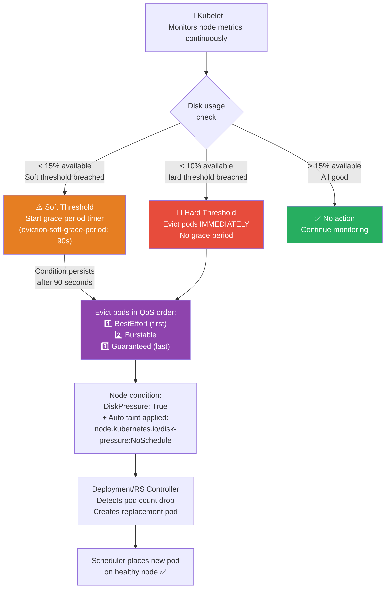
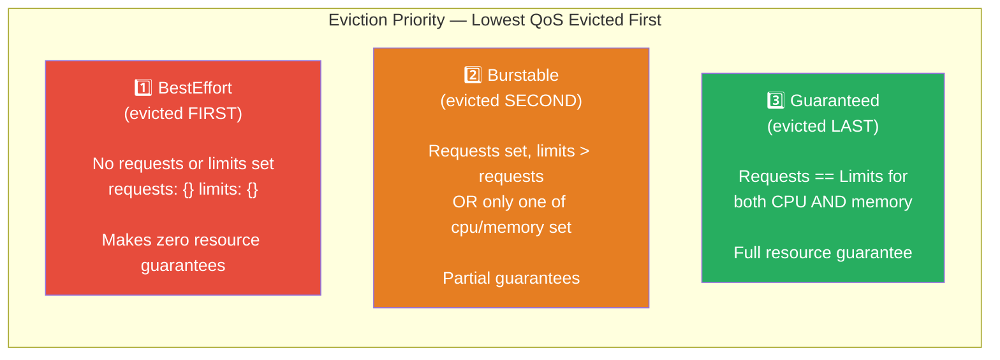
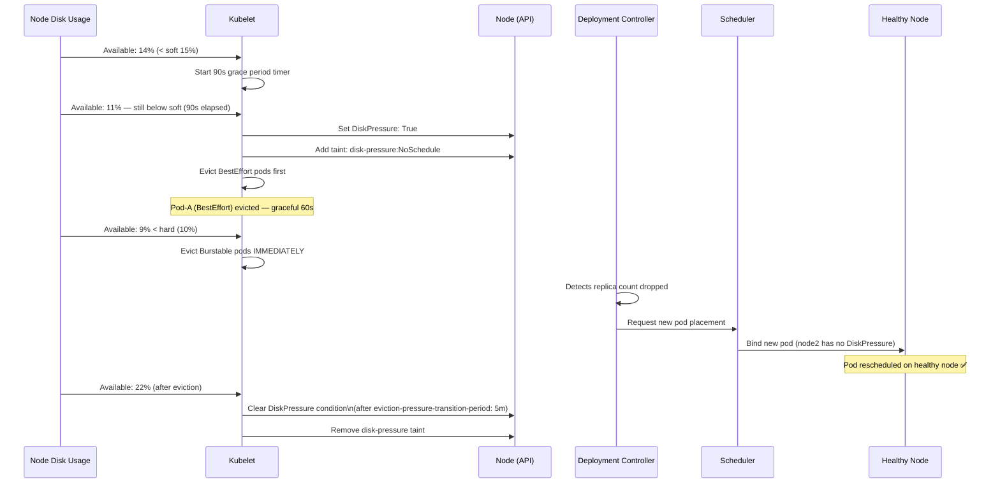

# ☸️ Kubernetes Interview Question 8 — Pod Eviction & Disk Space Management


---

## ❓ The Question

> **"In a 10-node Kubernetes cluster where each node has 500 GB of disk, if one node reaches 85% disk utilization, can Kubernetes automatically evict pods and redeploy them on a healthier node?"**

**Alternate phrasings you may hear:**
- "What happens when a Kubernetes node runs out of disk space?"
- "How does the kubelet detect and respond to resource pressure?"
- "What is the difference between eviction hard and eviction soft thresholds?"
- "In what order does Kubernetes evict pods when a node is under pressure?"
- "What is a QoS class in Kubernetes and how does it affect eviction priority?"

---

## 🎯 Why Interviewers Ask This

This is a practical operations question that tests your understanding of how Kubernetes self-heals under resource pressure. Interviewers use it to assess:

- **Kubelet internals**: Do you know that the kubelet — not the control plane — monitors node resources and triggers eviction?
- **Eviction threshold knowledge**: Can you explain hard vs soft thresholds and why both exist?
- **QoS class understanding**: Do you know that BestEffort pods are evicted first and Guaranteed pods last?
- **Operational awareness**: Do you understand that eviction is a symptom, not a fix — and that monitoring must catch the underlying cause?

> 💡 **Instant win**: Most candidates say "yes, Kubernetes evicts the pods." You stand out by explaining the full chain: kubelet detects threshold breach → adds `DiskPressure` condition to the node → automatically taints the node with `node.kubernetes.io/disk-pressure:NoSchedule` → evicts pods in QoS order (BestEffort first, then Burstable, then Guaranteed) → evicted pods are rescheduled by their Deployment/ReplicaSet controller on another node, **not** by the kubelet itself.

---

## 📖 Key Terminologies

| Term | Meaning |
|---|---|
| **Kubelet** | The node agent that runs on every worker node; monitors resources and enforces eviction |
| **Eviction** | Graceful termination of a pod to reclaim resources on a pressured node |
| **Eviction hard threshold** | Absolute limit — kubelet evicts pods immediately when breached, no grace period |
| **Eviction soft threshold** | Warning level — kubelet waits for the configured grace period before evicting |
| **eviction-soft-grace-period** | Time the kubelet waits after a soft threshold breach before starting eviction |
| **QoS class** | Quality of Service classification based on resource requests/limits: Guaranteed, Burstable, BestEffort |
| **Node condition** | Status reported by kubelet: `MemoryPressure`, `DiskPressure`, `PIDPressure`, `Ready` |
| **Node pressure taint** | Auto-applied taint when a condition is true: `node.kubernetes.io/disk-pressure:NoSchedule` |
| **nodefs** | The node's primary filesystem (where kubelet data, container logs live) |
| **imagefs** | The filesystem used by the container runtime for image/container layers |
| **eviction-pressure-transition-period** | How long a node must be out of pressure before the condition is cleared (prevents flapping) |
| **Pod disruption budget (PDB)** | Minimum available pod count — eviction respects PDBs to protect critical workloads |

---

## 🗣️ How to Answer (Structured)

**1. Confirm: yes, Kubernetes handles this automatically:**

> "Yes — Kubernetes can automatically evict pods from a node experiencing high disk utilization and those pods will be rescheduled on healthier nodes. This is managed by the kubelet, the node agent, not the central control plane."

**2. Explain the kubelet's monitoring role:**

> "Every worker node runs a kubelet that continuously monitors local resource metrics — available memory, available disk on the node filesystem and image filesystem, free inodes, and PID count. When any of these metrics breach a configured threshold, the kubelet takes action."

**3. Walk through hard vs soft thresholds:**

> "There are two categories of thresholds. Hard thresholds trigger immediate eviction with no grace period — for example, if `nodefs.available` drops below 10%, the kubelet starts evicting pods right away. Soft thresholds trigger a warning and start a grace period timer — for example, if disk drops below 15%, the kubelet waits 90 seconds for the condition to self-resolve before beginning eviction. Soft thresholds are useful for transient spikes; hard thresholds protect against catastrophic node saturation."

**4. Explain the node condition and taint:**

> "When a threshold is breached, the kubelet sets a node condition — `DiskPressure: True` in our disk example. Kubernetes then automatically adds a taint `node.kubernetes.io/disk-pressure:NoSchedule` to the node, which prevents new pods from being scheduled there. Existing pods that don't tolerate this taint are evicted."

**5. Explain QoS eviction order:**

> "The kubelet uses Quality of Service classes to determine which pods to evict first. BestEffort pods — those with no resource requests or limits set — are evicted first because they made no guarantees. Next are Burstable pods — those with requests set but limits exceeding requests. Finally, Guaranteed pods — those where requests equal limits — are the last to be evicted and only when absolutely necessary. Within each class, pods consuming the most resources relative to their requests are evicted first."

**6. Clarify that rescheduling is done by the controller, not the kubelet:**

> "One important clarification: the kubelet evicts the pod, but it does not reschedule it. The Deployment or ReplicaSet controller watching the API server notices that the pod count has dropped below the desired replica count and creates a new pod, which the scheduler then places on a healthy node."

---

## 🔐 Security Perspective (DevSecOps)

| Security Area | Risk | Best Practice |
|---|---|---|
| **Eviction as an attack vector** | An attacker who can fill a node's disk can trigger evictions of all pods on that node (denial of service) | Set pod ephemeral storage limits; monitor for abnormal write patterns with Falco |
| **Eviction of security-critical pods** | A monitoring or security agent (Falco, Datadog) could be evicted under pressure, creating a blind spot | Give security DaemonSet pods `Guaranteed` QoS (requests == limits) to be last evicted |
| **Log volume exhaustion** | Containers writing excessive logs fill nodefs — the most common real-world cause of DiskPressure | Set log rotation in the container runtime (`log-driver: json-file`, `max-size: 10m`, `max-file: 3`) |
| **Ephemeral storage limits** | Pods without `ephemeral-storage` limits can consume unlimited nodefs space | Set `resources.limits.ephemeral-storage` on every pod; enforce via LimitRange |
| **Audit logs during eviction** | If API server audit logging is on the same disk as nodefs, heavy logging can trigger eviction of critical pods | Store audit logs on a separate filesystem (`imagefs`) or ship directly to an external log aggregator |
| **PDB bypass during eviction** | Kubelet eviction does NOT respect PodDisruptionBudgets — it evicts regardless | Ensure critical apps have Guaranteed QoS rather than relying on PDB for eviction protection |

> 🔒 **One-liner**: *"The most reliable way to protect a critical pod from eviction is to give it `Guaranteed` QoS by setting `resources.requests` equal to `resources.limits` for both CPU and memory — Guaranteed pods are the absolute last to be evicted, regardless of disk or memory pressure on the node."*

---

## 🖼️ Visuals

### Reference Diagrams (Source: KodeKloud)

**The interview question — managing disk space in a 10-node cluster:**


**Node eviction scenario — Node 1 at 85% capacity triggers eviction, pods move to Node 2:**


---

### Kubelet Eviction Flow — Hard & Soft Thresholds



---

### QoS Classes and Eviction Order



---

### Full Disk Pressure Lifecycle



---

## 📊 Quick Comparison

### Hard vs Soft Eviction Thresholds

| Feature | Hard Threshold | Soft Threshold |
|---|---|---|
| **Eviction timing** | Immediate — no grace period | After `eviction-soft-grace-period` expires |
| **Pod grace period** | Still honours pod's `terminationGracePeriodSeconds` | Configurable up to `eviction-max-pod-grace-period` |
| **Use case** | Prevent catastrophic node failure | Handle transient spikes gracefully |
| **Node condition added** | ✅ Same conditions | ✅ Same conditions |
| **Default hard (memory)** | `memory.available < 100Mi` | Not set by default |
| **Default hard (disk)** | `nodefs.available < 10%` | Not set by default |

---

### QoS Classes — How Kubernetes Assigns Them

| QoS Class | Condition | Eviction order | Example |
|---|---|---|---|
| **Guaranteed** | CPU & memory: `requests == limits` | Last | Database, security agents |
| **Burstable** | CPU or memory: `requests < limits`, or only one set | Second | Most typical microservices |
| **BestEffort** | No `requests` or `limits` set at all | First | Dev/test throwaway pods |

---

### Eviction Signals Reference

| Signal | Description | Hard default |
|---|---|---|
| `memory.available` | Available memory on the node | `< 100Mi` |
| `nodefs.available` | Free space on node filesystem | `< 10%` |
| `nodefs.inodesFree` | Free inodes on node filesystem | `< 5%` |
| `imagefs.available` | Free space on image/container filesystem | `< 15%` |
| `imagefs.inodesFree` | Free inodes on image filesystem | Not set |
| `pid.available` | Available PIDs on the node | Not set |

---

## 🛠️ Hands-On: Commands & Syntax

### 1. Configure kubelet eviction thresholds (KubeletConfiguration)

```yaml
# /var/lib/kubelet/config.yaml — KubeletConfiguration (modern approach)
apiVersion: kubelet.config.k8s.io/v1beta1
kind: KubeletConfiguration

# Hard eviction thresholds — immediate eviction, no grace period
evictionHard:
  memory.available: "500Mi"
  nodefs.available: "10%"
  nodefs.inodesFree: "5%"
  imagefs.available: "15%"

# Soft eviction thresholds — start grace period timer
evictionSoft:
  memory.available: "1Gi"
  nodefs.available: "15%"
  nodefs.inodesFree: "10%"
  imagefs.available: "20%"

# Grace periods for soft thresholds
evictionSoftGracePeriod:
  memory.available: "1m30s"
  nodefs.available: "1m30s"
  nodefs.inodesFree: "1m30s"
  imagefs.available: "1m30s"

# Maximum grace period when evicting a pod (overrides pod's own terminationGracePeriodSeconds)
evictionMaxPodGracePeriod: 60

# How long node must be healthy before clearing the pressure condition
# Prevents rapid flapping between pressure and no-pressure states
evictionPressureTransitionPeriod: "5m"
```

---

### 2. Check current node conditions and pressure

```bash
# View all node conditions
kubectl describe nodes | grep -A10 "Conditions:"
# Type                 Status   Reason
# MemoryPressure       False    KubeletHasSufficientMemory
# DiskPressure         True     KubeletHasDiskPressure     ← node under pressure
# PIDPressure          False    KubeletHasSufficientPID
# Ready                True     KubeletReady

# Check all nodes at a glance
kubectl get nodes
# NAME     STATUS                     ROLES    AGE   VERSION
# node1    Ready,SchedulingDisabled   worker   10d   v1.30.0  ← DiskPressure taint blocks scheduling
# node2    Ready                      worker   10d   v1.30.0

# See auto-applied pressure taints
kubectl describe node node1 | grep Taint
# Taints: node.kubernetes.io/disk-pressure:NoSchedule

# Check disk usage on all nodes (requires metrics-server)
kubectl top nodes
```

---

### 3. Check actual disk usage on a node

```bash
# SSH into the pressured node
ssh node1

# Check filesystem usage
df -h
# Filesystem      Size  Used Avail Use% Mounted on
# /dev/sda1       500G  430G   70G  86%  /         ← 86% used — above soft threshold

# Check inode usage (often overlooked — can cause DiskPressure even with space available)
df -i
# Filesystem      Inodes  IUsed   IFree IUse% Mounted on
# /dev/sda1       32.8M   31.5M   1.3M   96%  /         ← 96% inodes used!

# Find what's consuming disk space
du -sh /var/lib/docker/containers/*  # container logs
du -sh /var/log/*                    # system logs
du -sh /var/lib/kubelet/*            # kubelet data
```

---

### 4. Set ephemeral storage limits on pods

```yaml
# pod-with-storage-limits.yaml
apiVersion: v1
kind: Pod
metadata:
  name: bounded-app
spec:
  containers:
    - name: app
      image: myapp:latest
      resources:
        requests:
          cpu: "250m"
          memory: "256Mi"
          ephemeral-storage: "1Gi"    # minimum storage requested
        limits:
          cpu: "500m"
          memory: "512Mi"
          ephemeral-storage: "2Gi"    # hard cap — pod evicted if exceeded
```

---

### 5. Set log rotation to prevent log-induced DiskPressure

```json
// /etc/docker/daemon.json or /etc/containerd/config.toml equivalent
// Container runtime log rotation settings
{
  "log-driver": "json-file",
  "log-opts": {
    "max-size": "10m",
    "max-file": "3"
  }
}
```

```yaml
# Per-pod log rotation override (Docker)
# In pod spec — set via logging driver annotations or
# use a Fluent Bit sidecar to ship logs externally (K8s-Q5)
```

---

### 6. Enforce Guaranteed QoS on critical pods

```yaml
# guaranteed-pod.yaml — requests == limits → Guaranteed QoS
# This pod is evicted LAST under any pressure
apiVersion: v1
kind: Pod
metadata:
  name: critical-security-agent
spec:
  containers:
    - name: falco
      image: falcosecurity/falco:latest
      resources:
        requests:
          cpu: "200m"          # requests == limits
          memory: "256Mi"      # both CPU AND memory must match
        limits:
          cpu: "200m"          # ← same as request
          memory: "256Mi"      # ← same as request
```

```bash
# Verify QoS class assigned to a pod
kubectl get pod critical-security-agent \
  -o jsonpath='{.status.qosClass}'
# Guaranteed
```

---

### 7. LimitRange — enforce storage limits namespace-wide

```yaml
# limitrange.yaml — every pod must set ephemeral-storage limits
apiVersion: v1
kind: LimitRange
metadata:
  name: storage-limits
  namespace: production
spec:
  limits:
    - type: Container
      default:
        ephemeral-storage: "1Gi"       # default limit if not set
      defaultRequest:
        ephemeral-storage: "512Mi"     # default request if not set
      max:
        ephemeral-storage: "5Gi"       # maximum any container can request
```

---

### 8. Simulate and observe eviction events

```bash
# Watch for eviction events on a node
kubectl get events -n default \
  --field-selector reason=Evicted \
  --sort-by='.lastTimestamp'

# Example output:
# LAST SEEN   TYPE      REASON    OBJECT          MESSAGE
# 2m          Warning   Evicted   pod/batch-job   The node was low on resource: nodefs.
#                                                  Threshold quantity: 10%, available: 8%.

# Check if a pod was evicted (status.phase = Failed, reason = Evicted)
kubectl get pod batch-job -o jsonpath='{.status.reason}'
# Evicted

kubectl get pod batch-job -o jsonpath='{.status.message}'
# The node was low on resource: nodefs. Threshold quantity: 10%, available: 8%.
```

---

## 🤖 AI & The New Trend (2024–2025)

**Pod eviction and resource management evolution (2024–2025):**

- **Vertical Pod Autoscaler (VPA) — right-sizing to prevent pressure**: VPA automatically adjusts pod CPU and memory requests based on actual usage history. By ensuring pods don't request far more than they use, VPA prevents wasteful resource allocation that contributes to node pressure. In 2024, VPA moved towards integration with HPA via the new unified autoscaling API.

- **Karpenter consolidation (2024)**: Karpenter's `consolidation` policy actively moves pods off underutilised nodes and terminates them — the reverse of eviction. It also detects nodes approaching pressure thresholds and proactively migrates workloads before eviction kicks in. This is proactive vs reactive resource management.

- **Node pressure via ephemeral storage (growing concern in 2024)**: With more teams storing ML model artifacts, large datasets, and debug dumps in pod ephemeral storage, `nodefs.available` pressure has become more common. The response in 2024 has been stricter enforcement of `ephemeral-storage` limits via LimitRange and OPA policies, plus shifting large artifact storage to S3/PVCs instead of ephemeral pod storage.

- **eBPF-based resource monitoring**: Tools like Cilium and Pixie use eBPF probes to provide per-pod real-time disk I/O and network metrics at microsecond granularity — far more precise than the kubelet's periodic polling. This data feeds into smarter eviction decisions and anomaly detection for disk-hungry workloads.

- **AI-based predictive eviction**: Emerging platforms use ML models trained on historical node metrics to predict DiskPressure 30–60 minutes before it occurs, triggering proactive pod migration rather than reactive eviction — eliminating the workload disruption that reactive eviction causes.

---

## ✅ Prerequisites

Before this question, you should be comfortable with:

- **Kubernetes node components**: What the kubelet does on each worker node
- **Resource requests and limits**: How CPU and memory requests are set on containers
- **Pod lifecycle**: What happens when a pod is terminated — graceful shutdown, `terminationGracePeriodSeconds`
- **Deployments and ReplicaSets**: Why evicted pods get rescheduled (the controller notices the count dropped)
- **kubectl describe node**: Reading node conditions and capacity
- **Kubernetes QoS classes**: BestEffort vs Burstable vs Guaranteed (at least conceptually)

---

## 📚 Further Reading

- [Kubernetes Docs — Node-Pressure Eviction](https://kubernetes.io/docs/concepts/scheduling-eviction/node-pressure-eviction/)
- [Kubernetes Docs — Configure Out of Resource Handling](https://kubernetes.io/docs/tasks/administer-cluster/out-of-resource/)
- [Kubernetes Docs — Pod Quality of Service Classes](https://kubernetes.io/docs/concepts/workloads/pods/pod-qos/)
- [Kubernetes Docs — Ephemeral Storage](https://kubernetes.io/docs/concepts/configuration/manage-resources-containers/#local-ephemeral-storage)
- [KubeletConfiguration API Reference](https://kubernetes.io/docs/reference/config-api/kubelet-config.v1beta1/)
- [Karpenter — Consolidation](https://karpenter.sh/docs/concepts/disruption/)
- [VPA — Vertical Pod Autoscaler](https://github.com/kubernetes/autoscaler/tree/master/vertical-pod-autoscaler)

---

## 🔁 Related / Follow-up Questions

1. **"What is the difference between a pod being evicted and a pod being deleted?"**
   → Deletion is an explicit administrative action — someone ran `kubectl delete pod` or a controller removed it. Eviction is a resource-pressure-driven action initiated by the kubelet — it terminates the pod to reclaim node resources. Evicted pods show `status.phase: Failed` and `status.reason: Evicted`. Both result in a new pod being created by the Deployment/ReplicaSet controller if one exists.

2. **"Does Kubernetes eviction respect Pod Disruption Budgets?"**
   → No — kubelet eviction does NOT respect PodDisruptionBudgets. PDBs are respected by `kubectl drain` and the eviction API when used explicitly, but the kubelet's node-pressure eviction bypasses PDBs entirely. This is a known limitation. To protect critical workloads, use Guaranteed QoS rather than relying on PDBs for eviction protection.

3. **"What happens if all pods on a node are Guaranteed QoS and the disk is still filling up?"**
   → Kubernetes will still evict Guaranteed pods if the hard threshold is breached and no other pods are available. Within the Guaranteed class, pods that exceed their `ephemeral-storage` limit are evicted first. If all pods are within their limits, the kubelet evicts based on which pod is consuming the most ephemeral storage relative to its request.

4. **"How do you prevent log files from causing DiskPressure?"**
   → Set log rotation in the container runtime (Docker `max-size`/`max-file`, containerd log rotation config). For high-volume logging, ship logs externally via a Fluent Bit sidecar (K8s-Q5) so logs never accumulate on the node. Set `ephemeral-storage` limits on pods. Use `logrotate` on the node for any system-level logs.

5. **"What is the `eviction-pressure-transition-period` setting and why does it matter?"**
   → After the pressure condition resolves (disk freed after eviction), the kubelet doesn't immediately clear the `DiskPressure` condition and remove the taint. It waits for `eviction-pressure-transition-period` (default 5 minutes) to confirm the node is genuinely stable before allowing new pods. This prevents flapping — a situation where eviction frees just enough space, a new pod is scheduled, fills disk again, and another eviction is triggered in a loop.

6. **"Can you prevent specific pods from being evicted?"**
   → Not directly with a "do not evict" flag. The best approaches are: (1) Give the pod `Guaranteed` QoS so it is evicted last. (2) Set conservative `ephemeral-storage` requests and limits so the kubelet has accurate pressure data. (3) Use the `cluster-autoscaler.kubernetes.io/safe-to-evict: "false"` annotation — this prevents eviction by the Cluster Autoscaler but NOT by the kubelet's node-pressure eviction.

---

## 📌 30-Second Interview Summary

> **Yes — Kubernetes can automatically evict pods from a node experiencing high disk utilization and reschedule them on healthier nodes.**
>
> The kubelet — the node agent — continuously monitors disk usage. When it breaches a **soft threshold** (e.g., `nodefs.available < 15%`), it starts a grace period timer before evicting. When it breaches a **hard threshold** (e.g., `nodefs.available < 10%`), it evicts pods immediately. The node also gets a `DiskPressure: True` condition and an automatic taint (`node.kubernetes.io/disk-pressure:NoSchedule`) that prevents new pod scheduling.
>
> **Eviction order follows QoS class**: BestEffort pods (no requests or limits) are evicted first. Burstable pods are next. Guaranteed pods — where `requests == limits` for both CPU and memory — are evicted last.
>
> **Key distinction**: the kubelet evicts the pod; it is the Deployment or ReplicaSet controller that creates a replacement pod, which the scheduler then places on a healthy node.
>
> Eviction is a protective mechanism, not a solution. Always pair eviction thresholds with monitoring, log rotation, `ephemeral-storage` limits, and VPA to address the root cause of disk pressure.
