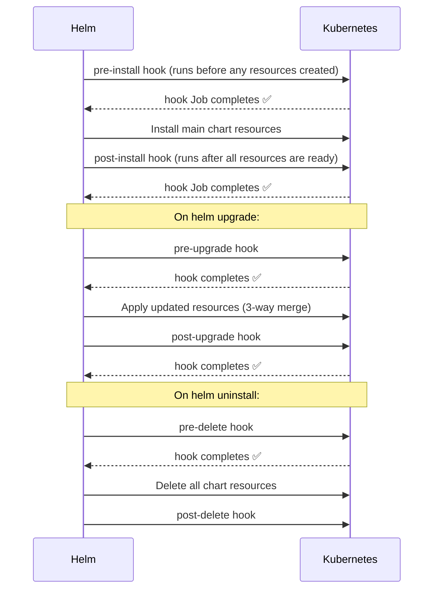
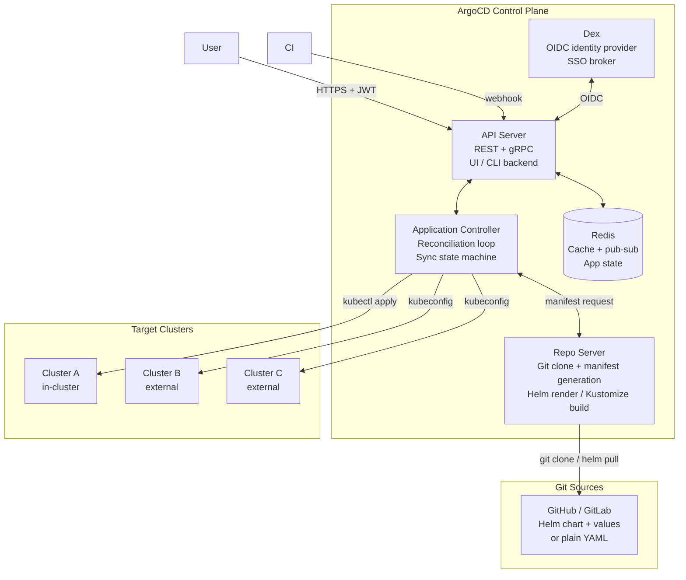
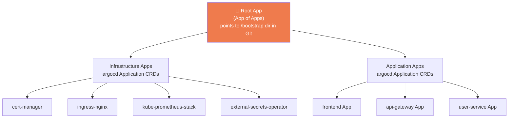

# ⛵🔄 Helm & ArgoCD — Medium / Hard Interview Questions


> **Self-generated comprehensive reference** covering advanced Helm and ArgoCD concepts that appear in mid-level to senior DevOps/DevSecOps interviews. Topics go beyond the basics — assumes you already know what Helm and ArgoCD are.

---

## 📑 Table of Contents

| # | Topic | Level |
|---|---|---|
| 1 | Helm Advanced Templating — Conditionals, Loops, Named Templates | Medium |
| 2 | Helm Hooks — Lifecycle Operations | Medium/Hard |
| 3 | Helm Subcharts and Dependencies | Medium |
| 4 | Helm Library Charts | Hard |
| 5 | Helm Values Schema Validation | Medium |
| 6 | Helm Secrets Management | Hard |
| 7 | Helmfile — Declarative Multi-Release Management | Medium |
| 8 | ArgoCD Architecture Deep Dive | Medium |
| 9 | ArgoCD Application vs ApplicationSet | Medium/Hard |
| 10 | ArgoCD Sync Phases, Waves, and Hooks | Hard |
| 11 | ArgoCD + Helm Integration | Medium/Hard |
| 12 | ArgoCD RBAC, Projects, and SSO | Hard |
| 13 | App of Apps Pattern and Cluster Bootstrapping | Hard |
| 14 | ArgoCD Image Updater | Medium |
| 15 | Progressive Delivery — ArgoCD Rollouts | Hard |
| 16 | ArgoCD Multi-Cluster Management | Hard |
| 17 | ArgoCD vs Flux CD | Medium |
| 18 | Troubleshooting Helm and ArgoCD | Medium/Hard |

---

---

## 1. Helm Advanced Templating — Conditionals, Loops, Named Templates

### ❓ Interview Question
> **"Walk me through Helm's Go templating system. How do you write conditionals, iterate over collections, and share reusable template logic across files?"**

### 📖 Core Concepts

Helm uses Go's `text/template` package with Sprig function library extensions. Templates are evaluated at render time against a data object (`.Values`, `.Chart`, `.Release`, `.Files`, `.Capabilities`).

**Template data roots:**

| Object | Contains |
|---|---|
| `.Values` | Merged values from `values.yaml` + override files + `--set` |
| `.Chart` | Fields from `Chart.yaml` (Name, Version, AppVersion) |
| `.Release` | Release metadata (Name, Namespace, IsInstall, IsUpgrade) |
| `.Files` | Access to non-template files in the chart directory |
| `.Capabilities` | K8s API versions available in the cluster |

### Conditionals

```yaml
# templates/deployment.yaml
spec:
  replicas: {{ .Values.replicaCount }}
  {{- if .Values.autoscaling.enabled }}
  # replicas managed by HPA — omit from Deployment when HPA is active
  {{- else }}
  replicas: {{ .Values.replicaCount }}
  {{- end }}

  template:
    spec:
      {{- if .Values.nodeSelector }}
      nodeSelector:
        {{- toYaml .Values.nodeSelector | nindent 8 }}
      {{- end }}

      {{- if .Values.tolerations }}
      tolerations:
        {{- toYaml .Values.tolerations | nindent 8 }}
      {{- end }}

      containers:
        - name: {{ .Chart.Name }}
          image: "{{ .Values.image.repository }}:{{ .Values.image.tag | default .Chart.AppVersion }}"
          {{- if .Values.env }}
          env:
            {{- range $key, $val := .Values.env }}
            - name: {{ $key }}
              value: {{ $val | quote }}
            {{- end }}
          {{- end }}
```

### Loops — `range`

```yaml
# values.yaml
ingress:
  hosts:
    - host: myapp.example.com
      paths:
        - path: /api
          pathType: Prefix
        - path: /health
          pathType: Exact
    - host: myapp-internal.example.com
      paths:
        - path: /
          pathType: Prefix

# templates/ingress.yaml
{{- if .Values.ingress.enabled -}}
apiVersion: networking.k8s.io/v1
kind: Ingress
metadata:
  name: {{ include "myapp.fullname" . }}
spec:
  rules:
    {{- range .Values.ingress.hosts }}
    - host: {{ .host | quote }}
      http:
        paths:
          {{- range .paths }}
          - path: {{ .path }}
            pathType: {{ .pathType }}
            backend:
              service:
                name: {{ include "myapp.fullname" $ }}
                port:
                  number: {{ $.Values.service.port }}
          {{- end }}
    {{- end }}
{{- end }}
```

> **Key**: inside `range`, use `$` to access the root object (`.Values`, `.Release`) because `.` is rebound to the current loop item.

### Named Templates (`_helpers.tpl`)

```yaml
# templates/_helpers.tpl
{{/*
Expand the name of the chart.
*/}}
{{- define "myapp.name" -}}
{{- default .Chart.Name .Values.nameOverride | trunc 63 | trimSuffix "-" }}
{{- end }}

{{/*
Create a default fully qualified app name.
*/}}
{{- define "myapp.fullname" -}}
{{- if .Values.fullnameOverride }}
{{- .Values.fullnameOverride | trunc 63 | trimSuffix "-" }}
{{- else }}
{{- $name := default .Chart.Name .Values.nameOverride }}
{{- if contains $name .Release.Name }}
{{- .Release.Name | trunc 63 | trimSuffix "-" }}
{{- else }}
{{- printf "%s-%s" .Release.Name $name | trunc 63 | trimSuffix "-" }}
{{- end }}
{{- end }}
{{- end }}

{{/*
Common labels — reused across all resources
*/}}
{{- define "myapp.labels" -}}
helm.sh/chart: {{ include "myapp.chart" . }}
{{ include "myapp.selectorLabels" . }}
{{- if .Chart.AppVersion }}
app.kubernetes.io/version: {{ .Chart.AppVersion | quote }}
{{- end }}
app.kubernetes.io/managed-by: {{ .Release.Service }}
{{- end }}

{{/*
Selector labels
*/}}
{{- define "myapp.selectorLabels" -}}
app.kubernetes.io/name: {{ include "myapp.name" . }}
app.kubernetes.io/instance: {{ .Release.Name }}
{{- end }}

# Call in any template:
metadata:
  labels:
    {{- include "myapp.labels" . | nindent 4 }}
```

### Sprig Functions (Critical ones)

```yaml
# String manipulation
{{ .Values.name | upper }}               # MYAPP
{{ .Values.name | trunc 63 | trimSuffix "-" }}
{{ printf "%s-%s" .Release.Name .Chart.Name }}
{{ .Values.tag | default "latest" }}
{{ .Values.name | quote }}               # "myapp"

# Type conversion
{{ .Values.port | toString }}
{{ toYaml .Values.resources | nindent 12 }}
{{ toJson .Values.config }}

# Logic
{{ if and .Values.ingress.enabled .Values.ingress.tls }}
{{ if or .Values.debug .Values.verbose }}
{{ if not .Values.production }}

# Lists and dicts
{{ $list := list "a" "b" "c" }}
{{ range $i, $v := $list }}{{ $i }}: {{ $v }}{{ end }}
{{ $dict := dict "key" "value" }}
{{ get $dict "key" }}
```

---

## 2. Helm Hooks — Lifecycle Operations

### ❓ Interview Question
> **"What are Helm hooks? When would you use a pre-install hook versus a post-upgrade hook? How do hook deletion policies work?"**

### 📖 Core Concepts

Helm hooks are Kubernetes resources (usually Jobs or Pods) annotated to run at specific points in the Helm release lifecycle. They allow you to perform operations — database migrations, configuration validation, cleanup — that must complete before or after the chart's main resources are applied.

### Hook Lifecycle Points



### Hook Annotations

```yaml
# templates/db-migration-job.yaml
apiVersion: batch/v1
kind: Job
metadata:
  name: {{ include "myapp.fullname" . }}-db-migrate
  annotations:
    "helm.sh/hook": pre-upgrade,pre-install          # when to run
    "helm.sh/hook-weight": "-5"                       # order (lower = earlier)
    "helm.sh/hook-delete-policy": before-hook-creation,hook-succeeded
spec:
  backoffLimit: 3
  activeDeadlineSeconds: 300
  template:
    spec:
      restartPolicy: Never
      containers:
        - name: migrate
          image: "{{ .Values.image.repository }}:{{ .Values.image.tag }}"
          command: ["python", "manage.py", "migrate"]
          env:
            - name: DATABASE_URL
              valueFrom:
                secretKeyRef:
                  name: {{ include "myapp.fullname" . }}-db-secret
                  key: url
```

### Hook Weights

When multiple hooks are defined for the same event, weights control execution order:

```yaml
# Runs first (weight -10)
annotations:
  "helm.sh/hook": pre-install
  "helm.sh/hook-weight": "-10"   # create DB schema

# Runs second (weight -5)
annotations:
  "helm.sh/hook": pre-install
  "helm.sh/hook-weight": "-5"    # seed reference data

# Runs third (weight 0, default)
annotations:
  "helm.sh/hook": pre-install
  "helm.sh/hook-weight": "0"     # validate config
```

### Hook Deletion Policies

| Policy | Behavior |
|---|---|
| `before-hook-creation` | Delete any existing hook resource before creating the new one (default) |
| `hook-succeeded` | Delete the hook resource immediately after it succeeds |
| `hook-failed` | Delete even if the hook fails (use carefully — destroys logs) |

```yaml
# Recommended for migrations: keep on failure for debugging, delete on success
"helm.sh/hook-delete-policy": before-hook-creation,hook-succeeded
```

### Common Hook Use Cases

```yaml
# 1. Pre-install: create DB schema before app starts
"helm.sh/hook": pre-install

# 2. Pre-upgrade: run migrations before new app version starts
"helm.sh/hook": pre-upgrade,pre-install

# 3. Post-install: send Slack notification after deployment
"helm.sh/hook": post-install,post-upgrade

# 4. Pre-delete: drain connections before uninstall
"helm.sh/hook": pre-delete

# 5. Test hook: validate app after install
"helm.sh/hook": test
```

### `helm test` — Post-Deploy Validation

```yaml
# templates/tests/test-connection.yaml
apiVersion: v1
kind: Pod
metadata:
  name: "{{ include "myapp.fullname" . }}-test-connection"
  annotations:
    "helm.sh/hook": test
spec:
  restartPolicy: Never
  containers:
    - name: wget
      image: busybox
      command: ['wget']
      args: ['--spider', '--timeout=10',
             'http://{{ include "myapp.fullname" . }}:{{ .Values.service.port }}/health']
```

```bash
# Run tests after installing
helm install myapp ./chart
helm test myapp -n production --logs
```

---

## 3. Helm Subcharts and Dependencies

### ❓ Interview Question
> **"How do Helm chart dependencies work? What is an umbrella chart and when would you use one? How do you pass values to a subchart?"**

### 📖 Core Concepts

A Helm chart can declare dependencies on other charts in `Chart.yaml`. When you run `helm dependency update`, the dependent charts are downloaded into the `charts/` directory as `.tgz` files.

### Declaring Dependencies

```yaml
# Chart.yaml
apiVersion: v2
name: myapp
version: 1.5.0
dependencies:
  - name: postgresql
    version: "13.x.x"
    repository: https://charts.bitnami.com/bitnami
    condition: postgresql.enabled          # only pull if this value is true
    alias: db                              # reference as "db" in values

  - name: redis
    version: "18.x.x"
    repository: https://charts.bitnami.com/bitnami
    condition: redis.enabled

  - name: common-config
    version: "1.0.0"
    repository: "file://../common-config"  # local chart dependency
```

```bash
# Fetch/update all dependencies into charts/ directory
helm dependency update ./myapp

# List dependency status
helm dependency list ./myapp
```

### Passing Values to Subcharts

```yaml
# values.yaml — subchart values live under the subchart name (or alias)
postgresql:
  enabled: true
  auth:
    database: myappdb
    username: myapp
    existingSecret: myapp-db-secret
  primary:
    persistence:
      size: 20Gi
      storageClass: gp3

redis:
  enabled: true
  auth:
    enabled: false
  master:
    persistence:
      size: 5Gi

# Global values — accessible by ALL charts including subcharts
global:
  imageRegistry: myregistry.io
  storageClass: gp3
  environment: production
```

### Umbrella Chart Pattern

An umbrella chart has **no templates of its own** — its only purpose is to group subcharts:

```
platform/
├── Chart.yaml          ← lists all microservices as dependencies
├── values.yaml         ← global + per-service values
├── values-prod.yaml
└── charts/             ← populated by helm dep update
    ├── frontend-1.2.0.tgz
    ├── api-gateway-2.1.0.tgz
    ├── user-service-1.8.0.tgz
    └── order-service-1.5.0.tgz
```

```yaml
# platform/Chart.yaml
apiVersion: v2
name: platform
version: 3.0.0
dependencies:
  - name: frontend
    version: "1.2.0"
    repository: "oci://registry.example.com/helm-charts"
  - name: api-gateway
    version: "2.1.0"
    repository: "oci://registry.example.com/helm-charts"
  - name: user-service
    version: "1.8.0"
    repository: "oci://registry.example.com/helm-charts"
    condition: user-service.enabled

# Deploy entire platform with one command
helm upgrade --install platform ./platform \
  -f values-prod.yaml \
  -n production
```

---

## 4. Helm Library Charts

### ❓ Interview Question
> **"What is a Helm library chart? How is it different from an application chart, and how do you use it to share template logic across multiple service charts?"**

### 📖 Core Concepts

A **library chart** (`type: library` in `Chart.yaml`) provides reusable named templates that other charts can include as a dependency. It cannot be installed directly — it has no Kubernetes resources. Library charts solve the problem of copy-pasting the same `_helpers.tpl` logic (labels, annotations, names) across every microservice chart.

### Creating a Library Chart

```yaml
# common/Chart.yaml
apiVersion: v2
name: common
description: Shared Helm template helpers for myorg microservices
type: library              # ← key difference from application chart
version: 1.0.0
```

```yaml
# common/templates/_labels.tpl
{{/*
Standard labels for all myorg services
*/}}
{{- define "common.labels" -}}
helm.sh/chart: {{ .Chart.Name }}-{{ .Chart.Version }}
app.kubernetes.io/name: {{ .Chart.Name }}
app.kubernetes.io/instance: {{ .Release.Name }}
app.kubernetes.io/version: {{ .Chart.AppVersion | quote }}
app.kubernetes.io/managed-by: {{ .Release.Service }}
app.kubernetes.io/part-of: myorg-platform
environment: {{ .Values.global.environment | default "production" }}
{{- end }}

{{/*
Standard deployment template — entire Deployment generated from library
*/}}
{{- define "common.deployment" -}}
apiVersion: apps/v1
kind: Deployment
metadata:
  name: {{ .Release.Name }}
  labels:
    {{- include "common.labels" . | nindent 4 }}
spec:
  replicas: {{ .Values.replicaCount | default 2 }}
  selector:
    matchLabels:
      app.kubernetes.io/name: {{ .Chart.Name }}
      app.kubernetes.io/instance: {{ .Release.Name }}
  template:
    metadata:
      labels:
        {{- include "common.labels" . | nindent 8 }}
    spec:
      serviceAccountName: {{ .Release.Name }}
      securityContext:
        runAsNonRoot: true
        runAsUser: 1000
        fsGroup: 2000
      containers:
        - name: {{ .Chart.Name }}
          image: "{{ .Values.image.repository }}:{{ .Values.image.tag | default .Chart.AppVersion }}"
          imagePullPolicy: {{ .Values.image.pullPolicy | default "IfNotPresent" }}
          ports:
            - containerPort: {{ .Values.containerPort | default 8080 }}
          {{- with .Values.resources }}
          resources:
            {{- toYaml . | nindent 12 }}
          {{- end }}
{{- end }}
```

### Consuming a Library Chart

```yaml
# myservice/Chart.yaml
apiVersion: v2
name: myservice
version: 1.0.0
dependencies:
  - name: common
    version: "1.0.0"
    repository: "oci://registry.example.com/helm-charts"
```

```yaml
# myservice/templates/deployment.yaml
{{- include "common.deployment" . }}
# That's the entire file — the library generates the full Deployment
```

```yaml
# myservice/templates/service.yaml
apiVersion: v1
kind: Service
metadata:
  name: {{ .Release.Name }}
  labels:
    {{- include "common.labels" . | nindent 4 }}   # reuse library labels
spec:
  selector:
    app.kubernetes.io/name: {{ .Chart.Name }}
    app.kubernetes.io/instance: {{ .Release.Name }}
  ports:
    - port: {{ .Values.service.port | default 80 }}
      targetPort: {{ .Values.containerPort | default 8080 }}
```

**Key benefit**: Update `common` once, bump its version, update the dependency in all 20 microservice charts — consistent labels, security contexts, and resource defaults everywhere.

---

## 5. Helm Values Schema Validation

### ❓ Interview Question
> **"How do you prevent incorrect values from being passed to a Helm chart at install time? What is `values.schema.json` and how does it work?"**

### 📖 Core Concepts

`values.schema.json` is a JSON Schema file placed in the chart root. Helm validates the provided `values.yaml` (and any `--set` overrides) against this schema before rendering any templates — failing fast with a clear error rather than generating invalid Kubernetes manifests.

### Example Schema

```json
// values.schema.json
{
  "$schema": "https://json-schema.org/draft-07/schema#",
  "title": "MyApp Helm Chart Values",
  "type": "object",
  "required": ["image", "replicaCount"],
  "properties": {
    "replicaCount": {
      "type": "integer",
      "minimum": 1,
      "maximum": 50,
      "description": "Number of pod replicas"
    },
    "image": {
      "type": "object",
      "required": ["repository", "tag"],
      "properties": {
        "repository": {
          "type": "string",
          "pattern": "^[a-z0-9./:-]+$"
        },
        "tag": {
          "type": "string",
          "minLength": 1
        },
        "pullPolicy": {
          "type": "string",
          "enum": ["Always", "IfNotPresent", "Never"]
        }
      }
    },
    "service": {
      "type": "object",
      "properties": {
        "type": {
          "type": "string",
          "enum": ["ClusterIP", "NodePort", "LoadBalancer"]
        },
        "port": {
          "type": "integer",
          "minimum": 1,
          "maximum": 65535
        }
      }
    },
    "resources": {
      "type": "object",
      "properties": {
        "limits": { "$ref": "#/definitions/resourceList" },
        "requests": { "$ref": "#/definitions/resourceList" }
      }
    }
  },
  "definitions": {
    "resourceList": {
      "type": "object",
      "properties": {
        "cpu": { "type": "string" },
        "memory": { "type": "string" }
      }
    }
  },
  "additionalProperties": false
}
```

```bash
# Schema is validated automatically on helm install/upgrade/lint
helm install myapp ./chart --set replicaCount=abc
# Error: values don't meet the specifications of the schema(s) in the following chart(s):
# myapp: - replicaCount: Invalid type. Expected: integer, given: string

helm lint ./chart -f values-prod.yaml
```

---

## 6. Helm Secrets Management

### ❓ Interview Question
> **"How do you handle secrets in Helm? What is the problem with storing secrets in values files, and what are the production-grade solutions?"**

### 📖 The Problem

```yaml
# ❌ NEVER do this — values.yaml committed to Git
database:
  password: "mysupersecretpassword123"
  connectionString: "postgres://user:password@db:5432/mydb"
```

Any developer with Git access sees production credentials. This is a critical security failure.

### Solution 1 — `--set` from CI Vault (Simple)

```bash
# CI pipeline reads secret from HashiCorp Vault, passes via --set
DB_PASSWORD=$(vault kv get -field=password secret/myapp/db)
helm upgrade --install myapp ./chart \
  --set database.password="$DB_PASSWORD" \
  -f values-prod.yaml
# Secret never touches disk or Git
```

### Solution 2 — Helm Secrets Plugin (helm-secrets)

```bash
# Install plugin
helm plugin install https://github.com/jkroepke/helm-secrets

# Encrypt a secrets file with SOPS + AWS KMS
sops --kms arn:aws:kms:us-east-1:123:key/abc123 \
  --encrypt secrets-prod.yaml > secrets-prod.enc.yaml

# secrets-prod.yaml (plaintext — never committed)
database:
  password: "mysupersecretpassword123"

# Install using encrypted file — helm-secrets decrypts in memory
helm secrets upgrade --install myapp ./chart \
  -f values-prod.yaml \
  -f secrets-prod.enc.yaml    # decrypted on the fly, never written to disk
```

### Solution 3 — External Secrets Operator (ESO) — Production Standard

ESO runs in the cluster and syncs secrets from external vaults (AWS Secrets Manager, HashiCorp Vault, GCP Secret Manager) into Kubernetes Secrets automatically.

```yaml
# In chart templates — reference the ESO-created secret, don't store values
apiVersion: external-secrets.io/v1beta1
kind: ExternalSecret
metadata:
  name: {{ include "myapp.fullname" . }}-db-secret
spec:
  refreshInterval: 1h
  secretStoreRef:
    name: aws-secretsmanager
    kind: ClusterSecretStore
  target:
    name: {{ include "myapp.fullname" . }}-db-secret
    creationPolicy: Owner
  data:
    - secretKey: password
      remoteRef:
        key: myapp/production/db
        property: password
```

```yaml
# templates/deployment.yaml — consume the ESO-managed secret
env:
  - name: DB_PASSWORD
    valueFrom:
      secretKeyRef:
        name: {{ include "myapp.fullname" . }}-db-secret
        key: password
```

### Solution 4 — Vault Agent Injector

```yaml
# annotations on pod spec — Vault Agent sidecar injects secret as file
annotations:
  vault.hashicorp.com/agent-inject: "true"
  vault.hashicorp.com/role: "myapp"
  vault.hashicorp.com/agent-inject-secret-db-password: "secret/myapp/db"
  vault.hashicorp.com/agent-inject-template-db-password: |
    {{- with secret "secret/myapp/db" -}}
    {{ .Data.data.password }}
    {{- end }}
```

---

## 7. Helmfile — Declarative Multi-Release Management

### ❓ Interview Question
> **"What is Helmfile and why would you use it over plain Helm commands? How does it handle multiple environments and release ordering?"**

### 📖 Core Concepts

Helmfile is a declarative spec file for managing multiple Helm releases. Instead of scripting dozens of `helm upgrade` commands, you define all releases, their values, and their relationships in a `helmfile.yaml`.

```yaml
# helmfile.yaml
repositories:
  - name: bitnami
    url: https://charts.bitnami.com/bitnami
  - name: ingress-nginx
    url: https://kubernetes.github.io/ingress-nginx
  - name: myorg
    url: oci://registry.example.com/helm-charts

environments:
  dev:
    values:
      - environments/dev.yaml
  staging:
    values:
      - environments/staging.yaml
  production:
    values:
      - environments/production.yaml

releases:
  # Infrastructure layer — deployed first
  - name: ingress-nginx
    namespace: ingress-nginx
    chart: ingress-nginx/ingress-nginx
    version: 4.10.0
    values:
      - values/ingress-nginx.yaml

  - name: cert-manager
    namespace: cert-manager
    chart: jetstack/cert-manager
    version: v1.14.0
    values:
      - values/cert-manager.yaml
    needs:
      - ingress-nginx/ingress-nginx     # deploy after ingress

  # Application layer — deployed after infrastructure
  - name: postgresql
    namespace: data
    chart: bitnami/postgresql
    version: 13.2.1
    values:
      - values/postgresql.yaml
      - values/postgresql.{{ .Environment.Name }}.yaml

  - name: myapp
    namespace: production
    chart: myorg/myapp
    version: "{{ .Values.myapp.chartVersion }}"
    values:
      - values/myapp.yaml
      - values/myapp.{{ .Environment.Name }}.yaml
    secrets:
      - secrets/myapp.{{ .Environment.Name }}.enc.yaml   # helm-secrets integration
    needs:
      - data/postgresql
```

```bash
# Deploy all releases for production environment
helmfile -e production sync

# Preview what will change
helmfile -e production diff

# Deploy only specific releases
helmfile -e production -l name=myapp sync

# Destroy all releases
helmfile -e production destroy

# Apply with concurrency (parallel deploys where no needs dependency)
helmfile -e production sync --concurrency 4
```

---

## 8. ArgoCD Architecture Deep Dive

### ❓ Interview Question
> **"Explain ArgoCD's internal architecture. What are the key components and what does each one do?"**

### 📖 Architecture Overview



### Component Responsibilities

| Component | Role | Scales How |
|---|---|---|
| **API Server** | REST/gRPC endpoint for UI, CLI, webhooks. JWT validation. Translates requests to Application controller operations | Horizontal — stateless |
| **Application Controller** | Kubernetes controller that watches Application CRDs. Compares live cluster state with desired Git state. Triggers sync. Runs health checks | Horizontal with sharding (argocd-application-controller StatefulSet) |
| **Repo Server** | Clones Git repos, renders manifests (Helm, Kustomize, Jsonnet, plain YAML), caches rendered output. Never connects to clusters | Horizontal — stateless with shared cache |
| **Redis** | Shared cache between all components. Pub-sub for live state updates to the UI. App state cache | Single instance (or Redis cluster for HA) |
| **Dex** | Embedded OIDC provider for SSO. Brokers authentication to GitHub, Okta, LDAP, etc. | Stateless — horizontal |
| **ApplicationSet Controller** | Generates multiple Application CRDs from a single ApplicationSet template using generators | Single instance |

### HA ArgoCD Setup

```yaml
# argocd-ha values.yaml (using ArgoCD Helm chart)
controller:
  replicas: 1                    # StatefulSet — sharding across replicas
  env:
    - name: ARGOCD_CONTROLLER_REPLICAS
      value: "3"

server:
  replicas: 3                    # Stateless — scale freely

repoServer:
  replicas: 3                    # Stateless — scale freely

applicationSet:
  replicas: 2

redis-ha:
  enabled: true                  # Redis HA with Sentinel
```

---

## 9. ArgoCD Application vs ApplicationSet

### ❓ Interview Question
> **"What is the difference between an ArgoCD Application and an ApplicationSet? Walk me through the ApplicationSet generators and when you would use each one."**

### 📖 ArgoCD Application (Single)

```yaml
# Basic ArgoCD Application
apiVersion: argoproj.io/v1alpha1
kind: Application
metadata:
  name: myapp-production
  namespace: argocd
spec:
  project: myorg-project

  source:
    repoURL: https://github.com/myorg/helm-charts
    targetRevision: HEAD
    path: charts/myapp
    helm:
      valueFiles:
        - values.yaml
        - values-production.yaml
      parameters:
        - name: image.tag
          value: "v2.1.0"

  destination:
    server: https://kubernetes.default.svc   # in-cluster
    namespace: production

  syncPolicy:
    automated:
      prune: true       # delete resources removed from Git
      selfHeal: true    # auto-sync when cluster drifts from Git
    syncOptions:
      - CreateNamespace=true
      - PrunePropagationPolicy=foreground
      - RespectIgnoreDifferences=true
    retry:
      limit: 5
      backoff:
        duration: 5s
        factor: 2
        maxDuration: 3m
```

### 📖 ApplicationSet — Generate Many Applications from One Template

```yaml
# ApplicationSet with List Generator — explicit list of environments
apiVersion: argoproj.io/v1alpha1
kind: ApplicationSet
metadata:
  name: myapp-environments
  namespace: argocd
spec:
  generators:
    - list:
        elements:
          - cluster: dev
            url: https://dev-cluster.example.com
            namespace: myapp-dev
            valuesFile: values-dev.yaml
          - cluster: staging
            url: https://staging-cluster.example.com
            namespace: myapp-staging
            valuesFile: values-staging.yaml
          - cluster: production
            url: https://prod-cluster.example.com
            namespace: myapp-production
            valuesFile: values-prod.yaml

  template:
    metadata:
      name: myapp-{{ "{{cluster}}" }}
    spec:
      project: myorg
      source:
        repoURL: https://github.com/myorg/helm-charts
        targetRevision: HEAD
        path: charts/myapp
        helm:
          valueFiles:
            - values.yaml
            - "{{ "{{valuesFile}}" }}"
      destination:
        server: "{{ "{{url}}" }}"
        namespace: "{{ "{{namespace}}" }}"
      syncPolicy:
        automated:
          prune: true
          selfHeal: true
```

### ApplicationSet Generators

```yaml
# 1. Git Generator — one Application per directory in Git
generators:
  - git:
      repoURL: https://github.com/myorg/services
      revision: HEAD
      directories:
        - path: "services/*"           # matches services/frontend, services/api, etc.

# 2. Cluster Generator — one Application per registered cluster
generators:
  - clusters:
      selector:
        matchLabels:
          environment: production      # only prod clusters
      values:
        revision: stable

# 3. Matrix Generator — every combination of two generators
generators:
  - matrix:
      generators:
        - clusters:
            selector:
              matchLabels:
                tier: production
        - list:
            elements:
              - app: frontend
              - app: api
              - app: worker
# Result: frontend+prod-cluster-1, api+prod-cluster-1, worker+prod-cluster-1,
#         frontend+prod-cluster-2, api+prod-cluster-2, etc.

# 4. Pull Request Generator — deploy a preview environment per open PR
generators:
  - pullRequest:
      github:
        owner: myorg
        repo: myapp
        tokenRef:
          secretName: github-token
          key: token
        labels:
          - preview               # only PRs with this label
```

---

## 10. ArgoCD Sync Phases, Waves, and Hooks

### ❓ Interview Question
> **"How do ArgoCD sync waves work? Walk me through a scenario where you need a database migration Job to complete before the new application version starts."**

### 📖 Sync Phases

ArgoCD divides a sync operation into three phases:

```
PreSync  →  Sync  →  PostSync
```

Within each phase, **waves** control ordering (lower wave = earlier).

### Sync Wave Annotation

```yaml
# Wave -1: Create namespace and secrets first
apiVersion: v1
kind: Namespace
metadata:
  name: production
  annotations:
    argocd.argoproj.io/sync-wave: "-1"

# Wave 0 (default): Infrastructure (ConfigMaps, ServiceAccounts)
apiVersion: v1
kind: ConfigMap
metadata:
  annotations:
    argocd.argoproj.io/sync-wave: "0"

# Wave 1: Database migration Job (must complete before app)
apiVersion: batch/v1
kind: Job
metadata:
  name: db-migrate
  annotations:
    argocd.argoproj.io/sync-wave: "1"
    argocd.argoproj.io/hook: Sync              # run during Sync phase
    argocd.argoproj.io/hook-delete-policy: HookSucceeded
spec:
  template:
    spec:
      restartPolicy: Never
      containers:
        - name: migrate
          image: myapp:v2.0.0
          command: ["python", "manage.py", "migrate"]

# Wave 2: Application Deployment (starts only after wave 1 Job completes)
apiVersion: apps/v1
kind: Deployment
metadata:
  name: myapp
  annotations:
    argocd.argoproj.io/sync-wave: "2"

# Wave 3: Ingress (expose only after app is healthy)
apiVersion: networking.k8s.io/v1
kind: Ingress
metadata:
  annotations:
    argocd.argoproj.io/sync-wave: "3"
```

### ArgoCD Hook Types

```yaml
# PreSync — runs before any resources in Sync phase
annotations:
  argocd.argoproj.io/hook: PreSync           # validate cluster readiness

# Sync — runs during main sync (with wave ordering)
annotations:
  argocd.argoproj.io/hook: Sync             # database migrations

# PostSync — runs after all Sync resources are healthy
annotations:
  argocd.argoproj.io/hook: PostSync         # smoke tests, Slack notification

# SyncFail — runs only when sync fails
annotations:
  argocd.argoproj.io/hook: SyncFail         # alert, cleanup, rollback trigger
```

### Hook Delete Policies (ArgoCD)

| Policy | Meaning |
|---|---|
| `HookSucceeded` | Delete after successful completion |
| `HookFailed` | Delete after failure |
| `BeforeHookCreation` | Delete existing hook before recreating (default) |

---

## 11. ArgoCD + Helm Integration

### ❓ Interview Question
> **"How does ArgoCD render Helm charts? What are the limitations compared to running `helm upgrade` directly, and how do you handle Helm secrets or post-render transformations in ArgoCD?"**

### 📖 How ArgoCD Renders Helm

ArgoCD's repo-server runs `helm template` (not `helm install/upgrade`) to generate Kubernetes manifests, then applies them via its own controller. This has important implications:

| Aspect | `helm upgrade` directly | ArgoCD with Helm source |
|---|---|---|
| **Helm release secret** | Stored in cluster (enables `helm history/rollback`) | Not created — ArgoCD manages state in Application CRD |
| **Hooks** | Helm hooks run natively | Helm hooks are **ignored** — use ArgoCD sync hooks instead |
| **Rollback** | `helm rollback` | `argocd app rollback` or revert Git commit |
| **Values override** | `-f file --set key=val` | Declared in Application spec |
| **Diff** | `helm diff upgrade` | `argocd app diff` |

### Helm Values in Application Spec

```yaml
spec:
  source:
    repoURL: https://github.com/myorg/charts
    path: charts/myapp
    targetRevision: main
    helm:
      # Reference value files relative to chart path
      valueFiles:
        - values.yaml
        - values-production.yaml

      # Inline parameter overrides
      parameters:
        - name: image.tag
          value: "v2.1.0"
        - name: replicaCount
          value: "5"

      # Inline values block (overrides valueFiles)
      values: |
        replicaCount: 5
        autoscaling:
          enabled: true

      # Use release name different from app name
      releaseName: myapp-release

      # Skip CRD install (if CRDs managed separately)
      skipCrds: false

      # Pass credentials for private chart repos
      passCredentials: false
```

### Post-Render Transformations (Kustomize on top of Helm)

```yaml
# Application with Helm source + Kustomize post-renderer
spec:
  source:
    repoURL: https://github.com/myorg/charts
    path: charts/myapp
    plugin:
      name: helmfile          # use ArgoCD Config Management Plugin
```

```yaml
# Or use multiple sources (ArgoCD 2.6+)
spec:
  sources:
    - repoURL: https://github.com/myorg/charts
      path: charts/myapp
      helm:
        valueFiles:
          - $values/environments/production/values.yaml

    - repoURL: https://github.com/myorg/config    # separate config repo
      targetRevision: main
      ref: values                                  # $values reference
```

---

## 12. ArgoCD RBAC, Projects, and SSO

### ❓ Interview Question
> **"How do you restrict what ArgoCD Application teams can deploy? Explain AppProjects, RBAC policies, and how you integrate SSO."**

### 📖 AppProject — Boundary for Teams

```yaml
apiVersion: argoproj.io/v1alpha1
kind: AppProject
metadata:
  name: team-payments
  namespace: argocd
spec:
  description: Payments team — production and staging

  # Which Git repos this team can deploy from
  sourceRepos:
    - https://github.com/myorg/payments-charts
    - oci://registry.example.com/helm-charts/payments-*

  # Which clusters and namespaces this team can deploy to
  destinations:
    - server: https://kubernetes.default.svc
      namespace: payments-*         # wildcard — payments-prod, payments-staging
    - server: https://staging-cluster.example.com
      namespace: payments-*

  # Which Kubernetes resource kinds are allowed
  clusterResourceWhitelist:
    - group: ""
      kind: Namespace
  namespaceResourceBlacklist:
    - group: ""
      kind: ResourceQuota            # team cannot modify quotas

  # Prevent deploying to production without a sync window restriction
  syncWindows:
    - kind: allow
      schedule: "10 1 * * *"        # allow syncs only 1:10am-1:40am UTC
      duration: 30m
      applications:
        - "*-production"

  # Require manual sync approval for production
  roles:
    - name: developer
      description: Read-only + sync staging only
      policies:
        - p, proj:team-payments:developer, applications, sync, team-payments/*-staging, allow
        - p, proj:team-payments:developer, applications, get, team-payments/*, allow
      groups:
        - myorg:payments-developers     # GitHub team → OIDC group
    - name: lead
      description: Full access within project
      policies:
        - p, proj:team-payments:lead, applications, *, team-payments/*, allow
      groups:
        - myorg:payments-leads
```

### ArgoCD RBAC Policy

```yaml
# argocd-rbac-cm ConfigMap
apiVersion: v1
kind: ConfigMap
metadata:
  name: argocd-rbac-cm
  namespace: argocd
data:
  policy.default: role:readonly          # default is read-only

  policy.csv: |
    # Platform admins — full access
    p, role:platform-admin, *, *, *, allow
    g, myorg:platform-team, role:platform-admin

    # Developers — sync their own project apps only
    p, role:developer, applications, get, */*, allow
    p, role:developer, applications, sync, dev-*/*, allow
    p, role:developer, logs, get, */*, allow
    g, myorg:developers, role:developer
```

### SSO Integration (GitHub OIDC)

```yaml
# argocd-cm ConfigMap
data:
  url: https://argocd.example.com
  dex.config: |
    connectors:
      - type: github
        id: github
        name: GitHub
        config:
          clientID: $dex.github.clientID        # from argocd-secret
          clientSecret: $dex.github.clientSecret
          orgs:
            - name: myorg
              teams:
                - platform-team
                - payments-developers
                - payments-leads
```

---

## 13. App of Apps Pattern and Cluster Bootstrapping

### ❓ Interview Question
> **"Explain the App of Apps pattern in ArgoCD. How would you bootstrap a brand-new Kubernetes cluster so that all applications self-deploy from Git?"**

### 📖 The Pattern

The "App of Apps" is a root ArgoCD Application that manages other ArgoCD Applications — not Kubernetes workloads directly. It creates a self-healing GitOps tree where the entire cluster configuration lives in Git.



### Bootstrap Directory Structure

```
cluster-config/
├── bootstrap/
│   ├── root-app.yaml              ← only this is applied manually once
│   ├── infrastructure/
│   │   ├── cert-manager.yaml      ← ArgoCD Application
│   │   ├── ingress-nginx.yaml     ← ArgoCD Application
│   │   ├── monitoring.yaml        ← ArgoCD Application
│   │   └── eso.yaml               ← ArgoCD Application
│   └── applications/
│       ├── frontend.yaml          ← ArgoCD Application
│       ├── api-gateway.yaml       ← ArgoCD Application
│       └── user-service.yaml      ← ArgoCD Application
```

```yaml
# bootstrap/root-app.yaml — the only resource applied manually
apiVersion: argoproj.io/v1alpha1
kind: Application
metadata:
  name: root
  namespace: argocd
  finalizers:
    - resources-finalizer.argocd.argoproj.io   # cascade delete
spec:
  project: default
  source:
    repoURL: https://github.com/myorg/cluster-config
    targetRevision: main
    path: bootstrap                             # manages the whole bootstrap/ dir
  destination:
    server: https://kubernetes.default.svc
    namespace: argocd
  syncPolicy:
    automated:
      prune: true
      selfHeal: true
```

### Bootstrapping a New Cluster (One Command)

```bash
# 1. Install ArgoCD
kubectl create namespace argocd
kubectl apply -n argocd \
  -f https://raw.githubusercontent.com/argoproj/argo-cd/stable/manifests/install.yaml

# 2. Apply the root app — everything else self-deploys from Git
kubectl apply -f bootstrap/root-app.yaml

# 3. Watch the cascade
argocd app list
# root          Synced  Healthy
# cert-manager  Synced  Healthy
# ingress-nginx Syncing Progressing
# monitoring    Pending Unknown
# frontend      Pending Unknown
# ...
```

---

## 14. ArgoCD Image Updater

### ❓ Interview Question
> **"What is ArgoCD Image Updater and how does it fit into a GitOps workflow? How does it handle Helm-managed applications?"**

### 📖 Core Concepts

ArgoCD Image Updater watches container registries for new image tags and automatically updates the corresponding ArgoCD Application — either by writing back to Git (GitOps) or by updating the live Application spec.

```yaml
# Application with Image Updater annotations
apiVersion: argoproj.io/v1alpha1
kind: Application
metadata:
  name: myapp
  namespace: argocd
  annotations:
    # Tell Image Updater which images to watch
    argocd-image-updater.argoproj.io/image-list: myapp=myregistry.io/myapp

    # Update strategy — semver picks latest matching semver tag
    argocd-image-updater.argoproj.io/myapp.update-strategy: semver
    argocd-image-updater.argoproj.io/myapp.allow-tags: regexp:^v[0-9]+\.[0-9]+\.[0-9]+$

    # Write back to Git (GitOps) instead of patching live Application
    argocd-image-updater.argoproj.io/write-back-method: git
    argocd-image-updater.argoproj.io/git-branch: main

    # For Helm: which parameter to update
    argocd-image-updater.argoproj.io/myapp.helm.image-name: image.repository
    argocd-image-updater.argoproj.io/myapp.helm.image-tag: image.tag
```

**Update strategies:**

| Strategy | Behavior |
|---|---|
| `semver` | Update to latest matching semver tag (e.g., `>=1.0.0 <2.0.0`) |
| `latest` | Always use the most recently pushed tag |
| `digest` | Track the SHA digest of a mutable tag (e.g., `main`) |
| `name` | Alphabetical — highest sorted tag name |

---

## 15. Progressive Delivery — ArgoCD Rollouts

### ❓ Interview Question
> **"What is ArgoCD Rollouts? Explain the difference between a canary deployment and a blue/green deployment, and walk me through how you would configure a canary rollout with analysis."**

### 📖 ArgoCD Rollouts Overview

ArgoCD Rollouts is a Kubernetes controller that replaces the standard Deployment for progressive delivery strategies. It adds Canary and Blue/Green rollout strategies with automated analysis gates.

### Canary Rollout

```yaml
apiVersion: argoproj.io/v1alpha1
kind: Rollout
metadata:
  name: myapp
spec:
  replicas: 10
  selector:
    matchLabels:
      app: myapp
  template:
    metadata:
      labels:
        app: myapp
    spec:
      containers:
        - name: myapp
          image: myregistry.io/myapp:v2.0.0

  strategy:
    canary:
      # Traffic routing via Nginx Ingress
      canaryService: myapp-canary
      stableService: myapp-stable
      trafficRouting:
        nginx:
          stableIngress: myapp-ingress

      steps:
        - setWeight: 5          # send 5% traffic to canary
        - pause: {duration: 5m} # wait 5 minutes

        - setWeight: 20         # ramp to 20%
        - analysis:             # run automated analysis gate
            templates:
              - templateName: success-rate
            args:
              - name: service-name
                value: myapp-canary
        - pause: {duration: 10m}

        - setWeight: 50
        - pause: {}             # indefinite pause — manual promotion required

        - setWeight: 100        # full rollout
```

### AnalysisTemplate — Automated Gates

```yaml
apiVersion: argoproj.io/v1alpha1
kind: AnalysisTemplate
metadata:
  name: success-rate
spec:
  args:
    - name: service-name
  metrics:
    - name: success-rate
      interval: 1m
      count: 5                  # evaluate 5 times
      successCondition: result[0] >= 0.95   # must be ≥ 95% success
      failureLimit: 1           # fail after 1 failed evaluation
      provider:
        prometheus:
          address: http://prometheus.monitoring:9090
          query: |
            sum(rate(http_requests_total{service="{{args.service-name}}",status!~"5.."}[2m]))
            /
            sum(rate(http_requests_total{service="{{args.service-name}}"}[2m]))
```

### Blue/Green Rollout

```yaml
strategy:
  blueGreen:
    activeService: myapp-active       # production traffic
    previewService: myapp-preview     # new version (no traffic yet)

    autoPromotionEnabled: false       # require manual promotion
    scaleDownDelaySeconds: 600        # keep old version for 10min after promotion

    prePromotionAnalysis:             # run analysis against preview before promoting
      templates:
        - templateName: success-rate
      args:
        - name: service-name
          value: myapp-preview

    postPromotionAnalysis:            # validate after promotion
      templates:
        - templateName: success-rate
      args:
        - name: service-name
          value: myapp-active
```

```bash
# Manual promotion commands
kubectl argo rollouts promote myapp              # full promotion
kubectl argo rollouts promote myapp --full       # skip remaining steps
kubectl argo rollouts abort myapp                # abort + rollback
kubectl argo rollouts get rollout myapp --watch  # live status
```

---

## 16. ArgoCD Multi-Cluster Management

### ❓ Interview Question
> **"How does ArgoCD manage deployments across multiple Kubernetes clusters? How do you register an external cluster and what security controls exist?"**

### 📖 Cluster Registration

```bash
# Add external cluster to ArgoCD (uses kubeconfig context)
argocd cluster add my-prod-context \
  --name production-us-east-1 \
  --label environment=production \
  --label region=us-east-1

# This creates a ServiceAccount in the target cluster with ClusterRole
# and stores the token as a K8s Secret in ArgoCD's namespace

# List registered clusters
argocd cluster list

# Check cluster connectivity
argocd cluster get production-us-east-1
```

### Declarative Cluster Secret

```yaml
# Store cluster credentials as a K8s Secret in argocd namespace
apiVersion: v1
kind: Secret
metadata:
  name: production-us-east-1
  namespace: argocd
  labels:
    argocd.argoproj.io/secret-type: cluster
    environment: production
    region: us-east-1
type: Opaque
stringData:
  name: production-us-east-1
  server: https://prod-api.example.com
  config: |
    {
      "bearerToken": "<service-account-token>",
      "tlsClientConfig": {
        "caData": "<base64-ca-cert>"
      }
    }
```

### Multi-Cluster ApplicationSet

```yaml
# Deploy myapp to all production clusters automatically
apiVersion: argoproj.io/v1alpha1
kind: ApplicationSet
metadata:
  name: myapp-all-prod
spec:
  generators:
    - clusters:
        selector:
          matchLabels:
            environment: production    # targets all clusters labeled production
        values:
          revision: "{{ metadata.labels.region }}"  # region-specific Git branch

  template:
    metadata:
      name: "myapp-{{ name }}"         # unique per cluster
    spec:
      project: platform
      source:
        repoURL: https://github.com/myorg/charts
        targetRevision: main
        path: charts/myapp
        helm:
          valueFiles:
            - values.yaml
            - "values-{{ metadata.labels.region }}.yaml"
      destination:
        server: "{{ server }}"
        namespace: myapp
      syncPolicy:
        automated:
          prune: true
          selfHeal: true
```

---

## 17. ArgoCD vs Flux CD

### ❓ Interview Question
> **"Compare ArgoCD and Flux CD. What are the architectural differences and when would you choose one over the other?"**

### 📖 Comparison Table

| Dimension | ArgoCD | Flux CD v2 |
|---|---|---|
| **Architecture** | Centralized server with UI, API, and controllers | Distributed controllers — no central server, all in-cluster |
| **UI** | Rich built-in web UI | No built-in UI (use Weave GitOps or Capacitor) |
| **CLI** | `argocd` CLI with full management capability | `flux` CLI for bootstrapping and status |
| **Helm support** | `HelmRelease` via ArgoCD Application or native Helm source | `HelmRelease` CRD via Helm Controller — more Kubernetes-native |
| **Multi-tenancy** | AppProjects + RBAC policies | Kustomization + RBAC in namespaces |
| **Multi-cluster** | Central ArgoCD manages N clusters via kubeconfig secrets | Each cluster runs its own Flux; management via Git directories |
| **Image updates** | ArgoCD Image Updater (separate install) | Built-in Image Automation Controller |
| **Notifications** | argocd-notifications | Built-in via `notification-controller` |
| **Progressive delivery** | ArgoCD Rollouts (separate controller) | Flagger (separate controller) |
| **OCI support** | Charts via OCI; Git via HTTPS/SSH | Both Git and OCI Helm, plus OCI artifacts as sources |
| **GitOps model** | Push to Git → ArgoCD detects and syncs | Pull-only — Flux polls Git on schedule |
| **Learning curve** | Moderate — UI eases onboarding | Steeper — more Kubernetes-native, less GUI |

### When to Choose ArgoCD

- Teams new to GitOps who benefit from the visual UI
- Organizations needing a centralized management plane across dozens of clusters
- When you want progressive delivery (Rollouts) deeply integrated
- Enterprises needing strong RBAC per team (AppProjects)

### When to Choose Flux

- Organizations with strong Kubernetes-native mindset (everything as CRDs)
- Multi-cluster topologies where each cluster is fully independent (no central control plane)
- When built-in image automation is needed without extra components
- Air-gapped environments where a central server is a liability

---

## 18. Troubleshooting Helm and ArgoCD

### ❓ Interview Question
> **"Walk me through how you would troubleshoot: (1) a Helm upgrade that silently succeeded but the app is broken, (2) an ArgoCD Application stuck in OutOfSync, (3) an ArgoCD sync that never completes."**

---

### Scenario 1 — Helm Upgrade Succeeded But App Is Broken

```bash
# Step 1: Check what changed between revisions
helm history myapp -n production
helm diff upgrade myapp ./chart -f values-prod.yaml -n production

# Step 2: Get the values that were used in the deployed revision
helm get values myapp -n production              # current
helm get values myapp -n production --revision 3  # specific revision

# Step 3: Get the rendered manifests of what's running
helm get manifest myapp -n production

# Step 4: Check pod status and events
kubectl get pods -n production -l app.kubernetes.io/instance=myapp
kubectl describe pod <pod-name> -n production
kubectl logs <pod-name> -n production --previous   # previous container crash logs

# Step 5: If broken — rollback immediately
helm rollback myapp -n production --wait
```

---

### Scenario 2 — ArgoCD Application Stuck OutOfSync

```bash
# Step 1: Check what specifically is out of sync
argocd app diff myapp

# Step 2: Get detailed sync status
argocd app get myapp
kubectl describe application myapp -n argocd

# Step 3: Common causes and fixes

# Cause A: Resource has annotations/fields ArgoCD doesn't manage
# Fix: Add ignoreDifferences to Application spec
spec:
  ignoreDifferences:
    - group: apps
      kind: Deployment
      jsonPointers:
        - /spec/replicas              # HPA manages replicas — ignore drift
    - group: ""
      kind: Secret
      managedFieldsManagers:
        - kube-controller-manager    # ignore fields managed by K8s controllers

# Cause B: Helm chart generates different output on re-render
# (e.g., random passwords, timestamps in annotations)
# Fix: Use server-side apply or stable random with Helm's randAlphaNum stored in secret

# Cause C: Resource was manually kubectl-edited
# Fix: either revert manual change or update Git to match
kubectl edit deployment myapp -n production    # revert to match Git

# Step 4: Force refresh (re-fetch from Git without syncing)
argocd app get myapp --refresh
```

---

### Scenario 3 — ArgoCD Sync Never Completes (Stuck Progressing)

```bash
# Step 1: Check application status
argocd app get myapp
# Look for: Status: Progressing, Health: Degraded or Unknown

# Step 2: Check which resources are blocking
argocd app resources myapp

# Step 3: Check events in the target namespace
kubectl get events -n production --sort-by='.lastTimestamp' | tail -30

# Step 4: Common blockers

# Blocker A: Sync hook (Job) is running but failing
kubectl get jobs -n production
kubectl logs job/myapp-pre-sync -n production

# Blocker B: Deployment is waiting for image pull
kubectl describe pod -n production -l app=myapp
# Look for: Back-off pulling image / ErrImagePull

# Blocker C: PVC pending (no PV available)
kubectl get pvc -n production
kubectl describe pvc myapp-data -n production

# Blocker D: Sync wave resource unhealthy — blocking next wave
# Check custom health checks
argocd app get myapp --show-operation

# Step 5: If hook is stuck — terminate sync
argocd app terminate-op myapp

# Step 6: Check ArgoCD application controller logs
kubectl logs -n argocd \
  deployment/argocd-application-controller \
  --since=30m | grep "myapp"

# Step 7: Check repo server (manifest rendering issue)
kubectl logs -n argocd deployment/argocd-repo-server --since=30m
```

---

### Common ArgoCD Health Status Reference

| Status | Meaning | Typical Cause |
|---|---|---|
| `Healthy` | All resources meet their health criteria | Normal |
| `Progressing` | Resources are being created/updated | Deployment rolling out |
| `Degraded` | One or more resources failed health check | Pod CrashLoopBackOff, failed Job |
| `Suspended` | Rollout is paused (ArgoCD Rollouts) | Manual pause or canary step |
| `Missing` | Resource exists in Git but not in cluster | Namespace missing, RBAC issue |
| `Unknown` | No health check defined for resource type | Custom CRD without health check |

### Custom Health Check for CRDs

```yaml
# argocd-cm ConfigMap — teach ArgoCD how to assess health of custom resources
data:
  resource.customizations.health.batch_v1_Job: |
    hs = {}
    if obj.status ~= nil then
      if obj.status.active ~= nil and obj.status.active > 0 then
        hs.status = "Progressing"
        hs.message = "Job is running"
        return hs
      end
      if obj.status.succeeded ~= nil and obj.status.succeeded > 0 then
        hs.status = "Healthy"
        hs.message = "Job succeeded"
        return hs
      end
      if obj.status.failed ~= nil and obj.status.failed > 0 then
        hs.status = "Degraded"
        hs.message = "Job failed"
        return hs
      end
    end
    hs.status = "Progressing"
    hs.message = "Job is pending"
    return hs
```

---

## 🧠 Master Summary

| Topic | Key Point |
|---|---|
| **Helm Templating** | Go templates + Sprig; `range` for loops, `if/else` for conditionals; `_helpers.tpl` for named templates shared across files |
| **Helm Hooks** | Jobs annotated with `helm.sh/hook` — run at pre/post install/upgrade/delete; use `hook-delete-policy` to clean up; test hooks validate deployments |
| **Subcharts** | Declared in `Chart.yaml` dependencies; values passed via parent `values.yaml` under subchart name; umbrella chart bundles microservices |
| **Library Charts** | `type: library` — provides named templates only, not deployable directly; solves copy-paste of `_helpers.tpl` across 20 service charts |
| **Schema Validation** | `values.schema.json` in chart root — validates types, ranges, enums at `helm install` time before any template rendering |
| **Helm Secrets** | Never in `values.yaml`; use `--set` from CI vault, helm-secrets+SOPS, External Secrets Operator, or Vault Agent Injector |
| **Helmfile** | Declarative multi-release manager; `needs:` for ordering; environment-aware; `helmfile diff` + `sync` in CI |
| **ArgoCD Architecture** | API Server + Application Controller + Repo Server + Redis + Dex; repo server renders manifests, controller reconciles clusters |
| **Application vs ApplicationSet** | Application = one app; ApplicationSet = template + generators (list, git, cluster, matrix, pullRequest) = many apps |
| **Sync Waves** | `argocd.argoproj.io/sync-wave` annotation orders resources within a sync; lower number first; blocks next wave until current is healthy |
| **ArgoCD Hooks** | PreSync / Sync / PostSync / SyncFail; different from Helm hooks (Helm hooks ignored by ArgoCD) |
| **Helm in ArgoCD** | ArgoCD runs `helm template`, not `helm install` — no Helm release secret, no `helm history`, hooks ignored |
| **AppProject RBAC** | Restrict which repos, clusters, namespaces, resource types per team; syncWindows for change-window enforcement |
| **App of Apps** | Root Application manages ArgoCD Application CRDs in Git; one `kubectl apply` bootstraps entire cluster |
| **Image Updater** | Watches registry for new tags; writes back to Git (GitOps) or patches Application; semver/latest/digest strategies |
| **ArgoCD Rollouts** | Canary (weighted traffic shift + analysis gates) and Blue/Green; AnalysisTemplate queries Prometheus; `promote`/`abort` commands |
| **Multi-Cluster** | Register clusters as K8s Secrets; ApplicationSet Cluster generator targets all matching clusters; each cluster needs SA + ClusterRole |
| **ArgoCD vs Flux** | ArgoCD: centralized, UI, AppProjects; Flux: distributed, Kubernetes-native CRDs, built-in image automation |
| **Troubleshooting** | `helm get values/manifest --revision N`; `argocd app diff`; `argocd app resources`; check hook Job logs; `argocd app terminate-op` for stuck syncs |
