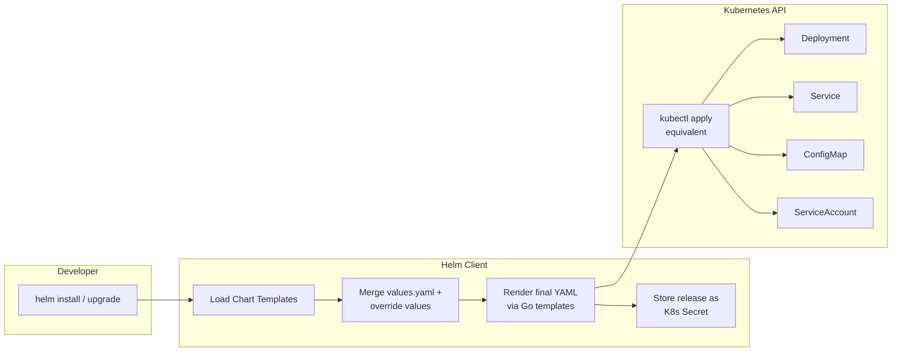
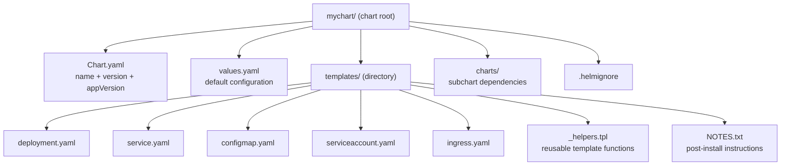
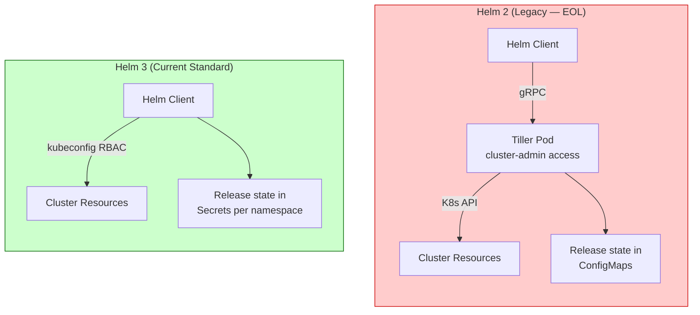
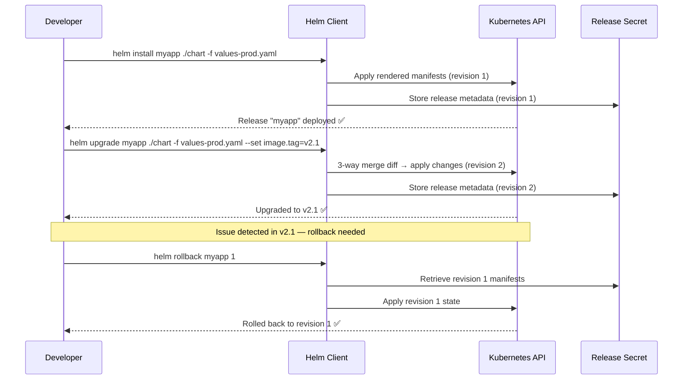

# ⛵ Helm Interview Question 1 — What is Helm and Why Do We Use It?


---

## ❓ The Question

> **"Do you use Helm? Which version are you currently using? And do you see any benefits of using Helm?"**

**Alternate phrasings you may hear:**
- "What is Helm and how does it work?"
- "Why would you use Helm instead of raw Kubernetes YAML files?"
- "What is the difference between Helm 2 and Helm 3?"
- "Explain the concept of a Helm chart."
- "How does Helm help you manage multiple environments like staging and production?"
- "What is a values file in Helm and how do you use it?"

---

## 🎯 Why Interviewers Ask This

This is a classic opening question in DevOps/Kubernetes interviews. It tests whether you have moved beyond raw `kubectl apply` workflows to a mature, repeatable deployment practice. Interviewers ask this to gauge:

- **Kubernetes ecosystem depth**: Do you know the tools that surround the core Kubernetes API?
- **Day-2 operations thinking**: Can you manage deployments across multiple environments, not just create them once?
- **Version awareness**: Are you on current tooling (Helm 3) or still on the legacy Tiller-based Helm 2?
- **Practical experience**: Can you articulate real problems Helm solves rather than reciting marketing copy?

> 💡 **Instant win**: Most candidates say "Helm is a package manager for Kubernetes." You stand out by explaining the **specific problem it solves** — the explosion of YAML files when managing 10+ applications — and how the templating + values file system makes a single chart serve production, staging, and dev with zero code duplication.

---

## 📖 Key Terminologies

| Term | Meaning |
|---|---|
| **Helm** | Package manager for Kubernetes — bundles, versions, and deploys K8s applications as charts |
| **Chart** | A collection of Kubernetes YAML templates packaged together into a single deployable unit |
| **Release** | A running instance of a chart installed into a cluster — `helm install` creates a release |
| **Repository** | A remote server hosting packaged Helm charts (e.g., ArtifactHub, Bitnami, your private registry) |
| **values.yaml** | Default configuration file inside a chart — override values per environment without editing templates |
| **Templates** | Kubernetes YAML files inside a chart that use Go templating syntax (`{{ .Values.image.tag }}`) |
| **Tiller** | Helm 2 server-side component (removed in Helm 3) — was a major security concern |
| **Helm 3** | Current version (2019+) — Tillerless, 3-way merge, namespace-scoped releases |
| **Helm 2** | Legacy version — required Tiller pod with cluster-admin access, now end-of-life |
| **Release Revision** | Each `helm upgrade` increments the revision counter — enables `helm rollback` to any prior revision |
| **Chart.yaml** | Metadata file inside a chart: name, version, appVersion, description, dependencies |
| **Subchart / Dependency** | A chart that another chart depends on (e.g., a parent app chart depends on a `postgresql` subchart) |

---

## 🗣️ How to Answer (Structured)

A strong answer covers what Helm is, the problem it solves, the version you use, and the concrete benefits. Here is a proven structure:

**1. Acknowledge usage and version:**

> "Yes, we use Helm in our organization, and we are currently running Helm 3. Helm 3 is the standard — it removed the Tiller component from Helm 2 which was a serious security risk, and it added proper 3-way strategic merge for upgrades."

**2. Define the core problem Helm solves:**

> "In Kubernetes, even a single application typically requires multiple YAML files — a Deployment, a Service, a ConfigMap, a ServiceAccount, maybe an HPA and an Ingress. Once you multiply that by 15 or 20 microservices, you're managing hundreds of YAML files manually. That becomes extremely difficult to maintain consistently, especially across different environments."

**3. Explain how Helm charts address that:**

> "Helm solves this by packaging all those files into a single chart with a templating layer on top. Instead of hardcoding image tags, replica counts, or resource limits for each environment, you define them as variables in a `values.yaml` file. You have one chart, and you override the values file at deploy time — `values-prod.yaml`, `values-staging.yaml`, `values-dev.yaml`. The chart itself never changes; only the configuration does."

**4. Cover lifecycle benefits:**

> "Beyond initial deployment, Helm gives you versioned releases. Every `helm upgrade` creates a new revision, so `helm rollback my-app 3` takes you exactly back to revision 3 in seconds — no manual YAML diffs needed. You also get `helm diff` (via plugin) to preview what will change before applying, which is invaluable in production."

**5. Mention the ecosystem:**

> "There's also a huge chart ecosystem — ArtifactHub hosts thousands of community charts for standard software like Nginx, PostgreSQL, Prometheus, and Grafana. Instead of writing those deployments from scratch, I just pull the Bitnami or community chart and customize the values for our environment."

---

## 🔐 Security Perspective (DevSecOps)

| Risk | Helm 2 (Tiller) | Helm 3 (Tillerless) |
|---|---|---|
| **Cluster access** | Tiller ran with `cluster-admin` — anything with network access to Tiller could run arbitrary K8s API calls | No server-side component — access controlled by the user's own kubeconfig/RBAC |
| **Secret storage** | Releases stored as ConfigMaps (readable by anyone in namespace) | Releases stored as Kubernetes Secrets (base64, still not encrypted at rest without additional config) |
| **Supply chain** | Chart provenance not enforced by default | Chart signing supported via `helm verify` and Cosign/OCI |
| **Values exposure** | Sensitive values in `values.yaml` go into source control | Use external secrets (ESO, Vault Agent) — never hardcode secrets in values files |

**Best practices for secure Helm usage (2024):**
```bash
# Use OCI registries for chart storage (immutable, auditable)
helm push mychart/ oci://registry.example.com/charts

# Verify chart provenance before installing
helm verify ./mychart-1.0.0.tgz

# Lint charts in CI before deploying
helm lint ./mychart --strict

# Diff before applying in production
helm diff upgrade my-release ./mychart -f values-prod.yaml

# Namespace-scope service accounts for Helm CI pipelines — never cluster-admin
```

---

## 🖼️ Visuals

### Reference Diagrams (Source: KodeKloud)


*Multiple Kubernetes YAML files (Deployment, Service, ConfigMap, ServiceAccount, etc.) consolidated into a single Helm chart for simplified lifecycle management.*


*One Helm chart serving multiple environments (production, staging, testing) by swapping the values file — no duplication of Kubernetes YAML.*

---

### Architecture: Helm 3 Request Flow



---

### Helm Chart Directory Structure



---

### Helm 2 vs Helm 3 Architecture



---

### Release Lifecycle: Install → Upgrade → Rollback



---

## ⚙️ Hands-On: Core Helm Commands

### Installation

```bash
# Install Helm 3 (Linux / macOS via script)
curl https://raw.githubusercontent.com/helm/helm/main/scripts/get-helm-3 | bash

# Verify
helm version
# output: version.BuildInfo{Version:"v3.15.x", ...}
```

### Working with Repositories

```bash
# Add popular repositories
helm repo add bitnami https://charts.bitnami.com/bitnami
helm repo add stable https://charts.helm.sh/stable
helm repo add prometheus-community https://prometheus-community.github.io/helm-charts

# Update all repos
helm repo update

# Search for a chart
helm search repo nginx
helm search hub wordpress        # search ArtifactHub
```

### Installing and Managing Releases

```bash
# Install a chart with default values
helm install my-nginx bitnami/nginx

# Install with custom values file
helm install my-app ./mychart -f values-prod.yaml -n production --create-namespace

# Install with inline value overrides
helm install my-app ./mychart \
  --set image.tag=v2.1 \
  --set replicaCount=3 \
  --set resources.limits.memory=512Mi

# List all releases
helm list -A              # all namespaces
helm list -n production

# Check release status
helm status my-app -n production

# View rendered manifest without installing (dry run)
helm template my-app ./mychart -f values-prod.yaml

# Dry run with server-side validation
helm install my-app ./mychart --dry-run --debug
```

### Upgrading and Rolling Back

```bash
# Upgrade a release
helm upgrade my-app ./mychart -f values-prod.yaml --set image.tag=v2.2

# Upgrade or install if not exists
helm upgrade --install my-app ./mychart -f values-prod.yaml

# View release history (all revisions)
helm history my-app -n production

# Rollback to previous revision
helm rollback my-app          # previous revision
helm rollback my-app 2        # specific revision

# Rollback with wait (wait for pods to be ready)
helm rollback my-app 2 --wait --timeout 5m
```

### Creating Your Own Chart

```bash
# Scaffold a new chart
helm create myapp

# Lint the chart (catches template errors)
helm lint ./myapp
helm lint ./myapp --strict    # treat warnings as errors

# Package chart into a .tgz archive
helm package ./myapp

# Install from the package
helm install my-release ./myapp-0.1.0.tgz
```

### Uninstalling

```bash
# Uninstall a release (keeps history)
helm uninstall my-app -n production

# Uninstall and wipe history
helm uninstall my-app --keep-history=false
```

---

## 📄 Sample Chart Structure & Templates

### `Chart.yaml`

```yaml
apiVersion: v2
name: myapp
description: A Helm chart for MyApp microservice
type: application
version: 1.3.0          # chart version (semver)
appVersion: "2.1.0"     # application version inside the chart
maintainers:
  - name: Bhargav
    email: devops@example.com
dependencies:
  - name: postgresql
    version: "13.x.x"
    repository: https://charts.bitnami.com/bitnami
    condition: postgresql.enabled
```

### `values.yaml`

```yaml
replicaCount: 2

image:
  repository: myregistry.io/myapp
  tag: "2.1.0"
  pullPolicy: IfNotPresent

service:
  type: ClusterIP
  port: 80
  targetPort: 8080

ingress:
  enabled: true
  host: myapp.example.com
  tlsSecret: myapp-tls

resources:
  limits:
    cpu: "500m"
    memory: "512Mi"
  requests:
    cpu: "100m"
    memory: "128Mi"

autoscaling:
  enabled: false
  minReplicas: 2
  maxReplicas: 10
  targetCPUUtilizationPercentage: 70

postgresql:
  enabled: true
  auth:
    database: myappdb
```

### `templates/deployment.yaml` (with Go templating)

```yaml
apiVersion: apps/v1
kind: Deployment
metadata:
  name: {{ include "myapp.fullname" . }}
  labels:
    {{- include "myapp.labels" . | nindent 4 }}
spec:
  replicas: {{ .Values.replicaCount }}
  selector:
    matchLabels:
      {{- include "myapp.selectorLabels" . | nindent 6 }}
  template:
    metadata:
      labels:
        {{- include "myapp.selectorLabels" . | nindent 8 }}
    spec:
      containers:
        - name: {{ .Chart.Name }}
          image: "{{ .Values.image.repository }}:{{ .Values.image.tag | default .Chart.AppVersion }}"
          imagePullPolicy: {{ .Values.image.pullPolicy }}
          ports:
            - containerPort: {{ .Values.service.targetPort }}
          resources:
            {{- toYaml .Values.resources | nindent 12 }}
```

### Environment-Specific Override Files

```yaml
# values-prod.yaml
replicaCount: 5
image:
  tag: "2.1.0-stable"
resources:
  limits:
    cpu: "2000m"
    memory: "2Gi"
autoscaling:
  enabled: true

# values-dev.yaml
replicaCount: 1
image:
  tag: "latest"
resources:
  limits:
    cpu: "200m"
    memory: "256Mi"
ingress:
  host: myapp-dev.internal.example.com
```

---

## ⚠️ Common Gotchas

| Gotcha | What Goes Wrong | Fix |
|---|---|---|
| **Secrets in values.yaml** | Sensitive data committed to Git | Use `--set` at deploy time, or ESO/Vault to inject secrets |
| **Forgot `helm repo update`** | Installs outdated chart version | Always run `helm repo update` before install/upgrade in CI |
| **Missing `--namespace` flag** | Release installed in `default` namespace by mistake | Always use `-n <namespace> --create-namespace` explicitly |
| **`helm upgrade` wipes manually added resources** | 3-way merge removes resources not in chart | Keep all resources inside Helm — never `kubectl apply` alongside |
| **Chart version vs appVersion confusion** | Bumping wrong version breaks automation | `version` = chart semver; `appVersion` = the app inside it |
| **Dependency charts not fetched** | `helm install` fails with missing charts/ dir | Run `helm dependency update ./mychart` before install |
| **Helm 2 Tiller still in cluster** | Old Tiller running with cluster-admin is a live vulnerability | Remove Tiller: `helm reset --force`, migrate to Helm 3 |
| **Dry run passes but real install fails** | `--dry-run` is client-side only in Helm 3 | Use `--dry-run=server` (Helm 3.13+) for admission webhook validation |

---

## ✅ Best Practices (2024)

1. **Store charts in OCI registries** — use `helm push` to ECR, GHCR, or Harbor instead of HTTP chart repos for better immutability and access control.
2. **Use `helm upgrade --install`** in CI/CD pipelines — idempotent, works for both first deploy and updates.
3. **Always lint and diff in CI** — run `helm lint --strict` and `helm diff upgrade` before any production apply.
4. **Separate values files per environment** — `values.yaml` for defaults, `values-prod.yaml` / `values-staging.yaml` for overrides.
5. **Never store secrets in values files** — use Kubernetes Secrets created by ESO, Vault Agent, or passed via `--set` from a CI secret store.
6. **Pin chart versions explicitly** — in `Chart.yaml` dependencies and CI pipelines, use exact versions, not floating ranges.
7. **Set `--atomic` on production upgrades** — `helm upgrade --atomic` auto-rollbacks if upgrade fails to reach ready state.
8. **Use `helm test`** — add test hooks in `templates/tests/` to validate the release after deployment.

---

## 🌍 Real-World Scenario

**Scenario**: Your team manages 18 microservices across 3 environments (dev, staging, prod). Previously, each had its own set of YAML files — a total of ~270 Kubernetes manifests. Any image tag update required editing each file individually. A values mismatch between staging and prod caused a silent config drift that led to an incident.

**How Helm fixes this**:

```
Before Helm:
├── service-a/
│   ├── deployment-dev.yaml
│   ├── deployment-staging.yaml
│   ├── deployment-prod.yaml     ← 3 files per service × 18 = 54 deployment files
│   ├── service-dev.yaml
│   └── ...270 total files

After Helm:
├── service-a-chart/
│   ├── Chart.yaml
│   ├── values.yaml              ← shared defaults
│   ├── values-dev.yaml          ← 5-line overrides
│   ├── values-staging.yaml
│   ├── values-prod.yaml
│   └── templates/               ← single set of templates, all environments
```

- Image tag updates: change one line in `values-prod.yaml`, CI runs `helm upgrade --install`
- Config drift eliminated: templates are identical for all environments
- Rollback: `helm rollback service-a 4` — back to any previous state in seconds
- Audit trail: `helm history service-a` shows every deploy with timestamp and chart version

---

## 🔄 Helm vs Alternatives

| Tool | Approach | Best For |
|---|---|---|
| **Helm 3** | Template + values override | Complex apps with many Kubernetes resources; lifecycle management (install/upgrade/rollback) |
| **Kustomize** | YAML overlay patches (no templating) | GitOps workflows; simpler apps; built into `kubectl` (no extra binary) |
| **Helm + Kustomize** | Helm renders base, Kustomize patches on top | ArgoCD/Flux GitOps where final manifests must be stored in Git |
| **Raw kubectl** | Direct YAML apply | Quick one-off debugging; not suitable for multi-environment production |
| **Terraform Helm provider** | Terraform manages Helm releases as resources | When infrastructure and app deployments are managed in the same Terraform state |
| **ArgoCD ApplicationSet** | Git-based continuous delivery on top of Helm | GitOps pattern; self-healing deployments; multi-cluster rollouts |

---

## 📋 Quick Reference Cheat Sheet

```bash
# --- Repository Management ---
helm repo add <name> <url>
helm repo update
helm search repo <keyword>

# --- Release Lifecycle ---
helm install <release> <chart> -f values.yaml -n <ns> --create-namespace
helm upgrade --install <release> <chart> -f values.yaml --atomic --timeout 5m
helm rollback <release> [revision]
helm uninstall <release> -n <ns>

# --- Inspection ---
helm list -A
helm status <release> -n <ns>
helm history <release> -n <ns>
helm get values <release> -n <ns>         # see current values
helm get manifest <release> -n <ns>       # see rendered YAML

# --- Development ---
helm create <chart>
helm lint ./chart --strict
helm template <release> ./chart -f values.yaml   # render without installing
helm install <release> ./chart --dry-run --debug  # client-side dry run
helm package ./chart

# --- Plugin essentials ---
helm plugin install https://github.com/databus23/helm-diff
helm diff upgrade <release> ./chart -f values.yaml
```

---

## 🧠 Summary

| Concept | One-Liner |
|---|---|
| **What Helm is** | Kubernetes package manager — bundles all K8s YAML into a versioned, templated chart |
| **Core problem solved** | Eliminates YAML sprawl and manual per-environment file management |
| **Helm 3 vs Helm 2** | Helm 3 removed Tiller (no more cluster-admin security hole), added 3-way merge |
| **Chart** | Directory of Go-templated K8s manifests + `Chart.yaml` + `values.yaml` |
| **Release** | A named running instance of a chart in a namespace; tracked with revisions |
| **values.yaml** | Default config — override with `-f values-prod.yaml` or `--set key=val` |
| **Key benefit** | One chart → many environments; `helm rollback` for instant recovery |
| **Security note** | Never put secrets in values files; use `--set` from CI vault or ESO |
| **Current best practice** | Store charts in OCI registries; use `helm upgrade --install --atomic` in CI |
