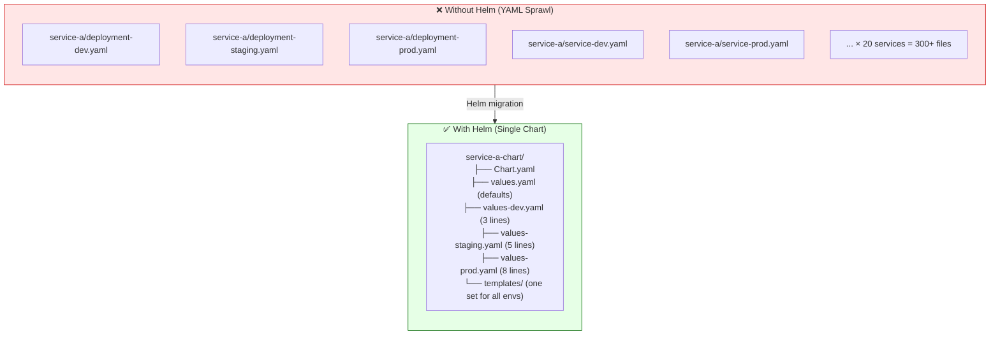
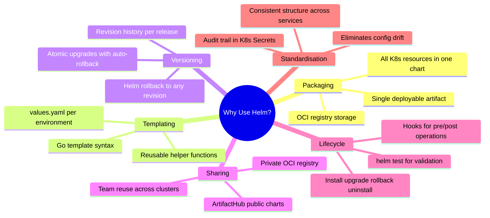
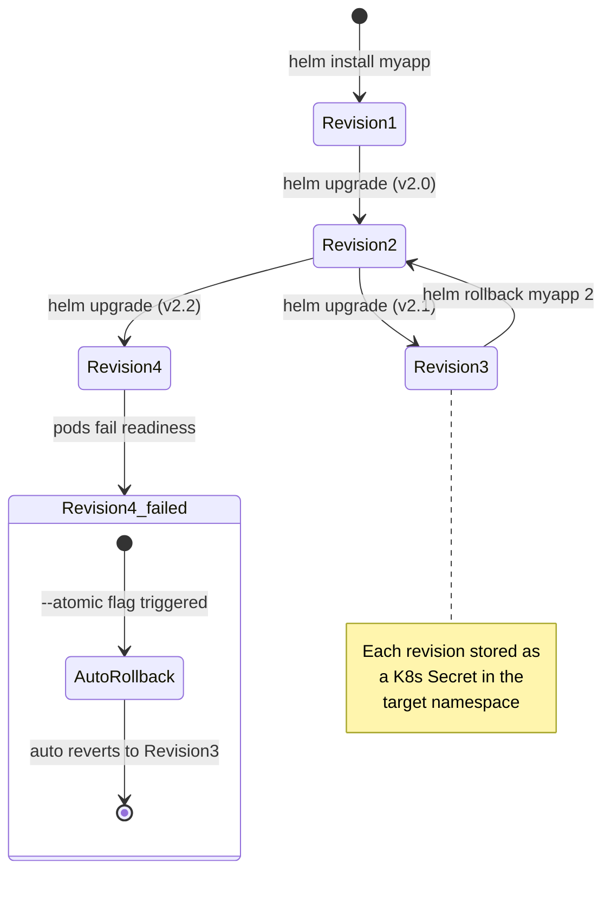
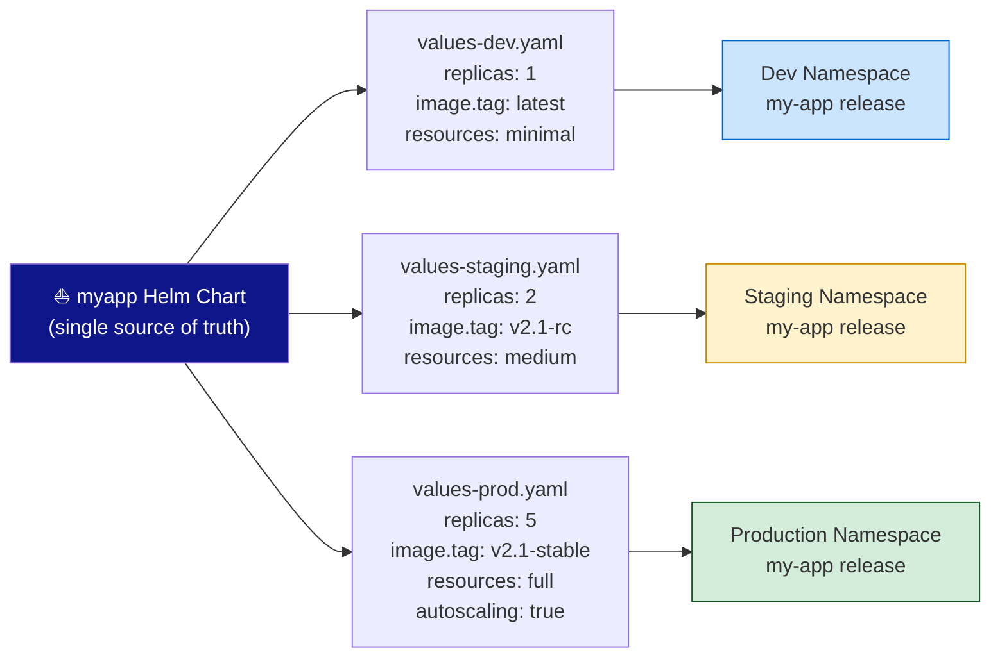

# ⛵ Helm Interview Question 2 — Why Use Helm in Kubernetes?


---

## ❓ The Question

> **"Why would you use Helm instead of plain Kubernetes YAML files? What specific problems does it solve?"**

**Alternate phrasings you may hear:**
- "What are the key benefits of Helm for managing Kubernetes applications?"
- "Our team currently manages apps with raw `kubectl apply` — should we migrate to Helm?"
- "How does Helm help when you have many microservices in a cluster?"
- "Can you explain Helm's rollback mechanism and when you would use it?"
- "How does Helm support version control and application sharing across teams?"
- "What is the difference between Helm install and Helm upgrade?"

---

## 🎯 Why Interviewers Ask This

This question digs deeper than "what is Helm" — it tests whether you understand the **operational pain points** that Helm was built to solve. Interviewers want to know:

- **Problem-first thinking**: Can you articulate the real-world friction before jumping to the solution?
- **Day-2 operations maturity**: Do you think about upgrades, rollbacks, and drift — not just initial deployment?
- **Team workflow awareness**: Do you understand how Helm enables sharing configs across teams and environments?
- **Practical judgment**: Can you explain when Helm is the right tool versus when it adds unnecessary complexity?

> 💡 **Instant win**: Most candidates list generic benefits like "easier deployment." You stand out by describing a **concrete before-and-after scenario** — "before Helm we had 200 YAML files across 3 environments with frequent config drift; after Helm we have one chart per service, environment overrides in three value files, and rollback takes 10 seconds instead of 30 minutes."

---

## 📖 Key Terminologies

| Term | Meaning |
|---|---|
| **YAML sprawl** | The problem of having dozens/hundreds of unmanaged Kubernetes manifests with no versioning or templating |
| **Config drift** | When the live cluster state diverges from what's stored in Git — a silent reliability risk |
| **Idempotency** | Running the same Helm command multiple times produces the same result — safe for CI/CD pipelines |
| **Helm chart** | A self-contained package of all K8s resources an application needs, with a templating layer |
| **Release revision** | An integer that increments on every `helm upgrade` — the basis for `helm rollback` |
| **Atomic upgrade** | `--atomic` flag: if upgrade fails, Helm auto-rollbacks to the last successful revision |
| **3-way strategic merge** | Helm 3's diff algorithm — compares old chart + live state + new chart to compute the minimal change set |
| **ArtifactHub** | The public Helm chart registry at artifacthub.io — thousands of community charts |
| **Umbrella chart** | A parent Helm chart whose only job is to bundle multiple sub-charts (microservices) into one deployable unit |
| **Post-install hook** | A Kubernetes Job defined in Helm templates that runs automatically after a release is installed |

---

## 🗣️ How to Answer (Structured)

**1. Start with the pain point (without Helm):**

> "Without Helm, deploying even one application in Kubernetes means maintaining individual YAML files for each resource — a Deployment, Service, ConfigMap, ServiceAccount, HPA, Ingress, and maybe a NetworkPolicy. For a single service that's 6–8 files. Scale to 20 microservices and you're managing 150+ YAML files. Each environment — dev, staging, production — either gets its own copy of every file (300+ files, all at risk of drifting out of sync) or developers hand-edit the same file and forget to revert changes. Either way, this becomes unmaintainable fast."

**2. Explain the packaging benefit:**

> "Helm solves this by packaging all those resources into a single Helm chart. The chart has one canonical set of templates, and a values file controls what changes per environment. I run `helm install --values values-prod.yaml` and Helm renders all the templates with the right values and sends them to Kubernetes. One source of truth."

**3. Cover versioning and rollback:**

> "Every deployment creates a numbered revision tracked as a Kubernetes Secret. If production breaks after an upgrade, I run `helm rollback myapp` and I'm back to the last known good state in under a minute — no manual YAML recovery needed. With raw kubectl, I'd have to find the right file version in Git, verify the diff, and re-apply carefully."

**4. Mention sharing and reuse:**

> "Helm charts are shareable artifacts. I can push a chart to our internal OCI registry, and another team or another cluster installs it with `helm install` — no copy-pasting YAML. The whole DevOps community publishes charts on ArtifactHub, so for off-the-shelf software like PostgreSQL, Prometheus, or Nginx, I pull the community chart and just override the values for our environment."

**5. Add the atomic flag for production safety:**

> "For production upgrades specifically, I always use `--atomic`. If the new pods don't reach Ready state within the timeout, Helm automatically rolls back. This means a bad deploy never leaves the cluster in a broken half-upgraded state."

---

## 🔐 Security Perspective (DevSecOps)

**Before Helm (raw YAML):**
- Secrets often hardcoded in YAML or environment variables committed to Git
- No audit trail of who deployed what version and when
- Config drift between environments makes security baseline audits unreliable
- Rolling back a compromised deployment requires manual Git archaeology

**With Helm (security improvements):**

```bash
# Audit full deployment history with timestamps and deployer info
helm history myapp -n production
# REVISION  UPDATED                   STATUS      CHART         APP VERSION  DESCRIPTION
# 1         Mon Jan 06 09:12:00 2025  superseded  myapp-1.0.0   2.0.0        Install complete
# 2         Wed Jan 08 14:30:00 2025  deployed    myapp-1.1.0   2.1.0        Upgrade complete

# Instantly roll back a release with a compromised image tag
helm rollback myapp 1 -n production --wait

# Scan chart templates for misconfigurations before deploying
helm template myapp ./chart -f values-prod.yaml | kubesec scan -
helm template myapp ./chart -f values-prod.yaml | checkov -d - --framework kubernetes
```

**DevSecOps Helm pipeline pattern:**
```yaml
# CI/CD pipeline stages for secure Helm deployment
stages:
  - lint          # helm lint --strict
  - security-scan # trivy + kubesec on rendered manifests
  - diff          # helm diff upgrade (review what changes)
  - deploy        # helm upgrade --install --atomic --wait
  - test          # helm test (validate post-deploy)
```

---

## 🖼️ Visuals

### Reference Diagram (Source: KodeKloud)


*Helm Charts assist in managing Kubernetes applications by simplifying the process of defining, installing, and upgrading them — replacing the complexity of multiple individual YAML files with a single well-structured package.*

---

### The YAML Sprawl Problem vs Helm Solution



---

### Helm Benefits Breakdown



---

### Helm Release Revision Model



---

### Multi-Environment Deployment with Single Chart



---

## ⚙️ Hands-On: Demonstrating Helm Benefits

### Benefit 1 — Simplified Packaging and Deployment

```bash
# Without Helm: apply every file individually, order matters
kubectl apply -f serviceaccount.yaml
kubectl apply -f configmap.yaml
kubectl apply -f secret.yaml
kubectl apply -f deployment.yaml
kubectl apply -f service.yaml
kubectl apply -f ingress.yaml
kubectl apply -f hpa.yaml
# Miss one file? Or apply in wrong order? Good luck debugging.

# With Helm: single command, Helm handles ordering via install ordering
helm upgrade --install myapp ./myapp-chart \
  -f values-prod.yaml \
  -n production \
  --create-namespace \
  --wait \
  --timeout 5m
```

### Benefit 2 — Version Control and Audit Trail

```bash
# See the full deployment history for a release
helm history myapp -n production

# Example output:
# REVISION  UPDATED                   STATUS      CHART          APP VERSION  DESCRIPTION
# 1         2025-01-06 09:12:00       superseded  myapp-1.0.0    2.0.0        Install complete
# 2         2025-01-08 14:30:00       superseded  myapp-1.1.0    2.1.0        Upgrade complete
# 3         2025-01-15 10:05:00       deployed    myapp-1.2.0    2.2.0        Upgrade complete

# Inspect exactly what values were used in a specific revision
helm get values myapp --revision 2 -n production

# Inspect the full rendered manifests of a specific revision
helm get manifest myapp --revision 2 -n production
```

### Benefit 3 — Easy Rollback

```bash
# Production incident at 3am — new image version is crashing
# Without Helm: git log, find old commit, checkout, kubectl apply --dry-run, apply...
# Takes 20-40 minutes under pressure

# With Helm: one command, back in 30 seconds
helm rollback myapp -n production     # rollback to previous revision
helm rollback myapp 2 -n production   # rollback to specific revision

# Verify rollback completed
helm status myapp -n production
kubectl get pods -n production -w
```

### Benefit 4 — Sharing via Chart Repositories

```bash
# Use a community chart instead of writing your own PostgreSQL deployment
helm repo add bitnami https://charts.bitnami.com/bitnami
helm repo update

# Show available chart versions
helm search repo bitnami/postgresql --versions | head -10

# Deploy PostgreSQL with custom values
helm upgrade --install postgres bitnami/postgresql \
  --set auth.postgresPassword=secretpassword \
  --set auth.database=myappdb \
  --set primary.persistence.size=50Gi \
  -n database \
  --create-namespace

# Share your internal chart via OCI registry
helm package ./myapp-chart
helm push myapp-1.2.0.tgz oci://registry.example.com/helm-charts

# Another team installs it
helm upgrade --install their-app oci://registry.example.com/helm-charts/myapp:1.2.0 \
  -f their-values.yaml
```

### Benefit 5 — Atomic Upgrades (No Half-Broken States)

```bash
# Production upgrade with safety net
helm upgrade myapp ./myapp-chart \
  -f values-prod.yaml \
  -n production \
  --atomic \          # auto-rollback if pods don't become ready
  --wait \            # wait for all resources to be ready
  --timeout 10m \     # how long to wait before triggering rollback
  --cleanup-on-fail   # clean up newly created resources on failure

# Preview what will change BEFORE upgrading (requires helm-diff plugin)
helm plugin install https://github.com/databus23/helm-diff
helm diff upgrade myapp ./myapp-chart -f values-prod.yaml -n production
```

### Benefit 6 — Managing Multiple Applications via Umbrella Chart

```bash
# Deploy an entire application stack (all microservices) with one chart
# Umbrella chart structure:
# platform/
# ├── Chart.yaml
# ├── values.yaml
# └── charts/
#     ├── frontend/
#     ├── api-gateway/
#     ├── user-service/
#     ├── order-service/
#     └── notification-service/

helm upgrade --install platform ./platform \
  -f values-prod.yaml \
  -n production

# Or enable/disable services per environment
helm upgrade --install platform ./platform \
  -f values-dev.yaml \
  --set "user-service.enabled=true" \
  --set "notification-service.enabled=false" \
  -n dev
```

---

## 📄 Real Chart Values — Before and After

### Before Helm: Hardcoded Deployment YAML (fragile)

```yaml
# deployment-prod.yaml — manually maintained, duplicated for each env
apiVersion: apps/v1
kind: Deployment
metadata:
  name: myapp-prod         # hardcoded name
spec:
  replicas: 5              # hardcoded, must be manually changed for staging/dev
  template:
    spec:
      containers:
        - name: myapp
          image: myregistry.io/myapp:v2.2.0  # must manually update every release
          resources:
            limits:
              cpu: "2000m"   # hardcoded, different for staging
              memory: "2Gi"  # hardcoded, different for staging
```

### After Helm: Templated + Values-Driven (flexible)

```yaml
# templates/deployment.yaml — one file, works for all environments
apiVersion: apps/v1
kind: Deployment
metadata:
  name: {{ include "myapp.fullname" . }}
spec:
  replicas: {{ .Values.replicaCount }}
  template:
    spec:
      containers:
        - name: {{ .Chart.Name }}
          image: "{{ .Values.image.repository }}:{{ .Values.image.tag }}"
          resources:
            {{- toYaml .Values.resources | nindent 12 }}
```

```yaml
# values-prod.yaml — environment override (only what differs)
replicaCount: 5
image:
  tag: "v2.2.0"
resources:
  limits:
    cpu: "2000m"
    memory: "2Gi"

# values-staging.yaml
replicaCount: 2
image:
  tag: "v2.2.0-rc"
resources:
  limits:
    cpu: "500m"
    memory: "512Mi"
```

---

## ⚠️ Common Gotchas

| Gotcha | Problem | Solution |
|---|---|---|
| **Skipping `helm repo update`** | CI installs an old chart version silently | Run `helm repo update` at the start of every pipeline |
| **Not using `--wait`** | `helm upgrade` returns success before pods are ready — misleading green build | Always add `--wait --timeout 5m` in production pipelines |
| **Mixing Helm and `kubectl apply`** | Resources not in the chart get orphaned or clash with Helm's state | All K8s resources for an app should be owned by Helm or not at all |
| **Storing secrets in values files** | Passwords committed to Git — major security incident | Use `--set` from CI secret store, or External Secrets Operator |
| **Ignoring `helm test`** | Deploy "succeeds" but the app is broken | Write a test hook Job that validates the endpoint is reachable |
| **Not pinning chart versions in CI** | `helm upgrade ... bitnami/postgresql` pulls latest — breaking change on next run | Always specify `--version 13.2.1` explicitly |
| **Large values files with no comments** | New team members don't know what values do what | Document every values.yaml key with inline YAML comments |

---

## ✅ Best Practices (2024)

1. **Treat charts as code** — store them in Git alongside the application source; version the chart alongside the app.
2. **Always use `--atomic --wait` in production CI** — never leave the cluster in a half-upgraded state.
3. **Use `helm diff` before every production upgrade** — deploy surgeons always review the incision before cutting.
4. **Separate concerns**: application chart (your team owns) vs infrastructure chart (platform team owns) — avoid a monolithic umbrella chart that mixes both.
5. **Test charts with `helm test`** — add a simple HTTP check Job in `templates/tests/` to validate each release.
6. **Use `.helmignore`** to exclude test files, CI scripts, and READMEs from packaged charts.
7. **Validate schema** — add a `values.schema.json` to your chart so Helm validates the values file structure and rejects unknown or wrong-type keys at install time.

---

## 🌍 Real-World Scenario

**Scenario**: A fintech startup has 12 microservices deployed with raw YAML across 3 environments (dev/staging/prod). On a Friday afternoon, a developer deploys a broken image tag to production by accidentally running the dev command against prod. Recovery took 45 minutes of manual YAML archaeology.

**Post-incident Helm adoption:**

```
Problem 1 — Wrong environment target:
  Fix: helm upgrade --install myapp ./chart -f values-PROD.yaml -n production
  The values file name makes the environment explicit. CI pipeline enforces namespace checks.

Problem 2 — 45-minute recovery:
  Fix: helm rollback myapp -n production --wait
  Recovery time: under 60 seconds to previous known-good revision.

Problem 3 — Config drift between environments:
  Fix: Single chart, three values override files. Diff between environments is explicit and version-controlled.

Problem 4 — No audit trail:
  Fix: helm history myapp -n production
  Shows every deployment with timestamp, chart version, and description.
```

---

## 🔄 Helm Benefits Summary Table

| Benefit | Without Helm | With Helm |
|---|---|---|
| **Deployment** | `kubectl apply` each file individually | `helm upgrade --install` — one command |
| **Environments** | Duplicate YAML per environment (config drift risk) | Single chart + values overrides per env |
| **Versioning** | Git commits only — no live deployment tracking | Revision history in K8s Secrets, `helm history` |
| **Rollback** | Manual Git archaeology + kubectl apply | `helm rollback myapp` — 30 seconds |
| **Sharing** | Copy-paste YAML between teams | Publish chart to OCI registry, `helm install` |
| **Safety** | Partial deployments leave cluster broken | `--atomic` auto-rollbacks failed upgrades |
| **Audit** | No record of live deployment state | `helm get values/manifest --revision N` |
| **Reuse** | Write every app manifest from scratch | Pull community charts from ArtifactHub |

---

## 📋 Quick Reference — Helm Benefits Commands

```bash
# Packaging — deploy everything at once
helm upgrade --install myapp ./chart -f values-prod.yaml -n production --create-namespace

# Versioning — see all revisions
helm history myapp -n production

# Rollback — instant recovery
helm rollback myapp -n production             # to previous
helm rollback myapp 2 -n production           # to revision 2

# Sharing — push and pull via OCI
helm push myapp-1.2.0.tgz oci://registry.example.com/charts
helm upgrade --install myapp oci://registry.example.com/charts/myapp:1.2.0

# Safety — atomic upgrade
helm upgrade myapp ./chart -f values-prod.yaml --atomic --wait --timeout 5m

# Preview before applying
helm diff upgrade myapp ./chart -f values-prod.yaml -n production

# Validate after deploying
helm test myapp -n production
```

---

## 🧠 Summary

| Concept | One-Liner |
|---|---|
| **Core problem** | YAML sprawl — 150+ files across environments leads to drift, errors, and unmanageable complexity |
| **Packaging** | One Helm chart replaces N environment-specific YAML copies |
| **Templating** | Go templates + values files = one chart serves all environments |
| **Versioning** | Every deploy creates a revision — full history queryable with `helm history` |
| **Rollback** | `helm rollback` restores any previous revision in seconds |
| **Sharing** | Charts published to OCI registries or ArtifactHub for reuse across teams |
| **Atomic upgrades** | `--atomic` auto-rollbacks failed deployments — no half-broken cluster states |
| **Community ecosystem** | ArtifactHub hosts thousands of charts for standard software — no reinventing the wheel |
| **DevSecOps fit** | Helm history + diff + lint + test = complete auditable deployment pipeline |
