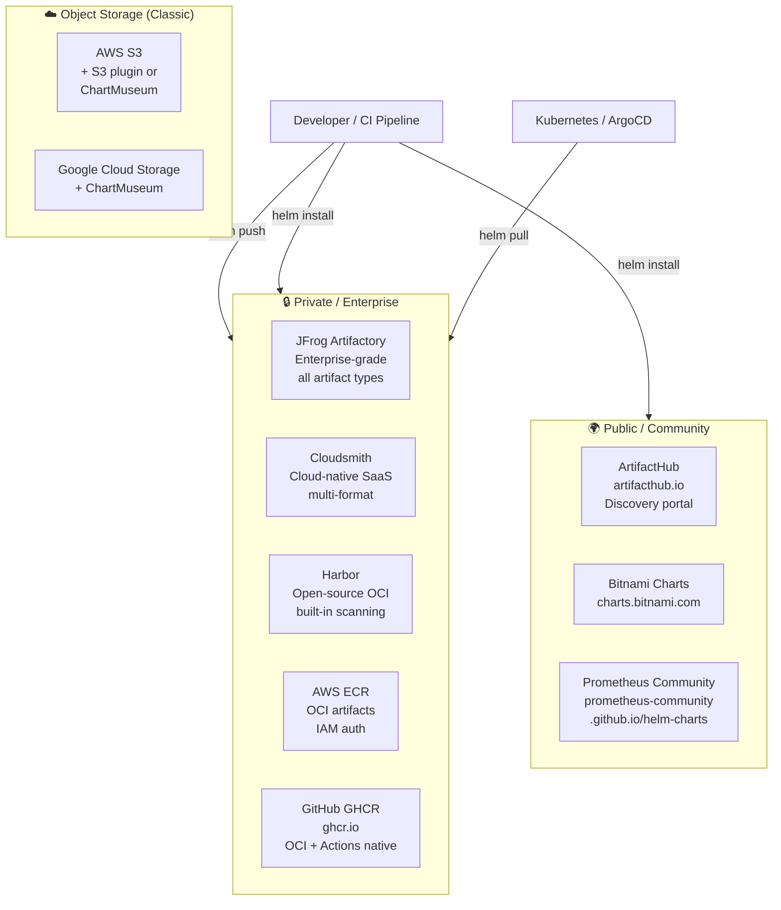
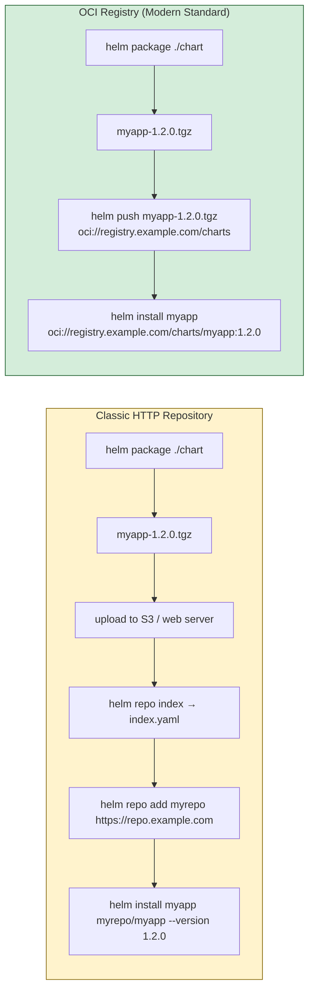
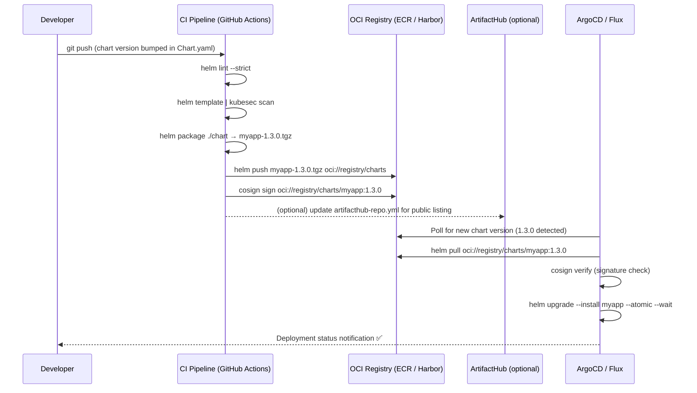

# ⛵ Helm Interview Question 3 — Helm Chart Repositories


---

## ❓ The Question

> **"Which Helm repository do you use to store and access your Helm charts?"**

**Alternate phrasings you may hear:**
- "Where do you store your Helm charts in production?"
- "How do you share Helm charts across teams or clusters?"
- "What is ArtifactHub and how does it differ from a private chart repository?"
- "How do you version Helm charts in your organization?"
- "What is the difference between a classic Helm HTTP repository and an OCI registry?"
- "How would you set up a private Helm chart repository on AWS?"

---

## 🎯 Why Interviewers Ask This

This question tests your understanding of Helm's **distribution and versioning model** — the piece that makes Helm usable at scale across teams and environments. Interviewers ask this to check:

- **Tooling maturity**: Do you use an ad-hoc file share, or a proper versioned repository with access control?
- **Cloud platform alignment**: AWS shops expect familiarity with ECR OCI or S3-backed repos; enterprise shops expect JFrog or Nexus.
- **OCI awareness**: The industry shifted from HTTP chart repos to OCI registries post-2021. Knowing this signals that you follow Helm's evolution.
- **Supply chain thinking**: Do you understand why chart versioning and provenance matter for rollback reliability?

> 💡 **Instant win**: Most candidates say "we use ArtifactHub" (which is for **discovering** public charts, not storing private ones) or "we store charts in Git" (no versioning/distribution mechanism). You stand out by naming your organization's **private repository** (JFrog, ECR, Harbor) and explaining how chart versioning enables reliable rollbacks and multi-team sharing.

---

## 📖 Key Terminologies

| Term | Meaning |
|---|---|
| **Helm repository** | A server that hosts packaged Helm charts (`.tgz` files) with an `index.yaml` catalog |
| **index.yaml** | Auto-generated catalog file in a classic HTTP repo listing all charts and versions |
| **OCI registry** | Open Container Initiative registry — stores Helm charts as OCI artifacts alongside container images (ECR, GHCR, Harbor, Docker Hub) |
| **ArtifactHub** | Public discovery portal (artifacthub.io) — indexes thousands of open-source Helm charts from many repos |
| **JFrog Artifactory** | Enterprise artifact repository supporting Helm, Docker, npm, Maven, and more with RBAC and audit logs |
| **Cloudsmith** | Cloud-native package management SaaS — supports Helm, Docker, and 20+ formats with geo-replication |
| **Harbor** | Open-source OCI registry with built-in Helm chart support, vulnerability scanning, and RBAC |
| **AWS ECR** | Elastic Container Registry — supports OCI artifacts including Helm charts (no extra infrastructure) |
| **`helm package`** | Command that bundles a chart directory into a versioned `.tgz` archive ready for upload |
| **Chart version** | Semantic version in `Chart.yaml` — incremented on every chart change; independent of `appVersion` |
| **`helm repo index`** | Generates the `index.yaml` for a classic HTTP repository from a directory of `.tgz` files |
| **Provenance file** | `.prov` file generated by `helm package --sign` — contains cryptographic signature for chart integrity verification |

---

## 🗣️ How to Answer (Structured)

**1. Anchor on your actual (or studied) tool:**

> "In our organization we use JFrog Artifactory as our central artifact repository. It hosts our Helm charts alongside our Docker images, giving us a single access-controlled artifact store with a full audit trail. Our CI pipeline packages the chart with `helm package`, pushes it to Artifactory, and our ArgoCD deployment picks it up by chart name and version."

**2. Distinguish private vs public:**

> "For our own application charts we use our private registry. For third-party open-source charts — databases, monitoring tools, ingress controllers — we pull from community repositories indexed on ArtifactHub. ArtifactHub itself is a discovery portal; the actual charts live on publishers' own servers or OCI registries."

**3. Mention OCI as the modern standard:**

> "Helm 3.8+ supports OCI registries natively, which is the direction the ecosystem is moving. Instead of maintaining a separate Helm chart server, we push charts to our existing ECR or Harbor OCI registry with `helm push`. The big win is that OCI registries give us immutable tags, content-addressable storage, and the same security scanning pipeline we already run for container images."

**4. Cover versioning and why it matters:**

> "Every chart we publish has a semantic version in `Chart.yaml`. Our CI increments the chart version on every merge to main. This means when we need to rollback a production deployment, `helm rollback` can reference any prior chart version stored in the repository — it's not dependent on the live cluster state alone."

---

## 🔐 Security Perspective (DevSecOps)

**Repository security checklist:**

| Control | Classic HTTP Repo | OCI Registry (ECR/Harbor) |
|---|---|---|
| **Authentication** | Basic auth or token | IAM roles / OIDC / robot accounts |
| **Authorization** | Coarse-grained (read/write) | Fine-grained RBAC per repository |
| **Immutability** | Not enforced — charts can be overwritten | Immutable tags supported — published chart cannot be replaced |
| **Vulnerability scanning** | Manual or external tooling | Native scanning (ECR Inspector, Harbor Trivy) |
| **Audit logging** | Depends on tool | Full pull/push audit in CloudTrail (ECR) or Harbor events |
| **Provenance** | `helm package --sign` → `.prov` file | Cosign OCI signing — keyless OIDC-based signatures |
| **Supply chain** | No built-in SBOM | Attach SBOM as OCI artifact alongside chart |

```bash
# Sign a chart with Cosign (keyless — no GPG key management)
helm package ./myapp-chart
cosign sign --yes oci://registry.example.com/charts/myapp:1.2.0

# Verify before installing in a security-conscious pipeline
cosign verify oci://registry.example.com/charts/myapp:1.2.0 \
  --certificate-identity-regexp="https://github.com/myorg/myrepo" \
  --certificate-oidc-issuer="https://token.actions.githubusercontent.com"
```

---

## 🖼️ Visuals

### Reference Diagram (Source: KodeKloud)


*Popular Helm chart storage services: Cloudsmith, JFrog Artifactory, AWS S3, and Google Cloud Storage — alongside ArtifactHub for open-source chart discovery.*

---

### Helm Repository Ecosystem



---

### Classic HTTP Repo vs OCI Registry



---

### CI/CD Chart Publish → Deploy Pipeline



---

## ⚙️ Hands-On: Working with Helm Repositories

### Classic HTTP Repository (ArtifactHub / Bitnami)

```bash
# Add and update community repositories
helm repo add bitnami https://charts.bitnami.com/bitnami
helm repo add prometheus-community https://prometheus-community.github.io/helm-charts
helm repo add ingress-nginx https://kubernetes.github.io/ingress-nginx
helm repo update

# List all configured repos
helm repo list

# Search ArtifactHub for a chart
helm search hub tomcat
helm search hub postgresql --max-col-width 60

# Search within added repos
helm search repo bitnami/nginx
helm search repo postgresql --versions   # show all available versions

# Install a specific chart version
helm install my-release bitnami/tomcat --version 10.8.6

# Inspect chart before installing
helm show chart bitnami/postgresql
helm show values bitnami/postgresql      # see all configurable values
helm show readme bitnami/postgresql

# Clean up
helm delete my-release
```

### OCI Registry — AWS ECR

```bash
# Authenticate to ECR
aws ecr get-login-password --region us-east-1 | \
  helm registry login --username AWS \
  --password-stdin 123456789012.dkr.ecr.us-east-1.amazonaws.com

# Create an ECR repository for charts
aws ecr create-repository \
  --repository-name helm-charts/myapp \
  --region us-east-1

# Package and push
helm package ./myapp-chart    # creates myapp-1.3.0.tgz
helm push myapp-1.3.0.tgz \
  oci://123456789012.dkr.ecr.us-east-1.amazonaws.com/helm-charts

# Pull and install directly from ECR
helm upgrade --install myapp \
  oci://123456789012.dkr.ecr.us-east-1.amazonaws.com/helm-charts/myapp \
  --version 1.3.0 \
  -f values-prod.yaml \
  -n production \
  --create-namespace

# List chart versions in ECR
aws ecr describe-images \
  --repository-name helm-charts/myapp \
  --region us-east-1 \
  --query 'imageDetails[*].imageTags'
```

### OCI Registry — GitHub Container Registry (GHCR)

```bash
# Authenticate
echo $GITHUB_TOKEN | helm registry login ghcr.io \
  --username myorg \
  --password-stdin

# Push chart
helm push myapp-1.3.0.tgz oci://ghcr.io/myorg/helm-charts

# Install
helm upgrade --install myapp \
  oci://ghcr.io/myorg/helm-charts/myapp:1.3.0 \
  -f values-prod.yaml

# Make public (set package visibility in GitHub settings)
```

### OCI Registry — Harbor (Self-Hosted)

```bash
# Login to Harbor
helm registry login harbor.example.com \
  --username admin \
  --password <password>

# Push to a Harbor project
helm push myapp-1.3.0.tgz oci://harbor.example.com/myproject/helm-charts

# Pull
helm pull oci://harbor.example.com/myproject/helm-charts/myapp --version 1.3.0

# Harbor also supports classic HTTP chart repo URL:
helm repo add myproject https://harbor.example.com/chartrepo/myproject \
  --username admin --password <password>
```

### S3-Backed Repository with ChartMuseum

```bash
# Install ChartMuseum (chart server that uses S3 as backend)
helm repo add chartmuseum https://chartmuseum.github.io/charts
helm upgrade --install chartmuseum chartmuseum/chartmuseum \
  --set env.open.STORAGE=amazon \
  --set env.open.STORAGE_AMAZON_BUCKET=my-helm-charts \
  --set env.open.STORAGE_AMAZON_REGION=us-east-1 \
  --set env.open.STORAGE_AMAZON_PREFIX=charts/ \
  -n chartmuseum --create-namespace

# Install the push plugin
helm plugin install https://github.com/chartmuseum/helm-push

# Push chart to ChartMuseum
helm cm-push ./myapp-chart http://chartmuseum.example.com \
  --username user --password pass

# Use as a repo
helm repo add myorg http://chartmuseum.example.com
helm install myapp myorg/myapp --version 1.3.0
```

### JFrog Artifactory

```bash
# Add Artifactory Helm repo
helm repo add artifactory \
  https://myorg.jfrog.io/artifactory/helm-local \
  --username <user> \
  --password <api-key>

helm repo update

# Install from Artifactory
helm upgrade --install myapp artifactory/myapp --version 1.3.0

# Push to Artifactory via curl (classic HTTP upload)
curl -u user:apikey \
  -T myapp-1.3.0.tgz \
  "https://myorg.jfrog.io/artifactory/helm-local/myapp-1.3.0.tgz"

# Or use JFrog CLI
jf rt u myapp-1.3.0.tgz helm-local/
```

---

## 📄 CI Pipeline — Automatic Chart Versioning and Publish

```yaml
# .github/workflows/helm-publish.yml
name: Publish Helm Chart

on:
  push:
    branches: [main]
    paths: ['charts/**']

jobs:
  publish:
    runs-on: ubuntu-latest
    permissions:
      contents: read
      packages: write          # for GHCR push
      id-token: write          # for Cosign keyless signing

    steps:
      - uses: actions/checkout@v4

      - name: Set up Helm
        uses: azure/setup-helm@v3
        with:
          version: 'v3.15.0'

      - name: Lint chart
        run: helm lint charts/myapp --strict

      - name: Template and security scan
        run: |
          helm template myapp charts/myapp | kubesec scan -

      - name: Package chart
        run: helm package charts/myapp --destination ./packaged

      - name: Login to GHCR
        run: |
          echo "${{ secrets.GITHUB_TOKEN }}" | \
          helm registry login ghcr.io --username ${{ github.actor }} --password-stdin

      - name: Push chart to GHCR
        run: |
          helm push packaged/myapp-*.tgz oci://ghcr.io/${{ github.repository_owner }}/helm-charts

      - name: Install Cosign
        uses: sigstore/cosign-installer@v3

      - name: Sign chart (keyless)
        run: |
          VERSION=$(helm show chart charts/myapp | grep '^version:' | awk '{print $2}')
          cosign sign --yes \
            ghcr.io/${{ github.repository_owner }}/helm-charts/myapp:${VERSION}
```

---

## ⚠️ Common Gotchas

| Gotcha | Problem | Fix |
|---|---|---|
| **Confusing ArtifactHub with a private repo** | ArtifactHub is a search portal, not a hosting service | Store private charts in Artifactory, ECR, Harbor, or GHCR |
| **Not versioning the chart** | Multiple teams install "latest" — no rollback possible | Always increment `version` in `Chart.yaml` on every change |
| **Storing charts only in Git** | Git has no Helm native install/pull mechanism | Package and push to a proper registry; Git stores source |
| **Mutable tags in OCI** | Overwriting `1.2.0` tag breaks rollbacks | Use OCI immutability rules; always push with a new version |
| **Missing `helm repo update` in CI** | Stale repo index installs old chart version | Run `helm repo update` before every `helm install/upgrade` |
| **No authentication on private repo** | Any developer or pod can pull/push charts | Enforce auth: IAM for ECR, RBAC for Harbor, tokens for Artifactory |
| **Mixing chart version and appVersion** | Bumping only `appVersion` without bumping `version` — repo sees no new release | Both may need bumping; automate with CI semantic versioning |

---

## ✅ Best Practices (2024)

1. **Use OCI registries for new setups** — ECR, GHCR, or Harbor are the modern standard; classic HTTP repos are legacy.
2. **Automate chart versioning in CI** — use `helm-docs`, `chart-releaser`, or a custom bump script tied to conventional commits.
3. **Co-locate charts with app source** — `charts/myapp/` in the same repo as the application; version them together.
4. **Sign charts with Cosign** — keyless signing integrates with GitHub Actions OIDC — no GPG key management.
5. **Scan rendered manifests in CI** — `helm template | kubesec scan -` or Checkov before pushing to the registry.
6. **Use `chart-releaser` for GitHub Pages repos** — `cr` automates packaging, indexing, and publishing to GitHub Pages for open-source charts.
7. **Add `artifacthub-repo.yml`** to your chart repo root to claim your repository on ArtifactHub for public discoverability.

---

## 🌍 Real-World Scenario

**Scenario**: A platform team supports 8 development teams, each with their own microservices. Teams originally shared charts via Slack — someone would zip up a chart directory and paste it in a channel. This caused: wrong versions installed silently, no rollback history, no audit trail of who installed what.

**Solution after adopting Harbor OCI registry:**

```
Before:
  - Charts shared as zip files in Slack
  - No versioning — everyone calls it "the latest chart"
  - Rollback = "can someone find the old zip?"
  - No security scan on chart templates

After (Harbor OCI + CI pipeline):
  - Every chart tagged: myapp:1.0.0, myapp:1.1.0, myapp:1.2.0
  - CI pipeline: lint → scan → package → sign → push
  - ArgoCD watches for new chart versions, auto-syncs staging
  - helm history myapp shows every team deploy with version, timestamp, deployer
  - Rollback: helm rollback myapp 2 — 30 seconds, any prior version available
  - Harbor scanner reports CVEs in chart-embedded images before deploy
```

---

## 🔄 Repository Options Comparison

| Repository | Type | Best For | Auth | Scanning | OCI Native |
|---|---|---|---|---|---|
| **ArtifactHub** | Public discovery portal | Finding open-source charts | N/A (public) | Security reports | ✅ (indexes OCI) |
| **Bitnami** | Public HTTP repo | Off-the-shelf apps (DB, MQ, monitoring) | None | Bitnami scans | Via GHCR |
| **AWS ECR** | OCI registry | AWS-native orgs, IAM integration | IAM / OIDC | ECR Inspector | ✅ |
| **GHCR** | OCI registry | GitHub-native teams, Actions integration | GitHub tokens | N/A (external) | ✅ |
| **Harbor** | Self-hosted OCI | Air-gapped, full control, built-in scan | RBAC / OIDC | Trivy native | ✅ |
| **JFrog Artifactory** | Enterprise artifact repo | Multi-format (Helm + Docker + npm), enterprise | SSO / LDAP | Xray scanning | ✅ |
| **Cloudsmith** | SaaS artifact repo | Multi-cloud, geo-replication, no infra ops | Tokens / OIDC | Built-in | ✅ |
| **S3 + ChartMuseum** | Object storage | Budget-conscious teams already on S3 | IAM / basic auth | External | ❌ |

---

## 📋 Quick Reference Cheat Sheet

```bash
# --- Classic HTTP Repos ---
helm repo add <name> <url> [--username u --password p]
helm repo update
helm repo list
helm repo remove <name>
helm search repo <keyword> --versions

# --- OCI Push / Pull ---
helm registry login <registry> --username u --password p
helm push <chart>.tgz oci://<registry>/<path>
helm pull oci://<registry>/<path>/<chart> --version <ver>
helm install <release> oci://<registry>/<path>/<chart> --version <ver>

# --- Packaging ---
helm package ./mychart              # creates mychart-<version>.tgz
helm package ./mychart --sign \
  --key "my@email.com" \
  --keyring ~/.gnupg/pubring.gpg    # classic GPG signing

# --- Inspection ---
helm show chart <repo/chart>        # chart metadata
helm show values <repo/chart>       # all configurable values
helm show readme <repo/chart>       # usage instructions

# --- Index (classic HTTP only) ---
helm repo index ./charts-dir --url https://charts.example.com
```

---

## 🧠 Summary

| Concept | One-Liner |
|---|---|
| **Why store in a repo** | Charts need versioning, access control, and discoverability — a file share or Git alone doesn't cut it |
| **ArtifactHub** | Public discovery portal — indexes thousands of open-source charts; not a hosting service |
| **OCI registries** | Modern standard — ECR, GHCR, Harbor store charts as OCI artifacts alongside container images |
| **JFrog Artifactory** | Enterprise choice — multi-format, SSO, Xray scanning, audit logs |
| **Cloudsmith** | SaaS option — no infrastructure to manage, geo-replication, all artifact formats |
| **AWS S3 / GCS** | Budget option via ChartMuseum — usable but lacks native Helm features of OCI registries |
| **Chart versioning** | Increment `version` in `Chart.yaml` on every change — enables precise rollback and multi-version coexistence |
| **Chart signing** | Cosign keyless signing via OIDC (GitHub Actions) — no GPG key management required |
| **CI best practice** | lint → security scan → package → sign → push — automate the full publish pipeline |
