# 🔄 CI/CD Interview Questions — Beginner Level


> Beginner-level CI/CD interview questions with full structured answers. Each question follows the complete interview preparation template — terminology, how to answer, security angle, hands-on, gotchas, best practices, and a real-world scenario.

---

## 📑 Questions Covered

| # | Question | 
|---|---|
| Q1 | What is CI/CD? |
| Q2 | What is a CI/CD Pipeline and what are its stages? |
| Q3 | What is the difference between Continuous Delivery and Continuous Deployment? |
| Q4 | What are build artifacts and why do they matter? |
| Q5 | What are pipeline triggers and webhooks? |
| Q6 | What are environment variables in a pipeline? |
| Q7 | What are the basic deployment strategies? |
| Q8 | What is code quality and testing in CI? |
| Q9 | What are the benefits of CI/CD? |
| Q10 | What CI/CD tools have you used and how do you choose one? |

---

---

# Q1 — What is CI/CD?


## ❓ The Question

> **"What is CI/CD? Can you explain what each term means?"**

**Alternate phrasings you may hear:**
- "What does CI/CD stand for and what problem does it solve?"
- "Explain the concept of Continuous Integration."
- "What is the difference between CI and CD?"
- "Why do modern software teams use CI/CD?"
- "What was software delivery like before CI/CD?"

---

## 🎯 Why Interviewers Ask This

This is the most fundamental DevOps question. Interviewers ask it to check:

- **Conceptual foundation**: Do you understand WHY CI/CD exists — the pain it eliminates?
- **Practical framing**: Can you describe CI/CD from both a developer and operations viewpoint?
- **Terminology precision**: Do you know the difference between CI, Continuous Delivery, and Continuous Deployment?
- **Communication skill**: Can you explain a technical concept clearly to a non-technical audience?

> 💡 **Instant win**: Most candidates recite "CI/CD stands for Continuous Integration and Continuous Delivery/Deployment." You stand out by telling the **story of what development looked like without it** — integration hell, two-week release cycles, manual deployments at midnight — and then explaining how CI/CD eliminates each of those problems specifically.

---

## 📖 Key Terminologies

| Term | Meaning |
|---|---|
| **CI (Continuous Integration)** | Developers merge code into a shared branch frequently (multiple times/day); automated tests run on every merge |
| **CD (Continuous Delivery)** | Every code change that passes CI is automatically packaged and made ready to deploy — human clicks "deploy" |
| **CD (Continuous Deployment)** | Every change that passes CI automatically deploys to production — no human intervention at all |
| **Integration hell** | The pain of merging long-lived feature branches together after weeks apart — massive conflicts and broken builds |
| **Pipeline** | The automated sequence of steps (build → test → scan → deploy) that code passes through |
| **Build** | Compiling source code + dependencies into a runnable artifact (JAR, Docker image, binary) |
| **Automated test** | Code that verifies other code works correctly — runs without human input in the pipeline |
| **Artifact** | The output of a build — the deployable package (Docker image, .jar, .zip, binary) |
| **Fast feedback** | CI/CD principle: tell developers about failures within minutes, not days |
| **Trunk / main branch** | The shared integration branch everyone merges into — CI protects it from broken code |
| **Deployment pipeline** | End-to-end automated process from code commit to running in production |

---

## 🗣️ How to Answer (Structured)

**1. Start with the problem that existed before:**

> "Before CI/CD, teams worked in long-lived feature branches for weeks or months, then tried to merge everything together before a release. That process — called integration hell — meant days of resolving conflicts, and deployments happened manually, usually by a single engineer, late at night, by running scripts and praying nothing broke."

**2. Define Continuous Integration:**

> "Continuous Integration is the practice of merging code into the shared main branch multiple times a day. Every merge automatically triggers an automated pipeline that builds the code and runs all the tests. If anything breaks, the team is notified within minutes — not days. The key word is 'continuous' — instead of one painful integration event, you have hundreds of small, fast ones."

**3. Define Continuous Delivery:**

> "Continuous Delivery extends CI by ensuring that after every successful build and test, the artifact is automatically packaged and staged — ready to deploy to production at any time. The business still decides when to release, but the technical work is already done. Deployment is just a button click."

**4. Define Continuous Deployment:**

> "Continuous Deployment takes it one step further — there is no button. Every change that passes all automated checks automatically goes live in production. Companies like Netflix, Amazon, and Etsy deploy hundreds of times per day this way. It requires extremely high confidence in your automated tests."

**5. Summarize the value:**

> "The combined effect of CI/CD is: faster feedback, smaller changes, less risk per deployment, and the ability to fix a production bug in minutes rather than hours."

---

## 🔐 Security Perspective (DevSecOps)

CI/CD is also the **primary attack surface** for supply chain attacks. The pipeline has significant power — it can build, sign, and deploy code to production.

| Risk | Description | Mitigation |
|---|---|---|
| **Compromised pipeline** | Attacker injects malicious code into the build | Pin all action/plugin versions to SHA; audit pipeline changes |
| **Secret exposure in logs** | Credentials printed to build logs | Mask secrets; never `echo $SECRET`; use secret manager integration |
| **Unverified dependencies** | Malicious package pulled during `npm install` or `pip install` | Lock dependency versions; use private mirrors; SCA scanning |
| **Overprivileged runner** | Build agent has production deploy rights at all times | Use OIDC short-lived tokens; scope permissions per stage |
| **Unauthenticated pipeline trigger** | Anyone can trigger a build via webhook | Validate webhook signatures; restrict `workflow_dispatch` |

> 🔒 **One-liner**: *"The CI/CD pipeline has the keys to your kingdom — treat it with the same security rigor as production. Every dependency, every plugin, and every secret it touches is an attack surface."*

---

## 🖼️ Visuals

### CI/CD Concept Overview

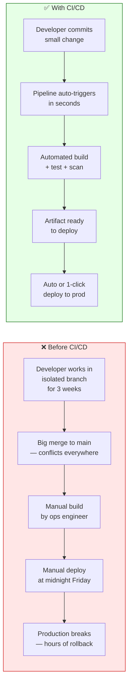

---

### CI vs CD vs Continuous Deployment

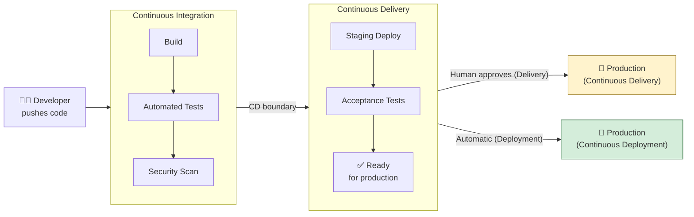

---

## ⚙️ Hands-On: Your First CI Pipeline (GitHub Actions)

```yaml
# .github/workflows/ci.yml — simplest possible CI pipeline
name: CI

on:
  push:
    branches: [main]
  pull_request:
    branches: [main]

jobs:
  build-and-test:
    runs-on: ubuntu-latest
    steps:
      - name: Checkout code
        uses: actions/checkout@v4

      - name: Set up Node.js
        uses: actions/setup-node@v4
        with:
          node-version: '20'

      - name: Install dependencies
        run: npm ci

      - name: Run tests
        run: npm test

      - name: Build
        run: npm run build
```

---

## ⚠️ Common Gotchas

| Gotcha | Problem | Fix |
|---|---|---|
| **CI and CD used interchangeably** | Interviewers notice when you conflate them | Be precise: CI = integrate + test; CD = always deployable; Continuous Deployment = auto to prod |
| **Thinking CI/CD is just a tool** | "We use Jenkins so we have CI/CD" | CI/CD is a practice and culture; tools enable it but don't replace the discipline |
| **Long-running pipelines** | 45-minute pipelines kill the fast-feedback loop | Keep CI under 10 minutes; parallelize test stages |
| **Testing only in pipeline** | "We don't need local tests — CI catches everything" | Developers should run tests locally too; CI is the last check, not the first |

---

## ✅ Best Practices (2024)

1. **Keep pipelines fast** — target under 10 minutes for CI. Developers stop fixing failures if they wait 45 minutes.
2. **Fail fast** — put the quickest checks (lint, unit tests) first so failures are caught in under 2 minutes.
3. **Every commit triggers CI** — no exceptions. Skipping CI "just this once" is how bugs reach production.
4. **Treat pipeline code like application code** — review Jenkinsfiles and GitHub Actions YAML in PRs.
5. **Never store secrets in pipeline files** — use the CI platform's secret store or an external vault.

---

## 🌍 Real-World Scenario

**Scenario**: A 10-person startup releases software every 6 weeks. Their release process takes 3 days of manual testing and a Friday-night deploy window that always goes past midnight. After implementing CI/CD:

- Every PR runs 300 automated tests in 4 minutes
- Merging to `main` automatically deploys to staging
- Production deployments happen 8–10 times per day — each deployment is one or two small changes
- The last production incident caused by a deployment was 6 months ago (previously monthly)
- The Friday-night deploy was eliminated on day one of CI/CD

---

## 🧠 Summary

| Concept | One-Liner |
|---|---|
| **CI** | Merge small changes frequently; automated build + test on every commit |
| **Continuous Delivery** | Every passing build is deployable; human decides when to release |
| **Continuous Deployment** | Every passing build auto-deploys to production — no human gate |
| **Core value** | Fast feedback, small changes, low risk per deployment |
| **Before CI/CD** | Integration hell, manual builds, risky weekend deploys |
| **Key principle** | The pipeline protects the main branch and tells developers about failures in minutes |

---

---

# Q2 — What is a CI/CD Pipeline and What Are Its Stages?


## ❓ The Question

> **"What is a CI/CD pipeline? Walk me through the typical stages of a pipeline."**

**Alternate phrasings you may hear:**
- "Describe the stages in your current CI/CD pipeline."
- "What happens between a developer pushing code and it reaching production?"
- "What is the difference between a CI pipeline and a CD pipeline?"
- "What does a production-ready deployment pipeline look like?"
- "How many stages should a CI/CD pipeline have?"

---

## 🎯 Why Interviewers Ask This

This question tests practical, hands-on CI/CD experience. Interviewers are checking:

- **Pipeline literacy**: Can you describe a real pipeline, not just a theoretical one?
- **Stage ordering rationale**: Do you know WHY each stage exists and why the order matters?
- **Fail-fast thinking**: Do you put cheap, fast checks early and expensive checks later?
- **End-to-end awareness**: Do you cover security scanning, not just build and test?

> 💡 **Instant win**: Most candidates say "build, test, deploy." You stand out by describing a **7–8 stage pipeline** with security scanning, artifact storage, environment progression, and approval gates — and explaining the **ordering rationale** (fast checks first, expensive checks after, deploy last).

---

## 📖 Key Terminologies

| Term | Meaning |
|---|---|
| **Stage** | A logical phase of the pipeline — a named group of related tasks (e.g., "Test", "Build", "Deploy") |
| **Step / Task** | The individual action within a stage — run a command, execute a script, call a tool |
| **Lint** | Static analysis of code style and syntax errors — fastest possible check, runs first |
| **Unit test** | Tests individual functions in isolation — no database, no network calls |
| **Integration test** | Tests how multiple components work together — may need a database or service |
| **SAST** | Static Application Security Testing — scans source code for vulnerabilities without running it |
| **SCA** | Software Composition Analysis — scans dependencies for known CVEs |
| **Artifact** | The deployable output of the build stage (Docker image, JAR, zip) |
| **Artifact registry** | Storage for built artifacts — Docker Hub, AWS ECR, JFrog Artifactory |
| **Smoke test** | Quick sanity check after deploy — "does the app start and respond to /health?" |
| **Gate / Quality gate** | A condition that must pass before the pipeline continues — e.g., test coverage ≥ 80% |
| **Environment** | A target runtime for deployment — dev, staging, production |

---

## 🗣️ How to Answer (Structured)

**1. Define a pipeline:**

> "A CI/CD pipeline is an automated sequence of steps that code passes through, from the moment a developer pushes a commit to the point where it's running in production. It replaces every manual step that developers and operations teams used to perform by hand."

**2. Walk through each stage with rationale:**

> "The first stage is always source — the pipeline checks out the latest code. Then linting and formatting checks run because they're the fastest — they take seconds and catch obvious errors immediately. Then unit tests, which are fast and don't need external services. Then the build — we compile the code or build a Docker image. After building, security scanning runs — SAST for code vulnerabilities and SCA for vulnerable dependencies. Then we publish the artifact to a registry so it's versioned and stored. Then we deploy to a staging environment and run integration and end-to-end tests against the live deployment. Finally, after manual approval or automated canary analysis, we deploy to production."

**3. Emphasize ordering rationale:**

> "The order matters — we put fast, cheap checks first so developers get feedback in under 2 minutes when something is obviously broken. Expensive checks like end-to-end tests run later, after we're reasonably confident the code is good."

---

## 🔐 Security Perspective (DevSecOps)

A production-grade pipeline must include security stages — "shift left" means security runs in CI, not just before release.

| Stage | Security Tool | What It Catches |
|---|---|---|
| **Pre-commit** | detect-secrets, gitleaks | Secrets committed to code |
| **Lint/SAST** | Semgrep, Bandit, ESLint security rules | Code-level vulnerabilities (SQLi, XSS, hardcoded creds) |
| **Dependency scan (SCA)** | Trivy, Snyk, OWASP Dependency-Check | CVEs in npm/pip/Maven dependencies |
| **Container scan** | Trivy, Grype, ECR Inspector | OS and library CVEs in Docker image layers |
| **IaC scan** | Checkov, tfsec | Misconfigurations in Terraform/CloudFormation |
| **DAST** | OWASP ZAP (against staging) | Runtime vulnerabilities in the running application |
| **Compliance gate** | OPA/Rego policies | Policy violations before production deploy |

---

## 🖼️ Visuals

### Full 8-Stage CI/CD Pipeline

```mermaid
flowchart LR
    GIT["📁 Source\ngit push"] --> LINT

    LINT["🔍 Stage 1\nLint & Format\n~30 seconds"]
    LINT --> UNIT

    UNIT["🧪 Stage 2\nUnit Tests\n~2 minutes"]
    UNIT --> BUILD

    BUILD["🔨 Stage 3\nBuild Artifact\nDocker image / JAR\n~3 minutes"]
    BUILD --> SCAN

    SCAN["🔒 Stage 4\nSecurity Scan\nSAST + SCA + Container\n~5 minutes"]
    SCAN --> PUBLISH

    PUBLISH["📦 Stage 5\nPublish Artifact\nPush to ECR / GHCR\n~1 minute"]
    PUBLISH --> STAGING

    STAGING["🧪 Stage 6\nDeploy to Staging\n+ Integration Tests\n+ Smoke Tests\n~10 minutes"]
    STAGING --> APPROVAL

    APPROVAL["✅ Stage 7\nApproval Gate\nManual or automated\ncanary analysis"]
    APPROVAL --> PROD

    PROD["🚀 Stage 8\nDeploy to Production\n+ Post-deploy smoke test"]

    style LINT fill:#e8f4fd,stroke:#0066cc
    style SCAN fill:#ffe6e6,stroke:#cc0000
    style APPROVAL fill:#fff3cd,stroke:#856404
    style PROD fill:#d4edda,stroke:#155724
```

---

### Fail-Fast Principle — Stage Ordering

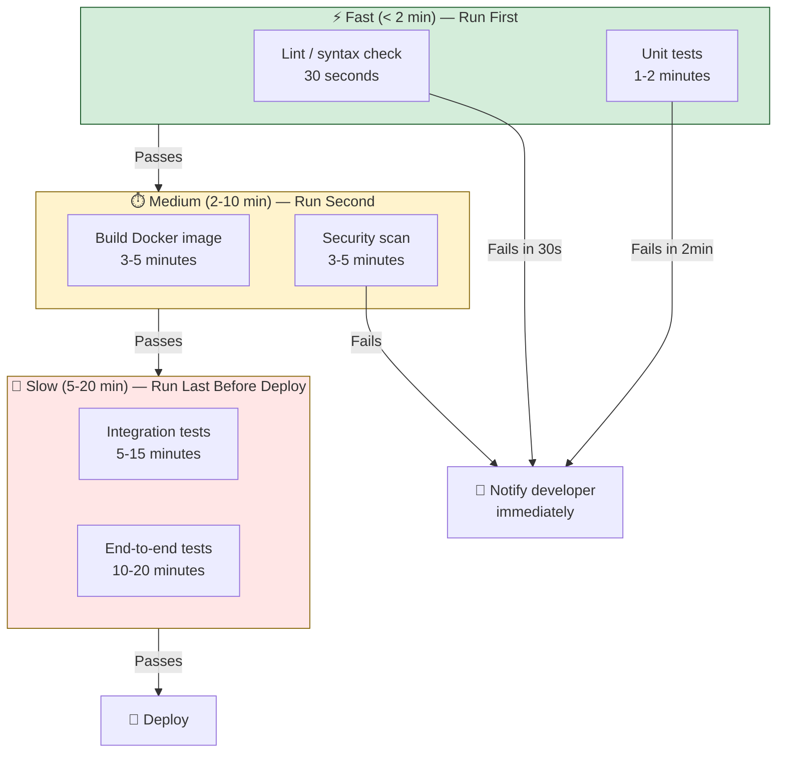

---

### Environment Progression

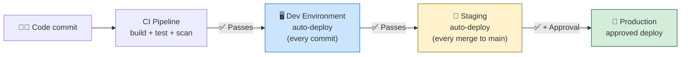

---

## ⚙️ Hands-On: Multi-Stage Pipeline

```yaml
# .github/workflows/pipeline.yml — complete multi-stage pipeline
name: Full CI/CD Pipeline

on:
  push:
    branches: [main]
  pull_request:
    branches: [main]

jobs:
  # Stage 1 — Lint (fast check, runs first)
  lint:
    name: Lint & Format Check
    runs-on: ubuntu-latest
    steps:
      - uses: actions/checkout@v4
      - uses: actions/setup-node@v4
        with:
          node-version: '20'
          cache: npm
      - run: npm ci
      - run: npm run lint
      - run: npm run format:check

  # Stage 2 — Unit Tests
  unit-test:
    name: Unit Tests
    runs-on: ubuntu-latest
    needs: lint
    steps:
      - uses: actions/checkout@v4
      - uses: actions/setup-node@v4
        with:
          node-version: '20'
          cache: npm
      - run: npm ci
      - run: npm test -- --coverage
      - uses: codecov/codecov-action@v4

  # Stage 3 — Build Docker Image
  build:
    name: Build Docker Image
    runs-on: ubuntu-latest
    needs: unit-test
    outputs:
      image-tag: ${{ steps.meta.outputs.tags }}
    steps:
      - uses: actions/checkout@v4
      - name: Docker meta
        id: meta
        uses: docker/metadata-action@v5
        with:
          images: ghcr.io/${{ github.repository }}
          tags: type=sha
      - uses: docker/login-action@v3
        with:
          registry: ghcr.io
          username: ${{ github.actor }}
          password: ${{ secrets.GITHUB_TOKEN }}
      - uses: docker/build-push-action@v5
        with:
          push: true
          tags: ${{ steps.meta.outputs.tags }}

  # Stage 4 — Security Scan
  security-scan:
    name: Security Scan
    runs-on: ubuntu-latest
    needs: build
    steps:
      - uses: actions/checkout@v4
      - name: Run Trivy vulnerability scanner
        uses: aquasecurity/trivy-action@master
        with:
          image-ref: ${{ needs.build.outputs.image-tag }}
          format: table
          exit-code: 1
          severity: CRITICAL,HIGH

  # Stage 5 — Deploy Staging (on main branch only)
  deploy-staging:
    name: Deploy to Staging
    runs-on: ubuntu-latest
    needs: security-scan
    if: github.ref == 'refs/heads/main'
    environment: staging
    steps:
      - run: echo "Deploying ${{ needs.build.outputs.image-tag }} to staging"
      - run: ./scripts/deploy.sh staging ${{ needs.build.outputs.image-tag }}

  # Stage 6 — Deploy Production (requires manual approval)
  deploy-production:
    name: Deploy to Production
    runs-on: ubuntu-latest
    needs: deploy-staging
    environment: production          # approval gate configured in repo settings
    steps:
      - run: ./scripts/deploy.sh production ${{ needs.build.outputs.image-tag }}
```

---

## ⚠️ Common Gotchas

| Gotcha | Problem | Fix |
|---|---|---|
| **Deploying without testing** | Jumping straight from build to production | Always deploy to staging first and run tests there |
| **No artifact versioning** | Building image tagged `latest` — no way to rollback | Tag with `git SHA` or semantic version |
| **All stages sequential** | 40-minute pipeline when tests could run in parallel | Use parallel jobs; lint/unit/security can run concurrently after build |
| **Security scan is the last stage** | Vulnerability found after deploy | Move security scanning to before deploy — even before staging |
| **No smoke test after deploy** | "Deploy succeeded" but app is actually down | Always run a health check curl after every deploy |

---

## ✅ Best Practices (2024)

1. **Fail fast, fail early** — lint and unit tests run first; expensive tests run last.
2. **Parallelize where possible** — lint, security scan, and unit tests can often run concurrently.
3. **Tag artifacts with the Git SHA** — every image/package is traceable back to a commit.
4. **Separate CI and CD jobs** — CI runs on every PR; CD (deploy) runs only on merges to main.
5. **Always smoke test after deploy** — a deploy stage that doesn't verify the app is running is incomplete.
6. **One artifact, multiple environments** — build once, deploy the same artifact to dev → staging → prod. Never rebuild per environment.

---

## 🌍 Real-World Scenario

**Scenario**: A team has a "CI/CD pipeline" that only has two stages: build and deploy directly to production. A bad commit caused a P1 outage. Post-incident review added: unit tests (caught 3 regressions in first week), a staging environment (caught 2 environment-specific bugs), and a security scan (found a critical CVE in a dependency). The next 6 months had zero pipeline-caused production incidents.

---

## 🧠 Summary

| Stage | Purpose | Speed |
|---|---|---|
| **Lint** | Catch syntax + style errors immediately | < 1 min |
| **Unit Tests** | Verify code logic in isolation | 1–3 min |
| **Build** | Compile code / build Docker image | 2–5 min |
| **Security Scan** | Find CVEs and vulnerabilities before deploy | 3–5 min |
| **Publish Artifact** | Store versioned artifact in registry | < 1 min |
| **Deploy Staging** | Validate in a production-like environment | 5–15 min |
| **Approval Gate** | Human or automated validation | Variable |
| **Deploy Production** | Release to real users | 2–5 min |

---

---

# Q3 — Continuous Delivery vs Continuous Deployment


## ❓ The Question

> **"What is the difference between Continuous Delivery and Continuous Deployment?"**

**Alternate phrasings you may hear:**
- "Is your team doing Continuous Delivery or Continuous Deployment?"
- "When would a company choose Delivery over Deployment?"
- "Why would you NOT use Continuous Deployment for every project?"
- "What does 'always deployable' mean?"

---

## 🎯 Why Interviewers Ask This

This is the most commonly confused pair in DevOps terminology. Interviewers ask it to filter:

- **Terminology precision**: Many candidates use them interchangeably — a clear answer stands out.
- **Business context awareness**: Understanding WHY a company might choose one over the other shows maturity.
- **Risk assessment thinking**: Can you explain the difference in terms of risk and business requirements?

> 💡 **Instant win**: Give a concrete analogy — "Continuous Delivery is like having a loaded gun on the table — it's ready to fire but a human must pull the trigger. Continuous Deployment is like an automatic weapon — it fires as soon as the conditions are met."

---

## 📖 Key Terminologies

| Term | Meaning |
|---|---|
| **Continuous Delivery** | Pipeline automatically prepares and validates every change for release; a human approves the production deploy |
| **Continuous Deployment** | Pipeline automatically deploys every passing change to production; no human approval step |
| **Release** | The business decision to make a feature available to users — separate from technical deployment |
| **Feature flag** | Code switch that enables/disables a feature without a deploy — allows deploying dark (inactive) code |
| **Approval gate** | Mandatory human review step before production deploy — present in Continuous Delivery |
| **Change Advisory Board (CAB)** | Enterprise governance body that approves production changes — often required in regulated industries |
| **Rollback** | Reverting production to a previous known-good state after a bad deploy |
| **MTTR** | Mean Time to Recovery — how long to fix a production issue. CI/CD reduces MTTR dramatically |
| **Deploy frequency** | How often code reaches production — a key DORA metric |

---

## 🗣️ How to Answer (Structured)

**1. Define both clearly with one sentence each:**

> "Continuous Delivery means every change that passes all automated tests is ready to deploy — but a human still approves when it actually goes to production. Continuous Deployment goes one step further: if the change passes all tests, it automatically deploys to production with no human in the loop."

**2. Explain when each is appropriate:**

> "Most companies use Continuous Delivery because it preserves business control over when features ship. You might want to coordinate a release with a marketing campaign, wait for off-peak hours, or bundle multiple features into a release. Continuous Deployment makes sense when you have extreme confidence in your test suite, you deploy small changes frequently, and you have robust monitoring and fast rollback capability."

**3. Give examples of each:**

> "A medical device firmware company would almost certainly use Continuous Delivery — regulatory compliance requires documented approval of every production change. An e-commerce SaaS like Shopify or Etsy uses Continuous Deployment — they deploy hundreds of times per day with automated canary analysis catching any regressions before they reach all users."

---

## 🔐 Security Perspective (DevSecOps)

| Aspect | Continuous Delivery | Continuous Deployment |
|---|---|---|
| **Change approval** | Human review required — manual audit trail | Automated — audit trail comes from pipeline logs |
| **Compliance** | Easier to satisfy SOC 2 / PCI-DSS change management requirements | Requires automation of compliance evidence |
| **Rollback speed** | Slower — human must decide and act | Can be automated — monitoring triggers auto-rollback |
| **Security gate** | Human can catch security issues automated tools miss | Relies entirely on automated security gates in pipeline |
| **Regulated industries** | Preferred — change management documentation is built-in | Requires careful design to meet audit requirements |

---

## 🖼️ Visuals

### Delivery vs Deployment Comparison

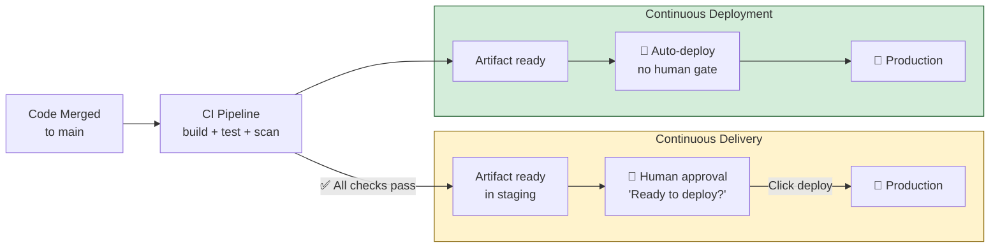

---

### Decision Guide: Delivery or Deployment?

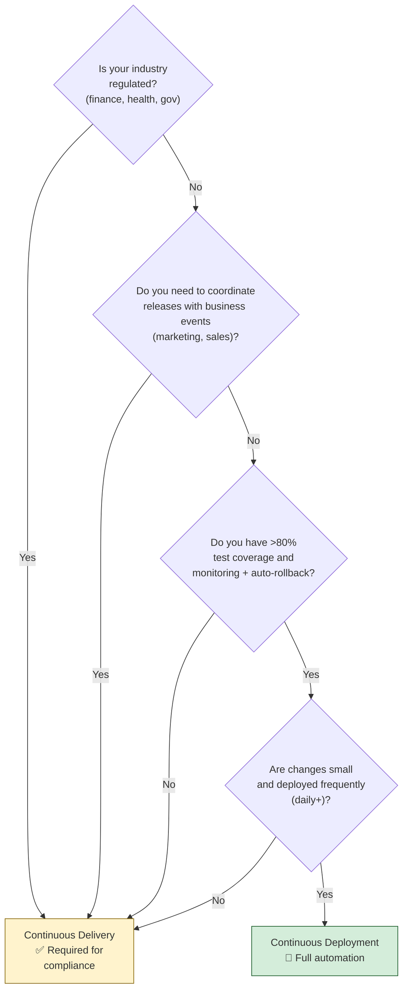

---

## ⚙️ Hands-On: Approval Gate for Continuous Delivery

```yaml
# GitHub Actions — Continuous Delivery pattern
# Production deploy requires manual approval in GitHub UI

jobs:
  deploy-staging:
    runs-on: ubuntu-latest
    environment: staging
    steps:
      - run: ./deploy.sh staging

  deploy-production:
    runs-on: ubuntu-latest
    needs: deploy-staging
    environment: production       # "production" environment has required reviewers set
    # GitHub pauses here — notifies reviewers by email
    # Reviewers see: what changed, staging test results, approve/reject in UI
    steps:
      - run: ./deploy.sh production
```

```yaml
# Continuous Deployment pattern — no approval gate
jobs:
  deploy:
    runs-on: ubuntu-latest
    if: github.ref == 'refs/heads/main'
    steps:
      - run: ./deploy.sh production   # deploys automatically on every passing merge to main
```

---

## ⚠️ Common Gotchas

| Gotcha | Problem | Fix |
|---|---|---|
| **Using "CD" for both** | Creates confusion in architecture discussions | Always clarify: "Continuous Delivery (human approval)" vs "Continuous Deployment (automated)" |
| **Thinking CD is always better** | Automated deploys without monitoring = undetected production failures | Continuous Deployment requires robust monitoring and auto-rollback |
| **Deployment without feature flags** | Half-finished features auto-deploy to users | Use feature flags to deploy dark code safely |
| **Skipping staging for Continuous Deployment** | Bugs reach all users simultaneously | Use canary deployments — roll out to 1% first, monitor, then 100% |

---

## ✅ Best Practices (2024)

1. **Start with Continuous Delivery** — get the automated pipeline solid before removing the human gate.
2. **Use feature flags for Continuous Deployment** — deploy code dark, activate features deliberately.
3. **Implement monitoring before removing approval gates** — you need to detect regressions automatically.
4. **Canary rollouts for Continuous Deployment** — send 5% of traffic to new version, validate, then ramp up.
5. **Preserve the audit trail** — even with full automation, every deploy must be traceable to a commit, a test run, and a pipeline execution.

---

## 🌍 Real-World Scenario

**Scenario**: An e-commerce startup started with Continuous Delivery — every merge to main deployed to staging, but production required a VP's approval. As the team grew to 50 engineers, the VP was approving 15–20 deploys per day and becoming a bottleneck. They switched to Continuous Deployment with: 80%+ test coverage, automated canary deployments (5% → 25% → 100% with Datadog monitoring each step), and automated rollback if error rate exceeded 0.1%. Result: deploy frequency went from 3/day to 40/day with zero increase in production incidents.

---

## 🧠 Summary

| Concept | Continuous Delivery | Continuous Deployment |
|---|---|---|
| **Human approval** | ✅ Required | ❌ Fully automated |
| **Speed to prod** | Minutes after approval | Minutes after merge |
| **Business control** | High | Low (features auto-ship) |
| **Compliance** | Easier | Requires automated evidence |
| **Risk** | Lower (human checkpoint) | Managed via automated monitoring |
| **Best for** | Regulated industries, coordinated releases | High-frequency SaaS, trusted pipelines |

---

---

# Q4 — What Are Build Artifacts?


## ❓ The Question

> **"What is a build artifact in CI/CD? Why is artifact management important?"**

**Alternate phrasings you may hear:**
- "What is the output of your build stage?"
- "How do you pass a built binary from one pipeline stage to another?"
- "Why should you build once and deploy many times?"
- "What is an artifact registry and why do you need one?"
- "What is the difference between a Docker image and a JAR file as artifacts?"

---

## 🎯 Why Interviewers Ask This

Artifact management is a sign of pipeline maturity. Interviewers ask this to assess:

- **Build pipeline depth**: Do you understand what the build stage actually produces?
- **Traceability**: Can you link a running service back to a specific commit?
- **Reproducibility**: Do you understand why "build once, deploy everywhere" is critical?
- **Storage and retention thinking**: Have you thought about artifact lifecycle and cost?

> 💡 **Instant win**: Most candidates describe artifacts as "the output of a build." You stand out by explaining the **"build once, deploy many" principle** — build one artifact, run it through dev → staging → production unchanged. This guarantees the exact same binary tested in staging is what runs in production.

---

## 📖 Key Terminologies

| Term | Meaning |
|---|---|
| **Artifact** | The versioned, deployable output of a build (Docker image, JAR, WAR, zip, binary, npm package) |
| **Artifact registry** | Versioned storage for artifacts — Docker Hub, AWS ECR, JFrog Artifactory, GitHub Packages |
| **Image tag** | Version identifier for a Docker image — `myapp:v1.2.0`, `myapp:abc1234` (Git SHA) |
| **Build once, deploy many** | Build a single artifact; promote it through environments without rebuilding |
| **Immutable artifact** | An artifact that never changes after creation — what you test is what you deploy |
| **Provenance** | Cryptographic proof of where an artifact came from — which code, which pipeline, which build |
| **Retention policy** | Rules for how long artifacts are kept — 7-day PR artifacts, permanent release artifacts |
| **SBOM** | Software Bill of Materials — a list of all components in an artifact, used for vulnerability tracking |
| **Digest/SHA** | Content-based hash of a Docker image — more reliable than tags for pinning exact versions |
| **Semantic version** | Human-readable version: `MAJOR.MINOR.PATCH` — e.g., `2.1.4` |

---

## 🗣️ How to Answer (Structured)

**1. Define artifacts clearly:**

> "A build artifact is the versioned, deployable output of the build stage — it's the thing you actually run in production. For a Java application it's a JAR or WAR file. For a containerized service it's a Docker image. For a Node.js app it might be a zip of the compiled JavaScript. For infrastructure code it might be a Terraform plan file."

**2. Explain the build-once principle:**

> "A critical principle in CI/CD is 'build once, deploy many.' You build the artifact once in CI, store it in a registry with a version tag tied to the Git commit, and then deploy that exact same artifact to dev, staging, and production. You never rebuild for each environment — if you rebuild, you can't guarantee that what you tested in staging is what you deploy to production."

**3. Explain versioning:**

> "Artifacts must be versioned. I tag Docker images with the Git SHA — `myapp:a1b2c3d` — so I can always trace a running container back to the exact commit it was built from. I also tag releases with semantic versions like `myapp:v2.1.0` for human readability. The `latest` tag should never be used in production — it changes with every push and makes rollbacks impossible."

---

## 🔐 Security Perspective (DevSecOps)

| Risk | Description | Mitigation |
|---|---|---|
| **Mutable tags** | `latest` tag can be overwritten — you don't know what version is running | Use immutable tags (Git SHA, semver); enable immutability in ECR/Harbor |
| **Unsigned artifacts** | Anyone who can access the registry can push a malicious image | Sign images with Cosign; verify signature before deploy |
| **Public registry leakage** | Private app images pushed to public Docker Hub | Use private registry (ECR, GHCR, Harbor); never `docker login` to public registry in prod |
| **SBOM missing** | Vulnerability disclosed but you don't know if it's in your artifact | Generate SBOM with Syft; attach to image as OCI artifact |
| **No retention policy** | Registry fills with thousands of untagged images — cost + noise | Lifecycle policies in ECR; retention rules in Harbor |

---

## 🖼️ Visuals

### Artifact Lifecycle — Build Once, Deploy Many

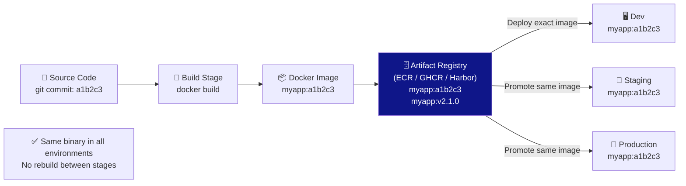

---

### Artifact Types by Technology

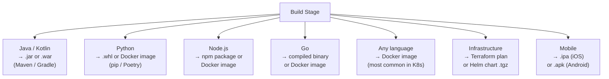

---

## ⚙️ Hands-On: Artifact Build, Push, and Versioning

```bash
# Build a Docker image tagged with Git SHA
GIT_SHA=$(git rev-parse --short HEAD)
docker build -t ghcr.io/myorg/myapp:${GIT_SHA} .
docker build -t ghcr.io/myorg/myapp:latest .    # ← optional, only for development

# Push to GitHub Container Registry
echo $GITHUB_TOKEN | docker login ghcr.io -u username --password-stdin
docker push ghcr.io/myorg/myapp:${GIT_SHA}

# Pull and run the exact version
docker pull ghcr.io/myorg/myapp:${GIT_SHA}
docker run -p 8080:8080 ghcr.io/myorg/myapp:${GIT_SHA}
```

```yaml
# GitHub Actions — build, tag, and push artifact
- name: Build and push Docker image
  uses: docker/build-push-action@v5
  with:
    push: true
    tags: |
      ghcr.io/${{ github.repository }}:${{ github.sha }}
      ghcr.io/${{ github.repository }}:latest
    labels: |
      org.opencontainers.image.source=${{ github.repositoryUrl }}
      org.opencontainers.image.revision=${{ github.sha }}
      org.opencontainers.image.created=${{ steps.date.outputs.date }}
```

---

## ⚠️ Common Gotchas

| Gotcha | Problem | Fix |
|---|---|---|
| **Using `latest` tag in production** | No audit trail; rollbacks impossible; "latest" changes silently | Always deploy with explicit Git SHA or semver tag |
| **Rebuilding per environment** | Staging binary ≠ production binary — untested code in prod | Build once; promote same artifact |
| **No artifact retention policy** | Registry fills up; old images never cleaned; costs spiral | Set lifecycle policies: keep last 10 release tags; delete untagged after 7 days |
| **Artifacts stored only in pipeline workspace** | Pipeline workspace is ephemeral — artifact lost after job | Always push to a persistent registry before deploy jobs |

---

## ✅ Best Practices (2024)

1. **Tag with Git SHA** — every artifact is traceable to the exact commit that produced it.
2. **Build once, deploy many** — never rebuild between environments.
3. **Use immutable tags in production** — ECR supports immutable image tags; enable it.
4. **Generate and attach SBOM** — `syft ghcr.io/myorg/myapp:sha > sbom.json` — know what's inside.
5. **Set lifecycle/retention policies** — keep all semver release tags forever; prune SHA-tagged builds after 30 days.

---

## 🧠 Summary

| Concept | One-Liner |
|---|---|
| **Artifact** | Versioned, deployable output of a build — Docker image, JAR, binary, Helm chart |
| **Build once** | Build one artifact; promote it unchanged through dev → staging → production |
| **Tag with Git SHA** | Links running service back to exact source commit — essential for traceability |
| **Artifact registry** | Persistent versioned storage — ECR, GHCR, Harbor, Artifactory |
| **Immutable tags** | Prevents overwriting existing versions — guarantees what you tested is what you deploy |
| **SBOM** | Know every dependency inside your artifact — required for CVE response |

---

---

# Q5 — What Are Pipeline Triggers and Webhooks?


## ❓ The Question

> **"What triggers a CI/CD pipeline to run? What is a webhook?"**

**Alternate phrasings you may hear:**
- "How does your CI system know when to start a build?"
- "What is the difference between webhook and polling in CI/CD?"
- "How do you trigger a pipeline manually?"
- "What is a scheduled pipeline and when do you use one?"

---

## 🎯 Why Interviewers Ask This

Understanding triggers shows you understand CI/CD at the infrastructure level, not just the pipeline YAML. Interviewers ask this to check:

- **SCM integration knowledge**: Do you know how code changes reach the CI system?
- **Webhook vs polling**: Understanding the difference signals systems-thinking maturity.
- **Trigger design**: Do you know how to trigger only the right pipelines — not every repo on every push?

> 💡 **Instant win**: Most candidates say "it triggers when I push code." You stand out by explaining the **webhook model** — GitHub sends an HTTP POST to Jenkins/Actions the moment a push happens — and contrasting it with the inefficient polling model where Jenkins checks every 60 seconds.

---

## 📖 Key Terminologies

| Term | Meaning |
|---|---|
| **Trigger** | The event that starts a pipeline execution automatically |
| **Webhook** | An HTTP POST sent by GitHub/GitLab to the CI system immediately when an event occurs |
| **Polling** | The CI system periodically checks the Git repo for new commits — inefficient, legacy approach |
| **Push trigger** | Pipeline starts when code is pushed to a branch |
| **Pull request trigger** | Pipeline starts when a PR is opened, updated, or synchronized |
| **Tag trigger** | Pipeline starts when a Git tag is pushed — typically used for releases |
| **Scheduled trigger** | Pipeline runs on a cron schedule — e.g., nightly regression tests |
| **Manual trigger** | A human clicks "Run" in the CI UI or runs a CLI command |
| **`workflow_dispatch`** | GitHub Actions manual trigger with optional input parameters |
| **Path filter** | Trigger only if specific files/directories changed — avoids running pipelines for doc changes |
| **Repository dispatch** | External system triggers a pipeline via API call — common for cross-repo triggers |

---

## 🗣️ How to Answer (Structured)

**1. Explain the primary trigger — push/PR:**

> "The most common trigger is a code push — whenever a developer pushes commits to a branch or opens a pull request, the CI system starts a build automatically. In GitHub Actions this is configured in the `on:` section of the workflow YAML. In Jenkins it's configured via a GitHub webhook."

**2. Explain how webhooks work:**

> "A webhook is how the CI system finds out about the push almost instantly. When you push to GitHub, GitHub sends an HTTP POST request to the CI system's webhook URL — this arrives within 1–2 seconds of the push. The CI system parses the payload and starts the pipeline. The alternative — polling — has Jenkins checking 'any new commits?' every 60 seconds, which is wasteful and slow."

**3. Cover other trigger types:**

> "Beyond push triggers, you also have PR triggers — run tests on every pull request before merge. Tag triggers — start a release pipeline when someone pushes a version tag like `v2.1.0`. Scheduled triggers — run nightly security scans or performance tests on a cron schedule. And manual triggers — kick off a pipeline by hand, useful for deployments."

---

## 🔐 Security Perspective (DevSecOps)

| Risk | Description | Fix |
|---|---|---|
| **Unauthenticated webhooks** | Anyone can fake a webhook and trigger builds | Validate webhook signature (GitHub HMAC SHA-256 secret) |
| **Fork PR trigger** | PRs from forks trigger pipelines — pipeline may expose secrets | GitHub does not pass secrets to fork PRs by default; use `pull_request_target` carefully |
| **Scheduled pipeline with stale deps** | Nightly build doesn't update deps — CVE stays undetected | Include `dependabot` or dep scan in scheduled pipeline |
| **Manual trigger abuse** | Anyone with write access can trigger production deploys manually | Restrict `workflow_dispatch` to specific environments requiring approval |

```python
# Webhook signature validation (Python example)
import hmac, hashlib

def verify_github_webhook(payload_body, secret_token, signature_header):
    expected = 'sha256=' + hmac.new(
        secret_token.encode(), payload_body, hashlib.sha256
    ).hexdigest()
    return hmac.compare_digest(expected, signature_header)
```

---

## 🖼️ Visuals

### Webhook vs Polling

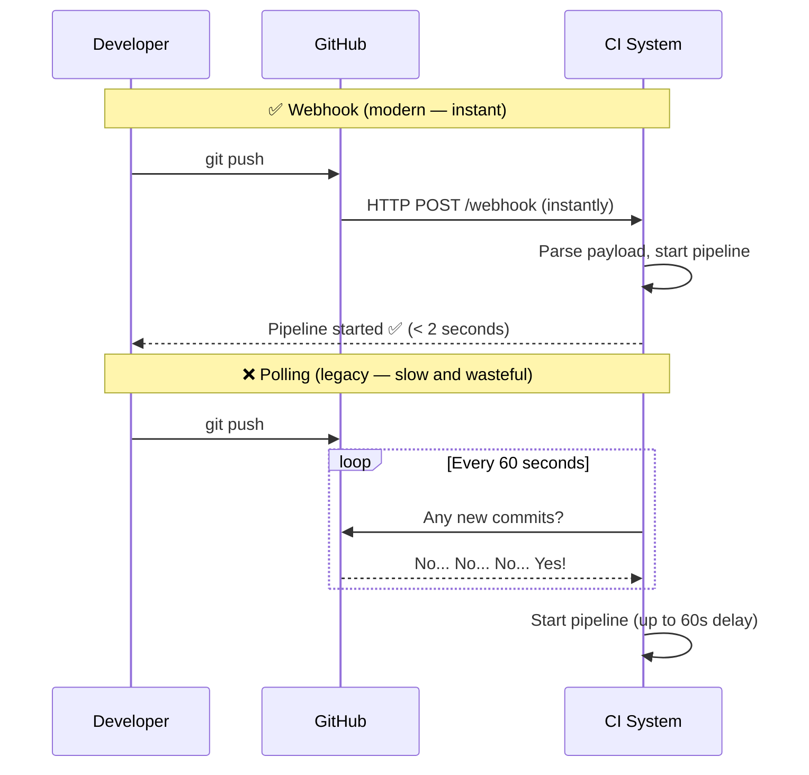

---

### Trigger Types

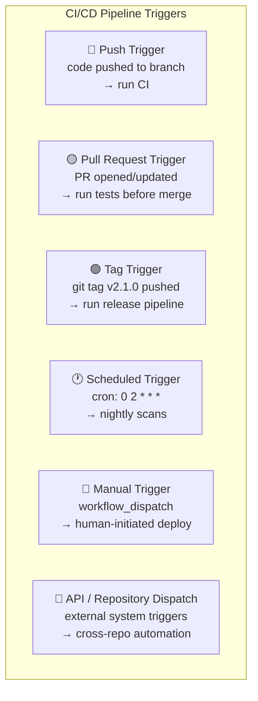

---

## ⚙️ Hands-On: Trigger Configuration

```yaml
# GitHub Actions — multiple trigger types
on:
  # Trigger on push to specific branches
  push:
    branches:
      - main
      - 'release/**'
    paths:
      - 'src/**'           # only if source files changed
      - '!docs/**'         # ignore doc changes

  # Trigger on pull requests
  pull_request:
    branches: [main]
    types: [opened, synchronize, reopened]

  # Trigger on Git tags (releases)
  push:
    tags:
      - 'v[0-9]+.[0-9]+.[0-9]+'

  # Scheduled trigger — nightly at 2am UTC
  schedule:
    - cron: '0 2 * * *'

  # Manual trigger with inputs
  workflow_dispatch:
    inputs:
      environment:
        description: 'Target environment'
        type: choice
        options: [dev, staging, production]
        required: true
      skip-tests:
        description: 'Skip test stage?'
        type: boolean
        default: false
```

```groovy
// Jenkins — webhook trigger
pipeline {
    triggers {
        githubPush()                  // triggered by GitHub webhook
        pollSCM('H/5 * * * *')        // fallback: poll every 5 minutes
        cron('0 2 * * *')             // scheduled: 2am daily
    }
}
```

---

## ⚠️ Common Gotchas

| Gotcha | Problem | Fix |
|---|---|---|
| **No path filter** | Every push (including README edits) triggers a 10-minute pipeline | Add `paths:` filter — skip for `docs/**` and `*.md` |
| **Polling instead of webhooks** | 60-second delay; wastes CI resources | Configure GitHub webhook; use `githubPush()` in Jenkins |
| **Triggering on all branches** | Feature branch pushes flood the pipeline queue | Scope push trigger to `main` and `release/**` only; use PR trigger for feature branches |
| **Manual deploy with no audit** | No record of who triggered a production deploy manually | Use `workflow_dispatch` — GitHub audit log captures the user who triggered it |

---

## 🧠 Summary

| Trigger Type | When to Use |
|---|---|
| **Push** | CI validation on every commit to main/release branches |
| **Pull Request** | Test every PR before allowing merge — protects main branch |
| **Tag** | Release pipelines — build and publish when a version tag is pushed |
| **Schedule** | Nightly security scans, performance tests, dependency audits |
| **Manual** | Production deploys requiring human decision; debug builds |
| **Webhook** | The mechanism behind all automatic triggers — instant, efficient |

---

---

# Q6 — What Are Environment Variables in a Pipeline?


## ❓ The Question

> **"What are environment variables in a CI/CD pipeline and how do you manage secrets safely?"**

**Alternate phrasings you may hear:**
- "How do you pass configuration to different environments in your pipeline?"
- "Where do you store API keys and passwords used in CI/CD?"
- "What is the difference between a pipeline variable and a secret?"
- "How do you prevent secrets from appearing in build logs?"

---

## 🎯 Why Interviewers Ask This

This question has both a basic and a security layer. Interviewers ask it to assess:

- **Configuration management basics**: Do you know how to parameterize pipelines?
- **Secret hygiene**: Do you know the difference between a variable and a secret?
- **Security awareness**: Have you seen — or caused — a credential leak in CI logs?

> 💡 **Instant win**: Most candidates say "I put secrets in environment variables." You stand out by distinguishing regular variables from secrets, explaining that CI platforms mask secrets in logs, and describing the production-grade pattern — using an external vault (AWS Secrets Manager, HashiCorp Vault) rather than storing secrets directly in the CI platform.

---

## 📖 Key Terminologies

| Term | Meaning |
|---|---|
| **Environment variable** | A named value available to all processes running in the pipeline — `NODE_ENV=production` |
| **Secret / masked variable** | A sensitive value (password, API key, token) stored encrypted; masked in all log output |
| **Repository secret** | Secret scoped to a single repository — visible to all pipelines in that repo |
| **Organization secret** | Secret scoped to all repos in a GitHub org — useful for shared credentials |
| **Environment secret** | Secret scoped to a specific deployment environment (staging/production) — only available after approval |
| **`$GITHUB_ENV`** | File used to set environment variables that persist across steps in GitHub Actions |
| **`$GITHUB_OUTPUT`** | File used to pass values from one step to another or to downstream jobs |
| **Secrets Manager** | External secret storage — AWS Secrets Manager, HashiCorp Vault, Azure Key Vault |
| **Log masking** | CI platform automatically replaces any occurrence of a secret value in logs with `***` |
| **Hardcoded credential** | Secret embedded directly in pipeline YAML or source code — a critical security failure |

---

## 🗣️ How to Answer (Structured)

**1. Define environment variables:**

> "Environment variables are named configuration values that are available to every command running in the pipeline. They're how you pass non-sensitive configuration — things like the target environment name, the app version, registry URLs, or feature flags — to the build and deploy steps."

**2. Explain secrets:**

> "Secrets are a special type of environment variable for sensitive values — API keys, passwords, tokens, certificates. The CI platform stores them encrypted. When a secret is injected into a pipeline, it's available as an environment variable but the CI system automatically masks any occurrence of the secret value in log output — it replaces it with three asterisks. You never put secrets directly in the YAML file or in source code."

**3. Describe the scope hierarchy:**

> "Secrets have scope. A repository secret is available to all pipelines in one repo. An organization secret is shared across all repos in the org — useful for things like a shared Docker registry token. An environment secret is only available after a deployment environment's approval gate — so a production database password is only accessible after a human approves the production deploy."

**4. Mention external vaults for production:**

> "For production-grade secret management, I use an external secret store like AWS Secrets Manager or HashiCorp Vault. The pipeline authenticates to the vault using OIDC — short-lived tokens — and fetches the secret at runtime. This means secrets aren't stored in the CI platform at all, rotation is managed centrally, and there's a full audit log of every access."

---

## 🔐 Security Perspective (DevSecOps)

| Risk | Severity | Fix |
|---|---|---|
| **Secret in YAML file** | Critical — stored in Git, visible to all | Use CI secret store; never hardcode |
| **`echo $SECRET` in script** | High — prints to build log | Use secrets via env vars; never echo; use `--password-stdin` |
| **Secret available to all branches** | Medium — fork PR could access | Scope to environments; GitHub doesn't expose secrets to fork PRs by default |
| **Secret never rotated** | Medium — long-lived credential exposure window | Rotate on schedule; use OIDC short-lived tokens where possible |
| **Secrets stored in CI platform long-term** | Medium — CI platform compromise = all secrets exposed | Use OIDC + external vault; CI platform has no long-lived credentials |

---

## 🖼️ Visuals

### Variable vs Secret Flow

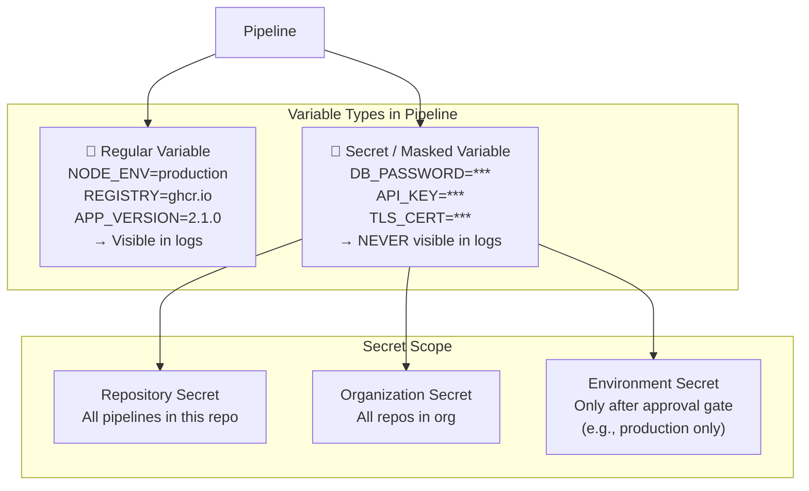

---

### External Vault Pattern (Production Standard)

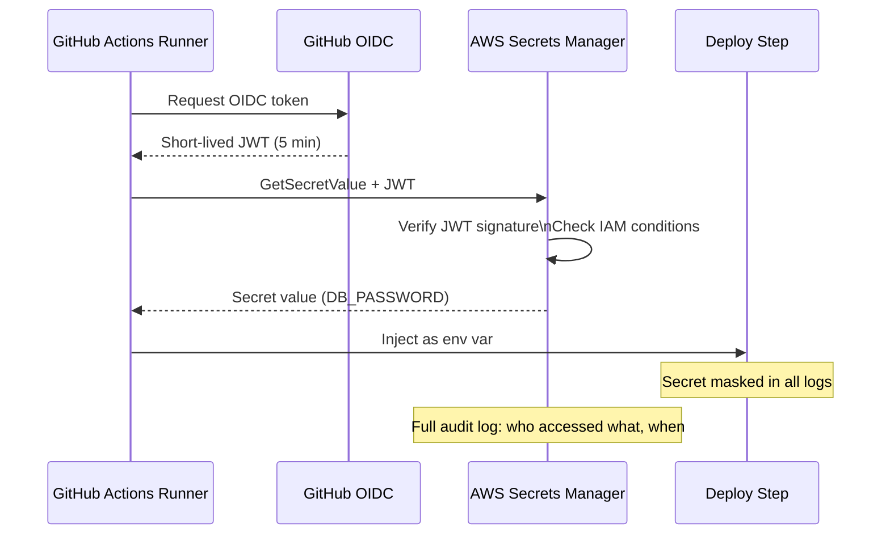

---

## ⚙️ Hands-On: Variables and Secrets in GitHub Actions

```yaml
# Workflow-level variables (non-sensitive)
env:
  NODE_ENV: production
  REGISTRY: ghcr.io
  IMAGE_NAME: myapp

jobs:
  build:
    runs-on: ubuntu-latest
    steps:
      # Using a repository secret
      - name: Login to registry
        uses: docker/login-action@v3
        with:
          registry: ${{ env.REGISTRY }}
          username: ${{ github.actor }}
          password: ${{ secrets.GITHUB_TOKEN }}    # ← repository secret

      # Setting step-level env vars
      - name: Build
        env:
          BUILD_MODE: release
          SENTRY_DSN: ${{ secrets.SENTRY_DSN }}    # ← from secrets, masked in logs
        run: |
          echo "Building in $BUILD_MODE mode"
          npm run build

      # Setting env var for downstream steps
      - name: Set version
        run: echo "APP_VERSION=$(cat VERSION)" >> $GITHUB_ENV

      # Using value from previous step
      - name: Print version
        run: echo "Version is $APP_VERSION"

      # NEVER do this — prints secret to logs
      - name: Bad example
        run: echo "My token is ${{ secrets.API_TOKEN }}"   # ❌ avoid
```

```yaml
# Fetching secrets from AWS Secrets Manager (external vault)
- name: Get secrets from AWS
  uses: aws-actions/aws-secretsmanager-get-secrets@v2
  with:
    secret-ids: |
      myapp/production/db-password,DB_PASSWORD
      myapp/production/api-key,API_KEY
    parse-json-secrets: true
# DB_PASSWORD and API_KEY now available as env vars, masked in logs
```

---

## ⚠️ Common Gotchas

| Gotcha | Problem | Fix |
|---|---|---|
| **Secret in YAML** | `password: "MyP@ss123"` in the YAML file — committed to Git | Move to CI secret store immediately; rotate the credential |
| **`echo` reveals secrets** | `echo "Token: $TOKEN"` prints the masked secret | Use `--password-stdin`; never echo secrets |
| **Env var scope confusion** | Variable set in one step, not available in next | Use `>> $GITHUB_ENV` to persist across steps |
| **Same secrets for all envs** | Dev and prod use same DB password | Use environment-scoped secrets; different credentials per environment |

---

## 🧠 Summary

| Concept | One-Liner |
|---|---|
| **Environment variable** | Named config value — `NODE_ENV=production`; visible in logs |
| **Secret** | Encrypted sensitive value — masked `***` in all logs |
| **Scope** | Repo → Org → Environment; most restrictive wins |
| **External vault** | AWS Secrets Manager / HashiCorp Vault — secrets never stored in CI platform |
| **OIDC auth** | Short-lived tokens replace long-lived CI secrets for cloud access |
| **Golden rule** | Never hardcode secrets in YAML or source code — rotate immediately if found |

---

---

# Q7 — Basic Deployment Strategies


## ❓ The Question

> **"What deployment strategies do you know? Explain rolling, blue-green, and canary deployments."**

**Alternate phrasings you may hear:**
- "What is the difference between a blue-green and canary deployment?"
- "How do you deploy with zero downtime?"
- "What is a rolling update in Kubernetes?"
- "When would you use a recreate deployment strategy?"

---

## 🎯 Why Interviewers Ask This

Deployment strategies are a core DevOps topic. Interviewers ask this to assess:

- **Risk management thinking**: Do you understand the risk profile of each strategy?
- **Operational maturity**: Have you thought about downtime, rollback, and blast radius?
- **Kubernetes awareness**: Rolling updates are Kubernetes' default — do you know how they work?

> 💡 **Instant win**: Most candidates describe blue-green as "you have two identical environments." You stand out by explaining **when each strategy is appropriate** — recreate for simple dev environments, rolling for stateless services, blue-green for zero-downtime releases, canary for high-risk changes with automated analysis.

---

## 📖 Key Terminologies

| Term | Meaning |
|---|---|
| **Recreate** | Stop all old instances, then start all new instances — causes downtime |
| **Rolling update** | Replace old instances one at a time — no downtime, gradual changeover |
| **Blue-green** | Run two identical environments (blue=current, green=new); switch traffic at once |
| **Canary** | Send small % of traffic to new version; monitor; gradually increase to 100% |
| **`maxSurge`** | Rolling update: how many extra pods can be created above the desired count |
| **`maxUnavailable`** | Rolling update: how many pods can be unavailable during the update |
| **Traffic shifting** | Routing a percentage of requests to the new version — used in canary deployments |
| **Rollback** | Reverting to the previous version — speed varies by strategy |
| **Health check** | Automated probe that verifies a new instance is ready before routing traffic to it |
| **Feature flag** | Code switch that separates deployment from release — deploy dark, activate later |

---

## 🗣️ How to Answer (Structured)

**1. Recreate (simplest, has downtime):**
> "Recreate is the simplest strategy — stop all running instances of the old version, then start all instances of the new version. There's a window of downtime between stop and start. This is only acceptable in dev/test environments or for background batch workers where downtime is tolerable."

**2. Rolling update (default, no downtime):**
> "A rolling update replaces instances one at a time. Kubernetes does this by default — it starts a new pod, waits for it to pass health checks, then terminates one old pod. It continues until all pods are on the new version. This gives you zero downtime but means both versions run simultaneously during the update — which can be a problem if your database schema changes aren't backward compatible."

**3. Blue-green (instant switch, easy rollback):**
> "Blue-green runs two identical environments. Blue is the current production. You deploy the new version to green and run all tests there. When green is validated, you switch the load balancer from blue to green — production traffic moves instantly. If anything goes wrong, you flip the switch back to blue. Rollback is near-instant. The cost is you need double the infrastructure."

**4. Canary (safest for high-risk changes):**
> "A canary deployment sends a small percentage of real production traffic — say 5% — to the new version while 95% still hits the old version. You monitor error rates, latency, and business metrics for the canary. If everything looks good, you gradually shift more traffic: 5% → 25% → 50% → 100%. If anything goes wrong, you route 100% back to the old version. This is the safest strategy for high-risk changes."

---

## 🔐 Security Perspective (DevSecOps)

| Strategy | Security Consideration |
|---|---|
| **Recreate** | Downtime window could be exploited; ensure rollback is tested before each deploy |
| **Rolling** | Old and new code run simultaneously — ensure auth tokens and API contracts are backward compatible |
| **Blue-green** | The inactive environment (blue after switch) must still be kept patched — don't leave vulnerable infra idle |
| **Canary** | Canary traffic may include sensitive users — ensure canary is PII-safe; avoid routing admins to canary |

---

## 🖼️ Visuals

### Four Deployment Strategies Compared

```mermaid
flowchart TB
    subgraph Recreate["🔴 Recreate — Has Downtime"]
        R1["[v1][v1][v1]"] -->|"Stop all"| R2["[ ][ ][ ]"]
        R2 -->|"Start all"| R3["[v2][v2][v2]"]
        style Recreate fill:#ffe6e6,stroke:#cc0000
    end

    subgraph Rolling["🟡 Rolling — No Downtime"]
        RL1["[v1][v1][v1]"] -->|"Replace 1"| RL2["[v2][v1][v1]"]
        RL2 -->|"Replace 1"| RL3["[v2][v2][v1]"]
        RL3 -->|"Replace 1"| RL4["[v2][v2][v2]"]
        style Rolling fill:#fff3cd,stroke:#856404
    end

    subgraph BlueGreen["🔵 Blue-Green — Instant Switch"]
        BG1["PROD: [v1][v1][v1]"] --> BG2["Deploy v2 to idle env\n[v2][v2][v2] (tested)"]
        BG2 -->|"Switch LB"| BG3["PROD: [v2][v2][v2]"]
        BG3 -->|"Instant rollback if needed"| BG1
        style BlueGreen fill:#cce5ff,stroke:#0066cc
    end

    subgraph Canary["🐤 Canary — Gradual Shift"]
        CA1["100% → v1"] -->|"5% to v2"| CA2["95% v1 | 5% v2"]
        CA2 -->|"Monitor OK"| CA3["75% v1 | 25% v2"]
        CA3 -->|"Monitor OK"| CA4["0% v1 | 100% v2"]
        style Canary fill:#d4edda,stroke:#155724
    end
```

---

## ⚙️ Hands-On: Kubernetes Rolling Update

```yaml
# Kubernetes Deployment — rolling update (default)
apiVersion: apps/v1
kind: Deployment
metadata:
  name: myapp
spec:
  replicas: 5
  strategy:
    type: RollingUpdate
    rollingUpdate:
      maxSurge: 1          # allow 1 extra pod above desired (6 total during update)
      maxUnavailable: 0    # zero downtime — never have fewer than 5 ready pods
  template:
    spec:
      containers:
        - name: myapp
          image: myapp:v2.0.0
          readinessProbe:               # don't route traffic until app is ready
            httpGet:
              path: /health
              port: 8080
            initialDelaySeconds: 5
            periodSeconds: 5
```

```bash
# Deploy new version — rolling update happens automatically
kubectl set image deployment/myapp myapp=myapp:v2.1.0

# Watch the rollout progress
kubectl rollout status deployment/myapp

# Roll back to previous version instantly
kubectl rollout undo deployment/myapp
```

---

## 🔄 Comparison Table

| Strategy | Downtime | Rollback Speed | Cost | Risk | Best For |
|---|---|---|---|---|---|
| **Recreate** | Yes | Fast | Low | High | Dev/test; batch jobs |
| **Rolling** | No | Moderate | Low | Low-Medium | Stateless microservices |
| **Blue-Green** | No | Instant | High (2x infra) | Low | Database-heavy apps; scheduled releases |
| **Canary** | No | Fast | Medium | Very Low | High-risk changes; ML models; pricing changes |

---

## 🧠 Summary

| Strategy | One-Liner |
|---|---|
| **Recreate** | Stop all → start all — simple but has downtime |
| **Rolling** | Replace one at a time — no downtime, Kubernetes default |
| **Blue-green** | Two identical envs, flip the switch — instant rollback |
| **Canary** | Send 5% of traffic first, monitor, gradually shift — safest |

---

---

# Q8 — Code Quality and Testing in CI


## ❓ The Question

> **"What types of tests run in a CI pipeline? What is code coverage and why does it matter?"**

**Alternate phrasings you may hear:**
- "Explain the testing pyramid and how it applies to CI/CD."
- "What is the difference between unit tests and integration tests?"
- "What does a code coverage percentage mean?"
- "How do you enforce a minimum code coverage threshold in CI?"
- "What is a quality gate in SonarQube?"

---

## 🎯 Why Interviewers Ask This

Testing in CI is where theory meets engineering discipline. Interviewers ask this to check:

- **Testing vocabulary**: Unit vs integration vs E2E — do you know the difference?
- **Test pyramid understanding**: Do you know why unit tests should dominate and E2E tests should be few?
- **Coverage pragmatism**: Do you understand what coverage means — and what it doesn't guarantee?

> 💡 **Instant win**: Most candidates say "we run unit tests." You stand out by describing the **testing pyramid**, explaining that unit tests are fast and many (base), integration tests are medium (middle), E2E tests are slow and few (top) — and why this ratio matters for pipeline speed.

---

## 📖 Key Terminologies

| Term | Meaning |
|---|---|
| **Unit test** | Tests a single function or class in isolation — fast, no external dependencies |
| **Integration test** | Tests multiple components together — may use real database or service |
| **End-to-end (E2E) test** | Tests the full application flow from UI to database — slow, brittle, high value |
| **Smoke test** | Quick post-deploy sanity check — "does the app start and respond?" |
| **Code coverage** | Percentage of source code lines/branches executed during tests |
| **Line coverage** | % of code lines executed by at least one test |
| **Branch coverage** | % of if/else branches executed — more meaningful than line coverage |
| **Testing pyramid** | Model: many unit tests (fast/cheap) → fewer integration → very few E2E (slow/expensive) |
| **Quality gate** | Threshold that must pass before pipeline continues — e.g., coverage ≥ 80%, no critical bugs |
| **SonarQube / SonarCloud** | Platform for continuous code quality — tracks coverage, bugs, code smells, security hotspots |
| **Test report** | JUnit XML or similar output parsed by CI to show test results in the UI |
| **Flaky test** | A test that passes and fails unpredictably without code changes — erodes pipeline trust |

---

## 🗣️ How to Answer (Structured)

**1. Describe the testing pyramid:**

> "We structure tests in a pyramid shape. At the base we have unit tests — hundreds or thousands of them, each testing a single function. They run in milliseconds and give instant feedback. In the middle are integration tests — fewer of them, they test multiple components working together, and they might spin up a test database. At the top are end-to-end tests — very few, they test the complete user journey through the entire system. They're slow and fragile, so you only have the most critical scenarios."

**2. Explain how each tier maps to CI:**

> "In the CI pipeline, unit tests run first because they're fastest. Integration tests run after the build. E2E tests run after deploying to the staging environment. If unit tests fail, we stop immediately — no point running slower tests when the basics are broken."

**3. Cover code coverage:**

> "Code coverage tells you what percentage of your code was executed during the test run. 80% coverage means 80% of your code lines were touched by at least one test. It's a useful floor metric — below 50% coverage is a red flag — but high coverage doesn't mean your tests are meaningful. You can have 100% coverage with assertions that don't actually verify behavior."

---

## 🔐 Security Perspective (DevSecOps)

| Test Type | Security Role |
|---|---|
| **SAST in CI** | Automatically find SQL injection, XSS, hardcoded credentials in source code |
| **Dependency scan** | Find CVEs in npm/pip/Maven packages before they reach production |
| **Secret detection** | Pre-commit and CI hook to catch accidentally committed credentials |
| **Container scan** | Trivy/Grype scans Docker image layers for OS and library vulnerabilities |
| **DAST against staging** | OWASP ZAP or Burp Suite runs against the deployed staging environment |

---

## 🖼️ Visuals

### The Testing Pyramid

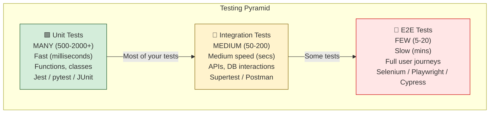

---

### Test Types in the Pipeline

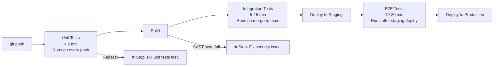

---

## ⚙️ Hands-On: Coverage Threshold in CI

```yaml
# GitHub Actions — enforce minimum coverage
- name: Run tests with coverage
  run: |
    npm test -- --coverage --coverageThreshold='{"global":{"lines":80}}'
  # Pipeline fails if line coverage drops below 80%
```

```yaml
# SonarCloud quality gate in GitHub Actions
- name: SonarCloud Scan
  uses: SonarSource/sonarcloud-github-action@master
  env:
    GITHUB_TOKEN: ${{ secrets.GITHUB_TOKEN }}
    SONAR_TOKEN: ${{ secrets.SONAR_TOKEN }}
# SonarCloud quality gate: fails if coverage < 80%, or new bugs > 0, or critical vulnerabilities > 0
```

```python
# pytest with coverage report
pytest --cov=src --cov-report=xml --cov-fail-under=80
# --cov-fail-under=80 → pipeline fails if coverage < 80%
```

---

## ⚠️ Common Gotchas

| Gotcha | Problem | Fix |
|---|---|---|
| **Coverage without assertions** | 100% coverage but tests just call functions without asserting output | Review test quality, not just coverage number |
| **Flaky tests** | Intermittent failures erode pipeline trust — developers start ignoring red builds | Tag flaky tests; quarantine them; fix root cause |
| **Too many E2E tests** | 200 E2E tests = 2-hour pipeline — nobody waits | Move coverage to unit/integration tests; keep E2E count low |
| **Tests only run locally** | "Tests pass on my machine" — fails in CI due to env differences | Always run the same test command locally that CI runs |

---

## 🧠 Summary

| Test Type | Quantity | Speed | When to Run |
|---|---|---|---|
| **Unit** | Many (500+) | Milliseconds | Every push |
| **Integration** | Medium (50-200) | Seconds | Every merge |
| **E2E** | Few (5-20) | Minutes | After staging deploy |
| **Smoke** | Very few | Seconds | After every deploy |
| **Coverage** | Metric, not test | — | Enforce ≥ 80% as quality gate |

---

---

# Q9 — Benefits of CI/CD


## ❓ The Question

> **"What are the main benefits of implementing CI/CD in an organization?"**

**Alternate phrasings you may hear:**
- "Why should a company invest in CI/CD?"
- "How has CI/CD improved your team's delivery speed?"
- "What are the DORA metrics and how does CI/CD improve them?"
- "What is the ROI of a CI/CD pipeline?"

---

## 🎯 Why Interviewers Ask This

This question tests your ability to articulate business value, not just technical mechanics. Interviewers ask this to check:

- **Business communication**: Can you explain DevOps value to a non-technical audience?
- **DORA metrics awareness**: Do you know the research-backed metrics that prove CI/CD effectiveness?
- **Experience depth**: Can you give concrete examples from real work?

> 💡 **Instant win**: Most candidates list generic benefits. You stand out by citing **DORA metrics** — the research-backed framework by Google's DevOps Research team showing that elite teams deploy 973x more frequently and recover from incidents 6,570x faster than low performers.

---

## 📖 Key Terminologies

| Term | Meaning |
|---|---|
| **DORA metrics** | Four key metrics from DevOps Research and Assessment (Google): deploy frequency, lead time, MTTR, change failure rate |
| **Deploy frequency** | How often code reaches production — elite teams deploy multiple times per day |
| **Lead time for changes** | Time from code commit to running in production — elite: under 1 hour; low: months |
| **MTTR** | Mean Time to Recovery — how quickly you restore service after an incident |
| **Change failure rate** | % of deployments that cause a production incident — elite: 0-15%; low: 46-60% |
| **Technical debt** | Accumulated shortcuts in code that slow future development |
| **Feedback loop** | How quickly developers learn about the impact of their changes |
| **DevEx (Developer Experience)** | How productive and satisfied developers are — CI/CD directly improves this |

---

## 🗣️ How to Answer (Structured)

**1. Faster delivery:**
> "CI/CD dramatically reduces the time from code commit to production. Elite teams measure lead time in hours; low performers measure it in months. Small, frequent deployments mean users get features and fixes faster."

**2. Higher quality, fewer bugs:**
> "Automated testing on every commit catches regressions immediately — when the code is fresh and the fix is fast. Without CI, bugs might not be caught until a QA phase weeks later, when the developer has moved on to other work and context is lost."

**3. Reduced deployment risk:**
> "Small deployments are far less risky than big-bang releases. If something goes wrong, you know exactly which small change caused it and you revert it immediately. MTTR goes from hours to minutes."

**4. Developer productivity and confidence:**
> "Developers who work with good CI/CD pipelines are more productive and more confident making changes. They can refactor freely knowing tests will catch any regressions. Fear of deployment goes away."

**5. DORA metrics:**
> "The DORA research from Google shows that the top-performing engineering teams — Netflix, Amazon, Google — deploy on-demand, have lead times under an hour, recover from incidents in under an hour, and have change failure rates under 15%. CI/CD is the primary enabler of all four metrics."

---

## 🖼️ Visuals

### DORA Metrics — Elite vs Low Performers

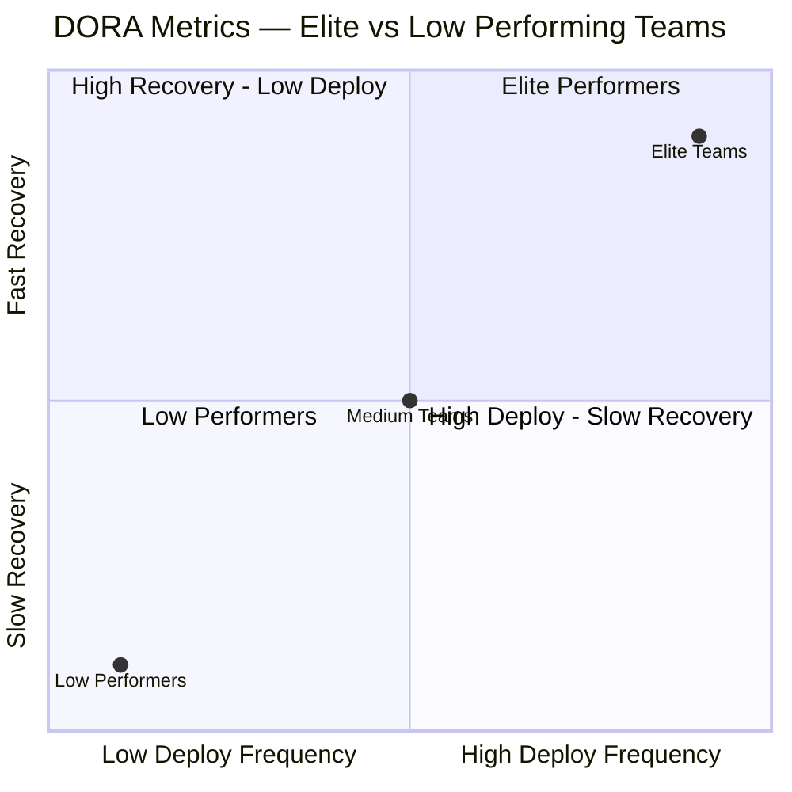

---

### CI/CD Benefits at a Glance

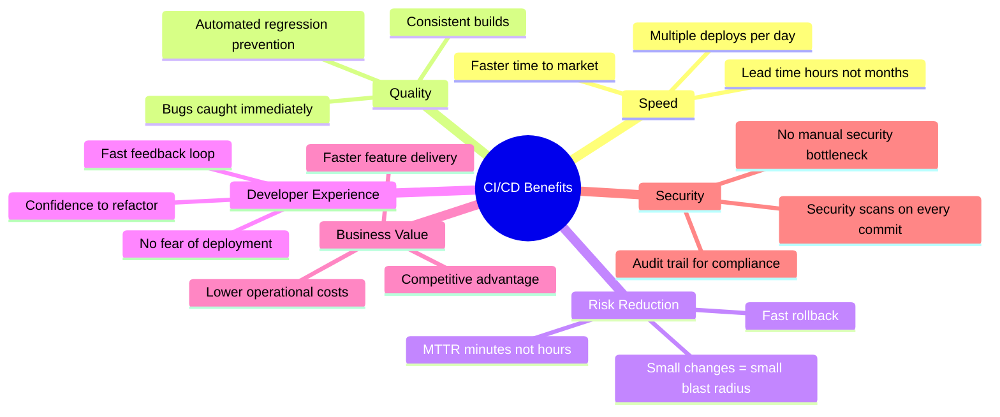

---

## 🧠 Summary

| Benefit | Metric |
|---|---|
| **Speed** | Lead time: months → hours |
| **Quality** | Change failure rate: 46% → under 15% |
| **Recovery** | MTTR: hours → minutes |
| **Frequency** | Deploys: quarterly → multiple/day |
| **Developer confidence** | Refactor freely; tests catch regressions |
| **Security** | Automated scanning on every commit |

---

---

# Q10 — CI/CD Tools — What Have You Used and How Do You Choose?


## ❓ The Question

> **"What CI/CD tools have you used? How would you choose between them for a new project?"**

**Alternate phrasings you may hear:**
- "Have you worked with Jenkins? GitHub Actions? Azure Pipelines?"
- "What is the difference between Jenkins and GitHub Actions?"
- "What CI/CD tool would you recommend for a startup on AWS?"
- "What factors do you consider when selecting a CI/CD platform?"

---

## 🎯 Why Interviewers Ask This

This question probes both breadth and judgment. Interviewers ask this to check:

- **Tooling exposure**: Have you worked with more than one CI/CD platform?
- **Decision-making framework**: Can you reason about tool selection based on context?
- **Avoiding fanaticism**: Can you acknowledge trade-offs rather than dogmatically preferring one tool?

> 💡 **Instant win**: Most candidates say "I've only used [one tool]." You stand out by demonstrating awareness of multiple tools and articulating **when you would choose each** based on SCM choice, team size, cloud platform, and compliance requirements.

---

## 📖 Key Terminologies

| Tool | Description |
|---|---|
| **GitHub Actions** | GitHub-native CI/CD — YAML workflows, 20,000+ Marketplace actions, SaaS |
| **Jenkins** | Open-source, self-hosted, Groovy pipelines, 1,800+ plugins, any SCM |
| **GitLab CI/CD** | GitLab-native, `.gitlab-ci.yml`, excellent for self-hosted GitLab orgs |
| **Azure Pipelines** | Microsoft Azure DevOps — excellent for .NET, Azure, Windows |
| **CircleCI** | SaaS CI/CD — fast orbs ecosystem, Docker-first, good parallelism |
| **Travis CI** | Early SaaS CI leader — largely superseded by GitHub Actions for open source |
| **ArgoCD** | GitOps continuous delivery for Kubernetes — not CI, but CD |
| **Tekton** | Kubernetes-native CI/CD — CRD-based pipelines, cloud-agnostic |
| **Drone CI** | Lightweight, Docker-based, self-hosted or cloud |

---

## 🗣️ How to Answer (Structured)

**1. Name the tools you've used:**

> "I've worked primarily with GitHub Actions and Jenkins. I have some exposure to GitLab CI and have read about Azure Pipelines."

**2. Give context on each:**

> "I use GitHub Actions for all new projects — it requires zero infrastructure, the Marketplace has an action for almost everything, and the YAML syntax is clean and readable. For teams already on GitHub it's the obvious choice. Jenkins I've used in enterprise environments — it's incredibly flexible and can integrate with any tool, but the plugin management and controller maintenance overhead is significant."

**3. Show selection thinking:**

> "When recommending a tool for a new project I ask: Where is the code hosted? GitHub-first teams should use Actions. Are there compliance/air-gapped requirements? Jenkins or self-hosted GitLab. What cloud platform? AWS teams love Actions with OIDC; Azure shops use Azure Pipelines natively. What's the team's ops capacity? Small team with no DevOps infrastructure person → definitely choose a SaaS solution like Actions or CircleCI."

---

## 🔐 Security Perspective (DevSecOps)

| Tool | Key Security Feature |
|---|---|
| **GitHub Actions** | OIDC for cloud auth; SHA-pinned actions; CodeQL native; secret masking |
| **Jenkins** | Full control over pipeline code; Vault plugin for secrets; runs in your infra |
| **GitLab CI** | Built-in SAST/DAST/container scanning; no external tool needed |
| **Azure Pipelines** | Azure Key Vault integration; Microsoft identity platform; compliance certifications |

---

## 🖼️ Visuals

### Tool Selection Decision Tree

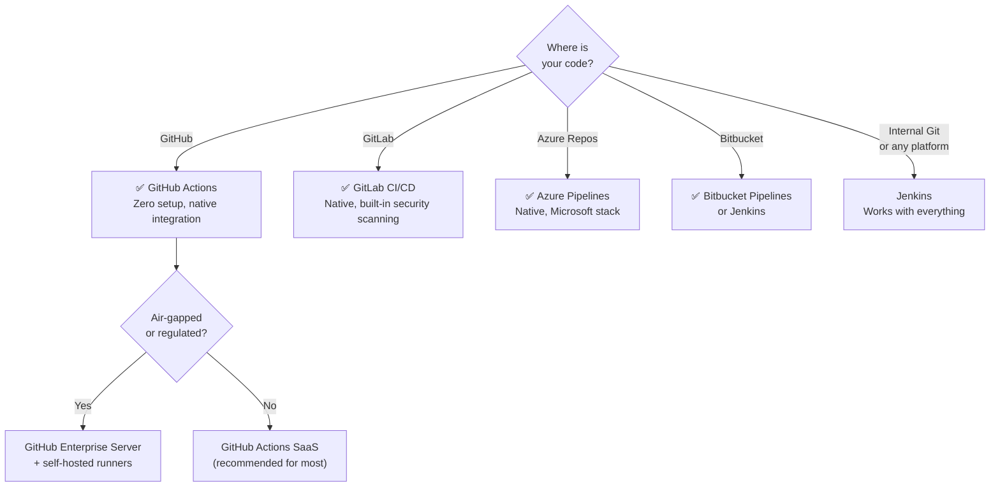

---

## 🔄 Quick Tool Comparison

| Tool | Hosting | Setup | SCM | Best For |
|---|---|---|---|---|
| **GitHub Actions** | SaaS | Minutes | GitHub | GitHub-native teams, cloud-native apps |
| **Jenkins** | Self-hosted | Hours–Days | Any | Enterprise, air-gapped, any SCM |
| **GitLab CI** | SaaS / Self | Minutes | GitLab | GitLab-native, built-in security |
| **Azure Pipelines** | SaaS | 30 min | Azure/GitHub | Microsoft stack, Azure, .NET |
| **CircleCI** | SaaS | Minutes | GitHub/Bitbucket | Fast builds, Docker-first |
| **Tekton** | Self (K8s) | Hours | Any | Kubernetes-native enterprises |

---

## 🧠 Summary

| Factor | Recommendation |
|---|---|
| **Code on GitHub** | GitHub Actions — native, zero setup |
| **Code on GitLab** | GitLab CI/CD — native, built-in scanning |
| **Microsoft / Azure stack** | Azure Pipelines — native integrations |
| **Any SCM / enterprise / air-gapped** | Jenkins — maximum flexibility |
| **Small team, no DevOps infra person** | Any SaaS (Actions, CircleCI) — zero maintenance |
| **Regulated industry (data sovereignty)** | Jenkins + self-hosted runners, or GitHub Enterprise Server |

---

## 📋 Overall CI/CD Beginner Quick Reference

```bash
# === CI/CD Core Concepts ===
# CI  = integrate + build + test on every commit
# CD (Delivery)    = always deployable; human approves production
# CD (Deployment)  = auto-deploys to production on every passing build

# === Pipeline Stages (in order) ===
# 1. Lint/format check   (~30 sec)
# 2. Unit tests          (~2 min)
# 3. Build artifact      (~3 min)
# 4. Security scan       (~5 min)
# 5. Publish to registry (~1 min)
# 6. Deploy to staging   (~10 min)
# 7. Approval gate       (variable)
# 8. Deploy to production (~5 min)

# === Deployment Strategies ===
# Recreate    = stop all → start all (downtime)
# Rolling     = replace one at a time (default K8s)
# Blue-Green  = two envs, flip switch (instant rollback)
# Canary      = 5% traffic first, monitor, then ramp

# === DORA Metrics (Elite Targets) ===
# Deploy frequency       → multiple per day
# Lead time for changes  → < 1 hour
# MTTR                   → < 1 hour
# Change failure rate    → < 15%

# === Never Do In Pipelines ===
# ❌ Hardcode secrets in YAML
# ❌ Echo secret values to logs
# ❌ Tag Docker images as 'latest' only
# ❌ Rebuild artifact per environment
# ❌ Deploy directly to production without staging
```
