# CI/CD Interview Questions — Medium & Hard Level

> **Target Audience:** Mid-level DevOps/DevSecOps Engineers (3–5 years experience)
> **Difficulty:** Medium ⚡ and Hard 🔥
> **Last Updated:** 2025
> **Focus:** Pipeline optimization, GitOps, supply chain security, advanced deployment strategies, multi-environment design, rollback, compliance, and cost

---

## Table of Contents

| # | Question | Level |
|---|----------|-------|
| Q1 | Pipeline Caching & Optimization Strategies | ⚡ Medium |
| Q2 | Parallelization & Fan-Out / Fan-In Patterns | ⚡ Medium |
| Q3 | GitOps Principles & Pull-Based Deployments | ⚡ Medium |
| Q4 | Multi-Environment Promotion Strategies | ⚡ Medium |
| Q5 | Rollback Strategies in Production Pipelines | ⚡ Medium |
| Q6 | Pipeline Security & Supply Chain (SLSA, SBOM) | 🔥 Hard |
| Q7 | Canary Deployments with Automated Analysis | 🔥 Hard |
| Q8 | IaC & Infrastructure Pipelines (Terraform in CI) | ⚡ Medium |
| Q9 | Pipeline Testing — Contract, Mutation & Chaos | 🔥 Hard |
| Q10 | Compliance, Audit Pipelines & Policy as Code | 🔥 Hard |

---

---

# Q1 — Pipeline Caching & Optimization Strategies

---

## ❓ The Question

> **"Our CI pipeline takes 45 minutes to run. How would you diagnose and optimize it? What caching strategies would you implement?"**

---

## 🎯 Why Interviewers Ask This

Slow pipelines kill developer productivity. Every 10-minute pipeline run that turns into 45 minutes means engineers lose flow, batch changes together (increasing risk), and stop trusting CI. Interviewers want to know if you can systematically diagnose bottlenecks, not just throw hardware at the problem.

**Instant Win Tip:** Mention **"build once, cache aggressively, parallelize the rest"** and reference the specific caching mechanism for the tool they use (GitHub Actions cache, Docker layer caching, Gradle/Maven cache).

---

## 📖 Key Terminologies

| Term | Definition |
|------|-----------|
| **Cache Hit Rate** | % of pipeline runs that successfully restore a cache rather than rebuilding |
| **Layer Caching** | Docker's ability to reuse unchanged image layers from previous builds |
| **Dependency Cache** | Caching `node_modules`, `.m2`, pip packages between runs |
| **Incremental Build** | Only rebuilding changed modules (Nx, Turborepo, Gradle) |
| **Test Sharding** | Splitting test suite across N parallel runners |
| **Critical Path** | The longest sequential chain of steps — determines minimum pipeline time |
| **Buildx / BuildKit** | Docker's modern build engine with inline cache support |
| **Remote Cache** | Shared cache server (Bazel remote cache, Gradle Enterprise) accessible to all runners |

---

## 🗣️ How to Answer (Structured)

### Step 1 — Diagnose First, Optimize Second

```
45-minute pipeline → MEASURE before changing anything
```

**Tools to diagnose:**
```yaml
# GitHub Actions: use built-in timing in run summary
# Jenkins: Pipeline Stage View, Blue Ocean waterfall
# GitLab CI: CI/CD → Jobs → duration column
```

Ask these questions:
- Which stage takes the longest? (usually: test, build, or scan)
- Are stages running sequentially when they could be parallel?
- Is there repeated work across jobs? (each job installs dependencies from scratch)
- What % of pipeline time is spent on dependency installation?

### Step 2 — Dependency Caching (Biggest Win)

```yaml
# GitHub Actions — Node.js dependency cache
- name: Cache node_modules
  uses: actions/cache@v4
  with:
    path: ~/.npm
    key: ${{ runner.os }}-node-${{ hashFiles('**/package-lock.json') }}
    restore-keys: |
      ${{ runner.os }}-node-

# Python
- uses: actions/cache@v4
  with:
    path: ~/.cache/pip
    key: ${{ runner.os }}-pip-${{ hashFiles('**/requirements.txt') }}

# Maven / Java
- uses: actions/cache@v4
  with:
    path: ~/.m2/repository
    key: ${{ runner.os }}-maven-${{ hashFiles('**/pom.xml') }}
```

**Cache key strategy:**
```
OS + language + lock file hash  →  exact match
OS + language                   →  fallback restore (still saves install time)
```

### Step 3 — Docker Layer Caching

```dockerfile
# BAD — dependency install after code copy invalidates cache on every change
COPY . .
RUN npm install

# GOOD — copy only what affects dependencies first
COPY package*.json ./
RUN npm install          # ← cached unless package.json changes
COPY . .
RUN npm run build
```

**BuildKit inline cache (GitHub Actions):**
```yaml
- name: Build and push Docker image
  uses: docker/build-push-action@v5
  with:
    cache-from: type=registry,ref=myrepo/myapp:cache
    cache-to: type=registry,ref=myrepo/myapp:cache,mode=max
    push: true
    tags: myrepo/myapp:${{ github.sha }}
```

### Step 4 — Parallelization

```yaml
jobs:
  lint:
    runs-on: ubuntu-latest
    steps: [...]

  unit-tests:
    runs-on: ubuntu-latest
    steps: [...]

  security-scan:
    runs-on: ubuntu-latest
    steps: [...]

  # All three run in parallel ↑
  # Build only starts after all pass ↓

  build:
    needs: [lint, unit-tests, security-scan]
    runs-on: ubuntu-latest
    steps: [...]
```

### Step 5 — Test Sharding

```yaml
strategy:
  matrix:
    shard: [1, 2, 3, 4]   # Split tests into 4 parallel buckets

steps:
  - name: Run tests (shard ${{ matrix.shard }}/4)
    run: |
      npx jest --shard=${{ matrix.shard }}/4
      # or: pytest --splits 4 --group ${{ matrix.shard }}
```

### Step 6 — Incremental Builds (Monorepos)

```yaml
# Nx affected — only build/test what changed
- name: Run affected tests
  run: npx nx affected --target=test --base=origin/main

# Turborepo
- name: Build affected
  run: npx turbo run build --filter=[HEAD^1]
```

---

## 🔐 Security Perspective

- **Cache poisoning risk**: A malicious PR could craft a `package-lock.json` that restores a tampered cache. Always use exact hash-based keys, never wildcard-only keys for security-sensitive builds.
- **Don't cache secrets**: Ensure `~/.aws/credentials`, `.env`, or token files are excluded from cache paths.
- **Signed artifacts**: Even with caching, ensure published artifacts are signed (SLSA provenance) — cache hit ≠ trusted artifact.
- **Docker cache scope**: Use `mode=max` only for trusted branches; PRs from forks should not have write access to the shared cache.

---

## 🖼️ Visuals

### Pipeline Optimization Decision Flow

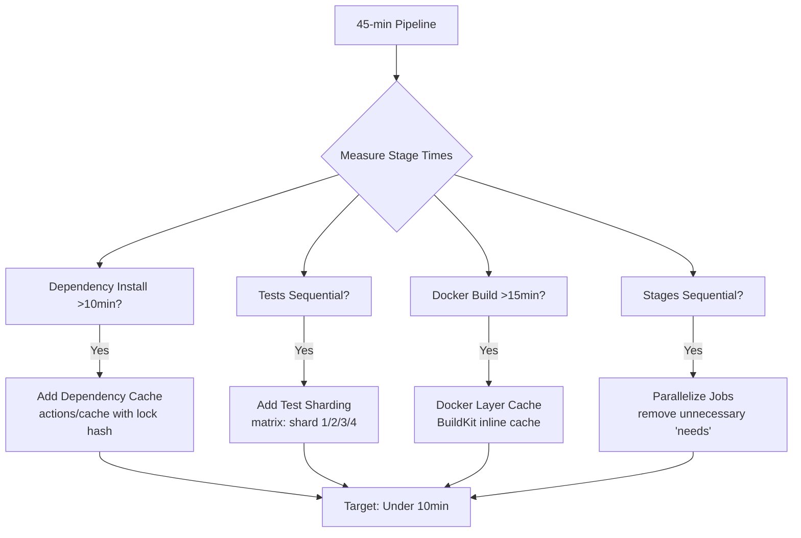

### Cache Key Strategy

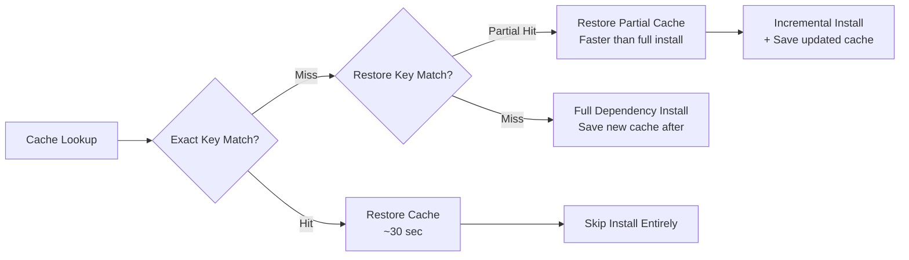

### Before vs After Optimization

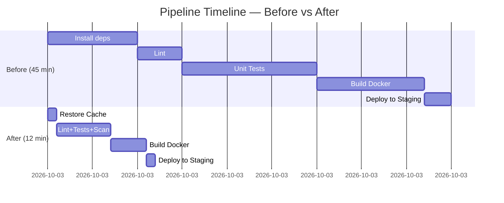

### Cache Invalidation Logic

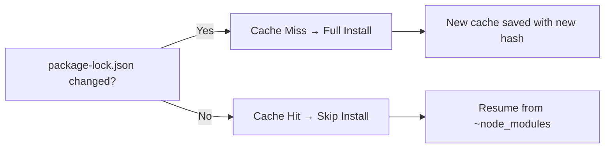

---

## ⚙️ Hands-On

### Measure pipeline time per step (GitHub Actions)

```bash
# In a step, wrap commands with time
- name: Install dependencies (timed)
  run: |
    START=$(date +%s)
    npm ci
    END=$(date +%s)
    echo "Install took $((END-START)) seconds"
```

### Cache effectiveness report

```bash
# Check cache hit ratio by inspecting workflow run logs
# Look for "Cache restored successfully" vs "Cache not found"
# GitHub Actions API:
curl -H "Authorization: token $GH_TOKEN" \
  "https://api.github.com/repos/ORG/REPO/actions/cache/usage"
```

### Docker BuildKit cache analysis

```bash
# Enable BuildKit
export DOCKER_BUILDKIT=1

# Build with cache mount (for package managers)
docker build \
  --cache-from type=registry,ref=myrepo/app:cache \
  --build-arg BUILDKIT_INLINE_CACHE=1 \
  -t myrepo/app:latest .

# Show build history (layer sizes)
docker history myrepo/app:latest
```

---

## ⚠️ Common Gotchas

| Gotcha | Problem | Fix |
|--------|---------|-----|
| **Wrong cache key** | Using only `runner.os` — never misses, never updates | Always include lock file hash |
| **Caching `node_modules` directly** | Platform-specific binaries break across OS | Cache `~/.npm` (npm cache) not `node_modules` |
| **Docker COPY order** | `COPY . .` before `RUN npm install` breaks layer cache | Always copy dependency files first |
| **Caching build outputs** | Build artifacts include secrets or env-specific values | Only cache immutable inputs (deps), not outputs |
| **No cache on PRs** | Security restriction means fork PRs can't write cache | Use separate cache keys for PR vs main branch |
| **Stale cache growth** | Cache accumulates over months, GitHub has 10GB limit | Rotate cache keys regularly; use `actions/cache` eviction |

---

## ✅ Best Practices

- Hash lock files (`package-lock.json`, `Gemfile.lock`, `go.sum`) for cache keys — never free-text branch names
- Separate cache per OS/architecture in matrix builds
- Use `restore-keys` as a fallback to partial cache rather than cold start
- Measure cache hit rate weekly; target > 80% for dependency caches
- For Docker, always use multi-stage builds to keep final image small
- Use BuildKit `--mount=type=cache` for package manager caches inside Dockerfile
- In monorepos, use affected-build tools (Nx, Turborepo, Bazel) to skip unchanged modules
- Store remote Gradle/Bazel caches on GCS/S3 for cross-runner sharing

---

## 🌍 Real-World Scenario

**Company:** E-commerce platform, Node.js monorepo, 12 teams, 200 commits/day

**Problem:** CI pipeline: 52 minutes. Engineers pushing to feature branches were waiting nearly an hour for feedback. Pipeline ran: `npm install` (12 min) → lint (8 min) → unit tests (20 min) → build (8 min) → push image (4 min).

**Investigation:**
- `npm install` ran fresh every job, every time (no caching)
- Lint, unit tests, and security scan ran sequentially
- Docker build started from scratch (no layer cache)
- All 800 tests ran even when only 2 files changed

**Changes made:**
1. Added `actions/cache` with `hashFiles('package-lock.json')` key
2. Parallelized lint + unit tests + Snyk scan into 3 concurrent jobs
3. Enabled Docker BuildKit with registry-backed cache
4. Added Nx affected to skip tests for unchanged packages

**Result:**
- Cache hit: npm install went from 12 min → 45 sec
- Parallelization: lint/test/scan critical path: 8 min
- Docker build: 8 min → 2.5 min (layer cache hit)
- **Total: 52 min → 11 min (79% reduction)**

---

## 🔄 Comparison Table

| Strategy | Time Saved | Complexity | Risk |
|----------|-----------|------------|------|
| Dependency caching | High (8–15 min) | Low | Low |
| Docker layer caching | High (5–12 min) | Medium | Low |
| Parallelizing jobs | High (multiplicative) | Low | Low |
| Test sharding | Medium (depends on suite) | Medium | Medium |
| Incremental builds (Nx/Turbo) | Very High (in monorepos) | High | Medium |
| Remote Bazel cache | Extreme | Very High | Low |

---

## 📋 Quick Reference

```bash
# GitHub Actions cache
uses: actions/cache@v4
key: ${{ runner.os }}-node-${{ hashFiles('**/package-lock.json') }}

# Docker BuildKit
DOCKER_BUILDKIT=1 docker build --cache-from ...

# Nx affected
npx nx affected --target=test --base=origin/main

# Test sharding (Jest)
npx jest --shard=1/4
```

---

## 🧠 Summary

> **45-minute pipelines are a people problem disguised as a technical problem.** The fix is: measure first → add dependency caching (biggest ROI) → parallelize independent jobs → add Docker layer caching → shard large test suites → use incremental builds in monorepos. Never optimize blindly — cache hit rate and stage timing metrics tell you exactly where to focus.

---

---

# Q2 — Parallelization & Fan-Out / Fan-In Patterns

---

## ❓ The Question

> **"Explain fan-out/fan-in pipeline patterns. When would you use a matrix strategy vs dynamic parallelism? What are the failure handling challenges?"**

---

## 🎯 Why Interviewers Ask This

Parallelization is one of the most impactful pipeline optimizations. But it introduces real complexity: how do you aggregate results, handle partial failures, and avoid race conditions? Interviewers want to see that you understand both the pattern and its edge cases.

**Instant Win Tip:** Describe **fan-out** (one job spawns many parallel workers) and **fan-in** (all parallel workers must complete before the next stage) with a concrete example — test sharding across 4 runners is the most relatable.

---

## 📖 Key Terminologies

| Term | Definition |
|------|-----------|
| **Fan-Out** | One trigger spawns N parallel jobs/steps |
| **Fan-In** | N parallel jobs must all complete before the next stage begins |
| **Matrix Strategy** | Static fan-out defined in YAML (known values at pipeline authoring time) |
| **Dynamic Matrix** | Fan-out where the list of parallel jobs is computed at runtime |
| **Job Output** | Data passed between jobs via `$GITHUB_OUTPUT` or artifacts |
| **Continue-on-error** | Allow a job to fail without blocking the fan-in |
| **Fail-fast** | Matrix default: cancel all remaining matrix jobs on first failure |
| **Needs context** | GitHub Actions syntax to access outputs from upstream jobs |

---

## 🗣️ How to Answer (Structured)

### Fan-Out / Fan-In Explained

```
Fan-Out:                      Fan-In:
                              (waits for all)
Trigger ──► Job-A             Job-A ──┐
         ──► Job-B     →     Job-B ──┼──► Build Job
         ──► Job-C             Job-C ──┘
```

### Static Matrix (Known Values)

```yaml
jobs:
  test:
    strategy:
      matrix:
        os: [ubuntu-latest, windows-latest, macos-latest]
        node: [18, 20, 22]
      fail-fast: false       # Don't cancel siblings on first failure
      max-parallel: 6        # Limit concurrent jobs (cost control)
    runs-on: ${{ matrix.os }}
    steps:
      - uses: actions/setup-node@v4
        with:
          node-version: ${{ matrix.node }}
      - run: npm test
```

This creates 3 × 3 = **9 parallel jobs** automatically.

### Dynamic Matrix (Computed at Runtime)

```yaml
jobs:
  # Step 1: Compute the matrix
  generate-matrix:
    runs-on: ubuntu-latest
    outputs:
      matrix: ${{ steps.set-matrix.outputs.matrix }}
    steps:
      - id: set-matrix
        run: |
          # Get changed services dynamically
          SERVICES=$(git diff --name-only origin/main | \
            grep '^services/' | \
            cut -d/ -f2 | sort -u | \
            jq -R -s -c 'split("\n")[:-1]')
          echo "matrix={\"service\":$SERVICES}" >> $GITHUB_OUTPUT

  # Step 2: Fan-out over computed values
  test-service:
    needs: generate-matrix
    strategy:
      matrix: ${{ fromJson(needs.generate-matrix.outputs.matrix) }}
    runs-on: ubuntu-latest
    steps:
      - run: make test SERVICE=${{ matrix.service }}
```

### Fan-In with Result Aggregation

```yaml
jobs:
  test-shard-1:
    runs-on: ubuntu-latest
    steps:
      - run: npx jest --shard=1/3 --json --outputFile=results-1.json
      - uses: actions/upload-artifact@v4
        with:
          name: test-results-1
          path: results-1.json

  test-shard-2:
    runs-on: ubuntu-latest
    steps:
      - run: npx jest --shard=2/3 --json --outputFile=results-2.json
      - uses: actions/upload-artifact@v4
        with:
          name: test-results-2
          path: results-2.json

  test-shard-3:
    runs-on: ubuntu-latest
    steps:
      - run: npx jest --shard=3/3 --json --outputFile=results-3.json
      - uses: actions/upload-artifact@v4
        with:
          name: test-results-3
          path: results-3.json

  # Fan-In: merge results
  aggregate-results:
    needs: [test-shard-1, test-shard-2, test-shard-3]
    runs-on: ubuntu-latest
    steps:
      - uses: actions/download-artifact@v4
        with:
          pattern: test-results-*
          merge-multiple: true
      - run: |
          # Merge JSON test reports
          jq -s '{
            numPassedTests: (map(.numPassedTests) | add),
            numFailedTests: (map(.numFailedTests) | add),
            testResults: (map(.testResults) | add)
          }' results-*.json > merged-results.json
```

### Handling Partial Failures

```yaml
# Scenario: 1 of 5 services failed — should we block the deploy?
jobs:
  deploy-services:
    strategy:
      matrix:
        service: [auth, payment, orders, catalog, notifications]
      fail-fast: false
    continue-on-error: ${{ matrix.service == 'notifications' }}
    # ^ notifications failure won't block other services
```

---

## 🔐 Security Perspective

- **Race conditions in shared state**: Parallel jobs writing to the same artifact name will cause conflicts — use unique names per shard
- **Secret access in matrix jobs**: All matrix jobs share the same secret access scope; consider if all parallel branches should have prod credentials
- **Dynamic matrix injection**: If the matrix is computed from user input (PR title, branch name), sanitize it — an attacker could inject extra jobs or exfiltrate secrets

---

## 🖼️ Visuals

### Fan-Out / Fan-In Pattern

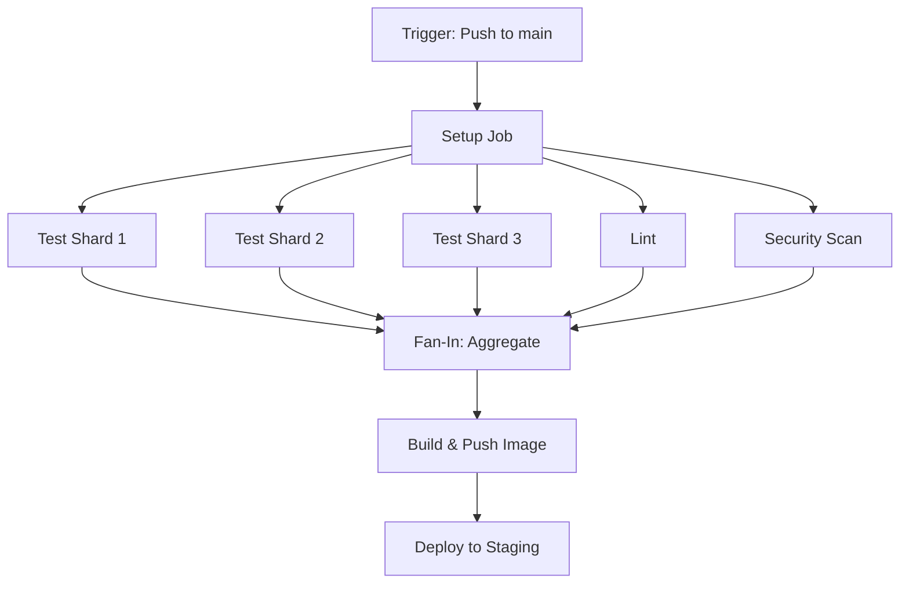

### Dynamic Matrix Flow

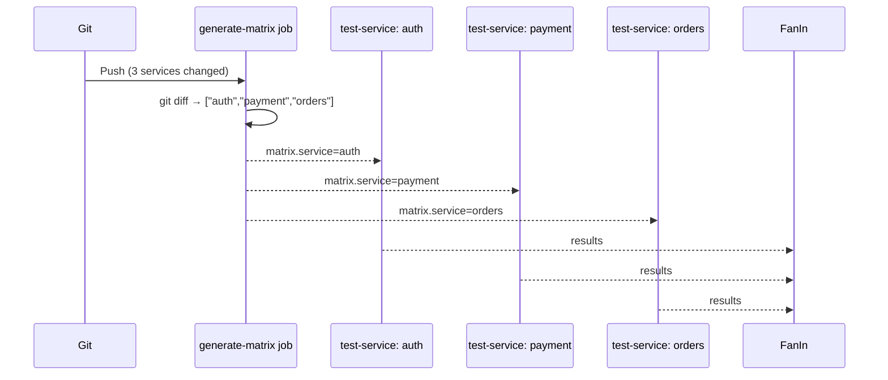

### Matrix Failure Modes

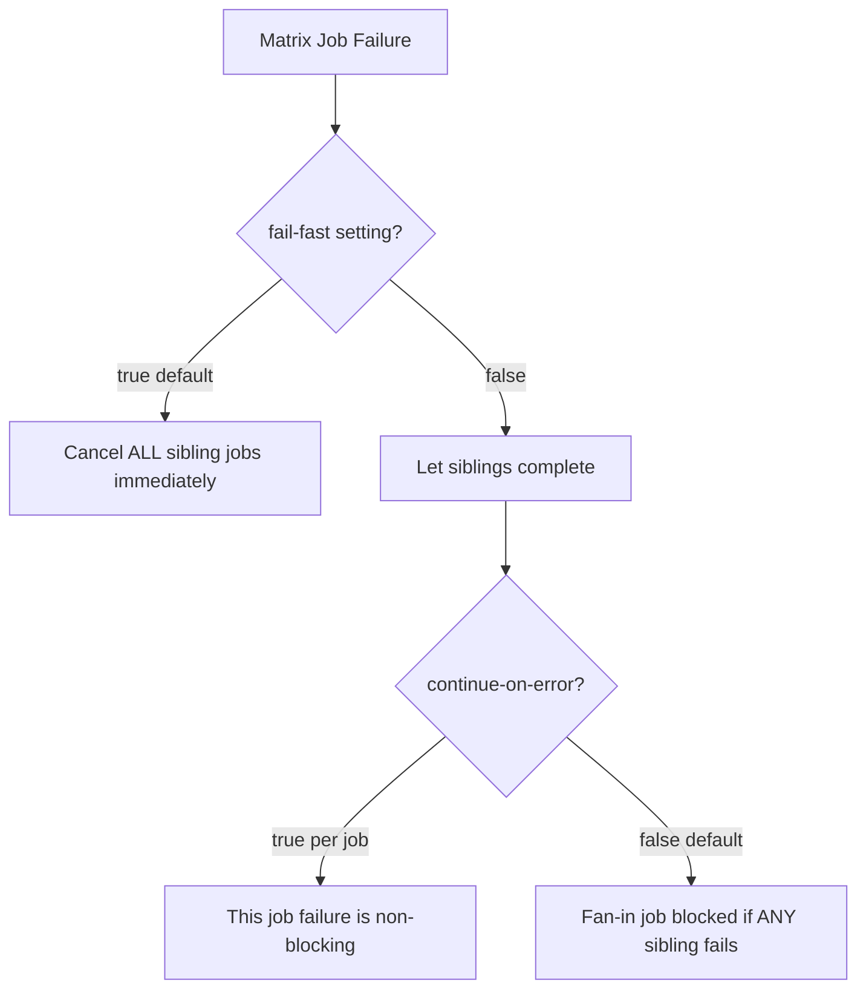

### Artifact Passing Between Jobs

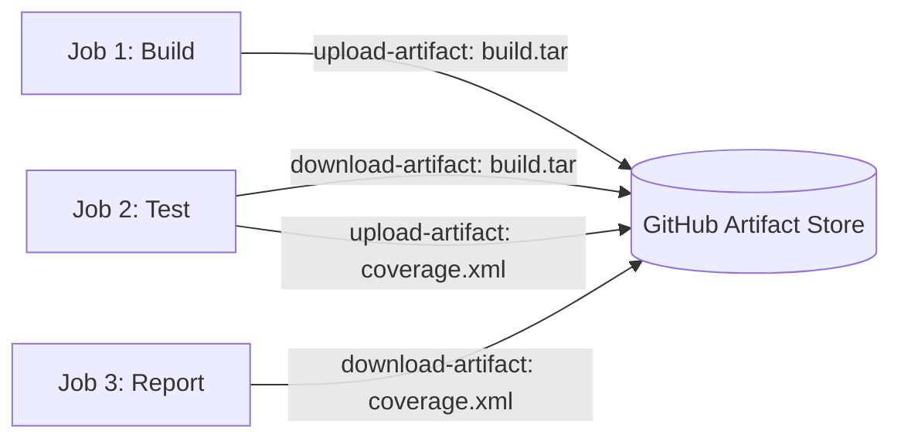

---

## ⚙️ Hands-On

```bash
# Test locally with act (GitHub Actions local runner)
act push --job test --matrix os:ubuntu-latest,node:20

# Check max-parallel limits for cost control
# GitHub Free: 20 concurrent jobs for public repos
# GitHub Team: 60 concurrent jobs

# Compute optimal shard count
TOTAL_TESTS=800
TARGET_TIME_MINS=5
TESTS_PER_MIN=40  # estimate from single run
SHARDS=$(( TOTAL_TESTS / (TARGET_TIME_MINS * TESTS_PER_MIN) ))
echo "Recommended shards: $SHARDS"
```

---

## ⚠️ Common Gotchas

| Gotcha | Symptom | Fix |
|--------|---------|-----|
| **fail-fast: true (default)** | One flaky test kills all matrix jobs | Set `fail-fast: false` for non-critical matrices |
| **Artifact name collision** | Parallel jobs overwrite each other's artifacts | Use `${{ matrix.shard }}` in artifact names |
| **Job output size limit** | GitHub outputs limited to 1MB | Store large data in artifacts, pass artifact name as output |
| **Dynamic matrix empty** | If no services changed, matrix is `[]` — job errors | Add a guard step; skip job if matrix is empty |
| **Clock skew in parallel jobs** | Race condition writing to shared S3 prefix | Use job-specific prefixes; merge in fan-in step |

---

## ✅ Best Practices

- Always set `fail-fast: false` when running independent test shards — one flaky test shouldn't kill all 8 shards
- Set `max-parallel` to avoid overwhelming shared resources (databases, staging env)
- Use artifacts to pass data between fan-out and fan-in jobs — never rely on job outputs for large payloads
- For dynamic matrix: always validate the JSON output before using it as a matrix to avoid syntax errors
- Document why a specific job has `continue-on-error: true` — it's easy to forget why a failure is intentionally silenced

---

## 🧠 Summary

> **Fan-out/fan-in is the backbone of scalable pipelines.** Use static matrix for known combinations (OS × Node version), dynamic matrix for runtime-computed values (changed services). Always set `fail-fast: false` for independent parallel work, use artifacts for result aggregation, and be explicit about which failures are allowed to be non-blocking.

---

---

# Q3 — GitOps Principles & Pull-Based Deployments

---

## ❓ The Question

> **"Explain the GitOps model. How does pull-based deployment (ArgoCD/Flux) differ from push-based (kubectl in CI)? What are the security and operational advantages?"**

---

## 🎯 Why Interviewers Ask This

GitOps is now the standard deployment model for Kubernetes workloads. Interviewers want to verify you understand why it emerged, what problems it solves, and the trade-offs — not just that you've used ArgoCD before.

**Instant Win Tip:** Lead with the **four GitOps principles** (declarative, versioned, automatically applied, continuously reconciled) and immediately contrast with push-based: "In push-based CI, if someone `kubectl apply`s manually and doesn't commit the change, your Git repo no longer reflects reality."

---

## 📖 Key Terminologies

| Term | Definition |
|------|-----------|
| **Desired State** | The configuration declared in Git (what should exist) |
| **Observed State** | What actually exists in the cluster (what does exist) |
| **Reconciliation Loop** | Continuous comparison of desired vs observed; corrects drift |
| **Drift** | When observed state diverges from desired state |
| **Pull-Based** | The cluster agent pulls from Git; cluster initiates the connection |
| **Push-Based** | CI system pushes to the cluster; CI has cluster credentials |
| **Single Source of Truth** | Git is the authoritative record of all deployed state |
| **Out-of-Band Change** | Manual `kubectl` that bypasses Git — the enemy of GitOps |

---

## 🗣️ How to Answer (Structured)

### The Four GitOps Principles (OpenGitOps)

```
1. DECLARATIVE   — desired state described declaratively (YAML, Helm, Kustomize)
2. VERSIONED     — desired state stored in Git (immutable, versioned, auditable)
3. PULLED        — software agents pull and apply the desired state
4. CONTINUOUSLY RECONCILED — agents continuously compare & correct drift
```

### Push-Based vs Pull-Based

**Push-Based (Traditional CI/CD):**
```
Developer → Git Push → CI Pipeline → kubectl apply → Cluster
                           ↑
                     Has cluster credentials
                     (long-lived kubeconfig or ServiceAccount token)
```

**Pull-Based (GitOps):**
```
Developer → Git Push → Git Repo ← ArgoCD/Flux polls ← Cluster Agent
                                        ↓
                                   Applies diff to cluster
                                   Cluster never touched by CI
```

### Security Comparison

| Aspect | Push-Based | Pull-Based (GitOps) |
|--------|-----------|---------------------|
| Cluster credentials | Stored in CI secrets | Not needed in CI |
| Attack surface | CI system has prod access | Only in-cluster agent |
| Blast radius of CI compromise | Full cluster access | Read-only Git access |
| Network | CI must reach cluster API | Cluster agent reaches Git |
| Air-gap support | Difficult (CI needs network) | Easy (agent inside cluster) |

### Drift Detection & Remediation

```yaml
# ArgoCD self-heal example
apiVersion: argoproj.io/v1alpha1
kind: Application
metadata:
  name: my-app
spec:
  syncPolicy:
    automated:
      selfHeal: true      # Auto-correct manual kubectl changes
      prune: true         # Remove resources deleted from Git
    syncOptions:
      - CreateNamespace=true
```

**What happens when someone does `kubectl edit deployment my-app` manually?**
```
1. ArgoCD detects: observed state ≠ desired state (drift)
2. selfHeal: true → ArgoCD reverts the manual change within ~3 minutes
3. Event logged: "Out-of-band change detected, reverting"
4. Slack/PagerDuty alert fires
```

### GitOps Workflow: App Update

```bash
# Developer workflow
git checkout -b feat/bump-image
# Edit: image: myapp:v1.2.3 → image: myapp:v1.3.0
git commit -m "feat: bump myapp to v1.3.0"
git push origin feat/bump-image
# PR review → merge to main
# ArgoCD detects change → applies to cluster → done
```

### Image Update Automation

```yaml
# ArgoCD Image Updater — auto-bump image tags
apiVersion: v1
kind: ConfigMap
metadata:
  name: argocd-image-updater-config
data:
  registries.conf: |
    registries:
    - name: ECR
      api_url: https://123456789.dkr.ecr.us-east-1.amazonaws.com
      credentials: ext:/scripts/ecr-login.sh
      defaultns: library
      insecure: false

# Annotation on Application:
argocd-image-updater.argoproj.io/image-list: myapp=myrepo/myapp
argocd-image-updater.argoproj.io/myapp.update-strategy: semver
argocd-image-updater.argoproj.io/myapp.allow-tags: regexp:^v[0-9]+\.[0-9]+\.[0-9]+$
```

---

## 🔐 Security Perspective

- **No cluster credentials in CI**: The biggest win — a compromised CI runner cannot deploy to production
- **Git as audit log**: Every deployment is a Git commit with author, timestamp, PR reference
- **RBAC via Git**: Branch protection + CODEOWNERS controls who can change what manifests
- **Commit signing**: `git commit -S` + GPG verification by ArgoCD ensures only signed commits are applied
- **Namespace-scoped ArgoCD**: Use AppProject to restrict which namespaces/clusters each application can touch

---

## 🖼️ Visuals

### Push vs Pull Architecture

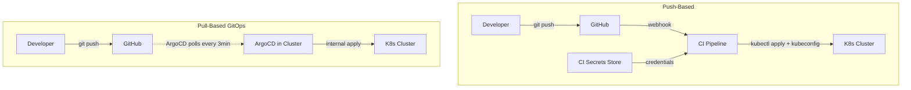

### GitOps Reconciliation Loop

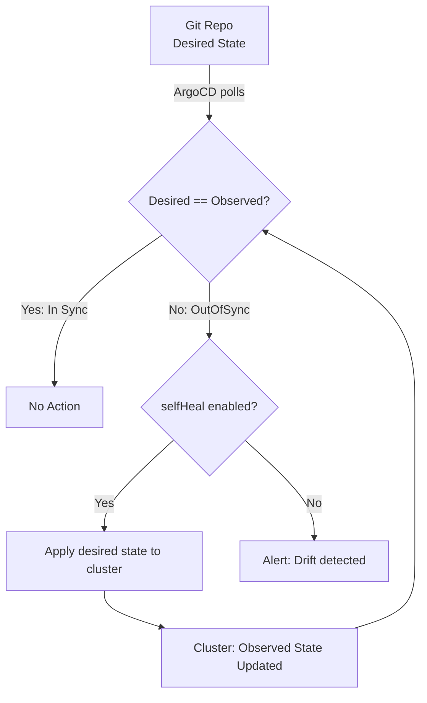

### GitOps Deployment Flow

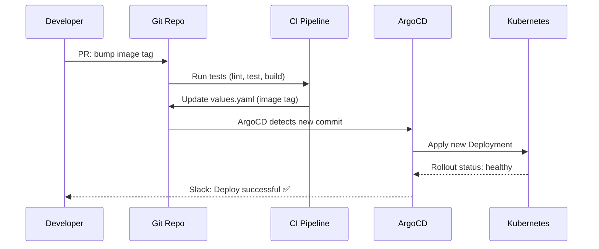

### Drift Correction Timeline

```mermaid
timeline
    title Drift Detection and Auto-Heal
    00:00 : Developer does kubectl edit deployment (manual change)
    00:03 : ArgoCD reconciliation loop runs
    00:03 : Detects OutOfSync state
    00:03 : selfHeal=true triggers apply
    00:04 : Manual change reverted to Git state
    00:04 : Alert sent to Slack
```

---

## ⚙️ Hands-On

```bash
# Check ArgoCD app sync status
argocd app get my-app
argocd app diff my-app    # Show what's out of sync

# Force sync (manual trigger)
argocd app sync my-app --prune

# Check for drift across all apps
argocd app list --output wide | grep OutOfSync

# Enable auto-sync via CLI
argocd app set my-app --sync-policy automated --self-heal --auto-prune

# Rollback to previous Git commit
argocd app history my-app
argocd app rollback my-app <revision-id>
```

---

## ⚠️ Common Gotchas

| Gotcha | Problem | Fix |
|--------|---------|-----|
| **Secrets in Git** | GitOps tempts you to commit secrets | Use Sealed Secrets, ESO, or SOPS — never raw secrets |
| **Auto-sync in production** | An accidental commit auto-deploys breaking change | Use sync windows (maintenance windows) in ArgoCD |
| **Helm drift** | ArgoCD uses `helm template`, not `helm upgrade` — Helm history is absent | Accept this; use ArgoCD history for rollback |
| **Image tag "latest"** | ArgoCD can't detect a new push with same tag | Always use immutable tags (SHA or semver) |
| **Slow reconciliation** | Default 3-minute polling feels slow | Use webhook notifications to trigger immediate sync |

---

## ✅ Best Practices

- Never store secrets in the GitOps repo — use External Secrets Operator or Sealed Secrets
- Use branch protection + required reviews on the `gitops-config` repo just like application code
- Set sync windows to prevent ArgoCD from auto-syncing during peak traffic hours
- Use webhook-triggered sync (not just polling) for sub-minute deploy pipelines
- Separate application code repo from GitOps config repo — CI pushes to config repo, ArgoCD reads from it

---

## 🧠 Summary

> **GitOps inverts the security model**: instead of CI pushing credentials into the cluster, the cluster agent pulls from Git. The result: no prod credentials in CI, automatic drift correction, and a complete Git audit trail of every deployment. Pull-based is safer, more auditable, and more resilient — at the cost of some initial complexity in the tooling setup.

---

---

# Q4 — Multi-Environment Promotion Strategies

---

## ❓ The Question

> **"Design a multi-environment CI/CD pipeline: dev → staging → production. How do you handle environment-specific configuration, promotion gates, and rollback across environments?"**

---

## 🎯 Why Interviewers Ask This

Every real organization runs multiple environments. The challenge isn't just "deploy to prod" — it's how you ensure that what passes in staging is exactly what goes to production, with proper configuration isolation and approval gates. This question tests system design thinking.

**Instant Win Tip:** Say **"promote artifacts, not builds"** — the same Docker image SHA that passed all staging tests is the one deployed to production, with only configuration changing per environment.

---

## 📖 Key Terminologies

| Term | Definition |
|------|-----------|
| **Promotion Gate** | Automated or manual check before advancing to next environment |
| **Environment Parity** | Keeping dev/staging/prod as similar as possible to prevent "works on staging" failures |
| **Config Drift** | When environment-specific config diverges in unexpected ways |
| **Immutable Artifact** | Docker image tagged by SHA — same bits deployed everywhere |
| **Progressive Delivery** | Gradual rollout across environments with automated validation |
| **Ephemeral Environment** | Temporary environment per PR — destroyed after merge |
| **Promotion Branch** | Git branch strategy where merging to `staging` or `main` triggers environment deploy |
| **Approval Gate** | Manual human review step between environments (common before prod) |

---

## 🗣️ How to Answer (Structured)

### Environment Promotion Architecture

```
Dev       → Staging        → Production
(auto)       (auto + tests)   (manual approval)

Image: app:abc123 ─────────────────────────────►
         (same image, different config per env)
```

### Configuration Per Environment (12-Factor App)

```yaml
# Method 1: Helm values per environment
helm upgrade --install my-app ./chart \
  -f values.yaml \
  -f values.staging.yaml    # Override only what differs

# values.yaml (defaults)
replicaCount: 1
image:
  repository: myrepo/app
  tag: "latest"
resources:
  requests:
    cpu: 100m
    memory: 128Mi

# values.production.yaml (overrides)
replicaCount: 5
resources:
  requests:
    cpu: 500m
    memory: 512Mi
  limits:
    cpu: 1000m
    memory: 1Gi
```

### GitHub Actions: Multi-Environment Pipeline

```yaml
name: Multi-Environment Deploy

on:
  push:
    branches: [main]

jobs:
  build:
    runs-on: ubuntu-latest
    outputs:
      image-tag: ${{ steps.meta.outputs.version }}
    steps:
      - uses: actions/checkout@v4
      - name: Build and push
        id: meta
        uses: docker/build-push-action@v5
        with:
          push: true
          tags: myrepo/app:${{ github.sha }}

  deploy-dev:
    needs: build
    runs-on: ubuntu-latest
    environment: development
    steps:
      - name: Deploy to dev
        run: |
          helm upgrade --install my-app ./chart \
            --set image.tag=${{ github.sha }} \
            -f values.dev.yaml \
            --namespace dev

  integration-tests:
    needs: deploy-dev
    runs-on: ubuntu-latest
    steps:
      - name: Run integration tests against dev
        run: |
          npx playwright test --config=playwright.dev.config.ts
      - name: Smoke test
        run: |
          curl -f https://dev.myapp.com/health

  deploy-staging:
    needs: integration-tests
    runs-on: ubuntu-latest
    environment: staging
    steps:
      - name: Deploy to staging
        run: |
          helm upgrade --install my-app ./chart \
            --set image.tag=${{ github.sha }} \
            -f values.staging.yaml \
            --namespace staging

  load-test:
    needs: deploy-staging
    runs-on: ubuntu-latest
    steps:
      - name: Run k6 load test
        run: |
          k6 run --out influxdb=http://influx:8086/k6 \
            load-tests/staging.js
      - name: Assert SLOs met
        run: python scripts/assert_slos.py

  deploy-production:
    needs: load-test
    runs-on: ubuntu-latest
    environment: production   # Requires manual approval in GitHub
    steps:
      - name: Deploy to production (canary)
        run: |
          helm upgrade --install my-app ./chart \
            --set image.tag=${{ github.sha }} \
            --set canary.enabled=true \
            --set canary.weight=10 \
            -f values.production.yaml \
            --namespace production
```

### Promotion Gate: GitHub Environment Protection Rules

```
Settings → Environments → production:
  ✅ Required reviewers: [senior-engineers team]
  ✅ Wait timer: 5 minutes (cooling-off period)
  ✅ Deployment branches: main only
  ✅ Required status checks: load-test, security-scan
```

### Ephemeral Environments Per PR

```yaml
# Deploy preview environment on PR open
on:
  pull_request:
    types: [opened, synchronize]

jobs:
  deploy-preview:
    runs-on: ubuntu-latest
    steps:
      - name: Deploy to preview namespace
        run: |
          NS="preview-pr-${{ github.event.number }}"
          kubectl create namespace $NS --dry-run=client -o yaml | kubectl apply -f -
          helm upgrade --install my-app-pr-${{ github.event.number }} ./chart \
            --namespace $NS \
            --set image.tag=${{ github.sha }} \
            --set ingress.host=pr-${{ github.event.number }}.preview.myapp.com

      - name: Comment preview URL on PR
        uses: actions/github-script@v7
        with:
          script: |
            github.rest.issues.createComment({
              issue_number: context.issue.number,
              owner: context.repo.owner,
              repo: context.repo.repo,
              body: '🚀 Preview deployed: https://pr-${{ github.event.number }}.preview.myapp.com'
            })

  cleanup-preview:
    if: github.event.action == 'closed'
    steps:
      - run: |
          helm uninstall my-app-pr-${{ github.event.number }} \
            --namespace preview-pr-${{ github.event.number }}
          kubectl delete namespace preview-pr-${{ github.event.number }}
```

---

## 🔐 Security Perspective

- **Environment-scoped secrets**: Each GitHub environment (dev/staging/prod) has its own secrets — prod DB password never accessible in dev pipeline runs
- **Approval gates**: Manual approval before production prevents automated deployment of malicious code even if CI is compromised
- **Branch restrictions**: Only `main` branch can deploy to production — force-push to main should be blocked
- **Least privilege per environment**: Dev runners have dev cluster access only; prod runners use a separate service account with prod-only permissions

---

## 🖼️ Visuals

### Multi-Environment Pipeline Flow

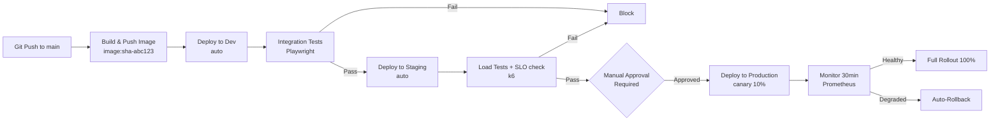

### Artifact Promotion (Same Image, Different Config)

```mermaid
graph TD
    A[CI: Build image\ntag: sha-abc123] --> B[(Container Registry)]
    B -->|pull + dev-values.yaml| C[Dev Cluster]
    B -->|pull + staging-values.yaml| D[Staging Cluster]
    B -->|pull + prod-values.yaml| E[Production Cluster]
    style A fill:#2d5a27
    style B fill:#1a3a5c
    note1[Same Image SHA\nonly config differs]
```

### Environment Protection Rules

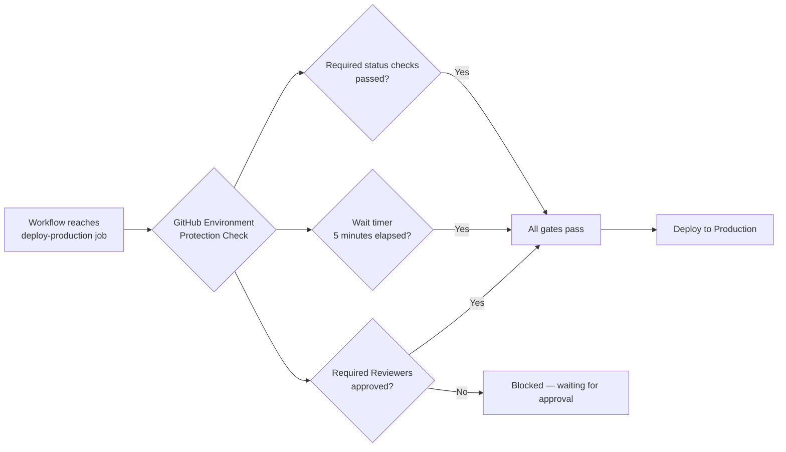

### Ephemeral PR Environments Lifecycle

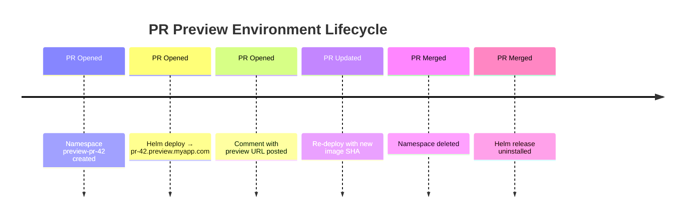

---

## ⚙️ Hands-On

```bash
# List all Helm releases across environments
helm list -A

# Compare values between environments
helm get values my-app -n staging > /tmp/staging-vals.yaml
helm get values my-app -n production > /tmp/prod-vals.yaml
diff /tmp/staging-vals.yaml /tmp/prod-vals.yaml

# Verify same image SHA across environments
kubectl get deployment my-app -n staging \
  -o jsonpath='{.spec.template.spec.containers[0].image}'

kubectl get deployment my-app -n production \
  -o jsonpath='{.spec.template.spec.containers[0].image}'
# Should match: myrepo/app:sha-abc123
```

---

## ⚠️ Common Gotchas

| Gotcha | Problem | Fix |
|--------|---------|-----|
| **Different images per env** | Dev uses `:latest`, prod uses SHA — not the same build | Enforce SHA tags everywhere; prohibit `:latest` in prod |
| **Config values untested** | Prod-only config settings never validated | Test critical prod config in staging too |
| **No cleanup of preview envs** | Hundreds of preview namespaces accumulate | Auto-cleanup on PR close; nightly cleanup job for stale envs |
| **Approval bypass** | Developers approve their own PRs to production | Require 2 reviewers; prevent self-approval |
| **Staging not parity with prod** | "Works in staging" failures | Use production-scale load and data in staging performance tests |

---

## ✅ Best Practices

- Promote artifacts (image SHA), not builds — never rebuild for each environment
- Separate secrets per environment with scoped access
- Require load tests + SLO assertions before promoting to production
- Use ephemeral PR environments to catch issues before they reach dev
- Document the promotion criteria explicitly: what must pass to go from staging → prod

---

## 🧠 Summary

> **Multi-environment pipelines protect production by progressively increasing confidence.** The key principle: build once, promote the same artifact through environments with only configuration changing. Use automated gates (tests, SLO checks) between environments and manual approval before production. Ephemeral PR environments catch issues before they ever hit shared environments.

---

---

# Q5 — Rollback Strategies in Production Pipelines

---

## ❓ The Question

> **"A bad deployment reaches production and error rates spike to 15%. Walk me through your rollback strategy. What mechanisms would you have built in advance to make rollback fast and safe?"**

---

## 🎯 Why Interviewers Ask This

Rollback is the most critical — and most neglected — part of deployment design. Interviewers want to know if you've thought about it before the incident, not during. A good answer covers both reactive rollback (when it happens) and proactive rollback design (built into the pipeline).

**Instant Win Tip:** Lead with **"rollback in 90 seconds or less"** — this signals you've designed for it. Then explain Helm rollback, Kubernetes rolling update undo, and ArgoCD rollback as your three layers.

---

## 📖 Key Terminologies

| Term | Definition |
|------|-----------|
| **Rollback** | Reverting to the previous known-good deployment |
| **Helm Rollback** | `helm rollback` reverts to a previous Helm release revision |
| **Undo Rollout** | `kubectl rollout undo` reverts a Deployment to previous ReplicaSet |
| **MTTR** | Mean Time To Recovery — key DORA metric rollback directly improves |
| **Canary Abort** | Stopping a canary rollout and returning all traffic to stable |
| **Feature Flag** | Decouple deploy from release — turn off feature without rollback |
| **Blue-Green Rollback** | Switch traffic back to blue (previous) environment instantly |
| **Database Migration Rollback** | The hardest part — forward-only migrations need special handling |

---

## 🗣️ How to Answer (Structured)

### Three Layers of Rollback

```
Layer 1: Kubernetes rollout undo   → fastest (seconds, no Helm needed)
Layer 2: Helm rollback             → preferred (revision history)
Layer 3: GitOps revert + resync    → audit-friendly (Git is source of truth)
```

### Layer 1: Kubernetes Immediate Rollback

```bash
# Check rollout status
kubectl rollout status deployment/my-app -n production

# Immediately undo last deployment
kubectl rollout undo deployment/my-app -n production

# Undo to specific revision
kubectl rollout history deployment/my-app -n production
# REVISION  CHANGE-CAUSE
# 5         deploy: v1.2.3 (sha-abc123)
# 6         deploy: v1.3.0 (sha-def456) ← broken

kubectl rollout undo deployment/my-app --to-revision=5 -n production

# Watch the rollback happen
kubectl rollout status deployment/my-app -n production -w
```

### Layer 2: Helm Rollback

```bash
# Check Helm release history
helm history my-app -n production
# REVISION  STATUS     CHART       DESCRIPTION
# 12        superseded my-app-1.0  Install complete
# 13        deployed   my-app-1.1  Upgrade complete ← broken

# Rollback to revision 12
helm rollback my-app 12 -n production

# With wait flag (blocks until healthy)
helm rollback my-app 12 -n production --wait --timeout 5m
```

### Layer 3: GitOps Rollback (Recommended)

```bash
# Find the last good commit
git log --oneline -10 gitops-config/apps/production/

# Revert the bad commit
git revert abc123def --no-edit
git push origin main

# ArgoCD detects the revert → syncs cluster back to previous state
# This creates an audit trail (who reverted, when, which commit)

# Or: ArgoCD direct rollback
argocd app rollback my-app 15  # Rollback to ArgoCD revision 15
```

### Automated Rollback with Argo Rollouts

```yaml
apiVersion: argoproj.io/v1alpha1
kind: Rollout
metadata:
  name: my-app
spec:
  strategy:
    canary:
      steps:
        - setWeight: 10
        - pause: {duration: 5m}
        - setWeight: 30
        - pause: {duration: 5m}
        - setWeight: 100
      analysis:
        templates:
          - templateName: error-rate-check
        startingStep: 1
        args:
          - name: service-name
            value: my-app-canary
---
apiVersion: argoproj.io/v1alpha1
kind: AnalysisTemplate
metadata:
  name: error-rate-check
spec:
  metrics:
    - name: error-rate
      interval: 2m
      failureLimit: 2
      provider:
        prometheus:
          address: http://prometheus:9090
          query: |
            sum(rate(http_requests_total{
              job="my-app",
              status=~"5.."
            }[5m])) /
            sum(rate(http_requests_total{
              job="my-app"
            }[5m]))
      successCondition: result[0] < 0.05   # < 5% error rate
      failureCondition: result[0] >= 0.10  # abort if >= 10% errors
```

When the analysis fails, Argo Rollouts automatically aborts the canary and routes 100% of traffic back to the stable version — **without human intervention**.

### Database Migration: The Hard Part

```python
# Forward-only migration strategy (blue-green DB migration)

# Migration v1 → v2: add a nullable column first
# Step 1: deploy migration that adds column (backward compatible)
ALTER TABLE users ADD COLUMN new_feature VARCHAR(255) NULL;

# Step 2: deploy new app code that writes to both old + new column
# (dual-write pattern)

# Step 3: backfill old rows
UPDATE users SET new_feature = derive_value(old_column);

# Step 4: deploy migration to make column NOT NULL + drop old column
ALTER TABLE users ALTER COLUMN new_feature SET NOT NULL;
ALTER TABLE users DROP COLUMN old_column;

# If you need to rollback between steps: the dual-write means
# old code still works because old column still exists
```

---

## 🔐 Security Perspective

- **Rollback as attack vector**: Ensure old image versions still pass vulnerability scanning before rollback — the v1 image might have a known CVE that was fixed in v2
- **Signed rollback commits**: GitOps rollbacks should be signed commits, not just git reverts
- **Audit trail**: Use GitOps revert (not kubectl rollout undo) so the rollback is auditable in Git history
- **Secrets rotation on rollback**: If v2 rotated secrets that v1 doesn't support, rolling back may break auth — plan secret compatibility across versions

---

## 🖼️ Visuals

### Rollback Decision Tree

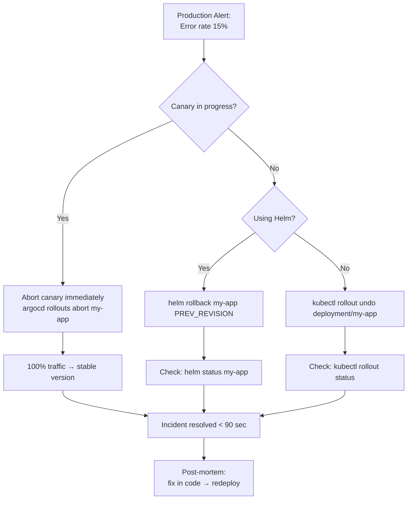

### Automated Canary Analysis & Rollback

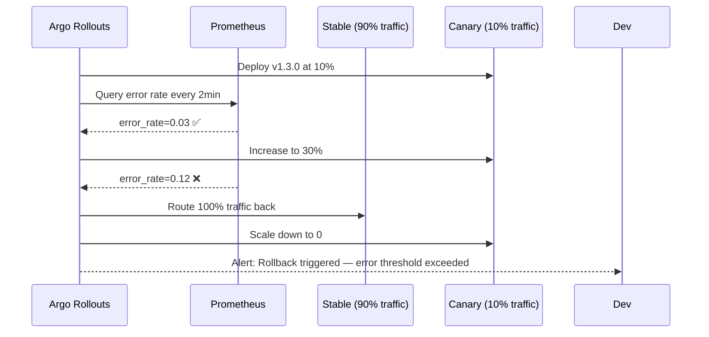

### Helm Release History

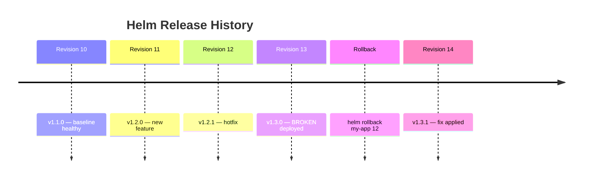

### Blue-Green Rollback (Instantaneous)

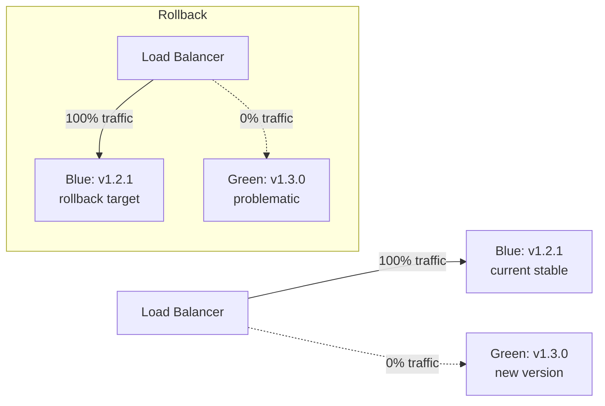

---

## ⚙️ Hands-On

```bash
# Simulate a failed deployment and rollback

# 1. Check current deployment
kubectl describe deployment my-app -n production | grep Image

# 2. Deploy broken version (for drill)
kubectl set image deployment/my-app \
  app=myrepo/app:broken-sha \
  -n production

# 3. Watch it fail
kubectl rollout status deployment/my-app -n production
# Waiting for rollout to finish: 2 out of 5 new replicas have been updated...

# 4. Rollback
kubectl rollout undo deployment/my-app -n production

# 5. Verify
kubectl rollout status deployment/my-app -n production
# deployment "my-app" successfully rolled out

# Helm rollback with dry-run
helm rollback my-app 12 -n production --dry-run
```

---

## ⚠️ Common Gotchas

| Gotcha | Problem | Fix |
|--------|---------|-----|
| **revisionHistoryLimit too low** | Default is 10; if set to 0, rollback is impossible | Keep at 5–10; don't set to 0 |
| **Database schema incompatibility** | Rolling back app code but DB has new schema | Use backward-compatible migrations; never drop columns in same PR |
| **Rollback to vulnerable image** | Old image has known CVE | Scan before rollback; patch as next deploy |
| **Feature flags not rolled back** | Code rolled back but feature flag still on | Roll back flags alongside code |
| **Session state lost** | Rolling back auth service may invalidate user sessions | Plan session compatibility; use stateless JWTs |

---

## ✅ Best Practices

- Pre-drill rollbacks quarterly — runbooks that are never tested are worthless
- Design database migrations to be backward compatible (2-phase: expand then contract)
- Build rollback into the pipeline as a first-class workflow, not an afterthought
- Set `revisionHistoryLimit: 10` on all Deployments
- Track MTTR as a primary SLA metric — target < 5 minutes from alert to rollback complete

---

## 🧠 Summary

> **A rollback strategy built during the incident is already too late.** Design rollback in advance: Argo Rollouts for automated canary abort, Helm revision history for manual rollback, and GitOps revert for an auditable paper trail. The database migration strategy is the hardest part — always use forward-compatible migrations so any version can co-exist with the schema.

---

---

# Q6 — Pipeline Security & Supply Chain (SLSA, SBOM)

---

## ❓ The Question

> **"What is SLSA and how do you implement supply chain security in your CI/CD pipeline? What is an SBOM and when is it required?"**

---

## 🎯 Why Interviewers Ask This

The SolarWinds and Log4Shell incidents made supply chain security a board-level concern. DevSecOps roles are now expected to understand SLSA, SBOMs, image signing, and provenance attestation — not just static scanning. This is a differentiating question for mid-to-senior level candidates.

**Instant Win Tip:** Start with: **"SLSA is a framework of four levels of increasing supply chain integrity guarantees — we implemented SLSA Level 2 which means provenance is signed and available for verification."** This shows practical experience, not just Wikipedia knowledge.

---

## 📖 Key Terminologies

| Term | Definition |
|------|-----------|
| **SLSA** | Supply chain Levels for Software Artifacts — framework for supply chain security |
| **Provenance** | Signed attestation of where an artifact came from and how it was built |
| **SBOM** | Software Bill of Materials — complete inventory of all components in software |
| **Sigstore** | Open-source PKI for signing software artifacts (Cosign, Fulcio, Rekor) |
| **Cosign** | CLI tool for signing and verifying container images using Sigstore |
| **Rekor** | Immutable, tamper-proof transparency log for software signatures |
| **SPDX / CycloneDX** | Two standard SBOM formats |
| **VEX** | Vulnerability Exploitability eXchange — document stating whether a CVE actually affects you |
| **Attestation** | Cryptographically signed statement about an artifact (provenance, SBOM, test results) |

---

## 🗣️ How to Answer (Structured)

### SLSA Levels

```
SLSA Level 1: Provenance exists (automated, not authenticated)
SLSA Level 2: Provenance is signed by the build service (hosted CI)
SLSA Level 3: Build is isolated, ephemeral, and reproducible
SLSA Level 4: All dependencies are at SLSA 3 (supply chain complete)
```

Most organizations target **Level 2** as their near-term goal.

### SLSA L2 Implementation (GitHub Actions + Sigstore)

```yaml
name: SLSA Level 2 Build

jobs:
  build:
    permissions:
      id-token: write     # Required for OIDC (keyless signing)
      contents: read
      packages: write
      actions: read       # Required for SLSA provenance

    steps:
      - uses: actions/checkout@v4

      - name: Build Docker image
        id: build
        uses: docker/build-push-action@v5
        with:
          push: true
          tags: ghcr.io/myorg/myapp:${{ github.sha }}

      # Generate SLSA provenance (signed by GitHub Actions OIDC)
      - name: Generate SLSA provenance
        uses: slsa-framework/slsa-github-generator/.github/workflows/generator_container_slsa3.yml@v1.9.0
        with:
          image: ghcr.io/myorg/myapp
          digest: ${{ steps.build.outputs.digest }}

      # Sign the image with Cosign (keyless via Sigstore)
      - name: Sign image with Cosign
        uses: sigstore/cosign-installer@v3
      - run: |
          cosign sign --yes \
            ghcr.io/myorg/myapp@${{ steps.build.outputs.digest }}
```

### SBOM Generation

```yaml
      # Generate SBOM with Syft
      - name: Generate SBOM
        uses: anchore/sbom-action@v0
        with:
          image: ghcr.io/myorg/myapp:${{ github.sha }}
          format: spdx-json
          output-file: sbom.spdx.json

      # Attach SBOM as attestation to the image
      - name: Attest SBOM
        run: |
          cosign attest --yes \
            --predicate sbom.spdx.json \
            --type spdxjson \
            ghcr.io/myorg/myapp@${{ steps.build.outputs.digest }}
```

### Verification at Deploy Time

```bash
# Verify image signature before pulling
cosign verify \
  --certificate-identity-regexp="https://github.com/myorg/myrepo" \
  --certificate-oidc-issuer="https://token.actions.githubusercontent.com" \
  ghcr.io/myorg/myapp:sha-abc123

# Verify SLSA provenance
slsa-verifier verify-image \
  ghcr.io/myorg/myapp:sha-abc123 \
  --source-uri github.com/myorg/myrepo \
  --slsa-verifier-uri https://github.com/slsa-framework/slsa-verifier

# Extract and scan SBOM
cosign download attestation \
  ghcr.io/myorg/myapp:sha-abc123 | \
  jq -r '.payload' | base64 -d | \
  jq '.predicate' > sbom.json

# Scan SBOM for vulnerabilities
grype sbom:./sbom.json
```

### Dependency Pinning (SHA-based)

```yaml
# BAD — mutable tag can be hijacked
- uses: actions/checkout@v4
- uses: docker/build-push-action@v5

# GOOD — SHA pins to exact version
- uses: actions/checkout@11bd71901bbe5b1630ceea73d27597364c9af683  # v4.2.2
- uses: docker/build-push-action@4f58ea79220b3119b1a03b7f85dcb91903ec4e88  # v5.2.0
```

### Admission Control: Enforce Signatures at Deploy Time

```yaml
# Kyverno policy: require cosign signature before pod admission
apiVersion: kyverno.io/v1
kind: ClusterPolicy
metadata:
  name: require-signed-images
spec:
  validationFailureAction: Enforce
  rules:
    - name: check-image-signature
      match:
        any:
          - resources:
              kinds: [Pod]
              namespaces: [production]
      verifyImages:
        - imageReferences: ["ghcr.io/myorg/*"]
          attestors:
            - count: 1
              entries:
                - keyless:
                    subject: "https://github.com/myorg/myrepo/.github/workflows/build.yml@refs/heads/main"
                    issuer: "https://token.actions.githubusercontent.com"
```

---

## 🔐 Security Perspective

- **Keyless signing via Sigstore is the new standard**: No private keys to manage or rotate — identity comes from OIDC (GitHub Actions token, GKE workload identity)
- **Rekor transparency log**: Every signing event is appended to an immutable, public log — you can audit who signed what and when
- **SBOM as attack surface inventory**: When Log4Shell dropped, organizations with SBOMs knew within minutes if they were affected; without SBOMs, it took weeks
- **SHA pinning prevents action hijacking**: `uses: evil-action@v1` after a tag is updated can execute arbitrary code — SHA pins prevent this

---

## 🖼️ Visuals

### SLSA Supply Chain Trust Levels

```mermaid
graph TD
    A[Source Code\nGitHub] -->|signed commit| B[Build System\nGitHub Actions]
    B -->|generates| C[Artifact\nDocker Image]
    B -->|generates + signs| D[Provenance\nSLSA attestation]
    C -->|cosign sign| E[Signed Image\nin registry]
    D -->|cosign attest| E
    E -->|Kyverno verifies| F[Kubernetes Admission]
    F -->|pass| G[Pod Deployed ✅]
    F -->|fail| H[Rejected ❌]
```

### SBOM Ecosystem

```mermaid
graph LR
    A[Build Pipeline] -->|syft/grype| B[SBOM\nCycloneDX/SPDX]
    B -->|cosign attest| C[Registry\nOCI artifact]
    B -->|scan| D[Vulnerability Report]
    B -->|VEX document| E[Exploitability Assessment]
    D --> F[Security Dashboard]
    E --> F
```

### Sigstore Keyless Signing Flow

```mermaid
sequenceDiagram
    participant CI as GitHub Actions
    participant Fulcio as Fulcio CA
    participant Rekor as Rekor Log
    participant Dev as Developer verifying

    CI->>Fulcio: Present OIDC token (short-lived)
    Fulcio->>CI: Issue short-lived signing certificate
    CI->>CI: Sign artifact with certificate
    CI->>Rekor: Append signing event to transparency log
    Dev->>Rekor: Query log entry
    Dev->>Dev: Verify signature against Fulcio CA
    Dev-->>Dev: ✅ Verified: signed by GitHub Actions for myorg/myrepo
```

### SLSA Level Comparison

```mermaid
graph LR
    A[SLSA 1\nProvenance exists\naudit only] --> B[SLSA 2\nSigned provenance\nhosted build service]
    B --> C[SLSA 3\nHardened builds\nephemeral isolated env]
    C --> D[SLSA 4\nFull supply chain\nall deps at L3]
    style A fill:#555500
    style B fill:#005500
    style C fill:#004400
    style D fill:#003300
```

---

## ⚙️ Hands-On

```bash
# Install tooling
brew install cosign
brew install syft
brew install grype

# Sign an image (keyless)
cosign sign --yes myrepo/myapp:v1.0.0

# Generate SBOM
syft myrepo/myapp:v1.0.0 -o spdx-json > sbom.json

# Scan SBOM
grype sbom:./sbom.json --fail-on high

# Verify image
cosign verify \
  --certificate-identity "https://github.com/myorg/myrepo/.github/workflows/build.yml@refs/heads/main" \
  --certificate-oidc-issuer "https://token.actions.githubusercontent.com" \
  myrepo/myapp:v1.0.0

# Check transparency log entry
rekor-cli search --email "$(git config user.email)"
```

---

## ⚠️ Common Gotchas

| Gotcha | Problem | Fix |
|--------|---------|-----|
| **Signing without verification** | Signing is useless without enforced admission control | Deploy Kyverno/OPA to reject unsigned images |
| **SBOM not updated on rebuild** | SBOM reflects state at generation time only | Regenerate SBOM on every build, not just releases |
| **No VEX document** | Scanner reports 200 CVEs; 195 are not exploitable | Use Grype + VEX to suppress non-exploitable findings |
| **Actions not SHA-pinned** | Tag-based actions can be updated maliciously | Use Dependabot to auto-update SHA pins |
| **SBOM in wrong format** | NTIA requires SPDX or CycloneDX for federal compliance | Use standard formats; not proprietary vendor formats |

---

## ✅ Best Practices

- Target SLSA Level 2 as baseline for all production builds — sign provenance using GitHub Actions OIDC
- Generate SBOMs for every release and attach as OCI attestation to the image
- Enforce signature verification at deploy time with Kyverno ClusterPolicy
- Pin all GitHub Actions dependencies to SHA, use Dependabot to automate updates
- Scan SBOMs against vulnerability databases (Grype/Trivy) as a release gate

---

## 🧠 Summary

> **Supply chain security is the new perimeter.** SLSA provides a framework to verify that your artifacts came from your CI pipeline and weren't tampered with. SBOMs give you an instant inventory when a new CVE drops. Sigstore's keyless signing model removes the private key management burden. Enforce it all at admission control with Kyverno — otherwise signing and attestation is theater.

---

---

# Q7 — Canary Deployments with Automated Analysis

---

## ❓ The Question

> **"Design a canary deployment pipeline that automatically promotes or rolls back based on real-time metrics. What SLIs would you track and what are the analysis thresholds?"**

---

## 🎯 Why Interviewers Ask This

Canary deployments are the gold standard for de-risking production releases. But a canary without automated analysis is just a manually monitored slow rollout. Interviewers want to see if you understand the metrics-driven feedback loop that makes canaries powerful.

**Instant Win Tip:** Mention the **four golden signals** (latency, traffic, errors, saturation) and say you'd fail the canary if error rate exceeds a threshold AND p99 latency degrades — using both prevents false positives.

---

## 📖 Key Terminologies

| Term | Definition |
|------|-----------|
| **Canary** | A small percentage of traffic (5–10%) routed to new version for validation |
| **Stable** | The current running version receiving the majority of traffic |
| **AnalysisTemplate** | Argo Rollouts resource defining Prometheus queries and pass/fail thresholds |
| **SLI** | Service Level Indicator — a measurable metric (error rate, latency p99) |
| **SLO** | Service Level Objective — target value for an SLI (e.g., error rate < 1%) |
| **Golden Signals** | Latency, Traffic, Errors, Saturation (Google SRE book) |
| **Background Analysis** | AnalysisRun that continuously queries metrics during the canary |
| **Kayenta** | Netflix's open-source canary analysis service (A/B Prometheus comparison) |

---

## 🗣️ How to Answer (Structured)

### Argo Rollouts Canary with Analysis

```yaml
apiVersion: argoproj.io/v1alpha1
kind: Rollout
metadata:
  name: my-app
  namespace: production
spec:
  replicas: 10
  selector:
    matchLabels:
      app: my-app
  template:
    metadata:
      labels:
        app: my-app
    spec:
      containers:
        - name: app
          image: myrepo/app:v1.3.0
  strategy:
    canary:
      canaryService: my-app-canary    # Separate service for canary pods
      stableService: my-app-stable    # Stable service for existing pods
      trafficRouting:
        nginx:
          stableIngress: my-app-ingress
      steps:
        - setWeight: 5               # 5% to canary
        - pause: {duration: 10m}     # Observe 10 minutes
        - analysis:
            templates:
              - templateName: success-rate
              - templateName: latency-p99
        - setWeight: 25
        - pause: {duration: 10m}
        - setWeight: 50
        - pause: {duration: 10m}
        - setWeight: 100
```

### AnalysisTemplate — Error Rate

```yaml
apiVersion: argoproj.io/v1alpha1
kind: AnalysisTemplate
metadata:
  name: success-rate
spec:
  args:
    - name: service-name
  metrics:
    - name: success-rate
      interval: 2m
      count: 5              # Run 5 measurements
      failureLimit: 1       # Fail after 1 bad measurement
      successCondition: result[0] >= 0.99   # 99% success rate
      provider:
        prometheus:
          address: http://prometheus-operated.monitoring:9090
          query: |
            sum(rate(
              http_requests_total{
                job="{{args.service-name}}",
                status!~"5.."
              }[5m]
            )) /
            sum(rate(
              http_requests_total{
                job="{{args.service-name}}"
              }[5m]
            ))
```

### AnalysisTemplate — P99 Latency

```yaml
apiVersion: argoproj.io/v1alpha1
kind: AnalysisTemplate
metadata:
  name: latency-p99
spec:
  metrics:
    - name: latency-p99
      interval: 2m
      count: 5
      failureLimit: 1
      successCondition: result[0] < 500     # p99 < 500ms
      provider:
        prometheus:
          address: http://prometheus-operated.monitoring:9090
          query: |
            histogram_quantile(0.99,
              sum(rate(
                http_request_duration_seconds_bucket{
                  job="my-app-canary"
                }[5m]
              )) by (le)
            ) * 1000
```

### Canary vs Stable Comparison (Kayenta-style)

```yaml
# Compare canary vs stable directly — normalize for traffic differences
query: |
  (
    sum(rate(http_requests_total{job="my-app-canary",status=~"5.."}[5m])) /
    sum(rate(http_requests_total{job="my-app-canary"}[5m]))
  )
  /
  (
    sum(rate(http_requests_total{job="my-app-stable",status=~"5.."}[5m])) /
    sum(rate(http_requests_total{job="my-app-stable"}[5m]))
  )
successCondition: result[0] <= 1.2   # canary error rate ≤ 120% of stable
```

### SLIs to Track During Canary

```
1. Error rate:      < 1% (or < 120% of baseline)
2. p99 latency:     < 500ms (or < 110% of baseline)
3. p50 latency:     < 100ms
4. Request rate:    within ±10% of expected (traffic health check)
5. Saturation:      CPU < 80%, memory < 85%
6. Apdex score:     > 0.95 (composite user satisfaction metric)
7. DB error rate:   < 0.1% (downstream dependency health)
```

---

## 🔐 Security Perspective

- **Canary for security testing too**: Route internal traffic first to canary — let internal users test before customer traffic
- **Auth/authz canary caution**: If the canary changes the auth model, 5% of users will be affected by auth failures — use feature flags for auth changes instead
- **Metrics spoofing prevention**: Ensure Prometheus scrapes use authenticated endpoints — a compromised pod could fake good metrics to avoid rollback

---

## 🖼️ Visuals

### Canary Traffic Split Over Time

```mermaid
graph TD
    LB[Ingress / Load Balancer] -->|5%| C[Canary v1.3.0\n1 pod]
    LB -->|95%| S[Stable v1.2.1\n19 pods]
    C --> P[Prometheus\nscapes both]
    S --> P
    P --> A[AnalysisRun\nerror_rate, p99_latency]
    A -->|Pass| Promote[Increase weight to 25%]
    A -->|Fail| Rollback[Abort: 100% → stable]
```

### Canary Rollout Steps with Analysis

```mermaid
timeline
    title Canary Rollout Timeline
    T+0min  : setWeight 5% — Deploy 1 of 10 pods as canary
    T+10min : pause — Observe metrics
    T+10min : AnalysisRun — Query Prometheus 5x over 10min
    T+20min : setWeight 25% — Increase if analysis passed
    T+30min : pause + analysis again
    T+40min : setWeight 50%
    T+50min : pause + analysis
    T+60min : setWeight 100% — Full rollout complete
```

### Analysis Decision Logic

```mermaid
flowchart TD
    A[AnalysisRun\nrunning] --> B{success_rate >= 0.99?}
    B -->|Yes| C{p99_latency < 500ms?}
    B -->|No| F[Increment failure count]
    C -->|Yes| D[Measurement: Pass]
    C -->|No| F
    F --> G{failureLimit exceeded?}
    G -->|Yes| H[AnalysisRun: Failed\nTrigger rollback]
    G -->|No| I[Continue next interval]
    D --> J{count reached?}
    J -->|Yes| K[AnalysisRun: Successful\nPromote to next step]
    J -->|No| L[Wait for next interval]
```

### Canary vs Push-to-Production Risk Profile

```mermaid
graph LR
    A[Deploy Strategy] --> B[Rolling\nReplacement]
    A --> C[Blue-Green\nInstant switch]
    A --> D[Canary\nProgressive]

    B -->|Risk| B1[Errors hit 100%\nof users immediately]
    C -->|Risk| C1[Instant rollback\nbut big blast radius]
    D -->|Risk| D1[Max 5% users affected\nautomated rollback]
    style D fill:#1a3a1a
    style D1 fill:#1a3a1a
```

---

## ⚙️ Hands-On

```bash
# Check canary rollout status
kubectl argo rollouts get rollout my-app -n production --watch

# Manual pause/promote
kubectl argo rollouts pause my-app -n production
kubectl argo rollouts promote my-app -n production

# Abort and rollback
kubectl argo rollouts abort my-app -n production

# Check analysis run results
kubectl get analysisrun -n production
kubectl describe analysisrun my-app-abc123 -n production

# Grafana dashboard query for canary comparison
# error_rate_canary vs error_rate_stable
sum(rate(http_requests_total{version="canary",status=~"5.."}[5m])) /
sum(rate(http_requests_total{version="canary"}[5m]))
```

---

## ⚠️ Common Gotchas

| Gotcha | Problem | Fix |
|--------|---------|-----|
| **Analysis too fast** | 5% traffic means low sample size — false positives | Run analysis for ≥ 10 minutes minimum; use rate() not instant queries |
| **No canary service** | Metrics can't distinguish canary vs stable traffic | Label pods with `version: canary` and filter by label in queries |
| **Threshold too tight** | 99.9% success rate required → flaky tests auto-rollback good releases | Set thresholds at SLO values (99%), not best-case performance |
| **Ignoring saturation** | Memory leak only visible after 1 hour at scale | Include saturation metrics; run analysis for longer soak time |
| **DB schema in canary** | Canary makes irreversible DB change → rollback breaks DB | Never include irreversible DB migrations in a canary release |

---

## ✅ Best Practices

- Start canary at 1–5% traffic — small enough to limit blast radius, large enough for statistical significance
- Use relative thresholds (canary ≤ 120% of stable error rate) to avoid false failures from natural variance
- Run analysis for at least 10 minutes per step to collect sufficient samples
- Track business metrics (conversion rate, checkout success) alongside technical SLIs
- Never include backward-incompatible database changes in a canary release

---

## 🧠 Summary

> **A canary without analysis is just a slow deploy.** The power is in the automated feedback loop: small traffic percentage → metrics-based AnalysisRun → automatic promote or rollback based on SLOs. Use Argo Rollouts with Prometheus AnalysisTemplates to implement this. Track error rate AND latency AND saturation — single-metric analysis leads to false positives.

---

---

# Q8 — IaC & Infrastructure Pipelines (Terraform in CI)

---

## ❓ The Question

> **"How do you run Terraform safely in CI/CD? What are the risks of running `terraform apply` in automated pipelines and how do you mitigate them?"**

---

## 🎯 Why Interviewers Ask This

Terraform in CI is ubiquitous but dangerous if done naively. Interviewers want to see that you understand the state lock problem, blast radius, drift detection, and the difference between `plan` (safe) and `apply` (risky). The worst answer is "we just run apply on every merge."

**Instant Win Tip:** Lead with **"we run plan on every PR and apply only after approval on merge to main — and we never store state locally, always in S3 with DynamoDB lock."**

---

## 📖 Key Terminologies

| Term | Definition |
|------|-----------|
| **State File** | Terraform's record of what resources exist — never commit to Git |
| **Remote State** | State stored in S3/GCS/Terraform Cloud — enables team collaboration |
| **State Locking** | DynamoDB/GCS lock prevents concurrent applies |
| **Drift** | Real infra diverges from Terraform state due to manual changes |
| **Plan** | Read-only preview of changes — safe to run on PRs |
| **Apply** | Makes real infrastructure changes — should require approval |
| **Atlantis** | Open-source Terraform PR automation tool (plan on PR, apply on comment) |
| **Drift Detection** | Scheduled `terraform plan` to detect manual changes |

---

## 🗣️ How to Answer (Structured)

### Safe Terraform CI Pattern

```yaml
# GitHub Actions — Terraform PR Check
jobs:
  terraform-plan:
    runs-on: ubuntu-latest
    permissions:
      id-token: write
      contents: read
      pull-requests: write
    steps:
      - uses: actions/checkout@v4

      - name: Configure AWS credentials (OIDC)
        uses: aws-actions/configure-aws-credentials@v4
        with:
          role-to-assume: arn:aws:iam::123456789:role/github-actions-terraform
          aws-region: us-east-1

      - uses: hashicorp/setup-terraform@v3
        with:
          terraform_version: 1.7.0

      - name: Terraform Init
        run: terraform init -backend-config=backend.hcl

      - name: Terraform Validate
        run: terraform validate

      - name: Terraform Plan
        id: plan
        run: |
          terraform plan -no-color -out=tfplan 2>&1 | tee plan-output.txt
          echo "exitcode=$?" >> $GITHUB_OUTPUT

      - name: Comment plan on PR
        uses: actions/github-script@v7
        with:
          script: |
            const fs = require('fs');
            const plan = fs.readFileSync('plan-output.txt', 'utf8');
            github.rest.issues.createComment({
              issue_number: context.issue.number,
              owner: context.repo.owner,
              repo: context.repo.repo,
              body: `## Terraform Plan\n\`\`\`hcl\n${plan.slice(0, 65000)}\n\`\`\``
            });

  terraform-apply:
    needs: terraform-plan
    if: github.ref == 'refs/heads/main' && github.event_name == 'push'
    environment: production   # Manual approval gate
    steps:
      - run: terraform apply -auto-approve tfplan
```

### Remote State Configuration

```hcl
# backend.tf
terraform {
  backend "s3" {
    bucket         = "my-terraform-state-prod"
    key            = "infrastructure/production/terraform.tfstate"
    region         = "us-east-1"
    encrypt        = true
    dynamodb_table = "terraform-state-lock"  # Prevents concurrent applies
    kms_key_id     = "arn:aws:kms:us-east-1:123:key/abc"
  }
}
```

### Atlantis for Terraform PR Automation

```yaml
# atlantis.yaml — in repo root
version: 3
automerge: false
projects:
  - name: production-vpc
    dir: ./infra/production/vpc
    workspace: production
    autoplan:
      when_modified: ["*.tf", "*.tfvars"]
      enabled: true
    apply_requirements: [approved, mergeable]  # Requires PR approval
```

```
# Workflow:
# 1. Open PR with Terraform changes
# 2. Atlantis auto-runs: terraform plan
# 3. Posts plan as PR comment
# 4. Reviewer approves PR
# 5. Comment: atlantis apply
# 6. Atlantis runs apply, posts result, merges PR
```

### Drift Detection Pipeline

```yaml
name: Terraform Drift Detection

on:
  schedule:
    - cron: '0 6 * * *'   # Every day at 6 AM

jobs:
  drift-check:
    runs-on: ubuntu-latest
    steps:
      - uses: actions/checkout@v4
      - name: Check for drift
        run: |
          terraform plan -detailed-exitcode -no-color 2>&1 | tee drift-report.txt
          EXIT_CODE=${PIPESTATUS[0]}
          if [ $EXIT_CODE -eq 2 ]; then
            echo "DRIFT DETECTED"
            cat drift-report.txt
            exit 1
          fi

      - name: Alert on drift
        if: failure()
        uses: 8398a7/action-slack@v3
        with:
          status: failure
          text: "🚨 Terraform drift detected in production! Check the drift report."
```

---

## 🔐 Security Perspective

- **OIDC instead of long-lived AWS keys**: Use `aws-actions/configure-aws-credentials` with OIDC — no `AWS_SECRET_ACCESS_KEY` in CI secrets
- **Least privilege IAM role**: The CI Terraform role should only have permissions it needs — not `AdministratorAccess`
- **State encryption**: Always enable S3 server-side encryption + KMS for state files — they contain sensitive data (passwords, IPs, secrets)
- **Never commit state**: `.gitignore` must include `*.tfstate`, `*.tfstate.backup`
- **Sentinel/OPA policies**: Use HashiCorp Sentinel or OPA to enforce policy-as-code on Terraform plans before apply

---

## 🖼️ Visuals

### Terraform CI/CD Safe Pattern

```mermaid
flowchart TD
    A[Developer opens PR] --> B[GitHub Actions triggered]
    B --> C[terraform init + validate]
    C --> D[terraform plan]
    D --> E[Plan output posted as PR comment]
    E --> F{PR approved?}
    F -->|No| G[Request changes]
    F -->|Yes| H[Merge to main]
    H --> I{Manual approval\nGitHub Environment}
    I -->|Approved| J[terraform apply]
    J --> K[Slack notification\nApply complete]
    J -->|on failure| L[Alert: Apply failed\nManual review needed]
```

### State Locking Flow

```mermaid
sequenceDiagram
    participant CI1 as CI Job 1
    participant DDB as DynamoDB Lock
    participant S3 as S3 State
    participant CI2 as CI Job 2

    CI1->>DDB: Acquire lock
    DDB-->>CI1: Lock granted
    CI1->>S3: Read state
    CI1->>CI1: Plan + Apply changes
    CI1->>S3: Write new state
    CI1->>DDB: Release lock
    CI2->>DDB: Acquire lock (was waiting)
    DDB-->>CI2: Lock granted
    Note over CI2: CI2 reads updated state → sees CI1's changes
```

### Drift Detection Loop

```mermaid
flowchart LR
    A[Scheduled\n06:00 daily] --> B[terraform plan\n-detailed-exitcode]
    B -->|Exit 0: No changes| C[Healthy ✅]
    B -->|Exit 1: Error| D[Pipeline failure alert]
    B -->|Exit 2: Changes detected| E[Drift detected 🚨]
    E --> F[Slack alert + Jira ticket]
    F --> G[Engineer reviews\nreconciles manually or via PR]
```

### Atlantis Workflow

```mermaid
sequenceDiagram
    participant Dev
    participant GitHub
    participant Atlantis
    participant Terraform

    Dev->>GitHub: Open PR (*.tf changes)
    GitHub->>Atlantis: Webhook: PR opened
    Atlantis->>Terraform: terraform plan
    Terraform-->>Atlantis: Plan output
    Atlantis->>GitHub: Post plan as comment
    Dev->>GitHub: Get approval from reviewer
    Dev->>GitHub: Comment: atlantis apply
    GitHub->>Atlantis: Webhook: comment
    Atlantis->>Terraform: terraform apply
    Terraform-->>Atlantis: Apply output
    Atlantis->>GitHub: Post apply result + merge PR
```

---

## ⚙️ Hands-On

```bash
# Initialize with remote backend
terraform init \
  -backend-config="bucket=my-terraform-state" \
  -backend-config="key=prod/terraform.tfstate" \
  -backend-config="region=us-east-1"

# Plan with explicit output
terraform plan -out=tfplan -no-color 2>&1 | tee plan.txt

# Check exit code (useful in CI)
# 0 = no changes, 1 = error, 2 = changes detected
terraform plan -detailed-exitcode; echo "Exit: $?"

# Apply saved plan (idempotent — applies what was reviewed)
terraform apply tfplan

# Force unlock if state is stuck
terraform force-unlock LOCK_ID

# Import existing resource into state
terraform import aws_s3_bucket.my_bucket my-bucket-name
```

---

## ⚠️ Common Gotchas

| Gotcha | Problem | Fix |
|--------|---------|-----|
| **apply on every PR merge** | Concurrent merges cause state lock conflicts | Queue applies; use Atlantis or Terraform Cloud run queue |
| **State in Git** | State exposes sensitive values (passwords, IPs) | Remote state (S3 + DynamoDB lock); gitignore .tfstate |
| **No plan review** | Auto-approve pipelines can destroy resources unexpectedly | Always human-review `terraform plan` output before apply |
| **Missing -detailed-exitcode** | `echo $?` always 0 even when drift detected | Use `-detailed-exitcode` for drift detection (exit 2 = changes) |
| **Hardcoded AWS keys** | Keys in environment variables in CI | Use OIDC role assumption; no static keys |

---

## ✅ Best Practices

- Run `terraform plan` on every PR; require plan comment review before merge
- Run `terraform apply` only after merge to main, behind a manual approval gate
- Always use remote state with encryption and DynamoDB locking
- Schedule daily drift detection; alert on any detected changes
- Use OIDC for cloud auth — never store cloud credentials in CI secrets
- Version-lock Terraform and provider versions in `required_providers`

---

## 🧠 Summary

> **Terraform in CI is "plan everywhere, apply carefully."** The safest pattern: auto-plan on every PR (read-only, safe), post the plan as a PR comment for review, require approval before merge, and require manual approval before apply runs on main. Drift detection catches the inevitable manual changes. Remote state with DynamoDB lock prevents the most common concurrent apply disasters.

---

---

# Q9 — Pipeline Testing: Contract, Mutation & Chaos

---

## ❓ The Question

> **"How do you test the pipeline itself and the services that flow through it? Explain contract testing, mutation testing, and chaos engineering — where do each fit in CI/CD?"**

---

## 🎯 Why Interviewers Ask This

Most candidates know the unit/integration/E2E testing pyramid. Fewer understand the advanced testing patterns that prevent production failures: contract tests preventing API breaking changes, mutation tests validating test quality, and chaos engineering validating resilience. This question separates mid-level from senior.

**Instant Win Tip:** Say: **"Contract testing is the integration test replacement — instead of spinning up services in CI, you verify each service's API contract against a broker. We caught 3 breaking API changes last quarter with Pact before they hit production."**

---

## 📖 Key Terminologies

| Term | Definition |
|------|-----------|
| **Contract Testing** | Each consumer defines its expectations (contract); provider verifies it can meet them |
| **Pact** | Most popular consumer-driven contract testing framework |
| **Pact Broker** | Central server storing contracts and verification results |
| **Mutation Testing** | Automatically introduce code bugs to verify tests catch them |
| **Mutation Score** | % of injected mutations caught by tests — proxy for test quality |
| **Chaos Engineering** | Deliberately injecting failures to verify system resilience |
| **Chaos Monkey** | Netflix's original chaos tool (terminates EC2 instances randomly) |
| **GameDay** | Planned chaos experiment — controlled failure injection |
| **Fault Injection** | Simulating delays, errors, or outages in specific services |

---

## 🗣️ How to Answer (Structured)

### Contract Testing with Pact

```javascript
// Consumer side (e.g., frontend service) — defines the contract
const { Pact } = require('@pact-foundation/pact');
const path = require('path');

const provider = new Pact({
  consumer: 'Frontend',
  provider: 'UserService',
  dir: path.resolve(process.cwd(), 'pacts'),
});

describe('User API Contract', () => {
  before(() => provider.setup());
  after(() => provider.finalize());

  it('returns a user by ID', async () => {
    await provider.addInteraction({
      state: 'user 42 exists',
      uponReceiving: 'a GET request for user 42',
      withRequest: {
        method: 'GET',
        path: '/users/42',
        headers: { Accept: 'application/json' },
      },
      willRespondWith: {
        status: 200,
        headers: { 'Content-Type': 'application/json' },
        body: {
          id: 42,
          name: like('John Doe'),    // ← flexible matching
          email: email('john@example.com'),
        },
      },
    });

    const response = await getUserById(42);
    expect(response.id).toBe(42);
  });
});
```

```yaml
# CI: Provider verification
- name: Verify contracts (provider side)
  run: |
    # Download contracts from Pact Broker
    pact-broker can-i-deploy \
      --pacticipant UserService \
      --version ${{ github.sha }} \
      --to-environment production \
      --broker-base-url https://pact.mycompany.com

    # Run provider verification
    npx pact-verifier \
      --provider-base-url http://localhost:3001 \
      --broker-url https://pact.mycompany.com \
      --provider UserService \
      --publish-verification-results \
      --provider-app-version ${{ github.sha }}
```

### `can-i-deploy` Gate

```bash
# Before deploying to production, check all contracts verified
pact-broker can-i-deploy \
  --pacticipant UserService \
  --version abc123 \
  --to-environment production

# Output:
# Computer says YES ✅
# or
# UserService abc123 failed to verify contract with Frontend 2.3.1
# Deploy BLOCKED
```

### Mutation Testing (Stryker)

```json
// stryker.config.json
{
  "mutate": ["src/**/*.ts"],
  "testRunner": "jest",
  "coverageAnalysis": "perTest",
  "thresholds": {
    "high": 85,       // Green ≥ 85% mutation score
    "low": 70,        // Yellow 70–84%
    "break": 60       // Red < 60% = pipeline fails
  },
  "reporters": ["html", "json", "progress"],
  "htmlReporter": {
    "fileName": "reports/mutation/index.html"
  }
}
```

```yaml
# CI: Mutation testing (expensive — run on PRs, not every commit)
- name: Run mutation tests
  if: github.event_name == 'pull_request'
  run: |
    npx stryker run
    SCORE=$(jq '.mutationScore' reports/mutation/mutation-testing-report.json)
    echo "Mutation score: $SCORE%"
    if (( $(echo "$SCORE < 70" | bc -l) )); then
      echo "::error::Mutation score below threshold: $SCORE%"
      exit 1
    fi
```

### Chaos Engineering in CI (Lightweight)

```yaml
# Fault injection test — does the service handle upstream timeouts?
- name: Chaos: upstream service timeout
  run: |
    # Start the service with toxiproxy simulating 2s delay
    docker run -d --name toxiproxy shopify/toxiproxy
    toxiproxy-cli create userservice -l localhost:8474 -u userservice:3001
    toxiproxy-cli toxic add userservice -t latency -a latency=2000

    # Run tests that should gracefully handle the timeout
    npm run test:resilience

    # Clean up
    docker stop toxiproxy && docker rm toxiproxy
```

```python
# Chaos test: verify circuit breaker trips correctly
import requests
import time

def test_circuit_breaker_opens_on_upstream_failure():
    # Simulate upstream failures
    responses = []
    for i in range(20):
        r = requests.get("http://localhost:8080/api/users/1")
        responses.append(r.status_code)
        time.sleep(0.1)

    # After failures, circuit should be open (503 Service Unavailable)
    assert responses[-5:] == [503, 503, 503, 503, 503], \
        "Circuit breaker should be open after repeated failures"

    # After timeout, circuit should half-open and allow retry
    time.sleep(10)
    r = requests.get("http://localhost:8080/api/users/1")
    assert r.status_code in [200, 503]  # probe or still open
```

---

## 🔐 Security Perspective

- **Contract testing prevents accidental breaking changes** to authentication headers or token formats
- **Chaos in staging, never in prod unannounced**: Chaos experiments in production require executive buy-in and pre-announced GameDays
- **Mutation testing of security-critical paths**: Run mutation testing specifically on auth, authorization, and input validation code

---

## 🖼️ Visuals

### Pact Contract Testing Flow

```mermaid
sequenceDiagram
    participant Consumer as Frontend Service
    participant Broker as Pact Broker
    participant Provider as UserService CI

    Consumer->>Consumer: Write consumer tests\ndefine interactions
    Consumer->>Broker: Publish contract
    Provider->>Broker: Fetch contract for UserService
    Provider->>Provider: Run provider verification
    Provider->>Broker: Publish verification result
    Note over Broker: Contract: VERIFIED ✅

    Provider->>Broker: can-i-deploy? UserService@abc123 → production
    Broker-->>Provider: YES — all consumers verified
    Provider->>Provider: Deploy to production
```

### Mutation Testing Feedback Loop

```mermaid
flowchart TD
    A[Source Code\n+ Tests] --> B[Stryker: Inject Mutations]
    B --> C[Run existing tests\nagainst each mutation]
    C --> D{Test fails on mutation?}
    D -->|Yes: Killed| E[Good — test caught the bug]
    D -->|No: Survived| F[Test gap identified]
    E --> G[Mutation Score Calculation]
    F --> G
    G --> H{Score >= 70%?}
    H -->|Yes| I[Pipeline passes ✅]
    H -->|No| J[Pipeline fails ❌\nTests are not catching enough bugs]
```

### Chaos Engineering Maturity Model

```mermaid
graph TD
    A[Level 1\nManual GameDays\nannounced chaos] --> B[Level 2\nFault injection in CI\ntoxiproxy, chaos-monkey]
    B --> C[Level 3\nAutomated chaos\nLitmus, Chaos Mesh]
    C --> D[Level 4\nProduction chaos\ncontinuous low-level experiments]
    style A fill:#333300
    style B fill:#003300
    style C fill:#002200
    style D fill:#001100
```

### Testing Pyramid — Extended

```mermaid
graph TD
    A[E2E Tests\n5% — slow, expensive] --> B[Integration Tests\n15% — medium]
    B --> C[Contract Tests\n20% — fast, targeted]
    C --> D[Unit Tests\n60% — fast, many]
    E[Mutation Tests] -.->|validates quality of| D
    F[Chaos Tests] -.->|validates resilience of| B
```

---

## ⚙️ Hands-On

```bash
# Pact: publish consumer contracts
npx pact-broker publish ./pacts \
  --consumer-app-version=$(git rev-parse HEAD) \
  --broker-base-url=https://pact.mycompany.com \
  --tag=$(git branch --show-current)

# Stryker mutation testing
npx stryker run --reporters html,progress

# Toxiproxy fault injection
# Install
brew install toxiproxy
toxiproxy-server &

# Create proxy
curl -d '{"name":"redis","listen":"localhost:22222","upstream":"localhost:6379"}' \
  http://localhost:8474/proxies

# Add latency
curl -d '{"name":"latency","type":"latency","attributes":{"latency":3000}}' \
  http://localhost:8474/proxies/redis/toxics

# Run resilience tests
npm run test:chaos

# Remove toxic
curl -X DELETE http://localhost:8474/proxies/redis/toxics/latency
```

---

## ⚠️ Common Gotchas

| Gotcha | Problem | Fix |
|--------|---------|-----|
| **Contract tests too strict** | Exact response matching → breaks on every added field | Use `like()`, `eachLike()` matchers for flexible matching |
| **Mutation score gaming** | Devs add trivial tests that kill mutations but add no value | Review survived mutations, not just the score |
| **Chaos in production without plan** | Random chaos causes real outages | Define hypothesis, blast radius, rollback plan before any chaos |
| **Contract drift** | Consumer updates contract but provider never re-verifies | Use Pact Broker webhooks to trigger provider CI on contract update |
| **Mutation on whole codebase** | Runs for 8 hours on large codebases | Scope mutation to changed files only (`--incremental` flag) |

---

## ✅ Best Practices

- Run contract tests on every PR for both consumer and provider sides
- Use `can-i-deploy` as a hard gate before any production deployment
- Target 70%+ mutation score; focus on security-critical and business-logic code
- Start chaos engineering with controlled experiments in staging before production
- Use toxiproxy or Chaos Mesh in CI to test resilience patterns (circuit breakers, retries, timeouts)

---

## 🧠 Summary

> **Contract tests replace integration tests for microservices boundaries.** Mutation tests validate that your unit tests actually catch bugs (not just achieve coverage). Chaos tests validate that your resilience patterns work under failure conditions. Together, they address the testing gaps that the standard unit/integration/E2E pyramid leaves uncovered.

---

---

# Q10 — Compliance, Audit Pipelines & Policy as Code

---

## ❓ The Question

> **"How do you implement compliance and audit requirements (SOC 2, PCI-DSS, HIPAA) in a CI/CD pipeline? What is Policy as Code and what tools implement it?"**

---

## 🎯 Why Interviewers Ask This

Regulated industries (fintech, healthcare, e-commerce with PCI) require proof that every production change went through proper controls. Interviewers at mature companies want to see if you can automate compliance — not just check boxes manually in an annual audit.

**Instant Win Tip:** Lead with: **"Policy as Code means compliance requirements are expressed as machine-executable rules in the pipeline, not a PDF that someone checks once a year. We used OPA/Gatekeeper for Kubernetes admission control and Checkov for IaC scanning."**

---

## 📖 Key Terminologies

| Term | Definition |
|------|-----------|
| **Policy as Code** | Compliance rules written as executable code (OPA Rego, Sentinel, CEL) |
| **OPA** | Open Policy Agent — general-purpose policy engine; uses Rego language |
| **Gatekeeper** | OPA admission controller for Kubernetes |
| **Checkov** | Open-source IaC security scanner (Terraform, CloudFormation, K8s) |
| **Trivy** | Container image and IaC vulnerability scanner |
| **SAST** | Static Application Security Testing — scans source code |
| **DAST** | Dynamic Application Security Testing — tests running application |
| **Change Approval Board (CAB)** | Traditional approval process; replaced by automated pipeline gates in modern DevOps |
| **Audit Log** | Immutable record of who did what, when — required for SOC 2 / PCI |

---

## 🗣️ How to Answer (Structured)

### Compliance Pipeline Architecture

```
Every PR:
  ├─ SAST (Semgrep/CodeQL)         ← code-level vulnerabilities
  ├─ SCA (Snyk/Grype)              ← dependency CVEs
  ├─ IaC scan (Checkov/Trivy)      ← misconfigured Terraform/K8s YAML
  ├─ Secret detection (TruffleHog) ← secrets committed to code
  └─ License compliance (FOSSA)    ← open-source license policy

Every build:
  ├─ Container scan (Trivy)        ← image CVEs
  ├─ SBOM generation (Syft)        ← BOM for compliance reporting
  └─ Image signing (Cosign)        ← artifact integrity

Pre-production:
  ├─ DAST (OWASP ZAP)              ← running app security scan
  └─ Compliance policy check       ← OPA/Checkov pass/fail gates

At deploy time:
  └─ Admission control (Gatekeeper) ← policy enforcement at cluster level
```

### Checkov IaC Compliance Scanning

```yaml
# GitHub Actions: Scan Terraform for compliance violations
- name: Checkov IaC Security Scan
  uses: bridgecrewio/checkov-action@v12
  with:
    directory: ./infra
    framework: terraform
    soft_fail: false
    output_format: cli,sarif
    output_file_path: console,results.sarif
    check: |
      CKV_AWS_18,   # S3 logging enabled
      CKV_AWS_52,   # MFA delete enabled on S3
      CKV_AWS_86,   # CloudFront S3 origin access identity
      CKV_AWS_111,  # IAM policies no wildcard permissions
      CKV2_AWS_62   # S3 event notifications enabled
    skip_check: CKV_AWS_999   # Example: suppress known false positive

- name: Upload SARIF results to GitHub Security
  uses: github/codeql-action/upload-sarif@v3
  with:
    sarif_file: results.sarif
```

### OPA Policy — Kubernetes Admission Control

```rego
# policies/require-resource-limits.rego
package kubernetes.admission

deny[msg] {
  input.request.kind.kind == "Pod"
  container := input.request.object.spec.containers[_]
  not container.resources.limits.cpu
  msg := sprintf(
    "Container '%v' must have CPU limits set",
    [container.name]
  )
}

deny[msg] {
  input.request.kind.kind == "Pod"
  container := input.request.object.spec.containers[_]
  not container.resources.limits.memory
  msg := sprintf(
    "Container '%v' must have memory limits set",
    [container.name]
  )
}

deny[msg] {
  input.request.kind.kind == "Pod"
  container := input.request.object.spec.containers[_]
  container.securityContext.privileged == true
  msg := sprintf(
    "Container '%v' must not run as privileged",
    [container.name]
  )
}
```

### Gatekeeper ConstraintTemplate

```yaml
apiVersion: templates.gatekeeper.sh/v1
kind: ConstraintTemplate
metadata:
  name: requireresourcelimits
spec:
  crd:
    spec:
      names:
        kind: RequireResourceLimits
  targets:
    - target: admission.k8s.gatekeeper.sh
      rego: |
        package requireresourcelimits
        violation[{"msg": msg}] {
          container := input.review.object.spec.containers[_]
          not container.resources.limits
          msg := sprintf("Container %v has no resource limits", [container.name])
        }
---
apiVersion: constraints.gatekeeper.sh/v1beta1
kind: RequireResourceLimits
metadata:
  name: require-resource-limits
spec:
  enforcementAction: deny
  match:
    kinds:
      - apiGroups: [""]
        kinds: ["Pod"]
    namespaces: ["production", "staging"]
```

### Audit Trail — Git as Compliance Record

```yaml
# Every pipeline run logs:
# 1. Who triggered it (GitHub identity)
# 2. What was deployed (image SHA, Git commit SHA)
# 3. When (timestamp)
# 4. Whether required checks passed (test results, security scan)
# 5. Who approved (PR approvals, environment approvals)

# This satisfies SOC 2 CC6.6 (logical access controls) and CC8.1 (change management)

# Generate compliance report from GitHub API
- name: Generate deployment audit record
  run: |
    cat > deployment-record.json << EOF
    {
      "deployment_id": "${{ github.run_id }}",
      "timestamp": "$(date -u +%Y-%m-%dT%H:%M:%SZ)",
      "deployed_by": "${{ github.actor }}",
      "commit_sha": "${{ github.sha }}",
      "image_digest": "${{ steps.build.outputs.digest }}",
      "pr_number": "${{ github.event.pull_request.number }}",
      "approver": "${{ github.event.review.user.login }}",
      "environment": "production",
      "security_scan_passed": true,
      "tests_passed": true
    }
    EOF
    # Upload to compliance store (S3, Splunk, Datadog)
    aws s3 cp deployment-record.json \
      s3://audit-logs/deployments/${{ github.sha }}.json
```

### SAST with Semgrep

```yaml
- name: SAST — Semgrep Security Scan
  uses: returntocorp/semgrep-action@v1
  with:
    config: >-
      p/ci
      p/owasp-top-ten
      p/secrets
      p/django
    auditOn: push
    publishToken: ${{ secrets.SEMGREP_APP_TOKEN }}
    publishDeployment: true
```

---

## 🔐 Security Perspective

- **SOC 2 Type II requires continuous evidence**: Not just "we have a policy" but automated proof that every deployment follows the policy
- **PCI-DSS requirement 6**: Code review + security testing before production deployment — automated pipeline gates fulfill this
- **HIPAA**: Audit logs of who accessed what data; pipeline logs + deployment records satisfy the administrative safeguard
- **Defense in depth**: No single tool catches everything — SAST + SCA + IaC scan + image scan + admission control = overlapping layers

---

## 🖼️ Visuals

### Compliance Pipeline Architecture

```mermaid
flowchart TD
    A[Git Push / PR] --> B[SAST\nSemgrep/CodeQL]
    A --> C[SCA\nSnyk/Grype]
    A --> D[IaC Scan\nCheckov/Trivy]
    A --> E[Secret Detection\nTruffleHog/GitLeaks]
    B --> F{All gates pass?}
    C --> F
    D --> F
    E --> F
    F -->|Yes| G[Build Image]
    F -->|No| H[Block PR ❌\nCreate security ticket]
    G --> I[Container Scan\nTrivy]
    G --> J[SBOM Generation\nSyft + Cosign]
    I --> K{Critical CVEs?}
    K -->|Yes| H
    K -->|No| L[Deploy to Staging]
    L --> M[DAST\nOWASP ZAP]
    M --> N{Manual Approval\nSecurity + Compliance}
    N -->|Approved| O[Deploy to Production]
    O --> P[Admission Control\nGatekeeper/OPA]
    P --> Q[Audit Record\nS3/Splunk]
```

### OPA/Gatekeeper Enforcement Points

```mermaid
graph LR
    Dev[Developer\napplies manifest] --> API[Kubernetes API Server]
    API --> GK[Gatekeeper\nAdmission Webhook]
    GK --> OPA[OPA: Evaluate Policies]
    OPA -->|All constraints pass| Etcd[etcd: Store object]
    OPA -->|Constraint violated| Reject[Reject with error message\nContainer must not run as root]
```

### Compliance Evidence Mapping

```mermaid
graph TD
    A[SOC 2 CC8.1\nChange Management] -->|evidence| B[Git PR + Approval + Pipeline logs]
    C[PCI-DSS 6.3.2\nSecurity Testing] -->|evidence| D[Semgrep + Snyk + Checkov results]
    E[HIPAA 45 CFR 164\nAudit Controls] -->|evidence| F[Deployment audit records\nin S3 + CloudTrail]
    G[SOC 2 CC6.1\nAccess Controls] -->|evidence| H[Gatekeeper policies\nIAM role enforcement]
```

### Shift-Left Security Model

```mermaid
timeline
    title Security Controls Across Pipeline
    Code Commit  : TruffleHog secret detection
    Code Commit  : Semgrep SAST scan
    PR Open      : SCA dependency scan (Snyk)
    PR Open      : IaC scan (Checkov)
    Build        : Container image scan (Trivy)
    Build        : SBOM generation (Syft)
    Pre-Deploy   : DAST on staging (OWASP ZAP)
    Deploy       : Gatekeeper admission control
    Production   : Runtime policy enforcement
```

---

## ⚙️ Hands-On

```bash
# Checkov scan
pip install checkov
checkov -d ./infra --framework terraform --output cli

# Trivy image scan
trivy image --exit-code 1 --severity HIGH,CRITICAL myrepo/app:v1.0.0

# OPA policy test
opa test policies/ -v

# Evaluate policy against input
opa eval \
  --input pod.json \
  --data policies/ \
  "data.kubernetes.admission.deny"

# Semgrep scan
semgrep --config=auto --json --output=results.json ./src

# Check for secrets
trufflehog git file://. --since-commit HEAD~5 --fail
```

---

## ⚠️ Common Gotchas

| Gotcha | Problem | Fix |
|--------|---------|-----|
| **Gatekeeper in warn mode** | Policies enforce nothing in staging — real enforcement only in prod | Use `enforcementAction: deny` in prod, `warn` in dev for gradual rollout |
| **Too many SAST false positives** | Engineers start ignoring all alerts | Tune rules; use `.semgrepignore`; start with p/ci subset |
| **Compliance checkbox, not control** | Scanner added but results not checked; no pipeline gate | Set `--exit-code 1` on critical findings; fail the build |
| **Audit logs not tamper-proof** | Logs in S3 without versioning can be deleted | Enable S3 Object Lock (WORM) for audit log buckets |
| **Policy deployed without testing** | OPA `deny` rule with a bug blocks all pods | Test policies with `opa test`; use `warn` mode first |

---

## ✅ Best Practices

- Shift security left: scan at every stage — code, build, pre-deploy, runtime
- Use `enforcementAction: dryrun` when deploying new Gatekeeper policies; switch to `deny` after validating no false positives
- Store deployment audit records in an immutable store (S3 Object Lock, Splunk) for compliance evidence
- Map each pipeline gate to a specific compliance requirement (SOC 2 CC8.1, PCI 6.3.2) — auditors want to see the mapping
- Run DAST on every staging deployment; use OWASP ZAP in baseline scan mode for < 5-minute pipeline integration

---

## 🧠 Summary

> **Policy as Code turns compliance from an annual checkbox into a continuous automated gate.** Use Checkov/Trivy for IaC and image scanning, Semgrep/CodeQL for SAST, OPA/Gatekeeper for runtime enforcement, and structured deployment records for audit evidence. The goal: when the auditor asks "how do you ensure no unauthorized code reaches production?", the answer is a pipeline diagram, not a policy document.

---

---

## 📊 Master Summary Table — CI/CD Medium & Hard Level

| Topic | Key Tool(s) | Core Concept | Interview Trigger |
|-------|------------|-------------|------------------|
| Pipeline Optimization | actions/cache, BuildKit, Nx | Cache deps, parallelize, shard tests | "Pipeline is slow" |
| Fan-Out / Fan-In | GitHub Actions matrix | Parallel jobs + result aggregation | "How do you parallelize?" |
| GitOps | ArgoCD, Flux | Pull-based, reconciliation loop | "Push vs pull deploy" |
| Multi-Env Promotion | Helm, ArgoCD, GitHub Environments | Same image, different config | "Dev → staging → prod design" |
| Rollback | Helm rollback, kubectl undo, ArgoCD | Multi-layer rollback strategy | "Prod is broken, what do?" |
| Supply Chain / SLSA | Cosign, Sigstore, Syft | Sign images, SBOM, SLSA L2 | "Supply chain security" |
| Canary Analysis | Argo Rollouts, Prometheus | Automated promote/abort | "Canary deployment design" |
| Terraform in CI | Atlantis, OPA Sentinel | Plan on PR, apply on merge | "IaC pipeline design" |
| Contract Testing | Pact, Pact Broker | Consumer-driven contracts | "Microservices testing" |
| Policy as Code | OPA, Checkov, Gatekeeper | Automated compliance gates | "SOC2/PCI in CI/CD" |

---

*Last Updated: 2025 | All tools and practices reflect current industry standards*
