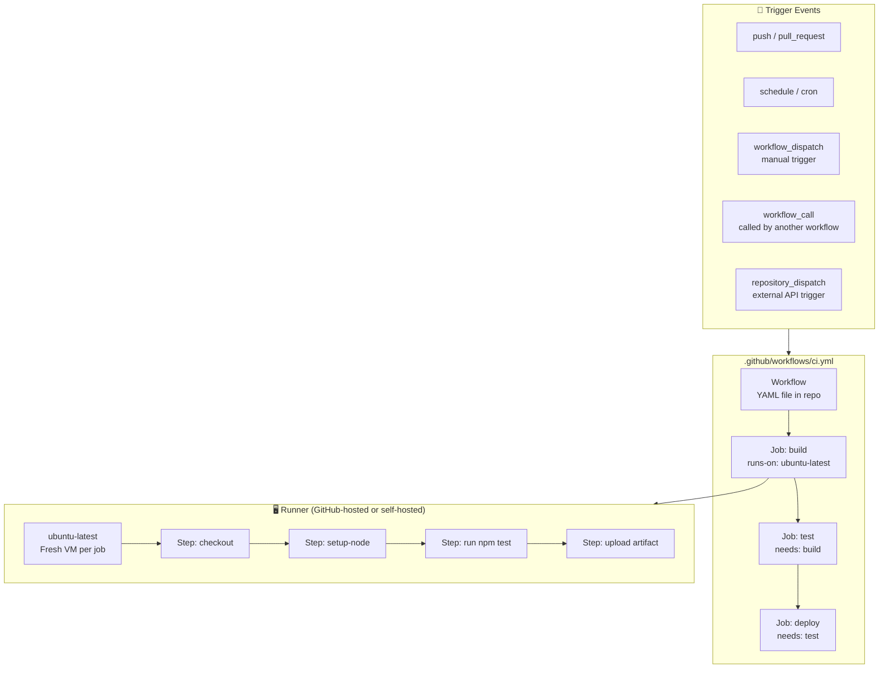
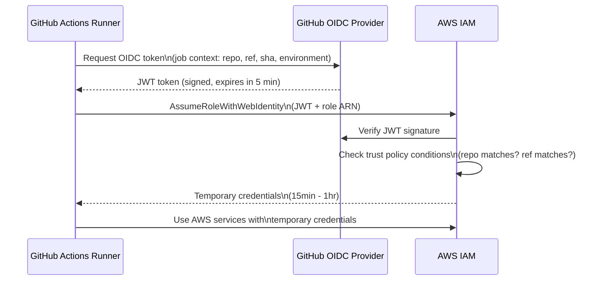
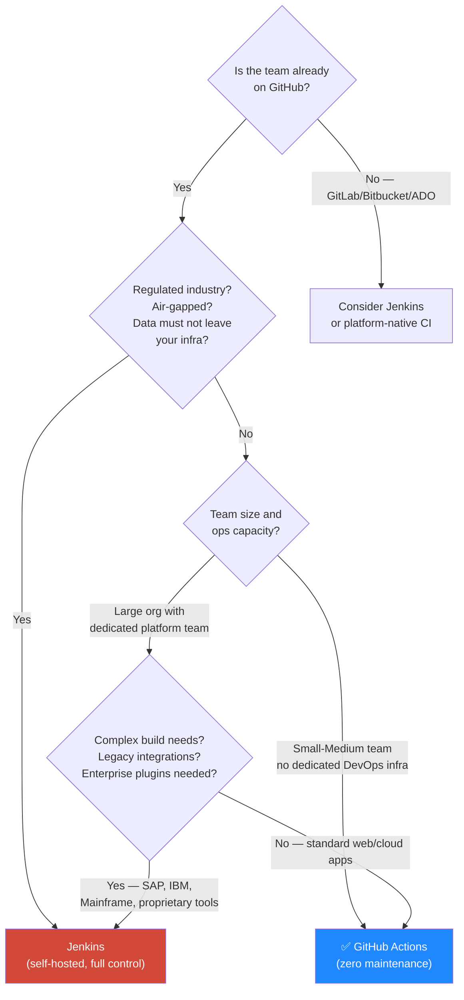

# 🔄 GitHub Actions vs Jenkins vs Azure Pipelines — Medium / Hard Interview Questions


> **Comprehensive reference** covering GitHub Actions, Jenkins, and Azure Pipelines at depth — including architecture internals, advanced patterns, security hardening, and the critical "which should we use?" decision framework.

---

## 📑 Table of Contents

| # | Topic | Level |
|---|---|---|
| 1 | GitHub Actions — Architecture & Core Concepts | Medium |
| 2 | GitHub Actions — Advanced Workflows | Medium/Hard |
| 3 | GitHub Actions — Security Hardening | Hard |
| 4 | GitHub Actions — Reusable Workflows & Composite Actions | Hard |
| 5 | GitHub Actions — Self-Hosted Runners | Medium/Hard |
| 6 | Jenkins — Architecture Deep Dive | Medium |
| 7 | Jenkins — Declarative vs Scripted Pipeline | Medium/Hard |
| 8 | Jenkins — Shared Libraries | Hard |
| 9 | Jenkins — Security, Credentials, and Hardening | Hard |
| 10 | Jenkins — Scaling: Agents, Kubernetes, and Distributed Builds | Hard |
| 11 | GitHub Actions vs Jenkins — Major Differences | Medium |
| 12 | GitHub Actions vs Jenkins — Which is Better? | Medium/Hard |
| 13 | Azure Pipelines — Architecture & Core Concepts | Medium |
| 14 | Azure Pipelines — Advanced Features | Hard |
| 15 | Three-Way Comparison — GitHub Actions vs Jenkins vs Azure Pipelines | Hard |
| 16 | Troubleshooting CI/CD Scenarios | Medium/Hard |

---

---

## 1. GitHub Actions — Architecture & Core Concepts

### ❓ Interview Question
> **"Explain the GitHub Actions architecture. What are the components of a workflow and how does GitHub Actions execute jobs?"**

### 📖 Core Architecture



### Core Terminology

| Term | Meaning |
|---|---|
| **Workflow** | YAML file in `.github/workflows/` — defines the entire automation pipeline |
| **Event (trigger)** | What starts the workflow: `push`, `pull_request`, `schedule`, `workflow_dispatch` |
| **Job** | A group of steps running on the same runner. Multiple jobs run in parallel by default |
| **Step** | Smallest unit — either a shell command (`run`) or an Action (`uses`) |
| **Action** | Reusable unit of code from the GitHub Marketplace or your own repo |
| **Runner** | The machine that executes jobs — GitHub-hosted (Ubuntu/Windows/macOS) or self-hosted |
| **Artifact** | Files persisted between jobs via `actions/upload-artifact` |
| **Context** | Objects containing workflow metadata: `github`, `env`, `secrets`, `inputs`, `needs` |
| **Expression** | `${{ ... }}` — evaluated at workflow parse time or step execution time |
| **Matrix** | Strategy to run one job across multiple variable combinations simultaneously |

### Basic Workflow Anatomy

```yaml
# .github/workflows/ci.yml
name: CI Pipeline

on:                                    # ← trigger events
  push:
    branches: [main, develop]
  pull_request:
    branches: [main]
  schedule:
    - cron: '0 2 * * *'               # 2am UTC daily
  workflow_dispatch:                   # manual trigger with inputs
    inputs:
      environment:
        type: choice
        options: [dev, staging, prod]
        required: true

env:                                   # ← workflow-level environment variables
  NODE_VERSION: '20'
  REGISTRY: ghcr.io

jobs:
  build:                               # ← job ID
    name: Build Application            # display name
    runs-on: ubuntu-latest             # runner

    outputs:                           # ← pass data to downstream jobs
      image-tag: ${{ steps.meta.outputs.tags }}

    steps:
      - name: Checkout code
        uses: actions/checkout@v4      # ← use an Action
        with:
          fetch-depth: 0               # full history for git describe

      - name: Setup Node.js
        uses: actions/setup-node@v4
        with:
          node-version: ${{ env.NODE_VERSION }}
          cache: 'npm'

      - name: Install dependencies
        run: npm ci                    # ← run shell command

      - name: Build
        run: npm run build

      - name: Upload build artifact
        uses: actions/upload-artifact@v4
        with:
          name: build-output
          path: dist/
          retention-days: 7

  test:
    name: Run Tests
    runs-on: ubuntu-latest
    needs: build                       # ← depends on build job

    steps:
      - uses: actions/checkout@v4

      - name: Download build artifact
        uses: actions/download-artifact@v4
        with:
          name: build-output
          path: dist/

      - name: Run unit tests
        run: npm test

      - name: Upload coverage
        uses: codecov/codecov-action@v4
        with:
          token: ${{ secrets.CODECOV_TOKEN }}
```

---

## 2. GitHub Actions — Advanced Workflows

### ❓ Interview Question
> **"Explain matrix strategies, conditional steps, job outputs, and environment deployments with approval gates in GitHub Actions."**

### 📖 Matrix Strategy

```yaml
jobs:
  test:
    strategy:
      fail-fast: false               # don't cancel all on one failure
      matrix:
        os: [ubuntu-latest, windows-latest, macos-latest]
        node: [18, 20, 22]
        exclude:
          - os: windows-latest
            node: 18                 # skip Windows + Node 18 combination
        include:
          - os: ubuntu-latest
            node: 20
            experimental: true      # add extra variable to specific combination

    runs-on: ${{ matrix.os }}
    steps:
      - uses: actions/setup-node@v4
        with:
          node-version: ${{ matrix.node }}
      - run: npm test
```

### 📖 Conditional Steps and Jobs

```yaml
steps:
  - name: Deploy to production
    if: github.ref == 'refs/heads/main' && github.event_name == 'push'
    run: ./deploy.sh prod

  - name: Run only on failure
    if: failure()
    run: ./send-alert.sh

  - name: Always run cleanup
    if: always()
    run: ./cleanup.sh

  - name: Skip if draft PR
    if: github.event.pull_request.draft == false
    run: ./run-full-tests.sh

  # Job-level condition
jobs:
  deploy:
    if: github.ref == 'refs/heads/main'
    needs: test
    runs-on: ubuntu-latest
```

### 📖 Environment Deployments with Approval Gates

```yaml
jobs:
  deploy-staging:
    runs-on: ubuntu-latest
    environment: staging              # environment must be configured in repo settings
    steps:
      - run: ./deploy.sh staging

  deploy-production:
    runs-on: ubuntu-latest
    needs: deploy-staging
    environment:
      name: production
      url: https://myapp.example.com  # shown in GitHub deployment status
    # GitHub pauses here until required reviewers approve in the UI
    steps:
      - run: ./deploy.sh production
```

### 📖 Job Outputs — Passing Data Between Jobs

```yaml
jobs:
  build:
    runs-on: ubuntu-latest
    outputs:
      version: ${{ steps.version.outputs.value }}
      image-digest: ${{ steps.push.outputs.digest }}
    steps:
      - name: Get version
        id: version
        run: echo "value=$(cat VERSION)" >> $GITHUB_OUTPUT

      - name: Build and push Docker image
        id: push
        uses: docker/build-push-action@v5
        with:
          push: true
          tags: myapp:${{ steps.version.outputs.value }}

  deploy:
    needs: build
    runs-on: ubuntu-latest
    steps:
      - name: Use version from build job
        run: |
          echo "Deploying version: ${{ needs.build.outputs.version }}"
          echo "Image digest: ${{ needs.build.outputs.image-digest }}"
```

### 📖 Concurrency — Prevent Parallel Deploys

```yaml
concurrency:
  group: ${{ github.workflow }}-${{ github.ref }}
  cancel-in-progress: true     # cancel older run if new one starts on same branch

# For production: don't cancel, queue instead
concurrency:
  group: production-deploy
  cancel-in-progress: false    # second run waits for first to finish
```

### 📖 Cache — Speed Up Builds

```yaml
- name: Cache npm dependencies
  uses: actions/cache@v4
  with:
    path: ~/.npm
    key: npm-${{ runner.os }}-${{ hashFiles('**/package-lock.json') }}
    restore-keys: |
      npm-${{ runner.os }}-      # fallback if exact match not found

- name: Cache Docker layers
  uses: actions/cache@v4
  with:
    path: /tmp/.buildx-cache
    key: buildx-${{ github.sha }}
    restore-keys: buildx-
```

---

## 3. GitHub Actions — Security Hardening

### ❓ Interview Question
> **"How do you secure GitHub Actions workflows? What is OIDC and how does it eliminate the need for long-lived cloud credentials?"**

### 📖 Principle of Least Privilege — Permissions

```yaml
# Top-level permissions — restrict everything by default
permissions:
  contents: read       # needed for checkout
  packages: write      # needed for GHCR push
  id-token: write      # needed for OIDC
  # Anything not listed defaults to 'none'

# Or lock down completely at workflow level, grant per-job
permissions: {}        # deny all at workflow level

jobs:
  build:
    permissions:
      contents: read
      packages: write
```

### 📖 OIDC — Keyless Cloud Authentication

OIDC (OpenID Connect) lets GitHub Actions workflows authenticate to cloud providers using short-lived tokens instead of long-lived credentials stored as secrets. GitHub acts as the OIDC identity provider.



```yaml
# AWS OIDC — no long-lived access keys stored as secrets
jobs:
  deploy:
    runs-on: ubuntu-latest
    permissions:
      id-token: write      # REQUIRED for OIDC
      contents: read

    steps:
      - name: Configure AWS credentials via OIDC
        uses: aws-actions/configure-aws-credentials@v4
        with:
          role-to-assume: arn:aws:iam::123456789012:role/github-actions-deploy
          aws-region: us-east-1
          # No access-key-id or secret-access-key needed!

      - name: Deploy to EKS
        run: |
          aws eks update-kubeconfig --name my-cluster
          kubectl apply -f k8s/
```

```json
// AWS IAM Trust Policy for OIDC
{
  "Version": "2012-10-17",
  "Statement": [{
    "Effect": "Allow",
    "Principal": {
      "Federated": "arn:aws:iam::123456789012:oidc-provider/token.actions.githubusercontent.com"
    },
    "Action": "sts:AssumeRoleWithWebIdentity",
    "Condition": {
      "StringEquals": {
        "token.actions.githubusercontent.com:aud": "sts.amazonaws.com"
      },
      "StringLike": {
        "token.actions.githubusercontent.com:sub":
          "repo:myorg/myrepo:environment:production"  // restrict to production env only
      }
    }
  }]
}
```

### 📖 Pinning Actions to SHA — Supply Chain Security

```yaml
# ❌ Insecure — tag can be moved to point to malicious code
- uses: actions/checkout@v4

# ✅ Secure — commit SHA cannot be changed
- uses: actions/checkout@11bd71901bbe5b1630ceea73d27597364c9af683  # v4.2.2

# Automate SHA pinning with Dependabot
# .github/dependabot.yml
version: 2
updates:
  - package-ecosystem: github-actions
    directory: /
    schedule:
      interval: weekly
    groups:
      actions:
        patterns: ["*"]
```

### 📖 Secret Management Best Practices

```yaml
# Secrets available in expressions
- run: echo "Token is ${{ secrets.API_TOKEN }}"
# ⚠️ GitHub masks secrets in logs but avoid printing them

# Pass secrets as env vars (safer than inline)
- name: Deploy
  env:
    API_TOKEN: ${{ secrets.API_TOKEN }}
    DB_PASSWORD: ${{ secrets.DB_PASSWORD }}
  run: ./deploy.sh

# NEVER do this — exposes in process list
- run: ./deploy.sh --token ${{ secrets.TOKEN }}  # ❌

# Use GitHub Environment secrets (scoped to environment + approval gate)
environment: production    # job only gets production secrets after approval
```

### 📖 Third-Party Action Audit

```bash
# Before using any third-party action, check:
# 1. Is it from a verified creator (GitHub, aws-actions, etc.)?
# 2. How many stars/users? Is it maintained?
# 3. Read the source code — actions can exfiltrate secrets
# 4. Pin to SHA, not tag
# 5. Use GitHub Advanced Security / scorecard to audit
```

---

## 4. GitHub Actions — Reusable Workflows & Composite Actions

### ❓ Interview Question
> **"What is the difference between a reusable workflow and a composite action in GitHub Actions? When would you use each?"**

### 📖 Reusable Workflows — Share Entire Pipelines

Called from another workflow using `workflow_call`. The called workflow runs on its own runner — isolated from the caller.

```yaml
# .github/workflows/reusable-docker-build.yml
name: Reusable Docker Build

on:
  workflow_call:                          # makes it callable
    inputs:
      image-name:
        required: true
        type: string
      push:
        required: false
        type: boolean
        default: true
    secrets:
      REGISTRY_PASSWORD:
        required: true
    outputs:
      image-digest:
        description: "Published image digest"
        value: ${{ jobs.build.outputs.digest }}

jobs:
  build:
    runs-on: ubuntu-latest
    outputs:
      digest: ${{ steps.push.outputs.digest }}
    steps:
      - uses: actions/checkout@v4
      - uses: docker/login-action@v3
        with:
          registry: ghcr.io
          password: ${{ secrets.REGISTRY_PASSWORD }}
      - uses: docker/build-push-action@v5
        id: push
        with:
          push: ${{ inputs.push }}
          tags: ghcr.io/myorg/${{ inputs.image-name }}:${{ github.sha }}
```

```yaml
# Caller workflow — uses the reusable workflow
jobs:
  build-api:
    uses: myorg/myrepo/.github/workflows/reusable-docker-build.yml@main
    with:
      image-name: api-service
      push: true
    secrets:
      REGISTRY_PASSWORD: ${{ secrets.GITHUB_TOKEN }}

  build-frontend:
    uses: myorg/myrepo/.github/workflows/reusable-docker-build.yml@main
    with:
      image-name: frontend
      push: true
    secrets:
      REGISTRY_PASSWORD: ${{ secrets.GITHUB_TOKEN }}
```

### 📖 Composite Actions — Reusable Steps

A composite action bundles multiple steps into a single `uses:` call. Runs in the **caller's** job context (same runner, same environment).

```yaml
# .github/actions/setup-and-test/action.yml
name: Setup and Test
description: Install deps, run tests, upload coverage

inputs:
  node-version:
    description: Node.js version
    default: '20'
  coverage-token:
    description: Codecov token
    required: true

outputs:
  test-result:
    description: Test pass/fail
    value: ${{ steps.test.outcome }}

runs:
  using: composite
  steps:
    - name: Setup Node
      uses: actions/setup-node@v4
      with:
        node-version: ${{ inputs.node-version }}
        cache: npm

    - name: Install
      run: npm ci
      shell: bash

    - name: Test
      id: test
      run: npm test
      shell: bash

    - name: Upload coverage
      uses: codecov/codecov-action@v4
      with:
        token: ${{ inputs.coverage-token }}
```

```yaml
# Using the composite action
steps:
  - uses: actions/checkout@v4
  - uses: ./.github/actions/setup-and-test    # local action
    with:
      node-version: '20'
      coverage-token: ${{ secrets.CODECOV_TOKEN }}
```

### Key Differences

| Dimension | Reusable Workflow | Composite Action |
|---|---|---|
| **Scope** | Entire workflow (jobs + steps) | Steps only (within a job) |
| **Runner** | Gets its own fresh runner | Runs on caller's runner |
| **Secrets** | Must be explicitly passed | Inherited from caller |
| **Artifacts** | Separate artifact namespace | Shares caller's namespace |
| **Use case** | Share entire deploy pipeline | Share step sequences (setup, lint, test) |
| **Nesting** | Up to 3 levels | Up to 10 levels |

---

## 5. GitHub Actions — Self-Hosted Runners

### ❓ Interview Question
> **"When would you choose self-hosted runners over GitHub-hosted? How do you run self-hosted runners on Kubernetes with autoscaling?"**

### 📖 When to Use Self-Hosted Runners

| Reason | Details |
|---|---|
| **Cost** | GitHub-hosted runners cost money at scale; self-hosted can be cheaper on EC2/GKE |
| **Private network access** | Jobs need to reach private VPCs, databases, internal Kubernetes clusters |
| **Custom hardware** | GPU workloads (ML training), ARM builds, specific CPU requirements |
| **Compliance** | Code cannot leave your infrastructure — regulated industries |
| **Large build caches** | Persistent runner with warm Docker layer cache = faster builds |

### 📖 Kubernetes-Based Autoscaling with ARC

Actions Runner Controller (ARC) runs ephemeral runners as Kubernetes pods — scale from 0 to N on demand.

```yaml
# Install ARC via Helm
helm install arc \
  oci://ghcr.io/actions/actions-runner-controller-charts/gha-runner-scale-set-controller \
  -n arc-systems --create-namespace

# Deploy a runner scale set
helm install arc-runner-set \
  oci://ghcr.io/actions/actions-runner-controller-charts/gha-runner-scale-set \
  -n arc-runners --create-namespace \
  --set githubConfigUrl="https://github.com/myorg/myrepo" \
  --set githubConfigSecret.github_token="$GITHUB_TOKEN" \
  --set minRunners=0 \
  --set maxRunners=20
```

```yaml
# Workflow targeting the ARC runner set
jobs:
  build:
    runs-on: arc-runner-set     # matches the Helm release name
    steps:
      - uses: actions/checkout@v4
      - run: npm test
```

---

## 6. Jenkins — Architecture Deep Dive

### ❓ Interview Question
> **"Explain Jenkins architecture. What is the difference between the master and agent? How does Jenkins store its configuration?"**

### 📖 Jenkins Architecture

```mermaid
flowchart TB
    subgraph JenkinsMaster["🏛️ Jenkins Controller (Master)"]
        direction TB
        WEB[Web UI\nPort 8080]
        API[REST API\n/api/json]
        SCHED[Scheduler\nJob Queue]
        SCM[SCM Polling\nWebhook receiver]
        CRED[Credentials Store\n(encrypted)]
        FS[File System\n$JENKINS_HOME]

        WEB <--> SCHED
        API <--> SCHED
        SCM --> SCHED
        SCHED <--> CRED
        SCHED <--> FS
    end

    subgraph Agents["🖥️ Build Agents"]
        A1[Agent: linux-builder\nJava + Docker]
        A2[Agent: windows-builder\n.NET build tools]
        A3[Agent: k8s-pod-agent\nEphemeral Kubernetes pod]
    end

    subgraph SCMRepo["📁 Source Code"]
        GH[GitHub / GitLab]
    end

    JenkinsMaster <-->|JNLP / SSH| A1
    JenkinsMaster <-->|JNLP / SSH| A2
    JenkinsMaster <-->|Kubernetes API| A3
    SCM <-->|Webhook / Poll| GH
```

### Jenkins Configuration Storage

```
$JENKINS_HOME/
├── config.xml                    ← global configuration
├── credentials.xml               ← encrypted credentials store
├── secrets/
│   ├── master.key                ← encryption key
│   └── hudson.util.Secret        ← secret encryption
├── jobs/
│   ├── my-pipeline/
│   │   ├── config.xml            ← job configuration (or Jenkinsfile reference)
│   │   └── builds/               ← build history
├── plugins/
│   └── *.jpi                     ← installed plugins
├── nodes/
│   └── agent-1/config.xml        ← agent configuration
└── workspace/
    └── my-pipeline/              ← checked-out source code during builds
```

```bash
# Configuration as Code (JCasC) — manage Jenkins config in YAML
# jenkins.yaml
jenkins:
  numExecutors: 0                  # no builds on controller
  systemMessage: "Production Jenkins"
  agentProtocols:
    - "JNLP4-connect"

  clouds:
    - kubernetes:
        name: kubernetes
        serverUrl: https://kubernetes.default
        namespace: jenkins
        templates:
          - name: jnlp-agent
            label: k8s-agent
            containers:
              - name: jnlp
                image: jenkins/inbound-agent:latest
```

---

## 7. Jenkins — Declarative vs Scripted Pipeline

### ❓ Interview Question
> **"What is the difference between Declarative and Scripted Jenkins Pipelines? Which do you use in production and why?"**

### 📖 Declarative Pipeline — Structured, Validated

```groovy
// Jenkinsfile — Declarative syntax
pipeline {
    agent {
        kubernetes {
            yaml '''
                apiVersion: v1
                kind: Pod
                spec:
                  containers:
                  - name: maven
                    image: maven:3.9-eclipse-temurin-21
                    command: [sleep]
                    args: [infinity]
                  - name: kaniko
                    image: gcr.io/kaniko-project/executor:debug
                    command: [sleep]
                    args: [infinity]
            '''
        }
    }

    environment {
        REGISTRY     = 'ghcr.io'
        IMAGE_NAME   = 'myorg/myapp'
        SONAR_TOKEN  = credentials('sonar-token')   // Jenkins credential binding
    }

    options {
        timeout(time: 30, unit: 'MINUTES')
        buildDiscarder(logRotator(numToKeepStr: '10'))
        disableConcurrentBuilds()
        timestamps()
    }

    stages {
        stage('Checkout') {
            steps {
                checkout scm
            }
        }

        stage('Build & Test') {
            parallel {
                stage('Unit Tests') {
                    steps {
                        container('maven') {
                            sh 'mvn test'
                            junit 'target/surefire-reports/*.xml'
                        }
                    }
                }
                stage('Static Analysis') {
                    steps {
                        container('maven') {
                            sh 'mvn sonar:sonar -Dsonar.token=$SONAR_TOKEN'
                        }
                    }
                }
            }
        }

        stage('Build Image') {
            steps {
                container('kaniko') {
                    sh """
                        /kaniko/executor \
                          --context=dir://${WORKSPACE} \
                          --dockerfile=Dockerfile \
                          --destination=${REGISTRY}/${IMAGE_NAME}:${BUILD_NUMBER}
                    """
                }
            }
        }

        stage('Deploy to Staging') {
            steps {
                withKubeConfig([credentialsId: 'kubeconfig-staging']) {
                    sh 'kubectl apply -f k8s/staging/'
                }
            }
        }

        stage('Approval: Production') {
            steps {
                input message: 'Deploy to production?',
                      ok: 'Deploy',
                      submitter: 'lead-engineers'
            }
        }

        stage('Deploy to Production') {
            steps {
                withKubeConfig([credentialsId: 'kubeconfig-prod']) {
                    sh 'kubectl apply -f k8s/production/'
                }
            }
        }
    }

    post {
        always {
            cleanWs()
        }
        success {
            slackSend(color: 'good', message: "✅ Build ${BUILD_NUMBER} deployed")
        }
        failure {
            slackSend(color: 'danger', message: "❌ Build ${BUILD_NUMBER} failed")
            emailext(
                subject: "Build failed: ${JOB_NAME}",
                body: "Check console: ${BUILD_URL}",
                to: 'team@example.com'
            )
        }
    }
}
```

### 📖 Scripted Pipeline — Full Groovy (Flexible but Complex)

```groovy
// Jenkinsfile — Scripted syntax
node('linux-agent') {
    def imageTag = ''

    try {
        stage('Checkout') {
            checkout scm
            imageTag = sh(script: 'git rev-parse --short HEAD', returnStdout: true).trim()
        }

        stage('Test') {
            sh 'npm ci && npm test'
            junit 'test-results/*.xml'
        }

        stage('Build') {
            docker.withRegistry('https://ghcr.io', 'ghcr-credentials') {
                def image = docker.build("myorg/myapp:${imageTag}")
                image.push()
                image.push('latest')
            }
        }

        // Dynamic stage generation — impossible in Declarative without scripted block
        def environments = ['dev', 'staging']
        environments.each { env ->
            stage("Deploy to ${env}") {
                withCredentials([file(credentialsId: "kubeconfig-${env}", variable: 'KUBECONFIG')]) {
                    sh "kubectl apply -f k8s/${env}/"
                }
            }
        }

    } catch (Exception e) {
        currentBuild.result = 'FAILURE'
        throw e
    } finally {
        cleanWs()
    }
}
```

### Comparison

| Dimension | Declarative | Scripted |
|---|---|---|
| **Syntax** | Structured blocks (`pipeline`, `stages`, `steps`) | Pure Groovy code |
| **Validation** | Linted and validated before run | Syntax errors only caught at runtime |
| **`post` block** | Built-in (`always`, `success`, `failure`) | Manual try/catch/finally |
| **`options` block** | Built-in timeouts, log rotation, etc. | Must be coded manually |
| **Flexibility** | Lower — can embed `script {}` blocks for Groovy | Maximum — any Groovy logic |
| **Dynamic stages** | Limited (needs `script {}` wrapper) | Native — `each`, `for` loops |
| **Best for** | 95% of pipelines | Complex conditional logic, dynamic pipeline generation |
| **Team readability** | High — YAML-like structure | Lower — requires Groovy knowledge |

---

## 8. Jenkins — Shared Libraries

### ❓ Interview Question
> **"What are Jenkins Shared Libraries and how do they help standardize pipelines across 50+ repositories?"**

### 📖 Shared Library Structure

```
jenkins-shared-library/              ← a separate Git repository
├── vars/
│   ├── buildDockerImage.groovy      ← global variable (callable as function)
│   ├── deployToKubernetes.groovy
│   └── runTests.groovy
├── src/
│   └── org/myorg/
│       ├── DockerUtils.groovy       ← Groovy class
│       └── KubeUtils.groovy
└── resources/
    └── templates/
        └── k8s-deployment.yaml     ← resource files accessible via libraryResource()
```

```groovy
// vars/buildDockerImage.groovy — callable as buildDockerImage(...)
def call(Map config = [:]) {
    def imageName = config.imageName ?: error("imageName is required")
    def tag       = config.tag       ?: env.BUILD_NUMBER
    def registry  = config.registry  ?: 'ghcr.io/myorg'

    stage("Build Docker Image: ${imageName}") {
        container('kaniko') {
            sh """
                /kaniko/executor \
                  --context=dir://${WORKSPACE} \
                  --destination=${registry}/${imageName}:${tag} \
                  --cache=true
            """
        }
        echo "Built: ${registry}/${imageName}:${tag}"
        return "${registry}/${imageName}:${tag}"
    }
}
```

```groovy
// vars/deployToKubernetes.groovy
def call(Map config = [:]) {
    def environment  = config.environment  ?: error("environment required")
    def imageTag     = config.imageTag     ?: error("imageTag required")
    def namespace    = config.namespace    ?: environment

    stage("Deploy to ${environment}") {
        withKubeConfig([credentialsId: "kubeconfig-${environment}"]) {
            sh "kubectl set image deployment/myapp myapp=${imageTag} -n ${namespace}"
            sh "kubectl rollout status deployment/myapp -n ${namespace} --timeout=5m"
        }
    }
}
```

```groovy
// Jenkinsfile in any repo — uses shared library
@Library('jenkins-shared-library@main') _

pipeline {
    agent { label 'k8s-agent' }

    stages {
        stage('Test') {
            steps {
                runTests(framework: 'maven', report: true)
            }
        }
        stage('Build') {
            steps {
                script {
                    def tag = buildDockerImage(imageName: 'myapp')
                    env.IMAGE_TAG = tag
                }
            }
        }
        stage('Deploy') {
            steps {
                deployToKubernetes(environment: 'staging', imageTag: env.IMAGE_TAG)
            }
        }
    }
}
```

---

## 9. Jenkins — Security, Credentials, and Hardening

### ❓ Interview Question
> **"How do you manage secrets in Jenkins securely? What are the common Jenkins security misconfigurations?"**

### 📖 Credentials Management

```groovy
// Types of Jenkins credentials:
// - Secret text:    withCredentials([string(credentialsId: 'api-token', variable: 'TOKEN')])
// - Username/password: withCredentials([usernamePassword(...)])
// - SSH key:        withCredentials([sshUserPrivateKey(...)])
// - Secret file:    withCredentials([file(credentialsId: 'kubeconfig', variable: 'KUBECONFIG')])
// - Certificate:    withCredentials([certificate(...)])

pipeline {
    stages {
        stage('Deploy') {
            steps {
                withCredentials([
                    string(credentialsId: 'aws-access-key', variable: 'AWS_ACCESS_KEY'),
                    string(credentialsId: 'aws-secret-key', variable: 'AWS_SECRET_KEY'),
                    file(credentialsId: 'kubeconfig-prod',  variable: 'KUBECONFIG')
                ]) {
                    sh '''
                        export AWS_ACCESS_KEY_ID=$AWS_ACCESS_KEY
                        export AWS_SECRET_ACCESS_KEY=$AWS_SECRET_KEY
                        aws eks update-kubeconfig --name prod-cluster
                        kubectl apply -f k8s/production/
                    '''
                    // Credentials masked in console output automatically
                }
            }
        }
    }
}
```

### 📖 Common Jenkins Security Misconfigurations

| Misconfiguration | Risk | Fix |
|---|---|---|
| **Allow anonymous read access** | External access to build logs, job names, pipeline code | Disable: Manage Jenkins → Security → Allow anonymous to read |
| **Running builds on controller** | Code execution on the controller node = full Jenkins compromise | Set controller executors to 0; all builds on agents |
| **No CSRF protection** | CSRF attacks can trigger builds via crafted URLs | Enable CSRF: Manage Jenkins → Security → CSRF Protection |
| **Groovy sandbox disabled** | Jenkinsfiles can run arbitrary code with no restriction | Keep Groovy sandbox ON; review/approve scripts cautiously |
| **Shared credentials by all jobs** | Any pipeline can read any credential | Use credential scoping — folders + per-folder credentials |
| **No plugin update policy** | Old plugins with CVEs remain in production | Schedule weekly plugin updates; monitor security advisories |
| **HTTP instead of HTTPS** | Credentials transmitted in plaintext | Enforce HTTPS with TLS termination at reverse proxy |

---

## 10. Jenkins — Scaling: Agents, Kubernetes, Dynamic Provisioning

### ❓ Interview Question
> **"How do you scale Jenkins to handle 200 concurrent builds? Explain the Kubernetes plugin approach."**

### 📖 Jenkins Kubernetes Plugin — Ephemeral Pod Agents

```groovy
pipeline {
    agent {
        kubernetes {
            inheritFrom 'base-pod'    // inherit from a pod template defined in Jenkins config
            yaml """
apiVersion: v1
kind: Pod
metadata:
  labels:
    jenkins: agent
spec:
  serviceAccountName: jenkins-agent
  containers:
  - name: jnlp
    image: jenkins/inbound-agent:latest-jdk21
    resources:
      requests: { cpu: 200m, memory: 256Mi }
      limits:   { cpu: 1000m, memory: 1Gi }

  - name: maven
    image: maven:3.9-eclipse-temurin-21
    command: [sleep]
    args: [infinity]
    resources:
      requests: { cpu: 500m, memory: 1Gi }
      limits:   { cpu: 2000m, memory: 4Gi }

  - name: docker
    image: docker:24-dind
    securityContext:
      privileged: true              # required for Docker-in-Docker
    volumeMounts:
    - name: docker-graph-storage
      mountPath: /var/lib/docker

  volumes:
  - name: docker-graph-storage
    emptyDir: {}
"""
        }
    }

    stages {
        stage('Build') {
            steps {
                container('maven') {
                    sh 'mvn package -DskipTests'
                }
            }
        }
        stage('Docker Build') {
            steps {
                container('docker') {
                    sh 'docker build -t myapp:latest .'
                }
            }
        }
    }
}
```

### 📖 Jenkins High Availability

```
Jenkins HA — Active/Standby with shared NFS:

Primary Jenkins Controller ──→ NFS mount ($JENKINS_HOME)
                                     ↑
Standby Jenkins Controller ─────────┘   (passive — monitors primary)

Load Balancer → Primary (active)
                        ↓ failure detected
              Standby promotes to primary → reads same $JENKINS_HOME
```

> **Note**: True active/active Jenkins HA is not natively supported. CloudBees (enterprise Jenkins) supports HA clustering. Most organizations run active/standby with fast failover.

---

## 11. GitHub Actions vs Jenkins — Major Differences

### ❓ Interview Question
> **"What are the fundamental differences between GitHub Actions and Jenkins? Walk me through at least 8 dimensions."**

### 📖 Architecture Difference

```mermaid
flowchart TB
    subgraph GHA["GitHub Actions"]
        direction LR
        GHREPO[GitHub Repository] --> GHAORCH[GitHub Actions\nOrchestration\n(fully managed)]
        GHAORCH --> GHRUN1[GitHub-hosted\nRunner ubuntu-latest]
        GHAORCH --> GHRUN2[GitHub-hosted\nRunner macos-latest]
        GHAORCH --> GHRUN3[Self-hosted Runner]
        style GHAORCH fill:#2088FF,color:#ffffff
    end

    subgraph JENKINS["Jenkins"]
        direction LR
        SCMR[Git Repository\n(any platform)] --> JCTRL[Jenkins Controller\n(self-managed)]
        JCTRL --> JAGENT1[Static Agent\n(SSH/JNLP)]
        JCTRL --> JAGENT2[Dynamic K8s Agent\n(ephemeral pod)]
        JCTRL --> JAGENT3[Cloud Agent\n(EC2/GCE auto-provisioned)]
        style JCTRL fill:#D24939,color:#ffffff
    end
```

### 📖 Detailed Comparison Table

| Dimension | GitHub Actions | Jenkins |
|---|---|---|
| **Hosting model** | SaaS — fully managed by GitHub | Self-hosted — you manage the controller, plugins, infra |
| **Setup time** | Zero — create a YAML file and push | Hours to days — install, configure, secure, plugin setup |
| **Maintenance overhead** | None — GitHub handles updates, HA, scaling | High — controller updates, plugin compatibility, security patches |
| **Pricing** | Free for public repos; minutes-based for private (2,000 free/month on Free plan) | Free software; you pay for compute (EC2, GKE, etc.) |
| **Pipeline as code** | YAML — simple, readable | Groovy (Declarative or Scripted) — powerful but complex |
| **Marketplace ecosystem** | 20,000+ Actions on GitHub Marketplace | 1,800+ plugins on Jenkins Plugin Index |
| **Secret management** | Built-in encrypted secrets; OIDC for cloud auth | Jenkins Credentials Store; HashiCorp Vault plugin for production |
| **UI/UX** | Integrated into GitHub — no separate tool | Separate web app — rich but dated UI |
| **SCM integration** | Native — every push/PR/tag automatically triggers | Polling or webhook; must configure separately |
| **Matrix builds** | Native YAML `strategy.matrix` | Must use plugins (Matrix Project) or Scripted loops |
| **Artifact storage** | Built-in `upload-artifact` / `download-artifact` | Requires Artifactory, S3, or filesystem plugin |
| **Caching** | Built-in `actions/cache` | Must configure — workspace reuse, custom caching |
| **Approval gates** | Native `environment` + required reviewers | `input` step in pipeline |
| **Multi-platform builds** | Built-in (ubuntu/windows/macos runners) | Manual agent configuration |
| **Air-gapped support** | GitHub Enterprise Server (on-prem) | Yes — runs fully offline |
| **Audit logs** | GitHub audit log + Actions log | Jenkins audit trail plugin |
| **Lock-in** | GitHub platform dependency | Portable — works with any Git provider |
| **Enterprise features** | GitHub Enterprise Cloud/Server | CloudBees CI (commercial) |

---

## 12. GitHub Actions vs Jenkins — Which is Better?

### ❓ Interview Question
> **"If a client asks you to choose between GitHub Actions and Jenkins for their CI/CD pipeline, how do you decide? What factors drive the recommendation?"**

### 📖 Decision Framework



### Choose GitHub Actions When:

- ✅ Your code is on GitHub (or you're willing to move it)
- ✅ Team is small-to-medium with no dedicated CI/CD infrastructure team
- ✅ You want zero maintenance overhead — no controller to patch, no plugin hell
- ✅ You're building cloud-native apps on AWS/GCP/Azure (OIDC integration is exceptional)
- ✅ Cost is predictable and minutes-based pricing works for your build volume
- ✅ You want native integration with GitHub PRs, environments, Dependabot, CODEQL

### Choose Jenkins When:

- ✅ Code lives on GitLab, Bitbucket, Azure DevOps, or an internal Git server
- ✅ Your industry requires data sovereignty — no code leaves your datacenter
- ✅ You have complex enterprise integrations — SAP, IBM Rational, mainframe systems
- ✅ You need deep customization beyond what Actions marketplace offers
- ✅ You have a large platform engineering team to maintain it
- ✅ Build volume is massive — thousands of builds/day — self-hosted compute is cheaper
- ✅ You require multi-cloud or on-prem agent diversity with custom toolchains

### 📖 Real-World Answer for Interviews

```
"I don't think it's a GitHub Actions vs Jenkins competition anymore —
it's about context.

For a startup or scale-up already on GitHub building cloud-native apps,
GitHub Actions is the clear choice. Zero infrastructure to manage, native
GitHub integration, OIDC eliminates stored credentials, and the Marketplace
covers 95% of use cases. Time-to-first-pipeline is measured in minutes.

For large enterprises — especially those in regulated industries (fintech,
healthcare, government) where code cannot leave their datacenter, or those
with deep legacy toolchain integrations — Jenkins is still the right answer.
The operational cost is real, but so is the flexibility and control.

The pattern I see most often today: companies migrating away from Jenkins
to GitHub Actions incrementally — starting with new projects on Actions,
leaving existing Jenkins pipelines in place until they're rewritten.

My team uses GitHub Actions. We replaced Jenkins three years ago and haven't
looked back for our use case (SaaS product, GitHub-native, AWS deployment)."
```

---

## 13. Azure Pipelines — Architecture & Core Concepts

### ❓ Interview Question
> **"What is Azure Pipelines? How does it compare architecturally to GitHub Actions?"**

### 📖 Architecture Overview

Azure Pipelines is Microsoft's CI/CD service, part of Azure DevOps (formerly VSTS). It supports both YAML pipelines and classic (visual) pipelines.

```mermaid
flowchart TB
    subgraph ADO["Azure DevOps Organization"]
        REPO[Azure Repos\nor GitHub / Bitbucket]
        PIPE[Azure Pipeline\n(YAML or Classic)]
        BOARD[Azure Boards\nWork items]
        ARTIFACTS[Azure Artifacts\nPackage registry]
        TEST[Azure Test Plans]
    end

    subgraph Agents["Agent Pools"]
        MS["Microsoft-hosted agents\nubuntu-latest, windows-latest, macos-latest"]
        SELF["Self-hosted agents\nVM or container"]
        SCALE["Scale Set Agents\nAzure VMSS auto-provisioned"]
    end

    subgraph Environments["Deployment Environments"]
        ENV_STAGING[staging environment\n+ approval gates\n+ resource health checks]
        ENV_PROD[production environment\n+ approval gates\n+ business hours gate]
    end

    REPO --> PIPE
    PIPE --> MS
    PIPE --> SELF
    PIPE --> SCALE
    PIPE --> ENV_STAGING --> ENV_PROD
    PIPE --> ARTIFACTS
```

### 📖 Azure Pipelines YAML

```yaml
# azure-pipelines.yml
trigger:
  branches:
    include:
      - main
      - release/*
  paths:
    exclude:
      - docs/*
      - '**/*.md'

pr:
  branches:
    include:
      - main

variables:
  imageRepository: 'myapp'
  containerRegistry: 'myregistry.azurecr.io'
  tag: '$(Build.BuildId)'

pool:
  vmImage: ubuntu-latest              # Microsoft-hosted agent

stages:
  - stage: Build
    displayName: Build and Test
    jobs:
      - job: BuildJob
        steps:
          - task: NodeTool@0
            inputs:
              versionSpec: '20.x'
            displayName: Install Node.js

          - script: |
              npm ci
              npm test
            displayName: Install and Test

          - task: PublishTestResults@2
            inputs:
              testResultsFormat: 'JUnit'
              testResultsFiles: '**/test-results.xml'

          - task: Docker@2
            displayName: Build and push Docker image
            inputs:
              command: buildAndPush
              repository: $(imageRepository)
              dockerfile: '**/Dockerfile'
              containerRegistry: myServiceConnection
              tags: |
                $(tag)
                latest

  - stage: Deploy_Staging
    displayName: Deploy to Staging
    dependsOn: Build
    condition: succeeded()
    jobs:
      - deployment: DeployStaging
        displayName: Deploy to AKS staging
        environment: staging                    # environment with approval gate
        strategy:
          runOnce:
            deploy:
              steps:
                - task: KubernetesManifest@1
                  inputs:
                    action: deploy
                    namespace: staging
                    manifests: k8s/staging/*.yaml
                    containers: '$(containerRegistry)/$(imageRepository):$(tag)'

  - stage: Deploy_Production
    displayName: Deploy to Production
    dependsOn: Deploy_Staging
    condition: succeeded()
    jobs:
      - deployment: DeployProd
        environment: production                 # requires approval in Azure DevOps
        strategy:
          runOnce:
            deploy:
              steps:
                - task: KubernetesManifest@1
                  inputs:
                    action: deploy
                    namespace: production
                    manifests: k8s/production/*.yaml
```

---

## 14. Azure Pipelines — Advanced Features

### ❓ Interview Question
> **"What are Azure Pipeline templates, variable groups, and service connections? How do they compare to equivalent GitHub Actions features?"**

### 📖 Azure Pipeline Templates

```yaml
# templates/build-template.yml  (in a central repo)
parameters:
  - name: nodeVersion
    type: string
    default: '20'
  - name: runTests
    type: boolean
    default: true

steps:
  - task: NodeTool@0
    inputs:
      versionSpec: ${{ parameters.nodeVersion }}

  - script: npm ci
    displayName: Install dependencies

  - ${{ if parameters.runTests }}:
    - script: npm test
      displayName: Run tests

  - script: npm run build
    displayName: Build
```

```yaml
# Using the template
extends:
  template: templates/build-template.yml@templates-repo   # from another repo
  parameters:
    nodeVersion: '20'
    runTests: true
```

### 📖 Variable Groups — Shared Secrets Across Pipelines

```yaml
# Variable group defined in Azure DevOps Library UI
# Name: "production-secrets"
# Variables: DB_PASSWORD, API_KEY, etc.
# Can be linked to Azure Key Vault for automatic sync

variables:
  - group: production-secrets        # all variables available as env vars
  - name: imageTag
    value: '$(Build.BuildId)'
```

### 📖 Service Connections — Authentication to External Services

```yaml
# Service connections configured in Azure DevOps → Project Settings → Service Connections
# Types: Azure Resource Manager, Docker Registry, Kubernetes, GitHub, AWS

- task: Docker@2
  inputs:
    containerRegistry: 'my-acr-service-connection'    # auth pre-configured
    repository: myapp
    command: push

- task: AzureWebApp@1
  inputs:
    azureSubscription: 'my-azure-rm-service-connection'
    appName: my-web-app
```

### 📖 Scale Set Agents — Azure VMSS for Auto-Scaling

```yaml
# Agent pool: Scale Set Agents
# Configured in Azure DevOps → Organization Settings → Agent Pools
# Backed by Azure Virtual Machine Scale Set
# Auto-scales 0 → N based on queue depth
# VMs are deallocated when idle → cost-efficient

pool:
  name: MyScaleSetPool     # points to VMSS-backed pool
  demands:
    - Agent.OS -equals Linux
```

---

## 15. Three-Way Comparison — GitHub Actions vs Jenkins vs Azure Pipelines

### ❓ Interview Question
> **"Compare GitHub Actions, Jenkins, and Azure Pipelines across all major dimensions. When would you recommend each?"**

### 📖 Master Comparison Table

| Dimension | GitHub Actions | Jenkins | Azure Pipelines |
|---|---|---|---|
| **Vendor** | GitHub (Microsoft) | Open-source (CloudBees commercial) | Microsoft (Azure DevOps) |
| **Hosting** | SaaS (GitHub) | Self-hosted | SaaS (Azure) |
| **Pipeline syntax** | YAML | Groovy DSL / YAML-like Declarative | YAML (+ classic visual editor) |
| **Setup time** | Minutes | Hours–Days | 30–60 minutes |
| **Maintenance** | None | High (plugins, controller) | Low |
| **Secret management** | GitHub Secrets + OIDC | Jenkins Credentials + Vault plugin | Variable Groups + Azure Key Vault |
| **Approval gates** | Environments + required reviewers | `input` step | Environments + approval checks |
| **Matrix builds** | Native | Plugin or scripted | Native |
| **Artifact storage** | GitHub Artifacts (7-90 days) | Plugin-dependent | Azure Artifacts (permanent) |
| **Package registry** | GitHub Packages (GHCR, npm, Maven) | Nexus/Artifactory plugin | Azure Artifacts (all formats) |
| **Code analysis** | CodeQL (native), Marketplace SCA | SonarQube plugin | SonarQube / Security Center |
| **Docker support** | Excellent | Good (Docker plugin / Kaniko) | Good (Docker task) |
| **Kubernetes deploy** | Excellent (OIDC to EKS/GKE/AKS) | K8s plugin | Excellent (AKS native) |
| **Windows builds** | windows-latest runner | Windows agent | Excellent (native Microsoft) |
| **.NET ecosystem** | Good | Requires plugins | Excellent (first-class) |
| **Air-gapped** | GitHub Enterprise Server (expensive) | Yes | Azure DevOps Server (on-prem) |
| **Price model** | Minutes (2000 free/month free plan) | Free software; compute cost | Free for open-source; 1800 min free |
| **At-scale cost** | Can be expensive for large orgs | Compute only (very cheap) | Comparable to GHA |
| **IDE integration** | VS Code GitHub Actions extension | Blue Ocean, VS Code plugin | Azure DevOps VS/VS Code |
| **Mobile/Slack alerts** | Via Actions Marketplace | Via plugins | Built-in service hooks |
| **Best SCM** | GitHub | Any (GitLab, Bitbucket, GitHub) | Azure Repos (+ GitHub, Bitbucket) |
| **Best cloud** | AWS / GCP / Azure (OIDC all) | Any | Azure (native), others via service connections |

### When to Choose Each

```
GitHub Actions:    GitHub + cloud-native + small/medium team + zero ops overhead
Jenkins:           Any SCM + air-gapped + enterprise complexity + large scale budget control
Azure Pipelines:   Azure DevOps + Microsoft stack (.NET, Azure) + Windows-heavy builds
```

---

## 16. Troubleshooting CI/CD Scenarios

### Scenario 1 — GitHub Actions: Workflow Not Triggering on Push

```yaml
# Common causes:
# 1. Branch name doesn't match filter
on:
  push:
    branches: [main]       # only triggers on 'main' — not 'master', not 'develop'

# 2. Path filter excludes the changed files
on:
  push:
    paths:
      - 'src/**'           # only triggers if src/ changes

# 3. Workflow file has a YAML syntax error
# Check: GitHub → Actions → see "Workflow is not valid" error

# 4. Workflow is in a branch that doesn't have the file
# The workflow must exist on the branch being pushed to

# Debug: check the "Actions" tab → look for any run attempt
# Use: act (local runner) to test locally
npx @github/local-action run .github/workflows/ci.yml --event push
```

### Scenario 2 — Jenkins Build Stuck in Queue

```bash
# Causes:
# 1. No available agents with required labels
# Check: Manage Jenkins → Nodes → see agent status
# Fix: restart stuck agent, or add more agents

# 2. Agent is offline
# Check: Manage Jenkins → Nodes → agent shows 'offline'
# Fix: SSH to agent machine, restart jenkins agent service
systemctl restart jenkins-agent

# 3. Resource starvation on Kubernetes pod agents
kubectl get pods -n jenkins -l jenkins=agent
kubectl describe pod <stuck-pod>
# Look for: Insufficient cpu/memory, PodScheduled: False

# 4. Executor limit reached
# Manage Jenkins → Nodes → Master → # executors = 0 is correct
# Agents must have executors > 0

# 5. Locked workspace
# Use "Discard Old Builds" or clean workspace plugin
```

### Scenario 3 — Azure Pipelines: Approval Gate Not Appearing

```yaml
# Root cause: environment not configured as deployment environment with approvals

# Fix steps:
# 1. Go to: Azure DevOps → Pipelines → Environments
# 2. Select or create "production" environment
# 3. → Approvals and checks → Add → Approvals
# 4. Add approvers (users or groups)
# 5. Set timeout (default: 30 days)
# 6. Set instructions for approvers

# In pipeline — must use deployment job (not regular job):
jobs:
  - deployment: DeployProd        # 'deployment' keyword, not 'job'
    environment: production       # links to the environment with approval
    strategy:
      runOnce:
        deploy:
          steps:
            - script: echo "Deploying..."
```

### Scenario 4 — GitHub Actions: Secret Not Available in Forked PR

```yaml
# GitHub does NOT pass secrets to workflows triggered by PRs from forks
# (security: fork authors could exfiltrate secrets)

# Solution: use pull_request_target (runs in context of base repo)
# ⚠️ Security warning: pull_request_target is dangerous with untrusted code
# Only use with explicit checkout of PR code in a sandboxed step

on:
  pull_request_target:             # has access to secrets
    types: [opened, synchronize]

jobs:
  deploy-preview:
    runs-on: ubuntu-latest
    steps:
      - uses: actions/checkout@v4
        with:
          ref: ${{ github.event.pull_request.head.sha }}   # explicit — don't use head ref directly
      - name: Deploy preview
        env:
          NETLIFY_TOKEN: ${{ secrets.NETLIFY_TOKEN }}     # now available
        run: netlify deploy --alias pr-${{ github.event.number }}
```

### Scenario 5 — Jenkins: Groovy Sandbox Script Approval

```
Problem: Pipeline fails with:
"org.jenkinsci.plugins.scriptsecurity.sandbox.RejectedAccessException:
 Scripts not permitted to use method java.lang.String.execute"

Cause: Groovy sandbox blocks certain Java/Groovy methods for security

Solutions:
1. Approve the specific method:
   Manage Jenkins → Security → In-process Script Approval → Approve

2. Refactor to use shell steps instead of Groovy execution:
   // Instead of:
   def result = "ls -la".execute().text
   // Use:
   def result = sh(script: 'ls -la', returnStdout: true).trim()

3. Use a whitelisted Groovy method:
   // Avoid .execute() on strings — it bypasses sandbox controls
```

---

## 🧠 Master Summary

| Topic | Key Point |
|---|---|
| **GHA Architecture** | Event → Workflow YAML → Jobs (parallel) → Steps on fresh runner. `needs:` for dependencies |
| **GHA Matrix** | Run one job across N×M combinations simultaneously — `strategy.matrix` |
| **GHA OIDC** | Short-lived tokens replace long-lived cloud credentials — `id-token: write` permission + IAM trust policy |
| **GHA Reusable Workflow** | `workflow_call` trigger — share entire pipelines. Gets its own runner. Must explicitly pass secrets |
| **GHA Composite Action** | `runs: using: composite` — share step sequences. Runs on caller's runner. Inherits env |
| **GHA Security** | Pin actions to SHA; `permissions: {}` deny-all; OIDC; environment secrets with approval gates |
| **GHA Self-hosted** | ARC (Actions Runner Controller) = K8s pods as ephemeral runners, auto-scale 0→N |
| **Jenkins Architecture** | Controller (orchestration) + Agents (execution). No builds on controller. K8s plugin for ephemeral pods |
| **Declarative Pipeline** | Structured `pipeline { stages { } }` — validated, readable, `post` block built-in |
| **Scripted Pipeline** | Pure Groovy `node { }` — maximum flexibility, dynamic stages, but more complex |
| **Jenkins Shared Libraries** | Separate Git repo with `vars/` (global functions) and `src/` (classes). Used via `@Library` annotation |
| **Jenkins Security** | Zero executors on controller; CSRF on; Groovy sandbox on; credential scoping; HTTPS only |
| **Jenkins Scaling** | Kubernetes plugin = ephemeral pod agents per build. HA = active/standby with shared NFS |
| **GHA vs Jenkins** | GHA: zero maintenance, GitHub-native, OIDC, simple YAML. Jenkins: full control, any SCM, air-gapped, enterprise plugins |
| **Choose GHA when** | GitHub + cloud-native + small-medium team + want zero ops overhead |
| **Choose Jenkins when** | Any SCM + air-gapped + enterprise complexity + massive build volume budget control |
| **Azure Pipelines** | Microsoft/Azure-native CI/CD. Excellent for .NET, Azure, Windows. YAML + classic editor. Scale Set Agents |
| **Azure Variable Groups** | Shared secrets across pipelines. Link to Azure Key Vault for automatic rotation sync |
| **Three-way verdict** | GitHub Actions wins on developer experience. Jenkins wins on flexibility/control. Azure Pipelines wins on Microsoft ecosystem |
