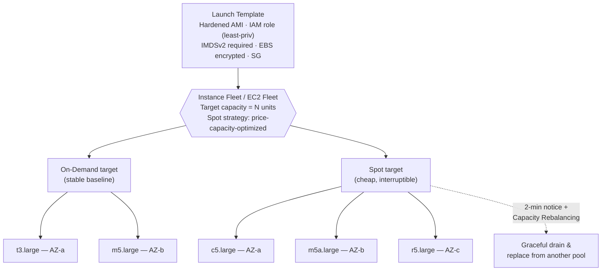

# AWS Question 1 — What is an EC2 Instance Fleet?

> **Section:** AWS &nbsp;|&nbsp; **Topic:** EC2 / Compute &nbsp;|&nbsp; **Level:** Mid (2–5 yrs) &nbsp;|&nbsp; **Frequency:** High
>
> _Part of the DevOps & DevSecOps Interview Preparation series._

---

## ❓ The Question

> **"What is an Instance Fleet in AWS, and when would you use one?"**

You may also hear this phrased as:

- "What's the difference between an EC2 Fleet and an Auto Scaling Group?"
- "How would you run a workload across multiple instance types and pricing models at once?"
- "How does EMR let you mix Spot and On-Demand instances?"

---

## 🎯 Why Interviewers Ask This

This question quickly separates people who only know *"EC2 = a virtual machine"* from people who understand **cost-aware, resilient compute design**. By asking it, the interviewer is checking whether you can:

- Distinguish between the EC2 **purchasing models** (On-Demand, Reserved, Savings Plans, Spot) and reason about cost vs. reliability trade-offs.
- Design infrastructure that survives **Spot interruptions** without falling over.
- Pick the right AWS primitive for the job (Fleet vs. Auto Scaling Group vs. EMR instance fleet).
- Talk about **capacity strategy** — diversifying across instance types and Availability Zones (AZs) to get capacity and lower price.

It is a favourite for **DevOps / Cloud / SRE** roles because the answer naturally extends into cost optimisation, high availability, and (for DevSecOps) the security baseline that every launched instance must inherit.

---

## 📖 Key Terminologies

| Term | Plain-English meaning |
| --- | --- |
| **EC2 instance** | A virtual server in AWS. |
| **Instance type / family** | The size & shape of an instance (e.g., `t3.medium`, `m5.large`, `c5.xlarge`). Families are tuned for general-purpose, compute, memory, etc. |
| **On-Demand** | Pay-per-second, no commitment, highest price, never interrupted. |
| **Reserved Instances / Savings Plans** | A 1- or 3-year commitment for a big discount on steady-state usage. |
| **Spot Instances** | Spare AWS capacity at up to ~90% off — but AWS can reclaim it with a 2-minute warning. |
| **Instance Fleet** | A configuration that launches a **group of mixed instance types** across **multiple purchasing options** to hit a **target capacity**. |
| **EC2 Fleet** | The AWS API/feature that provisions On-Demand **and** Spot across many instance types & AZs in a single request. |
| **Spot Fleet** | The older predecessor to EC2 Fleet (Spot-focused). EC2 Fleet is the modern, recommended choice. |
| **EMR Instance Fleets** | The Amazon EMR cluster option where the term "instance fleet" most precisely applies — you define mixed types + On-Demand/Spot per node group. |
| **Launch Template** | The reusable blueprint (AMI, IAM role, security group, key, user-data, metadata options) a fleet uses to launch each instance. |
| **Target capacity** | How much compute you want, measured in instance count **or** vCPUs/memory units. |
| **Allocation strategy** | The rule the fleet uses to *choose which pools to draw from* (e.g., `price-capacity-optimized`). |

---

## 🗣️ How to Answer (Structured)

**1) One-line definition (lead with this):**
> "An instance fleet is a configuration that lets me launch a *group of EC2 instances of different types and purchasing options* — On-Demand and Spot together — to meet a target capacity, instead of being locked to a single instance type."

**2) Contrast it with an Auto Scaling Group (ASG):**
A classic ASG traditionally scales **homogeneous** instances (e.g., many `t3.medium`). A fleet is built for **heterogeneity** — mix `t3`, `m5`, `c5`, `r5` and blend On-Demand + Spot in one config. (Modern ASGs *can* do this too via a **mixed instances policy**, which is essentially EC2 Fleet under the hood.)

**3) Use the analogy:**
> "Think of a naval fleet — a few large flagships (On-Demand, always available) supported by many smaller, cheaper vessels (Spot). You set a separate target for each so you balance reliability against cost."

**4) Give the headline benefits:**
- **Diversification = availability:** drawing from many instance-type/AZ pools means if one Spot pool dries up, the fleet pulls from another → fewer interruptions.
- **Cost optimisation:** Spot for the bulk of stateless capacity, On-Demand as a stable baseline.
- **Fine-tuned capacity:** define how many units come from On-Demand vs. Spot.

**5) Name a concrete use case:**
> "A textbook example is **Amazon EMR** for big-data processing — the core/task nodes run mostly on Spot across many instance types for cost, with a small On-Demand base so the cluster always makes progress. Batch processing, CI runners, and stateless web tiers fit the same pattern."

**6) Mention the modern allocation strategy (shows you're current):**
> "For Spot I'd use the **`price-capacity-optimized`** strategy — it picks pools that are both cheap *and* have deep available capacity, which minimises interruptions. The old `lowest-price` strategy is no longer recommended because it crowds into the cheapest, most volatile pool."

**7) Close with the trade-off:**
> "Fleets are ideal for **fault-tolerant, stateless, or checkpointable** workloads. I would *not* put a stateful primary database on pure Spot — I'd keep that On-Demand or Reserved."

---

## 🔐 Security Perspective (DevSecOps)

A fleet launches **many instances dynamically and heterogeneously**, so the security baseline must live in the **launch template** — not be applied by hand afterwards. This is where DevSecOps earns its keep:

- **Golden / hardened AMI:** every instance in the fleet should boot from a vetted, patched, CIS-benchmarked AMI. Heterogeneous instance *types* are fine; heterogeneous *security posture* is not.
- **Enforce IMDSv2:** set the launch template metadata options to `HttpTokens = required`. This blocks the SSRF-to-credential-theft attack class (the 2019 Capital One breach pattern). Critical because fleet instances frequently carry IAM roles.
- **Least-privilege IAM instance profile:** attach a scoped role, never long-lived access keys baked into user-data.
- **Encryption everywhere:** EBS volumes encrypted (KMS) by default; enforce in-transit encryption for the app. Spot instances are ephemeral, so assume the disk can vanish — never let sensitive state persist only there.
- **Tight security groups:** least-privilege ingress; no `0.0.0.0/0` on management ports.
- **Spot interruption hygiene:** handle the 2-minute interruption notice and **Capacity Rebalancing** to drain connections and flush/secure data before reclaim — an abrupt kill can leave secrets in memory dumps or half-written files.
- **Guardrails & governance:** use **SCPs / IAM conditions** to restrict which instance types, regions, and AMIs a fleet may launch (prevents cost blow-ups *and* shadow/untrusted images). Tag everything for cost allocation and audit.
- **Drift control:** because fleets scale fast, config drift is a real risk — bake config into the AMI/launch template and verify with tools like AWS Config / SSM, not manual SSH.

> **One-liner for the room:** *"The fleet decides **what** to launch; the launch template decides **how securely** it launches. Harden the template — AMI, IMDSv2, least-privilege role, encryption — and every instance the fleet spins up inherits that baseline."*

---

## 🖼️ Visuals

### Mermaid — How a fleet provisions capacity



### Source diagram (KodeKloud) — EC2 Fleet configuration & benefits


---

## 📊 Quick Comparison (know the differences they may probe)

| | **EC2 Fleet** | **Spot Fleet** | **EMR Instance Fleets** | **ASG (mixed instances)** |
| --- | --- | --- | --- | --- |
| Mixes instance types | ✅ | ✅ | ✅ (up to 30/fleet) | ✅ |
| On-Demand + Spot in one config | ✅ | ✅ | ✅ | ✅ |
| Auto-replaces interrupted Spot | ✅ (`maintain` type) | ✅ | ✅ | ✅ |
| Auto Scaling policies / health | ➖ (use ASG) | ➖ | EMR-managed scaling | ✅ Full ASG features |
| Best for | Generic mixed compute via API/IaC | Legacy Spot use (prefer EC2 Fleet) | Big-data clusters | Long-running services needing scaling |

> **Quick mnemonic:** *Spot Fleet is the old one; EC2 Fleet is the new general one; EMR Instance Fleets is the EMR-specific one; ASG mixed-instances policy is "EC2 Fleet with scaling bolted on."*

---

## 🛠️ Hands-On: Commands & Syntax (be ready to whiteboard these)

Interviewers increasingly ask *"show me, don't tell me."* You don't need every flag memorised, but you should be able to sketch the **shape** of these.

### 1) A hardened launch template — the security baseline every instance inherits

```bash
aws ec2 create-launch-template \
  --launch-template-name secure-fleet-lt \
  --version-description "hardened-baseline-v1" \
  --launch-template-data '{
    "ImageId": "ami-0abcd1234efgh5678",
    "IamInstanceProfile": {"Name": "fleet-least-priv-profile"},
    "MetadataOptions": {"HttpTokens": "required", "HttpEndpoint": "enabled"},
    "BlockDeviceMappings": [
      {"DeviceName": "/dev/xvda", "Ebs": {"Encrypted": true, "VolumeType": "gp3"}}
    ],
    "SecurityGroupIds": ["sg-0123456789abcdef0"]
  }'
```

> `HttpTokens=required` ⇒ **IMDSv2 enforced** (blocks SSRF credential theft). `Encrypted=true` ⇒ data-at-rest by default. This template is the baseline every fleet instance inherits.

### 2) Create an EC2 Fleet (mixed types + On-Demand & Spot)

`fleet-config.json`:

```json
{
  "LaunchTemplateConfigs": [
    {
      "LaunchTemplateSpecification": { "LaunchTemplateName": "secure-fleet-lt", "Version": "$Latest" },
      "Overrides": [
        { "InstanceType": "m6i.large", "AvailabilityZone": "us-east-1a" },
        { "InstanceType": "m5.large",  "AvailabilityZone": "us-east-1b" },
        { "InstanceType": "m5a.large", "AvailabilityZone": "us-east-1c" }
      ]
    }
  ],
  "TargetCapacitySpecification": {
    "TotalTargetCapacity": 10,
    "OnDemandTargetCapacity": 2,
    "SpotTargetCapacity": 8,
    "DefaultTargetCapacityType": "spot"
  },
  "OnDemandOptions": { "AllocationStrategy": "lowest-price" },
  "SpotOptions":     { "AllocationStrategy": "price-capacity-optimized" },
  "Type": "maintain"
}
```

```bash
# create, inspect, then tear down
aws ec2 create-fleet --cli-input-json file://fleet-config.json
aws ec2 describe-fleets          --fleet-ids fleet-12a34b56-7c89-0d12-...
aws ec2 describe-fleet-instances --fleet-id  fleet-12a34b56-7c89-0d12-...
aws ec2 delete-fleets            --fleet-ids fleet-12a34b56-7c89-0d12-... --terminate-instances
```

> `Type: maintain` keeps the target capacity alive — if a Spot instance is reclaimed, the fleet automatically launches a replacement from another pool. (`instant` = one-shot synchronous; `request` = async, no top-up.)

### 3) Check Spot capacity *before* you commit — Spot Placement Score

```bash
aws ec2 get-spot-placement-scores \
  --instance-types m6i.large m5.large m5a.large \
  --target-capacity 100 \
  --region-names us-east-1 us-west-2
```

> Returns a **1–10 score** per Region/AZ predicting how likely your request is to be fulfilled — AWS computes it from live capacity telemetry. Great for choosing where to place a large fleet.

### 4) EMR with instance fleets (the canonical use case)

```bash
aws emr create-cluster \
  --name "spark-fleet-cluster" \
  --release-label emr-7.1.0 \
  --use-default-roles \
  --instance-fleets file://emr-fleets.json
```

`emr-fleets.json` (core node fleet sketch):

```json
[
  {
    "Name": "core-fleet",
    "InstanceFleetType": "CORE",
    "TargetOnDemandCapacity": 1,
    "TargetSpotCapacity": 4,
    "InstanceTypeConfigs": [
      { "InstanceType": "m5.xlarge",  "WeightedCapacity": 1 },
      { "InstanceType": "m5a.xlarge", "WeightedCapacity": 1 },
      { "InstanceType": "m6i.xlarge", "WeightedCapacity": 1 }
    ],
    "LaunchSpecifications": {
      "SpotSpecification": {
        "TimeoutDurationMinutes": 10,
        "TimeoutAction": "SWITCH_TO_ON_DEMAND",
        "AllocationStrategy": "price-capacity-optimized"
      }
    }
  }
]
```

### 5) Infrastructure as Code — Terraform `aws_ec2_fleet`

```hcl
resource "aws_ec2_fleet" "app" {
  type = "maintain"

  launch_template_config {
    launch_template_specification {
      launch_template_id = aws_launch_template.secure.id
      version            = "$Latest"
    }
    override {
      instance_type     = "m6i.large"
      availability_zone = "us-east-1a"
    }
    override {
      instance_type     = "m5.large"
      availability_zone = "us-east-1b"
    }
    override {
      instance_type     = "m5a.large"
      availability_zone = "us-east-1c"
    }
  }

  target_capacity_specification {
    total_target_capacity        = 10
    on_demand_target_capacity    = 2
    spot_target_capacity         = 8
    default_target_capacity_type = "spot"
  }

  spot_options {
    allocation_strategy = "price-capacity-optimized"
  }
  on_demand_options {
    allocation_strategy = "lowest-price"
  }
}
```

### 6) The modern Kubernetes trend — Karpenter `NodePool`

On EKS, **Karpenter** has largely replaced static managed node groups. You declare *requirements* (not fixed types) and Karpenter just-in-time provisions the cheapest matching EC2 across Spot/On-Demand — essentially the "instance fleet" idea, automated.

```yaml
apiVersion: karpenter.sh/v1
kind: NodePool
metadata:
  name: default
spec:
  template:
    spec:
      requirements:
        - key: karpenter.sh/capacity-type
          operator: In
          values: ["spot", "on-demand"]   # diversify pricing
        - key: kubernetes.io/arch
          operator: In
          values: ["amd64", "arm64"]       # include Graviton
        - key: karpenter.k8s.aws/instance-category
          operator: In
          values: ["c", "m", "r"]          # broaden the pool
      nodeClassRef:
        group: karpenter.k8s.aws
        kind: EC2NodeClass
        name: default
  disruption:
    consolidationPolicy: WhenEmptyOrUnderutilized   # bin-pack & save cost
```

---

## 🤖 AI & The New Trend (2024–2025) — what changed, and what to learn

> Raising this unprompted in a 2025 interview signals you're current. Companies are no longer hand-tuning compute — ML now drives capacity, scaling, and cost decisions, and AI workloads have become the biggest consumer of fleets.

### How AI is impacting fleet / compute management

- **ML-driven allocation & interruption avoidance** — `price-capacity-optimized` and the **Spot Placement Score** are powered by AWS's live capacity telemetry and ML, so you stop *guessing* which Spot pools are safe.
- **Predictive Scaling for EC2 Auto Scaling** — ML forecasts recurring traffic patterns (e.g., the daily 9am peak) and scales out **ahead** of load instead of reacting to it.
- **AWS Compute Optimizer** — ML analyses CloudWatch history and recommends right-sizing for EC2, ASGs, EBS, and Lambda. This feeds directly into *which* instance types belong in your fleet and cuts waste.
- **Karpenter is the new default (Kubernetes)** — just-in-time, diversified, Spot-friendly provisioning with bin-packing consolidation. It is *the* modern evolution of the instance-fleet concept and the most-asked compute trend right now.
- **AI workloads are now the #1 fleet driver** — LLM training/inference needs scarce, pricey accelerators (GPU `P5`/`P4d`, AWS `Trainium`/`Inferentia`). Teams use **diversified GPU fleets + Spot + EC2 Capacity Blocks for ML** to get capacity affordably; checkpointable training is a perfect Spot candidate (also see SageMaker Managed Spot Training).
- **FinOps + anomaly detection** — AWS Cost Anomaly Detection (ML) flags runaway fleet spend automatically before the bill explodes.

### How AI can contribute to your day-to-day

- **Generate IaC fast** — Amazon Q Developer (formerly CodeWhisperer), GitHub Copilot, or any LLM can scaffold the launch template / EC2 Fleet / Terraform above; you then review and harden.
- **Explain & debug** — paste a fleet config or interruption log and ask *"why is my Spot request not being fulfilled?"*
- **Right-sizing reviews** — feed Compute Optimizer output to an LLM to summarise and prioritise the cost actions.
- **Guardrail generation** — draft SCPs / IAM conditions / OPA-Conftest rules that restrict instance types and force IMDSv2.

### ⚠️ Security caveat (this is the DevSecOps part — say it out loud)

- **Never paste secrets, account IDs, or private AMIs into public AI tools.** Use enterprise/in-VPC assistants (Amazon Q, Amazon Bedrock) for sensitive context.
- **AI-generated IaC is a draft, not gospel.** It frequently defaults to *insecure* settings — IMDSv1, `0.0.0.0/0` security groups, unencrypted volumes, over-broad IAM. Always review.
- **Treat AI output as untrusted input** — lint and policy-check it in CI with **Checkov / tfsec / Trivy** before `apply`.

### What to learn right now (priority order)

1. **Karpenter** (if you touch EKS) — the single most-asked modern compute trend.
2. **Compute Optimizer + Predictive Scaling** — ML-driven right-sizing and forecasting.
3. **Spot Placement Score & `price-capacity-optimized`** — the current best-practice capacity story.
4. **EC2 Capacity Blocks for ML + Spot for training** — how AI workloads consume compute.
5. **Amazon Q Developer / Bedrock** — using AI to generate and review IaC *safely*.
6. **IaC security scanning (Checkov / tfsec / Trivy)** — so AI-generated configs never ship insecure.

---

## ✅ Prerequisites (be solid on these first)

- **EC2 fundamentals** — what an instance, AMI, and instance family are.
- **Purchasing models** — On-Demand vs Reserved vs Savings Plans vs **Spot** (and why Spot is cheap but interruptible).
- **Auto Scaling Groups & Launch Templates** — so you can contrast and explain "mixed instances policy."
- **Availability Zones / Regions** — diversification across AZs is half the value of a fleet.
- **(Bonus) Amazon EMR basics** — instance groups vs instance fleets, since EMR is the canonical example.

---

## 📚 Further Reading (current docs)

- **EC2 Fleet** — AWS docs: <https://docs.aws.amazon.com/AWSEC2/latest/UserGuide/ec2-fleet.html>
- **Spot Fleet** — AWS docs: <https://docs.aws.amazon.com/AWSEC2/latest/UserGuide/spot-fleet.html>
- **Spot allocation strategies (`price-capacity-optimized`)** — AWS docs: <https://docs.aws.amazon.com/AWSEC2/latest/UserGuide/ec2-fleet-allocation-strategy.html>
- **EMR Instance Fleets** — AWS docs: <https://docs.aws.amazon.com/emr/latest/ManagementGuide/emr-instance-fleet.html>
- **ASG attribute-based instance type selection (ABS)** — AWS docs: <https://docs.aws.amazon.com/autoscaling/ec2/userguide/create-mixed-instances-group-attribute-based-instance-type-selection.html>
- **Spot best practices & Capacity Rebalancing** — AWS docs: <https://docs.aws.amazon.com/AWSEC2/latest/UserGuide/spot-best-practices.html>
- **Securing the IMDS (IMDSv2)** — AWS docs: <https://docs.aws.amazon.com/AWSEC2/latest/UserGuide/configuring-instance-metadata-service.html>
- **Spot Placement Score** — AWS docs: <https://docs.aws.amazon.com/AWSEC2/latest/UserGuide/spot-placement-score.html>
- **Karpenter (Kubernetes node provisioning)** — <https://karpenter.sh/docs/>
- **AWS Compute Optimizer** — AWS docs: <https://docs.aws.amazon.com/compute-optimizer/latest/ug/what-is-compute-optimizer.html>
- **EC2 Auto Scaling Predictive Scaling** — AWS docs: <https://docs.aws.amazon.com/autoscaling/ec2/userguide/ec2-auto-scaling-predictive-scaling.html>
- **EC2 Capacity Blocks for ML** — AWS docs: <https://docs.aws.amazon.com/AWSEC2/latest/UserGuide/ec2-capacity-blocks.html>
- **Amazon Q Developer** — AWS docs: <https://docs.aws.amazon.com/amazonq/latest/qdeveloper-ug/what-is.html>
- **KodeKloud lesson (video):** <https://learn.kodekloud.com/user/courses/devops-interview-preparation-course/module/f1169a2e-23de-4377-bc4f-a07c136a11d6/lesson/4d8a30ec-8de6-4352-b06b-e0fedb499fbc>

---

## 🔁 Related / Follow-up Questions (they often go here next)

1. **EC2 Fleet vs Spot Fleet — what's the difference?** → Spot Fleet is the older API; EC2 Fleet is the newer, recommended one that treats On-Demand and Spot as first-class together.
2. **Instance Fleet vs Auto Scaling Group?** → Fleet = mixed types/purchasing to hit capacity; ASG = scaling + health/lifecycle. Modern ASGs embed fleet behaviour via a *mixed instances policy*.
3. **Which Spot allocation strategy would you pick and why?** → `price-capacity-optimized` for the best balance of cost and low interruption; avoid `lowest-price`.
4. **How do you handle Spot interruptions gracefully?** → 2-minute interruption notice, Capacity Rebalancing, checkpointing, draining from load balancers, idempotent/stateless workloads.
5. **What are the EC2 Fleet request types?** → `instant` (one-shot synchronous), `request` (async, no top-up), `maintain` (keeps target capacity, replaces interrupted Spot).
6. **What is attribute-based instance selection (ABS)?** → Instead of listing instance types, you declare requirements (e.g., ≥4 vCPU, ≥16 GiB) and AWS picks matching types — future-proof and broadens the Spot pool.
7. **EMR: instance groups vs instance fleets?** → Groups = uniform per node role; fleets = mixed types + On-Demand/Spot targets + allocation strategy per role.
8. **When would you NOT use Spot in a fleet?** → Stateful primaries (databases), licensing tied to fixed hosts, latency-critical singletons, or anything that can't tolerate a 2-minute reclaim.
9. **How do you keep fleet-launched instances secure & compliant at scale?** → Bake the baseline into the launch template/AMI (IMDSv2, least-priv IAM, encryption), enforce with SCPs/AWS Config, and tag for audit.
10. **What is Karpenter and how does it relate to instance fleets?** → A Kubernetes node provisioner that just-in-time launches diversified, Spot-friendly EC2 from *requirements* (not fixed types) and consolidates for cost — the modern, automated evolution of the fleet idea.
11. **How does AI/ML improve compute decisions today?** → ML powers Spot allocation (`price-capacity-optimized`), Spot Placement Score, Predictive Scaling (forecast-ahead), and Compute Optimizer (right-sizing) — moving from reactive to predictive.
12. **How would you run a large ML/GPU training job cost-effectively?** → Diversified GPU instance pool, Spot with checkpointing (SageMaker Managed Spot Training), and EC2 Capacity Blocks for ML when guaranteed capacity is needed.
13. **Would you trust AI-generated Terraform/CLI for a fleet? How do you make it safe?** → Treat it as a draft: review for insecure defaults (IMDSv1, open SGs, unencrypted EBS, broad IAM), then gate it in CI with Checkov/tfsec/Trivy before apply; never paste secrets into public tools.

---

> 📌 **30-second interview summary:** An instance fleet launches a *mix* of EC2 instance types across *multiple purchasing options* (On-Demand + Spot) to hit a target capacity. You diversify across types and AZs for availability and cost, use `price-capacity-optimized` to minimise Spot interruptions, and reserve On-Demand for a stable baseline. It shines for fault-tolerant, stateless workloads like **EMR big-data clusters** and batch/CI. From a security view, the *launch template* carries the baseline — hardened AMI, IMDSv2, least-privilege IAM, and encryption — so every instance the fleet spins up is secure by default.
