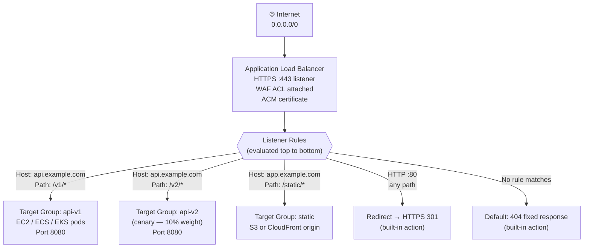
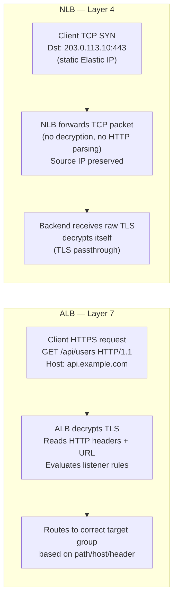
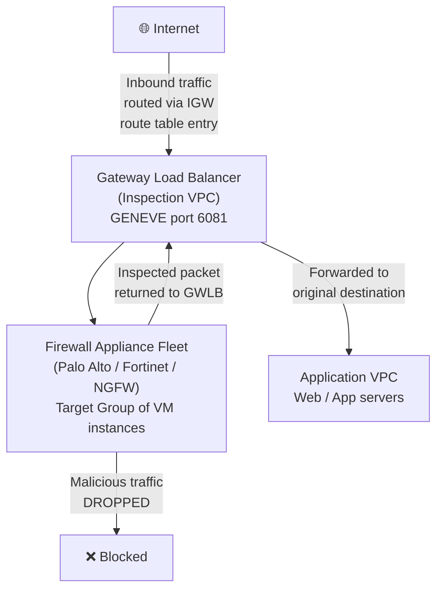
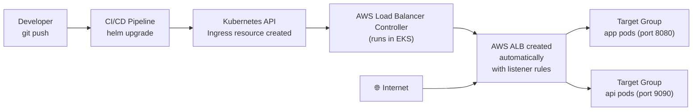

# AWS Question 10 — What Are the Load Balancers in AWS?

> **Section:** AWS &nbsp;|&nbsp; **Topic:** Networking / Load Balancing / High Availability &nbsp;|&nbsp; **Level:** Mid (2–5 yrs) &nbsp;|&nbsp; **Frequency:** Very High
>
> _Part of the DevOps & DevSecOps Interview Preparation series._

---

## ❓ The Question

> **"What are the different types of load balancers in AWS? Which one have you used, and what are the use cases for each?"**

Common follow-up questions:

- "What is the difference between an ALB and an NLB?"
- "When would you choose NLB over ALB?"
- "How does path-based routing work in an ALB?"
- "How do you attach a WAF to a load balancer?"
- "What is a target group and how is it used?"
- "How do you terminate TLS at the load balancer vs pass it through to the instance?"
- "What is the Gateway Load Balancer used for?"
- "How does the AWS Load Balancer Controller work in EKS?"

---

## 🎯 Why Interviewers Ask This

Load balancers are **core infrastructure** for every AWS application — they're how traffic enters your system. This question tests whether you:

- Know all four types and can **map them to the right OSI layer** (Layer 4 vs Layer 7 vs Layer 3).
- Understand **ALB's advanced routing** — path-based, host-based, header-based, weighted, redirect rules — which are the most commonly used features in real production.
- Can articulate the **NLB advantage** — millions of requests per second, static IPs, TCP/UDP passthrough, PrivateLink support — and know exactly when Layer 4 beats Layer 7.
- Have heard of **GWLB** and can explain the third-party appliance inspection use case, even if you haven't used it personally.
- Connect load balancers to **security** — WAF on ALB, TLS termination, access logs, security groups.
- Know the **EKS integration** — AWS Load Balancer Controller and how `Ingress` objects map to ALBs.

> **The golden rule for this question:** Pick one type you've actually used and go deep, then briefly describe the others with their key differentiators. Never just list names — always attach a use case to each.

---

## 📖 Key Terminologies

| Term | Plain-English meaning |
| --- | --- |
| **Load Balancer** | Distributes incoming network traffic across multiple backend targets (EC2 instances, containers, Lambda functions, IPs) to ensure no single target is overwhelmed. |
| **Listener** | A process on the load balancer that checks for incoming connection requests on a specified port and protocol (e.g., HTTPS on port 443). |
| **Listener Rule** | Logic that determines how traffic is routed — based on path, host header, query string, HTTP method, source IP, etc. |
| **Target Group** | A logical group of backend targets (EC2 instances, pods, Lambda, IPs) that the load balancer routes requests to. Health checks run against targets. |
| **Health Check** | Periodic test by the LB to determine if a target is healthy and should receive traffic. Unhealthy targets are removed from rotation. |
| **OSI Layer 4 (Transport)** | Works with TCP/UDP packets — sees source/destination IP and port only. NLB operates here. |
| **OSI Layer 7 (Application)** | Works with full HTTP/HTTPS requests — can inspect URLs, headers, cookies, body. ALB operates here. |
| **TLS Termination** | Decrypting HTTPS traffic at the load balancer. The LB forwards decrypted HTTP traffic to backends — simpler certificate management. |
| **TLS Passthrough** | Forwarding encrypted traffic all the way to the backend without decryption at the LB. Used in NLB TCP mode. |
| **Sticky Sessions** | Binding a user's requests to the same target for the session duration — via LB-generated or application-generated cookies. |
| **Path-based Routing** | ALB rule that routes `/api/*` to one target group and `/web/*` to another — based on the URL path. |
| **Host-based Routing** | ALB rule that routes `api.example.com` to one TG and `app.example.com` to another — based on the HTTP Host header. |
| **Weighted Routing** | Sending a percentage of traffic to different target groups — used for blue/green or canary deployments. |
| **AWS WAF** | Web Application Firewall — can be attached to ALB to filter malicious HTTP requests (SQL injection, XSS, rate limiting, IP blocking). |
| **Geneve Protocol** | UDP-based encapsulation protocol (port 6081) used by Gateway Load Balancer to transparently forward packets to virtual appliances. |
| **PrivateLink** | AWS service that allows NLB-backed services to be privately shared with other VPCs or AWS accounts without traversing the public internet. |

---

## 🗣️ How to Answer (Structured)

### Step 1 — Name all four, orient the interviewer

> "AWS has four types of load balancers: **Classic (CLB)** — legacy, deprecated since 2022; **Application (ALB)** — Layer 7, HTTP/HTTPS, advanced routing; **Network (NLB)** — Layer 4, ultra-high performance TCP/UDP; and **Gateway (GWLB)** — Layer 3, for routing traffic through third-party virtual appliances. The one I use daily is the ALB."

### Step 2 — Go deep on your primary (ALB for most engineers)

> "I use the **Application Load Balancer** as the primary entry point for all our web and API traffic. It operates at Layer 7 — meaning it can see the full HTTP request and make routing decisions based on the URL path, host header, query strings, or HTTP method. For example, `/api/*` routes to our backend service target group, and `/static/*` routes to a CloudFront origin or S3 target. I have HTTPS listeners with ACM certificates, and all HTTP traffic is redirected to HTTPS via a listener rule. The ALB integrates with AWS WAF for SQL injection and rate-limiting protection, and in our EKS clusters the **AWS Load Balancer Controller** automatically creates ALBs when we deploy a Kubernetes Ingress resource."

### Step 3 — NLB — know when Layer 4 wins

> "I'd choose a **Network Load Balancer** when I need extreme throughput or low latency that ALB can't match — things like streaming, gaming, financial trading, or any UDP workload. NLB operates at Layer 4 so it doesn't inspect the HTTP payload — just routes TCP/UDP packets. The key NLB features that come up in interviews: **static Elastic IPs** per AZ (useful when clients need to whitelist a fixed IP), **TLS passthrough** (encryption goes all the way to the backend — the LB never sees the plaintext), and **PrivateLink** support (NLB backs an endpoint service that other accounts can connect to privately)."

### Step 4 — GWLB — brief but accurate

> "The **Gateway Load Balancer** is the most specialised — it's used to route traffic through third-party virtual appliances like Palo Alto, Fortinet, or Check Point firewalls, IDS/IPS, or deep packet inspection tools. It uses the **Geneve protocol on port 6081** to encapsulate packets and forward them to the appliance transparently — the appliance inspects and then returns the traffic, which GWLB forwards to the original destination. It sits in a dedicated inspection VPC."

### Step 5 — Mention CLB cleanly

> "Classic Load Balancer was the original AWS load balancer using round-robin at Layer 4/7. AWS deprecated it in August 2022 — anyone still on CLB should migrate to ALB or NLB depending on their use case."

---

## 🔍 Deep Dive: The Four Load Balancer Types

### Type 1 — Classic Load Balancer (CLB) — Legacy, Deprecated

- **OSI Layer:** 4 and 7 (basic — no advanced routing)
- **Routing method:** Round-robin
- **Status:** ⚠️ **Deprecated since August 2022** — no new CLBs can be created; existing ones must be migrated
- **Migration path:** ALB for HTTP/HTTPS workloads, NLB for TCP/UDP workloads
- **Mention in interview:** "CLB is deprecated since 2022. I wouldn't use it in any new architecture and would migrate existing CLBs to ALB or NLB."

---

### Type 2 — Application Load Balancer (ALB) — The Workhorse

- **OSI Layer:** 7 (Application — full HTTP/HTTPS awareness)
- **Protocols:** HTTP, HTTPS, WebSocket, gRPC
- **Primary use cases:** Web apps, REST APIs, microservices, Kubernetes Ingress, multi-tenant SaaS

**ALB Listener Rules — the powerful routing engine:**

| Rule Condition | Example | Routes to |
| --- | --- | --- |
| **Path-based** | URL path starts with `/api/` | api-target-group |
| **Host-based** | Host header is `app.example.com` | app-target-group |
| **HTTP method** | Method is `GET` | read-target-group |
| **Query string** | `?version=v2` | v2-target-group |
| **HTTP header** | `X-Client-Type: mobile` | mobile-target-group |
| **Source IP** | CIDR `10.0.0.0/8` | internal-target-group |
| **Weighted** | 90% to v1, 10% to v2 | canary deployment |
| **Redirect** | HTTP → HTTPS 301 | (built-in action) |
| **Fixed response** | Return 503 during maintenance | (built-in action) |

**Key ALB features:**
- WAF integration (attach an AWS WAF ACL to the ALB listener)
- Lambda as a target (ALB can invoke a Lambda function directly)
- Sticky sessions (LB-generated or app-generated cookies)
- Connection draining — gracefully removes unhealthy targets
- Access logs to S3 — every request logged for audit/analysis
- ACM certificate management — free TLS, auto-renewed
- **gRPC and WebSocket support** (Layer 7 aware)

---

### Type 3 — Network Load Balancer (NLB) — High Performance Layer 4

- **OSI Layer:** 4 (Transport — TCP/UDP/TLS)
- **Protocols:** TCP, UDP, TLS, TCP_UDP
- **Primary use cases:** Real-time gaming, streaming, financial trading, DNS (UDP), IoT, PrivateLink endpoint services

**Key NLB differentiators vs ALB:**

| Feature | ALB | NLB |
| --- | --- | --- |
| **Latency** | ~400ms (L7 processing) | ~100μs (ultra-low latency) |
| **Throughput** | Millions req/sec | **Tens of millions** req/sec |
| **Static IP per AZ** | ❌ DNS only | ✅ Elastic IPs |
| **UDP support** | ❌ No | ✅ Yes |
| **TLS passthrough** | ❌ No (terminates) | ✅ TCP mode (no decryption) |
| **PrivateLink** | ❌ No | ✅ Yes |
| **Source IP preserved** | ❌ (X-Forwarded-For header) | ✅ Preserved at L4 |
| **WAF support** | ✅ Yes | ❌ No |
| **Path/host routing** | ✅ Yes | ❌ No (L4 only) |
| **Security groups** | ✅ Yes | ✅ Yes (added 2023) |

**When to choose NLB:**
- Need **static IP** for firewall whitelisting (NLB gets an Elastic IP per AZ)
- Need **UDP** (game servers, DNS, syslog, VoIP)
- Need **TLS passthrough** — end-to-end encryption without decrypting at LB
- Powering an **AWS PrivateLink** endpoint service
- Millions of short-lived TCP connections (microservices mesh, trading systems)

---

### Type 4 — Gateway Load Balancer (GWLB) — Third-Party Appliance Integration

- **OSI Layer:** 3 (Network — packet-level)
- **Protocol:** GENEVE on UDP port 6081
- **Primary use cases:** Transparent insertion of firewalls, IDS/IPS, deep packet inspection (DPI), network analytics appliances

**How GWLB works:**
1. Traffic is routed to the GWLB via VPC routing tables (instead of going directly to the internet or destination)
2. GWLB encapsulates packets in GENEVE and sends them to a fleet of virtual appliances (target group of firewall VMs)
3. The appliance inspects the packet, accepts or drops it
4. GWLB receives the packet back and forwards it to the original destination — **transparently** (the source doesn't know inspection happened)

**Key GWLB characteristic:** The appliance sees the original source/destination IPs (unlike a proxy). This makes it ideal for passive inspection and inline security without re-architecting applications.

**Common GWLB use cases:** Palo Alto VM-Series, Fortinet FortiGate, Check Point CloudGuard, AWS Network Firewall backed by GWLB in a centralised inspection VPC.

---

## 🔐 Security Perspective (DevSecOps)

Load balancers are not just traffic distributors — they're your **first line of application defence**:

- **ALB + AWS WAF = application-layer protection.** Attach a WAF ACL to an ALB listener to filter: SQL injection, cross-site scripting (XSS), HTTP flooding, bad bots, and IP blocklists. The WAF evaluates every HTTP request before it reaches any backend. Use AWS Managed Rule Groups (OWASP Top 10, AWS IP reputation, Bot Control) to get protection without writing custom rules.

- **TLS termination at the ALB — certificate hygiene.** Use **ACM (AWS Certificate Manager)** certificates — free, auto-renewed, no certificate expiry incidents. Set a **security policy** that enforces TLS 1.2+ and strong cipher suites (`ELBSecurityPolicy-TLS13-1-2-2021-06` is the current recommended policy). Disable TLS 1.0 and 1.1 on all listeners.

- **ALB access logs for audit and forensics.** Every request logged to S3 — source IP, timestamp, target response time, TLS cipher, User-Agent, URL. Enable these in production. Query with Athena for incident response: "show me all requests from this IP in the last 24 hours" or "show me all 5xx errors between 14:00 and 15:00."

- **Security groups on load balancers — not just on instances.** ALBs and NLBs (since 2023) have their own security groups. Restrict ALB inbound to `0.0.0.0/0` on 443 only (not all ports). Then restrict the EC2/pod security group to allow inbound only from the ALB's security group — never directly from the internet.

- **HTTP to HTTPS redirect — non-negotiable.** Add a listener rule on port 80: `redirect to HTTPS, 301 permanent`. Never serve production traffic over plain HTTP. This is a 2-click change in the console but a common miss in quick deployments.

- **GWLB + inspection VPC = zero-trust network perimeter.** All traffic (East-West inter-VPC and North-South internet) can be routed through a GWLB-backed inspection fleet before reaching any application. This implements network-level zero trust — assume all traffic must be inspected, even internal.

- **NLB and source IP preservation.** NLB preserves the client's source IP at Layer 4. Your backend sees the real client IP directly (not X-Forwarded-For). This matters for: geo-based rate limiting, IP-based ACLs in the application, and accurate access logging. With ALB, you must parse the `X-Forwarded-For` header.

- **Deletion protection.** Enable deletion protection on production load balancers. An accidental `aws elbv2 delete-load-balancer` with no protection is a major outage. One flag prevents it.

> **One-liner for the room:** *"ALB is my default for HTTP/HTTPS — WAF attached, ACM TLS, access logs to S3, HTTP-to-HTTPS redirect, and security groups scoped to the ALB SG on backends. NLB for anything TCP/UDP needing static IPs or ultra-low latency. GWLB for inline security appliance inspection. And CLB is deprecated — don't use it."*

---

## 🖼️ Visuals

### Source image — Four load balancer types overview


### Source image — Load balancer types comparison with handwritten annotations


### Mermaid — ALB path-based and host-based routing architecture



### Mermaid — NLB vs ALB: Layer 4 vs Layer 7 comparison



### Mermaid — GWLB inspection VPC pattern



### Mermaid — EKS Ingress → ALB via AWS Load Balancer Controller



---

## 📊 Quick Comparison — All Four Load Balancers

| | **CLB** | **ALB** | **NLB** | **GWLB** |
| --- | --- | --- | --- | --- |
| **OSI Layer** | 4 & 7 (basic) | **7** (Application) | **4** (Transport) | **3** (Network) |
| **Protocols** | HTTP, HTTPS, TCP | HTTP, HTTPS, WebSocket, gRPC | TCP, UDP, TLS | All IP protocols |
| **Status** | ⚠️ Deprecated 2022 | ✅ Current | ✅ Current | ✅ Current |
| **Routing logic** | Round-robin | Path, host, header, query, IP, weighted | IP + Port only | Transparent (GENEVE) |
| **TLS termination** | ✅ Yes | ✅ Yes (ACM) | ✅ Yes OR passthrough | N/A |
| **WAF support** | ❌ No | ✅ Yes | ❌ No | ❌ No |
| **Static IP** | ❌ No | ❌ No (DNS only) | ✅ Elastic IP per AZ | ✅ Yes |
| **UDP support** | ❌ No | ❌ No | ✅ Yes | ✅ Yes |
| **PrivateLink** | ❌ No | ❌ No | ✅ Yes | ❌ No |
| **Lambda target** | ❌ No | ✅ Yes | ❌ No | ❌ No |
| **Security group** | ✅ Yes | ✅ Yes | ✅ Yes (2023+) | ✅ Yes |
| **Access logs** | ✅ S3 | ✅ S3 | ✅ S3 | ✅ S3 |
| **EKS Ingress** | ❌ No | ✅ LBC Ingress | ✅ LBC Service | ❌ No |
| **Best for** | Legacy only | Web apps, APIs, microservices | High-perf TCP/UDP, PrivateLink | Inline security appliances |

---

## 🛠️ Hands-On: Commands & Syntax

### 1) Create an ALB with HTTPS listener, path-based routing, and HTTP redirect

```bash
# Create the ALB
ALB_ARN=$(aws elbv2 create-load-balancer \
  --name prod-alb \
  --type application \
  --scheme internet-facing \
  --subnets subnet-pub-a subnet-pub-b subnet-pub-c \
  --security-groups sg-alb \
  --query 'LoadBalancers[0].LoadBalancerArn' --output text)

echo "ALB ARN: $ALB_ARN"

# Create target groups (one per service)
API_TG_ARN=$(aws elbv2 create-target-group \
  --name api-tg \
  --protocol HTTP \
  --port 8080 \
  --vpc-id vpc-0abc123 \
  --health-check-path /health \
  --health-check-interval-seconds 30 \
  --healthy-threshold-count 2 \
  --unhealthy-threshold-count 3 \
  --target-type ip \           # Use 'ip' for ECS/EKS pods
  --query 'TargetGroups[0].TargetGroupArn' --output text)

WEB_TG_ARN=$(aws elbv2 create-target-group \
  --name web-tg \
  --protocol HTTP \
  --port 3000 \
  --vpc-id vpc-0abc123 \
  --health-check-path / \
  --target-type instance \     # Use 'instance' for EC2
  --query 'TargetGroups[0].TargetGroupArn' --output text)

# Create HTTPS listener (port 443)
HTTPS_LISTENER_ARN=$(aws elbv2 create-listener \
  --load-balancer-arn $ALB_ARN \
  --protocol HTTPS \
  --port 443 \
  --ssl-policy ELBSecurityPolicy-TLS13-1-2-2021-06 \   # Enforce TLS 1.2+
  --certificates CertificateArn=arn:aws:acm:us-east-1:111122223333:certificate/abc \
  --default-actions Type=forward,TargetGroupArn=$WEB_TG_ARN \
  --query 'Listeners[0].ListenerArn' --output text)

# Add path-based routing rule: /api/* → api-tg (higher priority = lower number)
aws elbv2 create-rule \
  --listener-arn $HTTPS_LISTENER_ARN \
  --priority 10 \
  --conditions '[{"Field":"path-pattern","Values":["/api/*"]}]' \
  --actions "Type=forward,TargetGroupArn=$API_TG_ARN"

# Add HTTP → HTTPS redirect listener (port 80)
aws elbv2 create-listener \
  --load-balancer-arn $ALB_ARN \
  --protocol HTTP \
  --port 80 \
  --default-actions \
    'Type=redirect,RedirectConfig={Protocol=HTTPS,Port=443,StatusCode=HTTP_301}'

# Enable deletion protection (prevent accidental deletion)
aws elbv2 modify-load-balancer-attributes \
  --load-balancer-arn $ALB_ARN \
  --attributes Key=deletion_protection.enabled,Value=true \
               Key=access_logs.s3.enabled,Value=true \
               Key=access_logs.s3.bucket,Value=my-alb-access-logs \
               Key=access_logs.s3.prefix,Value=prod-alb
```

### 2) Create an NLB with static Elastic IP (for firewall whitelisting)

```bash
# Allocate Elastic IPs (one per AZ)
EIP_A=$(aws ec2 allocate-address --domain vpc --query AllocationId --output text)
EIP_B=$(aws ec2 allocate-address --domain vpc --query AllocationId --output text)
EIP_C=$(aws ec2 allocate-address --domain vpc --query AllocationId --output text)

# Create NLB with static IPs
NLB_ARN=$(aws elbv2 create-load-balancer \
  --name prod-nlb \
  --type network \
  --scheme internet-facing \
  --subnet-mappings \
    SubnetId=subnet-pub-a,AllocationId=$EIP_A \
    SubnetId=subnet-pub-b,AllocationId=$EIP_B \
    SubnetId=subnet-pub-c,AllocationId=$EIP_C \
  --query 'LoadBalancers[0].LoadBalancerArn' --output text)

# Create TCP target group
NLB_TG=$(aws elbv2 create-target-group \
  --name nlb-tcp-tg \
  --protocol TCP \
  --port 443 \
  --vpc-id vpc-0abc123 \
  --health-check-protocol TCP \
  --target-type instance \
  --query 'TargetGroups[0].TargetGroupArn' --output text)

# Create TLS listener (passthrough — backend handles decryption)
aws elbv2 create-listener \
  --load-balancer-arn $NLB_ARN \
  --protocol TCP \     # TCP = passthrough (backend decrypts)
  --port 443 \
  --default-actions Type=forward,TargetGroupArn=$NLB_TG

# Check the static IPs assigned to the NLB
aws elbv2 describe-load-balancers \
  --load-balancer-arns $NLB_ARN \
  --query 'LoadBalancers[0].AvailabilityZones[*].{AZ:ZoneName,IP:LoadBalancerAddresses[0].IpAddress}' \
  --output table
```

### 3) Attach AWS WAF to an ALB

```bash
# Create a WAF Web ACL with AWS managed rules
WEB_ACL_ARN=$(aws wafv2 create-web-acl \
  --name prod-alb-waf \
  --scope REGIONAL \
  --default-action Allow={} \
  --rules '[
    {
      "Name": "AWSManagedRulesCommonRuleSet",
      "Priority": 1,
      "OverrideAction": {"None": {}},
      "Statement": {
        "ManagedRuleGroupStatement": {
          "VendorName": "AWS",
          "Name": "AWSManagedRulesCommonRuleSet"
        }
      },
      "VisibilityConfig": {
        "SampledRequestsEnabled": true,
        "CloudWatchMetricsEnabled": true,
        "MetricName": "CommonRuleSet"
      }
    },
    {
      "Name": "AWSManagedRulesAmazonIpReputationList",
      "Priority": 2,
      "OverrideAction": {"None": {}},
      "Statement": {
        "ManagedRuleGroupStatement": {
          "VendorName": "AWS",
          "Name": "AWSManagedRulesAmazonIpReputationList"
        }
      },
      "VisibilityConfig": {
        "SampledRequestsEnabled": true,
        "CloudWatchMetricsEnabled": true,
        "MetricName": "IPReputationList"
      }
    }
  ]' \
  --visibility-config SampledRequestsEnabled=true,CloudWatchMetricsEnabled=true,MetricName=prod-alb-waf \
  --region us-east-1 \
  --query 'Summary.ARN' --output text)

# Associate WAF with the ALB
aws wafv2 associate-web-acl \
  --web-acl-arn $WEB_ACL_ARN \
  --resource-arn $ALB_ARN \
  --region us-east-1
```

### 4) Kubernetes Ingress → ALB (AWS Load Balancer Controller)

```yaml
# Install AWS Load Balancer Controller (via Helm)
# helm install aws-load-balancer-controller eks/aws-load-balancer-controller \
#   -n kube-system --set clusterName=prod-cluster

# Kubernetes Ingress that auto-creates an ALB with WAF and HTTPS
apiVersion: networking.k8s.io/v1
kind: Ingress
metadata:
  name: app-ingress
  namespace: production
  annotations:
    kubernetes.io/ingress.class: alb
    alb.ingress.kubernetes.io/scheme: internet-facing
    alb.ingress.kubernetes.io/target-type: ip             # Route to pod IPs directly
    alb.ingress.kubernetes.io/listen-ports: '[{"HTTPS":443},{"HTTP":80}]'
    alb.ingress.kubernetes.io/ssl-redirect: "443"         # HTTP → HTTPS redirect
    alb.ingress.kubernetes.io/certificate-arn: arn:aws:acm:us-east-1:111:certificate/abc
    alb.ingress.kubernetes.io/wafv2-acl-arn: arn:aws:wafv2:us-east-1:111:regional/webacl/prod-waf/xyz
    alb.ingress.kubernetes.io/ssl-policy: ELBSecurityPolicy-TLS13-1-2-2021-06
    alb.ingress.kubernetes.io/load-balancer-attributes: deletion_protection.enabled=true,access_logs.s3.enabled=true,access_logs.s3.bucket=my-logs
spec:
  rules:
    - host: api.example.com
      http:
        paths:
          - path: /v1
            pathType: Prefix
            backend:
              service:
                name: api-v1-service
                port:
                  number: 8080
          - path: /v2
            pathType: Prefix
            backend:
              service:
                name: api-v2-service
                port:
                  number: 8080
    - host: app.example.com
      http:
        paths:
          - path: /
            pathType: Prefix
            backend:
              service:
                name: web-service
                port:
                  number: 3000
```

### 5) Terraform — ALB with HTTPS, WAF, access logs (production pattern)

```hcl
# Application Load Balancer
resource "aws_lb" "prod" {
  name               = "prod-alb"
  internal           = false
  load_balancer_type = "application"
  security_groups    = [aws_security_group.alb.id]
  subnets            = module.vpc.public_subnets

  enable_deletion_protection = true   # Prevent accidental deletion

  access_logs {
    bucket  = aws_s3_bucket.alb_logs.id
    prefix  = "prod-alb"
    enabled = true
  }

  tags = { Name = "prod-alb", Env = "production" }
}

# HTTPS Listener — TLS 1.2+ only
resource "aws_lb_listener" "https" {
  load_balancer_arn = aws_lb.prod.arn
  port              = 443
  protocol          = "HTTPS"
  ssl_policy        = "ELBSecurityPolicy-TLS13-1-2-2021-06"
  certificate_arn   = aws_acm_certificate.app.arn

  default_action {
    type             = "forward"
    target_group_arn = aws_lb_target_group.web.arn
  }
}

# HTTP → HTTPS redirect
resource "aws_lb_listener" "http_redirect" {
  load_balancer_arn = aws_lb.prod.arn
  port              = 80
  protocol          = "HTTP"

  default_action {
    type = "redirect"
    redirect {
      port        = "443"
      protocol    = "HTTPS"
      status_code = "HTTP_301"
    }
  }
}

# Path-based routing: /api/* → api target group (priority 10)
resource "aws_lb_listener_rule" "api" {
  listener_arn = aws_lb_listener.https.arn
  priority     = 10

  action {
    type             = "forward"
    target_group_arn = aws_lb_target_group.api.arn
  }

  condition {
    path_pattern { values = ["/api/*"] }
  }
}

# Target group for API service
resource "aws_lb_target_group" "api" {
  name        = "api-tg"
  port        = 8080
  protocol    = "HTTP"
  vpc_id      = module.vpc.vpc_id
  target_type = "ip"   # For ECS/EKS pods

  health_check {
    enabled             = true
    path                = "/health"
    healthy_threshold   = 2
    unhealthy_threshold = 3
    interval            = 30
    timeout             = 5
  }
}

# Attach WAF to the ALB
resource "aws_wafv2_web_acl_association" "alb" {
  resource_arn = aws_lb.prod.arn
  web_acl_arn  = aws_wafv2_web_acl.prod.arn
}
```

---

## 🤖 AI & The New Trend (2024–2025) — what changed, and what to learn

> Load balancing in 2024–2025 is evolving from simple traffic distribution to **intelligent, AI-aware traffic management** — with ML-driven anomaly detection, automated security, and AI workload-specific patterns.

### How AI is impacting load balancing on AWS

- **AWS WAF + Bot Control with ML (2024)** — AWS WAF's Bot Control now uses ML to distinguish legitimate bots (Googlebot, monitoring) from malicious ones (scrapers, credential stuffing). It applies ML-based browser fingerprinting to detect headless browsers and automation tools that bypass traditional CAPTCHA. This sits on your ALB and requires zero custom rule writing.

- **ALB Anomaly Detection + Shield Advanced** — AWS Shield Advanced uses ML to baseline your ALB traffic patterns and auto-detect volumetric DDoS attacks (SYN floods, HTTP floods). When detected, it automatically deploys mitigations — rate limiting, IP blocking — without any manual intervention. The ALB is the natural integration point.

- **ALB for AI inference APIs** — AI inference endpoints (Bedrock, SageMaker) are being fronted by ALBs with weighted routing for model A/B testing. Route 90% traffic to stable model v1, 10% to new model v2 — evaluate quality metrics, then shift. This is "model canary deployment" via ALB weighted target groups.

- **NLB + PrivateLink for AI service mesh** — As teams build internal AI services (embeddings APIs, inference microservices), NLB + PrivateLink provides private, cross-account access with static IPs. Teams consume AI services from other accounts/VPCs without any public exposure.

- **AWS Graviton + NLB cost optimisation** — For high-throughput ML inference servers (llama.cpp, vLLM) on Graviton3 instances, NLB provides the ultra-low latency and high connection rate needed with lower cost vs ALB at the packet level.

- **EKS Gateway API (2024)** — Kubernetes is standardising on the **Gateway API** (replacing Ingress) — AWS Load Balancer Controller now supports `GatewayClass` and `HTTPRoute` resources, enabling more expressive ALB routing rules natively in K8s. Expect this to become the Ingress standard in 2025.

### How AI can contribute to your day-to-day

- **Generate listener rules from requirements** — "Write an ALB listener rule that routes requests with header `X-API-Version: v2` to target group `api-v2-tg` and all others to `api-v1-tg`." Validate in the console then apply via Terraform.
- **Diagnose access log anomalies** — Feed ALB access logs to Amazon Q and ask "which paths are returning the most 5xx errors in the last hour?" or "which IPs have the highest request rate?"
- **WAF rule generation** — Describe your attack pattern to an LLM and get a WAF custom rule JSON to block it.
- **Cost optimisation** — "We have an NLB and an ALB for the same service — can we consolidate, and what would we lose?"

### ⚠️ Security caveat (DevSecOps)

- **AI-generated ALB configs often omit WAF, deletion protection, and TLS policy.** Explicitly specify all three in every production ALB.
- **Never use `ELBSecurityPolicy-2016-08`** (still in some AI-generated examples). It allows TLS 1.0 — use `ELBSecurityPolicy-TLS13-1-2-2021-06`.
- **NLB security groups were not supported until 2023** — older AI training data may suggest NLBs don't support SGs. They do now — always add one.

### What to learn right now (priority order)

1. **ALB: listener rules** (path, host, header, weighted, redirect) — the most frequently tested ALB feature in depth.
2. **ALB + WAF** — managed rule groups, Bot Control, rate limiting — table stakes for production security.
3. **ALB + AWS Load Balancer Controller in EKS** — Ingress → ALB mapping is standard in every EKS role.
4. **NLB differentiators** — static IP, UDP, TLS passthrough, PrivateLink — know exactly when NLB beats ALB.
5. **TLS policy selection** — enforcing TLS 1.2+, ACM certificate lifecycle.
6. **GWLB pattern** — centralized inspection VPC with GWLB — increasingly asked in security-focused roles.

---

## ✅ Prerequisites (be solid on these first)

- **OSI model basics** — what Layer 4 (Transport) vs Layer 7 (Application) means; why it matters for routing decisions.
- **AWS VPC and subnets** — load balancers live in subnets; internet-facing vs internal scheme; public vs private subnet placement.
- **EC2 and Auto Scaling Groups** — target groups register EC2 instances or ASG members.
- **DNS basics** — ALBs get DNS names (not IPs); NLBs can get Elastic IPs; how Route 53 aliases point to LB DNS names.
- **TLS/HTTPS fundamentals** — certificates, termination, cipher suites.
- **(Bonus) AWS WAF** — rule groups, managed rules, rate limiting, Bot Control.
- **(Bonus) EKS AWS Load Balancer Controller** — how Ingress → ALB and Service → NLB work in Kubernetes.

---

## 📚 Further Reading (current docs)

- **AWS Elastic Load Balancing overview** — AWS docs: <https://docs.aws.amazon.com/elasticloadbalancing/latest/userguide/what-is-load-balancing.html>
- **Application Load Balancer** — AWS docs: <https://docs.aws.amazon.com/elasticloadbalancing/latest/application/introduction.html>
- **ALB listener rules** — AWS docs: <https://docs.aws.amazon.com/elasticloadbalancing/latest/application/listener-update-rules.html>
- **Network Load Balancer** — AWS docs: <https://docs.aws.amazon.com/elasticloadbalancing/latest/network/introduction.html>
- **Gateway Load Balancer** — AWS docs: <https://docs.aws.amazon.com/elasticloadbalancing/latest/gateway/introduction.html>
- **AWS WAF** — AWS docs: <https://docs.aws.amazon.com/waf/latest/developerguide/waf-chapter.html>
- **WAF Bot Control (ML)** — AWS docs: <https://docs.aws.amazon.com/waf/latest/developerguide/aws-managed-rule-groups-bot.html>
- **AWS Load Balancer Controller (EKS)** — <https://kubernetes-sigs.github.io/aws-load-balancer-controller/>
- **TLS security policies for ALB** — AWS docs: <https://docs.aws.amazon.com/elasticloadbalancing/latest/application/create-https-listener.html#describe-ssl-policies>
- **PrivateLink with NLB** — AWS docs: <https://docs.aws.amazon.com/vpc/latest/privatelink/create-endpoint-service.html>
- **Terraform aws_lb** — <https://registry.terraform.io/providers/hashicorp/aws/latest/docs/resources/lb>
- **KodeKloud lesson (video):** <https://learn.kodekloud.com/user/courses/devops-interview-preparation-course/module/f1169a2e-23de-4377-bc4f-a07c136a11d6/lesson/412b17c4-8182-4224-a018-460bb4296c58>

---

## 🔁 Related / Follow-up Questions (they often go here next)

1. **What is the difference between ALB and NLB?** → ALB = Layer 7 (sees HTTP headers, URL, cookies — enables path/host/header routing, WAF, Lambda targets); NLB = Layer 4 (sees TCP/UDP ports only — no HTTP awareness, but ultra-low latency, static IPs, UDP support, TLS passthrough, PrivateLink). Choose ALB for HTTP/HTTPS web apps; NLB for TCP/UDP, gaming, streaming, PrivateLink.
2. **What is a target group?** → A logical grouping of backend targets (EC2 instances, ECS tasks, EKS pods, Lambda functions, or IP addresses) that the LB routes requests to. Each target group has its own health check, protocol, and port. An ALB listener rule forwards to a specific target group. Multiple rules can forward to the same or different target groups.
3. **How does weighted routing work in ALB?** → A listener rule `forward` action can split traffic across multiple target groups by percentage weight. e.g., 90% → v1-tg, 10% → v2-tg. Used for canary releases and blue/green deployments. When the new version is stable, shift to 100% → v2-tg.
4. **What is sticky sessions and when would you use it?** → Sticky sessions bind a specific user's requests to the same backend target for the session duration — via a cookie (LB-generated `AWSALB` or app-defined cookie). Use it when the application stores session state locally on the instance (legacy stateful apps). For stateless apps (preferred), sticky sessions are not needed.
5. **How do you redirect HTTP to HTTPS on an ALB?** → Add a listener on port 80 with a `redirect` default action: `Protocol=HTTPS, Port=443, StatusCode=HTTP_301`. This is a built-in ALB action — no backend code change needed.
6. **What is connection draining / deregistration delay?** → When a target is removed from a target group (scale-in, deployment), the LB stops sending NEW requests to it but waits for in-flight requests to complete before fully removing it. Default: 300 seconds. Set lower (30–60s) for fast-cycling containers.
7. **Can ALB route to Lambda functions?** → Yes — Lambda functions can be a target group type. ALB invokes the Lambda synchronously with the HTTP request as the event payload. The Lambda returns an HTTP response. Useful for serverless API backends or lightweight functions behind the same ALB as EC2 targets.
8. **What is the Gateway Load Balancer used for?** → GWLB routes traffic through third-party virtual network appliances (firewalls, IDS/IPS, DPI tools) transparently using the GENEVE protocol. The appliance inspects the packet and returns it; GWLB forwards the inspected (or dropped) packet to its original destination. Used for centralised network security in multi-VPC architectures.
9. **How does NLB support PrivateLink?** → An NLB backing a VPC Endpoint Service allows other VPCs (even in different accounts) to create an interface endpoint that connects privately to the NLB's service. Traffic never leaves the AWS network, no VPC peering needed, no overlapping CIDR concerns. This is how AWS services and marketplace SaaS providers offer private connectivity.
10. **What ALB TLS security policy should you use?** → `ELBSecurityPolicy-TLS13-1-2-2021-06` — enforces TLS 1.2 minimum and supports TLS 1.3. Never use `ELBSecurityPolicy-2016-08` (allows TLS 1.0). The specific policy name comes up in security audits and compliance checks (PCI-DSS, SOC 2).
11. **How do you migrate from CLB to ALB?** → (1) Create new ALB with same subnets and security groups. (2) Create target groups matching the CLB's instance list. (3) Create HTTPS listener with ACM cert (if not already on CLB). (4) Add listener rules matching your current routing. (5) Test with a small % of traffic via Route 53 weighted records. (6) Flip Route 53 to ALB DNS. (7) Delete CLB.
12. **How do you monitor ALB performance and health?** → CloudWatch metrics: `RequestCount`, `TargetResponseTime`, `HTTPCode_ELB_5XX_Count`, `UnHealthyHostCount`, `ActiveConnectionCount`. Enable access logs to S3 for per-request details. Set CloudWatch alarms on `UnHealthyHostCount > 0` and `HTTPCode_ELB_5XX_Count > threshold`. Use Athena to query access logs for detailed analysis.

---

> 📌 **30-second interview summary:** AWS has four load balancers. **CLB** is deprecated since 2022 — don't use it. **ALB** (Application Load Balancer) operates at Layer 7 — it inspects HTTP requests and routes based on path, host header, query strings, and more; integrates with WAF and ACM; my go-to for all web and API workloads. **NLB** (Network Load Balancer) operates at Layer 4 — extreme throughput, ultra-low latency, static Elastic IPs per AZ, UDP support, TLS passthrough, and PrivateLink backing; use it for high-performance TCP/UDP and cross-account private services. **GWLB** (Gateway Load Balancer) operates at Layer 3 — transparently routes packets through third-party virtual appliances (firewalls, IDS/IPS) using GENEVE on port 6081; used for centralised inline security inspection. In EKS, the AWS Load Balancer Controller automatically creates ALBs for Ingress resources and NLBs for LoadBalancer-type Services.
