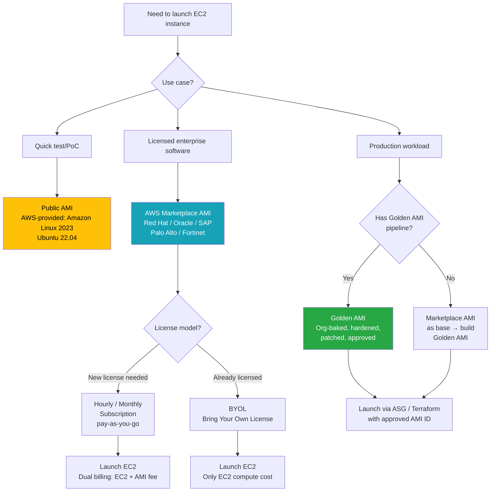
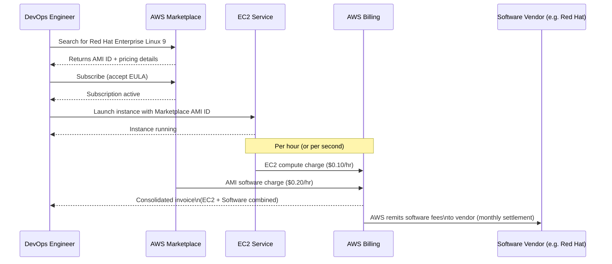
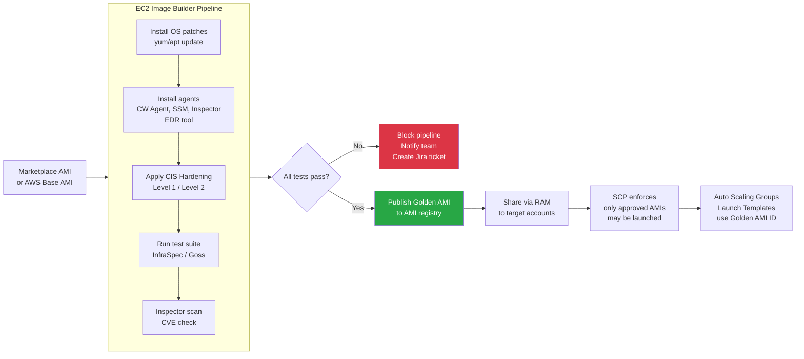
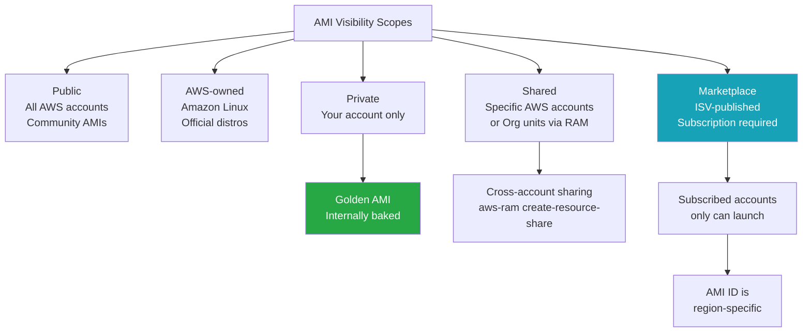

# Q11. What is a Marketplace AMI and How Does AWS Marketplace Work?

---

## Question Variations

- "What is an AWS Marketplace AMI?"
- "How does billing work when you launch an EC2 instance from AWS Marketplace?"
- "What is the difference between a public AMI, a Marketplace AMI, and a private AMI?"
- "When would you use a Marketplace AMI instead of building your own?"
- "What is the Golden AMI strategy and how does it relate to Marketplace AMIs?"
- "How do you audit or secure EC2 instances launched from Marketplace AMIs?"
- "Explain BYOL vs. hourly billing in AWS Marketplace."
- "How do you use Terraform to launch an instance from a Marketplace AMI?"

---

## Why Interviewers Ask This

Interviewers ask this to gauge your practical awareness of how EC2 image sourcing works at the enterprise level. Beyond knowing that you can spin up a VM, they want to know:

- Do you understand the **three AMI types** and when each is appropriate?
- Are you aware of the **dual billing model** and how it affects cost planning?
- Do you know the security risks of using unverified AMIs and how to mitigate them?
- Are you familiar with the **Golden AMI pipeline** — the industry standard for hardened, internally-baked AMIs?
- For DevSecOps roles specifically: have you used **Amazon Inspector** or **EC2 Image Builder** for AMI vulnerability management?

This question often leads into follow-ups about compliance, CIS hardening, patch management, and supply chain security.

---

## Key Terminologies

| Term | Definition |
|---|---|
| **AMI (Amazon Machine Image)** | Pre-configured template containing OS, software, and configuration used to launch EC2 instances |
| **AWS Marketplace** | Curated digital catalog for discovering, procuring, and deploying third-party software on AWS |
| **Marketplace AMI** | AMI listed on AWS Marketplace by a third-party vendor (e.g., Red Hat, Palo Alto Networks) |
| **Public AMI** | Shared AMIs accessible to all AWS accounts — free, but unverified by default |
| **Private AMI** | AMI owned by your AWS account or shared with specific accounts only |
| **Golden AMI** | Organisation's own hardened, patched, compliance-approved base AMI — the enterprise standard |
| **BYOL** | Bring Your Own License — use your existing software license (e.g., Windows, Oracle) on AWS |
| **Hourly Billing** | Software cost billed per hour of instance runtime, consolidated into AWS bill |
| **Annual / Monthly Subscription** | Fixed-fee Marketplace pricing for predictable workloads |
| **EC2 Image Builder** | AWS-managed service to automate building, testing, and distributing hardened AMIs |
| **Amazon Inspector** | Automated vulnerability scanning for EC2 instances and container images |
| **CIS Hardened AMI** | AMI benchmarked against Center for Internet Security (CIS) controls — available in Marketplace |
| **AWS License Manager** | Tracks and manages software licenses across AWS and on-premises environments |
| **AMI deprecation** | AWS feature (2022+) to mark AMIs as deprecated, preventing new launches without explicit override |

---

## Structured Answer Approach (Interview Delivery)

### 1. Start with the Big Picture — Three AMI Types

```
"When launching EC2 instances, there are three sources for AMIs:

  1. Public AMIs  — free, community-contributed, unverified
  2. Marketplace AMIs — third-party, commercially licensed, reviewed by AWS
  3. Private AMIs — your own organisation's baked and hardened images (Golden AMIs)

In production, we almost never use raw public AMIs. We use either
Marketplace AMIs as a starting point or our own Golden AMIs."
```

### 2. Explain What AWS Marketplace Is

AWS Marketplace is a **curated digital catalog** where software vendors list their products as:
- **AMIs** (for EC2)
- **Container images** (for ECS / EKS)
- **SaaS subscriptions**
- **CloudFormation templates**
- **Kubernetes add-ons** (Helm Charts via EKS add-on marketplace, 2023+)

Vendors undergo an AWS review process before listing, which provides a baseline of trust compared to random public AMIs.

**Common categories in Marketplace:**
- Operating Systems: Red Hat Enterprise Linux, Ubuntu Pro, SUSE Linux, Windows Server
- Security appliances: Palo Alto VM-Series, Fortinet FortiGate, Check Point CloudGuard
- Database engines: Oracle Database, SAP HANA, IBM Db2
- Monitoring/SIEM: Splunk, Sumo Logic, Dynatrace
- DevOps tools: HashiCorp Vault AMI, Jenkins, GitLab

### 3. Explain the Dual Billing Model

```
"When you launch an EC2 instance from a Marketplace AMI, you pay TWO charges
on your AWS bill:

  ┌─────────────────────────────────────────────────┐
  │  Component         │  Billed By   │  Example     │
  │──────────────────  │──────────────│──────────────│
  │  EC2 Compute       │  AWS         │  $0.10/hr    │
  │  Software/AMI fee  │  ISV vendor  │  $0.20/hr    │
  │──────────────────  │──────────────│──────────────│
  │  TOTAL on AWS bill │              │  $0.30/hr    │
  └─────────────────────────────────────────────────┘

Both charges appear consolidated on the AWS bill — no separate invoice
from the vendor. AWS handles payment collection on behalf of the ISV."
```

**Billing models available:**
- **Hourly** — pay as you go (most flexible, highest per-unit cost)
- **Monthly subscription** — fixed monthly fee regardless of instance count
- **Annual contract** — committed usage for the year, typically 20-40% cheaper
- **BYOL** — you already have the license; you only pay EC2 compute costs
- **Free** — open-source software packaged as AMIs (e.g., community editions)

### 4. Describe the Typical Workflow

```
Developer/DevOps workflow with Marketplace AMI:

1. Browse AWS Marketplace → search for product (e.g., "Red Hat 9")
2. Select pricing model → Subscribe (soft subscription gate)
3. Launch via EC2 Console or Terraform using the AMI ID
4. First launch → auto-accept EULA (End User License Agreement)
5. Instance runs → billing starts automatically

For Terraform:
- Use `aws_ami` data source to dynamically resolve the AMI ID
- OR hardcode the AMI ID per region (Marketplace AMIs are region-specific)
```

### 5. Introduce the Golden AMI Strategy (Enterprise Standard)

```
"In most mature organisations, we don't launch Marketplace AMIs directly
in production. Instead, we follow the Golden AMI strategy:

  Marketplace AMI (base)
        ↓
  EC2 Image Builder pipeline
        ↓
  Apply CIS hardening + org patches + agents (CW, SSM, Inspector)
        ↓
  Run AMI validation tests (Inspector, custom test suite)
        ↓
  Publish to private AMI registry (AWS accounts via RAM)
        ↓
  Launch Statement: all EC2 must use approved AMI IDs (SCP enforcement)"
```

This ensures every instance launched is:
- Patched to the latest CVEs at the time of bake
- Pre-installed with required agents (CloudWatch, SSM, Inspector, EDR)
- CIS Level 1/2 hardened
- Approved for compliance (PCI-DSS, SOC 2, HIPAA)

---

## Visual Reference


*AWS Marketplace acts as a bridge between software vendors (ISVs) and AWS customers — compute costs go to AWS, software costs go to the ISV, both consolidated on one bill.*

---

## Mermaid Diagrams

### Diagram 1 — AMI Types and Selection Decision Tree



### Diagram 2 — AWS Marketplace Billing Flow



### Diagram 3 — Golden AMI Pipeline (Enterprise Standard)



### Diagram 4 — AMI Scope and Sharing Model



---

## Security Perspective (DevSecOps)

### Risk 1 — Unverified Public AMIs (Supply Chain Risk)

**Never** use a random public AMI in production. Public AMIs:
- Can contain pre-installed malware or backdoors
- May have outdated kernels with known CVEs
- Have no SLA or vendor accountability

**Control:** Enforce via SCP — allow only approved AMI IDs or AMIs from specific owners:

```json
{
  "Version": "2012-10-17",
  "Statement": [
    {
      "Sid": "DenyUnauthorizedAMIs",
      "Effect": "Deny",
      "Action": "ec2:RunInstances",
      "Resource": "arn:aws:ec2:*:*:instance/*",
      "Condition": {
        "StringNotEquals": {
          "ec2:ImageID": [
            "ami-0123456789abcdef0",
            "ami-0fedcba9876543210"
          ]
        }
      }
    }
  ]
}
```

### Risk 2 — Stale AMIs (Patch Drift)

Even a golden AMI baked 3 months ago accumulates CVEs. **Best practice:**
- Rebuild golden AMIs **weekly** (or on every critical CVE patch release)
- Use **AMI deprecation** to mark old AMIs — instances still run but new launches are blocked
- Trigger golden AMI pipeline automatically via **AWS Security Hub findings** or **Inspector** detections

### Risk 3 — Marketplace AMI Trust

Marketplace AMIs are reviewed by AWS but not continuously audited post-listing. Controls:
- Run **Amazon Inspector** on first launch to validate the AMI
- Use **AWS Config rule: `approved-amis-by-id`** to flag non-compliant instances
- Enable **GuardDuty** on all instances regardless of AMI source

### Risk 4 — License Compliance

Using Marketplace AMIs without proper subscriptions (e.g., copy/sharing across accounts) violates license terms. Use **AWS License Manager** to:
- Track BYOL licenses per instance type/family
- Set hard limits on license consumption
- Alert when approaching license caps

### AWS Config Rules for AMI Governance

```bash
# Ensure EC2 instances use approved AMIs
aws configservice put-config-rule \
  --config-rule '{
    "ConfigRuleName": "approved-amis-by-id",
    "Source": {
      "Owner": "AWS",
      "SourceIdentifier": "APPROVED_AMIS_BY_ID"
    },
    "InputParameters": "{\"amiIds\":\"ami-0123456789abcdef0,ami-0fedcba9876543210\"}"
  }'

# Ensure no public AMIs are shared from your account
aws configservice put-config-rule \
  --config-rule '{
    "ConfigRuleName": "no-public-ami",
    "Source": {
      "Owner": "AWS",
      "SourceIdentifier": "NO_PUBLIC_AMI"
    }
  }'
```

---

## Hands-On Commands and Syntax

### Search and Describe Marketplace AMIs via CLI

```bash
# Search for Red Hat AMIs owned by AWS Marketplace (owner: aws-marketplace)
aws ec2 describe-images \
  --owners aws-marketplace \
  --filters \
    "Name=name,Values=RHEL-9*" \
    "Name=architecture,Values=x86_64" \
    "Name=state,Values=available" \
  --query 'Images | sort_by(@, &CreationDate) | [-1].{ID:ImageId,Name:Name,Date:CreationDate}' \
  --output table

# Get details of a specific AMI
aws ec2 describe-images \
  --image-ids ami-0abcdef1234567890 \
  --query 'Images[0].{Name:Name,State:State,Owner:OwnerId,Platform:Platform,CreationDate:CreationDate}'

# List AMIs owned by your account (your golden AMIs)
aws ec2 describe-images \
  --owners self \
  --filters "Name=state,Values=available" \
  --query 'sort_by(Images, &CreationDate)[*].{ID:ImageId,Name:Name,Date:CreationDate}' \
  --output table

# Find the latest Amazon Linux 2023 AMI (AWS-owned)
aws ec2 describe-images \
  --owners amazon \
  --filters \
    "Name=name,Values=al2023-ami-2023*" \
    "Name=architecture,Values=x86_64" \
    "Name=virtualization-type,Values=hvm" \
  --query 'Images | sort_by(@, &CreationDate) | [-1].ImageId' \
  --output text
```

### Launch an Instance from a Marketplace AMI

```bash
# Launch EC2 from Marketplace AMI (must be subscribed first)
aws ec2 run-instances \
  --image-id ami-0RedHatMarketplaceAMI \
  --instance-type t3.medium \
  --key-name my-key-pair \
  --subnet-id subnet-12345678 \
  --security-group-ids sg-12345678 \
  --iam-instance-profile Name=SSMInstanceProfile \
  --tag-specifications 'ResourceType=instance,Tags=[{Key=Name,Value=rhel9-test},{Key=AMISource,Value=marketplace}]' \
  --metadata-options "HttpTokens=required,HttpEndpoint=enabled" \
  --block-device-mappings '[{
    "DeviceName":"/dev/sda1",
    "Ebs":{"VolumeSize":30,"VolumeType":"gp3","Encrypted":true}
  }]'
```

### AMI Deprecation Management

```bash
# Deprecate old AMI (does not terminate running instances)
aws ec2 enable-image-deprecation \
  --image-id ami-0oldGoldenAMI123 \
  --deprecate-at "2025-12-31T00:00:00.000Z"

# List deprecated AMIs (default describe-images excludes them)
aws ec2 describe-images \
  --owners self \
  --include-deprecated \
  --filters "Name=state,Values=available" \
  --query 'Images[?DeprecationTime!=null].{ID:ImageId,Name:Name,DeprecatedAt:DeprecationTime}'

# Deregister (delete) an AMI permanently
aws ec2 deregister-image --image-id ami-0oldGoldenAMI123
# Also delete the associated snapshot
aws ec2 delete-snapshot --snapshot-id snap-0associatedsnapshot
```

### Create a Custom AMI (Snapshot of Running Instance)

```bash
# Create AMI from a running instance (creates snapshot)
aws ec2 create-image \
  --instance-id i-1234567890abcdef0 \
  --name "golden-ami-rhel9-$(date +%Y%m%d)" \
  --description "CIS hardened RHEL9 - $(date +%Y-%m-%d)" \
  --no-reboot \
  --tag-specifications 'ResourceType=image,Tags=[
    {Key=Name,Value=golden-ami-rhel9},
    {Key=Environment,Value=all},
    {Key=CISLevel,Value=Level1},
    {Key=BuildDate,Value='$(date +%Y%m%d)'}
  ]'

# Share AMI with another account
aws ec2 modify-image-attribute \
  --image-id ami-0newGoldenAMI456 \
  --launch-permission "Add=[{UserId=123456789012}]"

# Share AMI with entire Organisation (using org ARN)
aws ec2 modify-image-attribute \
  --image-id ami-0newGoldenAMI456 \
  --launch-permission 'Add=[{"OrganizationArn":"arn:aws:organizations::123456789012:organization/o-exampleorgid"}]'
```

### Marketplace Subscription Status Check

```bash
# Check active Marketplace subscriptions
aws marketplace-catalog list-entities \
  --catalog AWSMarketplace \
  --entity-type AmiProduct

# Verify subscription for a specific product
aws ec2 describe-images \
  --image-ids ami-0MarketplaceAMI \
  --query 'Images[0].{ProductCodes:ProductCodes,Name:Name}'
# If ProductCodes[].Type = "marketplace", you need an active subscription
```

---

## Terraform — Infrastructure as Code

### Dynamic AMI Lookup with Data Source

```hcl
# Always resolve latest AMI dynamically — never hardcode AMI IDs

# Option 1: Look up the latest Amazon Linux 2023 (AWS-owned)
data "aws_ami" "amazon_linux_2023" {
  most_recent = true
  owners      = ["amazon"]

  filter {
    name   = "name"
    values = ["al2023-ami-2023.*-x86_64"]
  }

  filter {
    name   = "virtualization-type"
    values = ["hvm"]
  }

  filter {
    name   = "state"
    values = ["available"]
  }
}

# Option 2: Look up internal Golden AMI by tag
data "aws_ami" "golden_ami" {
  most_recent = true
  owners      = ["self"]  # Your own account

  filter {
    name   = "name"
    values = ["golden-ami-rhel9-*"]
  }

  filter {
    name   = "tag:CISLevel"
    values = ["Level1"]
  }

  filter {
    name   = "tag:Environment"
    values = ["all"]
  }

  filter {
    name   = "state"
    values = ["available"]
  }
}

# Option 3: Marketplace AMI — must be subscribed first
data "aws_ami" "redhat_marketplace" {
  most_recent = true
  owners      = ["aws-marketplace"]

  filter {
    name   = "name"
    values = ["RHEL-9*_HVM-*-x86_64-*"]
  }

  filter {
    name   = "virtualization-type"
    values = ["hvm"]
  }
}

# Launch Template using Golden AMI
resource "aws_launch_template" "app" {
  name_prefix   = "app-golden-ami-"
  image_id      = data.aws_ami.golden_ami.id
  instance_type = "t3.medium"

  # IMDSv2 required (security best practice)
  metadata_options {
    http_endpoint               = "enabled"
    http_tokens                 = "required"  # IMDSv2 only
    http_put_response_hop_limit = 1
  }

  # Encrypted root volume
  block_device_mappings {
    device_name = "/dev/sda1"
    ebs {
      volume_size           = 30
      volume_type           = "gp3"
      encrypted             = true
      kms_key_id            = aws_kms_key.ebs.arn
      delete_on_termination = true
    }
  }

  # Enforce IMDSv2 via user data guard (belt-and-suspenders)
  user_data = base64encode(<<-EOF
    #!/bin/bash
    # Verify IMDSv2 is enforced
    TOKEN=$(curl -X PUT "http://169.254.169.254/latest/api/token" \
      -H "X-aws-ec2-metadata-token-ttl-seconds: 21600")
    INSTANCE_ID=$(curl -H "X-aws-ec2-metadata-token: $TOKEN" \
      http://169.254.169.254/latest/meta-data/instance-id)
    echo "Instance $INSTANCE_ID started with Golden AMI ${data.aws_ami.golden_ami.name}" | \
      logger -t golden-ami-boot
  EOF
  )

  tag_specifications {
    resource_type = "instance"
    tags = {
      Name      = "app-instance"
      AMIId     = data.aws_ami.golden_ami.id
      AMIName   = data.aws_ami.golden_ami.name
      AMISource = "golden"
    }
  }
}

output "golden_ami_id" {
  value       = data.aws_ami.golden_ami.id
  description = "AMI ID used for launch template"
}

output "golden_ami_name" {
  value = data.aws_ami.golden_ami.name
}
```

### EC2 Image Builder Pipeline (Terraform)

```hcl
# EC2 Image Builder — automates Golden AMI creation
resource "aws_imagebuilder_image_pipeline" "golden_ami" {
  name             = "golden-ami-rhel9-pipeline"
  image_recipe_arn = aws_imagebuilder_image_recipe.rhel9.arn

  infrastructure_configuration_arn = aws_imagebuilder_infrastructure_configuration.builder.arn
  distribution_configuration_arn   = aws_imagebuilder_distribution_configuration.multi_region.arn

  schedule {
    schedule_expression                = "cron(0 2 ? * SUN *)"  # Every Sunday 2AM
    pipeline_execution_start_condition = "EXPRESSION_MATCH_AND_DEPENDENCY_UPDATES_AVAILABLE"
  }

  image_tests_configuration {
    image_tests_enabled = true
    timeout_minutes     = 60
  }

  tags = {
    Purpose = "GoldenAMI"
  }
}

resource "aws_imagebuilder_image_recipe" "rhel9" {
  name         = "rhel9-cis-hardened"
  version      = "1.0.0"
  parent_image = data.aws_ami.redhat_marketplace.id

  component {
    component_arn = "arn:aws:imagebuilder:us-east-1:aws:component/update-linux/x.x.x"
  }

  component {
    component_arn = aws_imagebuilder_component.cis_hardening.arn
  }

  component {
    component_arn = aws_imagebuilder_component.install_agents.arn
  }

  block_device_mapping {
    device_name = "/dev/sda1"
    ebs {
      delete_on_termination = true
      encrypted             = true
      kms_key_id            = aws_kms_key.ebs.arn
      volume_size           = 30
      volume_type           = "gp3"
    }
  }
}

resource "aws_imagebuilder_distribution_configuration" "multi_region" {
  name = "golden-ami-distribution"

  distribution {
    region = "us-east-1"

    ami_distribution_configuration {
      name       = "golden-ami-rhel9-{{ imagebuilder:buildDate }}"
      kms_key_id = aws_kms_key.ebs.arn

      launch_permission {
        organization_arns = ["arn:aws:organizations::123456789012:organization/o-exampleorgid"]
      }

      ami_tags = {
        CISLevel    = "Level1"
        Environment = "all"
        BuildDate   = "{{ imagebuilder:buildDate }}"
      }
    }
  }

  distribution {
    region = "eu-west-1"  # Also distribute to EU region

    ami_distribution_configuration {
      name       = "golden-ami-rhel9-{{ imagebuilder:buildDate }}"
      kms_key_id = aws_kms_key.ebs_eu.arn
    }
  }
}
```

### SCP to Enforce Approved AMI Usage

```hcl
resource "aws_organizations_policy" "approved_amis" {
  name        = "EnforceApprovedAMIs"
  description = "Deny EC2 launches with non-approved AMIs"
  type        = "SERVICE_CONTROL_POLICY"

  content = jsonencode({
    Version = "2012-10-17"
    Statement = [
      {
        Sid    = "DenyUnapprovedAMIs"
        Effect = "Deny"
        Action = "ec2:RunInstances"
        Resource = "arn:aws:ec2:*:*:instance/*"
        Condition = {
          StringNotLike = {
            "ec2:ImageID" = [
              # Allow golden AMIs by naming convention tag
              # NOTE: SCPs cannot reference tags on AMIs directly,
              # so use AWS Config + Lambda for tag-based enforcement
            ]
          }
          StringNotEquals = {
            "aws:RequestedRegion" = ["us-east-1", "eu-west-1"]
          }
        }
      }
    ]
  })
}
```

---

## Quick Comparison Tables

### AMI Types Comparison

| Attribute | Public AMI | Marketplace AMI | Golden AMI (Private) |
|---|---|---|---|
| **Source** | Community / AWS | Third-party ISV | Your organisation |
| **Verification** | None | AWS Marketplace review | Full internal audit |
| **Cost** | Free | EC2 + software fee | Build cost only |
| **License** | Varies | Managed by AWS | Your responsibility |
| **CIS hardened** | Rarely | Some (CIS Hardened Images) | Yes (you control it) |
| **Use in production** | Not recommended | Staging / starting point | Yes — recommended |
| **Patch cadence** | Ad-hoc | Vendor's schedule | Weekly / on-demand |
| **Compliance** | Unknown | Vendor claims only | Fully auditable |
| **AMI deprecation** | AWS controls | Vendor controls | You control |

### Marketplace Billing Models

| Model | How It Works | Best For |
|---|---|---|
| **Hourly** | Per-second or per-hour runtime charge | Unpredictable / variable workloads |
| **Monthly subscription** | Fixed fee/month, unlimited launches | Consistent usage, cost predictability |
| **Annual contract** | 1-year or 3-year commitment | Stable production workloads (savings 20-40%) |
| **BYOL** | You own the license; AWS charges EC2 only | Existing enterprise agreements (Oracle, SAP, Windows) |
| **Free** | No software fee — community/open-source | Open-source tools (community editions) |

### Golden AMI Pipeline Tools

| Tool | Role | AWS Native? |
|---|---|---|
| **EC2 Image Builder** | Automated AMI build, patch, test, distribute | Yes |
| **Packer (HashiCorp)** | Code-based AMI creation (`packer build`) | No (3rd party, widely used) |
| **Amazon Inspector** | Vulnerability scanning of AMI + running instances | Yes |
| **AWS Config** | `approved-amis-by-id` compliance rule | Yes |
| **AWS License Manager** | Track and enforce license usage | Yes |
| **AWS RAM** | Share AMIs across accounts / org | Yes |
| **EventBridge + Lambda** | Trigger AMI pipeline on Inspector findings | Yes |

---

## AI & New Trends (2024–2025)

### 1. Amazon Inspector — Continuous AMI Scanning (2023+)

Amazon Inspector now scans AMIs **at rest** (not just running instances):
- Scans AMIs in your registry for OS CVEs and software vulnerabilities **before** launch
- Integrates with EC2 Image Builder to block pipeline if critical CVEs found
- Sends findings to **Security Hub** and **EventBridge** for automated response

```bash
# Enable Inspector AMI scanning
aws inspector2 update-configuration \
  --ec2-configuration '{"scanMode":"EC2_SSM_AGENT_BASED"}'

# Get findings for a specific AMI
aws inspector2 list-findings \
  --filter-criteria '{
    "ecrImageHash": [],
    "resourceId": [{"comparison":"EQUALS","value":"ami-0123456789abcdef0"}]
  }'
```

### 2. EC2 Image Builder AI-Assisted Component Creation (2024)

AWS added natural-language-based component authoring in Image Builder — describe what you want to install/configure, and it generates the AWSTOE (AWS Task Orchestrator and Executor) YAML. Reduces manual scripting for complex hardening recipes.

### 3. Amazon Q Developer — AMI Recommendations

Amazon Q Developer (2024) can:
- Suggest the appropriate AMI type for a given workload
- Recommend Marketplace AMIs based on your architecture description
- Identify when your running instances are using deprecated AMIs via chat interface:
  *"Q: Which of my EC2 instances are running AMIs older than 90 days?"*

### 4. AWS Marketplace Container and Kubernetes Products (2023+)

AWS Marketplace expanded beyond AMIs:
- **EKS Add-ons via Marketplace** — install third-party Kubernetes operators directly via `aws eks create-addon`
- **Container images** — pull verified ISV images to ECR without manual subscribe + pull steps
- **Helm charts** in Marketplace for one-click EKS deployments

### 5. Graviton-First AMI Strategy (2024 Trend)

Major ISVs now offer Marketplace AMIs for **ARM64 / Graviton** architecture:
- 40% better price-performance than x86
- Red Hat, Ubuntu Pro, and most security vendors now publish `arm64` Marketplace AMIs
- Golden AMI pipelines should now build **both** `x86_64` and `arm64` variants

### 6. AI-Driven Patch Prioritisation

Tools like **AWS Security Hub + Amazon Bedrock** are being used to:
- Prioritise which CVEs in AMIs are actually exploitable given your network topology
- Auto-generate a golden AMI rebuild schedule based on CVSS scores
- Predict patch impact on application compatibility before AMI rebuild

### 7. What to Learn Now

- **EC2 Image Builder** — master this; it's replacing Packer for AWS-native pipelines
- **Inspector AMI scanning** — enable it for all AMIs in your org
- **Graviton AMI builds** — add `arm64` support to your golden AMI pipeline
- **SCP + Config rules** for AMI governance — critical for security certifications
- **SBOM generation** — Software Bill of Materials for AMIs is becoming a compliance requirement (NIST SP 800-218)

---

## Prerequisites

Before answering this question confidently, you should know:

- What an EC2 instance is and how to launch one
- What an AMI contains (kernel, root filesystem, block device mappings, launch permissions)
- Basics of AWS Billing and Cost Explorer
- IAM permissions model (who can launch, share, deregister AMIs)
- Concepts of security hardening and compliance frameworks (CIS, NIST)
- EC2 Launch Templates and Auto Scaling Groups (golden AMIs are consumed via launch templates)

---

## Further Reading (2023–Present)

- [EC2 Image Builder — What's New (2024)](https://aws.amazon.com/image-builder/faqs/) — AI-assisted authoring, Inspector integration
- [Amazon Inspector AMI Scanning (2023)](https://docs.aws.amazon.com/inspector/latest/user/scanning-ec2.html)
- [AWS Marketplace EKS Add-ons (2023)](https://aws.amazon.com/blogs/containers/introducing-aws-marketplace-for-containers-anywhere/)
- [Golden AMI pipeline best practices](https://aws.amazon.com/blogs/awsmarketplace/building-a-golden-ami-pipeline-with-ec2-image-builder/)
- [CIS Hardened Images on AWS Marketplace](https://aws.amazon.com/marketplace/seller-profile?id=dfa1e6a8-0b7b-4d35-a59b-8a8c7509d88e)
- [AWS License Manager user guide](https://docs.aws.amazon.com/license-manager/latest/userguide/license-manager.html)
- [Graviton-ready Marketplace AMIs (2024)](https://aws.amazon.com/ec2/graviton/)
- [SBOM and AMI supply chain security (NIST 2024)](https://www.nist.gov/system/files/documents/2024/01/09/NIST.SP.800-218.pdf)

---

## Related Follow-Up Questions

1. **"What is the difference between an AMI and a snapshot?"**
   > An AMI is a launch template that references one or more EBS snapshots. A snapshot is the actual point-in-time copy of a volume. You need the AMI to launch; the snapshot is the underlying storage artifact.

2. **"How do you handle AMI patching in a production environment with zero downtime?"**
   > EC2 Image Builder rebuilds the golden AMI weekly → new Launch Template version → ASG instance refresh with `minHealthyPercentage: 80` ensures rolling replacement with no downtime.

3. **"What is IMDSv2 and why does it matter for AMI security?"**
   > IMDSv2 requires a PUT request to get a session token before metadata access, preventing SSRF attacks that could steal IAM credentials via the metadata endpoint. All golden AMIs should enforce `HttpTokens=required`.

4. **"How would you prevent developers from launching EC2 instances with unapproved AMIs?"**
   > Combination of: SCP (org-wide Deny on `ec2:RunInstances` for non-approved AMIs), AWS Config rule `approved-amis-by-id`, and IAM `ec2:ImageID` condition key in the developer IAM policy.

5. **"What is a Marketplace BYOL AMI and when would you use it?"**
   > BYOL means you bring your existing software license (e.g., Windows Server, Oracle DB). You subscribe to the Marketplace listing but pay only EC2 compute — no software fee. Used when migrating on-premises licensed software to AWS.

6. **"How would you detect if a running instance was launched from a deprecated or non-approved AMI?"**
   > AWS Config rule `approved-amis-by-id` flags non-compliant instances. For deprecated AMIs specifically, use a Lambda function querying `describe-instances` + `describe-images --include-deprecated` and cross-referencing deprecation timestamps.

7. **"What is the difference between EC2 Image Builder and Packer?"**
   > Both automate AMI creation. EC2 Image Builder is AWS-native, serverless, integrates with Inspector and License Manager. Packer is HashiCorp's cross-cloud tool (can build for AWS, Azure, GCP simultaneously). Many teams use Packer for multi-cloud, Image Builder for AWS-only pipelines.

8. **"How do AMI IDs relate to regions?"**
   > AMI IDs are **region-specific**. The same software at the same version has different AMI IDs in `us-east-1` vs `eu-west-1`. Always use `aws_ami` data sources in Terraform — never hardcode AMI IDs, as they break in cross-region deployments.

---

## 30-Second Interview Summary

> "AWS Marketplace is a curated catalog where third-party vendors like Red Hat, Palo Alto, and Oracle list their software as AMIs. When you launch an EC2 instance from a Marketplace AMI, billing is split — you pay AWS for compute and the vendor for the software, both consolidated on a single AWS invoice. The key billing models are hourly, monthly, annual, and BYOL.
>
> In production, we don't use Marketplace AMIs directly. We follow the **Golden AMI strategy** — use a Marketplace or AWS base AMI, run it through an **EC2 Image Builder pipeline** that applies CIS hardening, installs CloudWatch and SSM agents, runs an **Amazon Inspector** vulnerability scan, and if it passes, publishes it as our organisation's approved Golden AMI. That AMI is then shared across accounts via AWS RAM and enforced via SCP and AWS Config rules — no unapproved AMI may be launched.
>
> For supply chain security, we scan AMIs at rest with Inspector, enforce IMDSv2 on all instances, and deprecate AMIs older than 90 days."

---

*Source: KodeKloud DevOps Interview Preparation Course — [Watch Video](https://learn.kodekloud.com/user/courses/devops-interview-preparation-course/module/f1169a2e-23de-4377-bc4f-a07c136a11d6/lesson/aa053d27-0897-4af8-a99c-c4a5f0c5c19e)*
