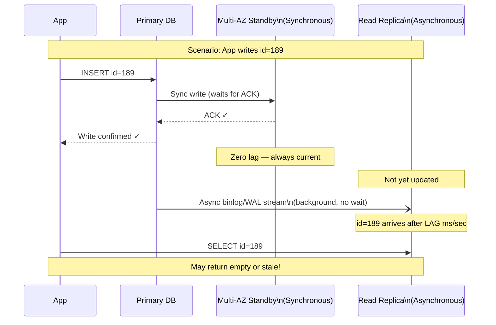
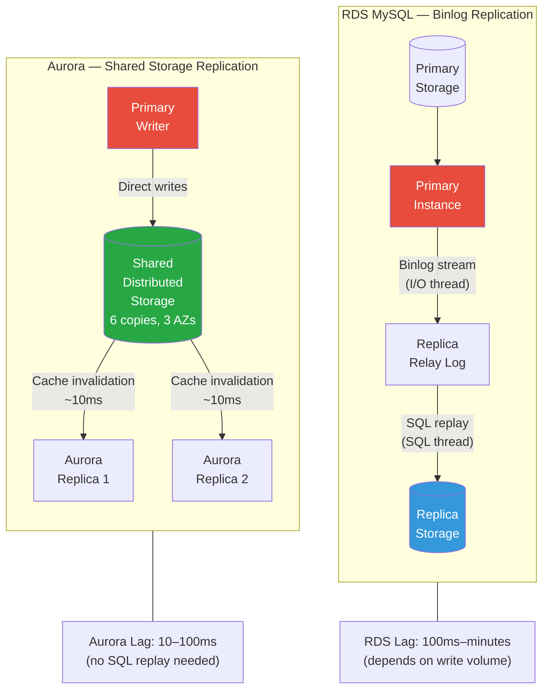
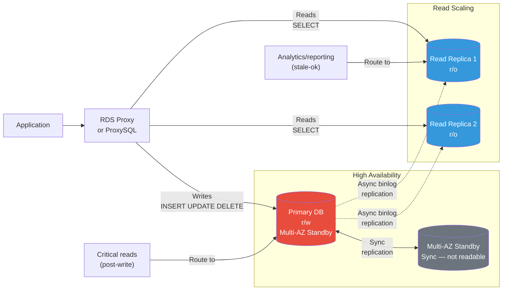

# Q12. What Is Replication Lag in an RDS Read Replica and How Do You Handle It?

---

## Question Variations

- "What is replication lag in AWS RDS?"
- "Why does a read replica have lag and how does it affect applications?"
- "How is Multi-AZ different from Read Replicas in terms of replication?"
- "How would you debug and reduce read replica lag in production?"
- "What is the difference between synchronous and asynchronous replication?"
- "How does Aurora reduce replica lag compared to standard RDS?"
- "What CloudWatch metrics do you monitor for RDS replication health?"
- "Your application reads stale data after a write — how do you troubleshoot this?"
- "What is Aurora Global Database and how does it handle cross-region lag?"

---

## Why Interviewers Ask This

This question tests whether you understand **distributed database consistency** — one of the most common real-world pain points in production systems. Interviewers want to know:

- Do you understand the trade-off between read scaling (replicas) and data freshness?
- Can you explain **why** lag happens technically (binary logs, WAL, storage replication)?
- Do you know the difference between **Multi-AZ** (HA, synchronous) and **Read Replicas** (scaling, asynchronous)?
- Have you actually monitored `ReplicaLag` in CloudWatch and built alerts?
- Can you design systems that handle **read-your-writes consistency** correctly?
- For senior roles: do you know how **Aurora's storage-layer replication** achieves sub-10ms lag?

Stale reads from replicas are a **top-5 production incident category** for data-driven applications. Your ability to diagnose and fix this signals real-world experience.

---

## Key Terminologies

| Term | Definition |
|---|---|
| **Read Replica** | Asynchronous, read-only copy of a primary RDS instance — used to offload read traffic |
| **Replication Lag** | Delay (ms to minutes) between a write being committed on the primary and appearing on the replica |
| **Asynchronous Replication** | Primary commits the write immediately; replica catches up later — possible lag |
| **Synchronous Replication** | Primary waits for the replica to confirm before committing — zero lag, but slower writes |
| **Multi-AZ** | Standby instance in a different AZ with **synchronous** replication — for HA/failover, not read scaling |
| **Binlog (Binary Log)** | MySQL/MariaDB transaction log streamed from primary to replica for replication |
| **WAL (Write-Ahead Log)** | PostgreSQL's equivalent of binlog — shipped to replica for redo |
| **ReplicaLag** | CloudWatch metric (seconds) showing how far behind the replica is from the primary |
| **Read-your-writes consistency** | Guarantee that after writing, subsequent reads reflect that write — NOT guaranteed with async replicas |
| **Aurora Replica** | Aurora's replica uses shared distributed storage — lag is typically under 10ms |
| **Aurora Global Database** | Cross-region Aurora with dedicated replication infrastructure — typically under 1 second RPO |
| **RDS Proxy** | Managed connection pooler — can route reads to replicas and writes to primary automatically |
| **Enhanced Monitoring** | Per-second OS-level metrics for RDS (CPU, I/O, memory) — helps diagnose lag root cause |
| **Performance Insights** | RDS query-level performance tool — identify slow queries on primary causing write bottlenecks |
| **Promotion** | Elevating a read replica to become a standalone primary (breaks replication) |

---

## Structured Answer Approach (Interview Delivery)

### 1. Define What a Read Replica Is

```
"A read replica is an asynchronous, read-only copy of a primary RDS instance.
Writes go to the primary only. The replica continuously copies those writes
in the background. Applications route SELECT queries to the replica to
reduce load on the primary — this is horizontal read scaling."
```

### 2. Explain How Replication Works (Engine-Specific)

**MySQL / MariaDB RDS:**
- Primary records every DML/DDL operation in the **binary log (binlog)**
- Replica has two threads:
  - **I/O thread** — connects to primary, reads binlog events, writes to local **relay log**
  - **SQL thread** — reads relay log, replays the SQL statements
- Lag = delay in I/O thread fetching OR SQL thread replaying

**PostgreSQL RDS:**
- Uses **WAL (Write-Ahead Log)** streaming replication
- Primary streams WAL segments to replica continuously
- Replica replays the WAL to stay in sync
- Lag = WAL bytes not yet replayed × write rate

**Aurora:**
- No binlog/WAL shipping needed — all instances (primary + replicas) share the **same distributed storage layer** (6 copies across 3 AZs)
- Replication is at the **storage level**, not the SQL level
- Lag is typically **10–100 milliseconds** vs. seconds for standard RDS

### 3. Walk Through the Lag Scenario (Use the Whiteboard Diagram)

```
Write path:
  App 1 → writes id=189 → Primary DB (r/w) ✓  [committed instantly]
  Primary → async copies → Read Replica DB     [delayed — LAG HERE]

Read path (immediately after write):
  App 1 → reads id=189 → Read Replica DB       [id=189 NOT YET THERE!]
  → Returns stale data or "not found" error

This is the replication lag problem.
```

**When does it get worse?**
- Primary is under heavy write load (thousands of TPS)
- Replica I/O throughput is insufficient (undersized instance class)
- Cross-region replica (network latency adds to lag)
- Long-running transactions on primary holding up WAL advancement
- DDL operations (ALTER TABLE) — these block replication temporarily

### 4. Differentiate Multi-AZ vs. Read Replicas

```
"This is a critical distinction interviewers test:

  Multi-AZ Standby:
  - Synchronous replication — primary waits for standby ACK
  - Zero lag — standby always has same data as primary
  - Purpose: High Availability / automatic failover (60-120 seconds)
  - NOT used for read scaling — standby is not accessible for reads
  - RDS flips DNS CNAME on failover automatically

  Read Replica:
  - Asynchronous replication — primary does NOT wait for replica
  - Has lag — replica may be seconds to minutes behind
  - Purpose: Read scaling — route SELECT queries here
  - Can be promoted to standalone primary (breaks replication)
  - Up to 15 replicas for Aurora, 5 for RDS MySQL/PostgreSQL"
```

### 5. Describe How to Monitor and Fix It

**Monitoring:** `ReplicaLag` CloudWatch metric → alert when > threshold (e.g., > 30 seconds)

**Fix options:**
1. **Scale up the replica** instance class (more CPU/I/O for SQL thread to replay faster)
2. **Enable Multi-threaded replication** (MySQL 5.7+) — parallel replay of binlog events
3. **Reduce primary write load** — connection pooling (RDS Proxy), query optimisation
4. **Use Aurora** — storage-level replication eliminates SQL thread bottleneck
5. **Application-level workaround** — route critical reads to primary, not replica
6. **Cross-region: Aurora Global Database** — dedicated network links, ~1s lag globally

---

## Visual References

### Whiteboard Diagram 1 — Write Then Read Lag


*App writes id=189 to Main DB. Replica has not yet received the record when the application reads it — this is lag.*

### Whiteboard Diagram 2 — Heavy Load Causing Lag


*Under heavy load the sync interval stretches from milliseconds to seconds or more — replica shows "no update info" until sync catches up.*

---

## Mermaid Diagrams

### Diagram 1 — Async vs. Sync Replication Comparison



### Diagram 2 — RDS vs. Aurora Replication Architecture



### Diagram 3 — Lag Causes and Resolution Flowchart

```mermaid
flowchart TD
    A[ReplicaLag alarm triggered\nLag > 30 seconds] --> B{Root cause?}

    B --> C[Heavy write load\non primary]
    B --> D[Replica under-resourced\nCPU/IO bottleneck]
    B --> E[Long-running transaction\non primary]
    B --> F[Cross-region\nnetwork latency]
    B --> G[DDL operation\nALTER TABLE blocking]

    C --> C1[Enable RDS Proxy\nconnection pooling]
    C --> C2[Optimise slow writes\nPerformance Insights]
    C --> C3[Migrate to Aurora\nstorage replication]

    D --> D1[Scale up replica\ninstance class]
    D --> D2[Enable multi-threaded\nreplication MySQL 5.7+]

    E --> E1[Identify via\nPerformance Insights]
    E --> E2[Kill blocking query\nCALL mysql.rds_kill\(\)]

    F --> F1[Aurora Global Database\ndedicated replication network]
    F --> F2[Check CloudWatch\nNetworkReceiveThroughput]

    G --> G1[Schedule DDL\nduring low-traffic window]
    G --> G2[Use pt-online-schema-change\n\(Percona Toolkit\)]

    style A fill:#dc3545,color:#fff
    style C3 fill:#28a745,color:#fff
    style F1 fill:#28a745,color:#fff
```

### Diagram 4 — Application Read/Write Routing Pattern



---

## Security Perspective (DevSecOps)

### Encryption in Transit for Replication

RDS replication traffic between primary and replica is encrypted using **SSL/TLS** by default for Aurora and when `--require-secure-transport` is enforced:

```sql
-- PostgreSQL: Verify SSL on replica connection
SHOW ssl;  -- should return 'on'

-- MySQL: Check replication SSL status
SHOW REPLICA STATUS\G
-- Look for: Master_SSL_Allowed: Yes
```

### Replication User IAM Authentication (MySQL)

```sql
-- Create dedicated replication user with minimal privileges
CREATE USER 'repl_user'@'%' IDENTIFIED WITH AWSAuthenticationPlugin AS 'RDS';
GRANT REPLICATION SLAVE ON *.* TO 'repl_user'@'%';
-- Principle of least privilege — replication user only, no other access
```

### Audit Logging on Replicas

- Enable **RDS audit logging** — captures all connections and queries
- For Aurora: use **Advanced Auditing** (aurora_audit_plugin)
- Route audit logs to **CloudWatch Logs** → **S3** → **Athena** for compliance queries

### Cross-Account / Cross-Region Replica Security

When creating cross-region read replicas:
- Use **customer-managed KMS keys** (not AWS-managed) — CMK must be in the target region
- The source DB's KMS key ARN must be explicitly provided for cross-region encrypted replicas
- Ensure VPC peering or AWS PrivateLink between regions for private replication traffic (avoid public endpoint)

### Risk: Replica as Data Exfiltration Vector

A read replica can be **promoted to a standalone instance** by anyone with `rds:PromoteReadReplica` permission. In a data breach scenario, an attacker could:
1. Promote replica to standalone
2. Disable encryption/audit logging
3. Export data via `mysqldump` or snapshots

**Control:**
```json
{
  "Effect": "Deny",
  "Action": [
    "rds:PromoteReadReplica",
    "rds:PromoteReadReplicaDBCluster",
    "rds:DeleteDBInstance",
    "rds:ModifyDBInstance"
  ],
  "Resource": "*",
  "Condition": {
    "ArnNotLike": {
      "aws:PrincipalArn": "arn:aws:iam::123456789012:role/DBAAdminRole"
    }
  }
}
```

---

## Hands-On Commands and Syntax

### Create a Read Replica via CLI

```bash
# Create RDS MySQL read replica in same region
aws rds create-db-instance-read-replica \
  --db-instance-identifier mydb-replica-1 \
  --source-db-instance-identifier mydb-primary \
  --db-instance-class db.r6g.large \
  --availability-zone us-east-1b \
  --publicly-accessible false \
  --storage-encrypted \
  --kms-key-id arn:aws:kms:us-east-1:123456789012:key/mrk-abc123 \
  --tags Key=Name,Value=mydb-replica-1 Key=Environment,Value=production

# Create cross-region read replica (for DR / read scaling globally)
aws rds create-db-instance-read-replica \
  --db-instance-identifier mydb-replica-euwest1 \
  --source-db-instance-identifier arn:aws:rds:us-east-1:123456789012:db:mydb-primary \
  --db-instance-class db.r6g.large \
  --region eu-west-1 \
  --kms-key-id arn:aws:kms:eu-west-1:123456789012:key/mrk-xyz789 \
  --source-region us-east-1

# Create Aurora read replica (cluster instance)
aws rds create-db-instance \
  --db-instance-identifier myaurora-replica-1 \
  --db-cluster-identifier myaurora-cluster \
  --db-instance-class db.r6g.large \
  --engine aurora-mysql \
  --promotion-tier 1  # Failover priority (0=highest)
```

### Monitor Replication Lag via CloudWatch

```bash
# Get current ReplicaLag metric for RDS read replica
aws cloudwatch get-metric-statistics \
  --namespace AWS/RDS \
  --metric-name ReplicaLag \
  --dimensions Name=DBInstanceIdentifier,Value=mydb-replica-1 \
  --start-time $(date -u -d '1 hour ago' +%Y-%m-%dT%H:%M:%SZ) \
  --end-time $(date -u +%Y-%m-%dT%H:%M:%SZ) \
  --period 60 \
  --statistics Average Maximum \
  --query 'sort_by(Datapoints, &Timestamp)[-5:].{Time:Timestamp,AvgLag:Average,MaxLag:Maximum}' \
  --output table

# Create CloudWatch alarm for high replication lag
aws cloudwatch put-metric-alarm \
  --alarm-name "RDS-ReplicaLag-High" \
  --alarm-description "Read replica lag exceeds 30 seconds" \
  --namespace AWS/RDS \
  --metric-name ReplicaLag \
  --dimensions Name=DBInstanceIdentifier,Value=mydb-replica-1 \
  --statistic Average \
  --period 60 \
  --evaluation-periods 3 \
  --threshold 30 \
  --comparison-operator GreaterThanThreshold \
  --treat-missing-data notBreaching \
  --alarm-actions arn:aws:sns:us-east-1:123456789012:dba-alerts
```

### Check Lag Inside the Database

```sql
-- MySQL: Check replication status on replica
SHOW REPLICA STATUS\G
-- Key fields:
-- Seconds_Behind_Source: 0          ← this IS the lag in seconds
-- Replica_IO_Running: Yes           ← I/O thread connected to primary
-- Replica_SQL_Running: Yes          ← SQL thread replaying events
-- Source_Log_File: binlog.000012    ← which binlog primary is on
-- Relay_Source_Log_File: binlog.000011  ← which binlog replica is on
-- Exec_Source_Log_Pos: 4096         ← position replayed up to

-- PostgreSQL: Check replication lag
SELECT
  client_addr,
  state,
  sent_lsn,
  write_lsn,
  flush_lsn,
  replay_lsn,
  (sent_lsn - replay_lsn) AS replication_lag_bytes,
  write_lag,
  flush_lag,
  replay_lag
FROM pg_stat_replication;

-- On the replica (PostgreSQL): how far behind?
SELECT
  now() - pg_last_xact_replay_timestamp() AS replication_delay;

-- Aurora: Check aurora-specific replica lag
SELECT server_id, durable_lsn, highest_lsn_rcvd,
  (highest_lsn_rcvd - durable_lsn) AS replica_lag_lsn
FROM information_schema.replica_host_status;
```

### Promote a Read Replica to Standalone Primary

```bash
# Promote replica — breaks replication, becomes standalone writable instance
# Use case: Primary failure + Multi-AZ failover did not work, or DR scenario
aws rds promote-read-replica \
  --db-instance-identifier mydb-replica-1 \
  --backup-retention-period 7 \
  --preferred-backup-window "02:00-03:00"

# Wait for promotion to complete
aws rds wait db-instance-available \
  --db-instance-identifier mydb-replica-1

# Verify it is now a standalone instance (no ReplicaSourceIdentifier)
aws rds describe-db-instances \
  --db-instance-identifier mydb-replica-1 \
  --query 'DBInstances[0].{Status:DBInstanceStatus,ReadReplicaSource:ReadReplicaSourceDBInstanceIdentifier}'
```

### RDS Performance Insights — Identify Write Bottlenecks

```bash
# Enable Performance Insights on existing instance
aws rds modify-db-instance \
  --db-instance-identifier mydb-primary \
  --enable-performance-insights \
  --performance-insights-kms-key-id arn:aws:kms:us-east-1:123456789012:key/mrk-abc123 \
  --performance-insights-retention-period 731 \  # 2 years
  --apply-immediately

# Query Performance Insights for top wait events (past 1 hour)
aws pi get-resource-metrics \
  --service-type RDS \
  --identifier db-EXAMPLEDBID \
  --metric-queries '[{
    "Metric": "db.load.avg",
    "GroupBy": {"Group": "db.wait_event", "Limit": 10}
  }]' \
  --start-time $(date -u -d '1 hour ago' +%s) \
  --end-time $(date -u +%s) \
  --period-in-seconds 60
```

### Kill a Blocking Query on RDS (MySQL)

```sql
-- Find blocking queries on primary
SELECT
  ID,
  USER,
  HOST,
  DB,
  COMMAND,
  TIME,
  STATE,
  INFO
FROM information_schema.PROCESSLIST
WHERE COMMAND != 'Sleep'
  AND TIME > 30
ORDER BY TIME DESC;

-- Kill a specific long-running query (RDS-compatible)
CALL mysql.rds_kill(123456);        -- kill connection ID 123456
CALL mysql.rds_kill_query(123456);  -- kill only the query, not the connection
```

---

## Terraform — Infrastructure as Code

### RDS Read Replica with Monitoring and Alarms

```hcl
# Primary RDS instance
resource "aws_db_instance" "primary" {
  identifier              = "mydb-primary"
  engine                  = "mysql"
  engine_version          = "8.0.35"
  instance_class          = "db.r6g.large"
  allocated_storage       = 100
  storage_type            = "gp3"
  storage_encrypted       = true
  kms_key_id              = aws_kms_key.rds.arn

  db_name  = "appdb"
  username = "admin"
  password = var.db_master_password  # Use Secrets Manager in practice

  multi_az               = true   # Synchronous standby for HA
  db_subnet_group_name   = aws_db_subnet_group.main.name
  vpc_security_group_ids = [aws_security_group.rds.id]

  backup_retention_period = 7
  backup_window           = "02:00-03:00"
  maintenance_window      = "sun:04:00-sun:05:00"

  # Enable binlog for replication
  parameter_group_name = aws_db_parameter_group.mysql8.name

  # Enhanced monitoring
  monitoring_interval = 60
  monitoring_role_arn = aws_iam_role.rds_enhanced_monitoring.arn

  # Performance Insights
  performance_insights_enabled          = true
  performance_insights_kms_key_id       = aws_kms_key.rds.arn
  performance_insights_retention_period = 731

  deletion_protection = true

  tags = {
    Name        = "mydb-primary"
    Environment = "production"
    Role        = "primary"
  }
}

# Read Replica in same region
resource "aws_db_instance" "replica" {
  identifier             = "mydb-replica-1"
  replicate_source_db    = aws_db_instance.primary.identifier  # Creates read replica
  instance_class         = "db.r6g.large"
  storage_encrypted      = true
  kms_key_id             = aws_kms_key.rds.arn

  vpc_security_group_ids = [aws_security_group.rds.id]
  publicly_accessible    = false

  # Replica does NOT need backup_retention_period or multi_az
  skip_final_snapshot    = false
  final_snapshot_identifier = "mydb-replica-1-final"

  # Enhanced monitoring on replica
  monitoring_interval = 60
  monitoring_role_arn = aws_iam_role.rds_enhanced_monitoring.arn

  performance_insights_enabled          = true
  performance_insights_kms_key_id       = aws_kms_key.rds.arn
  performance_insights_retention_period = 731

  tags = {
    Name        = "mydb-replica-1"
    Environment = "production"
    Role        = "read-replica"
  }
}

# MySQL 8 parameter group — enable multi-threaded replication for lower lag
resource "aws_db_parameter_group" "mysql8" {
  name   = "mysql8-production"
  family = "mysql8.0"

  parameter {
    name  = "binlog_format"
    value = "ROW"  # Required for read replicas and Aurora
  }

  parameter {
    name  = "replica_parallel_workers"
    value = "4"  # Multi-threaded replication — reduces SQL thread lag
  }

  parameter {
    name  = "replica_parallel_type"
    value = "LOGICAL_CLOCK"  # Best for high-concurrency workloads (MySQL 5.7+)
  }

  parameter {
    name  = "sync_binlog"
    value = "1"  # Durability: sync binlog to disk on every transaction
  }
}

# CloudWatch alarm for ReplicaLag
resource "aws_cloudwatch_metric_alarm" "replica_lag" {
  alarm_name          = "rds-replica-lag-high"
  alarm_description   = "RDS read replica lag exceeds 30 seconds"
  comparison_operator = "GreaterThanThreshold"
  evaluation_periods  = 3
  metric_name         = "ReplicaLag"
  namespace           = "AWS/RDS"
  period              = 60
  statistic           = "Average"
  threshold           = 30
  treat_missing_data  = "notBreaching"

  dimensions = {
    DBInstanceIdentifier = aws_db_instance.replica.identifier
  }

  alarm_actions = [aws_sns_topic.dba_alerts.arn]
  ok_actions    = [aws_sns_topic.dba_alerts.arn]

  tags = {
    Environment = "production"
    Severity    = "high"
  }
}

# Aurora Cluster (preferred for production — storage-level replication, <10ms lag)
resource "aws_rds_cluster" "aurora" {
  cluster_identifier      = "myaurora-cluster"
  engine                  = "aurora-mysql"
  engine_version          = "8.0.mysql_aurora.3.05.2"
  database_name           = "appdb"
  master_username         = "admin"
  master_password         = var.aurora_master_password

  db_subnet_group_name    = aws_db_subnet_group.main.name
  vpc_security_group_ids  = [aws_security_group.rds.id]

  storage_encrypted       = true
  kms_key_id              = aws_kms_key.rds.arn

  backup_retention_period = 7
  preferred_backup_window = "02:00-03:00"

  deletion_protection     = true
  skip_final_snapshot     = false
  final_snapshot_identifier = "myaurora-cluster-final"

  enabled_cloudwatch_logs_exports = ["audit", "error", "general", "slowquery"]

  tags = {
    Name        = "myaurora-cluster"
    Environment = "production"
  }
}

# Aurora Writer instance
resource "aws_rds_cluster_instance" "aurora_writer" {
  identifier           = "myaurora-writer"
  cluster_identifier   = aws_rds_cluster.aurora.id
  instance_class       = "db.r6g.large"
  engine               = aws_rds_cluster.aurora.engine
  engine_version       = aws_rds_cluster.aurora.engine_version
  promotion_tier       = 0  # First to be promoted if writer fails

  monitoring_interval = 60
  monitoring_role_arn = aws_iam_role.rds_enhanced_monitoring.arn

  performance_insights_enabled          = true
  performance_insights_kms_key_id       = aws_kms_key.rds.arn
  performance_insights_retention_period = 731
}

# Aurora Reader instances (replicas with <10ms lag)
resource "aws_rds_cluster_instance" "aurora_reader" {
  count                = 2
  identifier           = "myaurora-reader-${count.index + 1}"
  cluster_identifier   = aws_rds_cluster.aurora.id
  instance_class       = "db.r6g.large"
  engine               = aws_rds_cluster.aurora.engine
  engine_version       = aws_rds_cluster.aurora.engine_version
  promotion_tier       = count.index + 1  # 1, 2 — lower = higher failover priority

  monitoring_interval = 60
  monitoring_role_arn = aws_iam_role.rds_enhanced_monitoring.arn

  performance_insights_enabled          = true
  performance_insights_kms_key_id       = aws_kms_key.rds.arn
  performance_insights_retention_period = 731
}

# Aurora cluster endpoints
output "aurora_writer_endpoint" {
  value       = aws_rds_cluster.aurora.endpoint
  description = "Connect writers/writes here"
}

output "aurora_reader_endpoint" {
  value       = aws_rds_cluster.aurora.reader_endpoint
  description = "Connect readers/SELECTs here — auto load-balanced across replicas"
}
```

---

## Quick Comparison Tables

### RDS Multi-AZ vs. Read Replica

| Attribute | Multi-AZ Standby | Read Replica |
|---|---|---|
| **Purpose** | High Availability | Read scaling |
| **Replication** | Synchronous | Asynchronous |
| **Lag** | Zero | Milliseconds to minutes |
| **Readable?** | No (standby only) | Yes (read-only) |
| **Automatic failover** | Yes (~60-120 seconds) | No (manual promotion) |
| **Use in connection string** | Same endpoint (CNAME flips) | Separate endpoint |
| **Cost** | 2x instance cost | 2x instance cost |
| **Promotion** | Automatic (failover) | Manual (`promote-read-replica`) |

### RDS vs. Aurora Replication

| Attribute | RDS MySQL/PostgreSQL | Aurora MySQL/PostgreSQL |
|---|---|---|
| **Replication mechanism** | Binlog / WAL streaming | Shared storage layer |
| **Typical replica lag** | 100ms – minutes | 10–100ms |
| **Max replicas** | 5 | 15 |
| **Cross-region** | Cross-region read replica | Aurora Global Database |
| **Failover time** | 1-2 minutes | 30 seconds (Aurora Fast Failover) |
| **Storage** | Separate EBS per instance | Single distributed storage |
| **Multi-threaded replication** | Manual parameter config | Built-in (no config needed) |
| **Cost** | Lower base cost | 20-30% higher but fewer replicas needed |

### Application Consistency Patterns

| Pattern | When to Use | Implementation |
|---|---|---|
| **Always read from replica** | Analytics, reporting, dashboards (stale data OK) | Default connection string → replica endpoint |
| **Route writes to primary, reads to replica** | General CRUD apps | RDS Proxy / ProxySQL / application logic |
| **Read-your-writes** | After creating a user, show their profile | Force read to primary for X seconds post-write |
| **Session consistency** | Shopping cart, checkout flow | Sticky session to primary for entire transaction |
| **Strong consistency** | Financial, inventory, audit | Always read from primary — never replica |
| **Eventual consistency** | Social media feeds, notifications | Replica reads acceptable |

---

## AI & New Trends (2024–2025)

### 1. Aurora Optimized Reads (2023)

AWS launched **Optimized Reads** for Aurora MySQL and PostgreSQL — uses **NVMe-based instance store** as a local read cache layer. Reduces replica I/O against shared storage and cuts read query latency by up to 8x for large datasets. Enabled automatically on `db.r6gd.*` and `db.r7gd.*` instance families.

```bash
# Check if Optimized Reads is enabled
aws rds describe-db-instances \
  --query 'DBInstances[?DBInstanceClass==`db.r6gd.large`].{ID:DBInstanceIdentifier,OptimizedReads:AwsBackupRecoveryPointArn}'
```

### 2. Aurora Zero-ETL Integration with Redshift (2023)

Near-real-time data streaming from Aurora to Redshift **without ETL pipelines**. Lag is typically under 1 minute. For analytics workloads that previously relied on read replicas + exports, this eliminates the need entirely:
```
Aurora → Aurora Zero-ETL → Amazon Redshift
  (transactional)           (analytical — OLAP queries)
```

### 3. RDS Optimized Writes (MySQL 8.0.30+, 2023)

AWS modified MySQL's **double-write buffer** to use Aurora-optimized storage, doubling write throughput for InnoDB. Reduces write pressure on the primary → less lag on replicas downstream.

### 4. Amazon Q Developer — Replica Lag Diagnosis

Amazon Q Developer (2024) can analyze CloudWatch metrics and generate a root-cause analysis for replica lag:
- *"Q: My RDS replica lag spiked at 3am — what caused it?"*
- Q correlates `ReplicaLag`, `WriteIOPS`, `DatabaseConnections`, and CloudTrail events automatically

### 5. Aurora Serverless v2 — Auto-Scaling Replicas (2023)

Aurora Serverless v2 replicas **auto-scale capacity** in response to read load (0.5 to 128 ACUs in fine-grained steps). No more manual instance class upgrades when read traffic spikes. Combined with low lag, this is the preferred architecture for variable-load production systems.

```hcl
resource "aws_rds_cluster_instance" "serverless_reader" {
  identifier         = "aurora-serverless-reader"
  cluster_identifier = aws_rds_cluster.aurora.id
  instance_class     = "db.serverless"
  engine             = "aurora-mysql"
}

resource "aws_rds_cluster" "aurora_sv2" {
  serverlessv2_scaling_configuration {
    min_capacity = 0.5
    max_capacity = 64
  }
}
```

### 6. KEDA + RDS Lag-Based Autoscaling (Kubernetes, 2024)

Use KEDA with the CloudWatch scaler to **auto-scale application pods based on replica lag**:
```yaml
# If replica lag > 10s, scale down consumers that hit the replica
# If lag = 0, scale up consumer pods
apiVersion: keda.sh/v1alpha1
kind: ScaledObject
metadata:
  name: rds-lag-scaler
spec:
  triggers:
  - type: aws-cloudwatch
    metadata:
      namespace: AWS/RDS
      dimensionName: DBInstanceIdentifier
      dimensionValue: mydb-replica-1
      metricName: ReplicaLag
      targetMetricValue: "5"   # Target: keep lag under 5 seconds
      awsRegion: us-east-1
```

### 7. What to Learn Now

- **Aurora Serverless v2** — the default choice for new production workloads
- **Aurora Zero-ETL → Redshift** — replaces complex ETL pipelines for analytics
- **RDS Proxy** — essential for Lambda-heavy architectures that overwhelm DB connections
- **Performance Insights** — master this for diagnosing write bottlenecks that cause lag
- **Percona Toolkit** (`pt-online-schema-change`) — for zero-downtime schema changes that otherwise freeze replication

---

## Prerequisites

Before answering this question confidently, you should know:

- What a relational database is (tables, rows, transactions)
- ACID properties — particularly Consistency and Durability
- How write-ahead logging / binary logging works at a high level
- Basic AWS RDS concepts: instance types, storage, parameter groups
- CloudWatch metrics and alarms
- Connection strings / endpoints in RDS (writer endpoint, reader endpoint, instance endpoint)

---

## Further Reading (2023–Present)

- [Aurora Optimized Reads — AWS Blog (2023)](https://aws.amazon.com/blogs/database/reduce-query-latency-with-amazon-aurora-optimized-reads/)
- [Aurora Zero-ETL integration with Redshift (2023)](https://aws.amazon.com/blogs/database/getting-started-with-amazon-aurora-zero-etl-integration-with-amazon-redshift/)
- [RDS Optimized Writes — MySQL 8 (2023)](https://aws.amazon.com/about-aws/whats-new/2023/05/amazon-rds-optimized-writes-mysql-8/)
- [Aurora Serverless v2 GA (2022+)](https://aws.amazon.com/blogs/database/amazon-aurora-serverless-v2-is-generally-available/)
- [Multi-threaded replication in Aurora MySQL](https://docs.aws.amazon.com/AmazonRDS/latest/AuroraUserGuide/AuroraMySQL.Replication.MySQL.html)
- [AWS RDS Monitoring — Best Practices (2024)](https://docs.aws.amazon.com/AmazonRDS/latest/UserGuide/CHAP_Monitoring.html)
- [Aurora Global Database — RPO/RTO guarantees](https://docs.aws.amazon.com/AmazonRDS/latest/AuroraUserGuide/aurora-global-database.html)
- [RDS Performance Insights user guide](https://docs.aws.amazon.com/AmazonRDS/latest/UserGuide/USER_PerfInsights.html)

---

## Related Follow-Up Questions

1. **"How does Multi-AZ differ from a read replica — aren't they both copies?"**
   > Multi-AZ = synchronous replication for HA/failover (not readable). Read Replica = asynchronous replication for read scaling (has lag). You typically have both in production: Multi-AZ for durability + read replicas for performance.

2. **"What happens if replication lag becomes very large — say 10 minutes?"**
   > At extreme lag, the replica's relay log grows large (disk space risk). If primary restarts, replica must replay 10 minutes of binlog to catch up before it can serve reads. If replica runs out of disk — replication breaks. Fix: increase replica storage, scale up instance class, find and kill blocking query on primary.

3. **"Can you write to a read replica?"**
   > No — by definition a read replica is read-only. Any attempt to write returns an error. To write to it, you must first promote it to a standalone instance, which breaks replication permanently.

4. **"How does Aurora's reader endpoint work?"**
   > Aurora provides a single **reader endpoint** (DNS) that round-robin load balances across all Aurora replicas. When you add/remove replicas, the endpoint automatically updates — no application changes needed.

5. **"What is Aurora Global Database's RPO/RTO?"**
   > RPO (Recovery Point Objective): typically < 1 second. RTO (Recovery Time Objective): < 1 minute for managed failover. Aurora Global uses dedicated replication infrastructure (not the internet) achieving sub-second cross-region lag.

6. **"How would you handle a situation where the application reads stale data after a write?"**
   > Two strategies: (1) **Route the read to primary** for N seconds after any write affecting that record — use a caching flag in Redis with TTL. (2) **Use `rds:SecondsBeforeTimeout` hint** in Aurora — force the replica to wait until it has replayed up to the primary's current LSN before returning results (Aurora-specific feature, 2024).

7. **"What is RDS Proxy and how does it help with replica lag?"**
   > RDS Proxy is a managed connection pooler that sits between the app and RDS. It can automatically route read traffic to replicas and write traffic to the primary. It also reduces connection overhead (Lambda use case), handles failover transparently, and integrates with Secrets Manager for credentials. It doesn't reduce lag itself but ensures reads don't go to the primary unnecessarily, keeping primary write throughput high.

8. **"What is the `Seconds_Behind_Source` value in MySQL and can you trust it?"**
   > It reports how far behind the SQL thread is in replaying events, based on timestamps in the binlog. It can be misleading — it shows 0 if the SQL thread has finished replaying all received relay log events, even if the I/O thread hasn't received the latest events yet. Always cross-check with `Read_Source_Log_Pos` vs. primary's `SHOW MASTER STATUS` position.

---

## 30-Second Interview Summary

> "Replication lag in an RDS read replica is the delay between a write being committed on the primary and that write appearing on the replica. It happens because replication is asynchronous — the primary commits immediately and streams the change to the replica in the background via binary logs or WAL. Under heavy write load, the replica's SQL thread can fall behind, causing reads to return stale data.
>
> I monitor `ReplicaLag` in CloudWatch and set an alarm at 30 seconds. To reduce lag: scale up the replica instance class, enable multi-threaded replication (`replica_parallel_workers`), use RDS Proxy to reduce primary write pressure, or migrate to Aurora where replication happens at the storage layer and lag is typically under 100ms.
>
> The critical distinction is Multi-AZ vs. Read Replicas — Multi-AZ is synchronous and for failover; read replicas are asynchronous and for read scaling. For applications requiring read-your-writes consistency — like financial operations — I always route those reads to the primary, never the replica."

---

*Source: KodeKloud DevOps Interview Preparation Course — [Watch Video](https://learn.kodekloud.com/user/courses/devops-interview-preparation-course/module/f1169a2e-23de-4377-bc4f-a07c136a11d6/lesson/dff652f3-b02d-42c0-8824-db532f6783ab)*
