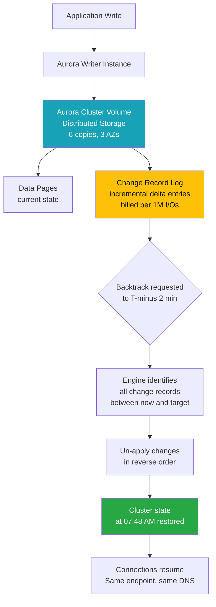
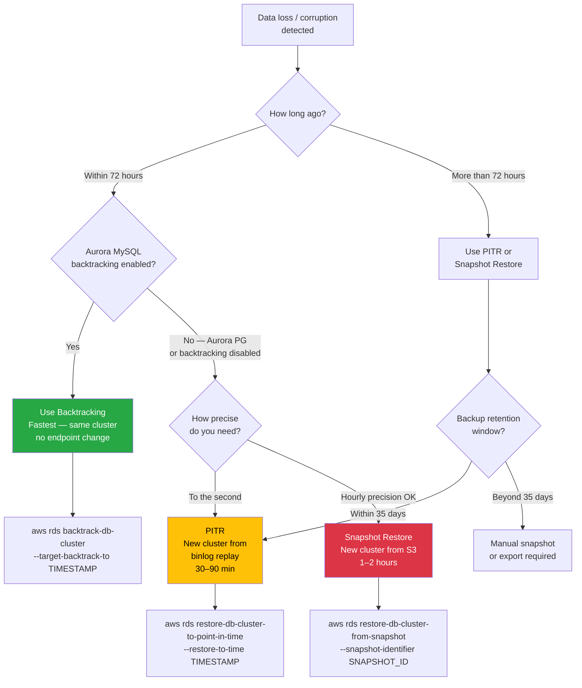
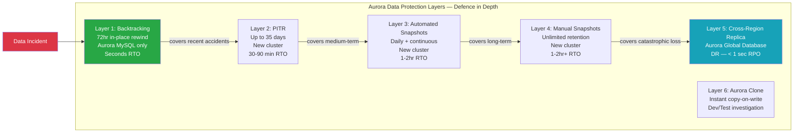

# Q13. What Is Aurora Backtracking and How Does It Differ from a Database Backup?

---

## Question Variations

- "Are you aware of the backtrack option in AWS Aurora? How does it help?"
- "What is the difference between Aurora backtracking and a database snapshot?"
- "How is backtracking different from Point-in-Time Recovery (PITR)?"
- "Your team accidentally deleted 700 user records — how do you recover them quickly in Aurora?"
- "What are the limitations of Aurora backtracking?"
- "How do you enable backtracking on an Aurora cluster?"
- "When would you choose backtracking over PITR or a snapshot restore?"
- "What is the maximum backtrack window in Aurora and what does it cost?"
- "Can you backtrack an Aurora PostgreSQL cluster?"

---

## Why Interviewers Ask This

This question tests practical Aurora knowledge beyond just "it's a managed MySQL/PostgreSQL". Interviewers are checking:

- Do you know Aurora's **differentiating features** beyond standard RDS?
- Have you thought about **rapid data recovery** scenarios in production?
- Can you articulate the **trade-offs** between backtracking, PITR, and snapshot restore?
- Do you know the **critical limitations** — Aurora MySQL only, must be enabled at cluster creation?
- For DevSecOps roles: do you understand the **audit and compliance implications** of rewinding a database?

Accidental deletes (`DROP TABLE`, mass `DELETE`, schema-breaking `ALTER TABLE`) are one of the most costly production incidents. Your ability to explain fast, precise recovery options demonstrates real operational maturity.

---

## Key Terminologies

| Term | Definition |
|---|---|
| **Aurora Backtracking** | In-place rewind of an Aurora MySQL cluster to any point within a configurable window (up to 72 hours) |
| **Backtrack Window** | The maximum period you can rewind — configured in hours at cluster creation (1–72 hours) |
| **Change Records** | The incremental log entries Aurora stores to support backtracking — billed per I/O |
| **PITR (Point-in-Time Recovery)** | Restore to any second within your backup retention period — creates a NEW cluster from snapshot + binlog replay |
| **Snapshot** | Full copy of the cluster volume at a point in time — stored in S3, used for full restores or cloning |
| **Aurora Cluster Volume** | Aurora's shared distributed storage layer — 6 copies across 3 AZs |
| **Backtrack Target Time** | The exact timestamp you specify when initiating a backtrack — must be within the backtrack window |
| **Fast Cloning** | Aurora feature to clone a cluster instantly using copy-on-write — separate from backtracking |
| **Binlog** | Binary log — CANNOT be used simultaneously with backtracking enabled (Aurora MySQL limitation) |
| **RTO** | Recovery Time Objective — how quickly you restore. Backtracking: seconds to minutes. PITR: minutes to hours |
| **RPO** | Recovery Point Objective — how much data you can lose. Backtracking: seconds. PITR: depends on binlog |
| **DevOps Guru** | AWS ML service that detects operational anomalies in Aurora and can pre-emptively alert before data loss |

---

## Structured Answer Approach (Interview Delivery)

### 1. Lead With What Backtracking Actually Does

```
"Aurora Backtracking rewinds the existing DB cluster to a point in time
you specify — without creating a new cluster, without restoring from S3,
and without replaying hours of transaction logs.

It works like an 'undo' at the database engine level — Aurora continuously
records change events in its cluster volume, and when you backtrack,
it literally un-applies those changes in reverse until it reaches your
target timestamp.

This means recovery can happen in seconds to a few minutes, not hours."
```

### 2. Walk Through the Real Scenario (Use the Slide Example)

```
Timeline:
  06:00 AM — last automated snapshot taken
  07:50 AM — developer runs: DELETE FROM users WHERE status='test'
             → accidentally deletes 700 production user records
  07:51 AM — incident detected

Recovery options:

  Option A — Snapshot restore (traditional backup):
    Restore 06:00 AM snapshot → new cluster spun up → 1-2 hours wait
    → replay 1h 50m of transactions → data loss = everything after 06:00 AM
    → downtime = 1-2+ hours

  Option B — PITR (Point-in-Time Recovery):
    Restore to 07:49 AM → new cluster created → 30-60 min wait
    → application must cut over to new endpoint → still significant downtime

  Option C — Aurora Backtracking (best option):
    aws rds backtrack-db-cluster --target-backtrack-to "2024-01-15T07:48:00Z"
    → existing cluster rewinds to 07:48 AM — 2 minutes BEFORE the delete
    → same endpoint, no failover, no DNS change
    → recovery time: 1-5 minutes
    → data loss: ~2 minutes (07:48 to 07:50)
```

### 3. Explain How It Works Internally

Aurora's distributed storage volume is **append-only** — it never overwrites data in place. Instead, it stores a **change record log** for every write operation. When you initiate a backtrack:

1. Aurora pauses all connections to the cluster briefly
2. The engine identifies all change records between *now* and the *target time*
3. It un-applies those changes in reverse order (like a database transaction rollback, but at scale)
4. The cluster resumes at the target timestamp state
5. Connections re-establish — same endpoint, same cluster, same DNS

The **change records** are what you pay for: charged per 1 million I/O change records stored. High-write databases accumulate change records faster and cost more to maintain a 72-hour window.

### 4. State the Critical Limitations Upfront

```
"The key things to know about backtracking limitations:

  1. Aurora MySQL ONLY — not supported on Aurora PostgreSQL
  2. Must be enabled at cluster CREATION — cannot be added to an existing cluster
  3. Maximum 72 hours window
  4. Incompatible with binary logging (binlog) — if you need binlog for
     external replication or audit, you cannot use backtracking simultaneously
  5. Backtracking pauses the cluster briefly — seconds to minutes of disruption
  6. Does not work on Aurora Serverless v1 (does work on Serverless v2 — 2023)
  7. Backtracking affects the ENTIRE cluster — you cannot backtrack a single table
  8. Cross-region replicas are NOT backtracked — only the primary cluster"
```

### 5. Compare the Three Recovery Options

| Recovery Method | New Cluster? | RTO | Endpoint Changes? | Max Lookback | Cost |
|---|---|---|---|---|---|
| **Backtracking** | No (in-place) | Seconds–minutes | None | 72 hours | Per change record I/O |
| **PITR** | Yes (new cluster) | 30–90 minutes | Must cut over | Backup retention (35 days) | S3 storage |
| **Snapshot Restore** | Yes (new cluster) | 1–2+ hours | Must cut over | Unlimited (manual) | S3 storage |

---

## Visual Reference


*Traditional backup fires once every 24 hours. Backtracking captures incremental change records continuously — rewinding to 2 minutes before the accident takes seconds, not hours.*

---

## Mermaid Diagrams

### Diagram 1 — Backtracking Timeline vs. Traditional Backup

```mermaid
timeline
    title Recovery Timeline — Aurora Backtracking vs Traditional Options
    section Backup Window
        06:00 AM : Daily automated snapshot taken
                 : Full cluster state saved to S3
    section Normal Operations
        06:00 – 07:50 : 700 new user records created
                      : Normal read/write traffic
        07:48 AM      : Last clean state before incident
    section Incident
        07:50 AM : DELETE command runs
                 : 700 user records deleted
        07:51 AM : Incident detected
    section Recovery
        07:52 AM : Backtracking initiated to 07:48 AM
                 : Cluster pauses briefly (seconds)
                 : Change records un-applied in reverse
        07:54 AM : Cluster back at 07:48 AM state
                 : 700 records restored, same endpoint
```

### Diagram 2 — How Aurora Change Records Enable Backtracking



### Diagram 3 — Backtracking vs PITR vs Snapshot Decision Tree



### Diagram 4 — Aurora Data Protection Layers (Full Picture)



---

## Security Perspective (DevSecOps)

### Audit Trail for Backtrack Operations

Every `backtrack-db-cluster` API call is logged in **AWS CloudTrail**. For compliance environments (PCI-DSS, SOC 2, HIPAA), you must be able to answer:
- **Who** initiated the backtrack?
- **When** was it initiated?
- **What target timestamp** was specified?
- **Was this authorised** by a change management ticket?

```bash
# Find all backtrack operations in CloudTrail
aws cloudtrail lookup-events \
  --lookup-attributes AttributeKey=EventName,AttributeValue=BacktrackDBCluster \
  --start-time 2024-01-01T00:00:00Z \
  --end-time 2024-12-31T23:59:59Z \
  --query 'Events[*].{Time:EventTime,User:Username,Detail:CloudTrailEvent}' \
  --output table
```

### IAM Controls — Restrict Who Can Backtrack

```json
{
  "Version": "2012-10-17",
  "Statement": [
    {
      "Sid": "AllowBacktrackOnlyForDBAs",
      "Effect": "Allow",
      "Action": [
        "rds:BacktrackDBCluster",
        "rds:DescribeDBClusterBacktracks"
      ],
      "Resource": "arn:aws:rds:*:*:cluster:*",
      "Condition": {
        "ArnLike": {
          "aws:PrincipalArn": [
            "arn:aws:iam::123456789012:role/DBAAdminRole",
            "arn:aws:iam::123456789012:role/IncidentResponseRole"
          ]
        }
      }
    },
    {
      "Sid": "DenyBacktrackForDevelopers",
      "Effect": "Deny",
      "Action": "rds:BacktrackDBCluster",
      "Resource": "*",
      "Condition": {
        "ArnLike": {
          "aws:PrincipalArn": "arn:aws:iam::123456789012:role/DeveloperRole"
        }
      }
    }
  ]
}
```

### Change Management Gate

In regulated environments, a backtrack should require:
1. A Jira/ServiceNow change ticket number
2. Approval from a second DBA
3. A recorded reason in the API call (`aws rds backtrack-db-cluster --reason "..."`  — via tags)
4. Post-incident review within 24 hours

### Compliance Risk: Backtracking Can Remove Audit Records

**Critical consideration**: If your database contains **audit log tables** or **compliance records**, backtracking to before certain events will **remove those audit entries**. In GDPR/PCI environments:
- Route application audit logs to an **immutable external store** (CloudWatch Logs with Kinesis → S3 with Object Lock)
- Never rely on database tables as your sole audit trail
- Backtracking could erase evidence of a breach if misused

---

## Hands-On Commands and Syntax

### Enable Backtracking at Cluster Creation

```bash
# Create Aurora MySQL cluster with backtracking enabled (72-hour window)
aws rds create-db-cluster \
  --db-cluster-identifier myaurora-cluster \
  --engine aurora-mysql \
  --engine-version "8.0.mysql_aurora.3.05.2" \
  --master-username admin \
  --master-user-password "$(aws secretsmanager get-secret-value \
    --secret-id prod/aurora/master --query SecretString --output text | \
    python3 -c 'import sys,json; print(json.load(sys.stdin)["password"])')" \
  --db-subnet-group-name mydb-subnet-group \
  --vpc-security-group-ids sg-12345678 \
  --storage-encrypted \
  --kms-key-id arn:aws:kms:us-east-1:123456789012:key/mrk-abc123 \
  --backtrack-window 259200 \  # 72 hours in seconds (72 * 3600)
  --backup-retention-period 7 \
  --enable-cloudwatch-logs-exports '["audit","error","general","slowquery"]' \
  --deletion-protection \
  --tags Key=Name,Value=myaurora-cluster Key=BacktrackEnabled,Value=true

# NOTE: Backtracking cannot be enabled on an existing cluster — creation only
```

### Check Backtrack Status of a Cluster

```bash
# Describe cluster — check BacktrackWindow and EarliestBacktrackTime
aws rds describe-db-clusters \
  --db-cluster-identifier myaurora-cluster \
  --query 'DBClusters[0].{
    ClusterID:DBClusterIdentifier,
    Engine:Engine,
    EngineVersion:EngineVersion,
    BacktrackWindow:BacktrackWindowInSeconds,
    EarliestBacktrack:EarliestBacktrackTime,
    BacktrackConsumed:BacktrackConsumedChangeRecords,
    BacktrackRequested:BacktrackRequestedChangeRecords
  }'

# List available backtrack points (shows requested/completed backtracks)
aws rds describe-db-cluster-backtracks \
  --db-cluster-identifier myaurora-cluster \
  --query 'DBClusterBacktracks[*].{
    BacktrackID:BacktrackIdentifier,
    RequestedTime:BacktrackRequestCreationTime,
    TargetTime:BacktrackTo,
    Status:Status
  }' \
  --output table
```

### Initiate a Backtrack (The Critical Recovery Command)

```bash
# Backtrack to 2 minutes before the accidental DELETE
# Scenario: DELETE ran at 2024-01-15T07:50:00Z
aws rds backtrack-db-cluster \
  --db-cluster-identifier myaurora-cluster \
  --backtrack-to "2024-01-15T07:48:00Z" \
  --use-earliest-time-on-point-in-time-unavailable

# --use-earliest-time-on-point-in-time-unavailable:
#   If the exact timestamp is not available (outside window or in a gap),
#   use the nearest available time instead of failing

# Watch backtrack progress
watch -n 5 'aws rds describe-db-cluster-backtracks \
  --db-cluster-identifier myaurora-cluster \
  --query "DBClusterBacktracks[-1].{Status:Status,TargetTime:BacktrackTo}" \
  --output table'

# Status transitions:
# PENDING → APPLYING → COMPLETED
# or PENDING → FAILED (if target time is outside window)
```

### Verify Recovery After Backtrack

```sql
-- Connect to Aurora cluster (same endpoint — no change needed)
-- Verify the deleted records are restored
SELECT COUNT(*) FROM users;  -- Should show count before the DELETE

-- Verify specific records are back
SELECT id, email, created_at
FROM users
WHERE id BETWEEN 701 AND 800  -- IDs that were deleted
LIMIT 10;

-- Check the exact timestamp of the latest record to confirm rewind point
SELECT MAX(created_at) AS latest_record FROM users;
-- Should show records up to ~07:48 AM, nothing between 07:48 and 07:50
```

### Monitor Backtracking Cost (Change Records)

```bash
# CloudWatch metric: BacktrackChangeRecordsCreationRate
# Tells you how fast change records are being generated (records/minute)
aws cloudwatch get-metric-statistics \
  --namespace AWS/RDS \
  --metric-name BacktrackChangeRecordsCreationRate \
  --dimensions Name=DBClusterIdentifier,Value=myaurora-cluster \
  --start-time $(date -u -d '24 hours ago' +%Y-%m-%dT%H:%M:%SZ) \
  --end-time $(date -u +%Y-%m-%dT%H:%M:%SZ) \
  --period 3600 \
  --statistics Average \
  --output table

# BacktrackChangeRecordsStored — total stored (billing)
aws cloudwatch get-metric-statistics \
  --namespace AWS/RDS \
  --metric-name BacktrackChangeRecordsStored \
  --dimensions Name=DBClusterIdentifier,Value=myaurora-cluster \
  --start-time $(date -u -d '24 hours ago' +%Y-%m-%dT%H:%M:%SZ) \
  --end-time $(date -u +%Y-%m-%dT%H:%M:%SZ) \
  --period 3600 \
  --statistics Maximum \
  --output table
# Cost: $0.012 per 1 million change records (us-east-1, 2024)
```

### PITR Commands (Comparison — When Backtracking Is Unavailable)

```bash
# PITR — creates a NEW cluster (Aurora PostgreSQL, or when backtracking disabled)
aws rds restore-db-cluster-to-point-in-time \
  --db-cluster-identifier myaurora-cluster-restored \
  --source-db-cluster-identifier myaurora-cluster \
  --restore-to-time "2024-01-15T07:48:00Z" \
  --db-subnet-group-name mydb-subnet-group \
  --vpc-security-group-ids sg-12345678

# Wait for new cluster to be available
aws rds wait db-cluster-available \
  --db-cluster-identifier myaurora-cluster-restored

# Create cluster instances for the restored cluster
aws rds create-db-instance \
  --db-instance-identifier myaurora-cluster-restored-writer \
  --db-cluster-identifier myaurora-cluster-restored \
  --db-instance-class db.r6g.large \
  --engine aurora-mysql

# Once validated — update application connection string to point to new cluster
# (this is why backtracking is faster — NO endpoint change needed)
```

---

## Terraform — Infrastructure as Code

### Aurora Cluster with Backtracking Enabled

```hcl
# Aurora MySQL cluster with backtracking — MUST set at creation
resource "aws_rds_cluster" "aurora_backtrack" {
  cluster_identifier     = "myaurora-cluster"
  engine                 = "aurora-mysql"
  engine_version         = "8.0.mysql_aurora.3.05.2"
  database_name          = "appdb"
  master_username        = "admin"
  master_password        = var.aurora_master_password

  db_subnet_group_name   = aws_db_subnet_group.main.name
  vpc_security_group_ids = [aws_security_group.aurora.id]

  storage_encrypted      = true
  kms_key_id             = aws_kms_key.aurora.arn

  # --- BACKTRACKING CONFIG ---
  # Max 72 hours = 259200 seconds
  # Choose window based on RTO requirements and cost tolerance
  backtrack_window = 86400  # 24 hours — balance of cost vs. recovery window

  # Full backups (separate from backtracking — both are recommended)
  backup_retention_period = 7
  preferred_backup_window = "02:00-03:00"

  # CloudWatch logs for audit
  enabled_cloudwatch_logs_exports = ["audit", "error", "general", "slowquery"]

  deletion_protection      = true
  skip_final_snapshot      = false
  final_snapshot_identifier = "myaurora-cluster-final-${formatdate("YYYYMMDD", timestamp())}"

  # NOTE: backtracking is incompatible with binlog — cannot set both
  # If you need binlog for external replication, disable backtracking

  tags = {
    Name              = "myaurora-cluster"
    Environment       = "production"
    BacktrackEnabled  = "true"
    BacktrackWindowHr = "24"
    RecoveryStrategy  = "backtrack+pitr+snapshot"
  }

  lifecycle {
    # Prevent accidental recreation — would DISABLE backtracking
    prevent_destroy = true
  }
}

# Writer instance
resource "aws_rds_cluster_instance" "writer" {
  identifier           = "myaurora-writer"
  cluster_identifier   = aws_rds_cluster.aurora_backtrack.id
  instance_class       = "db.r6g.large"
  engine               = aws_rds_cluster.aurora_backtrack.engine
  engine_version       = aws_rds_cluster.aurora_backtrack.engine_version

  monitoring_interval = 60
  monitoring_role_arn = aws_iam_role.rds_monitoring.arn

  performance_insights_enabled          = true
  performance_insights_kms_key_id       = aws_kms_key.aurora.arn
  performance_insights_retention_period = 731
}

# Reader instance
resource "aws_rds_cluster_instance" "reader" {
  identifier           = "myaurora-reader-1"
  cluster_identifier   = aws_rds_cluster.aurora_backtrack.id
  instance_class       = "db.r6g.large"
  engine               = aws_rds_cluster.aurora_backtrack.engine
  engine_version       = aws_rds_cluster.aurora_backtrack.engine_version
  promotion_tier       = 1

  monitoring_interval = 60
  monitoring_role_arn = aws_iam_role.rds_monitoring.arn

  performance_insights_enabled          = true
  performance_insights_kms_key_id       = aws_kms_key.aurora.arn
  performance_insights_retention_period = 731
}

# CloudWatch alarm — alert when backtrack window approaching saturation
resource "aws_cloudwatch_metric_alarm" "backtrack_records_high" {
  alarm_name          = "aurora-backtrack-change-records-high"
  alarm_description   = "Aurora backtrack change records rate is very high — window may shrink"
  comparison_operator = "GreaterThanThreshold"
  evaluation_periods  = 3
  metric_name         = "BacktrackChangeRecordsCreationRate"
  namespace           = "AWS/RDS"
  period              = 300
  statistic           = "Average"
  threshold           = 1000000  # 1M records/min — adjust based on workload
  treat_missing_data  = "notBreaching"

  dimensions = {
    DBClusterIdentifier = aws_rds_cluster.aurora_backtrack.cluster_identifier
  }

  alarm_actions = [aws_sns_topic.dba_alerts.arn]
}

# IAM policy — restrict backtrack to DBA role only
resource "aws_iam_policy" "backtrack_dba_only" {
  name        = "AuroraBacktrackDBAOnly"
  description = "Allow backtrack operations for DBA role only"

  policy = jsonencode({
    Version = "2012-10-17"
    Statement = [
      {
        Sid    = "AllowBacktrack"
        Effect = "Allow"
        Action = [
          "rds:BacktrackDBCluster",
          "rds:DescribeDBClusterBacktracks",
          "rds:DescribeDBClusters"
        ]
        Resource = aws_rds_cluster.aurora_backtrack.arn
      }
    ]
  })
}

resource "aws_iam_role_policy_attachment" "backtrack_dba" {
  role       = aws_iam_role.dba_admin.name
  policy_arn = aws_iam_policy.backtrack_dba_only.arn
}

# Output — display backtrack window and earliest available time
output "aurora_cluster_endpoint" {
  value = aws_rds_cluster.aurora_backtrack.endpoint
}

output "aurora_reader_endpoint" {
  value = aws_rds_cluster.aurora_backtrack.reader_endpoint
}

output "backtrack_window_hours" {
  value       = aws_rds_cluster.aurora_backtrack.backtrack_window / 3600
  description = "Backtrack window in hours"
}
```

---

## Quick Comparison Tables

### Backtracking vs PITR vs Snapshot — Full Comparison

| Attribute | Backtracking | PITR | Manual Snapshot |
|---|---|---|---|
| **Supported engines** | Aurora MySQL only | Aurora MySQL + PostgreSQL + RDS | Aurora + RDS + all engines |
| **New cluster created?** | No — in-place | Yes | Yes |
| **Endpoint changes?** | No | Yes — must update app | Yes — must update app |
| **RTO** | Seconds–5 min | 30–90 minutes | 1–3+ hours |
| **Max lookback** | 72 hours | 35 days (backup retention) | Unlimited (manual) |
| **Granularity** | Any second within window | Any second within retention | Point-in-time snapshot only |
| **Cost** | Per change record I/O | S3 + restore compute | S3 storage |
| **Can be enabled later?** | No — creation only | Always on (backup retention > 0) | Manual, anytime |
| **Affects entire cluster?** | Yes — all tables | Yes | Yes |
| **Binlog compatible?** | No | Yes | Yes |

### Backtrack Window vs. Cost Trade-off

| Window | Seconds | Typical Monthly Cost\n(medium write workload) | Use Case |
|---|---|---|---|
| 1 hour | 3,600 | ~$5/month | Dev/test environments |
| 12 hours | 43,200 | ~$30/month | Staging environments |
| 24 hours | 86,400 | ~$60/month | Standard production |
| 72 hours | 259,200 | ~$150/month | Strict RTO/compliance production |

*Costs scale with write volume — high-throughput OLTP clusters cost more to maintain change records.*

### Aurora Data Protection Strategy by Environment

| Environment | Backtracking | PITR Retention | Snapshots | Cross-Region |
|---|---|---|---|---|
| **Production** | 24–72 hours | 7–35 days | Weekly manual | Aurora Global DB |
| **Staging** | 12 hours | 7 days | On-demand | No |
| **Development** | 1–4 hours | 1 day | No | No |
| **DR environment** | 72 hours | 35 days | Daily | Yes |

---

## AI & New Trends (2024–2025)

### 1. Aurora Serverless v2 + Backtracking (2023)

Aurora Serverless v1 did NOT support backtracking. **Aurora Serverless v2** (2022–2023) fully supports backtracking, making it the preferred choice for variable-workload production clusters that also need fast recovery. Combined with auto-scaling capacity, this eliminates a major gap in Serverless adoption.

### 2. Amazon DevOps Guru for RDS (2023)

Amazon DevOps Guru uses ML to detect **anomalous database behavior** before it causes incidents:
- Detects unusual DELETE volume spikes (could signal accidental mass delete)
- Fires a proactive alert with recommended action: *"Take a manual snapshot now"*
- Integrates with Systems Manager OpsCenter to create incident tickets automatically

This gives you an early warning system that complements backtracking — you detect the problem before it fully propagates.

### 3. Amazon Q Developer — Database Incident Response (2024)

Amazon Q Developer can help during a database incident by:
- Analyzing CloudTrail events to find which query caused data loss
- Identifying the exact timestamp of the problematic DML
- Generating the `aws rds backtrack-db-cluster` command with the correct target time
- Assessing whether backtracking or PITR is the faster option given current cluster state

### 4. Aurora Blue/Green Deployments (2023) — Pre-emptive Protection

AWS Aurora Blue/Green Deployments (launched 2023) create a **staging copy** of production before schema changes:
- Blue = production cluster (protected)
- Green = staging clone (where you test ALTER TABLE, index changes, etc.)
- Switch over (cutover) when ready — 1 minute or less

This prevents the scenario where a bad schema migration wipes data — you don't need to backtrack at all because production was never touched.

```bash
# Create Blue/Green deployment (green is a clone of blue)
aws rds create-blue-green-deployment \
  --blue-green-deployment-name prod-schema-upgrade \
  --source myaurora-cluster \
  --target-engine-version "8.0.mysql_aurora.3.06.0" \
  --target-db-cluster-parameter-group-name aurora-mysql8-new-params

# Apply schema changes to green (test environment)
# When validated, switch over to green (< 1 min cutover)
aws rds switchover-blue-green-deployment \
  --blue-green-deployment-identifier bgd-12345678abcdef \
  --switchover-timeout 300  # 5-minute maximum switchover window
```

### 5. AWS Backup — Centralized Aurora Backup Management (2024)

AWS Backup now integrates with Aurora for:
- Centralised backup policies across all Aurora clusters via a single console
- Compliance frameworks (HIPAA, PCI) automatically enforced via backup plans
- Cross-region / cross-account backup copies managed centrally
- Vault Lock — immutable backups (WORM) for ransomware protection

Note: AWS Backup manages **snapshots and PITR** — backtracking is still managed directly via the Aurora API.

### 6. What to Learn Now

- **Aurora Blue/Green Deployments** — the modern safeguard before any DDL/schema change
- **Aurora Serverless v2** — understand that backtracking is now available in serverless configurations
- **DevOps Guru for RDS** — proactive anomaly detection paired with backtracking = complete data protection story
- **AWS Backup Vault Lock** — for immutable backup compliance requirements
- **Backtrack + Change Data Capture (CDC)** — understand why backtracking and binlog are mutually exclusive, and when to use **AWS DMS** + **Kinesis Data Streams** for CDC instead

---

## Prerequisites

Before answering this question confidently, you should know:

- Aurora cluster architecture (shared distributed storage, writer/reader instances)
- What a database backup snapshot is and how S3-based restore works
- Point-in-Time Recovery (PITR) and how binlog/WAL replay enables second-level precision
- Basic RDS/Aurora CLI and console operations
- ACID properties — specifically Durability (D)
- RTO and RPO concepts for designing recovery strategies

---

## Further Reading (2023–Present)

- [Aurora Backtracking documentation](https://docs.aws.amazon.com/AmazonRDS/latest/AuroraUserGuide/AuroraMySQL.Managing.Backtrack.html)
- [Aurora Blue/Green Deployments GA (2023)](https://aws.amazon.com/blogs/database/amazon-rds-blue-green-deployments-are-now-generally-available/)
- [Aurora Serverless v2 + Backtracking support](https://docs.aws.amazon.com/AmazonRDS/latest/AuroraUserGuide/aurora-serverless-v2.html)
- [Amazon DevOps Guru for RDS (2023)](https://aws.amazon.com/devops-guru/features/devops-guru-for-rds/)
- [AWS Backup Vault Lock — immutable backups (2023)](https://docs.aws.amazon.com/aws-backup/latest/devguide/vault-lock.html)
- [Aurora Backtracking pricing](https://aws.amazon.com/rds/aurora/pricing/) — see "Backtrack" section
- [Comparing Aurora backup options — AWS re:Post](https://repost.aws/knowledge-center/aurora-mysql-backtracking-vs-pitr)
- [Amazon Q Developer for DB incident response (2024)](https://aws.amazon.com/q/developer/)

---

## Related Follow-Up Questions

1. **"Can you backtrack an Aurora PostgreSQL cluster?"**
   > No — backtracking is only available for **Aurora MySQL**. For Aurora PostgreSQL, you must use PITR (Point-in-Time Recovery) which creates a new cluster. This is a common trap question — Aurora MySQL and Aurora PostgreSQL do NOT have feature parity.

2. **"What happens if I try to enable backtracking on an existing Aurora cluster?"**
   > You cannot — backtracking must be configured at cluster creation. If your existing cluster doesn't have it enabled, your options are: (a) create a new cluster with backtracking enabled and migrate, or (b) rely on PITR + snapshots for recovery.

3. **"If I backtrack and then realize I went too far — can I redo forward?"**
   > Yes — you can backtrack to a more recent timestamp to undo the backtrack. The change records are still preserved until they expire from the window. You can go backward and forward multiple times within the backtrack window.

4. **"Does backtracking affect read replicas?"**
   > Yes — backtracking applies to the entire Aurora cluster, including all reader instances. All instances rewind to the same target timestamp simultaneously. Cross-region Aurora Global Database secondary clusters are NOT backtracked.

5. **"Is backtracking the same as a database transaction rollback?"**
   > Conceptually similar but at a different scale. A transaction rollback undoes one uncommitted transaction (milliseconds). Backtracking rewinds the entire cluster across potentially millions of committed transactions over hours — it's a cluster-level undo, not a transaction-level one.

6. **"What is the cost of keeping a 72-hour backtrack window?"**
   > You're charged $0.012 per 1 million change records stored (us-east-1). A medium-write Aurora cluster generating ~500K change records/minute accumulates ~720M records over 24 hours = ~$8.64/day, ~$260/month for a 72-hour window. High-write OLTP can be significantly more — monitor `BacktrackChangeRecordsStored` in CloudWatch.

7. **"How would you recover if the backtrack itself fails?"**
   > Fall back to PITR — restore the cluster to the target time by creating a new cluster from Aurora's automated backup + binlog replay. This takes longer (30–90 minutes) but always works as long as backup retention period covers the target time.

8. **"Aurora Blue/Green — is that the same as backtracking?"**
   > No — they solve different problems. Blue/Green is a **pre-deployment safety net** (test schema changes on a clone before touching production). Backtracking is **post-incident recovery** (undo data loss that already happened on production). Both are part of a complete data protection strategy.

---

## 30-Second Interview Summary

> "Aurora Backtracking rewinds an existing Aurora MySQL cluster to any point within a configurable window of up to 72 hours. Unlike a snapshot restore or PITR — both of which create a new cluster and require application endpoint changes — backtracking is in-place. The cluster briefly pauses, Aurora un-applies change records in reverse, and the cluster resumes at the target timestamp. Same endpoint, same DNS, no failover. Recovery from an accidental mass delete typically takes 1–5 minutes.
>
> The critical limitations to know: Aurora MySQL only — not PostgreSQL. Must be enabled at cluster creation, cannot be added later. Incompatible with binary logging. And it affects the entire cluster — you cannot backtrack a single table.
>
> In production I use all three layers: backtracking for fast same-day recovery, PITR for longer lookback up to 35 days, and Aurora Blue/Green Deployments before any schema change so backtracking is rarely needed at all."

---

*Source: KodeKloud DevOps Interview Preparation Course — [Watch Video](https://learn.kodekloud.com/user/courses/devops-interview-preparation-course/module/f1169a2e-23de-4377-bc4f-a07c136a11d6/lesson/8a390fbb-88e0-4ba4-8fe5-2d2bd7eea822)*
