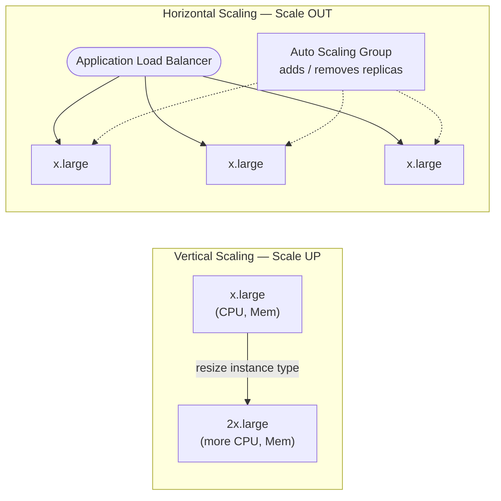

# AWS Question 2 — Vertical vs Horizontal Scaling

> **Section:** AWS &nbsp;|&nbsp; **Topic:** Scalability / High Availability &nbsp;|&nbsp; **Level:** Mid (2–5 yrs) &nbsp;|&nbsp; **Frequency:** Very High
>
> _Part of the DevOps & DevSecOps Interview Preparation series._

---

## ❓ The Question

> **"What is the difference between vertical and horizontal scaling? When would you use each?"**

Common variations:

- "How would you scale an application that suddenly gets 10× the traffic?"
- "What does 'scale up' vs 'scale out' mean in AWS?"
- "How do Auto Scaling Groups fit into this?"
- "How do you scale a stateful application?"

---

## 🎯 Why Interviewers Ask This

Scaling is the **#1 architecture fundamental** for any DevOps/SRE/Cloud role. With this one question the interviewer checks whether you can:

- Tell **"bigger box" (vertical)** apart from **"more boxes" (horizontal)** and pick correctly per workload.
- Reason about **high availability, fault tolerance, and single points of failure**.
- Connect theory to AWS primitives — **EC2 instance types, Auto Scaling Groups (ASG), Load Balancers** — and to Kubernetes (**HPA/VPA**).
- Think about the **trade-offs**: downtime, hardware ceilings, statelessness, cost granularity.
- (DevSecOps) Understand that *more instances = more attack surface*, and that autoscaling can be **weaponised for cost** (Denial of Wallet).

It's a quick way to see if you design for **resilience**, not just "make it run."

---

## 📖 Key Terminologies

| Term | Plain-English meaning |
| --- | --- |
| **Vertical scaling ("scale up")** | Give a single server **more power** — bigger CPU, RAM, instance type. |
| **Horizontal scaling ("scale out")** | Add **more servers/instances** and spread the load across them. |
| **Diagonal scaling** | Do both — scale up to a sensible size, then scale out. |
| **Auto Scaling Group (ASG)** | AWS service that automatically adds/removes EC2 instances to meet demand. |
| **Load Balancer (ALB/NLB)** | Distributes incoming traffic across multiple instances — the front door for horizontal scaling. |
| **Target tracking policy** | "Keep average CPU at 50%" — ASG/Application Auto Scaling adjusts capacity to hit a metric target. |
| **Predictive scaling** | ML forecasts demand and scales **ahead** of the spike. |
| **HPA (Horizontal Pod Autoscaler)** | Kubernetes object that adds/removes **pod replicas** (horizontal). |
| **VPA (Vertical Pod Autoscaler)** | Kubernetes add-on that resizes a pod's CPU/memory **requests** (vertical). |
| **Stateless app** | Keeps no local session/data, so any instance can serve any request — a prerequisite for clean horizontal scaling. |
| **Single Point of Failure (SPOF)** | One component whose failure takes the whole system down — what horizontal scaling avoids. |

---

## 🗣️ How to Answer (Structured)

**1) Define both in one breath:**
> "**Vertical scaling** means making a *single machine* more powerful — e.g., resizing an EC2 instance from `x.large` to `2x.large` for more CPU and memory. **Horizontal scaling** means adding *more machines* and load-balancing across them — e.g., growing an Auto Scaling Group from 2 to 10 instances."

**2) Map to the whiteboard mental model:**
> "Vertical = arrow pointing *up* (one box gets bigger). Horizontal = arrow pointing *sideways* (more identical boxes, fronted by a load balancer, managed by an ASG)."

**3) Give the trade-offs (this is what they're really testing):**

- **Vertical:** simplest — no distributed system, no code changes, easy for stateful apps. **But** there's a **hardware ceiling**, the resize usually needs a **stop/start (downtime)**, and you still have a **single point of failure**.
- **Horizontal:** **high availability + fault tolerance** (load shared; one node dying isn't fatal), **near-limitless** scale, granular cost. **But** the app must be **stateless** (or externalise session/state), and you need a **load balancer** and good observability.

**4) Use real-world examples (interviewers love these):**

- **Vertical use case:** an app that grows in *complexity* — adds CPU-heavy features — and benefits from a bigger single box without re-architecting.
- **Horizontal use case:** a shopping website that starts small and then hits **traffic spikes** (a sale). You add instances behind an ALB so it stays responsive under concurrent users.

**5) Land the modern default:**
> "In the cloud, horizontal scaling is the default for resilience — that's why ASGs and Kubernetes HPA exist. I scale *up* to a reasonable instance size first, then scale *out* with an ASG using a **target-tracking** policy, and use **predictive scaling** when traffic is predictable."

**6) Close with state:**
> "The deciding factor is often **state**. Stateless tiers scale out cleanly; stateful ones (databases) usually scale *up* for writes and *out* via **read replicas** for reads, or shard when needed."

---

## 🔐 Security Perspective (DevSecOps)

Scaling is not just a performance topic — it materially changes your **attack surface and cost-risk**:

- **More instances = more to secure.** Every node a horizontal scale-out launches must inherit the same hardened baseline (golden AMI, **IMDSv2 required**, least-privilege IAM, encrypted EBS, tight security groups). The **launch template** is what guarantees this — never hand-configure scaled instances.
- **Autoscaling can be weaponised — "Denial of Wallet" / economic DoS.** An attacker (or a bad bot/L7 DDoS) can drive traffic that forces endless scale-out, exploding your bill. Mitigate with **AWS WAF + rate limiting**, **AWS Shield**, **sane `max-size` caps**, scaling **cooldowns/stabilization windows**, and CloudWatch billing alarms.
- **Vertical scaling = a downtime/availability event.** The stop/start resize is a maintenance window — patch and re-validate the instance during it, and make sure it's not the only node serving traffic.
- **Statelessness has a security upside.** Externalising sessions to ElastiCache/Redis or a token (JWT) means ephemeral instances hold **no PII on local disk** — less to leak when an instance is recycled.
- **Consistent patching at scale.** Use **SSM Patch Manager / immutable AMIs** so a fleet of N horizontally-scaled instances doesn't drift into N different vulnerability states.
- **Secrets at scale.** Pull from **Secrets Manager / SSM Parameter Store** at boot; never bake credentials into the AMI or user-data of instances that will be cloned many times.
- **Observability is a control.** With many instances, centralise logs/metrics (CloudWatch, OpenSearch) so an attack or anomaly is visible across the whole fleet, not hidden on one box.

> **One-liner for the room:** *"Horizontal scaling buys availability but widens the attack surface and exposes you to cost-based attacks — so I cap `max-size`, put WAF/Shield in front, and bake the security baseline into the launch template so every new instance is hardened by default."*

---

## 🖼️ Visuals

### Mermaid — Vertical vs Horizontal at a glance



### Source diagram (KodeKloud) — vertical vs horizontal servers


---

## 📊 Quick Comparison

| Aspect | ⬆️ Vertical (Scale Up) | ➡️ Horizontal (Scale Out) |
| --- | --- | --- |
| **Meaning** | Bigger single machine | More machines |
| **AWS example** | Change EC2 instance type (`x.large` → `2x.large`) | ASG adds instances behind an ALB |
| **Kubernetes example** | VPA (resize pod requests) | HPA (more pod replicas) |
| **Downtime** | Usually yes (stop/start to resize) | No (rolling, add/remove live) |
| **Ceiling** | Limited by largest instance type | Near-limitless |
| **Fault tolerance** | Low — single point of failure | High — load shared across nodes |
| **Complexity** | Simple, no app changes | Needs load balancer + stateless design |
| **State handling** | Easy (one box) | Must externalise session/state |
| **Cost pattern** | Big step jumps | Granular, pay-as-you-grow |
| **Best for** | Stateful apps, quick wins, dev/test | Web/API tiers, spiky traffic, HA |

> **Mnemonic:** *Vertical = a taller building (limited by physics). Horizontal = more buildings (limited only by land).*

---

## 🛠️ Hands-On: Commands & Syntax

### 1) Vertical scaling — resize an EC2 instance (requires stop/start)

```bash
aws ec2 stop-instances  --instance-ids i-0abc123def456
# wait until 'stopped'
aws ec2 modify-instance-attribute \
  --instance-id i-0abc123def456 \
  --instance-type "{\"Value\": \"m5.2xlarge\"}"
aws ec2 start-instances --instance-ids i-0abc123def456
```

> The instance **must be stopped** to change its type — that's the downtime window. (EBS-backed only; instance-store types can't be resized this way.)

### 2) Horizontal scaling — create an ASG behind a load balancer

```bash
aws autoscaling create-auto-scaling-group \
  --auto-scaling-group-name web-asg \
  --launch-template "LaunchTemplateName=secure-fleet-lt,Version=\$Latest" \
  --min-size 2 --max-size 10 --desired-capacity 2 \
  --vpc-zone-identifier "subnet-aaa,subnet-bbb,subnet-ccc" \
  --target-group-arns "arn:aws:elasticloadbalancing:us-east-1:111122223333:targetgroup/web/abc" \
  --health-check-type ELB --health-check-grace-period 60
```

### 3) Make it *auto* — a target-tracking scaling policy (the modern default)

```bash
aws autoscaling put-scaling-policy \
  --auto-scaling-group-name web-asg \
  --policy-name cpu-target-tracking \
  --policy-type TargetTrackingScaling \
  --target-tracking-configuration '{
    "PredefinedMetricSpecification": {"PredefinedMetricType": "ASGAverageCPUUtilization"},
    "TargetValue": 50.0
  }'
```

> "Keep average CPU at 50%" — the ASG adds/removes instances automatically. `max-size` is also your **cost/security guardrail**.

### 4) Kubernetes — horizontal (HPA) and vertical (VPA)

```bash
# Quick HPA: scale 'web' between 2 and 10 pods, targeting 50% CPU
kubectl autoscale deployment web --cpu-percent=50 --min=2 --max=10
```

HPA as YAML (`autoscaling/v2`, the current API):

```yaml
apiVersion: autoscaling/v2
kind: HorizontalPodAutoscaler
metadata:
  name: web
spec:
  scaleTargetRef:
    apiVersion: apps/v1
    kind: Deployment
    name: web
  minReplicas: 2
  maxReplicas: 10
  metrics:
    - type: Resource
      resource:
        name: cpu
        target:
          type: Utilization
          averageUtilization: 50
  behavior:                       # avoid flapping
    scaleDown:
      stabilizationWindowSeconds: 300
```

> **HPA = horizontal** (more pods). **VPA = vertical** (bigger pods). Don't run HPA and VPA on the *same* CPU/memory metric — they fight.

### 5) Infrastructure as Code — Terraform ASG + target tracking

```hcl
resource "aws_autoscaling_group" "web" {
  name                = "web-asg"
  min_size            = 2
  max_size            = 10
  desired_capacity    = 2
  vpc_zone_identifier = [for s in aws_subnet.private : s.id]
  target_group_arns   = [aws_lb_target_group.web.arn]
  health_check_type   = "ELB"

  launch_template {
    id      = aws_launch_template.secure.id
    version = "$Latest"
  }
}

resource "aws_autoscaling_policy" "cpu" {
  name                   = "cpu-target-tracking"
  autoscaling_group_name = aws_autoscaling_group.web.name
  policy_type            = "TargetTrackingScaling"

  target_tracking_configuration {
    predefined_metric_specification {
      predefined_metric_type = "ASGAverageCPUUtilization"
    }
    target_value = 50.0
  }
}
```

---

## 🤖 AI & The New Trend (2024–2025) — what changed, and what to learn

> Modern scaling is **predictive and event-driven**, not just reactive — and AI inference workloads have their own scaling playbook.

### How AI is impacting scaling

- **Predictive Scaling (ML)** — EC2 Auto Scaling forecasts recurring patterns (daily/weekly peaks) and scales **before** the load arrives, eliminating the cold-start lag of reactive scaling.
- **AWS Compute Optimizer** — ML recommends the *right* instance size, taking the guesswork out of **vertical** right-sizing (and flags over-provisioned/idle resources to cut cost).
- **Karpenter (Kubernetes)** — node-level horizontal scaling that just-in-time provisions right-sized, diversified, Spot-friendly nodes and bin-packs/consolidates — far faster and cheaper than the classic Cluster Autoscaler.
- **KEDA (event-driven autoscaling)** — scales pods on **queue depth, Kafka lag, or custom metrics**, and supports **scale-to-zero**. This is the standard pattern for **AI inference**: spin GPU pods up on request backlog, drop to zero when idle to save expensive GPU spend.
- **ML inference autoscaling** — SageMaker endpoints and HPA-on-custom-metrics scale on **requests-per-second / GPU utilisation / token throughput**, not just CPU — because GPU workloads don't show load on CPU metrics.

### How AI can contribute to your day-to-day

- **Generate scaling policies & IaC** — Amazon Q Developer / Copilot can scaffold ASG policies, HPA/KEDA YAML, and Terraform; you review and harden.
- **Tune thresholds** — feed CloudWatch/Prometheus history to an LLM to suggest target values, cooldowns, and stabilization windows that prevent flapping.
- **Capacity forecasting & incident review** — summarise scaling events and correlate spikes with deploys or attacks.

### ⚠️ Security caveat (DevSecOps)

- AI-suggested policies may set **`max-size` too high** (cost-DoS risk) or omit cooldowns (thrash). Always cap `max-size`, add WAF/Shield in front, and review.
- Don't paste account IDs, ARNs, or metric data with sensitive labels into public AI tools — use Amazon Q / Bedrock for internal context.
- Treat AI-generated IaC as a draft → scan with **Checkov / tfsec / Trivy** in CI before apply.

### What to learn right now (priority order)

1. **ASG target-tracking + predictive scaling** — the AWS scaling baseline.
2. **Kubernetes HPA (v2) + Karpenter** — pod and node scaling, the modern combo.
3. **KEDA + scale-to-zero** — event-driven scaling, essential for AI inference cost control.
4. **Compute Optimizer** — ML-driven vertical right-sizing.
5. **Stateless design + externalised sessions** — the thing that *makes* horizontal scaling work.
6. **Cost & abuse guardrails** — `max-size` caps, WAF/Shield, billing alarms.

---

## ✅ Prerequisites (be solid on these first)

- **EC2 instance types & families** — so "resize `x.large` → `2x.large`" is concrete.
- **Load balancing (ALB/NLB)** — the front door that makes horizontal scaling possible.
- **Auto Scaling Groups & launch templates** — how AWS scales out and keeps the baseline.
- **Stateless vs stateful design / session management** — the deciding factor for which strategy fits.
- **(Bonus) Kubernetes Deployments & replicas** — to discuss HPA/VPA fluently.

---

## 📚 Further Reading (current docs)

- **Resize an EC2 instance** — AWS docs: <https://docs.aws.amazon.com/AWSEC2/latest/UserGuide/ec2-instance-resize.html>
- **What is EC2 Auto Scaling** — AWS docs: <https://docs.aws.amazon.com/autoscaling/ec2/userguide/what-is-amazon-ec2-auto-scaling.html>
- **Target tracking scaling policies** — AWS docs: <https://docs.aws.amazon.com/autoscaling/ec2/userguide/as-scaling-target-tracking.html>
- **Predictive scaling** — AWS docs: <https://docs.aws.amazon.com/autoscaling/ec2/userguide/ec2-auto-scaling-predictive-scaling.html>
- **Kubernetes Horizontal Pod Autoscaler** — <https://kubernetes.io/docs/tasks/run-application/horizontal-pod-autoscale/>
- **Vertical Pod Autoscaler** — <https://github.com/kubernetes/autoscaler/tree/master/vertical-pod-autoscaler>
- **KEDA (event-driven autoscaling)** — <https://keda.sh/docs/>
- **Karpenter** — <https://karpenter.sh/docs/>
- **AWS Compute Optimizer** — <https://docs.aws.amazon.com/compute-optimizer/latest/ug/what-is-compute-optimizer.html>
- **AWS Well-Architected — Reliability Pillar** — <https://docs.aws.amazon.com/wellarchitected/latest/reliability-pillar/welcome.html>
- **KodeKloud lesson (video):** <https://learn.kodekloud.com/user/courses/devops-interview-preparation-course/module/f1169a2e-23de-4377-bc4f-a07c136a11d6/lesson/500c8f25-adfd-47bb-bfd2-6e6e04971806>

---

## 🔁 Related / Follow-up Questions

1. **What is diagonal scaling?** → Scale up to a sensible instance size, then scale out — the pragmatic real-world combo.
2. **HPA vs VPA vs Cluster Autoscaler vs Karpenter?** → HPA = more pods; VPA = bigger pods; Cluster Autoscaler/Karpenter = more (and right-sized) nodes. Karpenter is the modern node provisioner.
3. **Target tracking vs step vs simple scaling?** → Target tracking ("hold this metric") is the recommended default; step scaling reacts in graded steps to alarm breach size; simple is the legacy one-step-with-cooldown.
4. **What is predictive scaling and when does it help?** → ML forecasts recurring demand and scales ahead — great for predictable daily/weekly peaks, useless for random spikes.
5. **How do you scale a *stateful* application (e.g., a database)?** → Scale up for writes; scale out reads via **read replicas**; **shard/partition** when a single primary isn't enough; offload sessions to Redis.
6. **What's "Denial of Wallet" and how does autoscaling relate?** → An attacker drives traffic to force endless scale-out, exploding cost. Defend with `max-size` caps, WAF rate limiting, Shield, and billing alarms.
7. **How do you stop scaling "flapping"/thrash?** → Cooldowns, HPA `stabilizationWindowSeconds`, sensible thresholds, and target tracking instead of twitchy step policies.
8. **Can you scale to zero, and why?** → Yes — with **KEDA** (or serverless/Lambda). Critical for cost on idle GPU/AI inference workloads.
9. **How do you autoscale AI/GPU inference?** → Scale on **queue depth / RPS / GPU utilisation** (KEDA or HPA custom metrics, SageMaker endpoint auto scaling), not CPU.
10. **Why is statelessness a prerequisite for horizontal scaling?** → Any instance must be able to serve any request; local session/state breaks load balancing and loses data when instances are recycled.

---

> 📌 **30-second interview summary:** **Vertical scaling** makes one machine bigger (resize EC2 `x.large` → `2x.large`) — simple and great for stateful apps, but it has a hardware ceiling, needs a stop/start (downtime), and stays a single point of failure. **Horizontal scaling** adds more instances behind a load balancer, managed by an **Auto Scaling Group** (or HPA in Kubernetes) — it gives high availability and fault tolerance and scales almost limitlessly, but the app must be **stateless**. The cloud default is horizontal with **target-tracking/predictive scaling**; from a security view, every scaled-out instance must inherit a hardened launch-template baseline, and you must cap `max-size` and front it with WAF/Shield to avoid cost-based (Denial-of-Wallet) attacks.
