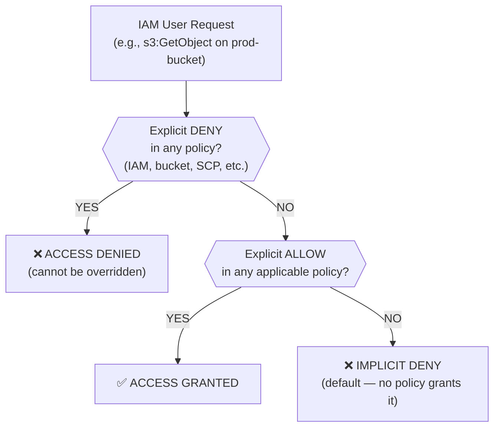
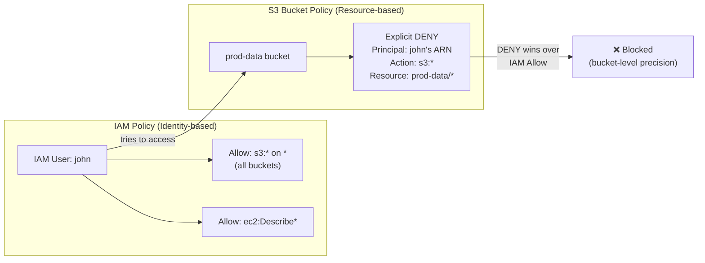

# AWS Question 3 — How to Block an IAM User from a Specific S3 Bucket

> **Section:** AWS &nbsp;|&nbsp; **Topic:** S3 / IAM / Access Control &nbsp;|&nbsp; **Level:** Mid (2–5 yrs) &nbsp;|&nbsp; **Frequency:** Very High
>
> _Part of the DevOps & DevSecOps Interview Preparation series._

---

## ❓ The Question

> **"How would you block a specific IAM user from accessing a particular S3 bucket — without revoking their access to other S3 buckets?"**

You may also hear this phrased as:

- "A developer in your org has S3 access but should NOT access the `prod-data` bucket. How do you enforce that?"
- "What's the difference between an S3 bucket policy and an IAM policy for access control?"
- "When would you use a bucket policy instead of an IAM policy?"
- "Can you use 'Block Public Access' to block an IAM user from an S3 bucket?"
- "How do you write an explicit Deny in an S3 bucket policy?"

---

## 🎯 Why Interviewers Ask This

This is a **trap question** disguised as a simple one — and a favourite for DevOps/DevSecOps/Cloud interviews because it immediately reveals whether you understand how AWS access control actually layers together. By asking it, the interviewer is testing whether you:

- Know the **difference between identity-based (IAM) and resource-based (bucket policy) access controls** — and when each is the right tool.
- Understand **why IAM policy alone is the wrong answer** here (you'd have to touch the IAM policy every time, and a broad IAM Allow can override a missing IAM restriction).
- Know that **"Block Public Access" ≠ blocking IAM users** — a common costly misconception.
- Can write or reason about an **explicit `Deny` statement** in a bucket policy, and explain why `Deny` always wins over `Allow`.
- Think like a **security engineer**: precise, least-privilege, bucket-scoped — not blunt, account-wide.

> **The instant win in this interview:** Say "I would NOT use an IAM policy for this — the right answer is an S3 bucket policy with an explicit Deny for that user's ARN" — and you've already separated yourself from most candidates.

---

## 📖 Key Terminologies

| Term | Plain-English meaning |
| --- | --- |
| **IAM Policy** | An **identity-based** policy attached to a user, group, or role. Defines what actions that principal *can* (Allow) or *can't* (Deny) do across AWS services. |
| **S3 Bucket Policy** | A **resource-based** policy attached directly to an S3 bucket. Controls who can access *that specific bucket* — independently of what the user's IAM policy says. |
| **Principal** | *Who* the policy applies to — in a bucket policy, you specify an ARN (user, role, account, service). |
| **Explicit Deny** | A `"Effect": "Deny"` statement in a policy. **Always wins** — it overrides any Allow from any other policy, including the user's own IAM policy. |
| **Implicit Deny** | If no policy grants access, access is denied by default. Less powerful than an explicit Deny — a separate Allow can still override it. |
| **Block Public Access (BPA)** | An S3 bucket/account-level setting that blocks internet/anonymous access. **Does NOT affect authenticated IAM users.** |
| **Resource ARN** | The unique identifier for an AWS resource, e.g., `arn:aws:s3:::my-bucket` (bucket) or `arn:aws:s3:::my-bucket/*` (all objects inside). |
| **Principal ARN** | The unique identifier for an IAM user, role, or account. e.g., `arn:aws:iam::111122223333:user/john`. |
| **ACL (Access Control List)** | A legacy S3 access control mechanism. AWS now recommends disabling ACLs and using bucket policies instead (ACLs were deprecated as default in 2023). |
| **Policy Evaluation Logic** | The order in which AWS evaluates all applicable policies: 1) Explicit Deny → 2) Explicit Allow → 3) Implicit Deny. |

---

## 🗣️ How to Answer (Structured)

**1) Call out the wrong answer first — this shows depth:**
> "The first instinct might be to edit the user's IAM policy and remove S3 permissions — but that's too blunt. If I remove S3 access from their IAM policy, they lose access to *all* S3 buckets, not just the one I want to restrict. That's over-reach."

**2) Explain why IAM policy is the wrong tool here:**
> "IAM policies are attached to the *identity* — the user or role. They're great for saying 'this user can use S3' or 'this role can only read.' But when I need *bucket-specific* control that is isolated to one bucket and doesn't affect the user's access elsewhere, a **resource-based policy on the bucket itself** is the right tool."

**3) Clarify the Block Public Access misconception (trap within a trap):**
> "I also would NOT use 'Block Public Access.' That setting is designed to prevent internet/anonymous access — it has no effect on authenticated IAM users inside your account. It's a common mistake."

**4) Give the correct answer cleanly:**
> "The right approach is to edit the **S3 bucket policy** on the specific bucket and add an explicit `Deny` statement targeting that IAM user's ARN. Because an explicit Deny always wins over any Allow — including the user's own IAM policy — this is the most precise and reliable way to block bucket-level access."

**5) Walk through the bucket policy structure:**
> "In the bucket policy JSON, I set `Effect: Deny`, specify the user's ARN as the `Principal`, list the actions I want to block (or `s3:*` for everything), and set the `Resource` to both the bucket ARN and `arn:aws:s3:::bucket-name/*` to cover all objects inside."

**6) Close with the principle:**
> "This is the principle of **least privilege with surgical precision** — I'm not revoking anything globally. I'm adding one targeted Deny on one resource. That's the DevSecOps mindset."

---

## 🔐 Security Perspective (DevSecOps)

This question is fundamentally a **security design question**, not just an AWS operations question. Here's how to think about it through a DevSecOps lens:

- **Explicit Deny is your strongest control.** In AWS's policy evaluation logic, an explicit `Deny` in *any* applicable policy always wins — it can never be overridden by an Allow in another policy. This makes bucket-policy Deny statements a reliable, tamper-resistant guardrail.

- **Separation of concerns: IAM vs. resource-based.** IAM policies answer "what can this identity do?" — bucket policies answer "who can access this resource?" Using both in tandem gives you **defence in depth**: even if an IAM policy is accidentally over-permissioned, the bucket policy still enforces its own access rules.

- **Block Public Access ≠ blocking IAM users — know this cold.** BPA restricts *unauthenticated/internet* traffic. Thinking BPA blocks internal IAM users is a dangerous misconception that has led to real data breaches (sensitive data assumed "blocked" while being fully accessible to insiders).

- **Scope your Deny tightly.** A poorly written Deny can lock out the bucket owner or automation roles. Always:
  - Specify the exact user ARN (not a wildcard Principal like `"*"`).
  - Use a `Condition` block if you need nuance (e.g., deny except from a specific VPC or IP range).
  - Cover both the bucket (`arn:aws:s3:::bucket-name`) and its objects (`arn:aws:s3:::bucket-name/*`).

- **Principle of Least Privilege at the resource level.** Bucket policies let you enforce fine-grained permissions per bucket — without modifying the user's global IAM policy. This is critical in large orgs where IAM policies are shared across teams.

- **Audit with AWS Access Analyzer.** After writing the policy, use **IAM Access Analyzer** to validate that the Deny is working as intended and that no other Allow is inadvertently overriding it. Also checks for unintended public access.

- **Tag buckets for governance.** Classify buckets by sensitivity (e.g., `data-classification: restricted`) and use **AWS Config rules** or **SCPs** to ensure restricted buckets always have explicit Deny policies for non-approved principals.

- **Immutable audit trail.** Log every access attempt (and denial) via **S3 Server Access Logging** or **AWS CloudTrail Data Events** on the bucket, so you can detect if someone is trying to access a restricted bucket — even if they're being denied.

> **One-liner for the room:** *"Block Public Access protects from the internet. IAM policy controls what a user can do globally. A bucket policy Deny controls who touches this bucket — and an explicit Deny always wins. Use the right tool for the right scope."*

---

## 🖼️ Visuals

### Mermaid — AWS Policy Evaluation Logic (why Deny always wins)



### Mermaid — IAM Policy vs Bucket Policy: What each controls



### Source image — Why bucket policy is the right answer (not IAM policy)


### Source image — S3 Console: Permissions tab with Block Public Access and Bucket Policy


> ⚠️ **Remember from the image above:** Block Public Access being ON (`✅ On`) does **not** block IAM user `john` — it only protects from anonymous internet access. To block John, you must add an explicit Deny in the **Bucket Policy** section below it.

---

## 📊 Quick Comparison — 3-Way Access Control Tools

| | **IAM Policy** | **S3 Bucket Policy** | **Block Public Access** |
| --- | --- | --- | --- |
| **Attached to** | Identity (user/role/group) | Resource (the bucket) | Bucket or account |
| **Scope** | Global — affects all AWS services/resources | One specific S3 bucket | Internet/anonymous access only |
| **Controls IAM user access** | ✅ Yes (but affects all buckets) | ✅ Yes (bucket-specific) | ❌ No — IAM users are unaffected |
| **Supports Explicit Deny** | ✅ Yes | ✅ Yes (most powerful use case here) | N/A — it's a toggle, not a statement |
| **Right tool to block one user from one bucket** | ❌ Wrong choice | ✅ **Correct choice** | ❌ Wrong choice |
| **Can override other Allows** | Only if Deny | ✅ Deny always wins | No |
| **Managed by** | IAM team / identity owner | Bucket owner / infra team | Bucket/account admin |
| **AWS Console location** | IAM → Users → Permissions | S3 → Bucket → Permissions → Bucket Policy | S3 → Bucket → Permissions → Block Public Access |

> **Mnemonic:** *IAM = "what can this person do everywhere?" | Bucket Policy = "who can touch THIS bucket?" | Block Public Access = "keep the internet out." — These are three different dials for three different problems.*

---

## 🛠️ Hands-On: Commands & Syntax

### 1) The complete bucket policy — Deny a specific IAM user from all bucket operations

```json
{
  "Version": "2012-10-17",
  "Statement": [
    {
      "Sid": "DenySpecificIAMUser",
      "Effect": "Deny",
      "Principal": {
        "AWS": "arn:aws:iam::111122223333:user/john"
      },
      "Action": "s3:*",
      "Resource": [
        "arn:aws:s3:::prod-data-bucket",
        "arn:aws:s3:::prod-data-bucket/*"
      ]
    }
  ]
}
```

> **Why both ARNs?** The first covers the bucket itself (e.g., `s3:ListBucket`). The second covers all objects inside (e.g., `s3:GetObject`, `s3:PutObject`). Miss either and the block is incomplete.

### 2) Apply the bucket policy via AWS CLI

```bash
# Save the policy to a file first
cat > deny-john-policy.json << 'EOF'
{
  "Version": "2012-10-17",
  "Statement": [
    {
      "Sid": "DenySpecificIAMUser",
      "Effect": "Deny",
      "Principal": {
        "AWS": "arn:aws:iam::111122223333:user/john"
      },
      "Action": "s3:*",
      "Resource": [
        "arn:aws:s3:::prod-data-bucket",
        "arn:aws:s3:::prod-data-bucket/*"
      ]
    }
  ]
}
EOF

# Apply the policy to the bucket
aws s3api put-bucket-policy \
  --bucket prod-data-bucket \
  --policy file://deny-john-policy.json

# Verify the policy is applied correctly
aws s3api get-bucket-policy \
  --bucket prod-data-bucket \
  --query Policy \
  --output text | python3 -m json.tool

# Test: try to access as john (should be denied)
aws s3 ls s3://prod-data-bucket --profile john
# Expected: An error occurred (AccessDenied) when calling the ListObjectsV2 operation
```

### 3) More surgical Deny — only block specific actions, not all of s3:*

```json
{
  "Version": "2012-10-17",
  "Statement": [
    {
      "Sid": "DenyReadWriteForJohn",
      "Effect": "Deny",
      "Principal": {
        "AWS": "arn:aws:iam::111122223333:user/john"
      },
      "Action": [
        "s3:GetObject",
        "s3:PutObject",
        "s3:DeleteObject",
        "s3:ListBucket"
      ],
      "Resource": [
        "arn:aws:s3:::prod-data-bucket",
        "arn:aws:s3:::prod-data-bucket/*"
      ]
    }
  ]
}
```

### 4) Advanced — Deny everyone EXCEPT a specific role (inverse allow-list pattern)

```json
{
  "Version": "2012-10-17",
  "Statement": [
    {
      "Sid": "DenyAllExceptDataTeamRole",
      "Effect": "Deny",
      "Principal": "*",
      "Action": "s3:*",
      "Resource": [
        "arn:aws:s3:::prod-data-bucket",
        "arn:aws:s3:::prod-data-bucket/*"
      ],
      "Condition": {
        "ArnNotLike": {
          "aws:PrincipalArn": [
            "arn:aws:iam::111122223333:role/data-team-role",
            "arn:aws:iam::111122223333:root"
          ]
        }
      }
    }
  ]
}
```

> This pattern is powerful for **locking down sensitive buckets**: only the `data-team-role` (and the account root for emergencies) can access — everyone else, including other IAM users, is denied by default.

### 5) Enable S3 CloudTrail data events — audit who is trying to access the bucket

```bash
# Create a trail that logs S3 data events (object-level API calls)
aws cloudtrail put-event-selectors \
  --trail-name my-main-trail \
  --event-selectors '[
    {
      "ReadWriteType": "All",
      "IncludeManagementEvents": true,
      "DataResources": [
        {
          "Type": "AWS::S3::Object",
          "Values": ["arn:aws:s3:::prod-data-bucket/"]
        }
      ]
    }
  ]'
```

> Now every `GetObject`, `PutObject`, `DeleteObject` — including **denied attempts** — is logged in CloudTrail. You'll see John's denied access attempts and can alert on them with CloudWatch / EventBridge.

### 6) Validate with IAM Access Analyzer

```bash
# Check for public access or unintended principals on the bucket
aws accessanalyzer start-resource-scan \
  --analyzer-arn arn:aws:access-analyzer:us-east-1:111122223333:analyzer/my-analyzer \
  --resource-arn arn:aws:s3:::prod-data-bucket

# List findings for the bucket
aws accessanalyzer list-findings \
  --analyzer-arn arn:aws:access-analyzer:us-east-1:111122223333:analyzer/my-analyzer \
  --filter '{"resourceType": {"eq": ["AWS::S3::Bucket"]}}'

# Validate a policy document before applying it (catches logic errors)
aws accessanalyzer validate-policy \
  --policy-type RESOURCE_POLICY \
  --policy-document file://deny-john-policy.json
```

### 7) Infrastructure as Code — Terraform `aws_s3_bucket_policy`

```hcl
# Get the current account ID dynamically
data "aws_caller_identity" "current" {}

# The bucket
resource "aws_s3_bucket" "prod_data" {
  bucket = "prod-data-bucket"
}

# Block public access — always on for internal buckets
resource "aws_s3_bucket_public_access_block" "prod_data" {
  bucket                  = aws_s3_bucket.prod_data.id
  block_public_acls       = true
  block_public_policy     = true
  ignore_public_acls      = true
  restrict_public_buckets = true
}

# Deny john access to this specific bucket
resource "aws_s3_bucket_policy" "deny_john" {
  bucket = aws_s3_bucket.prod_data.id

  policy = jsonencode({
    Version = "2012-10-17"
    Statement = [
      {
        Sid    = "DenySpecificIAMUser"
        Effect = "Deny"
        Principal = {
          AWS = "arn:aws:iam::${data.aws_caller_identity.current.account_id}:user/john"
        }
        Action   = "s3:*"
        Resource = [
          aws_s3_bucket.prod_data.arn,
          "${aws_s3_bucket.prod_data.arn}/*"
        ]
      }
    ]
  })

  # Ensure public access block is in place before applying policy
  depends_on = [aws_s3_bucket_public_access_block.prod_data]
}
```

### 8) Enable S3 Server Access Logging (bucket-level audit trail)

```bash
# Create a dedicated logging bucket
aws s3api create-bucket --bucket prod-data-access-logs --region us-east-1

# Enable logging on the prod bucket — all access events go to the log bucket
aws s3api put-bucket-logging \
  --bucket prod-data-bucket \
  --bucket-logging-status '{
    "LoggingEnabled": {
      "TargetBucket": "prod-data-access-logs",
      "TargetPrefix": "prod-data-bucket/"
    }
  }'
```

---

## 🤖 AI & The New Trend (2024–2025) — what changed, and what to learn

> S3 access control has evolved significantly — AI tooling is now accelerating policy authoring, while AI-powered services are reshaping how companies protect data lakes and detect misconfigurations in real time.

### How AI is impacting S3 / IAM access control

- **Amazon Q Security + AI-powered IAM Access Analyzer** — AWS has added AI-driven policy recommendations to IAM Access Analyzer. It can now *generate* least-privilege IAM and bucket policies from CloudTrail activity logs — it watches what a user *actually does* and writes the narrowest policy that covers it. This replaces "guess and over-provision" with "observe and tighten."

- **AWS IAM Access Analyzer custom policy checks (2024)** — New API `CheckNoPublicAccess` and `CheckAccessNotGranted` — these let you programmatically validate policies (in CI/CD) against your security standards *before* they're applied, using the same reasoning engine AWS uses internally.

- **AI-driven threat detection for S3 (GuardDuty S3 Protection)** — GuardDuty uses ML to detect anomalous S3 access patterns: data exfiltration, unusual geo-access, compromised credential access to buckets, and policy changes that suddenly open a bucket. This pairs perfectly with your explicit Deny policies — you deny access AND detect anyone probing it.

- **Amazon Macie (2024 enhancements)** — ML-driven sensitive data discovery in S3 (PII, credentials, financial data). Now integrates with Security Hub and can auto-trigger remediation (e.g., auto-apply a Deny policy when Macie finds unprotected PII in a bucket). This is the "AI closes the gap you didn't know existed" story.

- **Data Perimeter with AWS Organizations + AI governance** — Large enterprises are now building **data perimeters** — SCPs + bucket policies + VPC Endpoint policies that together ensure data only flows through approved paths. AI tools (Amazon Q, Bedrock guardrails) are used to audit these perimeters at scale across thousands of buckets.

### How AI can contribute to your day-to-day

- **Generate bucket policies instantly** — Tell Amazon Q Developer or any LLM: *"Write an S3 bucket policy that denies user john (ARN: arn:aws:iam::111122223333:user/john) all access to my-bucket but allows the data-team role."* Review and apply. A task that used to take 15 minutes of doc-reading now takes 2.
- **Validate before you apply** — Paste a bucket policy into an LLM and ask *"Does this Deny cover both the bucket and objects? Is there any Principal that could accidentally be locked out?"* — a fast sanity check before `aws s3api put-bucket-policy`.
- **Audit existing policies** — Feed all your bucket policies into Amazon Q / Bedrock and ask *"Which buckets have no explicit Deny for service accounts? Which have overly broad Allows?"* — instant policy review across a large estate.
- **Explain denied access** — When a user gets an `AccessDenied`, paste the error + your policies into an LLM to diagnose which policy is the culprit and what to fix.

### ⚠️ Security caveat (DevSecOps)

- **AI-generated bucket policies are drafts — review for correctness.** Common AI mistakes: forgetting to include `arn:aws:s3:::bucket/*` (only covers the bucket, not objects), using `"Principal": "*"` too broadly, or writing a Deny with a condition that accidentally lets the Deny be bypassed.
- **Validate with `aws accessanalyzer validate-policy`** — run every AI-generated policy through this before applying. It catches logic errors and potential security issues with no false positives.
- **Never paste bucket names, ARNs, or account IDs into public AI tools.** Use Amazon Q (in-VPC / enterprise) or Bedrock for sensitive workloads.
- **AI detects, humans decide.** Macie and GuardDuty can flag issues automatically — but auto-remediation (auto-Deny) needs a human approval gate in sensitive environments to avoid accidental lockouts.

### What to learn right now (priority order)

1. **IAM Access Analyzer policy generation from CloudTrail** — the future of least-privilege authoring.
2. **`CheckNoPublicAccess` / `CheckAccessNotGranted` APIs** — policy validation in CI/CD, the modern DevSecOps gate.
3. **GuardDuty S3 Protection + Macie** — AI-driven detection that complements your Deny policies.
4. **AWS data perimeter pattern** — SCPs + bucket policies + VPC endpoints as a holistic data boundary.
5. **Terraform `aws_s3_bucket_policy` with `jsonencode`** — IaC-first bucket policy management.
6. **Amazon Q Developer for policy generation** — fast, safe, enterprise-grade AI policy authoring.

---

## ✅ Prerequisites (be solid on these first)

- **AWS IAM fundamentals** — what users, roles, groups, and policies are; the difference between identity-based and resource-based policies.
- **AWS policy evaluation logic** — Explicit Deny → Explicit Allow → Implicit Deny. This is the foundation of every access control answer.
- **S3 basics** — buckets, objects, ARN structure (`arn:aws:s3:::bucket-name` vs `arn:aws:s3:::bucket-name/*`).
- **JSON policy structure** — `Version`, `Statement`, `Effect`, `Principal`, `Action`, `Resource`, `Condition`.
- **(Bonus) Block Public Access settings** — know what it *does* and *doesn't* do, so you're never tripped up by this common misconception.
- **(Bonus) AWS Organizations & SCPs** — how Service Control Policies can add another layer above both IAM and bucket policies.

---

## 📚 Further Reading (current docs)

- **S3 Bucket Policies** — AWS docs: <https://docs.aws.amazon.com/AmazonS3/latest/userguide/bucket-policies.html>
- **IAM policies and S3** — AWS docs: <https://docs.aws.amazon.com/AmazonS3/latest/userguide/access-policy-language-overview.html>
- **Block Public Access** — AWS docs: <https://docs.aws.amazon.com/AmazonS3/latest/userguide/access-control-block-public-access.html>
- **Policy evaluation logic (the official flowchart)** — AWS docs: <https://docs.aws.amazon.com/IAM/latest/UserGuide/reference_policies_evaluation-logic.html>
- **IAM Access Analyzer — validate policy** — AWS docs: <https://docs.aws.amazon.com/IAM/latest/UserGuide/access-analyzer-policy-validation.html>
- **IAM Access Analyzer — generate least-privilege policies** — AWS docs: <https://docs.aws.amazon.com/IAM/latest/UserGuide/access-analyzer-policy-generation.html>
- **CheckAccessNotGranted API** — AWS docs: <https://docs.aws.amazon.com/access-analyzer/latest/APIReference/API_CheckAccessNotGranted.html>
- **GuardDuty S3 Protection** — AWS docs: <https://docs.aws.amazon.com/guardduty/latest/ug/s3-protection.html>
- **Amazon Macie** — AWS docs: <https://docs.aws.amazon.com/macie/latest/user/what-is-macie.html>
- **AWS data perimeter guidance** — AWS blog: <https://aws.amazon.com/blogs/security/establishing-a-data-perimeter-on-aws/>
- **S3 Security Best Practices** — AWS docs: <https://docs.aws.amazon.com/AmazonS3/latest/userguide/security-best-practices.html>
- **CloudTrail S3 data events** — AWS docs: <https://docs.aws.amazon.com/AmazonS3/latest/userguide/cloudtrail-logging.html>
- **KodeKloud lesson (video):** <https://learn.kodekloud.com/user/courses/devops-interview-preparation-course/module/f1169a2e-23de-4377-bc4f-a07c136a11d6/lesson/148fa0fb-3f18-41be-b68d-a738fb23ad4b>

---

## 🔁 Related / Follow-up Questions (they often go here next)

1. **What is the difference between an IAM policy and an S3 bucket policy?** → IAM = identity-scoped, affects all resources that principal touches; Bucket policy = resource-scoped, controls who accesses *this* bucket regardless of what their IAM policy says.
2. **What does "explicit Deny always wins" mean?** → In AWS policy evaluation, a `Deny` in any applicable policy (IAM, bucket, SCP, permission boundary) overrides any `Allow` from any other policy — there's no way around it unless the Deny itself has a condition exclusion.
3. **What's the difference between Deny and not granting Allow?** → Not granting = implicit Deny (default). A separate Allow elsewhere can still override it. An explicit Deny = no Allow anywhere can bypass it. For security controls, always use explicit Deny.
4. **Can you block an IAM role instead of a user?** → Yes — just change the Principal ARN to the role's ARN: `arn:aws:iam::111122223333:role/role-name`. Same pattern, same Deny logic.
5. **What does Block Public Access actually do?** → It prevents anonymous/internet access by blocking public ACLs and public bucket policies. It has zero effect on authenticated IAM users within your account.
6. **When would you use an IAM policy for S3 instead of a bucket policy?** → IAM policies are better when you want to control a *user's access across many buckets* (e.g., "this CI role can only read from buckets tagged `env=staging`"). Bucket policies are better when you want to control *who can access a specific bucket* (regardless of their IAM policy).
7. **What is a VPC Endpoint policy for S3?** → A third layer — it restricts which S3 buckets can be accessed *through that VPC endpoint*, regardless of IAM or bucket policies. Part of the data perimeter pattern.
8. **How do Service Control Policies (SCPs) interact with S3 bucket policies?** → SCPs set the maximum permissions for an entire AWS account or OU. Even if an IAM policy Allows and a bucket policy Allows, an SCP Deny is an absolute ceiling — it blocks the action completely. SCPs don't replace bucket policies; they layer on top.
9. **How would you audit all S3 buckets in an account for overly permissive policies?** → Use IAM Access Analyzer (generates findings for external-access exposure), `aws s3api get-bucket-policy` in a script across all buckets, and AWS Config rule `s3-bucket-policy-not-more-permissive` for continuous compliance.
10. **How do you use Terraform to manage bucket policies without drift?** → Store policy JSON in `jsonencode()` inside the `aws_s3_bucket_policy` resource, use `depends_on` to ensure public access block is applied first, and run `tfsec` / `Checkov` in CI to catch insecure policy patterns before `apply`.
11. **Can a bucket owner be locked out by their own bucket policy?** → Yes, if you write `"Principal": "*"` with `"Effect": "Deny"` and forget to exclude the bucket owner role/root. The account root can always regain access, but it's disruptive. Always test with `validate-policy` before applying.
12. **How does GuardDuty complement a Deny bucket policy?** → The Deny prevents access; GuardDuty detects the *attempt*. Together: you block the action and get alerted when someone tries it — giving you both prevention and detection (Defence in Depth).
13. **What is Amazon Macie and why does it matter for S3 security?** → Macie uses ML to discover sensitive data (PII, credentials) inside S3 objects. Even with a perfect access policy, if sensitive data is in the wrong bucket, Macie finds it and raises a finding so you can remediate before it becomes a breach.

---

> 📌 **30-second interview summary:** To block a specific IAM user from *one* S3 bucket without affecting their access elsewhere, use an **S3 bucket policy** — not an IAM policy (too broad) and not "Block Public Access" (only blocks internet access, not IAM users). Add an explicit `"Effect": "Deny"` statement in the bucket policy with the user's ARN as the `Principal`, covering both the bucket ARN and `bucket/*` for objects. An explicit Deny **always wins** over any Allow — including the user's own IAM policy — making it the most precise, reliable tool for bucket-level access control. From a DevSecOps view, back it with CloudTrail data events and GuardDuty S3 Protection so you detect access *attempts* even when they're being denied.
