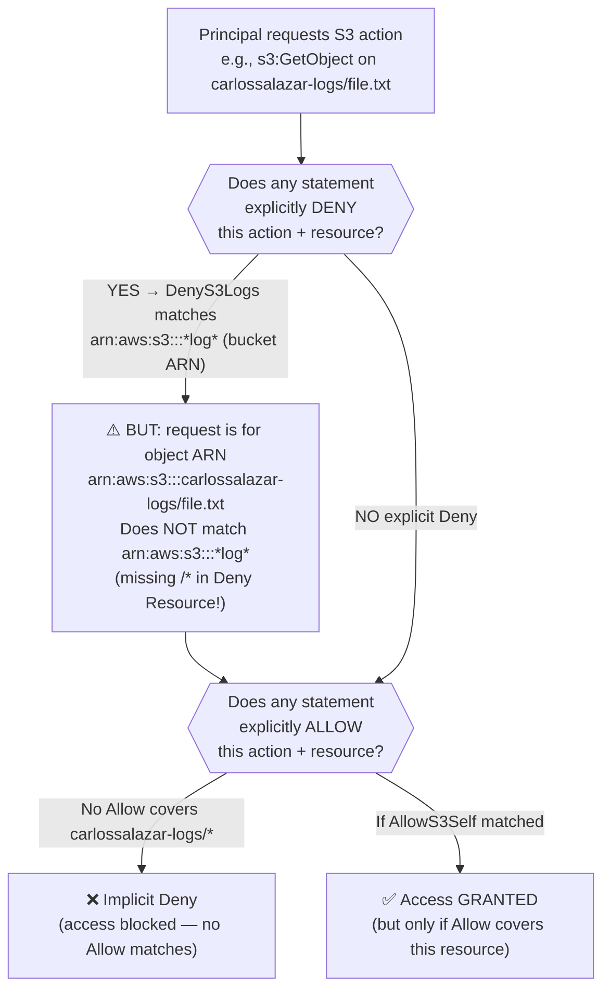
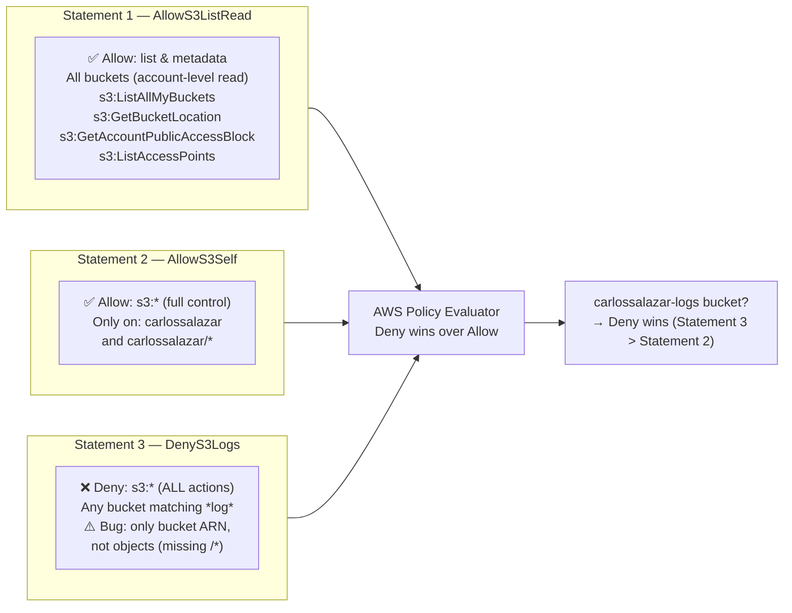
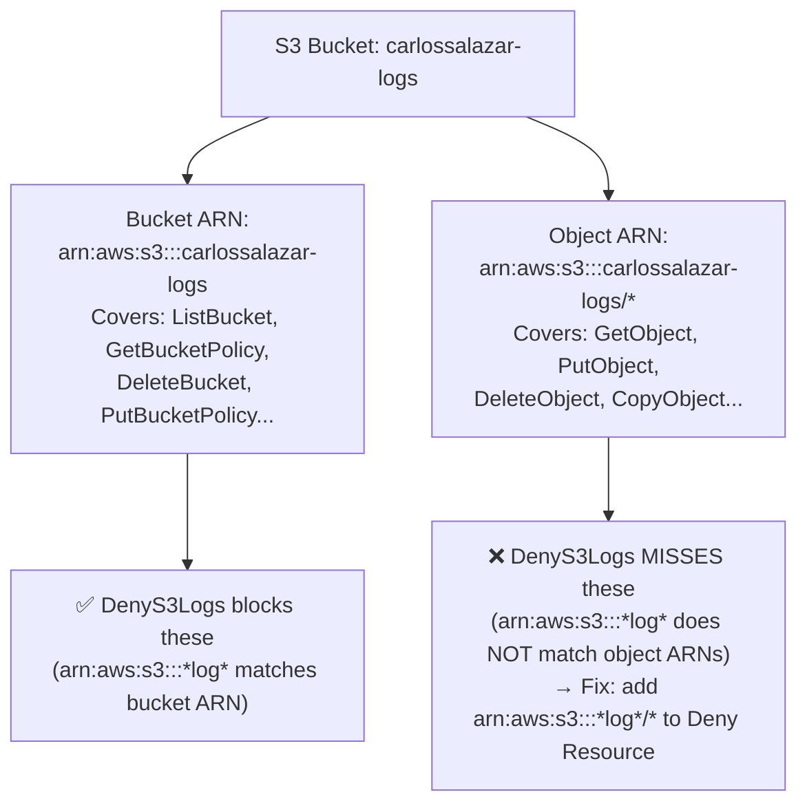

# AWS Question 4 — How Do You Read and Explain an IAM Policy in an Interview?

> **Section:** AWS &nbsp;|&nbsp; **Topic:** IAM / Access Control / Policy Analysis &nbsp;|&nbsp; **Level:** Mid (2–5 yrs) &nbsp;|&nbsp; **Frequency:** Very High
>
> _Part of the DevOps & DevSecOps Interview Preparation series._

---

## ❓ The Question

> **"Here is an AWS IAM policy. Walk me through what it does — what does it allow, what does it deny, and what would you improve?"**

The policy you are handed (or shown on a whiteboard):

```json
{
  "Version": "2012-10-17",
  "Statement": [
    {
      "Sid": "AllowS3ListRead",
      "Effect": "Allow",
      "Action": [
        "s3:GetBucketLocation",
        "s3:GetAccountPublicAccessBlock",
        "s3:ListAccessPoints",
        "s3:ListAllMyBuckets"
      ],
      "Resource": "arn:aws:s3:::*"
    },
    {
      "Sid": "AllowS3Self",
      "Effect": "Allow",
      "Action": "s3:*",
      "Resource": [
        "arn:aws:s3:::carlossalazar",
        "arn:aws:s3:::carlossalazar/*"
      ]
    },
    {
      "Sid": "DenyS3Logs",
      "Effect": "Deny",
      "Action": "s3:*",
      "Resource": "arn:aws:s3:::*log*"
    }
  ]
}
```

You may also encounter this phrased as:

- "Tell me what this policy grants and what it restricts."
- "Is there anything wrong or risky about this policy?"
- "What happens if someone has this policy and tries to access `carlossalazar-logs`?"
- "How would you improve this policy to follow the principle of least privilege?"
- "Can you spot the bug in the Deny statement?"

---

## 🎯 Why Interviewers Ask This

Policy-reading questions are a favourite because they test **multiple skills in one shot** — reading JSON, understanding AWS access control, spotting security risks, and communicating clearly under pressure. The interviewer is checking whether you can:

- **Systematically dissect** a policy rather than guessing — showing a repeatable, methodical approach.
- **Understand resource scoping** — the critical difference between `arn:aws:s3:::bucket-name` (bucket-level) and `arn:aws:s3:::bucket-name/*` (object-level), and why both matter.
- **Know the Deny-wins rule cold** — that explicit `Deny` overrides any `Allow` in any policy.
- **Spot the gotchas** — like the wildcard `*log*` accidentally matching buckets like `carlossalazar-logs`, `catalog`, or `dialog`, and the missing `/*` in the Deny statement.
- **Suggest real improvements** — narrowing `s3:*`, adding `Condition` blocks, fixing resource scoping — which shows you think like a security engineer, not just an operator.
- **Communicate clearly** — in real interviews you say this out loud while someone watches, so your articulation matters as much as your knowledge.

> **The instant win in this interview:** Immediately call out the `*log*` wildcard caveat AND the missing `arn:aws:s3:::*log*/*` in the Deny — these two gotchas are the hidden tests embedded in the policy.

---

## 📖 Key Terminologies

| Term | Plain-English meaning |
| --- | --- |
| **IAM Policy** | A JSON document that defines permissions — what a principal (user/role) is allowed or denied to do on which AWS resources. |
| **Statement** | One individual permission block inside a policy. A policy can have many statements. |
| **Sid (Statement ID)** | A human-readable label for a statement — optional but strongly recommended for readability and debugging. |
| **Effect** | `Allow` or `Deny`. Only two values exist. `Deny` always wins when both match. |
| **Action** | The API operation(s) being permitted or denied (e.g., `s3:GetObject`, `ec2:DescribeInstances`). Wildcards (`s3:*`) cover all actions in a service. |
| **Resource** | The ARN(s) of the AWS resource(s) the statement applies to. `*` means all resources. |
| **Principal** | *Who* the policy applies to — used in resource-based policies (e.g., bucket policies). In identity-based IAM policies, the principal is implied (the user/role the policy is attached to). |
| **Condition** | Optional logical tests that must be true for the statement to apply (e.g., `aws:SourceIp`, `aws:MultiFactorAuthPresent`). |
| **Explicit Deny** | A `"Effect": "Deny"` statement. **Always wins** over any Allow — no exceptions. |
| **Implicit Deny** | The AWS default — if no statement allows an action, it is denied. An explicit Allow elsewhere can override an implicit deny; an explicit Deny cannot be overridden. |
| **Bucket-level ARN** | `arn:aws:s3:::bucket-name` — covers bucket-level API calls like `s3:ListBucket`, `s3:GetBucketPolicy`. |
| **Object-level ARN** | `arn:aws:s3:::bucket-name/*` — covers object-level API calls like `s3:GetObject`, `s3:PutObject`, `s3:DeleteObject`. |
| **Least Privilege** | Only granting the minimum permissions needed. `s3:*` violates this; a specific action list like `["s3:GetObject", "s3:PutObject"]` follows it. |
| **ARN Wildcard** | `*` and `?` can be used in ARN Resource fields. `arn:aws:s3:::*log*` matches any bucket with `log` anywhere in its name — including unintended ones. |

---

## 🗣️ How to Answer (Structured — say this out loud in the interview)

> **Pro tip:** Always narrate your thought process. Interviewers are watching *how* you think, not just your final answer. Use the 5-step framework below.

### Step 1 — State the version and structure (5 seconds)

> "This is a Version 2012-10-17 IAM policy — the standard modern language version. It has three statements: two Allows and one explicit Deny."

### Step 2 — Walk each statement (one by one)

**Statement 1 — `AllowS3ListRead`:**
> "This allows four specific read/listing actions — `GetBucketLocation`, `GetAccountPublicAccessBlock`, `ListAccessPoints`, and `ListAllMyBuckets` — scoped to `arn:aws:s3:::*`, which is a bucket-level wildcard. The practical effect is that the principal can list and read metadata about any bucket in the account. This is the 'navigation' permission — what lets a user see the list of buckets in the AWS Console.
>
> One thing I'd flag: `s3:ListAllMyBuckets` and some account-level S3 APIs do not support resource-level scoping — they require `"Resource": "*"` to function correctly. The current `arn:aws:s3:::*` may silently fail for those actions. I'd verify each action in the AWS docs."

**Statement 2 — `AllowS3Self`:**
> "This grants `s3:*` — full control over all S3 actions — but scoped tightly to the bucket `carlossalazar` and its objects (both `arn:aws:s3:::carlossalazar` and `arn:aws:s3:::carlossalazar/*`). This looks like a personal-bucket permission pattern — the user gets full access to their own bucket only. Including both ARNs is correct: the bucket ARN is needed for bucket-level operations like `s3:ListBucket`, and the `/*` ARN is needed for object-level operations like `s3:GetObject` and `s3:PutObject`."

**Statement 3 — `DenyS3Logs` (the gotcha statement):**
> "This is an explicit Deny for `s3:*` on `arn:aws:s3:::*log*` — any bucket whose name contains the substring `log`. Since it's an explicit Deny, it wins over any Allow — including the full `s3:*` Allow in Statement 2.
>
> Here are **two bugs I'd flag immediately:**
>
> **Bug 1 — Missing object-level ARN in the Deny.** The Resource is `arn:aws:s3:::*log*` — this is a bucket ARN only. Object-level API calls like `s3:GetObject` are evaluated against `arn:aws:s3:::bucket-name/object-key` — not the bucket ARN. So the Deny only blocks bucket-level operations on `*log*` buckets. Object-level operations (GetObject, PutObject, DeleteObject, etc.) on objects inside those buckets are **not denied**. The fix: add `arn:aws:s3:::*log*/*` to the Resource list.
>
> **Bug 2 — Wildcard over-matching.** `*log*` matches `catalog`, `dialog`, `blog-storage`, or any bucket name that coincidentally contains `log`. If the user's intended target was only dedicated log buckets, this is too broad. Always validate wildcard patterns against your actual bucket naming convention."

### Step 3 — State the combined real-world effect

> "Putting it all together: this principal can list all buckets and read their metadata (Statement 1). They have full control over `carlossalazar` (Statement 2). But they are explicitly blocked from all S3 bucket-level operations on any bucket with `log` in its name — including, critically, `carlossalazar-logs` if it exists, because it matches `*log*` and the Deny wins over the Allow in Statement 2. Object-level operations inside log-named buckets are currently **not blocked** due to the missing `/*` in the Deny."

### Step 4 — Name the improvements (this is what separates good candidates)

> "I'd suggest four improvements: one, replace `s3:*` in AllowS3Self with only the specific actions the user actually needs — least privilege. Two, fix the Deny to include both `arn:aws:s3:::*log*` and `arn:aws:s3:::*log*/*` to block objects too. Three, verify that `s3:ListAllMyBuckets` works with `arn:aws:s3:::*` — it may need `"Resource": "*"`. Four, add Condition keys for extra control — for example, requiring MFA for destructive operations (`s3:DeleteObject`) on the personal bucket."

### Step 5 — Close with the security principle

> "The pattern here is a personal-bucket scoped policy with a protective Deny layer for log buckets — a reasonable structure, but with a few precision issues that could leave log data exposed or inadvertently block access to unintended buckets. I'd fix the Deny ARN scope, narrow the Allow actions, and validate the wildcard pattern."

---

## 🔐 Security Perspective (DevSecOps)

Policy analysis is one of the most critical security skills in AWS. Here's the DevSecOps lens:

- **Explicit Deny is your hardest control — use it deliberately.** In IAM policy evaluation, `Deny` in any applicable policy — IAM, bucket policy, SCP, permission boundary — overrides all Allows. A well-placed Deny in a policy like `DenyS3Logs` is a strong guard rail, but only if the Resource scope is complete (bucket + objects).

- **`s3:*` is a least-privilege violation.** Granting `s3:*` on even a single bucket means the principal can `s3:DeleteBucket`, `s3:PutBucketPolicy`, `s3:PutBucketPublicAccessBlock` (disable protection!), `s3:PutBucketAcl`, and more — not just read/write objects. Always enumerate the actions you actually need.

- **Wildcard ARN matching in Deny can have blast radius.** `*log*` could accidentally match `carlossalazar-blog-assets`, `catalog-backup`, or `analogs-2024`. In a large account with many teams, this pattern could silently block other teams' buckets. Always validate your wildcard patterns against your bucket inventory.

- **The missing `/*` in the Deny is a real-world gap.** The Deny blocks `s3:ListBucket` (bucket-level) but NOT `s3:GetObject` (object-level). An attacker who can enumerate object keys via another path could still exfiltrate objects from a `*log*` bucket. The fix is one line — `"arn:aws:s3:::*log*/*"` — but missing it leaves data exposed.

- **Condition blocks are under-used.** Adding `Conditions` turns a blunt allow/deny into a context-aware control. Examples: `aws:MultiFactorAuthPresent: "true"` to require MFA for deletes, `aws:SourceVpc` to limit access to requests originating from your VPC, `s3:prefix` to limit `ListBucket` to a specific key prefix. These are the difference between a policy and a *security policy*.

- **Service Control Policies (SCPs) are the ceiling above all this.** Even a perfectly written IAM policy can be overridden or restricted by an SCP set at the AWS Organizations level. In a DevSecOps interview, mention that you'd always review SCPs alongside IAM policies to understand the full access boundary.

- **Policy drift is a real risk.** A policy like this attached to a user directly (not via a role or group) is harder to manage at scale — changes have to be made per-user. Best practice: attach policies to **IAM groups or roles**, not individual users, to prevent drift and improve auditability.

- **Validate everything before you apply.** Use `aws iam simulate-principal-policy` to test what this policy actually allows and denies for specific actions and resources — before it ever hits production.

> **One-liner for the room:** *"Reading a policy is not just JSON parsing — it's reasoning about what the Deny misses, what the wildcards accidentally match, and what `s3:*` secretly allows beyond what the business intended. That's the security engineer's job."*

---

## 🖼️ Visuals

### Mermaid — Policy Evaluation: How AWS resolves the three statements



### Mermaid — The three statements visualised as permission layers



### Mermaid — Bucket ARN vs Object ARN scoping (the critical distinction)



---

## 📊 Quick Reference — Statement-by-Statement Breakdown

| Sid | Effect | Actions | Resource(s) | What it actually does | Gotcha / Bug |
| --- | --- | --- | --- | --- | --- |
| `AllowS3ListRead` | Allow | `s3:GetBucketLocation`, `s3:GetAccountPublicAccessBlock`, `s3:ListAccessPoints`, `s3:ListAllMyBuckets` | `arn:aws:s3:::*` | Lets the principal see all buckets and their metadata — "navigation" permissions | `s3:ListAllMyBuckets` may need `"Resource": "*"` not `arn:aws:s3:::*` — verify per AWS docs |
| `AllowS3Self` | Allow | `s3:*` (all S3 actions) | `arn:aws:s3:::carlossalazar` + `arn:aws:s3:::carlossalazar/*` | Full control over the personal bucket and all its objects | `s3:*` is overly broad — should be narrowed to specific actions needed |
| `DenyS3Logs` | **Deny (Explicit)** | `s3:*` | `arn:aws:s3:::*log*` | Blocks all bucket-level S3 actions on any bucket with `log` in its name | **Two bugs:** (1) Missing `arn:aws:s3:::*log*/*` — object-level operations are not denied; (2) `*log*` can match unintended buckets like `catalog`, `dialog`, `blog-bucket` |

---

## 🛠️ Hands-On: Commands & Syntax

### 1) Simulate the policy before you apply it — `simulate-principal-policy`

```bash
# Simulate what this policy allows for a specific user + action + resource
# Test 1: Can the user list all buckets?
aws iam simulate-principal-policy \
  --policy-source-arn arn:aws:iam::111122223333:user/carlossalazar \
  --action-names s3:ListAllMyBuckets \
  --resource-arns "arn:aws:s3:::*"

# Test 2: Can the user GetObject on their own bucket?
aws iam simulate-principal-policy \
  --policy-source-arn arn:aws:iam::111122223333:user/carlossalazar \
  --action-names s3:GetObject \
  --resource-arns "arn:aws:s3:::carlossalazar/myfile.txt"

# Test 3: Can the user access a log bucket? (should be denied)
aws iam simulate-principal-policy \
  --policy-source-arn arn:aws:iam::111122223333:user/carlossalazar \
  --action-names s3:ListBucket \
  --resource-arns "arn:aws:s3:::carlossalazar-logs"

# Test 4: The GAP — GetObject on a log bucket OBJECT (should be denied but isn't yet)
aws iam simulate-principal-policy \
  --policy-source-arn arn:aws:iam::111122223333:user/carlossalazar \
  --action-names s3:GetObject \
  --resource-arns "arn:aws:s3:::carlossalazar-logs/app.log"
# Result: "allowed" — this proves the bug! DenyS3Logs doesn't cover object ARNs.
```

> `simulate-principal-policy` is the single most powerful tool for validating IAM policies. Run it before every policy change in production — it tells you the exact decision and which statement triggered it.

### 2) Validate the policy JSON with Access Analyzer before applying

```bash
# Validate policy for errors, warnings, and security issues
aws accessanalyzer validate-policy \
  --policy-type IDENTITY_POLICY \
  --policy-document file://q4-policy.json

# Expected findings:
# - WARNING: s3:ListAllMyBuckets does not support resource-level permissions (suggest Resource: *)
# - SUGGESTION: s3:* is overly broad — replace with specific actions
# - SECURITY: DenyS3Logs only covers bucket ARN, not object ARN
```

### 3) Apply the corrected, improved policy via CLI

```bash
# Save the improved policy
cat > q4-policy-improved.json << 'EOF'
{
  "Version": "2012-10-17",
  "Statement": [
    {
      "Sid": "AllowS3ListRead",
      "Effect": "Allow",
      "Action": [
        "s3:GetBucketLocation",
        "s3:GetAccountPublicAccessBlock",
        "s3:ListAccessPoints",
        "s3:ListAllMyBuckets"
      ],
      "Resource": "*"
    },
    {
      "Sid": "AllowS3Self",
      "Effect": "Allow",
      "Action": [
        "s3:GetObject",
        "s3:PutObject",
        "s3:DeleteObject",
        "s3:ListBucket",
        "s3:GetBucketLocation",
        "s3:GetBucketPolicy"
      ],
      "Resource": [
        "arn:aws:s3:::carlossalazar",
        "arn:aws:s3:::carlossalazar/*"
      ]
    },
    {
      "Sid": "DenyS3LogsBucketAndObjects",
      "Effect": "Deny",
      "Action": "s3:*",
      "Resource": [
        "arn:aws:s3:::*log*",
        "arn:aws:s3:::*log*/*"
      ]
    },
    {
      "Sid": "RequireMFAForDeletes",
      "Effect": "Deny",
      "Action": [
        "s3:DeleteObject",
        "s3:DeleteBucket"
      ],
      "Resource": [
        "arn:aws:s3:::carlossalazar",
        "arn:aws:s3:::carlossalazar/*"
      ],
      "Condition": {
        "BoolIfExists": {
          "aws:MultiFactorAuthPresent": "false"
        }
      }
    }
  ]
}
EOF

# Create an IAM policy from the file
aws iam create-policy \
  --policy-name CarlosSalazarS3Policy \
  --policy-document file://q4-policy-improved.json \
  --description "Least-privilege S3 policy for carlossalazar with fixed Deny scope"

# Attach to the user
aws iam attach-user-policy \
  --user-name carlossalazar \
  --policy-arn arn:aws:iam::111122223333:policy/CarlosSalazarS3Policy
```

### 4) Check what policies are attached to a user (audit)

```bash
# List all attached managed policies
aws iam list-attached-user-policies --user-name carlossalazar

# List all inline policies
aws iam list-user-policies --user-name carlossalazar

# Get the full content of an inline policy
aws iam get-user-policy \
  --user-name carlossalazar \
  --policy-name CarlosSalazarInlinePolicy

# Get the effective permissions for the user (all policies combined)
aws iam get-policy-version \
  --policy-arn arn:aws:iam::111122223333:policy/CarlosSalazarS3Policy \
  --version-id v1 \
  --query 'PolicyVersion.Document' \
  --output json | python3 -m json.tool
```

### 5) Infrastructure as Code — Terraform `aws_iam_policy` (improved version)

```hcl
data "aws_caller_identity" "current" {}

data "aws_iam_policy_document" "carlos_s3" {

  # Statement 1: Allow listing/metadata across all buckets
  statement {
    sid    = "AllowS3ListRead"
    effect = "Allow"
    actions = [
      "s3:GetBucketLocation",
      "s3:GetAccountPublicAccessBlock",
      "s3:ListAccessPoints",
      "s3:ListAllMyBuckets",
    ]
    # s3:ListAllMyBuckets requires Resource: * — cannot be scoped to a bucket ARN
    resources = ["*"]
  }

  # Statement 2: Full (but specific) access to personal bucket only
  statement {
    sid    = "AllowS3Self"
    effect = "Allow"
    actions = [
      "s3:GetObject",
      "s3:PutObject",
      "s3:DeleteObject",
      "s3:ListBucket",
      "s3:GetBucketLocation",
      "s3:GetBucketPolicy",
    ]
    resources = [
      "arn:aws:s3:::carlossalazar",
      "arn:aws:s3:::carlossalazar/*",
    ]
  }

  # Statement 3: Deny ALL access on log buckets — bucket AND objects (FIXED)
  statement {
    sid    = "DenyS3LogsBucketAndObjects"
    effect = "Deny"
    actions   = ["s3:*"]
    resources = [
      "arn:aws:s3:::*log*",    # bucket-level
      "arn:aws:s3:::*log*/*",  # object-level — this was MISSING in the original policy
    ]
  }

  # Statement 4: Require MFA for destructive operations (security hardening)
  statement {
    sid    = "RequireMFAForDeletes"
    effect = "Deny"
    actions = [
      "s3:DeleteObject",
      "s3:DeleteBucket",
    ]
    resources = [
      "arn:aws:s3:::carlossalazar",
      "arn:aws:s3:::carlossalazar/*",
    ]
    condition {
      test     = "BoolIfExists"
      variable = "aws:MultiFactorAuthPresent"
      values   = ["false"]
    }
  }
}

resource "aws_iam_policy" "carlos_s3" {
  name        = "CarlosSalazarS3Policy"
  description = "Least-privilege S3 policy for carlossalazar with fixed Deny scope and MFA guard"
  policy      = data.aws_iam_policy_document.carlos_s3.json
}

resource "aws_iam_user_policy_attachment" "carlos_s3" {
  user       = "carlossalazar"
  policy_arn = aws_iam_policy.carlos_s3.arn
}
```

### 6) Generate a least-privilege policy from actual CloudTrail usage (2024 pattern)

```bash
# Step 1: Enable IAM Access Analyzer policy generation
# (it analyses CloudTrail logs to see what the user actually calls)
aws accessanalyzer start-policy-generation \
  --policy-generation-details '{"principalArn": "arn:aws:iam::111122223333:user/carlossalazar"}' \
  --cloud-trail-details '{
    "trails": [{"cloudTrailArn": "arn:aws:cloudtrail:us-east-1:111122223333:trail/main-trail", "allRegions": true}],
    "accessRole": "arn:aws:iam::111122223333:role/AccessAnalyzerRole",
    "startTime": "2025-01-01T00:00:00Z",
    "endTime": "2025-05-01T00:00:00Z"
  }'

# Step 2: Retrieve the generated policy (once job completes)
aws accessanalyzer get-generated-policy \
  --job-id <job-id-from-above> \
  --query 'generatedPolicyResult.generatedPolicies[0].policy' \
  --output text | python3 -m json.tool
```

> This is the modern, AI-backed way to build least-privilege policies. Instead of guessing what actions to allow, AWS analyses actual CloudTrail activity and writes the narrowest policy that covers real usage.

---

## 🤖 AI & The New Trend (2024–2025) — what changed, and what to learn

> Policy reading and writing is one of the areas most directly transformed by AI in 2024–2025. The tools below turn a slow, error-prone manual task into a fast, validated, auditable workflow.

### How AI is impacting IAM policy management

- **IAM Access Analyzer policy generation (ML-powered, 2024)** — AWS now analyses up to 90 days of CloudTrail history for a principal and auto-generates the narrowest IAM policy that covers what they *actually did*. This eliminates the biggest source of over-permissioning: "I'm not sure what they need, so I'll give them `s3:*`." It replaces guesswork with observation.

- **Access Analyzer policy validation with AI reasoning** — The `ValidatePolicy` API and the new `CheckNoPublicAccess` / `CheckAccessNotGranted` APIs (2024) use AWS's internal policy reasoning engine to catch bugs *before* deployment — things like missing `/*` in Deny statements, incorrect resource scoping, or overly broad wildcards. This is CI/CD-ready security gating.

- **Amazon Q Developer — policy authoring assistant** — Amazon Q can generate, explain, and debug IAM policies in natural language. You describe what you want ("block carlossalazar from all buckets with 'log' in the name including their objects") and it generates the correct JSON, including both the bucket and `/*` ARN. It also explains existing policies line by line — exactly what this interview question tests.

- **AI-driven anomaly detection (GuardDuty IAM findings)** — GuardDuty uses ML to detect when a principal is calling APIs they've never called before, accessing resources outside their normal pattern, or making policy changes that expand permissions. It catches over-permissioned policies being *exploited* — the runtime complement to static policy analysis.

- **AWS Config + Security Hub continuous compliance** — Config rules like `iam-user-no-policies-check` (no inline policies, use groups/roles), `iam-policy-no-statements-with-admin-access`, and `s3-bucket-policy-not-more-permissive` now feed into Security Hub's AI-prioritised findings, so you're alerted to policy drift automatically.

### How AI can contribute to your day-to-day

- **Explain any policy instantly** — Paste a complex 20-statement IAM policy into Amazon Q or any LLM and ask *"explain this line by line, call out any security risks, and suggest improvements."* The same analysis that this question tests manually, done in 10 seconds.
- **Generate test cases** — Ask an LLM *"give me 10 `simulate-principal-policy` test cases that would prove this policy is correct and that the Deny works as intended."*
- **Review before merge** — In CI/CD, run `accessanalyzer validate-policy` on every IAM policy change in a PR — a free, automated policy security gate.
- **Explain access denied errors** — Paste an `AccessDenied` error + the relevant policies into an LLM to get an instant diagnosis of which statement is blocking the action and what to change.

### ⚠️ Security caveat (DevSecOps)

- **AI-generated IAM policies default to over-permission.** LLMs tend to suggest `s3:*` or `"Resource": "*"` when uncertain. Always review against the principle of least privilege.
- **Never paste full policy documents containing account IDs, role ARNs, or resource names into public AI tools.** Use Amazon Q or Bedrock within your AWS environment.
- **`simulate-principal-policy` is the ground truth — not the LLM.** Use the AI to draft, then validate with AWS's own simulation engine before applying.
- **Policy generation from CloudTrail is a point-in-time snapshot.** If the user hasn't yet performed an action they'll need in the future (e.g., a disaster recovery operation), the generated policy won't include it. Supplement AI-generated policies with human review of edge cases.

### What to learn right now (priority order)

1. **`aws iam simulate-principal-policy`** — the most important hands-on IAM skill; test every policy change.
2. **`aws accessanalyzer validate-policy`** — free, automated, CI-ready policy security gate.
3. **IAM Access Analyzer policy generation from CloudTrail** — the AI-powered path to least privilege.
4. **`CheckNoPublicAccess` + `CheckAccessNotGranted` APIs** — programmatic policy correctness checks.
5. **Bucket vs object ARN scoping for S3** — the #1 source of subtle S3 permission bugs.
6. **Condition keys** — `aws:MultiFactorAuthPresent`, `aws:SourceVpc`, `aws:PrincipalOrgID`, `s3:prefix` — turning blunt policies into precise controls.

---

## ✅ Prerequisites (be solid on these first)

- **IAM fundamentals** — users, groups, roles, policies (managed vs inline), and how they relate.
- **IAM policy JSON structure** — `Version`, `Statement`, `Sid`, `Effect`, `Action`, `Resource`, `Condition` — know what each field does.
- **AWS policy evaluation logic** — Explicit Deny → Explicit Allow → Implicit Deny. This is the backbone of every access-control answer.
- **S3 ARN structure** — `arn:aws:s3:::bucket` vs `arn:aws:s3:::bucket/*` and why the difference matters for S3 permissions.
- **Principle of least privilege** — why `s3:*` is a red flag, and how to enumerate specific actions.
- **(Bonus) AWS IAM Access Analyzer** — policy validation, public access detection, and policy generation.
- **(Bonus) SCPs (Service Control Policies)** — understanding that IAM policies operate within the boundary set by SCPs at the org level.

---

## 📚 Further Reading (current docs)

- **IAM policy elements reference** — AWS docs: <https://docs.aws.amazon.com/IAM/latest/UserGuide/reference_policies_elements.html>
- **IAM JSON policy evaluation logic** — AWS docs: <https://docs.aws.amazon.com/IAM/latest/UserGuide/reference_policies_evaluation-logic.html>
- **Amazon S3 actions, resources, and condition keys** — AWS docs: <https://docs.aws.amazon.com/service-authorization/latest/reference/list_amazons3.html>
- **simulate-principal-policy** — AWS docs: <https://docs.aws.amazon.com/IAM/latest/UserGuide/access_policies_testing-policies.html>
- **IAM Access Analyzer — validate-policy** — AWS docs: <https://docs.aws.amazon.com/IAM/latest/UserGuide/access-analyzer-policy-validation.html>
- **IAM Access Analyzer — generate policy from CloudTrail** — AWS docs: <https://docs.aws.amazon.com/IAM/latest/UserGuide/access-analyzer-policy-generation.html>
- **CheckAccessNotGranted API** — AWS docs: <https://docs.aws.amazon.com/access-analyzer/latest/APIReference/API_CheckAccessNotGranted.html>
- **IAM policy condition keys** — AWS docs: <https://docs.aws.amazon.com/IAM/latest/UserGuide/reference_policies_condition-keys.html>
- **IAM best practices** — AWS docs: <https://docs.aws.amazon.com/IAM/latest/UserGuide/best-practices.html>
- **Terraform aws_iam_policy_document** — Terraform docs: <https://registry.terraform.io/providers/hashicorp/aws/latest/docs/data-sources/iam_policy_document>
- **KodeKloud lesson (video):** <https://learn.kodekloud.com/user/courses/devops-interview-preparation-course/module/f1169a2e-23de-4377-bc4f-a07c136a11d6/lesson/b3e105db-c4f0-4634-bcb9-9d446891ee82>

---

## 🔁 Related / Follow-up Questions (they often go here next)

1. **What is the order of policy evaluation in AWS?** → Explicit Deny (any policy) → Explicit Allow → Implicit Deny. Deny always wins; if nothing grants access, it's denied by default.
2. **What's the difference between a managed policy and an inline policy?** → Managed (AWS or customer): reusable, attached to multiple principals, versioned, easier to audit. Inline: embedded directly in a single user/role/group, harder to audit at scale. Best practice: use customer-managed policies, avoid inline except for very specific binding requirements.
3. **What's a permission boundary and how does it differ from an SCP?** → Permission boundary is an IAM feature that sets the *maximum* permissions an identity-based policy can grant for a specific user or role (not a grant itself). SCP is an Organizations feature that sets the maximum for an entire account or OU. Both are ceiling-setters, not grant-givers.
4. **Why does `s3:ListAllMyBuckets` sometimes need `"Resource": "*"`?** → Some S3 APIs are account-level calls that don't operate on a specific bucket — they can't be scoped to a bucket ARN. AWS requires `"Resource": "*"` for these. Always check the S3 service authorization reference to see which actions support resource-level permissions.
5. **What does `s3:*` actually include beyond read/write?** → It includes `s3:DeleteBucket`, `s3:PutBucketPolicy` (write a new bucket policy), `s3:PutBucketPublicAccessBlock` (disable public access protection), `s3:PutBucketAcl`, `s3:PutEncryptionConfiguration`, and many more — far more destructive than "just get/put objects."
6. **How would you add MFA enforcement to an IAM policy?** → Add a Deny statement with `Condition: {"BoolIfExists": {"aws:MultiFactorAuthPresent": "false"}}` on the sensitive actions. This denies the action unless MFA was used to authenticate — a common requirement for delete operations.
7. **What is the `Condition` block used for?** → Adds context-aware constraints: require MFA, restrict to a source IP/VPC, require a specific tag on resources, require encryption headers on S3 puts, limit to specific times of day. Conditions are the most under-used power feature of IAM.
8. **Can `s3:*` in AllowS3Self override the DenyS3Logs Deny?** → No. The explicit Deny in `DenyS3Logs` always wins over any Allow, including the `s3:*` Allow in `AllowS3Self`. If the user tries any S3 action on a `*log*` bucket, they're blocked — regardless of what AllowS3Self says.
9. **How would you test that the Deny is working as intended?** → Use `aws iam simulate-principal-policy` with the target action (e.g., `s3:GetObject`) and the log bucket + object ARN as the resource. Also test the gap: run the same simulation against a `*log*` bucket's object ARN to confirm it's blocked (and to catch the missing `/*` bug).
10. **What happens if a user has two IAM policies and one has an Allow, the other has a Deny for the same action?** → The Deny wins. In AWS, all applicable policies are evaluated together — the most restrictive applicable statement always takes effect.
11. **How do you prevent the `*log*` wildcard from over-matching?** → Either use a more precise naming convention (e.g., `logs-*` instead of relying on substring matching), use a Condition to narrow the Deny (e.g., `StringLike` on a bucket tag), or list the specific bucket ARNs rather than using a wildcard — at the cost of maintainability.
12. **What is the principle of least privilege and how does this policy violate it?** → PoLP = grant only what is needed, nothing more. `AllowS3Self` uses `s3:*` which grants destructive operations (DeleteBucket, PutBucketPolicy) far beyond what a typical user needs. The fix is to enumerate only the specific actions required.
13. **How would you audit this policy's real-world effect across a large AWS estate?** → Use IAM Access Analyzer to scan for external access, `simulate-principal-policy` for spot checks, AWS Config rules for continuous compliance, and the CloudTrail-based policy generation to compare what's allowed vs what's actually being used — and tighten accordingly.

---

> 📌 **30-second interview summary:** This policy has three statements — two Allows and one explicit Deny. `AllowS3ListRead` grants bucket listing and metadata reads across all buckets (but verify `s3:ListAllMyBuckets` needs `"Resource": "*"`). `AllowS3Self` grants full S3 access to the `carlossalazar` bucket and its objects only. `DenyS3Logs` explicitly blocks all S3 access on any bucket containing `log` in its name — and since explicit Deny always wins, this overrides AllowS3Self for any `*log*` bucket. **Two bugs to call out:** (1) the Deny only covers bucket ARNs, not object ARNs — add `arn:aws:s3:::*log*/*` to block object-level operations too; (2) `*log*` wildcards can accidentally match `catalog`, `dialog`, or `blog-storage`. **Three improvements:** replace `s3:*` with specific actions (least privilege), fix the Deny Resource scope, and add MFA `Condition` blocks for destructive operations.
