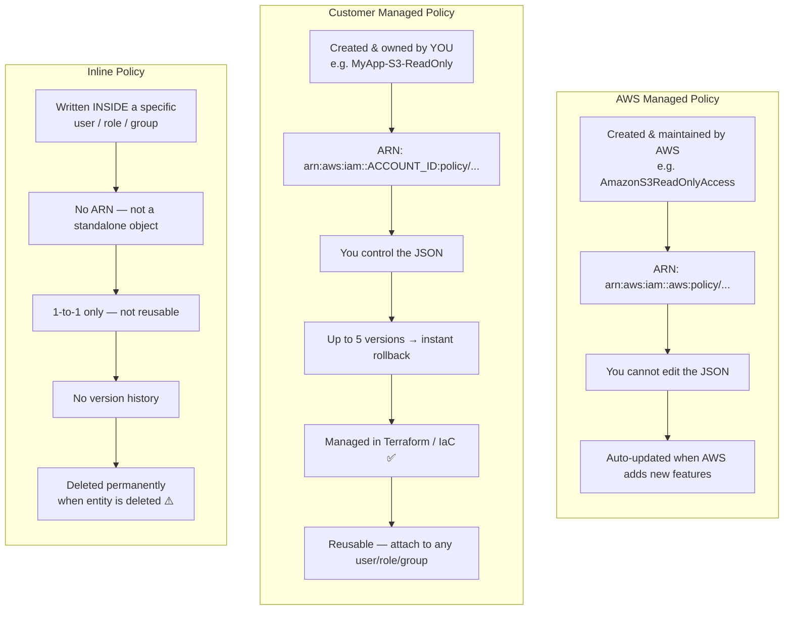
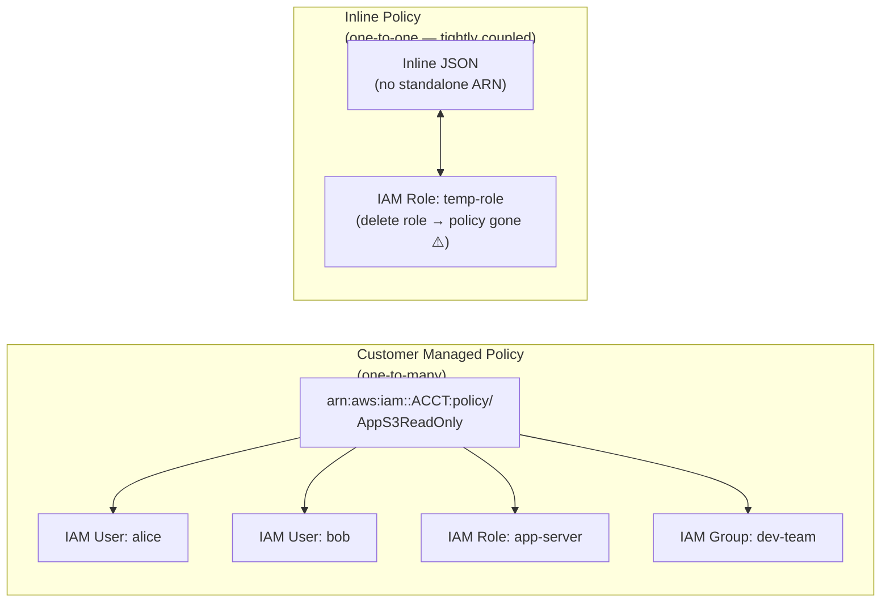
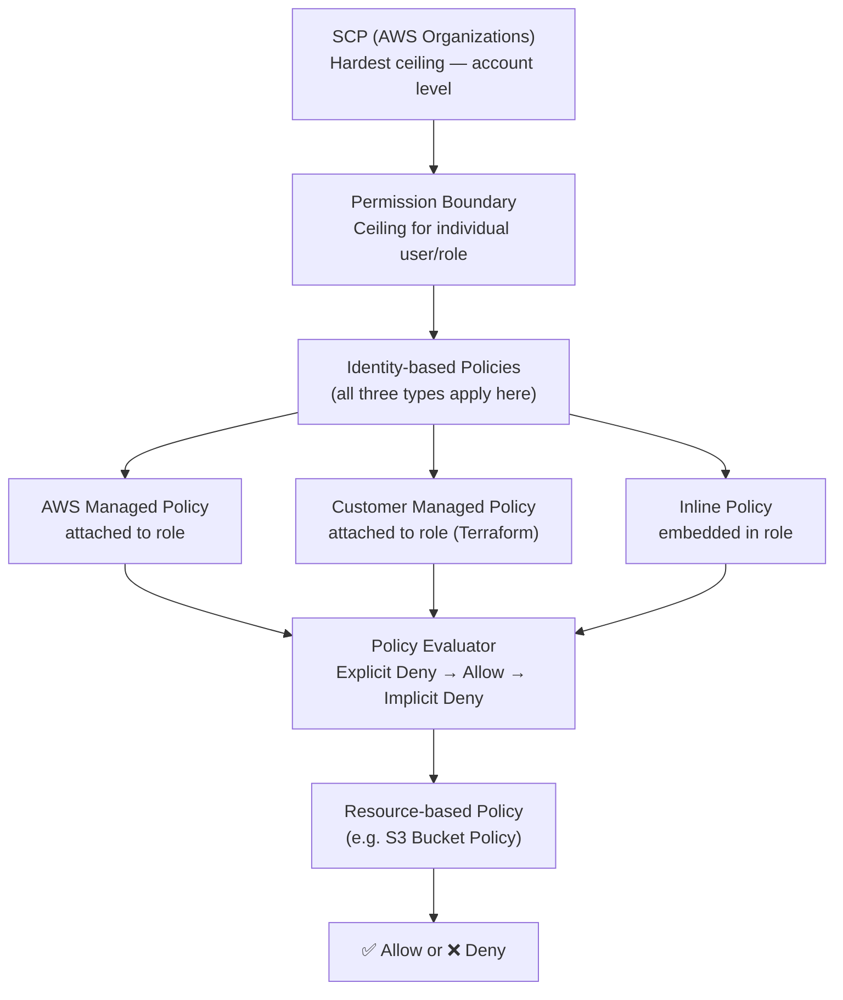

# AWS Question 6 — What Are the Three Types of IAM Policies in AWS?

> **Section:** AWS &nbsp;|&nbsp; **Topic:** IAM / Identity & Access Management &nbsp;|&nbsp; **Level:** Mid (2–5 yrs) &nbsp;|&nbsp; **Frequency:** Very High
>
> _Part of the DevOps & DevSecOps Interview Preparation series._

---

## ❓ The Question

> **"Can you explain the different types of IAM policies in AWS and when you would use each?"**

Common variations:

- "What is the difference between a managed policy and an inline policy?"
- "When would you choose a customer managed policy over an AWS managed policy?"
- "Why should you avoid inline policies in production?"
- "How do you manage IAM policies at scale using Terraform?"
- "What happens to an inline policy if you delete the IAM user it's attached to?"

---

## 🎯 Why Interviewers Ask This

IAM is the **security backbone of AWS** — every action in your account flows through it. This question tests whether you understand the tools you use to control access, not just that access control exists. Interviewers check whether you can:

- **Distinguish three policy types** by their ownership model, lifecycle, and reusability — not just recite definitions.
- **Reason about policy governance at scale** — a company with 200 IAM roles cannot manage inline policies; they need reusable, version-controlled customer managed policies.
- **Flag the inline policy anti-pattern** — inline policies are a governance and audit nightmare at scale; knowing this shows security maturity.
- **Connect IaC to IAM** — managed policies via Terraform is the real-world standard; mentioning it signals you work at production level, not just console-clicking.
- **Understand the policy type hierarchy** in combination with SCPs and permission boundaries — showing you think architecturally, not just procedurally.

> **The instant win:** Lead with "There are three types — AWS managed, customer managed, and inline — and in production I almost always use customer managed policies via Terraform because they're reusable, versionable, and auditable. I use inline policies only for very specific, temporary bindings."

---

## 📖 Key Terminologies

| Term | Plain-English meaning |
| --- | --- |
| **IAM Policy** | A JSON document defining what actions are allowed or denied on which AWS resources for a given principal (user/role/group). |
| **AWS Managed Policy** | A policy created, maintained, and versioned by **AWS** itself. Read-only for customers — you cannot edit it. Prefixed with `arn:aws:iam::aws:policy/`. |
| **Customer Managed Policy** | A policy you create and own in your AWS account. You control the JSON, versioning, and which entities it's attached to. Best practice for production. |
| **Inline Policy** | A policy written directly **inside** an IAM user, group, or role — not a standalone object. Deleted permanently when the entity is deleted. |
| **Policy Version** | Customer managed policies support up to 5 versions. You can roll back to a previous version instantly. AWS managed policies are versioned by AWS. |
| **Attached Policy** | A managed policy (AWS or customer) that has been linked to an IAM entity — one-to-many relationship (one policy → many entities). |
| **Reusability** | Whether a policy can be attached to multiple users/roles/groups. Managed policies ✅ — Inline policies ❌ (one-to-one only). |
| **Policy ARN** | The unique identifier for a managed policy: `arn:aws:iam::111122223333:policy/MyPolicy` (customer) or `arn:aws:iam::aws:policy/AmazonS3ReadOnlyAccess` (AWS managed). |
| **Trust Policy** | A special type of policy attached to an IAM **role** that defines *who can assume the role* (not what it can do). Separate from permission policies. |
| **Permission Boundary** | An advanced IAM feature that sets the maximum permissions a user or role can ever have — a ceiling above both managed and inline policies. |
| **Service Control Policy (SCP)** | AWS Organizations-level policy that sets the maximum permissions for an entire account or OU — above everything else, including managed and inline policies. |

---

## 🗣️ How to Answer (Structured)

### Step 1 — Frame the three types in one sentence

> "AWS IAM has three policy types: **AWS managed** (pre-built by AWS), **customer managed** (built and owned by you, reusable across entities), and **inline** (embedded directly inside one specific entity, deleted with it). In production I almost exclusively use customer managed policies."

### Step 2 — Explain AWS Managed Policies

> "AWS managed policies are permission sets that AWS pre-builds and maintains — things like `AmazonS3ReadOnlyAccess`, `AmazonEC2FullAccess`, `AdministratorAccess`. AWS updates them automatically when new services or features launch, so you don't have to manually add new S3 actions as they're released. They're great for getting started quickly or for standard service roles — like the execution role AWS suggests when you create a Lambda function. The limitation is that you can't edit them — if you need to tweak permissions, you have to create a customer managed policy instead."

### Step 3 — Explain Customer Managed Policies (the production standard)

> "Customer managed policies are the policies I create in my own account to match my organisation's specific access requirements. They're standalone objects with their own ARN, can be attached to any number of users, roles, or groups, support up to five versions (so I can roll back instantly), and — most importantly — I manage them via **Terraform**, which means they're version-controlled in Git, code-reviewed in PRs, and applied through a CI/CD pipeline. Every time I need to adjust permissions for a team or service, I update the Terraform, raise a PR, get it reviewed, and apply — full audit trail, no console clicking."

### Step 4 — Explain Inline Policies (and why to avoid them at scale)

> "Inline policies are written directly inside an IAM entity — they don't exist as a separate object. The key behaviours: they're 1-to-1 (one inline policy belongs to exactly one user/role/group), they're deleted permanently when the entity is deleted, and they don't appear in the 'Policies' section of the IAM console — they're only visible inside the entity itself. This makes them hard to audit at scale. They're useful for temporary or highly specific access — like giving a one-off IAM role a very specific Deny that should die with the role — but I would never use them for standard production permissions."

### Step 5 — State your real-world standard

> "My production standard is: use AWS managed policies for broad, standard permissions where AWS's pre-built definitions are sufficient. Use customer managed policies — managed in Terraform — for everything custom. Use inline policies only for exceptional cases where the tight coupling to the entity is intentional and the policy should never be reused. The goal is auditable, DRY, and least-privilege."

---

## 🔍 Deep Dive: The Three Policy Types

### Type 1 — AWS Managed Policies

These are policies **owned and maintained by AWS**. You can attach them to your IAM entities but cannot modify their JSON.

**How to identify them:** Their ARN contains `::aws:` instead of your account ID.
```
arn:aws:iam::aws:policy/AmazonS3ReadOnlyAccess          ← AWS managed
arn:aws:iam::111122223333:policy/MyCustomPolicy          ← Customer managed
```

**Examples of common AWS managed policies:**

| Policy Name | What it grants |
| --- | --- |
| `AdministratorAccess` | Full access to all AWS services and resources |
| `PowerUserAccess` | Full access except IAM and Organizations management |
| `AmazonS3ReadOnlyAccess` | Read-only access to all S3 buckets |
| `AmazonEC2FullAccess` | Full EC2 control |
| `AmazonEKSClusterPolicy` | Minimum permissions for EKS cluster role |
| `AWSLambdaBasicExecutionRole` | Lambda → CloudWatch Logs (standard Lambda execution role) |
| `ReadOnlyAccess` | Read-only access to all AWS services |

**When to use:** Standard service roles (Lambda, EKS, EC2 Instance Profile for SSM), quick proof-of-concepts, broad read-only access for auditors.

**When NOT to use:** Anything that requires least-privilege customisation — `AmazonS3ReadOnlyAccess` grants read to ALL buckets; if you only need one bucket, write a customer managed policy.

---

### Type 2 — Customer Managed Policies

**Owned by you**, stored in your AWS account, attached to any IAM entity, versioned (up to 5 versions), managed via Terraform or CloudFormation in production.

**Lifecycle:**
1. You create the policy (console, CLI, or Terraform)
2. It gets its own ARN: `arn:aws:iam::ACCOUNT_ID:policy/PolicyName`
3. You attach it to one or more users/roles/groups
4. You update it → a new version is created (up to 5 versions; you promote the default version)
5. You can detach from all entities and delete it independently

**Key advantages over inline:**
- Reusable across many entities — define once, attach everywhere
- Version history with instant rollback
- Visible in the Policies section of the IAM console — auditable
- Can be managed with IaC and code review

---

### Type 3 — Inline Policies

**Embedded directly inside** one specific IAM user, group, or role. Not a standalone object — no ARN, no version history, no reusability.

**The critical lifecycle rule:** If the IAM entity (user/role/group) is **deleted**, the inline policy is **permanently deleted** with it — no recovery.

**When inline policies make sense (rare):**
- You want a permission to be *inseparable* from a role — when the role is gone, the permission must die too
- Temporary access grants for a short-lived role
- Very specific Deny that should not be accidentally attached to other roles

**Why to avoid at scale:**
- Not reusable — you'd copy-paste the same JSON into 50 roles
- No version history — no easy rollback
- Hard to audit — you can't list all inline policies across all entities in one view
- Violates DRY (Don't Repeat Yourself) principle

---

## 🔐 Security Perspective (DevSecOps)

IAM policy type selection is a **governance and security architecture decision**, not just an operational preference:

- **Customer managed > AWS managed for least privilege.** AWS managed policies like `AmazonS3ReadOnlyAccess` (all buckets) or `AmazonEC2FullAccess` (all EC2) are broad by design. In production, you almost always need narrower permissions. A customer managed policy lets you scope to specific resources, add conditions (MFA, VPC, tag-based), and apply the principle of least privilege precisely.

- **Inline policies are an audit and compliance anti-pattern.** SOC 2, PCI-DSS, ISO 27001, and most security frameworks require you to be able to enumerate *who has what permissions*. Inline policies buried inside individual IAM entities make this nearly impossible to audit systematically. **AWS Config rule `iam-user-no-policies-check`** flags IAM users with inline policies directly attached — a common compliance baseline.

- **Policy versioning is a security control.** Customer managed policies keep up to 5 versions. If a policy is accidentally over-permissioned or modified incorrectly, you can roll back in seconds via CLI. This is your "undo" button for access control mistakes — inline policies have no such safety net.

- **IaC = auditability + no-surprise changes.** Managing customer managed policies via Terraform means every permission change goes through a PR review, is visible in `terraform plan`, is tracked in Git history, and can be enforced via CI policy gates (OPA/Conftest). Console-created or inline policies bypass all of this — a major DevSecOps red flag.

- **AdministratorAccess should never be attached permanently.** It's an AWS managed policy that grants `"Action": "*", "Resource": "*"`. In production, no service role should have it attached. Use break-glass procedures — time-limited assumption of an admin role — rather than a permanently attached `AdministratorAccess` policy.

- **AWS managed policies can be over-permissive for your context.** AWS writes them to cover all possible use cases for a service. `AWSLambdaVPCAccessExecutionRole` includes `ec2:CreateNetworkInterface` — do all your Lambdas need that? Probably not. Customer managed policies let you grant only what your Lambda actually calls.

- **Permission Boundaries + Customer Managed = defence in depth.** Attach a permission boundary (itself a customer managed policy) to an IAM role to set a hard ceiling on what it can ever do — even if someone accidentally attaches `AdministratorAccess`. This is the standard pattern for vending IAM roles to development teams via a service catalogue.

> **One-liner for the room:** *"AWS managed policies are convenient starting points, but in production I build customer managed policies in Terraform — least-privilege, code-reviewed, auditable, versioned, and rollback-ready. Inline policies are the exception, not the rule, and should never be your default."*

---

## 🖼️ Visuals

### Source image — The three IAM policy types with console screenshot


> 📌 **From the image:** The console shows a role with three policies attached: `AmazonChimeUserManagement` (AWS managed policy), `policy-01` (customer managed policy), and `inline` (inline policy). All three types are visible here — exactly what an interviewer might show you.

### Mermaid — Lifecycle and ownership of the three policy types



### Mermaid — Policy attachment: reusability comparison



### Mermaid — Where policy types fit in AWS policy evaluation



---

## 📊 Quick Comparison — Three Policy Types Side by Side

| | **AWS Managed** | **Customer Managed** | **Inline** |
| --- | --- | --- | --- |
| **Who creates it?** | AWS | You | You |
| **Who maintains it?** | AWS (auto-updates) | You | You |
| **Editable?** | ❌ Read-only | ✅ Full control | ✅ Full control |
| **Has its own ARN?** | ✅ Yes | ✅ Yes | ❌ No |
| **Reusable across entities?** | ✅ Yes (many-to-many) | ✅ Yes (many-to-many) | ❌ No (1-to-1 only) |
| **Version history?** | Managed by AWS | ✅ Up to 5 versions | ❌ None |
| **What happens when entity is deleted?** | Policy persists (just detached) | Policy persists (just detached) | ❌ Policy permanently deleted |
| **Visible in IAM Policies console?** | ✅ Yes | ✅ Yes | ❌ Only inside the entity |
| **IaC / Terraform support?** | Attach by ARN | ✅ Create + attach | ✅ Embed (but not recommended) |
| **Best for** | Standard service roles, quick start | All production permissions | Temporary, highly specific, tightly coupled |
| **Production recommendation** | Use sparingly | ✅ **Default choice** | ❌ Avoid at scale |

> **Mnemonic:** *AWS Managed = "AWS's ready-made, can't touch." Customer Managed = "yours to build, reuse everywhere." Inline = "sticky note on the user — disappears with them."*

---

## 🛠️ Hands-On: Commands & Syntax

### 1) AWS CLI — create and attach a customer managed policy

```bash
# Create a customer managed policy from a JSON file
aws iam create-policy \
  --policy-name AppS3ReadOnly \
  --policy-document file://app-s3-readonly.json \
  --description "Read-only access to app-data bucket for application tier"

# Policy JSON (app-s3-readonly.json)
cat > app-s3-readonly.json << 'EOF'
{
  "Version": "2012-10-17",
  "Statement": [
    {
      "Sid": "AllowListBucket",
      "Effect": "Allow",
      "Action": ["s3:ListBucket", "s3:GetBucketLocation"],
      "Resource": "arn:aws:s3:::app-data-bucket"
    },
    {
      "Sid": "AllowGetObjects",
      "Effect": "Allow",
      "Action": ["s3:GetObject"],
      "Resource": "arn:aws:s3:::app-data-bucket/*"
    }
  ]
}
EOF

# Attach to an IAM role
aws iam attach-role-policy \
  --role-name app-server-role \
  --policy-arn arn:aws:iam::111122223333:policy/AppS3ReadOnly

# Attach to an IAM user
aws iam attach-user-policy \
  --user-name alice \
  --policy-arn arn:aws:iam::111122223333:policy/AppS3ReadOnly

# Attach to an IAM group (preferred — one attach covers all group members)
aws iam attach-group-policy \
  --group-name dev-team \
  --policy-arn arn:aws:iam::111122223333:policy/AppS3ReadOnly
```

### 2) AWS CLI — update a customer managed policy (versioning)

```bash
# Create a new version of the policy (e.g., adding s3:GetObjectTagging)
aws iam create-policy-version \
  --policy-arn arn:aws:iam::111122223333:policy/AppS3ReadOnly \
  --policy-document file://app-s3-readonly-v2.json \
  --set-as-default   # make this the active version immediately

# List all versions of a policy
aws iam list-policy-versions \
  --policy-arn arn:aws:iam::111122223333:policy/AppS3ReadOnly

# Roll back to a previous version (v1) if v2 causes issues
aws iam set-default-policy-version \
  --policy-arn arn:aws:iam::111122223333:policy/AppS3ReadOnly \
  --version-id v1

# Delete old versions to make room (max 5 versions)
aws iam delete-policy-version \
  --policy-arn arn:aws:iam::111122223333:policy/AppS3ReadOnly \
  --version-id v2
```

### 3) AWS CLI — attach an AWS managed policy

```bash
# Attach a pre-built AWS managed policy to a role
aws iam attach-role-policy \
  --role-name lambda-execution-role \
  --policy-arn arn:aws:iam::aws:policy/service-role/AWSLambdaBasicExecutionRole

# List all AWS managed policies (filter by service)
aws iam list-policies \
  --scope AWS \
  --query 'Policies[?contains(PolicyName, `S3`)].{Name:PolicyName,ARN:Arn}' \
  --output table

# See what an AWS managed policy actually contains
aws iam get-policy-version \
  --policy-arn arn:aws:iam::aws:policy/AmazonS3ReadOnlyAccess \
  --version-id v1 \
  --query 'PolicyVersion.Document' \
  --output json | python3 -m json.tool
```

### 4) AWS CLI — create and view an inline policy

```bash
# Add an inline policy directly to a role (NOT recommended for production)
aws iam put-role-policy \
  --role-name temp-data-role \
  --policy-name TempDenyProdBucket \
  --policy-document '{
    "Version": "2012-10-17",
    "Statement": [{
      "Sid": "DenyProdAccess",
      "Effect": "Deny",
      "Action": "s3:*",
      "Resource": [
        "arn:aws:s3:::prod-data-bucket",
        "arn:aws:s3:::prod-data-bucket/*"
      ]
    }]
  }'

# List inline policies on a role (they do NOT appear in the policies console)
aws iam list-role-policies --role-name temp-data-role

# Get the content of an inline policy
aws iam get-role-policy \
  --role-name temp-data-role \
  --policy-name TempDenyProdBucket

# Delete an inline policy (e.g., when temporary access expires)
aws iam delete-role-policy \
  --role-name temp-data-role \
  --policy-name TempDenyProdBucket
```

### 5) Audit — find all inline policies across all roles (DevSecOps must-know)

```bash
# List all roles with inline policies (compliance check)
aws iam list-roles --query 'Roles[*].RoleName' --output text | \
  tr '\t' '\n' | \
  while read role; do
    policies=$(aws iam list-role-policies --role-name "$role" \
      --query 'PolicyNames' --output text 2>/dev/null)
    if [ -n "$policies" ]; then
      echo "Role: $role → Inline policies: $policies"
    fi
  done

# List all users with inline policies
aws iam list-users --query 'Users[*].UserName' --output text | \
  tr '\t' '\n' | \
  while read user; do
    policies=$(aws iam list-user-policies --user-name "$user" \
      --query 'PolicyNames' --output text 2>/dev/null)
    if [ -n "$policies" ]; then
      echo "User: $user → Inline policies: $policies"
    fi
  done
```

> This is your **inline policy audit script** — run it in CI/CD or as a scheduled Lambda to enforce the "no inline policies in production" standard. Findings can feed into a Security Hub custom action.

### 6) Infrastructure as Code — Terraform (the production standard)

```hcl
# ─────────────────────────────────────────────────────
# Customer Managed Policy — defined once, reused widely
# ─────────────────────────────────────────────────────
data "aws_iam_policy_document" "app_s3_readonly" {
  statement {
    sid    = "AllowListBucket"
    effect = "Allow"
    actions = [
      "s3:ListBucket",
      "s3:GetBucketLocation",
    ]
    resources = ["arn:aws:s3:::app-data-bucket"]
  }

  statement {
    sid    = "AllowGetObjects"
    effect = "Allow"
    actions = [
      "s3:GetObject",
      "s3:GetObjectTagging",
    ]
    resources = ["arn:aws:s3:::app-data-bucket/*"]
  }
}

resource "aws_iam_policy" "app_s3_readonly" {
  name        = "AppS3ReadOnly"
  description = "Read-only access to app-data bucket — least privilege"
  policy      = data.aws_iam_policy_document.app_s3_readonly.json

  tags = {
    ManagedBy = "terraform"
    Team      = "platform"
  }
}

# ─────────────────────────────────────────────────────
# Attach the customer managed policy to multiple roles
# ─────────────────────────────────────────────────────
resource "aws_iam_role_policy_attachment" "app_server" {
  role       = aws_iam_role.app_server.name
  policy_arn = aws_iam_policy.app_s3_readonly.arn
}

resource "aws_iam_role_policy_attachment" "lambda" {
  role       = aws_iam_role.lambda_exec.name
  policy_arn = aws_iam_policy.app_s3_readonly.arn
}

# ─────────────────────────────────────────────────────
# Attach an AWS managed policy to a Lambda role
# ─────────────────────────────────────────────────────
resource "aws_iam_role_policy_attachment" "lambda_basic_exec" {
  role       = aws_iam_role.lambda_exec.name
  policy_arn = "arn:aws:iam::aws:policy/service-role/AWSLambdaBasicExecutionRole"
}

# ─────────────────────────────────────────────────────
# Inline policy — only when tight coupling is intentional
# (use sparingly, with a comment explaining why)
# ─────────────────────────────────────────────────────
resource "aws_iam_role_policy" "temp_deny" {
  name = "TempDenyProdBucket"
  role = aws_iam_role.temp_data_role.id

  # Inline — this Deny is intentionally tied to this role's lifecycle.
  # When temp-data-role is destroyed, this Deny is destroyed with it.
  policy = jsonencode({
    Version = "2012-10-17"
    Statement = [{
      Sid      = "DenyProdAccess"
      Effect   = "Deny"
      Action   = "s3:*"
      Resource = [
        "arn:aws:s3:::prod-data-bucket",
        "arn:aws:s3:::prod-data-bucket/*",
      ]
    }]
  })
}

# ─────────────────────────────────────────────────────
# Permission Boundary — caps what any role can ever do
# (advanced pattern for vending roles to dev teams)
# ─────────────────────────────────────────────────────
data "aws_iam_policy_document" "dev_boundary" {
  statement {
    effect    = "Allow"
    actions   = ["s3:*", "lambda:*", "logs:*", "cloudwatch:*"]
    resources = ["*"]
  }
  # Dev team roles can NEVER touch IAM or billing — even with AdministratorAccess attached
  statement {
    effect    = "Deny"
    actions   = ["iam:*", "organizations:*", "account:*"]
    resources = ["*"]
  }
}

resource "aws_iam_policy" "dev_boundary" {
  name   = "DevTeamPermissionBoundary"
  policy = data.aws_iam_policy_document.dev_boundary.json
}
```

---

## 🤖 AI & The New Trend (2024–2025) — what changed, and what to learn

> IAM policy management is one of the areas where AI tooling is making the biggest practical difference — reducing misconfigurations, accelerating least-privilege policy creation, and detecting permission sprawl automatically.

### How AI is impacting IAM policy management

- **IAM Access Analyzer policy generation (ML-powered)** — AWS analyses up to 90 days of CloudTrail history for a role and auto-generates the narrowest customer managed policy that covers what it *actually used*. This turns "what permissions does this Lambda need?" from a guessing game into a data-driven answer. Pairs directly with the "customer managed > AWS managed for least privilege" principle.

- **Amazon Q Developer — IAM authoring assistant** — Amazon Q can generate customer managed policies from natural language ("write an IAM policy that allows a Lambda to read from DynamoDB table `users` and write to SQS queue `notifications`"), explain existing policies, and flag over-permissioned statements. The output is a starting draft — always validate with `simulate-principal-policy` before applying.

- **AWS Config managed rules for IAM governance** — Rules like `iam-user-no-policies-check` (flag users with directly attached policies — use groups/roles instead), `iam-policy-no-statements-with-admin-access` (flag any policy granting `"Action": "*"`), and `iam-no-inline-policy-check` (flag entities with inline policies) run continuously and feed into Security Hub. This is AI-assisted policy compliance at scale — you set the rules, AWS monitors automatically.

- **CloudTrail + Athena + AI anomaly detection** — GuardDuty uses ML to detect when a principal is suddenly calling API actions they've never called before, or accessing resources outside normal patterns — even if their IAM policy technically allows it. This catches compromised credentials and privilege escalation scenarios that a static policy analysis would miss.

- **Automated policy cleanup with IAM Access Analyzer unused access** — A 2024 feature: IAM Access Analyzer now identifies unused roles, unused permissions within roles, and unused access keys — across your whole organisation. It compares the policy (what's allowed) vs CloudTrail (what's actually called) and tells you exactly which actions to remove to tighten permissions. This is the machine-learning path to continuous least-privilege enforcement.

### How AI can contribute to your day-to-day

- **Draft customer managed policies from descriptions** — "Give me a least-privilege IAM policy for an ECS task role that needs to read from S3 bucket `app-assets`, write to SQS, and publish to SNS topic `alerts`." Review the output, validate with simulate, apply via Terraform.
- **Explain any AWS managed policy** — Paste `AmazonEKSClusterPolicy` into an LLM and ask "which of these permissions are actually needed for a standard EKS cluster and which are overly broad?" — identifies candidates for a tighter customer managed replacement.
- **Inline policy migration** — Paste an inline policy and ask "convert this to a customer managed policy with Terraform `aws_iam_policy` resource and `aws_iam_role_policy_attachment`."
- **Policy diff reviews** — Ask an LLM to diff two versions of a policy and explain what changed and what the security impact is — faster than reading JSON diffs manually in a PR.

### ⚠️ Security caveat (DevSecOps)

- **AI-generated IAM policies tend to over-grant.** When unsure, LLMs default to `"Action": "*"` or broad service-level wildcards. Always scope down. Run `accessanalyzer validate-policy` on every AI-generated policy before applying.
- **`AdministratorAccess` suggestions.** Some AI tools (especially when asked for "admin" or "full access") will suggest attaching `AdministratorAccess`. This should almost never be your answer — push back and scope it down.
- **Never paste sensitive policy content into public AI tools.** Account IDs, resource ARNs for sensitive data stores, and role names can reveal your architecture. Use Amazon Q or Bedrock within your account perimeter.

### What to learn right now (priority order)

1. **Customer managed policies via Terraform** — the production standard; know `aws_iam_policy` + `aws_iam_policy_document` + `aws_iam_role_policy_attachment` cold.
2. **IAM Access Analyzer policy generation + unused access** — the AI-backed path to least privilege and continuous cleanup.
3. **AWS Config IAM rules** — `iam-no-inline-policy-check`, `iam-policy-no-statements-with-admin-access` — automated governance.
4. **Permission boundaries** — advanced pattern for safe IAM delegation to dev teams; increasingly common in large-org interview questions.
5. **`simulate-principal-policy`** — validate any policy before applying; the ground truth for "will this work / is this blocked?"
6. **Policy version management** — creating, promoting, and rolling back customer managed policy versions; the rollback story is a strong interview talking point.

---

## ✅ Prerequisites (be solid on these first)

- **IAM fundamentals** — users, groups, roles, and the difference between identity-based and resource-based policies.
- **IAM JSON structure** — `Version`, `Statement`, `Effect`, `Action`, `Resource`, `Condition` — know what every field does.
- **AWS policy evaluation logic** — Explicit Deny → Explicit Allow → Implicit Deny — the foundation of every IAM answer.
- **ARN structure** — how to read `arn:aws:iam::aws:policy/PolicyName` vs `arn:aws:iam::ACCOUNT_ID:policy/PolicyName`.
- **Terraform basics** — `aws_iam_policy`, `aws_iam_role`, `aws_iam_role_policy_attachment` resources.
- **(Bonus) SCPs and Permission Boundaries** — how they set ceilings above all three policy types; shows architectural depth.
- **(Bonus) IAM Access Analyzer** — validates and generates policies; the modern tool every security-aware DevOps engineer should know.

---

## 📚 Further Reading (current docs)

- **IAM policy types overview** — AWS docs: <https://docs.aws.amazon.com/IAM/latest/UserGuide/access_policies.html>
- **Managed vs inline policies** — AWS docs: <https://docs.aws.amazon.com/IAM/latest/UserGuide/access_policies_managed-vs-inline.html>
- **AWS managed policies list** — AWS docs: <https://docs.aws.amazon.com/aws-managed-policy/latest/reference/policy-list.html>
- **Customer managed policies** — AWS docs: <https://docs.aws.amazon.com/IAM/latest/UserGuide/access_policies_managed-vs-inline.html#customer-managed-policies>
- **Policy versioning** — AWS docs: <https://docs.aws.amazon.com/IAM/latest/UserGuide/access_policies_managed-versioning.html>
- **IAM Access Analyzer — unused access** — AWS docs: <https://docs.aws.amazon.com/IAM/latest/UserGuide/access-analyzer-unused-access-analysis.html>
- **IAM Access Analyzer — policy generation** — AWS docs: <https://docs.aws.amazon.com/IAM/latest/UserGuide/access-analyzer-policy-generation.html>
- **Permission boundaries** — AWS docs: <https://docs.aws.amazon.com/IAM/latest/UserGuide/access_policies_boundaries.html>
- **AWS Config IAM rules** — AWS docs: <https://docs.aws.amazon.com/config/latest/developerguide/managed-rules-by-aws-config.html>
- **IAM best practices** — AWS docs: <https://docs.aws.amazon.com/IAM/latest/UserGuide/best-practices.html>
- **Terraform aws_iam_policy** — Terraform docs: <https://registry.terraform.io/providers/hashicorp/aws/latest/docs/resources/iam_policy>
- **Terraform aws_iam_policy_document** — Terraform docs: <https://registry.terraform.io/providers/hashicorp/aws/latest/docs/data-sources/iam_policy_document>
- **KodeKloud lesson (video):** <https://learn.kodekloud.com/user/courses/devops-interview-preparation-course/module/f1169a2e-23de-4377-bc4f-a07c136a11d6/lesson/238daf87-b22c-47a1-95df-c881d8a9da9e>

---

## 🔁 Related / Follow-up Questions (they often go here next)

1. **Why should you prefer customer managed over AWS managed policies?** → AWS managed policies are broad and cover every use case — they typically over-grant. Customer managed policies let you apply least privilege precisely to your resources, with version control and IaC management.
2. **Can you attach multiple policies to a single IAM role?** → Yes — a role can have multiple managed policies attached (both AWS and customer managed) plus inline policies. All applicable policies are evaluated together; explicit Deny in any of them wins.
3. **What's the maximum number of managed policies you can attach to a role?** → 10 by default (can be raised via service quota). This is a practical reason to consolidate permissions into fewer, well-scoped customer managed policies rather than attaching many small AWS managed ones.
4. **What is a permission boundary and how is it different from a policy?** → A permission boundary is a customer managed policy used as a *ceiling* — it sets the maximum permissions a user or role can have. It's not a grant. Even if a role has `AdministratorAccess`, a permission boundary that only allows S3 actions means the role can only do S3 — the boundary caps everything else.
5. **What is an SCP and how does it differ from an IAM policy?** → SCP operates at the AWS Organizations account/OU level — it's a ceiling above all IAM policies (including managed and inline) in the account. Even an IAM user with `AdministratorAccess` can't do what an SCP forbids. SCPs don't grant permissions — they restrict the maximum.
6. **What happens if you attach the same managed policy to a role twice?** → AWS prevents duplicate attachments — the CLI/console will return an error if you try to attach an already-attached policy.
7. **What is the `iam-no-inline-policy-check` AWS Config rule?** → An AWS managed Config rule that flags IAM users, roles, and groups that have inline policies. It's a compliance baseline in many security frameworks (CIS AWS Benchmark, SOC 2). Failing this check means you have potentially unaudited inline policies in your account.
8. **How do you enforce "no admin policies in production" automatically?** → AWS Config rule `iam-policy-no-statements-with-admin-access` flags any customer managed policy containing `"Action": "*"` and `"Resource": "*"`. Pair with Security Hub to generate findings and alert/auto-remediate.
9. **How does IAM Access Analyzer identify unused permissions?** → It compares the policy (what's allowed) against CloudTrail logs (what was actually called) over a configurable period. Actions that were never called appear as "unused permissions" — candidates for removal to tighten least privilege.
10. **Why can't you have more than 5 versions of a customer managed policy?** → AWS enforces a limit of 5 non-deleted versions per policy. When you create a 6th version, you must delete one of the older non-default versions first. In practice, the solution is to delete old versions in Terraform or via CI/CD after confirming the new version is stable.
11. **What's the difference between `aws_iam_policy` and `aws_iam_role_policy` in Terraform?** → `aws_iam_policy` creates a standalone customer managed policy (reusable). `aws_iam_role_policy` creates an inline policy embedded in a role (tied to that role's lifecycle). In production, `aws_iam_policy` + `aws_iam_role_policy_attachment` is the preferred pattern.
12. **How would you migrate existing inline policies to customer managed policies?** → Extract the inline policy JSON, create a customer managed policy with `aws iam create-policy`, attach it with `aws iam attach-role-policy`, then delete the inline policy with `aws iam delete-role-policy`. In Terraform: replace `aws_iam_role_policy` with `aws_iam_policy` + `aws_iam_role_policy_attachment`.

---

> 📌 **30-second interview summary:** AWS IAM has three policy types. **AWS managed** — pre-built by AWS (e.g., `AmazonS3ReadOnlyAccess`), read-only, auto-updated, good for standard service roles but too broad for least-privilege production use. **Customer managed** — built and owned by you, reusable across any number of users/roles/groups, versioned (up to 5 versions, instant rollback), and managed in Terraform — **this is the production default**. **Inline** — embedded directly inside one entity, deleted when the entity is deleted, not reusable, no version history — use only for temporary or tightly-coupled permissions, avoid at scale because they're hard to audit. The production standard is: AWS managed for standard service operations, customer managed via Terraform for everything custom, inline for rare exceptions only. Governance tools: AWS Config `iam-no-inline-policy-check` flags inline policy drift, IAM Access Analyzer identifies unused permissions, and permission boundaries + SCPs cap what any policy can ever grant.
