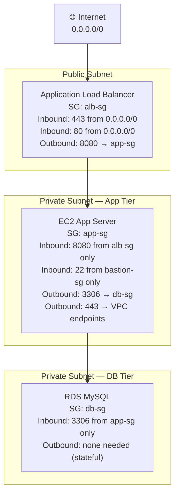
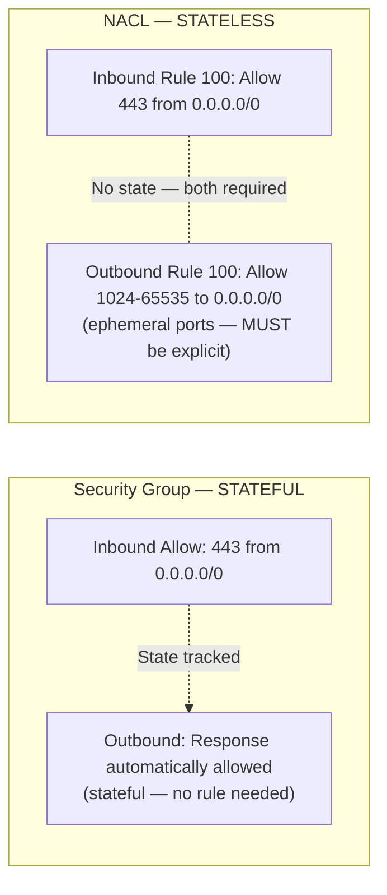
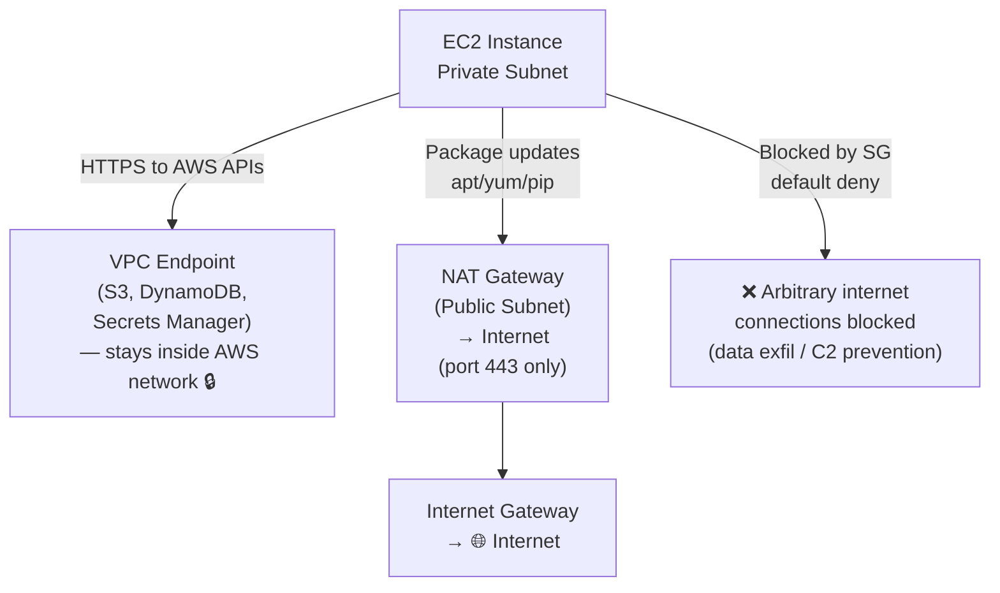

# AWS Question 7 — What Are Ingress and Egress in AWS?

> **Section:** AWS &nbsp;|&nbsp; **Topic:** Networking / Security Groups / VPC &nbsp;|&nbsp; **Level:** Mid (2–5 yrs) &nbsp;|&nbsp; **Frequency:** Very High
>
> _Part of the DevOps & DevSecOps Interview Preparation series._

---

## ❓ The Question

> **"What do ingress and egress mean in AWS, and how do they apply to security groups?"**

Common variations you'll hear:

- "What's the difference between inbound and outbound rules in a security group?"
- "How would you restrict SSH access to an EC2 instance?"
- "What is the default egress behaviour of a security group — and why does that matter?"
- "What's the difference between a security group and a NACL for controlling ingress/egress?"
- "Why shouldn't you use `0.0.0.0/0` in production security group rules?"
- "How do you prevent data exfiltration from an EC2 instance using network controls?"

---

## 🎯 Why Interviewers Ask This

On the surface this looks like a definition question — but it quickly expands into **network security architecture**. Interviewers ask it to check whether you:

- Understand **security groups as stateful firewalls** and can reason about inbound vs outbound rules independently.
- Know the **difference between security groups (stateful) and NACLs (stateless)** — and when to use each.
- Can design **defence-in-depth network controls** — not just "open port 80" but "open port 80 from the load balancer's security group only."
- Understand **egress security** — often overlooked, but critical for preventing data exfiltration, C2 (command-and-control) callbacks, and cryptomining outbound connections.
- Know **practical rules** — what port 22, 443, 3306, 5432, 6379 are for, and how to scope access correctly.
- Are aware of **VPC-native controls** — NAT gateways, VPC endpoints, PrivateLink — that reduce or eliminate public egress entirely.

> **The instant win:** Don't just define the terms. Lead with "Ingress is inbound, egress is outbound — and the most critical thing about security group egress rules is that the default allows all outbound traffic, which is a data exfiltration risk you should close down in production."

---

## 📖 Key Terminologies

| Term | Plain-English meaning |
| --- | --- |
| **Ingress** | Incoming network traffic — packets arriving *at* your resource from the outside. |
| **Egress** | Outgoing network traffic — packets leaving *from* your resource to the outside. |
| **Security Group (SG)** | A **stateful**, instance-level virtual firewall in AWS. Rules apply to individual EC2 instances, RDS databases, Lambda functions in VPC, etc. |
| **Stateful** | Security groups remember connection state. If inbound traffic is allowed, the response is automatically allowed outbound — you don't need a separate outbound rule for responses. |
| **NACL (Network ACL)** | A **stateless**, subnet-level firewall. Applies to all traffic entering or leaving a subnet. Rules must be defined for both directions independently. |
| **Stateless** | NACLs do not track connection state. You must explicitly allow both the request and the response — both ingress and egress rules required for two-way communication. |
| **Inbound Rules** | Security group rules that control what traffic can *enter* the resource. Port, protocol, and source (IP or security group reference). |
| **Outbound Rules** | Security group rules that control what traffic can *leave* the resource. Port, protocol, and destination (IP or security group reference). |
| **CIDR Block** | A range of IP addresses in notation like `10.0.0.0/16`. `0.0.0.0/0` means "all IPv4 addresses" — extremely permissive. |
| **Security Group Reference** | Using another security group's ID as the source/destination in a rule (e.g., "allow port 3306 from the app-server SG"). More secure than IP ranges — dynamic, auto-updates. |
| **NAT Gateway** | Allows resources in private subnets to initiate outbound (egress) internet connections — e.g., to pull packages — without having a public IP. Incoming connections are not allowed. |
| **VPC Endpoint / PrivateLink** | Connects your VPC to AWS services (S3, DynamoDB, Secrets Manager) without traffic going over the public internet — the most secure egress pattern. |
| **Internet Gateway (IGW)** | Enables resources in public subnets to send/receive traffic to/from the internet (both ingress and egress for public IPs). |
| **Ephemeral Ports** | Temporary high-numbered ports (1024–65535) used for the return path of TCP connections. Critical for NACL rules — often missed by beginners. |

---

## 🗣️ How to Answer (Structured)

### Step 1 — Clean definitions first

> "Ingress means incoming traffic — packets arriving at a resource. Egress means outgoing traffic — packets leaving a resource. In AWS, both terms are most commonly used in the context of **security group rules**, where you define separate inbound (ingress) and outbound (egress) rules to control what can reach your instances and what they can communicate with."

### Step 2 — Explain security groups as stateful firewalls

> "Security groups are stateful, which means if I allow inbound traffic on port 443, the response traffic is automatically allowed outbound — I don't need a matching outbound rule. This is the key difference from NACLs, which are stateless and require rules for both directions independently."

### Step 3 — Walk through a real-world security group design

> "For a web server I'd typically configure: Inbound — port 443 from `0.0.0.0/0` (public HTTPS), port 80 from the load balancer's security group only (redirect to HTTPS), port 22 restricted to the bastion host or corporate VPN CIDR — never from `0.0.0.0/0`. Outbound — this is where many engineers make a mistake: the AWS default is 'allow all outbound', which I would close down in production. I'd allow outbound only to specific destinations — the database security group on port 3306, S3 VPC endpoint, Secrets Manager endpoint, and the NAT gateway for package updates."

### Step 4 — Contrast security groups with NACLs

> "NACLs sit at the subnet level and are stateless. For a public subnet I'd allow inbound 443 from anywhere and outbound ephemeral ports (1024–65535) back to the internet for the response. Security groups handle the instance-level rules; NACLs are the subnet-level backstop. Together they give defence in depth — two independent control layers."

### Step 5 — Mention the egress security angle (DevSecOps differentiator)

> "Egress control is often underestimated. Default 'allow all outbound' means if an EC2 instance is compromised, the attacker can make outbound connections — for data exfiltration, C2 callbacks, or cryptomining. Tightening egress rules — or routing all egress through an AWS Network Firewall with domain filtering — is a key security hardening step."

---

## 🌐 Deep Dive: Ingress & Egress Across AWS Network Layers

### Layer 1 — Security Groups (Instance level, Stateful)

The most commonly discussed. Attached to EC2 instances, RDS, ELB, Lambda in VPC, ECS tasks, EKS nodes.

**Key behaviours:**
- **Stateful** — return traffic is automatically allowed.
- **Allow-only** — security groups can only have Allow rules. To block, you use a NACL or remove the Allow.
- **Multiple SGs per instance** — an instance can have up to 5 security groups; all rules are evaluated and the most permissive matching Allow wins.
- **Security group references** — source/destination can be another SG ID instead of a CIDR — dynamic, scales automatically, preferred over IP ranges for inter-tier communication.

**Default rules on a new security group:**
- Inbound: **none** (all traffic blocked by default)
- Outbound: **allow all** (`0.0.0.0/0` on all ports/protocols)

> ⚠️ The default outbound Allow-All is a **security gap** — in production you should replace it with specific outbound rules.

---

### Layer 2 — Network ACLs (Subnet level, Stateless)

Attached to subnets. Every packet in and out of the subnet is evaluated against NACL rules, regardless of security group settings.

**Key behaviours:**
- **Stateless** — you must define both the request AND the response direction explicitly.
- **Allow AND Deny rules** — unlike security groups, NACLs support explicit Deny.
- **Numbered rules** — evaluated lowest-number-first; first match wins. Rule 100 beats rule 200.
- **Ephemeral ports** — return traffic from internet uses ports 1024–65535. You must allow these outbound (for inbound requests) and inbound (for outbound requests).

**Default VPC NACL:** Allows all inbound and outbound.
**Custom NACL:** Denies all inbound and outbound until you add rules.

---

### Layer 3 — VPC Routing (Subnet → Internet)

Traffic direction is also controlled at the routing level — before it even reaches the security group.

| Subnet Type | Route to | Traffic |
| --- | --- | --- |
| **Public subnet** | Internet Gateway (IGW) | Full ingress + egress with public IP |
| **Private subnet** | NAT Gateway | Egress only — no inbound from internet |
| **Isolated subnet** | No external route | No internet ingress or egress |
| **VPC Endpoint** | AWS service directly | Private egress to S3, DynamoDB, etc. — no internet |

---

### Layer 4 — AWS Network Firewall (Advanced Egress Control)

For fine-grained egress filtering — block specific domains, protocols, or IP ranges across a VPC — AWS Network Firewall sits in a dedicated firewall subnet and inspects all traffic passing through.

Use cases: Block outbound DNS to non-corporate resolvers, allow only specific domain names for package repos, detect and block C2 callback patterns (Suricata-compatible IDS/IPS rules).

---

## 🔐 Security Perspective (DevSecOps)

Ingress and egress rules are the **most direct expression of your network security posture** in AWS:

- **Never use `0.0.0.0/0` on SSH (port 22) or RDP (port 3389) in production.** Port 22 exposed to the internet is one of the most scanned attack surfaces on the planet. Restrict to: corporate VPN CIDR, bastion host SG reference, or use **AWS Systems Manager Session Manager** to eliminate SSH entirely (no port 22 needed, no key management, full audit log).

- **Restrict inbound using security group references, not IP ranges.** Instead of allowing port 3306 from `10.0.0.0/8`, allow it from `sg-app-server`. This is dynamic — new app servers get access automatically; decommissioned ones lose it immediately. IP ranges require manual maintenance and are error-prone.

- **Tighten default outbound Allow-All.** The default "allow all outbound" is a data exfiltration and C2 callback risk. Lockdown pattern: allow outbound only to the database SG (port 3306/5432), S3 VPC endpoint, Secrets Manager endpoint, and NAT gateway (port 443 only for package updates). Deny everything else.

- **Security groups + NACLs = defence in depth.** A security group misconfiguration (someone accidentally opens port 22 to `0.0.0.0/0`) is a single point of failure. A NACL with an explicit `Deny` for port 22 from `0.0.0.0/0` at the subnet level is a backstop that protects even if the SG is incorrectly configured. Layers matter.

- **Egress filtering for zero-trust.** Modern zero-trust architectures assume breach — even instances inside your VPC may be compromised. Filtering egress traffic (AWS Network Firewall with domain allowlists, or a NAT instance with packet inspection) means a compromised instance cannot phone home to an attacker's C2 server or exfiltrate data via arbitrary HTTP/S connections.

- **VPC Flow Logs are your audit trail.** Enable VPC Flow Logs on all subnets to capture every accepted and rejected network flow. Feed them to CloudWatch Logs or S3, and use **Athena** or **GuardDuty** for anomaly detection. A spike in rejected outbound connections could indicate a port scan or lateral movement attempt from a compromised instance.

- **VPC Endpoints eliminate public egress to AWS services.** Every S3 GET from an EC2 instance using the public S3 endpoint goes out through the NAT gateway and over the internet — costing money and adding attack surface. A **Gateway VPC Endpoint for S3** keeps that traffic inside the AWS network entirely — free, faster, and more secure.

- **Least-privilege security groups are drift-prone.** Use **AWS Config rule `restricted-ssh`** (flags SGs with port 22 open to `0.0.0.0/0`) and **`restricted-common-ports`** to continuously monitor for overly permissive rules. Alert on violations immediately.

> **One-liner for the room:** *"Ingress is 'who can reach me' — restrict to the smallest needed source, use SG references instead of IP ranges. Egress is 'what can I reach' — close the default allow-all, route to AWS services via VPC endpoints, and log everything with Flow Logs. Ingress stops attackers getting in; egress stops compromised instances calling out."*

---

## 🖼️ Visuals

### Source image — Ingress and Egress traffic flow through a Security Group to an EC2 instance


### Mermaid — Security Group rules: 3-tier web architecture



### Mermaid — Security Group (stateful) vs NACL (stateless)



### Mermaid — Egress traffic paths from a private subnet



---

## 📊 Quick Reference — Common Security Group Port Rules

| Port | Protocol | Service | Typical Inbound Source | Production Notes |
| --- | --- | --- | --- | --- |
| **22** | TCP | SSH | Bastion SG / VPN CIDR only | **Never** `0.0.0.0/0` — use SSM Session Manager instead |
| **80** | TCP | HTTP | ALB SG or `0.0.0.0/0` | Redirect to 443; restrict inbound to ALB SG in app tier |
| **443** | TCP | HTTPS | `0.0.0.0/0` (public) | Standard public web port |
| **3306** | TCP | MySQL / Aurora | App server SG only | Never public subnet |
| **5432** | TCP | PostgreSQL | App server SG only | Never public subnet |
| **6379** | TCP | Redis (ElastiCache) | App server SG only | Requires AUTH token + TLS |
| **27017** | TCP | MongoDB | App server SG only | Most-scanned DB port — never expose publicly |
| **8080 / 8443** | TCP | App / API server | ALB SG only | App listens internally; ALB terminates TLS |
| **2379–2380** | TCP | etcd (K8s) | K8s control plane SG only | Critical — never exposed outside cluster |
| **10250** | TCP | kubelet API | K8s control plane SG only | Used by K8s API server → node communication |

---

## 🛠️ Hands-On: Commands & Syntax

### 1) Create a security group with least-privilege inbound rules (CLI)

```bash
# Create a security group for the web application tier
SG_ID=$(aws ec2 create-security-group \
  --group-name app-server-sg \
  --description "App server — allow HTTPS from ALB, SSH from bastion only" \
  --vpc-id vpc-0abc123456 \
  --query 'GroupId' --output text)

echo "Created SG: $SG_ID"

# Allow HTTPS inbound from ALB security group only (not 0.0.0.0/0)
aws ec2 authorize-security-group-ingress \
  --group-id $SG_ID \
  --protocol tcp \
  --port 8080 \
  --source-group sg-alb-security-group-id   # SG reference — not an IP range

# Allow SSH inbound from bastion host security group only
aws ec2 authorize-security-group-ingress \
  --group-id $SG_ID \
  --protocol tcp \
  --port 22 \
  --source-group sg-bastion-security-group-id

# Remove the default "allow all outbound" rule
aws ec2 revoke-security-group-egress \
  --group-id $SG_ID \
  --protocol -1 \       # -1 = all protocols
  --port -1 \           # -1 = all ports
  --cidr 0.0.0.0/0     # the default allow-all rule

# Add specific outbound rules (principle of least egress)
# Allow outbound to RDS on port 3306
aws ec2 authorize-security-group-egress \
  --group-id $SG_ID \
  --protocol tcp \
  --port 3306 \
  --destination-group sg-rds-security-group-id

# Allow HTTPS outbound to VPC endpoints (for S3, Secrets Manager, etc.)
aws ec2 authorize-security-group-egress \
  --group-id $SG_ID \
  --protocol tcp \
  --port 443 \
  --cidr 10.0.0.0/16    # VPC CIDR — VPC endpoint IPs live here
```

### 2) Describe and audit security group rules

```bash
# List all inbound rules for a security group
aws ec2 describe-security-groups \
  --group-ids sg-0abc123456 \
  --query 'SecurityGroups[0].IpPermissions' \
  --output table

# List all outbound rules
aws ec2 describe-security-groups \
  --group-ids sg-0abc123456 \
  --query 'SecurityGroups[0].IpPermissionsEgress' \
  --output table

# ⚠️ AUDIT: Find all security groups with SSH (port 22) open to the internet
aws ec2 describe-security-groups \
  --query 'SecurityGroups[?IpPermissions[?FromPort==`22` && IpRanges[?CidrIp==`0.0.0.0/0`]]].{ID:GroupId,Name:GroupName,VPC:VpcId}' \
  --output table

# ⚠️ AUDIT: Find all security groups with ANY port open to 0.0.0.0/0
aws ec2 describe-security-groups \
  --query 'SecurityGroups[?IpPermissions[?IpRanges[?CidrIp==`0.0.0.0/0`]]].{ID:GroupId,Name:GroupName}' \
  --output table
```

### 3) Create a NACL with stateless ingress and egress rules

```bash
# Create a custom NACL for the app subnet
NACL_ID=$(aws ec2 create-network-acl \
  --vpc-id vpc-0abc123456 \
  --query 'NetworkAcl.NetworkAclId' --output text)

# Inbound Rule 100: Allow HTTPS from internet
aws ec2 create-network-acl-entry \
  --network-acl-id $NACL_ID \
  --rule-number 100 \
  --protocol tcp \
  --port-range From=443,To=443 \
  --cidr-block 0.0.0.0/0 \
  --rule-action allow \
  --ingress   # inbound

# Inbound Rule 200: Allow ephemeral return ports (for outbound requests response)
aws ec2 create-network-acl-entry \
  --network-acl-id $NACL_ID \
  --rule-number 200 \
  --protocol tcp \
  --port-range From=1024,To=65535 \
  --cidr-block 0.0.0.0/0 \
  --rule-action allow \
  --ingress

# Inbound Rule 900: Explicitly deny SSH from internet (backstop)
aws ec2 create-network-acl-entry \
  --network-acl-id $NACL_ID \
  --rule-number 900 \
  --protocol tcp \
  --port-range From=22,To=22 \
  --cidr-block 0.0.0.0/0 \
  --rule-action deny \
  --ingress

# Outbound Rule 100: Allow HTTPS outbound to internet (for NAT/package updates)
aws ec2 create-network-acl-entry \
  --network-acl-id $NACL_ID \
  --rule-number 100 \
  --protocol tcp \
  --port-range From=443,To=443 \
  --cidr-block 0.0.0.0/0 \
  --rule-action allow \
  --egress   # outbound

# Outbound Rule 200: Allow ephemeral ports outbound (for HTTPS response return)
aws ec2 create-network-acl-entry \
  --network-acl-id $NACL_ID \
  --rule-number 200 \
  --protocol tcp \
  --port-range From=1024,To=65535 \
  --cidr-block 0.0.0.0/0 \
  --rule-action allow \
  --egress
```

> ⚠️ **The NACL ephemeral port rule is the #1 beginner mistake.** Forget to add the outbound rule for ports 1024–65535 and your HTTPS responses will be silently dropped — your app appears broken even though the security group is correct.

### 4) Enable VPC Flow Logs (egress audit trail)

```bash
# Create an S3 bucket for flow logs
aws s3api create-bucket \
  --bucket my-vpc-flow-logs-111122223333 \
  --region us-east-1

# Enable VPC Flow Logs — captures ALL traffic (accepted and rejected)
aws ec2 create-flow-logs \
  --resource-type VPC \
  --resource-ids vpc-0abc123456 \
  --traffic-type ALL \
  --log-destination-type s3 \
  --log-destination arn:aws:s3:::my-vpc-flow-logs-111122223333 \
  --log-format '${version} ${account-id} ${interface-id} ${srcaddr} ${dstaddr} ${srcport} ${dstport} ${protocol} ${packets} ${bytes} ${start} ${end} ${action} ${log-status}'

# Query rejected outbound connections from an instance (data exfil detection)
# (After logs arrive in S3, query via Athena)
# Example Athena query to find rejected egress from a specific instance:
# SELECT srcaddr, dstaddr, dstport, bytes, action
# FROM vpc_flow_logs
# WHERE action = 'REJECT' AND srcaddr = '10.0.1.50'
# ORDER BY start DESC LIMIT 100;
```

### 5) Terraform — security group with least-privilege ingress and egress

```hcl
# Security group for application servers — least privilege ingress AND egress
resource "aws_security_group" "app_server" {
  name        = "app-server-sg"
  description = "App server — ALB ingress, bastion SSH, RDS egress, VPC endpoint egress"
  vpc_id      = aws_vpc.main.id

  # ── INGRESS (inbound) rules ──────────────────────────────────────
  # Allow HTTPS from the ALB security group only — not from the internet directly
  ingress {
    description     = "App port from ALB only"
    from_port       = 8080
    to_port         = 8080
    protocol        = "tcp"
    security_groups = [aws_security_group.alb.id]   # SG reference — not CIDR
  }

  # Allow SSH from bastion host only — never from 0.0.0.0/0
  ingress {
    description     = "SSH from bastion only"
    from_port       = 22
    to_port         = 22
    protocol        = "tcp"
    security_groups = [aws_security_group.bastion.id]
  }

  # ── EGRESS (outbound) rules ───────────────────────────────────────
  # DO NOT use the default allow-all egress. Define explicit rules.

  # Allow MySQL to RDS only
  egress {
    description     = "MySQL to RDS"
    from_port       = 3306
    to_port         = 3306
    protocol        = "tcp"
    security_groups = [aws_security_group.rds.id]
  }

  # Allow Redis to ElastiCache only
  egress {
    description     = "Redis to ElastiCache"
    from_port       = 6379
    to_port         = 6379
    protocol        = "tcp"
    security_groups = [aws_security_group.redis.id]
  }

  # Allow HTTPS to VPC endpoints (S3, Secrets Manager, SSM, etc.)
  egress {
    description = "HTTPS to VPC endpoints"
    from_port   = 443
    to_port     = 443
    protocol    = "tcp"
    cidr_blocks = [var.vpc_cidr]   # VPC CIDR — keeps traffic inside AWS network
  }

  tags = {
    Name      = "app-server-sg"
    ManagedBy = "terraform"
    Env       = "production"
  }
}

# ── NACL for the app private subnet ──────────────────────────────────
resource "aws_network_acl" "app_private" {
  vpc_id     = aws_vpc.main.id
  subnet_ids = [aws_subnet.app_private.id]

  # Inbound: allow HTTPS from VPC (from ALB in public subnet)
  ingress {
    rule_no    = 100
    action     = "allow"
    protocol   = "tcp"
    from_port  = 443
    to_port    = 443
    cidr_block = var.vpc_cidr
  }

  # Inbound: ephemeral ports — return traffic for outbound requests
  ingress {
    rule_no    = 200
    action     = "allow"
    protocol   = "tcp"
    from_port  = 1024
    to_port    = 65535
    cidr_block = "0.0.0.0/0"
  }

  # Inbound: DENY SSH from internet (belt-and-suspenders backstop)
  ingress {
    rule_no    = 900
    action     = "deny"
    protocol   = "tcp"
    from_port  = 22
    to_port    = 22
    cidr_block = "0.0.0.0/0"
  }

  # Outbound: allow HTTPS to internet (via NAT for updates)
  egress {
    rule_no    = 100
    action     = "allow"
    protocol   = "tcp"
    from_port  = 443
    to_port    = 443
    cidr_block = "0.0.0.0/0"
  }

  # Outbound: ephemeral ports — return traffic for inbound HTTPS requests
  egress {
    rule_no    = 200
    action     = "allow"
    protocol   = "tcp"
    from_port  = 1024
    to_port    = 65535
    cidr_block = "0.0.0.0/0"
  }

  tags = { Name = "app-private-nacl" }
}
```

### 6) AWS Systems Manager Session Manager — eliminate port 22 entirely

```bash
# Install SSM agent (already pre-installed on Amazon Linux 2/2023 and Ubuntu)
# Attach the AmazonSSMManagedInstanceCore policy to the EC2 instance role

aws iam attach-role-policy \
  --role-name ec2-instance-role \
  --policy-arn arn:aws:iam::aws:policy/AmazonSSMManagedInstanceCore

# Start a session (NO SSH, NO port 22, NO key pair needed)
aws ssm start-session --target i-0abc123456789def

# The session is:
# ✅ Fully audited in CloudTrail
# ✅ Logs streamed to S3 or CloudWatch Logs
# ✅ No inbound port 22 required in the security group
# ✅ Works across private subnets via SSM VPC endpoint
```

> **This is the modern, recommended approach for EC2 access.** Closing port 22 completely and using SSM Session Manager eliminates SSH key management, brute-force exposure, and audit gaps — all at once. Bring this up in any security group / ingress question and you'll stand out.

---

## 🤖 AI & The New Trend (2024–2025) — what changed, and what to learn

> Network security configuration is being transformed by AI-driven analysis and automated remediation — moving from manual rule review to continuous, intelligent enforcement.

### How AI is impacting ingress/egress control

- **GuardDuty network threat intelligence (ML)** — GuardDuty continuously analyses VPC Flow Logs using ML to detect unusual network patterns: port scanning, unexpected outbound connections to known malicious IPs, internal lateral movement, cryptocurrency mining communication patterns. It correlates ingress/egress behaviour against global threat intelligence — not just your rules, but *what's actually happening*. Findings like `UnauthorizedAccess:EC2/SSHBruteForce` and `Trojan:EC2/DNSDataExfiltration` are generated automatically.

- **AWS Network Firewall + managed threat intelligence** — AWS Network Firewall now integrates with AWS managed threat intel rule groups that are automatically updated with known malicious IP/domain lists. Your egress controls stay current without manual list management — AI-curated threat feeds.

- **Amazon Inspector network reachability (2024)** — Inspector continuously analyses your security group and NACL rules to determine which ports and IPs can actually reach your EC2 instances from the internet — without needing to generate any traffic. It models your entire VPC topology and surfaces unexpected reachability (e.g., "port 5432 is reachable from the internet via this route") as findings, before an attacker discovers it.

- **VPC Reachability Analyzer** — A point-in-time analysis tool (used in CI/CD pipelines) that proves network connectivity between two endpoints — verifies that your security group rules actually implement your intended architecture. Infrastructure-as-Code security testing for networking.

- **AI-assisted security group optimisation** — Amazon Q can analyse your security group rules and suggest least-privilege improvements, flag `0.0.0.0/0` ingress rules, and identify over-permissive egress. Pair with `aws ec2 describe-security-groups` output for a full audit.

### How AI can contribute to your day-to-day

- **Generate security group Terraform from descriptions** — "Create a security group for an RDS PostgreSQL instance that only allows inbound on 5432 from the app server security group, with no outbound rules." Review output for correctness.
- **Audit existing rules** — Feed all your security group rules to an LLM and ask "which rules violate least-privilege? Which have unnecessary `0.0.0.0/0` exposure?"
- **Explain Flow Log anomalies** — Paste a Flow Log excerpt into Amazon Q and ask "is this traffic pattern indicative of data exfiltration or port scanning?"
- **Design multi-tier SG architecture** — "Design a 3-tier security group architecture (ALB → App → RDS) with least-privilege ingress and egress for each tier." Gets you a solid starting diagram.

### ⚠️ Security caveat (DevSecOps)

- **AI-generated security group rules often default to `0.0.0.0/0`** when the requirement is ambiguous. Always replace with specific SG references or CIDR ranges.
- **Never rely on AI output alone for security group rules** — validate with VPC Reachability Analyzer or Inspector before deploying.
- **Egress rules are often omitted** in AI-generated SG Terraform — explicitly ask for egress rules and then review them carefully.

### What to learn right now (priority order)

1. **Security group + NACL architecture** — the 3-tier design (ALB → App → DB) with SG references is the most-tested practical pattern.
2. **SSM Session Manager** — eliminating port 22; bring this up in every ingress/SSH question.
3. **VPC Flow Logs + Athena queries** — egress audit trail; knowing how to query rejected connections is a strong DevSecOps skill.
4. **VPC Reachability Analyzer** — CI/CD network policy testing; validates that your SG rules implement your intent.
5. **Amazon Inspector network reachability** — continuous internet-exposure detection; no traffic generation needed.
6. **AWS Network Firewall** — domain-based egress filtering for zero-trust architectures; the enterprise-grade next step beyond security groups.

---

## ✅ Prerequisites (be solid on these first)

- **VPC fundamentals** — subnets (public vs private), route tables, Internet Gateway, NAT Gateway.
- **TCP/IP basics** — what ports are, what protocols (TCP/UDP) mean, what a connection initiation vs response looks like.
- **Security group structure** — how to read and write inbound/outbound rules (port, protocol, source/destination).
- **CIDR notation** — what `10.0.0.0/16`, `10.0.1.0/24`, and `0.0.0.0/0` mean.
- **(Bonus) Stateful vs stateless firewalls** — understanding why NACLs require ephemeral port rules is a common interview follow-up.
- **(Bonus) AWS Systems Manager (SSM)** — Session Manager as the SSH replacement is now the expected answer for "how do you access instances securely."

---

## 📚 Further Reading (current docs)

- **Security groups for your VPC** — AWS docs: <https://docs.aws.amazon.com/vpc/latest/userguide/vpc-security-groups.html>
- **Network ACLs** — AWS docs: <https://docs.aws.amazon.com/vpc/latest/userguide/vpc-network-acls.html>
- **Compare security groups and NACLs** — AWS docs: <https://docs.aws.amazon.com/vpc/latest/userguide/infrastructure-security.html>
- **VPC Flow Logs** — AWS docs: <https://docs.aws.amazon.com/vpc/latest/userguide/flow-logs.html>
- **VPC Reachability Analyzer** — AWS docs: <https://docs.aws.amazon.com/vpc/latest/reachability/what-is-reachability-analyzer.html>
- **Amazon Inspector network reachability** — AWS docs: <https://docs.aws.amazon.com/inspector/latest/user/findings-understanding-network.html>
- **AWS Network Firewall** — AWS docs: <https://docs.aws.amazon.com/network-firewall/latest/developerguide/what-is-aws-network-firewall.html>
- **AWS Systems Manager Session Manager** — AWS docs: <https://docs.aws.amazon.com/systems-manager/latest/userguide/session-manager.html>
- **VPC Endpoints** — AWS docs: <https://docs.aws.amazon.com/vpc/latest/privatelink/vpc-endpoints.html>
- **GuardDuty network findings** — AWS docs: <https://docs.aws.amazon.com/guardduty/latest/ug/guardduty_finding-types-ec2.html>
- **AWS Config rule: restricted-ssh** — AWS docs: <https://docs.aws.amazon.com/config/latest/developerguide/restricted-ssh.html>
- **KodeKloud lesson (video):** <https://learn.kodekloud.com/user/courses/devops-interview-preparation-course/module/f1169a2e-23de-4377-bc4f-a07c136a11d6/lesson/5c26ddc7-ec96-4df1-8a74-2e2364db3753>

---

## 🔁 Related / Follow-up Questions (they often go here next)

1. **What is the difference between a security group and a NACL?** → Security group: instance-level, stateful, Allow-only, evaluated together (union). NACL: subnet-level, stateless (explicit both directions), Allow AND Deny, rule-number order (first match wins). Use both for defence in depth.
2. **Why is `0.0.0.0/0` on port 22 dangerous?** → It exposes your SSH port to the entire internet — automated scanners and bots probe port 22 constantly for weak passwords and known vulnerabilities. In 2024, any EC2 with port 22 open to `0.0.0.0/0` will receive brute-force attempts within minutes of launch.
3. **What is the default egress rule on a new security group?** → Allow all outbound traffic (`0.0.0.0/0`, all ports, all protocols). This is a security gap — production instances should have specific egress rules and the default allow-all should be removed.
4. **How do security group references work?** → Instead of a CIDR range, you specify another security group's ID as the source/destination. AWS evaluates "any instance in that SG" dynamically — no IP management needed. It's the preferred method for inter-tier communication in multi-tier architectures.
5. **What are ephemeral ports and why do they matter for NACLs?** → When a client makes a TCP connection to a server, the OS assigns a temporary high-numbered port (1024–65535) on the client for the return path. NACLs are stateless so they don't automatically allow return traffic — you must explicitly allow these port ranges in your outbound (for inbound connections) and inbound (for outbound connections) NACL rules.
6. **What is the difference between a NAT Gateway and an Internet Gateway for egress?** → Internet Gateway: for resources with public IPs — allows both inbound and outbound internet traffic. NAT Gateway: for resources in private subnets — allows egress-only internet connections (outbound only). Private resources can pull from the internet (package updates) without being reachable from the internet.
7. **How would you completely eliminate port 22 from your architecture?** → Use **AWS Systems Manager Session Manager** — it provides shell access via the SSM agent over port 443 (HTTPS), fully audited in CloudTrail, with session logs to S3/CloudWatch. No port 22 needed, no SSH key management, works in private subnets via SSM VPC endpoint.
8. **What is a VPC endpoint and how does it improve egress security?** → A VPC endpoint connects your VPC directly to an AWS service (S3, DynamoDB, Secrets Manager) without traffic leaving the AWS network. Benefits: no NAT gateway cost, no internet exposure, bucket policies can enforce `aws:SourceVpce` to ensure S3 is only accessible from your VPC endpoint.
9. **How do you detect data exfiltration from an EC2 instance?** → Enable VPC Flow Logs and forward to CloudWatch. GuardDuty analyses Flow Logs for ML-detected anomalies like `Exfiltration:EC2/DNSDataExfiltration` or unexpected outbound volumes to unknown IPs. Alert on rejected egress spikes, new destination IPs, and high outbound data volumes to non-VPC destinations.
10. **What is the AWS Config rule `restricted-ssh` and how do you enforce it?** → An AWS managed Config rule that continuously checks all security groups for rules allowing SSH (port 22) from `0.0.0.0/0` or `::/0`. If found, it generates a non-compliant finding in Security Hub. Pair with an auto-remediation SSM document to automatically revoke the offending rule.
11. **What is AWS Network Firewall and when would you use it instead of security groups?** → Security groups operate at the resource level with IP/port rules. Network Firewall sits at the VPC edge and provides stateful, deep-packet inspection — allowing or blocking by domain name (not just IP), protocol, and Suricata-compatible IPS rules. Use it when you need domain-based egress filtering (allowlist specific package repos, block all other outbound domains) or intrusion detection/prevention.
12. **What does stateful mean for security groups in practice?** → A stateful firewall tracks the state of every connection. When an EC2 instance initiates an outbound HTTP request, the security group remembers the connection — and automatically allows the response traffic back in without needing an explicit inbound rule for the response. This is why security groups need only one rule per direction of communication (request OR response — not both).

---

> 📌 **30-second interview summary:** **Ingress** = incoming traffic; **Egress** = outgoing traffic. In AWS these concepts live primarily in **security groups** — the stateful, instance-level virtual firewall. Inbound rules control what can reach your resource (restrict SSH to bastion SG, HTTPS from ALB SG only); outbound rules control what your resource can reach (remove the default allow-all, allow only the DB SG on 3306 and HTTPS to VPC endpoints). **NACLs** add a stateless, subnet-level backstop with explicit Deny capability — don't forget ephemeral ports for the response path. From a security perspective: never expose port 22 to `0.0.0.0/0` (use SSM Session Manager instead), close the default egress allow-all to prevent data exfiltration, route AWS API calls through VPC endpoints to eliminate public egress, and enable VPC Flow Logs for an audit trail. GuardDuty + Inspector give continuous AI-driven ingress/egress threat detection on top of your static rules.
