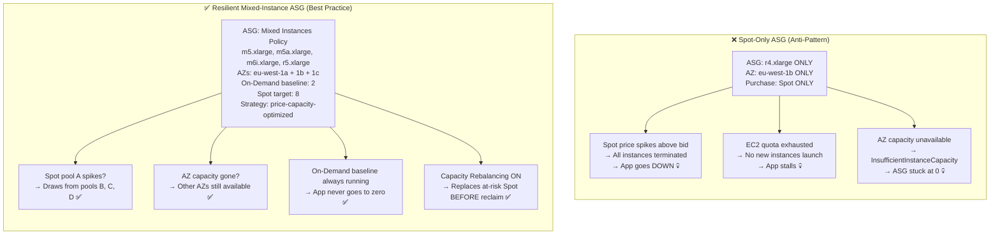
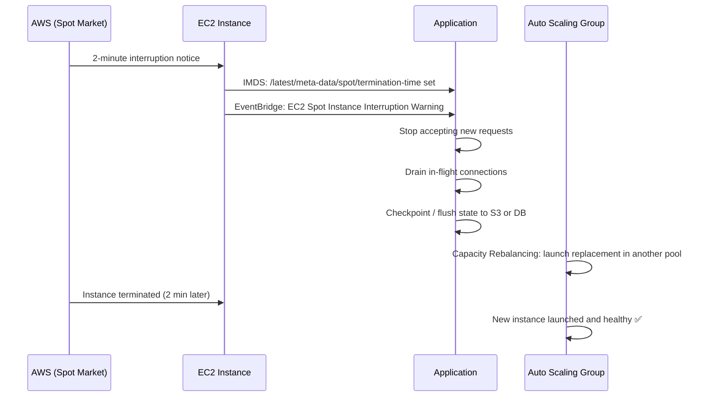
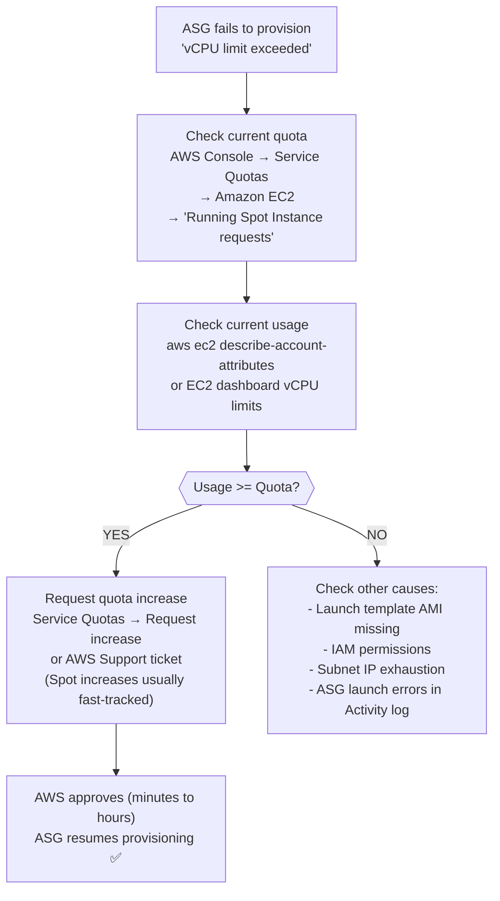

# AWS Question 8 — Why Is an ASG Using Only Spot Instances Failing to Provision New Nodes?

> **Section:** AWS &nbsp;|&nbsp; **Topic:** EC2 / Auto Scaling / Spot Instances &nbsp;|&nbsp; **Level:** Mid (2–5 yrs) &nbsp;|&nbsp; **Frequency:** High
>
> _Part of the DevOps & DevSecOps Interview Preparation series._

---

## ❓ The Question

> **"Your Auto Scaling Group is configured with only Spot Instances and it's failing to provision new nodes. What are the possible causes and how would you fix it?"**

You'll also encounter variations like:

- "What are the risks of running a production ASG on 100% Spot Instances?"
- "What happens when the Spot price exceeds your bid in an ASG?"
- "How would you design a resilient ASG that uses Spot Instances without risking total capacity loss?"
- "What is EC2 Spot Capacity Rebalancing and why does it matter?"
- "What is the `price-capacity-optimized` Spot allocation strategy?"
- "How do you handle Spot interruptions gracefully in a Kubernetes or ECS workload?"

---

## 🎯 Why Interviewers Ask This

This question tests practical operational experience with cost-optimised AWS infrastructure. Interviewers ask it to determine whether you:

- Understand **Spot Instance mechanics** — bidding, interruptions, the 2-minute warning, and why availability is never guaranteed.
- Can **diagnose provisioning failures** — distinguishing a price issue from a quota issue from a capacity issue from an IAM/launch template issue.
- Know that **Spot-only ASGs are an anti-pattern for critical workloads** — and can articulate the correct architecture (mixed On-Demand + Spot with diversification).
- Are familiar with modern Spot features: `price-capacity-optimized`, **Capacity Rebalancing**, **Spot Placement Score**, and **attribute-based instance selection**.
- Understand **graceful interruption handling** — draining connections, checkpointing, lifecycle hooks.
- Can link Spot strategy to **cost, reliability, and security** trade-offs — showing DevSecOps depth.

> **The instant win:** Don't just say "the price went up." Lead with "A Spot-only ASG is an architectural risk. There are two common immediate causes — price exceeding bid and EC2 quota limits — but the real fix is to restructure the ASG with a mixed instances policy so it never depends on a single instance type or pricing model."

---

## 📖 Key Terminologies

| Term | Plain-English meaning |
| --- | --- |
| **Spot Instance** | Spare AWS EC2 capacity offered at up to 90% discount. AWS can reclaim it with a **2-minute interruption notice** when capacity is needed. |
| **Spot Price** | The current market price for Spot capacity in a specific AZ and instance type — fluctuates in real time based on supply and demand. |
| **On-Demand Price** | The fixed, full price for an EC2 instance — no interruptions, guaranteed availability. |
| **Auto Scaling Group (ASG)** | AWS service that automatically launches and terminates EC2 instances to maintain a desired capacity and respond to scaling triggers. |
| **Launch Template** | The configuration blueprint (AMI, instance type, SG, IAM role, user-data) that an ASG uses to launch instances. |
| **Mixed Instances Policy** | ASG configuration that allows mixing multiple instance types and purchase options (On-Demand + Spot) in a single group. |
| **Allocation Strategy** | The rule the ASG uses to decide which instance type pool to draw Spot instances from (e.g., `price-capacity-optimized`, `lowest-price`, `capacity-optimized`). |
| **`price-capacity-optimized`** | The current best-practice Spot allocation strategy — picks pools that are both cheap AND have deep available capacity, minimising interruptions. |
| **Spot Interruption** | The 2-minute advance notice AWS sends before reclaiming a Spot Instance. Apps should listen for this and drain/checkpoint before the instance is terminated. |
| **Capacity Rebalancing** | An ASG feature that proactively replaces Spot Instances showing elevated interruption risk — starts the replacement *before* AWS sends the interruption notice. |
| **EC2 Service Quota** | AWS-enforced soft limits on the number of EC2 instances per account (per family, per region). Hitting the quota prevents new instances from launching, regardless of pricing. |
| **Spot Placement Score** | An AWS tool that scores (1–10) how likely a Spot request is to be fulfilled in a given Region/AZ combination — based on live capacity telemetry. |
| **Attribute-Based Instance Selection (ABS)** | Instead of listing specific instance types, you declare hardware requirements (min vCPUs, min RAM). AWS selects any matching instance types — broadens the Spot pool automatically. |
| **Lifecycle Hook** | An ASG feature that pauses instance launch or termination, giving your application time to complete an action (drain connections, flush cache, save state) before the instance is fully launched or terminated. |

---

## 🗣️ How to Answer (Structured)

### Step 1 — Acknowledge the anti-pattern

> "First, I'd flag that an ASG configured with only Spot Instances is a risky architecture for any workload that can't tolerate sudden capacity loss. Spot Instances can be reclaimed by AWS at any time with only a 2-minute warning — if your entire ASG runs on Spot and capacity disappears, your application goes down completely."

### Step 2 — Name the two immediate failure causes

> "For the specific question of why the ASG is failing to provision new nodes, there are two primary causes: **Spot price exceeding the bid** and **EC2 service quota limits**."

**Cause 1 — Spot Price Fluctuation:**
> "Spot Instances are priced by supply and demand. If the current market price in the AZ your ASG is targeting rises above your configured maximum bid price, AWS will not launch new instances — and may terminate existing ones. If you're targeting a single AZ or single instance type and its Spot pool is under pressure, the whole ASG stalls."

**Cause 2 — EC2 Service Quota:**
> "AWS enforces per-account, per-region soft limits on the number of running EC2 instances — broken down by instance family (e.g., running On-Demand Standard (A, C, D, H, I, M, R, T, Z) instances). Even with healthy Spot pricing, if you've hit your vCPU quota for that instance family, no new instances can launch. This is a soft limit, so you can request an increase through AWS Support or the Service Quotas console."

### Step 3 — Mention additional failure causes (shows depth)

> "Beyond price and quota, there are other causes worth checking: the launch template might reference an AMI that no longer exists, the IAM role might be missing permissions, the subnet might have run out of IP addresses, or there simply may be no Spot capacity available in that AZ for that instance type at that moment."

### Step 4 — Give the architectural fix (this is what they're really testing)

> "The real solution isn't just raising the bid or requesting a quota increase — it's redesigning the ASG to be resilient by default. I'd use a **mixed instances policy** with both On-Demand and Spot capacity, **diversify across multiple instance types and AZs** using the `price-capacity-optimized` strategy, and enable **Capacity Rebalancing** so the ASG proactively replaces at-risk Spot Instances before AWS reclaims them."

### Step 5 — Add the graceful interruption handling story

> "At the application layer, I'd add **lifecycle hooks** to the ASG to drain connections before termination, and have the app listen for the **Spot interruption notice** (via EC2 instance metadata or EventBridge) to checkpoint state or flush cache before the 2-minute window closes."

---

## 🔍 Deep Dive: Root Causes and Diagnosis

### Cause 1 — Spot Price Exceeds Bid

**How to diagnose:**
```
ASG Activity History → "Failed to launch N instances"
Reason: "Spot bid price is too low for the requested resources"
```

**What the pricing history shows:**

The Spot pricing history graph below shows the `r4.xlarge` instance type across three AZs in `eu-west`. The On-Demand price is a fixed $0.2964. Spot prices in the three AZs range from $0.0928 to $0.0958 — roughly 60% savings. But notice: the price fluctuates. If an ASG was configured with only one AZ and that pool spiked above the bid price, all instances would be reclaimed simultaneously.

> 📌 **The danger of single-AZ Spot-only ASGs:** If the green line (eu-west-1a at ~55% savings) spikes above your bid, and you're running 100% in that AZ, your entire ASG disappears at once.

**The fix:** Diversify across multiple instance types AND multiple AZs. If one pool spikes, the ASG draws from others.

---

### Cause 2 — EC2 Service Quota Limit

**How to diagnose:**
```
ASG Activity History → "Failed to launch N instances"
Reason: "You have requested more vCPU capacity than your current vCPU limit of X allows..."
```

**Types of EC2 quotas that matter:**

| Quota | Default limit | Applies to |
| --- | --- | --- |
| Running On-Demand Standard instances | 32–1152 vCPUs (varies by account age/usage) | Standard family On-Demand |
| Running Spot Instance requests | 640 vCPUs (default) | All Spot instances |
| Running On-Demand G/X instances | 0–32 vCPUs (GPU — very low default) | GPU/ML instance families |

**The fix:** Check current quota vs usage in the Service Quotas console. Request an increase via the console or AWS Support — for Spot quotas, AWS usually approves increases quickly.

---

### Cause 3 — No Available Spot Capacity (InsufficientInstanceCapacity)

Even with a high bid and within quota, AWS may simply have no spare capacity of that instance type in that AZ. This is **different from price** — you're not outbid, there's just no supply.

**How to diagnose:** Activity history shows `InsufficientInstanceCapacity` or `SpotMaxPriceTooLow`.

**The fix:** Diversify instance types with attribute-based selection or list 5–10 equivalent instance types. When one pool is empty, the ASG draws from another.

---

### Cause 4 — Launch Template / IAM / AMI Issues

These aren't Spot-specific but are common first checks:

- AMI ID in the launch template no longer exists (deregistered)
- IAM instance profile missing permissions
- Security group deleted or misconfigured
- Subnet has exhausted its available IPs (small /28 subnet)
- User-data script fails and causes instance health check failure

---

## 🔐 Security Perspective (DevSecOps)

Spot Instance strategies carry security implications that are often overlooked:

- **Spot-only ASGs create security patching gaps.** If instances are frequently interrupted and replaced, you must ensure every replacement launches from the latest, patched AMI. Hardcoding an AMI ID in the launch template that becomes months old is a vulnerability. Use **EC2 Image Builder** with automatic pipelines to keep your AMI current, and always reference the latest version in the launch template.

- **Interruption leaves data at risk.** A Spot Instance reclaimed without proper shutdown handling may leave sensitive data in memory, incomplete writes to disk, or open connections to databases. Lifecycle hooks and interruption notice handlers are not just reliability tools — they're data protection controls.

- **Secrets must not be baked in.** Spot Instances launch and terminate frequently. If secrets (DB passwords, API keys) are in user-data or the AMI, every instance launch is a potential leak surface — especially since user-data is readable from the instance metadata endpoint. Use **Secrets Manager** with the `ssm` or `secretsmanager` VPC endpoints instead.

- **IMDSv2 is mandatory.** Spot Instances carry the same SSRF-to-credential-theft risk as any EC2 instance. Set `HttpTokens = required` in the launch template to enforce IMDSv2. This is critical when instances have IAM roles — the IMDS endpoint can be used to steal credentials if IMDSv1 is enabled.

- **Cost spike = security event.** A Spot quota limit or price spike that takes down an ASG is a **denial-of-service** risk. If your ASG is fully Spot and goes to zero, your app is down. Set **AWS Budgets alerts** for Spot spending anomalies and **CloudWatch alarms on ASG `GroupInServiceInstances` metric dropping to zero** — so you're paged before users notice.

- **Tag everything for cost attribution.** Spot Instances launch and terminate dynamically. Without proper tags (team, environment, application), cost attribution becomes impossible and finance teams can't validate bills. Enforce tags at launch via the launch template and AWS Config rule `required-tags`.

> **One-liner for the room:** *"Spot Instances give 60–90% cost savings but demand architectural resilience — diversified types, mixed On-Demand baseline, Capacity Rebalancing, and graceful interruption handling. The security angle: hardened AMI in the launch template, IMDSv2 enforced, secrets from Secrets Manager, and lifecycle hooks for clean shutdown. Cost savings without resilience is just deferred downtime."*

---

## 🖼️ Visuals

### Source image — Spot Instance pricing history (r4.xlarge, eu-west region)


> 📌 **Reading the graph:** The flat top line is On-Demand ($0.2964). The three coloured lines are Spot prices per AZ — significantly cheaper but volatile. An ASG pinned to a single AZ and instance type can lose ALL its instances if that one line spikes above the bid. Diversification across AZs and types means no single pool spike can zero out the ASG.

### Mermaid — Spot-only ASG failure modes vs resilient mixed-instance ASG



### Mermaid — Spot Instance lifecycle and interruption handling



### Mermaid — How to check and resolve EC2 quota limits



---

## 📊 Quick Comparison — Spot Allocation Strategies

| Strategy | How it selects pools | Pros | Cons | Use case |
| --- | --- | --- | --- | --- |
| **`price-capacity-optimized`** ✅ | Picks pools with **lowest price AND deepest available capacity** | Best balance of cost + low interruption | Slightly higher price than `lowest-price` | **Production default — use this** |
| `capacity-optimized` | Picks pools with most available capacity | Fewest interruptions | Not always cheapest | Latency-sensitive, interruption-averse |
| `lowest-price` ⚠️ | Picks the absolute cheapest pool | Cheapest | Highest interruption rate (crowds into volatile pools) | Not recommended — deprecated best practice |
| `diversified` (Spot Fleet only) | Distributes evenly across all pools | Stable across many pools | Not the most cost-efficient | Analytics / batch that needs steady capacity |

> **Use `price-capacity-optimized` in all new ASGs.** AWS deprecated `lowest-price` as the recommended strategy because it crowds into the cheapest pools, which also tend to be the most volatile and interrupted.

---

## 🛠️ Hands-On: Commands & Syntax

### 1) Check why the ASG failed to provision (Activity History)

```bash
# View recent scaling activity — shows failure reasons clearly
aws autoscaling describe-scaling-activities \
  --auto-scaling-group-name my-spot-asg \
  --max-items 20 \
  --query 'Activities[?StatusCode==`Failed`].{Time:StartTime,Cause:Cause,Detail:StatusMessage}' \
  --output table

# Common failure StatusMessages:
# "Spot bid price is too low" → price issue
# "You have requested more vCPU capacity than your current vCPU limit" → quota issue
# "InsufficientInstanceCapacity" → no capacity in that pool/AZ
# "The security group 'sg-xxx' does not exist" → launch template issue
```

### 2) Check and request EC2 Spot quota increase

```bash
# List all EC2 service quotas
aws service-quotas list-service-quotas \
  --service-code ec2 \
  --query 'Quotas[?contains(QuotaName, `Spot`)].{Name:QuotaName,Value:Value,Adjustable:Adjustable}' \
  --output table

# Get current Spot vCPU limit and usage
aws service-quotas get-service-quota \
  --service-code ec2 \
  --quota-code L-34B43A08   # Running Spot Instance requests (vCPUs)

# Request a quota increase (e.g., from 640 to 1280 vCPUs)
aws service-quotas request-service-quota-increase \
  --service-code ec2 \
  --quota-code L-34B43A08 \
  --desired-value 1280
```

### 3) Check Spot pricing history before choosing an instance type/AZ

```bash
# Get Spot price history for multiple instance types across AZs (last 24 hours)
aws ec2 describe-spot-price-history \
  --instance-types m5.xlarge m5a.xlarge m6i.xlarge r5.xlarge \
  --product-descriptions "Linux/UNIX" \
  --start-time "$(date -u -v-24H +%Y-%m-%dT%H:%M:%SZ 2>/dev/null || date -u -d '24 hours ago' +%Y-%m-%dT%H:%M:%SZ)" \
  --query 'SpotPriceHistory[*].{Type:InstanceType,AZ:AvailabilityZone,Price:SpotPrice,Time:Timestamp}' \
  --output table

# Get Spot Placement Score — predicts where your request is most likely to succeed
aws ec2 get-spot-placement-scores \
  --instance-types m5.xlarge m5a.xlarge m6i.xlarge \
  --target-capacity 50 \
  --target-capacity-unit-type units \
  --region-names us-east-1 eu-west-1 \
  --query 'SpotPlacementScores[?Score>=`8`].{Region:Region,AZ:AvailabilityZoneId,Score:Score}' \
  --output table
```

### 4) Update an existing ASG to use mixed instances policy (the fix)

```bash
# Convert a Spot-only ASG to a resilient mixed-instance ASG
aws autoscaling update-auto-scaling-group \
  --auto-scaling-group-name my-spot-asg \
  --mixed-instances-policy '{
    "LaunchTemplate": {
      "LaunchTemplateSpecification": {
        "LaunchTemplateName": "secure-app-lt",
        "Version": "$Latest"
      },
      "Overrides": [
        {"InstanceType": "m5.xlarge"},
        {"InstanceType": "m5a.xlarge"},
        {"InstanceType": "m6i.xlarge"},
        {"InstanceType": "m5d.xlarge"},
        {"InstanceType": "r5.xlarge"}
      ]
    },
    "InstancesDistribution": {
      "OnDemandBaseCapacity": 2,
      "OnDemandPercentageAboveBaseCapacity": 20,
      "SpotAllocationStrategy": "price-capacity-optimized"
    }
  }' \
  --capacity-rebalance   # Enable Capacity Rebalancing

# Enable Capacity Rebalancing on an existing ASG
aws autoscaling update-auto-scaling-group \
  --auto-scaling-group-name my-spot-asg \
  --capacity-rebalance
```

### 5) Listen for Spot interruption notices via IMDS (application-level)

```bash
# Poll the IMDS endpoint for interruption notice (run inside the EC2 instance)
#!/bin/bash
# spot-interruption-handler.sh — run as a background service or cronjob

while true; do
  HTTP_CODE=$(curl -s -o /dev/null -w "%{http_code}" \
    -H "X-aws-ec2-metadata-token: $(curl -s -X PUT \
      "http://169.254.169.254/latest/api/token" \
      -H "X-aws-ec2-metadata-token-ttl-seconds: 21600")" \
    http://169.254.169.254/latest/meta-data/spot/termination-time)

  if [ "$HTTP_CODE" -eq 200 ]; then
    echo "$(date) SPOT INTERRUPTION NOTICE RECEIVED — starting graceful shutdown"
    # Deregister from load balancer
    # Drain active connections
    # Flush application cache / checkpoint state
    # Signal supervisor/systemd to stop the application cleanly
    systemctl stop myapp
    break
  fi
  sleep 5
done
```

### 6) EventBridge rule — automate response to Spot interruption (production pattern)

```bash
# Create an EventBridge rule to trigger a Lambda on Spot interruption
aws events put-rule \
  --name spot-interruption-handler \
  --event-pattern '{
    "source": ["aws.ec2"],
    "detail-type": ["EC2 Spot Instance Interruption Warning"]
  }' \
  --state ENABLED \
  --description "Trigger graceful drain on Spot interruption"

# The Lambda (or SSM Run Command) can:
# - Deregister the instance from the target group
# - Run a drain script via SSM
# - Send a Slack/PagerDuty alert
# - Trigger a new instance launch in a safer pool
```

### 7) Terraform — resilient mixed-instance ASG with Capacity Rebalancing

```hcl
resource "aws_autoscaling_group" "app" {
  name                = "app-mixed-asg"
  min_size            = 3
  max_size            = 20
  desired_capacity    = 5
  vpc_zone_identifier = [
    aws_subnet.private_a.id,
    aws_subnet.private_b.id,
    aws_subnet.private_c.id,   # Spread across 3 AZs — no single-AZ risk
  ]
  target_group_arns   = [aws_lb_target_group.app.arn]
  health_check_type   = "ELB"
  capacity_rebalance  = true   # Proactively replace at-risk Spot instances

  mixed_instances_policy {
    launch_template {
      launch_template_specification {
        launch_template_id = aws_launch_template.app.id
        version            = "$Latest"
      }

      # Diversify across 5 instance types — if one pool is dry, use another
      override { instance_type = "m5.xlarge" }
      override { instance_type = "m5a.xlarge" }
      override { instance_type = "m6i.xlarge" }
      override { instance_type = "m5d.xlarge" }
      override { instance_type = "r5.xlarge" }
    }

    instances_distribution {
      on_demand_base_capacity                  = 2     # Always keep 2 On-Demand (stable baseline)
      on_demand_percentage_above_base_capacity = 20    # 20% On-Demand above the base, 80% Spot
      spot_allocation_strategy                 = "price-capacity-optimized"  # Current best practice
    }
  }

  # Lifecycle hook — pause termination for 90 seconds for graceful drain
  initial_lifecycle_hook {
    name                    = "spot-termination-drain"
    lifecycle_transition    = "autoscaling:EC2_INSTANCE_TERMINATING"
    heartbeat_timeout       = 90
    default_result          = "CONTINUE"
    notification_target_arn = aws_sns_topic.asg_events.arn
    role_arn                = aws_iam_role.asg_lifecycle.arn
  }

  tag {
    key                 = "Name"
    value               = "app-mixed-asg-instance"
    propagate_at_launch = true
  }
  tag {
    key                 = "Env"
    value               = "production"
    propagate_at_launch = true
  }
}

# CloudWatch alarm: alert if all On-Demand instances disappear
resource "aws_cloudwatch_metric_alarm" "asg_capacity_zero" {
  alarm_name          = "app-asg-no-inservice-instances"
  comparison_operator = "LessThanThreshold"
  evaluation_periods  = 2
  metric_name         = "GroupInServiceInstances"
  namespace           = "AWS/AutoScaling"
  period              = 60
  statistic           = "Average"
  threshold           = 1
  alarm_description   = "CRITICAL: ASG has zero in-service instances"
  dimensions = {
    AutoScalingGroupName = aws_autoscaling_group.app.name
  }
  alarm_actions = [aws_sns_topic.alerts.arn]
}
```

---

## 🤖 AI & The New Trend (2024–2025) — what changed, and what to learn

> Spot Instance management has evolved significantly with ML-powered capacity tools and AI-driven workload scheduling. The 2024–2025 picture is less "hope the price stays low" and more "intelligently predict and route to the most stable capacity."

### How AI is impacting Spot Instance management

- **`price-capacity-optimized` strategy is ML-backed** — AWS uses live capacity telemetry and ML models to predict which Spot pools have both low prices AND deep available capacity. This means your ASG is automatically routing to the most stable pools without any manual tuning. The `lowest-price` strategy (which predicts nothing) is now effectively deprecated.

- **Spot Placement Score — ML-powered capacity prediction** — Before committing to a Spot configuration, the Spot Placement Score API scores (1–10) how likely your request is to be fulfilled in different Regions and AZs. Feed this into your IaC decision logic or CI/CD pipeline to choose launch zones intelligently.

- **EC2 Capacity Blocks for ML (2024)** — For GPU/AI training workloads where Spot interruptions can waste hours of training progress, AWS now offers **EC2 Capacity Blocks** — pre-reserved GPU instances (p4d, p5, trn1) for a defined time window, at a fixed price. This is the convergence of Spot economics and AI workload requirements: use Spot for checkpointable training, Capacity Blocks for guaranteed multi-hour training runs.

- **Karpenter (EKS) — AI-aware node provisioning** — On EKS, Karpenter replaces manual ASG tuning entirely. It provisions the cheapest available Spot nodes that meet pod requirements, diversifies automatically, and consolidates idle nodes (bin-packing). It reacts to Spot interruption notices directly and replaces nodes in seconds — without any ASG configuration. This is the modern Kubernetes answer to Spot reliability.

- **SageMaker Managed Spot Training** — For ML training jobs, SageMaker natively supports Spot with automatic checkpointing and retry. AWS handles interruptions transparently — if a Spot instance is reclaimed, SageMaker resumes from the last checkpoint automatically. This is "Spot-native" AI infrastructure.

- **AWS Fault Injection Simulator (FIS) — test Spot interruptions** — FIS can inject Spot interruption events into your running instances on demand. This lets you validate that your interruption handler, lifecycle hooks, and Capacity Rebalancing work correctly before a real interruption hits production.

### How AI can contribute to your day-to-day

- **Right-size instance type selection** — Ask Amazon Q: "Which instance families have the most stable Spot pricing history in us-east-1 for a 4-vCPU, 16GB RAM workload?" Feed Spot pricing history data to an LLM for trend analysis.
- **Generate mixed-instance policy Terraform** — Describe your requirements and get a complete ASG with mixed instances policy, Capacity Rebalancing, and CloudWatch alarms generated.
- **Cost optimisation analysis** — Feed your EC2 spend data to an LLM and ask "which On-Demand instances could be moved to Spot or Savings Plans to reduce cost without increasing interruption risk?"

### ⚠️ Security caveat (DevSecOps)

- **AI-suggested Spot configurations often use `lowest-price`** (still common in older docs/examples). Always override to `price-capacity-optimized`.
- **AI-generated ASG configs may omit Capacity Rebalancing and lifecycle hooks** — explicitly request them.
- **Cost savings don't justify security gaps.** Spot Instances must still follow the same security baseline as On-Demand: hardened AMI, IMDSv2, least-privilege IAM role, encrypted EBS. Cost pressure is not a reason to skip security controls.

### What to learn right now (priority order)

1. **Mixed instances policy with `price-capacity-optimized`** — the production Spot standard; know the ASG config cold.
2. **Capacity Rebalancing** — proactive Spot replacement; a single flag that dramatically improves resilience.
3. **Spot Interruption notice handling** — IMDS polling and EventBridge → Lambda pattern; shows operational maturity.
4. **Spot Placement Score** — ML-backed capacity prediction; use before placing large Spot workloads.
5. **Karpenter (EKS)** — the modern Kubernetes answer to Spot reliability; just-in-time, diversified, bin-packing.
6. **EC2 Capacity Blocks for ML** — the GPU/AI training Spot strategy for 2025.

---

## ✅ Prerequisites (be solid on these first)

- **EC2 purchasing models** — On-Demand, Savings Plans, Reserved, Spot — what each costs and guarantees.
- **Auto Scaling Groups** — desired/min/max, scaling policies, health checks, launch templates.
- **EC2 instance families** — what `m5`, `r5`, `c5` etc. are optimised for — so you can reason about "equivalent" instances for diversification.
- **VPC and subnets** — ASG subnet selection directly affects Spot availability (each AZ is a separate pool).
- **(Bonus) EC2 Fleet and Spot Fleet** — the lower-level primitives that ASG mixed instances policy is built on (Q1 of this series).
- **(Bonus) Karpenter** — the Kubernetes-native answer to everything an ASG + mixed instances policy does.

---

## 📚 Further Reading (current docs)

- **Spot Instance best practices** — AWS docs: <https://docs.aws.amazon.com/AWSEC2/latest/UserGuide/spot-best-practices.html>
- **Mixed instances policy for ASGs** — AWS docs: <https://docs.aws.amazon.com/autoscaling/ec2/userguide/ec2-auto-scaling-mixed-instances-groups.html>
- **Spot allocation strategies** — AWS docs: <https://docs.aws.amazon.com/autoscaling/ec2/userguide/ec2-auto-scaling-mixed-instances-groups.html#allocation-strategies>
- **Capacity Rebalancing** — AWS docs: <https://docs.aws.amazon.com/autoscaling/ec2/userguide/ec2-auto-scaling-capacity-rebalancing.html>
- **Spot Instance interruption notices** — AWS docs: <https://docs.aws.amazon.com/AWSEC2/latest/UserGuide/spot-instance-termination-notices.html>
- **Spot Placement Score** — AWS docs: <https://docs.aws.amazon.com/AWSEC2/latest/UserGuide/spot-placement-score.html>
- **EC2 Service Quotas** — AWS docs: <https://docs.aws.amazon.com/AWSEC2/latest/UserGuide/ec2-resource-limits.html>
- **Requesting a quota increase** — AWS docs: <https://docs.aws.amazon.com/servicequotas/latest/userguide/request-quota-increase.html>
- **EC2 Capacity Blocks for ML** — AWS docs: <https://docs.aws.amazon.com/AWSEC2/latest/UserGuide/ec2-capacity-blocks.html>
- **ASG Lifecycle Hooks** — AWS docs: <https://docs.aws.amazon.com/autoscaling/ec2/userguide/lifecycle-hooks.html>
- **Karpenter node provisioner** — <https://karpenter.sh/docs/>
- **SageMaker Managed Spot Training** — AWS docs: <https://docs.aws.amazon.com/sagemaker/latest/dg/model-managed-spot-training.html>
- **AWS Fault Injection Simulator — Spot interruptions** — AWS docs: <https://docs.aws.amazon.com/fis/latest/userguide/fis-actions-reference.html>
- **KodeKloud lesson (video):** <https://learn.kodekloud.com/user/courses/devops-interview-preparation-course/module/f1169a2e-23de-4377-bc4f-a07c136a11d6/lesson/83ad9cc1-b989-42d1-be77-47f99a2c9580>

---

## 🔁 Related / Follow-up Questions (they often go here next)

1. **What is the 2-minute Spot interruption notice and how do you act on it?** → AWS sends an interruption notice 2 minutes before reclaiming a Spot Instance, accessible via the EC2 instance metadata endpoint (`/latest/meta-data/spot/termination-time`) and as an EventBridge event. Your app/handler should stop accepting new work, drain in-flight connections, checkpoint state, and shut down cleanly within that 2-minute window.
2. **What is Capacity Rebalancing and how is it different from the interruption notice?** → Interruption notice = AWS telling you "this instance is being reclaimed in 2 minutes." Capacity Rebalancing = AWS proactively sending a **rebalance recommendation** when an instance is at *elevated risk* of interruption — before the actual interruption. The ASG with Capacity Rebalancing enabled launches a replacement immediately, so your capacity is restored *before* the at-risk instance is actually reclaimed. This prevents the reactive scramble of "launch replacement after losing the instance."
3. **What is `price-capacity-optimized` and why is it better than `lowest-price`?** → `lowest-price` picks the absolute cheapest Spot pool — but cheap pools are often cheap because they're volatile (low supply, high demand fluctuation), leading to frequent interruptions. `price-capacity-optimized` uses AWS's live capacity telemetry to find pools that are cheap AND have plenty of available capacity — giving you good savings with significantly fewer interruptions. AWS deprecated `lowest-price` as the recommended strategy.
4. **What is attribute-based instance selection (ABS)?** → Instead of listing specific instance types (m5.xlarge, m6i.xlarge...), you declare hardware requirements: `{"VCpuCount": {"Min": 4, "Max": 8}, "MemoryMiB": {"Min": 16384}}`. AWS automatically selects all matching current-generation instance types and future instance types as they're launched — maximum pool diversity with zero maintenance.
5. **Can you have a mix of On-Demand and Spot in a single ASG?** → Yes — that's exactly what a mixed instances policy does. `OnDemandBaseCapacity` sets how many On-Demand instances always run (your stable baseline); `OnDemandPercentageAboveBaseCapacity` controls the On-Demand/Spot ratio above that base. A typical production configuration: 2 On-Demand base + 20% On-Demand / 80% Spot above the base.
6. **What happens to my ASG instances when a Spot interruption happens?** → Without Capacity Rebalancing: AWS sends the 2-minute notice, then terminates the instance. The ASG detects the instance as unhealthy and launches a replacement — but there's a lag. With Capacity Rebalancing: the ASG launches a replacement proactively when it receives a rebalance recommendation, so you typically have a new instance ready before the old one is reclaimed.
7. **What is the Spot Placement Score?** → An API that returns a score (1–10) predicting how likely your Spot request is to be fulfilled in a given Region and AZ, based on live AWS capacity telemetry. Score 10 = very likely to succeed; score 1 = very unlikely. Use it before deploying a new ASG to choose the optimal Region/AZ configuration, and in CI/CD to validate that your target region has sufficient capacity.
8. **How do you handle stateful workloads on Spot Instances?** → Stateful workloads (databases, stateful APIs) should NOT run on Spot. For stateless workloads: externalise all state to RDS, ElastiCache, DynamoDB, or S3 — so any instance can be replaced without data loss. For ML training: use checkpointing (save model state to S3 every N steps) so if Spot is reclaimed, training resumes from the last checkpoint rather than starting over.
9. **What is EC2 Capacity Blocks for ML?** → A reservation model for GPU instances (p4d, p5, trn1) for AI training — you book a specific number of GPU instances for a future time window at a fixed price. Useful when you need guaranteed capacity for a large, uninterruptible training run that can't tolerate Spot reclamation. More expensive than Spot but cheaper than On-Demand Reserved for short-duration GPU needs.
10. **How would you monitor Spot instance health and capacity in production?** → CloudWatch alarm on `GroupInServiceInstances` metric dropping below minimum acceptable — page immediately if ASG goes to zero. CloudWatch alarm on `GroupSpotInstances` to track Spot vs On-Demand ratio. EventBridge rule on `EC2 Spot Instance Interruption Warning` for automated drain response. VPC Flow Logs and GuardDuty for security monitoring of the instances themselves.

---

> 📌 **30-second interview summary:** A Spot-only ASG fails to provision new nodes for two primary reasons: **(1) Spot price rising above the bid** in the targeted AZ/instance type pool, or **(2) EC2 vCPU quota limit** being hit — both prevent new instance launches. But the real fix is architectural: **never run a production ASG on 100% Spot**. Use a **mixed instances policy** with 2+ On-Demand instances as a stable baseline, diversify across 5+ instance types and 3 AZs, and use `price-capacity-optimized` as the Spot allocation strategy. Enable **Capacity Rebalancing** to proactively replace at-risk Spot instances before AWS reclaims them. Add a **lifecycle hook** for graceful drain on termination. For quota issues: check Service Quotas console and request an increase. From a security angle: every Spot instance must inherit the same hardened launch template (IMDSv2, encrypted EBS, Secrets Manager) as On-Demand — cost savings never justify security gaps.
