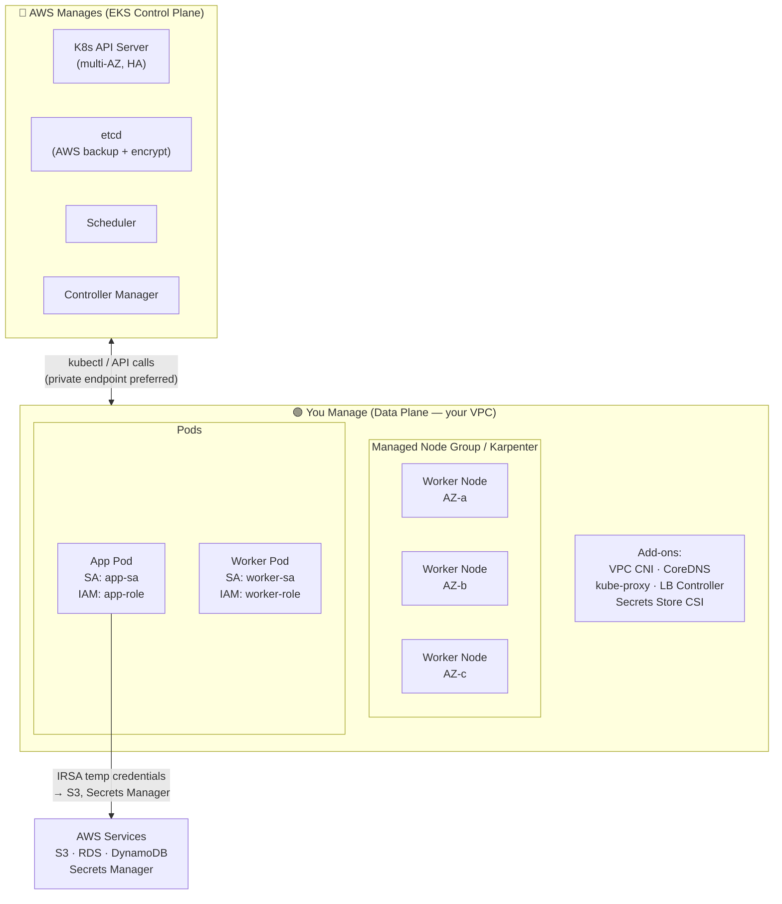
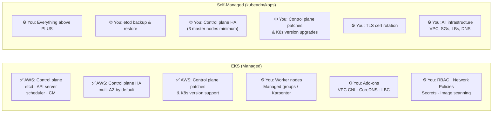
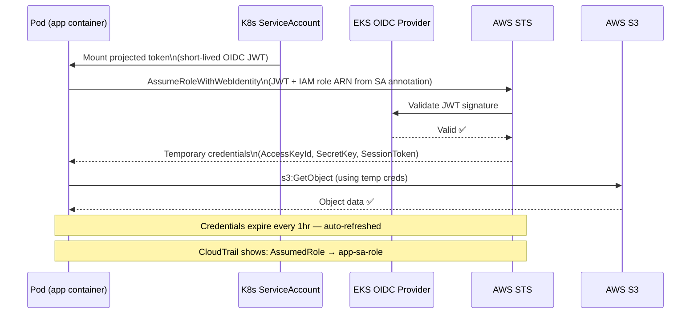
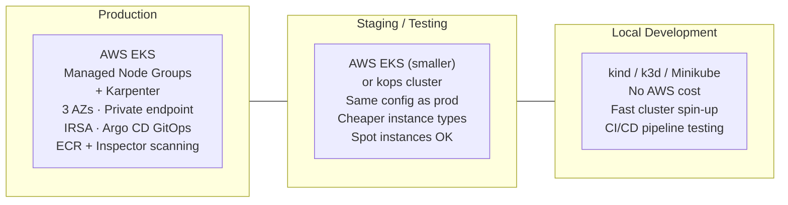

# AWS Question 9 — How Is Your Kubernetes Setup Configured on AWS?

> **Section:** AWS &nbsp;|&nbsp; **Topic:** Kubernetes / EKS / Container Orchestration &nbsp;|&nbsp; **Level:** Mid (2–5 yrs) &nbsp;|&nbsp; **Frequency:** Very High
>
> _Part of the DevOps & DevSecOps Interview Preparation series._

---

## ❓ The Question

> **"How is your Kubernetes setup configured on AWS? Walk me through it."**

This is a classic **opening interview question** — it's deliberately open-ended to let you reveal how much real-world K8s experience you actually have. Common follow-ups include:

- "Why did you choose EKS over self-managed Kubernetes?"
- "How do your worker nodes connect to AWS services like S3 or RDS?"
- "What node provisioner do you use — managed node groups, Fargate, or Karpenter?"
- "How do you handle cluster upgrades?"
- "How do you deploy applications — Helm, Argo CD, Flux?"
- "How do you secure pod-to-AWS-service access without hardcoding credentials?"
- "What's the difference between EKS and running kubeadm on EC2?"

---

## 🎯 Why Interviewers Ask This

This question is a **depth probe** — the answer reveals your actual K8s operational experience. Interviewers are checking whether you:

- Know the **fundamental choice**: managed (EKS) vs self-managed (kubeadm/kops) — and the trade-offs that drive production decisions.
- Understand **EKS architecture** — what AWS manages for you (control plane) vs what you own (worker nodes, add-ons, networking).
- Can explain **node provisioning options** — managed node groups, Fargate, Karpenter — and why you'd choose each.
- Know how to **securely connect pods to AWS services** — IAM Roles for Service Accounts (IRSA) is the expected answer, not hardcoded credentials.
- Have a real **deployment workflow** — Helm, GitOps (Argo CD/Flux), CI/CD integration.
- Understand the **production vs non-production split** — different tools and patterns for different environments.
- Have thought about **cluster security** — RBAC, network policies, pod security standards, secrets management.

> **The instant win:** Lead with your actual setup, use specific tool names, and immediately mention IRSA for AWS service access — it signals security maturity. Candidates who say "the pods just use the node's IAM role" reveal a gap right there.

---

## 📖 Key Terminologies

| Term | Plain-English meaning |
| --- | --- |
| **EKS (Elastic Kubernetes Service)** | AWS's fully managed Kubernetes control plane. AWS runs and patches etcd, the API server, scheduler, and controller manager. You manage worker nodes. |
| **Control Plane** | The K8s brain — API server, etcd, scheduler, controller manager. On EKS, AWS manages this entirely across multiple AZs. |
| **Data Plane / Worker Nodes** | The EC2 instances (or Fargate pods) that actually run your workloads. On EKS, you own and manage these. |
| **Managed Node Group** | AWS-managed EC2 instances as K8s worker nodes. AWS handles OS patching, AMI updates, and node lifecycle — you define instance type, size, and scaling boundaries. |
| **Fargate** | Serverless compute for pods — no nodes to manage. AWS provisions just enough compute per pod. Pay per pod CPU/memory. Good for bursty, isolated workloads. |
| **Karpenter** | Open-source node provisioner (CNCF project, originated at AWS) that just-in-time provisions right-sized EC2 nodes for pending pods. Replaces Cluster Autoscaler. |
| **kubeadm** | A tool to bootstrap a self-managed Kubernetes cluster on existing servers/VMs. You own everything — control plane, etcd, upgrades. |
| **kops** | "Kubernetes Operations" — a tool to provision and manage self-managed K8s clusters on AWS (or other clouds), handling the EC2 infrastructure and K8s setup together. |
| **eksctl** | The official CLI for creating and managing EKS clusters. Wraps CloudFormation under the hood. |
| **IRSA (IAM Roles for Service Accounts)** | The AWS-native way to grant pods IAM permissions. A K8s ServiceAccount is annotated with an IAM role ARN; pods using that SA get temporary AWS credentials without needing node-level IAM roles. |
| **EKS Pod Identity (2024)** | A newer, simpler alternative to IRSA — no OIDC provider setup needed; just associate a role with a service account directly. |
| **VPC CNI (aws-vpc-cni)** | The default EKS networking plugin. Assigns real VPC IP addresses to pods — pods are first-class VPC citizens, reachable from any VPC resource. |
| **CoreDNS** | The DNS server for Kubernetes — resolves service names inside the cluster. A managed add-on on EKS. |
| **Cluster Autoscaler** | Traditional K8s component that scales EC2 node groups based on pending pods. Being replaced by Karpenter in modern EKS setups. |
| **Helm** | Kubernetes package manager — deploys applications as "charts" (versioned, templated K8s manifests). `helm install`, `helm upgrade`, `helm rollback`. |
| **GitOps** | Deployment pattern where the desired state of K8s is stored in Git. A controller (Argo CD or Flux) continuously reconciles the cluster to match the Git state. |
| **EKS Auto Mode (2024)** | A new EKS operating mode where AWS manages not just the control plane but also node provisioning, scaling, add-ons, and patching — closer to fully managed K8s. |

---

## 🗣️ How to Answer (Structured)

### Step 1 — State your actual setup clearly

> "In our current production environment we run **AWS EKS** — the managed Kubernetes service. The control plane is fully managed by AWS across three Availability Zones, so we don't worry about etcd backups, API server patching, or control plane HA. Our worker nodes are a combination of **managed node groups** for the general workload and **Karpenter** for dynamic, right-sized node provisioning on burst traffic."

### Step 2 — Explain why EKS over self-managed

> "We chose EKS over kubeadm or kops primarily because we didn't want to own the control plane. Running self-managed K8s means managing etcd backup, control plane upgrades, and multi-AZ HA yourself. For production, the operational overhead wasn't worth it — EKS gives us a 99.95% SLA on the control plane and deep integration with AWS services out of the box: ALB Ingress Controller, VPC CNI, IRSA, CloudWatch Container Insights."

### Step 3 — Cover the non-production setup

> "For staging and development, we use either **Kops** to spin up a quick cluster on EC2 (when we need to test cluster-level changes), or **kind** (Kubernetes in Docker) for fully local development. Minikube is also fine for simple local testing."

### Step 4 — Explain how pods access AWS services (the IRSA/Pod Identity answer)

> "For pods that need to access AWS services — S3, RDS, Secrets Manager, DynamoDB — we use **IRSA (IAM Roles for Service Accounts)**. Each service account is annotated with an IAM role ARN; pods using that SA receive temporary STS credentials scoped to exactly what that role allows. This means zero long-lived credentials, no node-level over-permissioning, and full CloudTrail audit per pod identity. In newer clusters we're also evaluating **EKS Pod Identity**, which simplifies the OIDC setup."

### Step 5 — Cover the deployment workflow

> "Applications are deployed via **Helm charts** stored in our chart repository. Our CI/CD pipeline (GitHub Actions or Jenkins) runs `helm upgrade --install` on merge to main, with environment-specific values files. For GitOps-style continuous delivery we use **Argo CD**, which watches the Git repo and auto-syncs the cluster state — so the cluster always reflects what's in Git, with automatic drift detection."

### Step 6 — Mention security and observability briefly

> "Cluster RBAC is managed via Terraform. We use **network policies** (with the VPC CNI or Cilium) to enforce pod-to-pod communication rules. Secrets are injected via the **Secrets Store CSI Driver** pulling from AWS Secrets Manager — never stored as plaintext Kubernetes Secrets in etcd. For observability we use **CloudWatch Container Insights** for metrics and **Fluent Bit** to ship logs to CloudWatch Logs or OpenSearch."

---

## 🏗️ Deep Dive: The Three Kubernetes on AWS Approaches

### Approach 1 — AWS EKS (Managed — Production Standard)

**What AWS manages:** Control plane (API server, etcd, scheduler, controller manager) across 3 AZs — patched, HA, 99.95% SLA.

**What you manage:** Worker nodes (EC2 or Fargate), add-ons (VPC CNI, CoreDNS, kube-proxy), RBAC, network policies, application deployments.

**Node provisioning options:**

| Node Type | Who manages node lifecycle | Best for |
| --- | --- | --- |
| **Managed Node Groups** | AWS (OS, AMI updates, rolling upgrades) | General production workloads |
| **Self-managed EC2 nodes** | You entirely | Custom AMIs, advanced configuration |
| **Fargate Profiles** | AWS (no nodes visible) | Serverless pods, batch, isolated namespaces |
| **Karpenter NodePools** | Karpenter controller (just-in-time) | Dynamic workloads, Spot diversification, bin-packing |

**Key EKS integrations:**

- **VPC CNI** — Pods get real VPC IPs — directly accessible from RDS, ElastiCache, etc.
- **AWS Load Balancer Controller** — Creates ALB/NLB for Ingress/Service objects natively
- **IRSA / EKS Pod Identity** — Fine-grained IAM per pod, no node-level over-permissioning
- **CloudWatch Container Insights** — Native metrics and logs
- **AWS Secrets Manager + Secrets Store CSI Driver** — No plaintext secrets in etcd

---

### Approach 2 — Self-Managed (kubeadm / kops)

**kubeadm:** Bootstraps K8s on existing EC2 instances. You provision the VMs, run `kubeadm init` on the master, `kubeadm join` on workers. You own etcd backup, HA for the control plane, upgrades, and all add-ons.

**kops:** End-to-end cluster lifecycle on AWS — creates the EC2 instances, VPCs, Route53 DNS records, and K8s bootstrap. More opinionated than kubeadm, but easier to manage upgrades.

**When self-managed is appropriate:**
- Highly customised control plane configuration
- Compliance requirements that prevent using a managed service
- Learning/certification environments (CKA heavily tests kubeadm)
- Hybrid on-prem + cloud setups (EKS Anywhere is the modern answer here)

**The trade-off:** You own etcd — if you lose it without a backup, you lose the entire cluster state. etcd backup/restore is a critical operational skill (and CKA exam topic).

---

### Approach 3 — Local / Development (Minikube / kind / k3d)

| Tool | How it works | Best for |
| --- | --- | --- |
| **Minikube** | Single-node K8s cluster in a VM or container | Learning, simple local testing |
| **kind** (K8s in Docker) | Multi-node K8s cluster using Docker containers as nodes | CI/CD pipeline testing, lightweight multi-node |
| **k3d** | k3s (lightweight K8s) in Docker | Fast local cluster, low resource usage |

---

## 🔐 Security Perspective (DevSecOps)

EKS is the platform — but security is your responsibility for everything outside the control plane:

- **IRSA / EKS Pod Identity — never use node IAM roles for pod permissions.** If a node's IAM role has S3 access and your pod is compromised, the attacker gets S3 access for all pods on that node. IRSA scopes credentials to individual service accounts — a compromised pod gets only what its service account allows.

- **Secrets never in etcd as plaintext.** Kubernetes Secrets are base64-encoded in etcd — not encrypted by default. Use the **Secrets Store CSI Driver** to pull secrets from AWS Secrets Manager at pod startup, or enable **EKS Secrets Encryption** (KMS envelope encryption for etcd objects). Never store DB passwords or API keys as K8s Secrets without KMS encryption.

- **RBAC is your internal access control.** Map IAM users/roles to K8s RBAC via `aws-auth` ConfigMap (legacy) or **EKS Access Entries** (2024 feature). Follow least privilege: developers get `view` on their namespace, not `cluster-admin`.

- **Network Policies for zero-trust pod communication.** By default, all pods in an EKS cluster can talk to each other. Use Kubernetes NetworkPolicy objects (enforced by VPC CNI or Cilium) to allow only the necessary pod-to-pod paths — app tier → DB tier → nothing else.

- **Pod Security Standards (PSS) / OPA Gatekeeper.** Enforce that pods can't run as root, can't mount the host filesystem, can't use privileged mode. Use the built-in Pod Security Admission controller (K8s 1.25+) or OPA Gatekeeper / Kyverno for more complex policies.

- **Public vs private API endpoint.** EKS clusters can expose the K8s API publicly (for `kubectl` from anywhere) or only within the VPC. In production, **disable the public endpoint** and access the cluster via VPN or a bastion. If public endpoint must remain, use `publicAccessCidrs` to restrict it to your corporate IP ranges.

- **Container image security.** Every image deployed to EKS should come from a trusted, scanned registry. Use **Amazon ECR** with image scanning (on push via AWS Inspector), **immutable tags**, and OPA/Kyverno policies to reject images from untrusted registries or with critical CVEs.

- **Cluster upgrade security.** EKS supports K8s versions for ~14 months. Unpatched clusters accumulate CVEs. Use **eksctl upgrade cluster** with managed node group rolling upgrades — test in staging, then prod. Never skip more than one minor version.

> **One-liner for the room:** *"EKS gives us a managed, HA control plane — AWS patches etcd and the API server. Our security responsibilities are: IRSA for pod-level IAM, Secrets Store CSI for secrets (not plaintext K8s Secrets), RBAC via EKS Access Entries, Network Policies for east-west isolation, and ECR with Inspector scanning for image security. The control plane is AWS's problem; the workloads are ours."*

---

## 🖼️ Visuals

### Mermaid — EKS architecture: what AWS owns vs what you own



### Mermaid — EKS vs Self-Managed K8s: responsibility split



### Mermaid — IRSA flow: how pods get IAM credentials securely



### Mermaid — Production vs staging vs dev K8s setup



---

## 📊 Quick Comparison — EKS Node Provisioning Options

| | **Managed Node Groups** | **Self-Managed Nodes** | **Fargate** | **Karpenter** |
| --- | --- | --- | --- | --- |
| **Who manages node OS** | AWS | You | AWS (no nodes) | AWS (via EC2) |
| **AMI updates** | AWS (rolling) | You | N/A | Karpenter (latest EKS AMI) |
| **Node scaling** | Cluster Autoscaler / ASG | ASG | Auto per pod | Just-in-time per pod |
| **Instance type flexibility** | Fixed at group creation | Fixed at group creation | Not configurable | Any EC2 type — dynamic |
| **Spot support** | ✅ Yes | ✅ Yes | ❌ No | ✅ Yes (diversified) |
| **Bin-packing / consolidation** | ❌ No | ❌ No | N/A | ✅ Yes (saves cost) |
| **Best for** | Stable, predictable workloads | Custom kernel/AMI needs | Isolated, serverless pods | Dynamic, cost-optimised workloads |

---

## 🛠️ Hands-On: Commands & Syntax

### 1) Create an EKS cluster with eksctl (the fastest production-ready path)

```bash
# Install eksctl
curl -sLO "https://github.com/eksctl-io/eksctl/releases/latest/download/eksctl_Linux_amd64.tar.gz"
tar -xzf eksctl_Linux_amd64.tar.gz && sudo mv eksctl /usr/local/bin/

# Create a production-grade EKS cluster with managed node groups
eksctl create cluster \
  --name prod-cluster \
  --region us-east-1 \
  --version 1.30 \
  --nodegroup-name general \
  --node-type m5.xlarge \
  --nodes 3 \
  --nodes-min 2 \
  --nodes-max 10 \
  --managed \
  --asg-access \
  --external-dns-access \
  --full-ecr-access \
  --appmesh-access \
  --alb-ingress-access \
  --node-private-networking   # Worker nodes in private subnets

# OR: Use a cluster config file for repeatability (production standard)
cat > cluster-config.yaml << 'EOF'
apiVersion: eksctl.io/v1alpha5
kind: ClusterConfig
metadata:
  name: prod-cluster
  region: us-east-1
  version: "1.30"

privateCluster:
  enabled: true   # Private API endpoint — no public access

managedNodeGroups:
  - name: general
    instanceType: m5.xlarge
    minSize: 2
    maxSize: 10
    desiredCapacity: 3
    privateNetworking: true
    iam:
      withAddonPolicies:
        awsLoadBalancerController: true
        certManager: true
        ebs: true
        efs: true
addons:
  - name: vpc-cni
    version: latest
  - name: coredns
    version: latest
  - name: kube-proxy
    version: latest
  - name: aws-ebs-csi-driver
    version: latest
EOF

eksctl create cluster -f cluster-config.yaml

# Get kubectl credentials
aws eks update-kubeconfig --name prod-cluster --region us-east-1
kubectl get nodes
```

### 2) Set up IRSA (IAM Roles for Service Accounts) — the secure pod-to-AWS pattern

```bash
# Step 1: Create an OIDC provider for the cluster (one-time setup)
eksctl utils associate-iam-oidc-provider \
  --cluster prod-cluster \
  --region us-east-1 \
  --approve

# Step 2: Create an IAM role scoped to a specific K8s ServiceAccount
eksctl create iamserviceaccount \
  --cluster prod-cluster \
  --namespace production \
  --name app-service-account \
  --attach-policy-arn arn:aws:iam::111122223333:policy/AppS3ReadOnly \
  --approve \
  --override-existing-serviceaccounts

# Step 3: Verify the annotation was applied to the ServiceAccount
kubectl describe serviceaccount app-service-account -n production
# Look for: eks.amazonaws.com/role-arn: arn:aws:iam::111122223333:role/...

# Step 4: Use the ServiceAccount in a pod/deployment
cat > app-deployment.yaml << 'EOF'
apiVersion: apps/v1
kind: Deployment
metadata:
  name: app
  namespace: production
spec:
  replicas: 3
  selector:
    matchLabels:
      app: myapp
  template:
    metadata:
      labels:
        app: myapp
    spec:
      serviceAccountName: app-service-account   # ← IRSA binding here
      containers:
        - name: app
          image: 111122223333.dkr.ecr.us-east-1.amazonaws.com/myapp:latest
          ports:
            - containerPort: 8080
EOF
kubectl apply -f app-deployment.yaml
```

### 3) Install Karpenter (modern node provisioner — replaces Cluster Autoscaler)

```bash
# Install Karpenter via Helm
helm registry logout public.ecr.aws
helm upgrade --install karpenter oci://public.ecr.aws/karpenter/karpenter \
  --version "1.0.0" \
  --namespace kube-system \
  --set "settings.clusterName=prod-cluster" \
  --set "settings.interruptionQueue=prod-cluster" \
  --set controller.resources.requests.cpu=1 \
  --set controller.resources.requests.memory=1Gi \
  --wait

# Create a Karpenter NodePool (replaces nodegroups for dynamic workloads)
cat > nodepool.yaml << 'EOF'
apiVersion: karpenter.sh/v1
kind: NodePool
metadata:
  name: default
spec:
  template:
    spec:
      requirements:
        - key: karpenter.sh/capacity-type
          operator: In
          values: ["spot", "on-demand"]
        - key: karpenter.k8s.aws/instance-category
          operator: In
          values: ["c", "m", "r"]
        - key: karpenter.k8s.aws/instance-generation
          operator: Gt
          values: ["4"]
      nodeClassRef:
        group: karpenter.k8s.aws
        kind: EC2NodeClass
        name: default
  disruption:
    consolidationPolicy: WhenEmptyOrUnderutilized
    consolidateAfter: 1m
  limits:
    cpu: 1000
    memory: 1000Gi
---
apiVersion: karpenter.k8s.aws/v1
kind: EC2NodeClass
metadata:
  name: default
spec:
  amiFamily: AL2023
  role: KarpenterNodeRole-prod-cluster
  subnetSelectorTerms:
    - tags:
        karpenter.sh/discovery: prod-cluster
  securityGroupSelectorTerms:
    - tags:
        karpenter.sh/discovery: prod-cluster
EOF
kubectl apply -f nodepool.yaml
```

### 4) Helm — deploy and manage applications

```bash
# Add a chart repository
helm repo add bitnami https://charts.bitnami.com/bitnami
helm repo update

# Install an application (e.g., nginx ingress controller)
helm install ingress-nginx ingress-nginx/ingress-nginx \
  --namespace ingress-nginx \
  --create-namespace \
  --set controller.service.type=LoadBalancer

# Deploy your own app with environment-specific values
helm install my-application ./my-chart \
  --namespace production \
  --values ./values/production.yaml \
  --set image.tag=$(git rev-parse --short HEAD)   # pin image tag to git commit

# Upgrade with rollback capability
helm upgrade my-application ./my-chart \
  --namespace production \
  --values ./values/production.yaml \
  --atomic \           # auto-rollback if upgrade fails
  --timeout 5m

# Rollback to previous release
helm rollback my-application 1 --namespace production

# Check release history
helm history my-application --namespace production
```

### 5) Upgrade an EKS cluster (safe, production procedure)

```bash
# Step 1: Check current version and available upgrades
aws eks describe-cluster --name prod-cluster \
  --query 'cluster.{Version:version,Status:status}' --output table

# Step 2: Upgrade control plane (managed by AWS — usually fast)
aws eks update-cluster-version \
  --name prod-cluster \
  --kubernetes-version 1.31

# Wait for control plane upgrade
aws eks wait cluster-active --name prod-cluster

# Step 3: Update managed add-ons
aws eks update-addon --cluster-name prod-cluster --addon-name vpc-cni --resolve-conflicts OVERWRITE
aws eks update-addon --cluster-name prod-cluster --addon-name coredns --resolve-conflicts OVERWRITE
aws eks update-addon --cluster-name prod-cluster --addon-name kube-proxy --resolve-conflicts OVERWRITE

# Step 4: Update managed node group (rolling update, zero downtime)
aws eks update-nodegroup-version \
  --cluster-name prod-cluster \
  --nodegroup-name general \
  --launch-template version=2   # or just omit for latest EKS-optimised AMI

# Step 5: Verify all nodes are on the new version
kubectl get nodes -o wide
```

### 6) Terraform — EKS cluster (production IaC pattern)

```hcl
module "eks" {
  source  = "terraform-aws-modules/eks/aws"
  version = "~> 20.0"

  cluster_name    = "prod-cluster"
  cluster_version = "1.30"

  # Private API endpoint — no public access from internet
  cluster_endpoint_public_access  = false
  cluster_endpoint_private_access = true

  vpc_id     = module.vpc.vpc_id
  subnet_ids = module.vpc.private_subnets

  # EKS Managed Add-ons — let AWS handle version compatibility
  cluster_addons = {
    coredns = {
      most_recent = true
    }
    kube-proxy = {
      most_recent = true
    }
    vpc-cni = {
      most_recent = true
    }
    aws-ebs-csi-driver = {
      most_recent              = true
      service_account_role_arn = module.ebs_csi_irsa_role.iam_role_arn
    }
  }

  # Managed Node Group — general workloads
  eks_managed_node_groups = {
    general = {
      min_size     = 2
      max_size     = 10
      desired_size = 3

      instance_types = ["m5.xlarge", "m5a.xlarge", "m6i.xlarge"]
      capacity_type  = "ON_DEMAND"   # Stable baseline

      update_config = {
        max_unavailable_percentage = 33   # Rolling update: max 1/3 unavailable at once
      }
    }
  }

  # IRSA — enable OIDC provider for pod-level IAM
  enable_irsa = true

  # KMS encryption for K8s secrets in etcd
  cluster_encryption_config = {
    provider_key_arn = aws_kms_key.eks.arn
    resources        = ["secrets"]
  }

  tags = {
    Environment = "production"
    ManagedBy   = "terraform"
  }
}

# IRSA role for the app service account
module "app_irsa" {
  source  = "terraform-aws-modules/iam/aws//modules/iam-role-for-service-accounts-eks"
  version = "~> 5.0"

  role_name = "app-irsa-role"
  oidc_providers = {
    main = {
      provider_arn               = module.eks.oidc_provider_arn
      namespace_service_accounts = ["production:app-service-account"]
    }
  }
  role_policy_arns = {
    s3_read = aws_iam_policy.app_s3_readonly.arn
  }
}
```

---

## 🤖 AI & The New Trend (2024–2025) — what changed, and what to learn

> Kubernetes on AWS is going through a major simplification wave driven by AI tooling and AWS-native automation. The 2025 EKS story is: less manual cluster management, more intelligent workload placement, and K8s as the platform for AI/ML inference at scale.

### How AI is impacting Kubernetes on AWS

- **EKS Auto Mode (November 2024 — major feature)** — AWS launched EKS Auto Mode, where AWS manages not just the control plane but also **node provisioning, scaling, networking, add-ons, and patching** for the data plane. It uses Karpenter under the hood and auto-selects instance types. For many teams this means EKS is now as close to "fully managed K8s" as possible — you define workloads; AWS handles the infrastructure. This is the most significant EKS launch since EKS Fargate.

- **Karpenter + AI workloads** — Karpenter was designed with AI/ML workloads in mind. It can just-in-time provision GPU nodes (p4d, g5, trn1) for inference requests and consolidate them back to zero when idle. This "scale GPU pods to zero" pattern is critical for cost in AI inference — GPU nodes idle for hours cost a fortune.

- **Amazon EKS Pod Identity (2024)** — A simpler replacement for IRSA that doesn't require setting up an OIDC provider manually. One command to associate a role with a service account. Expect this to become the standard in 2025–2026.

- **Argo CD + AI-generated GitOps manifests** — Teams are using Amazon Q Developer and Copilot to generate Helm values, Kubernetes manifests, and Argo CD Application CRs. The GitOps workflow becomes: developer describes what they need → AI generates the K8s YAML → PR review → Argo CD deploys. The human reviews, not writes, YAML.

- **Amazon GuardDuty EKS Runtime Monitoring** — GuardDuty now monitors K8s runtime (pod/container behaviour) for threats: cryptomining, privilege escalation, container breakout, anomalous network activity. ML-driven, no custom rules needed.

- **Amazon Inspector for ECR** — Continuous vulnerability scanning of container images in ECR, with integration to K8s admission controllers (OPA/Kyverno) to block deployment of images with critical CVEs. The scan happens on push and on new CVE database updates — images that were clean yesterday may have findings today.

### How AI can contribute to your day-to-day

- **Generate Kubernetes manifests** — "Give me a Deployment + Service + HPA + NetworkPolicy for a Node.js app that reads from DynamoDB and serves HTTPS on port 443." Review the output for security issues (root user, privileged mode, missing resource limits).
- **Explain kubectl output** — Paste `kubectl describe pod` or `kubectl get events` into Amazon Q to diagnose CrashLoopBackOff, OOMKilled, or ImagePullBackOff issues instantly.
- **Karpenter NodePool generation** — Describe workload requirements and generate a complete NodePool + EC2NodeClass configuration.
- **EKS upgrade planning** — Ask Q: "What breaking changes exist between K8s 1.28 and 1.30 that might affect my workloads?"

### ⚠️ Security caveat (DevSecOps)

- **AI-generated K8s YAML often runs as root, skips resource limits, and grants broad RBAC.** Always review for: `securityContext.runAsNonRoot: true`, `resources.requests/limits`, minimal RBAC roles.
- **Never paste kubeconfig files, AWS credentials, or cluster endpoint URLs into public AI tools.** Use Amazon Q in your AWS account.
- **EKS Auto Mode reduces ops burden but doesn't reduce your security responsibility** — IRSA, RBAC, network policies, and image scanning still apply.

### What to learn right now (priority order)

1. **EKS + eksctl/Terraform provisioning** — the production baseline; know managed node groups + private endpoint + IRSA.
2. **IRSA and EKS Pod Identity** — pod-to-AWS service auth; the most-probed EKS security topic.
3. **Karpenter** — the modern node provisioner; replacing Cluster Autoscaler in most new setups.
4. **EKS Auto Mode (2024)** — the future of managed EKS; understand what it automates and what you still own.
5. **Helm + Argo CD** — the deployment workflow stack; GitOps is the expected answer for "how do you deploy to K8s?"
6. **GuardDuty EKS + ECR Inspector** — K8s runtime security and image security; the DevSecOps story for containers.

---

## ✅ Prerequisites (be solid on these first)

- **Kubernetes fundamentals** — Pods, Deployments, Services, ConfigMaps, Secrets, RBAC, Namespaces, HPA.
- **AWS VPC and networking** — subnets, security groups, IAM — EKS integrates deeply with all three.
- **IAM fundamentals** — roles, policies, OIDC, STS — required to understand IRSA and Pod Identity.
- **Docker fundamentals** — images, ECR push/pull, multi-stage builds — containers are what K8s runs.
- **Helm basics** — `helm install`, `helm upgrade`, values files, chart structure.
- **(Bonus) GitOps (Argo CD / Flux)** — the modern deployment standard; knowing it well differentiates mid-level candidates.
- **(Bonus) Karpenter** — rapidly becoming the expected node provisioner answer in EKS interviews.

---

## 📚 Further Reading (current docs)

- **AWS EKS User Guide** — AWS docs: <https://docs.aws.amazon.com/eks/latest/userguide/what-is-eks.html>
- **eksctl documentation** — <https://eksctl.io/introduction/>
- **IRSA (IAM Roles for Service Accounts)** — AWS docs: <https://docs.aws.amazon.com/eks/latest/userguide/iam-roles-for-service-accounts.html>
- **EKS Pod Identity (2024)** — AWS docs: <https://docs.aws.amazon.com/eks/latest/userguide/pod-identities.html>
- **EKS Auto Mode (2024)** — AWS docs: <https://docs.aws.amazon.com/eks/latest/userguide/automode.html>
- **Karpenter** — <https://karpenter.sh/docs/>
- **AWS Load Balancer Controller** — <https://kubernetes-sigs.github.io/aws-load-balancer-controller/>
- **Secrets Store CSI Driver + AWS Secrets Manager** — <https://docs.aws.amazon.com/secretsmanager/latest/userguide/integrating_csi_driver.html>
- **GuardDuty EKS Runtime Monitoring** — AWS docs: <https://docs.aws.amazon.com/guardduty/latest/ug/kubernetes-protection.html>
- **Amazon Inspector for ECR** — AWS docs: <https://docs.aws.amazon.com/inspector/latest/user/enable-disable-scanning-ecr.html>
- **EKS Best Practices Guide** — AWS GitHub: <https://aws.github.io/aws-eks-best-practices/>
- **Terraform EKS module** — <https://registry.terraform.io/modules/terraform-aws-modules/eks/aws/latest>
- **Argo CD** — <https://argo-cd.readthedocs.io/en/stable/>
- **Helm documentation** — <https://helm.sh/docs/>
- **KodeKloud lesson (video):** <https://learn.kodekloud.com/user/courses/devops-interview-preparation-course/module/f1169a2e-23de-4377-bc4f-a07c136a11d6/lesson/4138f3ef-a217-41e6-8008-b5d9d60641aa>

---

## 🔁 Related / Follow-up Questions (they often go here next)

1. **What does AWS manage in EKS vs what do you manage?** → AWS manages: control plane (etcd, API server, scheduler, controller manager) across 3 AZs, control plane patches and upgrades. You manage: worker nodes (EC2/Fargate), add-ons (VPC CNI, CoreDNS), RBAC, network policies, application deployments, and all security configurations.
2. **What is IRSA and why is it better than giving the node an IAM role?** → IRSA (IAM Roles for Service Accounts) grants AWS credentials at the pod level via an OIDC JWT token. Each pod gets only the permissions its service account needs. Node IAM roles grant permissions to ALL pods on that node — if any one pod is compromised, all pods on that node get the same AWS access. IRSA follows least privilege at the pod level.
3. **What is EKS Pod Identity and how does it differ from IRSA?** → EKS Pod Identity (2024) achieves the same goal as IRSA — pod-level IAM credentials — but without needing to manually configure an OIDC provider or annotate service accounts with ARNs. Instead, you create a "pod identity association" that maps a K8s namespace + service account to an IAM role. Simpler setup, same security model.
4. **How does Karpenter differ from the Cluster Autoscaler?** → Cluster Autoscaler scales existing node groups (ASGs) up/down — reactive, tied to pre-defined instance types. Karpenter provisions brand-new EC2 nodes just-in-time for pending pods, selecting the best instance type from any EC2 family, including Spot, and consolidates idle nodes via bin-packing. Karpenter is faster, cheaper, and more flexible.
5. **How do you do zero-downtime deployments to EKS?** → Use `RollingUpdate` deployment strategy with `maxUnavailable: 0` and `maxSurge: 1`. Set proper `readinessProbe` so traffic only routes to healthy pods. Use `preStop` hooks and `terminationGracePeriodSeconds` for graceful drain. For database migrations: run as an init container or Job before the new pods start.
6. **How do you handle secrets in Kubernetes securely?** → Option 1: **Secrets Store CSI Driver + AWS Secrets Manager** — secrets are mounted as files/env vars at pod startup, never stored in etcd. Option 2: **Enable KMS envelope encryption** for K8s Secrets in etcd — base64-encoded Secrets are encrypted at rest. Option 3: **External Secrets Operator** — syncs Secrets Manager secrets into K8s Secrets automatically. Never store plaintext passwords in K8s Secrets without KMS encryption.
7. **What is the EKS VPC CNI and why does it matter?** → The VPC CNI plugin assigns real VPC IP addresses to pods (not overlay network addresses). This means pods are first-class VPC citizens — directly reachable from RDS, ElastiCache, Lambda, and other VPC resources without NAT. Security groups can be applied at the pod level (Security Groups for Pods). The trade-off: you need enough IP addresses in your subnets — plan for `max_pods_per_node × num_nodes` VPC IPs.
8. **How do you do a cluster upgrade without downtime?** → (1) Upgrade the control plane first (`aws eks update-cluster-version`) — no downtime for worker nodes/pods. (2) Update managed add-ons. (3) Update node groups with a rolling update (`max_unavailable = 1` or 33%). (4) Test in staging first, use `kubectl cordon/drain` for controlled node replacement. (5) Never skip more than one minor version.
9. **What is EKS Auto Mode?** → Launched in November 2024, EKS Auto Mode extends the "managed" model to the data plane. AWS provisions, scales, upgrades, and patches worker nodes automatically using Karpenter. You define workloads via K8s manifests; EKS Auto Mode handles the node infrastructure. You still own RBAC, network policies, IRSA, and application security — but not node management.
10. **How do you monitor a Kubernetes cluster on AWS?** → **CloudWatch Container Insights** for cluster/node/pod metrics and logs (quick setup with a single eksctl add-on command). **Fluent Bit** as a DaemonSet to ship container logs to CloudWatch Logs or OpenSearch. **AWS Distro for OpenTelemetry (ADOT)** for metrics → Prometheus → Grafana. **GuardDuty EKS Runtime Monitoring** for threat detection. **kube-state-metrics** + Prometheus for deep K8s state visibility.

---

> 📌 **30-second interview summary:** In production we run **AWS EKS** — AWS manages the control plane (etcd, API server, HA across 3 AZs) and we manage the data plane. Worker nodes use **managed node groups** for the stable baseline and **Karpenter** for dynamic, cost-optimised provisioning. Pods access AWS services via **IRSA** (IAM Roles for Service Accounts) — pod-level temporary credentials, never node-level over-permissioning. Applications deploy via **Helm** charts in a GitOps pipeline backed by **Argo CD**. Secrets come from **AWS Secrets Manager** via the Secrets Store CSI Driver — never plaintext K8s Secrets. For non-production we use kops or kind for fast cluster spin-up. The 2024 evolution: **EKS Auto Mode** moves node management to AWS, **EKS Pod Identity** simplifies IRSA, and **Karpenter** makes GPU/Spot provisioning for AI workloads near-zero-ops.
