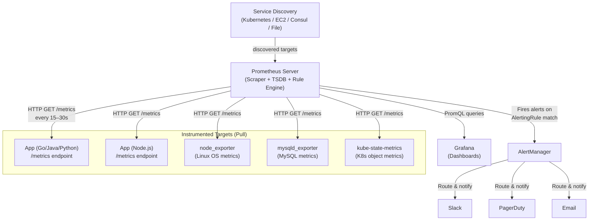
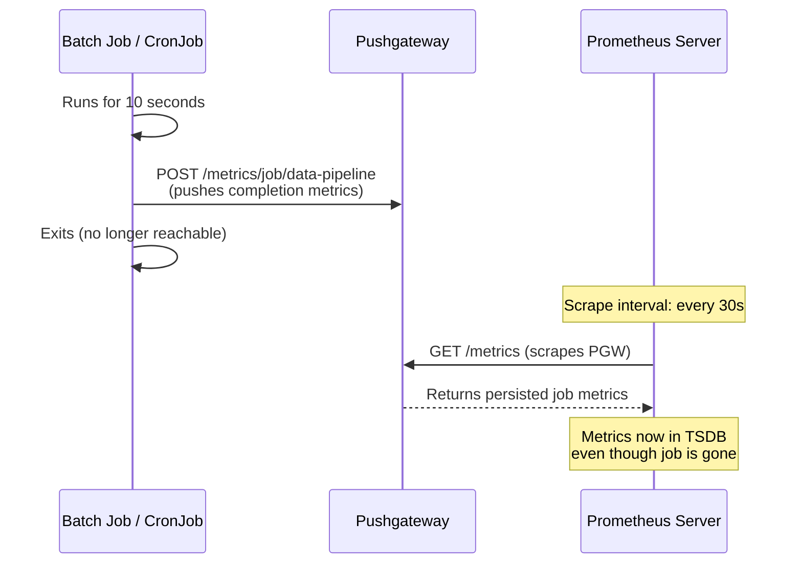
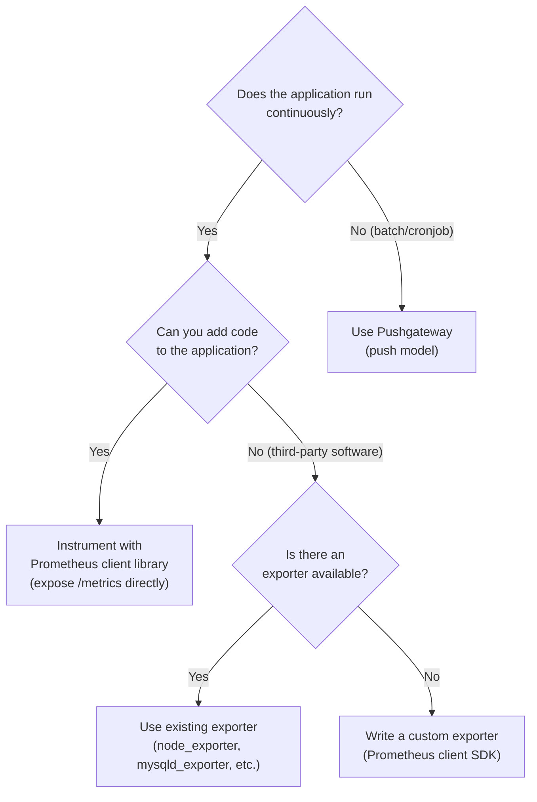
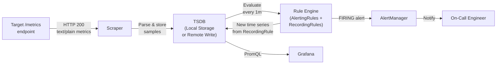

# Monitoring & Alerting Question 1 — How Prometheus Collects Metrics

> **Section:** Monitoring & Alerting &nbsp;|&nbsp; **Topic:** Prometheus Architecture — Pull vs Push Metric Collection &nbsp;|&nbsp; **Level:** Mid (2–5 yrs) &nbsp;|&nbsp; **Frequency:** Very High
>
> _Part of the DevOps & DevSecOps Interview Preparation series._

---

## ❓ The Question

> **"Explain the different ways in which Prometheus can collect metrics."**

You may also hear this phrased as:

- *"What is the difference between a pull-based and push-based monitoring approach?"*
- *"How does Prometheus scrape metrics from a target?"*
- *"When would you use the Pushgateway over the standard pull model?"*
- *"What is an exporter in Prometheus? Give examples."*
- *"How does Prometheus discover targets dynamically in a Kubernetes cluster?"*
- *"How is Prometheus different from Nagios or Zabbix in how it collects data?"*

---

## 🎯 Why Interviewers Ask This

This question is a foundational **architecture and design question** for any DevOps or SRE role. Interviewers use it to determine whether you:

- Understand **why Prometheus chose the pull model** — and the tradeoffs that choice creates.
- Know the **Pushgateway** exists and understand the specific narrow scenario it solves (short-lived batch jobs, not a general workaround).
- Can explain **exporters** — the translation layer that makes anything exposable to Prometheus.
- Understand **service discovery** — how Prometheus scales scraping to hundreds of ephemeral targets in Kubernetes without manual configuration.
- Can compare Prometheus to older agent-push tools (Nagios, Zabbix, Datadog agent) and articulate the architectural difference.

> **The instant win:** Saying *"Prometheus is primarily pull-based — it scrapes `/metrics` endpoints — but also supports push via the Pushgateway for short-lived batch jobs that would disappear before the scrape interval"* immediately shows you understand *both* the mechanism and *when* each applies.

---

## 📖 Key Terminologies

| Term | Plain-English Meaning |
|------|----------------------|
| **Prometheus** | Open-source monitoring system and time-series database — pulls metrics from targets on a configurable interval |
| **Scrape** | The act of Prometheus making an HTTP GET request to a target's `/metrics` endpoint to collect its current metric values |
| **Pull-based** | Monitoring system *initiates* the data collection — it reaches out to targets |
| **Push-based** | The target *initiates* data delivery — it sends metrics to the monitoring system |
| **Target** | Any endpoint Prometheus scrapes — an application, an exporter, or the Pushgateway |
| **Exporter** | A sidecar process that exposes metrics for a system that can't natively speak Prometheus format (e.g., `node_exporter` for Linux OS metrics) |
| **Pushgateway** | An intermediary service that accepts pushed metrics and exposes them for Prometheus to scrape — bridging push for batch jobs |
| **TSDB (Time-Series Database)** | Prometheus's built-in storage engine — stores metric samples as (timestamp, value) pairs per time series |
| **PromQL** | Prometheus Query Language — functional query language for selecting and aggregating time-series data |
| **AlertManager** | Component that receives alerts from Prometheus, deduplicates, groups, and routes them to receivers (PagerDuty, Slack, email) |
| **Service Discovery** | Mechanism by which Prometheus automatically finds and tracks targets (Kubernetes, EC2, Consul, DNS, file-based) |
| **Label** | Key-value pair attached to every metric — the primary way to filter and aggregate in PromQL |
| **Recording Rule** | Pre-computed PromQL expression saved as a new metric — improves query performance for complex, frequently-used queries |
| **Instrumentation** | Adding Prometheus client library code to an application to expose `/metrics` natively |
| **Exposition Format** | The text-based format Prometheus targets expose metrics in (OpenMetrics / Prometheus text format) |

---

## 🗣️ How to Answer (Structured)

**1) Start with the primary model — pull:**
> "Prometheus's primary model is pull-based. It maintains a list of targets — endpoints that expose a `/metrics` HTTP endpoint — and periodically sends a GET request to each one. The application or exporter returns all current metric values in Prometheus text format, and Prometheus stores them in its time-series database. This happens on a configurable interval — typically every 15 or 30 seconds."

**2) Explain what happens when targets can't expose their own metrics — exporters:**
> "Not every system can be instrumented to speak Prometheus natively. That's where exporters come in. An exporter is a separate process that runs alongside the target, translates its metrics into Prometheus format, and exposes a `/metrics` endpoint. The `node_exporter` does this for Linux OS metrics (CPU, memory, disk). `mysqld_exporter` does it for MySQL. `blackbox_exporter` does active probing of HTTP/HTTPS/TCP endpoints."

**3) Address the push scenario — Pushgateway:**
> "The pull model has one gap: short-lived batch jobs or cronjobs that finish in seconds. Prometheus might scrape every 30 seconds, so a job that runs for 10 seconds would never get scraped before it exits. For these cases, Prometheus provides the Pushgateway — a persistent intermediate service. The batch job *pushes* its metrics to the Pushgateway when it finishes, and Prometheus then *scrapes* the Pushgateway. The key point is the Pushgateway is not a general alternative to pull — it's specifically for ephemeral jobs."

**4) Add the scaling layer — service discovery:**
> "In dynamic environments like Kubernetes, manually listing targets is not practical. Prometheus supports service discovery — it integrates with Kubernetes, EC2, Consul, and others to automatically discover targets. For Kubernetes, it watches the API server and automatically adds new pods, services, and nodes as they appear, applying relabeling rules to filter and tag them."

**5) Close with comparison to push-based tools:**
> "Tools like Nagios, Zabbix, and Datadog agents use a push model — agents on each host push data to a central server. The tradeoff: push is simpler for the target but harder to control centrally — you rely on agents behaving correctly. Pull means Prometheus knows exactly when a target goes silent (scrape fails), making it easier to detect target-down conditions."

---

## 🔐 Security Perspective (DevSecOps)

The way Prometheus collects metrics has direct security implications that interviewers at security-conscious companies will probe:

- **Unauthenticated `/metrics` endpoints are a data leak.** By default, Prometheus exporters expose their `/metrics` endpoint with no authentication — anyone who can reach the port can read operational data (CPU, memory, open file descriptors, internal service names). Always protect metrics endpoints with:
  - **TLS** — encrypt metrics traffic in transit (especially in multi-tenant clusters)
  - **Basic auth** (Prometheus 2.24+ supports scraping with `basic_auth`)
  - **Network policy** — restrict which IPs or pods can reach exporter ports (only allow the Prometheus pod)

- **Pushgateway is a persistent attack surface.** Because pushed metrics persist until overwritten or deleted, a compromised job could push false metrics (e.g., artificially marking a service as healthy). Protect the Pushgateway with authentication and restrict who can push to it.

- **Metric labels can leak sensitive data.** Labels like `user_id`, `request_url`, or `error_message` in metrics can inadvertently expose PII. Use cardinality guards and review labels before instrumenting applications.

- **High cardinality = Denial of Service.** Metrics with unbounded labels (e.g., `request_id` as a label) cause cardinality explosion — Prometheus stores a separate time series per unique label combination. This can crash Prometheus. Use `rate()`, histogram buckets, and label discipline to prevent this.

- **Prometheus federation and remote write expose your entire metric dataset.** When federating or remote-writing to an external system (Grafana Cloud, Cortex, Thanos), all metrics including sensitive operational data leave your cluster. Ensure the remote endpoint is authenticated and the network path is encrypted.

- **RBAC for AlertManager.** AlertManager routes to real communication channels (PagerDuty, Slack, email). Protect its configuration API with authentication — a misconfigured AlertManager silence rule can suppress real production alerts.

> **One-liner for the room:** *"Prometheus pull is powerful but every `/metrics` endpoint is a potential information disclosure risk — always apply network policy + TLS, and audit your label cardinality before it crashes your TSDB."*

---

## 🖼️ Visuals

### Mermaid — Prometheus Pull Architecture (Full Component View)



### Mermaid — Push Model via Pushgateway (for Batch Jobs)



### Mermaid — Pull vs Push Decision Tree



### Mermaid — Prometheus Data Flow: From Scrape to Alert



---

## 📊 Quick Comparison — Pull vs Push vs Exporter vs Pushgateway

| | **Pull (Scrape)** | **Push (Pushgateway)** | **Exporter** | **Client Library** |
|---|---|---|---|---|
| **Who initiates** | Prometheus | The application | Prometheus (scrapes exporter) | Prometheus |
| **Best for** | Long-running services | Short-lived batch jobs | Third-party software | Applications you own |
| **Target needs to** | Expose `/metrics` endpoint | Push to Pushgateway | Do nothing (exporter reads it) | Instrument code |
| **Target disappears?** | Prometheus detects down | Metrics persist in PGW | Prometheus detects down | Prometheus detects down |
| **Security concern** | Unauthed endpoint exposure | PGW accumulates stale metrics | Same as pull | Same as pull |
| **Examples** | Kubernetes services, APIs | Cronjobs, ETL pipelines | Linux nodes, MySQL, Redis | Go, Python, Java apps |

---

## 📊 Prometheus vs Other Monitoring Tools

| Factor | **Prometheus** | **Nagios / Zabbix** | **Datadog** | **CloudWatch (AWS)** |
|--------|---------------|--------------------|-----------|--------------------|
| **Collection model** | Pull (scrape) + Pushgateway | Push (agents) | Push (agent) | Push (CloudWatch agent / API) |
| **Data model** | Time-series with labels | Host+service checks | Time-series with tags | Time-series with dimensions |
| **Query language** | PromQL | Basic thresholds | DQL / MetricsQL | CloudWatch Metrics Insights |
| **Storage** | Local TSDB (short-term) + remote for long-term | Central DB | SaaS cloud storage | AWS-managed |
| **K8s native** | ✅ Yes (kube-state-metrics, Operator) | ❌ Needs plugins | ✅ Yes | ⚠️ Container Insights |
| **Cost model** | Open-source (infra cost only) | Open-source (infra cost) | Per-host licensing | Pay per metric/API call |
| **Cardinality limit** | Can crash on high cardinality | Limited | Handled by SaaS | Per-metric cost escalates |
| **Alerting** | AlertManager | Built-in | Built-in | CloudWatch Alarms |
| **Dashboards** | Grafana (external) | Built-in (basic) | Built-in | Built-in |

---

## 🛠️ Hands-On: Configuration & Commands

### 1) Basic prometheus.yml — Scrape Configuration

```yaml
# prometheus.yml
global:
  scrape_interval: 15s       # Default: scrape every 15 seconds
  evaluation_interval: 15s   # Evaluate alerting rules every 15 seconds
  scrape_timeout: 10s        # Give up if target doesn't respond in 10s

# Alertmanager connection
alerting:
  alertmanagers:
    - static_configs:
        - targets: ["alertmanager:9093"]

# Load alerting and recording rules
rule_files:
  - "rules/*.yml"

# Scrape configurations
scrape_configs:
  # Prometheus self-monitoring
  - job_name: "prometheus"
    static_configs:
      - targets: ["localhost:9090"]

  # Linux node metrics via node_exporter
  - job_name: "node"
    static_configs:
      - targets:
          - "web-server-1:9100"
          - "web-server-2:9100"
          - "db-server-1:9100"

  # Application with basic auth protection
  - job_name: "my-api"
    metrics_path: /metrics
    scheme: https
    basic_auth:
      username: "prometheus-scraper"
      password_file: /etc/prometheus/secrets/scrape-password
    tls_config:
      ca_file: /etc/prometheus/tls/ca.crt
    static_configs:
      - targets: ["api.internal:8080"]
        labels:
          environment: "production"
          team: "platform"
```

### 2) Kubernetes Service Discovery — Auto-Discover All Pods

```yaml
scrape_configs:
  - job_name: "kubernetes-pods"
    kubernetes_sd_configs:
      - role: pod
        namespaces:
          names: ["default", "production", "staging"]

    # Relabeling: only scrape pods with specific annotation
    relabel_configs:
      # Keep only pods with annotation: prometheus.io/scrape: "true"
      - source_labels: [__meta_kubernetes_pod_annotation_prometheus_io_scrape]
        action: keep
        regex: "true"

      # Use annotation prometheus.io/path for custom metrics path
      - source_labels: [__meta_kubernetes_pod_annotation_prometheus_io_path]
        action: replace
        target_label: __metrics_path__
        regex: (.+)

      # Use annotation prometheus.io/port for custom port
      - source_labels: [__address__, __meta_kubernetes_pod_annotation_prometheus_io_port]
        action: replace
        regex: ([^:]+)(?::\d+)?;(\d+)
        replacement: $1:$2
        target_label: __address__

      # Add Kubernetes labels as Prometheus labels
      - action: labelmap
        regex: __meta_kubernetes_pod_label_(.+)

      # Add namespace label
      - source_labels: [__meta_kubernetes_namespace]
        action: replace
        target_label: kubernetes_namespace

      # Add pod name label
      - source_labels: [__meta_kubernetes_pod_name]
        action: replace
        target_label: kubernetes_pod_name
```

### 3) Alerting Rules — Production-Ready Examples

```yaml
# rules/alerts.yml
groups:
  - name: infrastructure
    interval: 1m
    rules:
      # Alert if any target is down for more than 2 minutes
      - alert: TargetDown
        expr: up == 0
        for: 2m
        labels:
          severity: critical
          team: platform
        annotations:
          summary: "Target {{ $labels.job }}/{{ $labels.instance }} is down"
          description: "Prometheus has been unable to scrape {{ $labels.instance }} for more than 2 minutes."
          runbook_url: "https://wiki.internal/runbooks/target-down"

      # Alert if CPU > 90% for 5 minutes
      - alert: HighCPUUsage
        expr: |
          100 - (avg by (instance) (
            rate(node_cpu_seconds_total{mode="idle"}[5m])
          ) * 100) > 90
        for: 5m
        labels:
          severity: warning
        annotations:
          summary: "High CPU on {{ $labels.instance }}: {{ $value | printf \"%.1f\" }}%"

      # Alert if disk > 85% used
      - alert: DiskSpaceLow
        expr: |
          (
            node_filesystem_size_bytes{fstype!~"tmpfs|overlay"} -
            node_filesystem_free_bytes{fstype!~"tmpfs|overlay"}
          ) / node_filesystem_size_bytes{fstype!~"tmpfs|overlay"} * 100 > 85
        for: 10m
        labels:
          severity: warning
        annotations:
          summary: "Disk {{ $labels.mountpoint }} on {{ $labels.instance }} is {{ $value | printf \"%.1f\" }}% full"

  - name: application
    rules:
      # Alert if error rate > 5% over 5 minutes
      - alert: HighErrorRate
        expr: |
          sum(rate(http_requests_total{status=~"5.."}[5m])) by (job, instance)
          /
          sum(rate(http_requests_total[5m])) by (job, instance)
          * 100 > 5
        for: 2m
        labels:
          severity: critical
        annotations:
          summary: "High error rate on {{ $labels.job }}: {{ $value | printf \"%.1f\" }}%"

      # Alert if 99th percentile latency > 1 second
      - alert: HighLatency
        expr: |
          histogram_quantile(0.99,
            sum(rate(http_request_duration_seconds_bucket[5m])) by (job, le)
          ) > 1
        for: 5m
        labels:
          severity: warning
        annotations:
          summary: "p99 latency on {{ $labels.job }} is {{ $value | printf \"%.3f\" }}s"
```

### 4) Pushgateway — Batch Job Integration

```bash
# Method 1: Push metrics via curl
JOB_NAME="data-pipeline"
INSTANCE="worker-1"

cat <<EOF | curl --data-binary @- http://pushgateway:9091/metrics/job/${JOB_NAME}/instance/${INSTANCE}
# HELP batch_job_records_processed Total records processed by batch job
# TYPE batch_job_records_processed counter
batch_job_records_processed{dataset="orders"} 15423

# HELP batch_job_duration_seconds Time taken to complete the batch job
# TYPE batch_job_duration_seconds gauge
batch_job_duration_seconds 47.3

# HELP batch_job_success Was the last batch job successful (1=yes, 0=no)
# TYPE batch_job_success gauge
batch_job_success 1
EOF

# Delete metrics after use (prevent stale data)
curl -X DELETE http://pushgateway:9091/metrics/job/${JOB_NAME}/instance/${INSTANCE}
```

```python
# Method 2: Push with Python client library
from prometheus_client import CollectorRegistry, Gauge, Counter, push_to_gateway
import time

registry = CollectorRegistry()

records_processed = Counter(
    'batch_job_records_processed',
    'Total records processed',
    ['dataset'],
    registry=registry
)

job_duration = Gauge(
    'batch_job_duration_seconds',
    'Job execution duration',
    registry=registry
)

job_success = Gauge(
    'batch_job_success',
    'Was the job successful',
    registry=registry
)

start = time.time()

# ... do the actual job work ...
records_processed.labels(dataset='orders').inc(15423)

job_duration.set(time.time() - start)
job_success.set(1)

# Push to gateway
push_to_gateway(
    'pushgateway:9091',
    job='data-pipeline',
    registry=registry,
    grouping_key={'instance': 'worker-1'}
)
```

### 5) PromQL — Essential Query Patterns

```promql
# Current value of all up/down targets
up

# HTTP request rate per second over last 5 minutes, by job
rate(http_requests_total[5m])

# Error rate percentage per service
sum(rate(http_requests_total{status=~"5.."}[5m])) by (service)
/ sum(rate(http_requests_total[5m])) by (service) * 100

# 99th percentile latency from histogram
histogram_quantile(0.99,
  sum(rate(http_request_duration_seconds_bucket[5m])) by (service, le)
)

# Memory usage percentage per node
(
  node_memory_MemTotal_bytes - node_memory_MemAvailable_bytes
) / node_memory_MemTotal_bytes * 100

# CPU usage per core averaged over 5 minutes
100 - (avg by (instance, cpu) (
  rate(node_cpu_seconds_total{mode="idle"}[5m])
) * 100)

# Disk I/O rate (bytes/s) per device
rate(node_disk_read_bytes_total[5m])
rate(node_disk_written_bytes_total[5m])

# Kubernetes pod restart count increase over last hour
increase(kube_pod_container_status_restarts_total[1h]) > 0

# Alert: pods in CrashLoopBackOff
kube_pod_container_status_waiting_reason{reason="CrashLoopBackOff"} == 1
```

### 6) Recording Rules — Pre-compute Expensive Queries

```yaml
# rules/recording.yml
groups:
  - name: api_aggregations
    interval: 1m
    rules:
      # Pre-compute 5-minute error rate per service (used in Grafana dashboards)
      - record: job:http_request_error_rate:rate5m
        expr: |
          sum(rate(http_requests_total{status=~"5.."}[5m])) by (job)
          / sum(rate(http_requests_total[5m])) by (job)

      # Pre-compute p99 latency per service
      - record: job:http_request_duration_seconds_p99:rate5m
        expr: |
          histogram_quantile(0.99,
            sum(rate(http_request_duration_seconds_bucket[5m])) by (job, le)
          )
```

### 7) AlertManager Configuration — Routing and Silencing

```yaml
# alertmanager.yml
global:
  slack_api_url: "https://hooks.slack.com/services/xxx/yyy/zzz"
  pagerduty_url: "https://events.pagerduty.com/v2/enqueue"

route:
  receiver: "slack-general"          # Default receiver
  group_by: ["alertname", "job"]     # Group related alerts together
  group_wait: 30s                    # Wait before sending the first notification
  group_interval: 5m                 # Wait before re-sending grouped notification
  repeat_interval: 4h                # Re-notify if alert still firing after 4h

  routes:
    # Critical alerts → PagerDuty (wake someone up)
    - match:
        severity: critical
      receiver: "pagerduty-oncall"
      continue: true   # Also send to Slack

    # Platform team owns infrastructure alerts
    - match:
        team: platform
      receiver: "slack-platform-team"

    # Business-hours only for warnings
    - match:
        severity: warning
      receiver: "slack-general"
      mute_time_intervals:
        - out-of-business-hours

receivers:
  - name: "slack-general"
    slack_configs:
      - channel: "#alerts"
        title: "{{ .GroupLabels.alertname }}"
        text: "{{ range .Alerts }}{{ .Annotations.summary }}\n{{ end }}"
        send_resolved: true

  - name: "pagerduty-oncall"
    pagerduty_configs:
      - service_key: "{{ .GroupLabels.service_key }}"
        description: "{{ .GroupLabels.alertname }}: {{ .CommonAnnotations.summary }}"

  - name: "slack-platform-team"
    slack_configs:
      - channel: "#platform-alerts"
        send_resolved: true

mute_time_intervals:
  - name: out-of-business-hours
    time_intervals:
      - times:
          - start_time: "18:00"
            end_time: "09:00"
        weekdays: ["monday:friday"]
      - weekdays: ["saturday", "sunday"]
```

### 8) Prometheus Operator — Kubernetes-Native Deployment

```yaml
# ServiceMonitor — tells Prometheus Operator to scrape this service
apiVersion: monitoring.coreos.com/v1
kind: ServiceMonitor
metadata:
  name: my-api
  namespace: production
  labels:
    release: prometheus   # Must match Prometheus selector
spec:
  selector:
    matchLabels:
      app: my-api
  namespaceSelector:
    matchNames:
      - production
  endpoints:
    - port: http-metrics
      path: /metrics
      interval: 30s
      scheme: https
      tlsConfig:
        caFile: /etc/prometheus/tls/ca.crt
      basicAuth:
        username:
          name: scrape-credentials
          key: username
        password:
          name: scrape-credentials
          key: password
```

```yaml
# PrometheusRule — define alerting rules via CRD
apiVersion: monitoring.coreos.com/v1
kind: PrometheusRule
metadata:
  name: my-api-alerts
  namespace: production
  labels:
    release: prometheus
spec:
  groups:
    - name: my-api
      rules:
        - alert: MyApiHighErrorRate
          expr: |
            sum(rate(http_requests_total{job="my-api",status=~"5.."}[5m])) > 0.05
          for: 2m
          labels:
            severity: critical
            team: backend
          annotations:
            summary: "my-api error rate is {{ $value | humanizePercentage }}"
```

---

## 🤖 AI & The New Trend (2024–2025) — What Changed

### How AI is Reshaping Monitoring and Observability

- **AI-powered anomaly detection (2024):** Grafana, Datadog, and Dynatrace have all shipped AI/ML-based anomaly detection that can detect unusual metric patterns *without predefined thresholds*. Instead of `CPU > 90%`, it learns your baseline and alerts when behavior deviates from the norm. This reduces both false positives and missed alerts.

- **Natural Language PromQL (2024):** Grafana introduced **Grafana Assistant (GA)** — you describe what you want to see ("show me the error rate for the payments service over the last 6 hours") and it generates the PromQL query. This dramatically lowers the PromQL learning curve for developers who are not Prometheus experts.

- **OpenTelemetry convergence:** The industry is rapidly converging on **OpenTelemetry (OTel)** as the standard for metrics, traces, and logs. OTel collectors can send data to Prometheus, Jaeger, Zipkin, and any backend. Prometheus is adding native OTel ingestion support (OTLP receiver) — the `--enable-feature=otlp-write-receiver` flag in Prometheus 2.47+.

- **Prometheus Agent Mode:** Prometheus 2.32+ supports an **agent mode** where it *only scrapes and remote-writes* — it doesn't store data locally. This is the new pattern for large-scale Kubernetes deployments: lightweight agents per cluster sending to a central Thanos or Cortex/Mimir cluster.

- **Thanos / Grafana Mimir for long-term storage:** Local Prometheus storage is limited to weeks. The industry standard for production is now Prometheus feeding into **Thanos** (object storage + global query) or **Grafana Mimir** (horizontally scalable Prometheus backend). Both are free and open-source.

### How AI Can Contribute to Your Day-to-Day

- **Generate PromQL from plain English** — Use Grafana Assistant or any LLM: *"Write a PromQL query to find the top 5 pods by memory usage in the production namespace."* Review before running.
- **Generate alerting rules** — *"Write a Prometheus alerting rule that fires when the 99th percentile of HTTP latency exceeds 500ms for 5 minutes."*
- **Debug silent failures** — Paste your `prometheus.yml` and ask: *"Why might Prometheus not be scraping this target? Are there relabeling rules that would drop it?"*
- **Grafana dashboard JSON** — LLMs can generate Grafana dashboard JSON for standard service panels (RED metrics: Rate, Errors, Duration) in seconds.

### ⚠️ Security Caveat

- AI-generated PromQL can include label selectors that are too broad, accidentally aggregating across environments (dev+prod). Always review the `by()` and `on()` clauses.
- Never paste internal metric data or service names into public LLMs — use enterprise AI tools instead.
- AI anomaly detection systems trained on your metrics data may themselves become a sensitive data store — apply the same access controls as your Prometheus TSDB.

### What to Learn Right Now

1. **OpenTelemetry** — the future of instrumentation; Prometheus is one of many backends
2. **Prometheus Agent Mode + Thanos/Mimir** — the production-scale architecture
3. **Prometheus Operator and ServiceMonitor** — Kubernetes-native Prometheus management
4. **PromQL histogram_quantile + rate patterns** — these appear in every SRE interview
5. **AlertManager routing trees** — complex routing, silences, inhibitions
6. **Grafana** — dashboard JSON, templating variables, alerting from Grafana Cloud

---

## ✅ Prerequisites (Be Solid on These First)

- **HTTP fundamentals** — GET requests, status codes, endpoints — Prometheus scraping is just HTTP GET to `/metrics`.
- **Time-series data concepts** — what a time series is (metric + labels → stream of (time, value) samples).
- **Basic Linux/container monitoring needs** — CPU, memory, disk, network — know what metrics you'd want before learning how to collect them.
- **Kubernetes basics** — Pods, Services, namespaces — essential context for Kubernetes service discovery.
- **(Bonus) YAML** — prometheus.yml and alertmanager.yml are YAML; comfort with indentation is essential.
- **(Bonus) Go/Python basics** — Prometheus client libraries are easiest in these languages; useful for writing custom exporters.

---

## 📚 Further Reading (Current Docs)

- **Prometheus overview and architecture** — <https://prometheus.io/docs/introduction/overview/>
- **Prometheus configuration reference** — <https://prometheus.io/docs/prometheus/latest/configuration/configuration/>
- **Prometheus Pushgateway** — <https://github.com/prometheus/pushgateway>
- **PromQL basics** — <https://prometheus.io/docs/prometheus/latest/querying/basics/>
- **Alertmanager configuration** — <https://prometheus.io/docs/alerting/latest/configuration/>
- **Prometheus Operator (kube-prometheus-stack)** — <https://github.com/prometheus-operator/kube-prometheus>
- **OpenTelemetry + Prometheus integration** — <https://opentelemetry.io/docs/specs/otel/metrics/data-model/#opentelemetry-protocol-and-prometheus>
- **Thanos** — <https://thanos.io/tip/thanos/getting-started.md/>
- **Grafana Mimir** — <https://grafana.com/docs/mimir/latest/>
- **Prometheus Agent Mode** — <https://prometheus.io/docs/prometheus/latest/feature_flags/#prometheus-agent>
- **node_exporter** — <https://github.com/prometheus/node_exporter>
- **kube-state-metrics** — <https://github.com/kubernetes/kube-state-metrics>
- **KodeKloud lesson (video):** <https://learn.kodekloud.com/user/courses/devops-interview-preparation-course/module/e9c0a8fa-ed69-494c-9d95-c5e3eb5ecfde/lesson/704ed9f7-1b9d-4c44-8025-a801fc243a72>

---

## 🔁 Related / Follow-up Questions

1. **What metric types does Prometheus support?** → Counter (monotonically increasing — request count, errors), Gauge (can go up or down — CPU %, queue depth), Histogram (bucketed samples — request latency, response size), Summary (pre-calculated quantiles client-side). Know the difference: counters use `rate()`, gauges use raw value or `deriv()`, histograms use `histogram_quantile()`.

2. **What is the difference between `rate()` and `irate()`?** → `rate()` calculates the per-second rate over the entire range — smooths out spikes, good for dashboards. `irate()` uses only the last two data points — more sensitive to spikes, good for alerts on sudden bursts.

3. **What is the Prometheus `up` metric?** → Prometheus sets `up=1` when a target was scraped successfully and `up=0` when the scrape failed (connection refused, timeout, etc.). Alerting on `up == 0` is the most important availability check in any Prometheus setup.

4. **How does Prometheus handle target labels vs metric labels?** → Target labels (from service discovery and relabeling) are attached to *every* metric from that target. Metric labels come from the instrumented application. Relabeling in `prometheus.yml` lets you transform, add, or drop labels before storage.

5. **What are the limitations of Prometheus for long-term storage?** → Prometheus TSDB stores data locally with default 15-day retention. It is not designed for long-term storage (months/years) at scale. Solutions: remote write to Thanos object storage, Grafana Mimir, Cortex, or Amazon Managed Service for Prometheus (AMP).

6. **How do you prevent Prometheus TSDB from running out of disk?** → Set `--storage.tsdb.retention.time=15d` (time-based) or `--storage.tsdb.retention.size=50GB` (size-based). Use recording rules to pre-aggregate high-cardinality metrics into lower-cardinality summaries. Drop unnecessary labels with `metric_relabel_configs`.

7. **What is federation in Prometheus?** → A hierarchical Prometheus setup where a "global" Prometheus scrapes aggregated metrics from multiple "leaf" Prometheus instances. Used to create a global view across clusters without remote write infrastructure.

8. **How does Grafana connect to Prometheus?** → Via the Prometheus data source plugin. Grafana sends PromQL queries to Prometheus's HTTP API (`/api/v1/query` or `/api/v1/query_range`) and renders the results. It's a read-only connection — Grafana cannot write to Prometheus.

9. **What is the Prometheus Operator and why use it?** → A Kubernetes controller that extends Kubernetes with custom resources (ServiceMonitor, PodMonitor, PrometheusRule, Alertmanager). Instead of editing a `prometheus.yml` file, you create Kubernetes objects — fully declarative, GitOps-compatible Prometheus configuration.

10. **How would you monitor a Kubernetes cluster end-to-end?** → Three components: `node_exporter` (OS-level: CPU, memory, disk per node), `kube-state-metrics` (Kubernetes object state: pod status, deployment replicas, HPA), and application `ServiceMonitors` (app metrics). Deploy via `kube-prometheus-stack` Helm chart — it includes Prometheus, Grafana, AlertManager, and all exporters pre-configured.

11. **What is cardinality and why does it matter?** → Cardinality = the number of unique time series in Prometheus. Each unique combination of metric name + label values is a separate time series. High cardinality (e.g., using `user_id` or `request_id` as a label) can grow to millions of series and crash Prometheus. Always limit labels to low-cardinality dimensions (env, service, region — not IDs or URLs).

12. **How does Prometheus compare to OpenTelemetry?** → OpenTelemetry (OTel) is a vendor-neutral *instrumentation standard* for metrics, traces, and logs. Prometheus is a *metrics backend + query engine*. They are complementary: you instrument your app with OTel SDKs and send metrics to Prometheus (via OTLP or Prometheus exposition format). The industry is moving toward OTel for instrumentation with Prometheus (or Mimir/Thanos) as the metrics backend.

---

> 📌 **30-second interview summary:** Prometheus collects metrics primarily via a **pull model** — it scrapes HTTP `/metrics` endpoints on a configurable interval, which makes target-down detection simple (missing scrape = alert). For systems that can't expose their own metrics, **exporters** translate third-party systems (Linux, MySQL, Redis) into Prometheus format. For short-lived batch jobs that finish before the next scrape, the **Pushgateway** acts as a persistent intermediary — the job pushes metrics, Prometheus scrapes the gateway. In Kubernetes, **service discovery** automates target management, and the **Prometheus Operator** makes the entire configuration declarative via CRDs. From a DevSecOps perspective, always protect `/metrics` endpoints with network policy + TLS, guard against label cardinality explosions, and use AlertManager with proper routing so critical alerts page the right team immediately.
