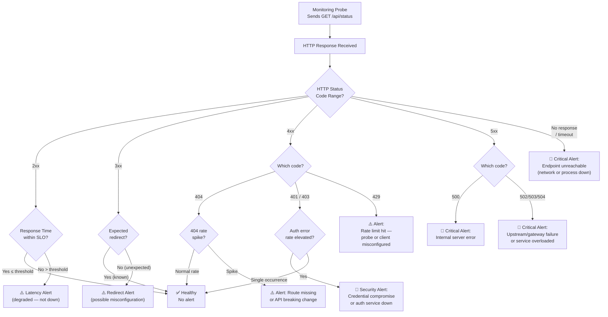
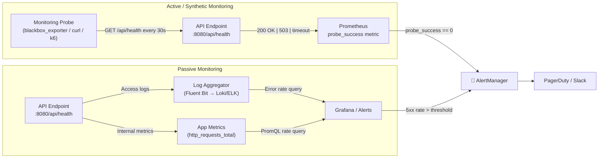
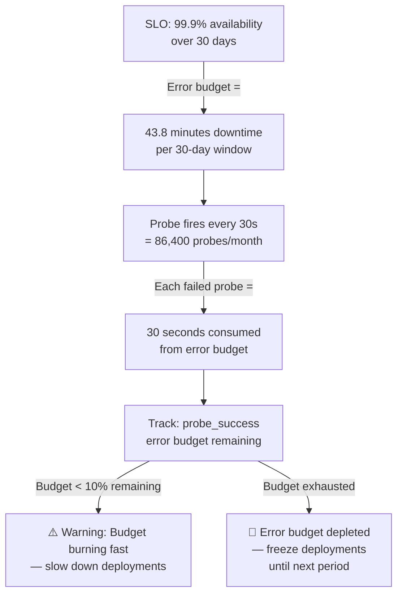

# Monitoring & Alerting Question 2 — Monitoring API Endpoints & HTTP Response Codes

> **Section:** Monitoring & Alerting &nbsp;|&nbsp; **Topic:** API Endpoint Monitoring — HTTP Response Codes, Alerting Strategy, Blackbox Probing &nbsp;|&nbsp; **Level:** Mid (2–5 yrs) &nbsp;|&nbsp; **Frequency:** Very High
>
> _Part of the DevOps & DevSecOps Interview Preparation series._

---

## ❓ The Question

> **"Your development team needs an effective way to monitor an API endpoint and determine which HTTP responses should trigger an alert. How would you approach this?"**

You may also hear this phrased as:

- *"How would you monitor the health of an HTTP/HTTPS endpoint?"*
- *"Which HTTP status codes should trigger a PagerDuty alert?"*
- *"What is the difference between a 4xx error and a 5xx error from a monitoring perspective?"*
- *"How does Prometheus blackbox_exporter probe an endpoint?"*
- *"How would you write a script to monitor an API and send an alert on failure?"*
- *"What does a 200 OK response actually tell you — and what doesn't it tell you?"*
- *"How would you measure API availability and define an SLO around it?"*

---

## 🎯 Why Interviewers Ask This

This is a **systems thinking + practical tooling question** that almost every DevOps, SRE, and Platform Engineer role will ask. Interviewers use it to test whether you:

- Know the **HTTP response code taxonomy** cold — especially the distinction between 4xx (client errors) and 5xx (server errors) and what each class means operationally.
- Understand **when to alert vs when not to** — a 200 OK doesn't mean the API is healthy if it's returning `{"status": "degraded"}` in the body. A 404 might be expected on certain routes.
- Can design **layered monitoring** — passive monitoring (logs, metrics from app instrumentation) vs active/synthetic monitoring (sending real requests from outside to verify availability).
- Know real tools: **Prometheus blackbox_exporter**, **curl health-check scripts**, **CloudWatch Synthetics**, **Grafana k6**, **Datadog Synthetics**.
- Think about **latency as a first-class concern** — a 200 OK that takes 30 seconds is not healthy.

> **The instant win:** Saying *"I'd use active synthetic monitoring — a periodic probe that sends a real HTTP GET and checks both the status code AND response time. A 2xx code means availability; latency SLO determines quality. 4xx errors mean client or routing bugs; 5xx means the server is failing — those are the two classes that need immediate alerting."*

---

## 📖 Key Terminologies

| Term | Plain-English Meaning |
|------|----------------------|
| **HTTP Status Code** | A 3-digit number in every HTTP response indicating the outcome (200 = OK, 404 = not found, 503 = server unavailable) |
| **2xx (Success)** | Request was received, understood, and accepted. 200 OK, 201 Created, 204 No Content |
| **3xx (Redirection)** | Client must take additional action — follow a redirect. 301 Moved Permanently, 302 Found |
| **4xx (Client Error)** | The client sent a bad request. 400 Bad Request, 401 Unauthorized, 403 Forbidden, 404 Not Found, 429 Too Many Requests |
| **5xx (Server Error)** | The server failed to fulfill a valid request. 500 Internal Server Error, 502 Bad Gateway, 503 Service Unavailable, 504 Gateway Timeout |
| **Active / Synthetic Monitoring** | Proactively sending requests to an endpoint on a schedule to verify it is reachable and responding correctly — regardless of whether real users are using it |
| **Passive Monitoring** | Observing real traffic flowing through the system — log analysis, APM instrumentation — no artificial requests |
| **Blackbox Monitoring** | External probing of an endpoint *without* knowing its internals — you only see input/output (request → response code + latency) |
| **Whitebox Monitoring** | Internal instrumentation that exposes internal state (queue depth, DB connection pool, goroutine count) |
| **blackbox_exporter** | Prometheus exporter that performs active probes (HTTP/HTTPS/TCP/ICMP/DNS) and exposes results as metrics |
| **SLO (Service Level Objective)** | A target for service behavior — e.g., "API availability ≥ 99.9% over a rolling 30-day window" |
| **SLA (Service Level Agreement)** | A contractual commitment to an SLO — with penalties for breaches |
| **Error Budget** | The allowable amount of downtime within an SLO — 99.9% = 43.8 minutes of downtime per month |
| **Latency SLO** | A target for response time — e.g., "95% of requests respond in < 300ms" |
| **Response time** | The total time from sending the HTTP request to receiving the full response |
| **TTFB (Time to First Byte)** | Time from sending the request to receiving the first byte of the response — measures server processing time |
| **Health endpoint / Liveness probe** | A dedicated `/health` or `/healthz` endpoint that returns a simple 200 OK when the service is operating correctly |

---

## 🗣️ How to Answer (Structured)

**1) Establish the goal — what "healthy" means for an API:**
> "The first step is defining what a healthy response looks like for the specific endpoint. For most APIs, a 2xx response code means the request was processed successfully. But I always probe both status code AND latency — a 200 OK that takes 30 seconds is effectively down from a user perspective."

**2) Define the HTTP response code classes and what they mean operationally:**
> "HTTP response codes split into five classes. From a monitoring perspective, the most important are 4xx and 5xx. A 4xx means the client sent a bad request — 401 means authentication failed, 403 means authorisation denied, 404 means the route doesn't exist. These often indicate bugs in the caller, misconfiguration, or auth token expiry. A 5xx means the server failed — 500 is a generic internal error, 502 means a gateway got an invalid response from an upstream, 503 means the service is unavailable (overloaded or in maintenance). 5xx errors always need an alert."

**3) Distinguish when 4xx should alert:**
> "Not all 4xx errors warrant an alert. A 404 on a public API might be normal user behaviour — someone typed a wrong URL. But a 401 or 403 spike on an internal service might mean an auth token rotation failed, which is urgent. I monitor 4xx rates rather than individual occurrences — if the 4xx rate jumps from near-zero to 50%, that's worth paging."

**4) Describe the implementation approach — active probing:**
> "The most reliable approach is active synthetic monitoring — a dedicated monitoring service that sends GET requests to the endpoint on a fixed interval (every 30 seconds or every 1 minute) and evaluates the response. In a Prometheus stack I'd use blackbox_exporter — it probes the endpoint and exposes metrics like `probe_success`, `probe_http_status_code`, and `probe_duration_seconds`. I can then write alerting rules on those metrics."

**5) Add the latency dimension:**
> "Beyond status codes, I'd also track response time. A service that degrades slowly — responses going from 100ms to 5 seconds — is a canary for an upcoming outage. I'd set an SLO — for example, 99% of requests under 500ms — and alert when that's being breached."

**6) Close with defence in depth:**
> "I'd combine active probing with log-based alerting — if the server logs show 500 errors, that's a second signal confirming the probe results. Never rely on just one signal for production alerting."

---

## 🔐 Security Perspective (DevSecOps)

API monitoring is not just operational — it's a critical security signal layer:

- **Spike in 401/403 errors = potential credential compromise or brute-force.** A sudden surge in 401 Unauthorized responses on an API endpoint can mean an attacker is trying stolen credentials or an authentication service has degraded. Alert on the *rate* of 401s, not individual occurrences.

- **4xx errors leak information about your API structure.** Monitoring tools that probe every path on your API (enumerating routes) will trigger 404s. Track unusual 404 patterns from a single IP as a reconnaissance signal — feed this to your WAF or SIEM.

- **3xx redirect chains can be hijacked.** If an API endpoint that should return 200 starts returning 301/302 redirects to unexpected locations, this can indicate DNS hijacking or misconfiguration. Alert on unexpected redirect status codes from health endpoints.

- **5xx errors during deployments indicate configuration drift.** A 502 Bad Gateway during a Kubernetes rolling deployment means traffic is being sent to pods that aren't ready yet. Combine monitoring with readiness probes and blue/green deployment patterns to eliminate 502s entirely.

- **Monitoring endpoints themselves are attack surfaces.** A `/healthz` endpoint that returns the application version, environment, or internal IPs leaks information. Health endpoints should return the minimum needed — just `{"status": "ok"}` or HTTP 200 with no body — nothing that aids an attacker's reconnaissance.

- **Probe authentication in monitoring.** For authenticated APIs, your monitoring probes must include valid auth tokens. These tokens are long-lived service accounts — rotate them regularly and store them in a secrets manager (Vault, AWS Secrets Manager), not hard-coded in monitoring config.

- **Rate limit your synthetic monitoring probes.** A monitoring system hitting your own API every second from hundreds of nodes is indistinguishable from a DDoS. Keep probe intervals sane (30s–1m) and exclude probe traffic from rate-limiting rules using a dedicated header or IP allowlist.

> **One-liner for the room:** *"API monitoring is your first line of detection for both reliability failures (5xx spike) and security events (401 surge, unexpected redirects). Treat your monitoring data as a security feed, not just an ops dashboard."*

---

## 🖼️ Visuals

### Source Image — API Endpoints & HTTP Response Code Diagram (KodeKloud)


### Mermaid — HTTP Status Code Decision Tree: When to Alert



### Mermaid — Active vs Passive Monitoring: Two Complementary Signals



### Mermaid — SLO Error Budget: How 5xx Errors Consume Your Budget



---

## 📊 Quick Comparison — HTTP Status Code Classes and Monitoring Response

| Code Range | Class | Operational Meaning | Alert? | Typical Cause |
|-----------|-------|--------------------|---------|----|
| **200–204** | Success | Request processed correctly | Only on latency breach | Healthy |
| **301–302** | Redirect | Endpoint moved | If unexpected on health check | Config change / DNS |
| **400** | Bad Request | Malformed request | Alert on rate spike | Client bug / API contract change |
| **401** | Unauthorized | Auth failed | Alert on rate spike | Token expiry / auth service down |
| **403** | Forbidden | Auth passed but permission denied | Alert on rate spike | RBAC misconfiguration |
| **404** | Not Found | Route doesn't exist | Alert on rate spike only | Deployment broke a route |
| **429** | Too Many Requests | Rate limit hit | Alert on probe hitting this | Probe misconfigured / actual overload |
| **500** | Internal Server Error | Unhandled exception in server | 🚨 Always alert | Code bug, OOM, panic |
| **502** | Bad Gateway | Upstream returned invalid response | 🚨 Always alert | Upstream crashed, K8s pod not ready |
| **503** | Service Unavailable | Server overloaded or in maintenance | 🚨 Always alert | Overload, deployment in progress |
| **504** | Gateway Timeout | Upstream took too long | 🚨 Always alert | Database slow, downstream timeout |
| **Timeout** | No response | Network unreachable or process dead | 🚨 Always alert | Network partition, process crashed |

---

## 📊 Monitoring Approaches Comparison

| Approach | Tool | What It Tests | Blind Spots |
|----------|------|--------------|-------------|
| **Synthetic probe** | blackbox_exporter, CloudWatch Synthetics, Datadog Synthetics | External availability + latency | Can't see internal errors not reflected in status code |
| **Application metrics** | Prometheus + client library | Internal error rates, latency histograms | Doesn't test from user's perspective |
| **Log analysis** | ELK, Loki + Grafana | Real traffic error patterns | Reactive — only know after errors happen |
| **Distributed tracing** | Jaeger, Tempo, X-Ray | Full request path latency breakdown | High overhead — not for every request |
| **Uptime services** | Pingdom, StatusCake, UptimeRobot | Simple HTTP/HTTPS availability | No deep metrics integration |
| **Load testing** | k6, Locust, Artillery | Behaviour under load | Synthetic traffic, not real user patterns |

---

## 🛠️ Hands-On: Commands & Syntax

### 1) Simple Bash Health-Check Script

```bash
#!/bin/bash
# api-health-check.sh
# Checks an API endpoint and alerts if response is 4xx or 5xx

set -euo pipefail

ENDPOINT="${1:-https://api.example.com/health}"
EXPECTED_CODE="${2:-200}"
TIMEOUT_SEC=10
ALERT_EMAIL="oncall@example.com"
LOG_FILE="/var/log/api-health-check.log"

# Send GET request — capture status code and response time
RESPONSE=$(curl \
  --silent \
  --max-time "${TIMEOUT_SEC}" \
  --write-out "\n%{http_code}|%{time_total}" \
  --output /tmp/api_response_body \
  "${ENDPOINT}" 2>&1) || {
    echo "$(date -u +%Y-%m-%dT%H:%M:%SZ) CRITICAL: Endpoint unreachable or timeout: ${ENDPOINT}" | tee -a "${LOG_FILE}"
    # Send alert (Slack webhook example)
    curl -s -X POST "${SLACK_WEBHOOK_URL}" \
      -H "Content-Type: application/json" \
      -d "{\"text\": \"🚨 CRITICAL: ${ENDPOINT} is unreachable or timed out\"}"
    exit 1
}

# Parse response
HTTP_CODE=$(echo "${RESPONSE}" | tail -1 | cut -d'|' -f1)
RESPONSE_TIME=$(echo "${RESPONSE}" | tail -1 | cut -d'|' -f2)
RESPONSE_BODY=$(cat /tmp/api_response_body)

TIMESTAMP=$(date -u +%Y-%m-%dT%H:%M:%SZ)

echo "${TIMESTAMP} INFO: ${ENDPOINT} → ${HTTP_CODE} (${RESPONSE_TIME}s)" | tee -a "${LOG_FILE}"

# Evaluate status code
if [[ "${HTTP_CODE}" =~ ^5[0-9][0-9]$ ]]; then
  echo "${TIMESTAMP} CRITICAL: Server error ${HTTP_CODE} on ${ENDPOINT}" | tee -a "${LOG_FILE}"
  curl -s -X POST "${SLACK_WEBHOOK_URL}" \
    -H "Content-Type: application/json" \
    -d "{\"text\": \"🚨 CRITICAL: ${ENDPOINT} returned ${HTTP_CODE} (server error). Body: ${RESPONSE_BODY}\"}"
  exit 2

elif [[ "${HTTP_CODE}" =~ ^4[0-9][0-9]$ ]]; then
  echo "${TIMESTAMP} WARNING: Client error ${HTTP_CODE} on ${ENDPOINT}" | tee -a "${LOG_FILE}"
  # Only alert on 4xx if it's not an expected non-404
  if [[ "${HTTP_CODE}" != "404" || "${ENDPOINT}" != *"/optional"* ]]; then
    curl -s -X POST "${SLACK_WEBHOOK_URL}" \
      -H "Content-Type: application/json" \
      -d "{\"text\": \"⚠️ WARNING: ${ENDPOINT} returned ${HTTP_CODE} (client error)\"}"
  fi
  exit 1

elif [[ "${HTTP_CODE}" != "${EXPECTED_CODE}" ]]; then
  echo "${TIMESTAMP} WARNING: Unexpected code ${HTTP_CODE} (expected ${EXPECTED_CODE})" | tee -a "${LOG_FILE}"
  exit 1

else
  # Check latency SLO — alert if response time > 2 seconds
  LATENCY_THRESHOLD=2.0
  if (( $(echo "${RESPONSE_TIME} > ${LATENCY_THRESHOLD}" | bc -l) )); then
    echo "${TIMESTAMP} WARNING: High latency ${RESPONSE_TIME}s on ${ENDPOINT}" | tee -a "${LOG_FILE}"
    curl -s -X POST "${SLACK_WEBHOOK_URL}" \
      -H "Content-Type: application/json" \
      -d "{\"text\": \"⚠️ WARNING: ${ENDPOINT} responded in ${RESPONSE_TIME}s (SLO: ${LATENCY_THRESHOLD}s)\"}"
  else
    echo "${TIMESTAMP} OK: ${ENDPOINT} is healthy (${HTTP_CODE}, ${RESPONSE_TIME}s)"
  fi
fi
```

```bash
# Run as a cron job every minute
# crontab -e
* * * * * /usr/local/bin/api-health-check.sh https://api.example.com/health 200
```

### 2) Python API Health Monitor with Alerting

```python
#!/usr/bin/env python3
"""
api_monitor.py — Production API endpoint monitor
Checks HTTP status, latency, and optional JSON body content
"""

import requests
import time
import json
import logging
import sys
from dataclasses import dataclass
from typing import Optional
import os

logging.basicConfig(
    level=logging.INFO,
    format="%(asctime)s %(levelname)s %(message)s",
    datefmt="%Y-%m-%dT%H:%M:%SZ"
)
log = logging.getLogger(__name__)

SLACK_WEBHOOK = os.environ.get("SLACK_WEBHOOK_URL", "")

@dataclass
class CheckResult:
    url: str
    status_code: Optional[int]
    response_time: float
    healthy: bool
    reason: str

def check_endpoint(
    url: str,
    expected_status: int = 200,
    timeout: float = 10.0,
    latency_slo: float = 2.0,
    expected_body_key: Optional[str] = None,
    expected_body_value: Optional[str] = None,
) -> CheckResult:
    """
    Probe an HTTP endpoint and return a CheckResult.
    Checks: reachability, status code, latency SLO, optional JSON body key.
    """
    start = time.monotonic()
    try:
        resp = requests.get(
            url,
            timeout=timeout,
            allow_redirects=False,  # Detect unexpected redirects
            headers={"User-Agent": "monitoring-probe/1.0"},
        )
        elapsed = time.monotonic() - start
        status = resp.status_code

        # Status code check
        if 500 <= status <= 599:
            return CheckResult(url, status, elapsed, False,
                               f"Server error {status}")
        if 400 <= status <= 499:
            return CheckResult(url, status, elapsed, False,
                               f"Client error {status}")
        if status != expected_status:
            return CheckResult(url, status, elapsed, False,
                               f"Unexpected status {status} (expected {expected_status})")

        # Latency SLO check
        if elapsed > latency_slo:
            return CheckResult(url, status, elapsed, False,
                               f"Latency {elapsed:.3f}s exceeds SLO {latency_slo}s")

        # Optional JSON body check (e.g., {"status": "ok"})
        if expected_body_key:
            try:
                body = resp.json()
                if str(body.get(expected_body_key)) != str(expected_body_value):
                    return CheckResult(url, status, elapsed, False,
                                       f"Body check failed: {expected_body_key}={body.get(expected_body_key)!r}")
            except (json.JSONDecodeError, ValueError):
                return CheckResult(url, status, elapsed, False,
                                   "Response body is not valid JSON")

        return CheckResult(url, status, elapsed, True, "OK")

    except requests.Timeout:
        elapsed = time.monotonic() - start
        return CheckResult(url, None, elapsed, False,
                           f"Timeout after {timeout}s")
    except requests.ConnectionError as e:
        elapsed = time.monotonic() - start
        return CheckResult(url, None, elapsed, False,
                           f"Connection error: {e}")

def send_slack_alert(result: CheckResult, severity: str = "critical") -> None:
    if not SLACK_WEBHOOK:
        log.warning("SLACK_WEBHOOK_URL not set — skipping alert")
        return
    icon = "🚨" if severity == "critical" else "⚠️"
    payload = {
        "text": f"{icon} *API Monitor Alert*",
        "attachments": [{
            "color": "danger" if severity == "critical" else "warning",
            "fields": [
                {"title": "Endpoint", "value": result.url, "short": False},
                {"title": "Status Code", "value": str(result.status_code or "N/A"), "short": True},
                {"title": "Response Time", "value": f"{result.response_time:.3f}s", "short": True},
                {"title": "Reason", "value": result.reason, "short": False},
            ]
        }]
    }
    try:
        requests.post(SLACK_WEBHOOK, json=payload, timeout=5)
    except Exception as e:
        log.error(f"Failed to send Slack alert: {e}")

# --- Main monitoring loop ---
ENDPOINTS = [
    {
        "url": "https://api.example.com/health",
        "expected_status": 200,
        "latency_slo": 1.0,
        "expected_body_key": "status",
        "expected_body_value": "ok",
    },
    {
        "url": "https://api.example.com/api/v1/products",
        "expected_status": 200,
        "latency_slo": 2.0,
    },
]

if __name__ == "__main__":
    failures = 0
    for endpoint_cfg in ENDPOINTS:
        result = check_endpoint(**endpoint_cfg)
        if result.healthy:
            log.info(f"OK    {result.url} → {result.status_code} ({result.response_time:.3f}s)")
        else:
            log.error(f"FAIL  {result.url} → {result.reason}")
            severity = "critical" if (result.status_code is None or result.status_code >= 500) else "warning"
            send_slack_alert(result, severity)
            failures += 1

    sys.exit(1 if failures > 0 else 0)
```

### 3) Prometheus blackbox_exporter — HTTP Probe Configuration

```yaml
# blackbox.yml — blackbox exporter configuration
modules:
  # Standard HTTP GET check — expects 2xx response
  http_2xx:
    prober: http
    timeout: 10s
    http:
      valid_http_versions: ["HTTP/1.1", "HTTP/2.0"]
      valid_status_codes: []    # Empty = accept any 2xx
      method: GET
      follow_redirects: false   # Alert on unexpected redirects
      fail_if_ssl: false
      fail_if_not_ssl: true     # Require HTTPS
      tls_config:
        insecure_skip_verify: false
      preferred_ip_protocol: "ip4"

  # Strict check — only accept 200, verify JSON body contains "status":"ok"
  http_200_with_body:
    prober: http
    timeout: 10s
    http:
      valid_status_codes: [200]
      method: GET
      fail_if_body_not_matches_regexp:
        - '"status"\s*:\s*"ok"'   # Regex match on response body
      fail_if_ssl: false
      fail_if_not_ssl: true

  # Authenticated endpoint — include bearer token
  http_authenticated:
    prober: http
    timeout: 10s
    http:
      valid_status_codes: [200]
      method: GET
      headers:
        Authorization: "Bearer {{ .BearerToken }}"

  # TCP port check (non-HTTP services)
  tcp_connect:
    prober: tcp
    timeout: 5s

  # ICMP ping
  icmp_ping:
    prober: icmp
    timeout: 5s
    icmp:
      preferred_ip_protocol: "ip4"
```

```yaml
# prometheus.yml — scrape blackbox_exporter
scrape_configs:
  - job_name: "blackbox-http"
    metrics_path: /probe
    params:
      module: [http_2xx]         # Use the http_2xx module

    static_configs:
      - targets:
          - https://api.example.com/health
          - https://api.example.com/api/v1/products
          - https://auth.example.com/healthz

    relabel_configs:
      # Pass the target URL as the "target" parameter to blackbox_exporter
      - source_labels: [__address__]
        target_label: __param_target
      # Set the instance label to the target URL for readability
      - source_labels: [__param_target]
        target_label: instance
      # Replace __address__ with the blackbox_exporter address
      - target_label: __address__
        replacement: blackbox-exporter:9115
```

### 4) Prometheus Alerting Rules for API Endpoints

```yaml
# rules/api-alerts.yml
groups:
  - name: api_availability
    rules:
      # Alert if any probed endpoint is unreachable or returns non-2xx
      - alert: APIEndpointDown
        expr: probe_success == 0
        for: 2m    # Give it 2 minutes before firing — avoids flapping
        labels:
          severity: critical
          team: platform
        annotations:
          summary: "API endpoint {{ $labels.instance }} is DOWN"
          description: |
            The monitoring probe for {{ $labels.instance }} has been failing for 2 minutes.
            Last status code: {{ query "probe_http_status_code{instance=\"" $labels.instance "\"}" | first | value }}
          runbook_url: "https://wiki.internal/runbooks/api-endpoint-down"

      # Alert on high response time — SLO breach
      - alert: APIHighLatency
        expr: probe_duration_seconds > 2
        for: 5m
        labels:
          severity: warning
          team: platform
        annotations:
          summary: "API endpoint {{ $labels.instance }} response time {{ $value | printf \"%.2f\" }}s exceeds SLO"
          description: "Response time has been above 2s SLO for 5+ minutes."

      # Alert on SSL certificate expiring within 14 days
      - alert: SSLCertificateExpiringSoon
        expr: probe_ssl_earliest_cert_expiry - time() < 14 * 24 * 3600
        for: 1h
        labels:
          severity: warning
          team: platform
        annotations:
          summary: "SSL certificate for {{ $labels.instance }} expires in {{ $value | humanizeDuration }}"

      # Alert if SSL certificate has already expired
      - alert: SSLCertificateExpired
        expr: probe_ssl_earliest_cert_expiry - time() <= 0
        for: 0m
        labels:
          severity: critical
        annotations:
          summary: "SSL certificate for {{ $labels.instance }} has EXPIRED"

  - name: api_error_rates
    rules:
      # 5xx error rate > 1% over 5 minutes — from application metrics
      - alert: HighServerErrorRate
        expr: |
          sum(rate(http_requests_total{status=~"5.."}[5m])) by (job, service)
          /
          sum(rate(http_requests_total[5m])) by (job, service)
          * 100 > 1
        for: 2m
        labels:
          severity: critical
        annotations:
          summary: "{{ $labels.service }} server error rate: {{ $value | printf \"%.2f\" }}%"

      # 4xx error rate spike > 10% — possible auth failure or breaking API change
      - alert: High4xxErrorRate
        expr: |
          sum(rate(http_requests_total{status=~"4.."}[5m])) by (job, service)
          /
          sum(rate(http_requests_total[5m])) by (job, service)
          * 100 > 10
        for: 5m
        labels:
          severity: warning
        annotations:
          summary: "{{ $labels.service }} 4xx error rate: {{ $value | printf \"%.2f\" }}%"

      # Error budget burn rate alert (SLO-based)
      # Burns error budget 14.4x faster than allowed → alert
      - alert: ErrorBudgetBurningFast
        expr: |
          (
            sum(rate(http_requests_total{status=~"5.."}[1h])) by (service)
            /
            sum(rate(http_requests_total[1h])) by (service)
          ) > (1 - 0.999) * 14.4
        for: 5m
        labels:
          severity: critical
        annotations:
          summary: "{{ $labels.service }} is burning error budget 14.4x faster than allowed"
```

### 5) Kubernetes Liveness and Readiness Probes

```yaml
# deployment.yaml — health probes ensure K8s routes traffic only to healthy pods
apiVersion: apps/v1
kind: Deployment
metadata:
  name: api-server
spec:
  template:
    spec:
      containers:
      - name: api
        image: my-api:v1.2.3
        ports:
        - containerPort: 8080

        # Readiness probe — only route traffic when endpoint returns 200
        readinessProbe:
          httpGet:
            path: /readyz          # Indicates "ready to receive traffic"
            port: 8080
            httpHeaders:
            - name: Accept
              value: application/json
          initialDelaySeconds: 10  # Wait 10s before first check
          periodSeconds: 10        # Check every 10 seconds
          failureThreshold: 3      # Mark unready after 3 consecutive failures
          successThreshold: 1      # Mark ready after 1 success

        # Liveness probe — restart pod if it becomes deadlocked
        livenessProbe:
          httpGet:
            path: /healthz         # Indicates "process is alive"
            port: 8080
          initialDelaySeconds: 30  # Give the app 30s to start
          periodSeconds: 20
          failureThreshold: 3      # Restart after 3 consecutive failures
          timeoutSeconds: 5

        # Startup probe — for slow-starting apps (avoids premature liveness failure)
        startupProbe:
          httpGet:
            path: /healthz
            port: 8080
          failureThreshold: 30     # Allow up to 30 * 10s = 5 minutes to start
          periodSeconds: 10
```

### 6) Application-Side Health Endpoint — What It Should Return

```python
# FastAPI example — production-grade health endpoint
from fastapi import FastAPI, status
from fastapi.responses import JSONResponse
import asyncpg
import redis.asyncio as redis
import time

app = FastAPI()

@app.get("/healthz")
async def liveness():
    """
    Liveness: Is the process alive and not deadlocked?
    Returns 200 immediately — no dependency checks.
    """
    return {"status": "ok"}

@app.get("/readyz")
async def readiness(db_pool: asyncpg.Pool, redis_client: redis.Redis):
    """
    Readiness: Is the service ready to handle traffic?
    Checks all critical dependencies.
    """
    checks = {}
    overall_healthy = True
    start = time.monotonic()

    # Check database connectivity
    try:
        await db_pool.fetchval("SELECT 1")
        checks["database"] = {"status": "ok"}
    except Exception as e:
        checks["database"] = {"status": "error", "detail": str(e)}
        overall_healthy = False

    # Check Redis connectivity
    try:
        await redis_client.ping()
        checks["cache"] = {"status": "ok"}
    except Exception as e:
        checks["cache"] = {"status": "error", "detail": str(e)}
        overall_healthy = False

    response = {
        "status": "ok" if overall_healthy else "degraded",
        "checks": checks,
        "duration_ms": round((time.monotonic() - start) * 1000, 2),
    }

    status_code = status.HTTP_200_OK if overall_healthy else status.HTTP_503_SERVICE_UNAVAILABLE
    return JSONResponse(content=response, status_code=status_code)
```

### 7) SLO Dashboard — PromQL for Error Budget Tracking

```promql
# Availability SLO — percentage of successful requests over 30 days
(
  1 - (
    sum(increase(http_requests_total{status=~"5..", service="api"}[30d]))
    /
    sum(increase(http_requests_total{service="api"}[30d]))
  )
) * 100

# Error budget remaining (target 99.9%)
(
  1 -
  sum(increase(http_requests_total{status=~"5..", service="api"}[30d]))
  / sum(increase(http_requests_total{service="api"}[30d]))
) / 0.001 * 100

# Current burn rate (how fast are we consuming the error budget right now?)
sum(rate(http_requests_total{status=~"5..", service="api"}[1h]))
/ sum(rate(http_requests_total{service="api"}[1h]))
/ (1 - 0.999)   # Divide by error budget rate
# > 1 = burning faster than budget allows
# > 14.4 = at this rate, budget exhausted in 2 hours

# p99 latency from blackbox probe duration
histogram_quantile(0.99, rate(probe_duration_seconds_bucket[5m]))
```

### 8) CloudWatch Synthetics (AWS-native API monitoring)

```python
# cloudwatch_canary.py — AWS Synthetics canary for API monitoring
# Deploy via AWS Console → CloudWatch → Synthetics → Create Canary

import synthetics_canary_entry_point as syn_cf
from aws_synthetics.selenium import synthetics_webdriver as syn_driver
from aws_synthetics.common import synthetics_logger as logger
import urllib.request
import json

def api_check():
    url = "https://api.example.com/health"
    request = urllib.request.Request(url, method="GET")
    request.add_header("User-Agent", "CloudWatch-Synthetics")

    with urllib.request.urlopen(request, timeout=10) as response:
        status_code = response.getcode()
        body = json.loads(response.read())

        logger.info(f"Status: {status_code}, Body: {body}")

        if status_code != 200:
            raise Exception(f"Unexpected status code: {status_code}")

        if body.get("status") != "ok":
            raise Exception(f"Health check body indicates degraded: {body}")

        logger.info("API health check PASSED")

# Canary configuration (Terraform)
# resource "aws_synthetics_canary" "api_check" {
#   name                 = "api-health-check"
#   artifact_s3_location = "s3://my-canary-artifacts/api-check/"
#   execution_role_arn   = aws_iam_role.canary.arn
#   handler              = "cloudwatch_canary.api_check"
#   runtime_version      = "syn-python-selenium-4.0"
#   schedule {
#     expression = "rate(1 minute)"
#   }
#   run_config {
#     timeout_in_seconds = 30
#     memory_in_mb       = 960
#   }
# }
```

---

## 🤖 AI & The New Trend (2024–2025) — What Changed

### How AI is Reshaping API Monitoring

- **AI-powered anomaly detection on HTTP metrics (2024):** Grafana Cloud, Datadog, and Dynatrace now use ML to establish a baseline for API response time and error rates per endpoint, per time-of-day, per day-of-week. Instead of a static threshold like `5xx > 1%`, the system learns your normal pattern (e.g., error rate spikes slightly every day at 9am during cache warm-up) and only alerts when behaviour is genuinely anomalous. This dramatically reduces alert fatigue.

- **AI root-cause analysis (Datadog Watchdog, Dynatrace Davis):** When an alert fires, AI systems now automatically correlate the API degradation with recent deployments, infrastructure changes, or upstream service degradation — presenting a likely root cause within seconds instead of requiring manual investigation. In 2024, Datadog Watchdog was extended to suggest PromQL queries and log searches to validate its hypothesis.

- **OpenTelemetry as the universal collection standard:** HTTP monitoring is converging on OpenTelemetry semantic conventions for HTTP metrics (`http.server.request.duration`, `http.server.response.status_code`). This means you instrument once and can send to any backend — Prometheus, Datadog, Tempo, Jaeger — without vendor lock-in.

- **Grafana k6 for scripted API testing in CI/CD (2024):** k6 is now widely used to run API performance tests as part of CI pipelines. It outputs OpenTelemetry metrics and can enforce SLO thresholds as pass/fail gates — a deployment fails if the p99 latency for `/api/checkout` exceeds 500ms under simulated load.

- **AI-generated alert runbooks:** Tools like Grafana and PagerDuty are piloting AI features that auto-generate runbook suggestions when an alert fires — based on the alert name, metric context, and historical incident data. This helps on-call engineers who aren't deeply familiar with every service.

### How AI Can Contribute to Your Day-to-Day

- **Generate blackbox_exporter config** — *"Write a blackbox_exporter module that probes an HTTPS endpoint, verifies the SSL cert, follows no redirects, and fails if the response body doesn't contain 'status':'ok'."*
- **Write PromQL for SLO tracking** — *"Write a PromQL query that calculates the 30-day error budget burn rate for a 99.9% availability SLO."*
- **Debug failing probes** — Paste your `probe_success=0` alert and `blackbox.yml` into an LLM to diagnose whether it's SSL, redirect, or body check failing.
- **Generate Grafana dashboard JSON** — LLMs can produce a complete Grafana dashboard JSON with RED panels (Rate, Errors, Duration) for an API service in minutes.

### ⚠️ Security Caveat

- AI-generated monitoring scripts may not include proper timeout handling — a missing `--max-time` in a curl check means the monitoring script hangs indefinitely if the endpoint stalls.
- Review LLM-generated health endpoint code carefully — some suggestions return internal stack traces or dependency URLs in the response body, inadvertently leaking infrastructure details.
- AI anomaly detection systems require access to your full metric history — treat this data as sensitive operational data with appropriate access controls.

### What to Learn Right Now

1. **Prometheus blackbox_exporter** — HTTP, TCP, ICMP, SSL probing with PromQL integration
2. **SLO error budget alerting** — multi-window burn rate alerts (the Google SRE book pattern)
3. **OpenTelemetry semantic conventions for HTTP** — the future standard for API instrumentation
4. **Grafana k6** — performance testing as code with CI/CD integration
5. **CloudWatch Synthetics / Datadog Synthetics** — cloud-native canary monitoring for AWS/SaaS environments
6. **Readiness vs Liveness vs Startup probes** — K8s health check semantics and production tuning

---

## ✅ Prerequisites (Be Solid on These First)

- **HTTP fundamentals** — request/response model, methods (GET, POST, PUT), headers, status codes — this question is meaningless without this foundation.
- **Basic networking** — DNS resolution, TCP handshake, TLS/SSL — these all show up in probe failure modes.
- **Linux command line** — `curl`, `wget`, shell scripting basics — monitoring scripts use these constantly.
- **Prometheus basics** — metrics, labels, PromQL `rate()` function — needed to understand blackbox_exporter integration (covered in Monitoring Q1).
- **(Bonus) SLO/SLA/Error Budget concepts** — turns a simple "check HTTP codes" answer into an SRE-level answer.
- **(Bonus) Kubernetes health probes** — shows you know how HTTP monitoring integrates with container orchestration.

---

## 📚 Further Reading (Current Docs)

- **MDN HTTP status codes reference** — <https://developer.mozilla.org/en-US/docs/Web/HTTP/Status>
- **Prometheus blackbox_exporter** — <https://github.com/prometheus/blackbox_exporter>
- **blackbox_exporter configuration reference** — <https://github.com/prometheus/blackbox_exporter/blob/master/CONFIGURATION.md>
- **Google SRE Book — SLOs, SLAs, Error Budgets** — <https://sre.google/sre-book/service-level-objectives/>
- **Google SRE Workbook — Alerting on SLOs** — <https://sre.google/workbook/alerting-on-slos/>
- **OpenTelemetry HTTP semantic conventions** — <https://opentelemetry.io/docs/specs/semconv/http/http-metrics/>
- **Grafana k6 — scripted API load testing** — <https://grafana.com/docs/k6/latest/>
- **CloudWatch Synthetics** — <https://docs.aws.amazon.com/AmazonCloudWatch/latest/monitoring/CloudWatch_Synthetics_Canaries.html>
- **Kubernetes liveness/readiness/startup probes** — <https://kubernetes.io/docs/tasks/configure-pod-container/configure-liveness-readiness-startup-probes/>
- **KodeKloud lesson (video):** <https://learn.kodekloud.com/user/courses/devops-interview-preparation-course/module/e9c0a8fa-ed69-494c-9d95-c5e3eb5ecfde/lesson/9c302595-9cdc-4038-bcdc-f5b7e847a625>

---

## 🔁 Related / Follow-up Questions

1. **What is the difference between a liveness probe and a readiness probe in Kubernetes?** → Liveness: "Is the process alive?" — failure triggers a pod restart. Readiness: "Is the pod ready to receive traffic?" — failure removes the pod from the Service's endpoints but doesn't restart it. A pod can be alive but not ready (e.g., still warming up cache). Use both: liveness for deadlock detection, readiness for traffic gating.

2. **What is the difference between active and passive monitoring?** → Active (synthetic): your monitoring sends artificial requests to check availability — detects issues even with zero real traffic. Passive: you observe real traffic patterns — no artificial load, but can't detect issues unless real traffic is flowing. Production systems need both.

3. **A 200 OK is returned but the API is still broken — how do you detect that?** → Check the response body, not just the status code. A well-designed API returns `{"status": "degraded"}` with a 200 when partially broken, or a 503 when fully broken. Use `fail_if_body_not_matches_regexp` in blackbox_exporter, or check the body in your monitoring script. Application-level metrics (queue depth, cache miss rate, downstream error count) catch what status codes miss.

4. **What is an error budget and how does it relate to alerting?** → An SLO of 99.9% means 0.1% of requests can fail — that's your error budget. Error budget burn rate tells you how fast you're consuming it. A burn rate >1 means you'll exhaust the budget before the SLO window ends — that's when you alert. Multi-window burn rate alerts (1h + 6h windows) are the Google SRE pattern for catching both fast-burning and slow-burning outages.

5. **How do you monitor a REST API that requires authentication?** → Use a long-lived service account token (stored in a secrets manager) included as a Bearer token or basic auth credential in your probe. In blackbox_exporter, add a `headers` block to the HTTP module. Rotate the monitoring token regularly and alert on 401 responses from the probe — they indicate token expiry.

6. **How would you set up multi-region API monitoring?** → Deploy blackbox_exporter instances in each region (us-east-1, eu-west-1, ap-southeast-1). Each probes the same endpoints. A regional failure shows up as `probe_success=0` only from that region — distinguishing a global outage from a regional routing issue. Use Grafana with region labels to visualise availability per region.

7. **What HTTP response code does a Kubernetes readiness probe failure produce?** → Kubernetes expects any non-2xx HTTP response to indicate "not ready." A 503 is conventional but 500, 404, or even a connection timeout all have the same effect: the pod is marked Not Ready and removed from load balancer rotation.

8. **How do you avoid false-positive alerts from transient network glitches?** → Use the `for:` clause in Prometheus alerting rules — `for: 2m` means the condition must be true for 2 consecutive minutes before firing. Also increase `failureThreshold` in Kubernetes probes to `3` — three consecutive failures before acting. This smooths out single-packet loss events.

9. **What does a 502 Bad Gateway tell you that a 503 Service Unavailable doesn't?** → 502 means a proxy/gateway (nginx, AWS ALB, Envoy) received an invalid or no response from an upstream service. The proxy itself is fine but the backend it's proxying to is broken. 503 means the server itself is declaring it can't handle the request (overloaded, in maintenance mode). Both are serious, but 502 points to the upstream tier as the culprit.

10. **How would you monitor a GraphQL API differently from a REST API?** → GraphQL always returns HTTP 200 — even for errors (errors appear in the JSON body as `{"errors": [...]}` with a 200 status code). Standard HTTP status code monitoring misses all GraphQL errors. You must check the response body for the `errors` field — use `fail_if_body_matches_regexp: '"errors"'` in blackbox_exporter, or implement application-level metrics that count GraphQL errors.

11. **How would you write an SLO for API availability and latency?** → Availability SLO: "99.9% of HTTP requests to `/api/*` return a non-5xx response over a rolling 28-day window." Latency SLO: "95% of requests complete in < 300ms, 99% in < 1s, measured over a rolling 28-day window." Define these in a document, instrument them in Prometheus with histogram metrics, and build Grafana panels showing error budget consumption.

12. **What's the difference between uptime monitoring and observability?** → Uptime monitoring asks "is it up?" — binary, external view. Observability answers "why is it slow/broken?" — uses metrics, traces, and logs to understand internal state. Production systems need both: uptime monitoring catches the symptom (endpoint returning 503), observability finds the cause (database connection pool exhausted, specific slow query).

---

> 📌 **30-second interview summary:** Monitoring an API endpoint means periodically sending a GET request and evaluating the response. **5xx status codes always alert** — they indicate server-side failures. **4xx codes alert on rate spikes** — a single 404 might be normal, but a sudden surge in 401s signals an auth failure. **Response time is equally important** — a 200 OK that takes 30 seconds is functionally down. In a Prometheus stack, `blackbox_exporter` does this out of the box, exposing `probe_success`, `probe_http_status_code`, and `probe_duration_seconds` metrics with ready-made alerting rules. Combine active probing with application-level error rate metrics for defence in depth, and tie your alerting thresholds to an SLO error budget so you alert when it matters — not on every transient blip.
