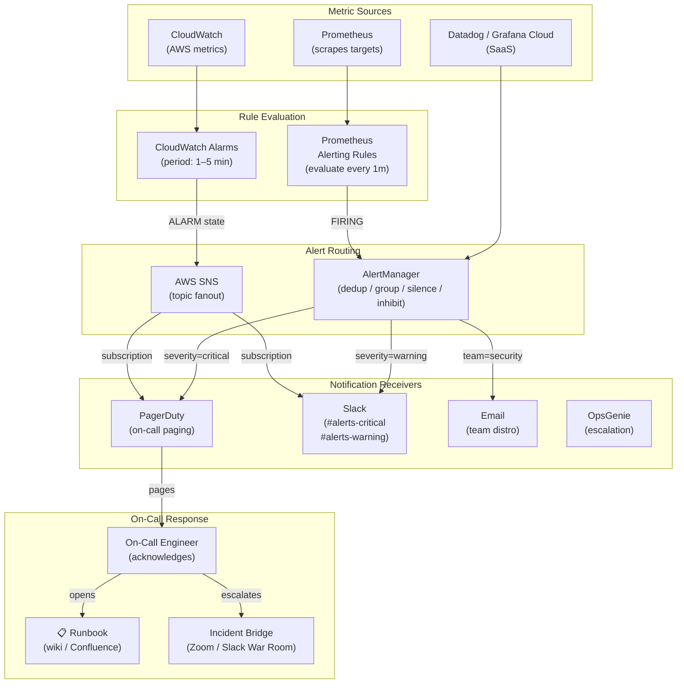
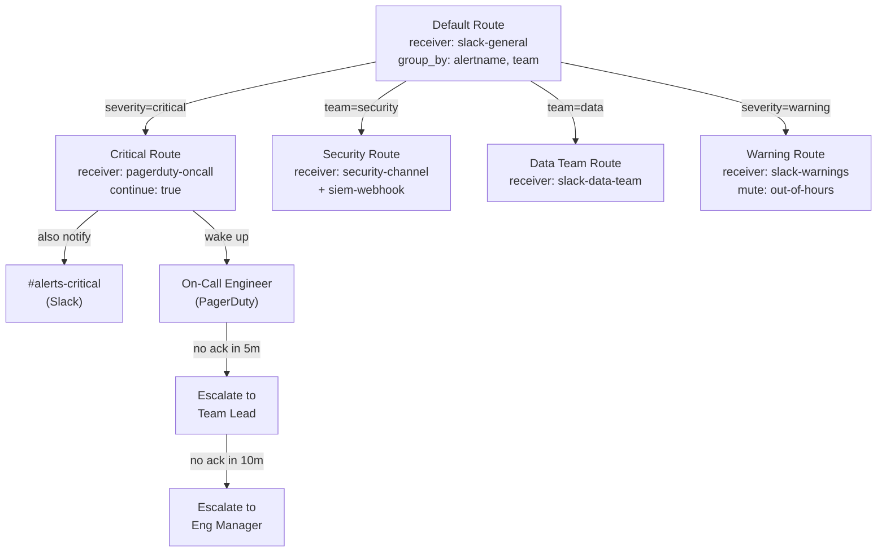
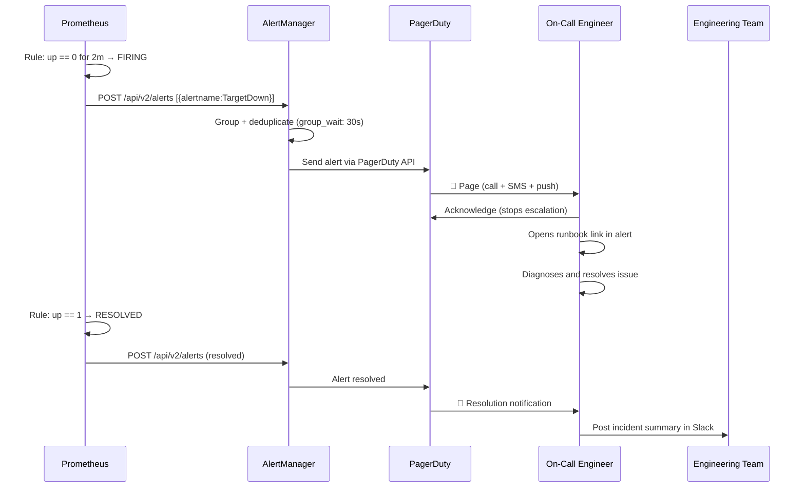

# Monitoring & Alerting Question 3 — How to Set Up Alerting

> **Section:** Monitoring & Alerting &nbsp;|&nbsp; **Topic:** Alerting Architecture — Unified Alerting Flow, On-Call Systems, Alert Fatigue Prevention &nbsp;|&nbsp; **Level:** Mid (2–5 yrs) &nbsp;|&nbsp; **Frequency:** Very High
>
> _Part of the DevOps & DevSecOps Interview Preparation series._

---

## ❓ The Question

> **"What are some ways in which you have set up alerting?"**

You may also hear this phrased as:

- *"Walk me through how alerting is set up in your current organisation."*
- *"How do you decide what to alert on? How do you prevent alert fatigue?"*
- *"What is the difference between a warning alert and a critical alert?"*
- *"How do you route different alerts to different teams?"*
- *"What happens when an alert fires at 3am? Walk me through the on-call process."*
- *"How do you manage on-call rotations and escalation policies?"*
- *"How do you write a good runbook for an alert?"*

---

## 🎯 Why Interviewers Ask This

This is a **practical experience question** that reveals far more about your real-world DevOps maturity than any theoretical question. Interviewers use it to determine whether you:

- Have **hands-on experience** designing and maintaining an alerting system, not just reading about it.
- Understand **why unified alerting matters** — multiple disjointed alert streams (one for each team, one for each tool) cause chaos during incidents and lead to duplicate, missed, or contradictory notifications.
- Know the **alert fatigue problem** — too many alerts desensitise engineers and cause critical pages to be ignored.
- Can design **meaningful alerts** — symptoms vs causes, actionable vs noise, critical vs warning.
- Know **on-call tooling** — PagerDuty, OpsGenie, VictorOps — and how escalation policies work.
- Think in terms of **SLOs** — alerting on error budget burn rate rather than raw thresholds is the modern SRE approach.

> **The instant win:** Saying *"I set up Prometheus + AlertManager with a routing tree that sends critical alerts to PagerDuty for on-call paging and warnings to Slack for async review — and I write runbooks for every alert so the on-call engineer knows exactly what to do at 3am"* immediately shows a complete, production-grade mental model.

---

## 📖 Key Terminologies

| Term | Plain-English Meaning |
|------|----------------------|
| **Alert** | A notification fired when a metric, log pattern, or event crosses a defined threshold or condition |
| **Alerting Rule** | A condition defined in a monitoring tool that, when true for a given duration, fires an alert |
| **AlertManager** | Prometheus component that receives alerts, deduplicates, groups, silences, inhibits, and routes them to receivers |
| **On-call** | A rotation schedule where engineers take turns being responsible for responding to production incidents outside business hours |
| **PagerDuty / OpsGenie** | Commercial incident management platforms — manage on-call schedules, escalation policies, and incident lifecycle |
| **Escalation Policy** | A rule that automatically escalates an unacknowledged alert to the next tier (team lead, manager) after a set time |
| **Runbook** | A documented step-by-step guide for responding to a specific alert — what to check, what to do, how to escalate |
| **Alert Fatigue** | When too many low-quality alerts cause engineers to ignore or dismiss pages — including real incidents |
| **Silence** | A time-bound suppression of a specific alert — used during planned maintenance to prevent noise |
| **Inhibition** | AlertManager rule that suppresses dependent alerts when a parent alert is firing (e.g., don't alert on all pods when the node is down) |
| **SNS (Simple Notification Service)** | AWS messaging service that delivers notifications via email, SMS, HTTP endpoints, Lambda, SQS |
| **CloudWatch Alarm** | AWS-native alerting mechanism that monitors a CloudWatch metric and triggers actions (SNS notification, Auto Scaling) when thresholds are breached |
| **Nagios** | Veteran open-source monitoring and alerting system — agent-based checks, widely used in traditional data-centre environments |
| **Dead Man's Switch** | A "watchdog" alert that fires when a monitoring system stops sending — confirms the monitoring pipeline itself is alive |
| **SLO-based alerting** | Alerting based on error budget burn rate rather than raw metric thresholds — aligns alerts to business impact |
| **Multi-window burn rate** | SRE pattern: alert when error budget is burning fast on both a short window (1h) and a long window (6h) — catches both sudden and slow burns |

---

## 🗣️ How to Answer (Structured)

**1) Establish the guiding principle — unified, actionable alerting:**
> "The most important principle in alerting is that every alert that pages someone must be actionable — if an engineer gets woken up at 3am by an alert, they should be able to follow a runbook and resolve it. Noise alerts destroy trust in the alerting system and cause real incidents to be missed."

**2) Describe your primary alerting stack:**
> "In my current setup I use Prometheus for metric collection paired with AlertManager for routing and deduplication. Prometheus evaluates alerting rules every minute. When a rule fires, it sends the alert to AlertManager, which handles grouping, silencing, inhibition, and routing. We have a routing tree — critical alerts go to PagerDuty which wakes someone up. Warnings go to a Slack channel for async review during business hours."

**3) Explain alert classification — warning vs critical:**
> "Every alert has a severity label — either `warning` or `critical`. Critical means: production is down or a user-facing SLO is being breached, and someone must act *right now*. Warning means: something is trending in the wrong direction and needs attention within business hours. We never page for warnings. This boundary is what prevents alert fatigue."

**4) Talk about the on-call system:**
> "We use PagerDuty for on-call management. Each service has a team that owns it, and PagerDuty has a rotation schedule — one engineer is on-call per week. The escalation policy is: page the on-call for 5 minutes, if no acknowledgement, escalate to the team lead. If still unacknowledged after 10 more minutes, the engineering manager gets notified."

**5) Mention runbooks as the on-call lifeline:**
> "Every alert in our system links to a runbook in Confluence or a wiki. The runbook tells the on-call engineer: what this alert means, what the most likely causes are, what commands to run to diagnose, and when to escalate to a specialist. A good runbook means a junior engineer can handle an incident they've never seen before at 2am."

**6) Close with alert quality hygiene:**
> "We do a monthly alert review — looking at which alerts fired most frequently, which had the highest false-positive rate, and which were acknowledged but no action taken. Those are candidates for deletion or threshold adjustment. Keeping the signal-to-noise ratio high is ongoing work, not a one-time setup."

---

## 🔐 Security Perspective (DevSecOps)

Alerting systems are critical security infrastructure — they must be treated with the same rigour as the services they monitor:

- **Security alerts deserve their own routing lane.** Operational alerts (CPU high, disk full) and security alerts (brute-force detected, IAM policy changed, secret accessed outside business hours) should flow to different receivers. Security events often need a security team response, not a platform team response. Route security-relevant alerts directly to your SIEM or security Slack channel.

- **Protect your AlertManager and PagerDuty configurations.** These contain webhook URLs, API keys, and email addresses. Store them in a secrets manager (Vault, AWS Secrets Manager) and inject them at runtime — never commit them to Git. A leaked PagerDuty API key lets an attacker silence all your alerts.

- **Alert on alerting system failures (Dead Man's Switch).** If Prometheus crashes or AlertManager can't reach PagerDuty, you'll have a silent failure — real incidents won't page anyone. Run a "watchdog" alert: a special alert that fires every minute to a health-check URL (e.g., Healthchecks.io). If the ping stops, the service pages you. This is your monitoring-the-monitoring system.

- **Audit every silence and inhibition.** Silences suppress alerts — a misconfigured or malicious silence can mask a real incident or security breach. Log all silence creation events (who created it, what it covered, when it expires) and alert on unusually broad silences.

- **Alert on IAM and infrastructure changes.** Beyond application metrics, set up CloudWatch EventBridge (or AWS Config) alerts for: new IAM user created, IAM policy attached, security group rule added, S3 bucket made public. These are change events, not metric thresholds, and they often precede security incidents.

- **On-call communication channels are targets.** PagerDuty and Slack are targets for social engineering — attackers have spoofed alert notifications to trick engineers into executing attacker-controlled commands ("run this script to remediate"). Always verify the source of an incident escalation through a second channel.

> **One-liner for the room:** *"Alerting is security infrastructure — protect your routing configs as secrets, add a dead man's switch for the monitoring pipeline itself, and route security events to a separate lane from ops alerts so they get the right eyes."*

---

## 🖼️ Visuals

### Source Image — DevOps Alerting Processes & Tools (KodeKloud)


### Mermaid — End-to-End Alerting Architecture



### Mermaid — AlertManager Routing Tree



### Mermaid — Alert Lifecycle: From Firing to Resolution



---

## 📊 Quick Comparison — Alerting Severity Levels

| Severity | Meaning | Response Time | Channel | Example |
|----------|---------|---------------|---------|---------|
| **Critical (P1)** | User-facing service is down or SLO breached | Immediate — page on-call now | PagerDuty (call + SMS) | API returning 100% 5xx, DB unreachable |
| **Critical (P2)** | Significant degradation, about to breach SLO | Within 30 min — page on-call | PagerDuty (push notification) | Error rate 10%, latency p99 > 3s |
| **Warning** | Trending in wrong direction, no immediate breach | Business hours, same day | Slack #alerts-warning | Disk at 75%, CPU averaging 70% over 1h |
| **Info** | Notable event, no action required | No response needed | Slack #alerts-info (optional) | Deployment succeeded, autoscaler fired |
| **Dead Man's Switch** | Monitoring pipeline itself has gone silent | Immediate | PagerDuty | Prometheus stopped sending heartbeat |

---

## 📊 Alerting Tools Comparison

| Tool | Type | Strengths | Weaknesses | Best For |
|------|------|-----------|------------|----------|
| **Prometheus + AlertManager** | Open-source | Full control, PromQL power, rich routing | Self-hosted, no built-in on-call scheduling | Kubernetes, cloud-native stacks |
| **AWS CloudWatch + SNS** | Managed (AWS) | No infra to run, native AWS integration | Limited query language, no cross-service grouping | AWS-only environments |
| **PagerDuty** | Commercial SaaS | Best-in-class on-call scheduling, escalation, postmortem | Cost, vendor dependency | Any size org needing mature incident management |
| **OpsGenie (Atlassian)** | Commercial SaaS | Strong Jira/Confluence integration, good mobile app | Fewer integrations than PagerDuty | Atlassian-heavy shops |
| **Grafana Alerting** | Open-source | Unified alerts from Prometheus, Loki, Tempo in one UI | Newer product, fewer enterprise features | Teams already on Grafana stack |
| **Datadog Monitors** | Commercial SaaS | Easy setup, AI anomaly detection, full-stack | Expensive at scale | Teams wanting managed monitoring + alerting |
| **Nagios** | Open-source | Battle-tested, large plugin ecosystem | Legacy architecture, config is complex XML | Traditional data-centres, legacy infra |
| **VictorOps (Splunk)** | Commercial SaaS | Strong ChatOps integration, timeline view | Less intuitive than PagerDuty | Splunk-heavy environments |

---

## 🛠️ Hands-On: Configuration & Commands

### 1) AlertManager Full Production Configuration

```yaml
# alertmanager.yml — production routing configuration
global:
  # Default SMTP config for email notifications
  smtp_smarthost: "smtp.gmail.com:587"
  smtp_from: "alerts@example.com"
  smtp_auth_username: "alerts@example.com"
  smtp_auth_password_file: /etc/alertmanager/secrets/smtp-password

  # Resolve timeout — how long after an alert stops firing before "resolved" is sent
  resolve_timeout: 5m

# ─── ROUTING TREE ──────────────────────────────────────────────
route:
  receiver: "slack-general"           # Catch-all default receiver
  group_by: ["alertname", "cluster", "service"]
  group_wait: 30s                     # Wait before sending first notification (let alerts group)
  group_interval: 5m                  # Minimum time between notifications for same group
  repeat_interval: 4h                 # Re-notify if still firing after 4h

  routes:
    # ── Critical alerts → PagerDuty (wake someone up) + Slack
    - matchers:
        - severity = "critical"
      receiver: "pagerduty-oncall"
      group_wait: 10s                 # Shorter wait for critical — act fast
      repeat_interval: 1h
      continue: true                  # Also send to next matching route (Slack)

    # ── Security alerts → security team channel + SIEM webhook
    - matchers:
        - team = "security"
      receiver: "security-team"
      continue: false

    # ── Data team owns data pipeline alerts
    - matchers:
        - team = "data"
      receiver: "slack-data-team"

    # ── Warning alerts → Slack only, silenced outside business hours
    - matchers:
        - severity = "warning"
      receiver: "slack-warnings"
      mute_time_intervals:
        - outside-business-hours

    # ── Deployment events → info channel, no escalation
    - matchers:
        - alertname =~ "Deployment.*"
      receiver: "slack-deployments"

# ─── INHIBITION RULES ──────────────────────────────────────────
# Suppress pod alerts when the node they run on is down
inhibit_rules:
  - source_matchers:
      - alertname = "NodeDown"
    target_matchers:
      - alertname =~ "Pod.*|Container.*"
    equal: ["cluster", "node"]        # Only inhibit for the same node

  # Suppress warning when critical is firing for same service
  - source_matchers:
      - severity = "critical"
    target_matchers:
      - severity = "warning"
    equal: ["alertname", "service"]

# ─── RECEIVERS ─────────────────────────────────────────────────
receivers:
  - name: "pagerduty-oncall"
    pagerduty_configs:
      - routing_key_file: /etc/alertmanager/secrets/pagerduty-key
        description: "{{ .GroupLabels.alertname }}: {{ .CommonAnnotations.summary }}"
        severity: "{{ .CommonLabels.severity }}"
        details:
          runbook: "{{ .CommonAnnotations.runbook_url }}"
          cluster: "{{ .CommonLabels.cluster }}"
        # Link back to Grafana dashboard
        links:
          - href: "{{ .CommonAnnotations.dashboard_url }}"
            text: "Grafana Dashboard"

  - name: "slack-general"
    slack_configs:
      - api_url_file: /etc/alertmanager/secrets/slack-webhook
        channel: "#alerts-general"
        title: "{{ if eq .Status \"firing\" }}🔥{{ else }}✅{{ end }} {{ .GroupLabels.alertname }}"
        text: |
          {{ range .Alerts }}
          *Summary:* {{ .Annotations.summary }}
          *Severity:* {{ .Labels.severity }}
          *Service:* {{ .Labels.service }}
          *Runbook:* {{ .Annotations.runbook_url }}
          {{ end }}
        send_resolved: true
        color: '{{ if eq .Status "firing" }}danger{{ else }}good{{ end }}'

  - name: "security-team"
    slack_configs:
      - api_url_file: /etc/alertmanager/secrets/slack-security-webhook
        channel: "#security-alerts"
        send_resolved: true
    webhook_configs:
      - url: "https://siem.internal/alerts/webhook"  # Send to SIEM too
        send_resolved: true

  - name: "slack-warnings"
    slack_configs:
      - api_url_file: /etc/alertmanager/secrets/slack-webhook
        channel: "#alerts-warning"
        send_resolved: false    # Don't notify on warning resolution (noise)

  - name: "slack-data-team"
    slack_configs:
      - api_url_file: /etc/alertmanager/secrets/slack-webhook
        channel: "#data-team-alerts"

  - name: "slack-deployments"
    slack_configs:
      - api_url_file: /etc/alertmanager/secrets/slack-webhook
        channel: "#deployments"

# ─── MUTE TIME INTERVALS ───────────────────────────────────────
mute_time_intervals:
  - name: outside-business-hours
    time_intervals:
      - times:
          - start_time: "18:00"
            end_time: "09:00"
        weekdays: ["monday:friday"]
      - weekdays: ["saturday", "sunday"]
```

### 2) AWS CloudWatch Alarm + SNS — Infrastructure as Code

```hcl
# Terraform — CloudWatch alarm with SNS notification
# ─── SNS Topic (notification bus) ───────────────────────────────
resource "aws_sns_topic" "alerts_critical" {
  name              = "alerts-critical-${var.environment}"
  kms_master_key_id = aws_kms_key.sns.arn  # Encrypt SNS messages at rest
}

# Subscribe PagerDuty to the SNS topic via HTTPS endpoint
resource "aws_sns_topic_subscription" "pagerduty" {
  topic_arn = aws_sns_topic.alerts_critical.arn
  protocol  = "https"
  endpoint  = var.pagerduty_sns_endpoint  # PagerDuty-provided HTTPS URL
}

# Subscribe on-call email list
resource "aws_sns_topic_subscription" "email_oncall" {
  topic_arn = aws_sns_topic.alerts_critical.arn
  protocol  = "email"
  endpoint  = "oncall@example.com"
}

# ─── CloudWatch Alarms ───────────────────────────────────────────
# API Gateway 5xx error rate alarm
resource "aws_cloudwatch_metric_alarm" "api_5xx_rate" {
  alarm_name          = "${var.environment}-api-5xx-rate-critical"
  alarm_description   = "API Gateway 5xx error rate exceeds 1% over 5 minutes"
  comparison_operator = "GreaterThanThreshold"
  evaluation_periods  = 3        # Must breach 3 consecutive 1-minute periods
  metric_name         = "5XXError"
  namespace           = "AWS/ApiGateway"
  period              = 60       # 1 minute
  statistic           = "Average"
  threshold           = 0.01     # 1% error rate

  dimensions = {
    ApiName = aws_api_gateway_rest_api.main.name
    Stage   = var.environment
  }

  alarm_actions             = [aws_sns_topic.alerts_critical.arn]
  ok_actions                = [aws_sns_topic.alerts_critical.arn]  # Notify on recovery
  insufficient_data_actions = [aws_sns_topic.alerts_critical.arn]

  treat_missing_data = "breaching"  # No data = treat as alarm (failsafe)

  tags = {
    Environment = var.environment
    Team        = "platform"
    Severity    = "critical"
  }
}

# RDS CPU alarm
resource "aws_cloudwatch_metric_alarm" "rds_cpu" {
  alarm_name          = "${var.environment}-rds-cpu-warning"
  comparison_operator = "GreaterThanThreshold"
  evaluation_periods  = 5
  metric_name         = "CPUUtilization"
  namespace           = "AWS/RDS"
  period              = 60
  statistic           = "Average"
  threshold           = 80   # 80% CPU

  dimensions = {
    DBInstanceIdentifier = aws_db_instance.main.id
  }

  alarm_actions = [aws_sns_topic.alerts_warning.arn]
}

# ECS service running task count below desired
resource "aws_cloudwatch_metric_alarm" "ecs_tasks_below_desired" {
  alarm_name          = "${var.environment}-ecs-tasks-below-desired"
  comparison_operator = "LessThanThreshold"
  evaluation_periods  = 2
  metric_name         = "RunningTaskCount"
  namespace           = "AWS/ECS"
  period              = 60
  statistic           = "Average"
  threshold           = var.desired_count

  dimensions = {
    ClusterName = aws_ecs_cluster.main.name
    ServiceName = aws_ecs_service.api.name
  }

  alarm_actions = [aws_sns_topic.alerts_critical.arn]
}
```

### 3) Dead Man's Switch — Monitor Your Monitoring Pipeline

```yaml
# Prometheus alerting rule — watchdog alert
# This alert ALWAYS fires — its absence means the monitoring pipeline is broken
groups:
  - name: watchdog
    rules:
      - alert: Watchdog
        expr: vector(1)     # Always evaluates to true
        labels:
          severity: none    # Not a real incident — just a heartbeat
        annotations:
          summary: "Watchdog alert — confirms Prometheus + AlertManager are operational"
          description: |
            This alert always fires. It is routed to a dead-man's switch service
            (e.g., healthchecks.io). If this alert STOPS firing, the monitoring
            pipeline has failed and an external service will page on-call.
```

```yaml
# AlertManager — route Watchdog to healthchecks.io via webhook
receivers:
  - name: "dead-mans-switch"
    webhook_configs:
      - url: "https://hc-ping.com/YOUR-HEALTHCHECK-UUID"
        send_resolved: false   # Only ping on firing — absence of ping = alert

route:
  routes:
    - matchers:
        - alertname = "Watchdog"
      receiver: "dead-mans-switch"
      group_wait: 0s
      group_interval: 1m
      repeat_interval: 1m   # Ping every minute
```

### 4) Alert Runbook Template

```markdown
# Runbook: HighAPIErrorRate

## Alert Summary
- **Alert name:** HighAPIErrorRate
- **Severity:** Critical
- **Team owner:** Platform Engineering
- **Dashboard:** [API Error Rate Dashboard](https://grafana.internal/d/api-errors)

## What This Alert Means
The API server's 5xx error rate has exceeded 1% over a 5-minute window.
Users are experiencing failures. This is an SLO-breaching event.

## Immediate Triage (first 2 minutes)

1. **Check Grafana dashboard** — identify which endpoint(s) are returning 5xx
   ```bash
   # PromQL: error rate by endpoint
   sum(rate(http_requests_total{status=~"5..",service="api"}[5m])) by (path)
   ```

2. **Check recent deployments** — was anything deployed in the last 30 minutes?
   ```bash
   kubectl rollout history deployment/api -n production
   ```

3. **Check pod health**
   ```bash
   kubectl get pods -n production -l app=api
   kubectl describe pod <failing-pod> -n production
   kubectl logs <failing-pod> -n production --tail=100
   ```

## Common Causes and Fixes

| Cause | Signal | Fix |
|-------|--------|-----|
| Bad deployment | Errors started at deploy time | `kubectl rollout undo deployment/api -n production` |
| Database connection exhausted | DB connection pool metric > max | Restart pods: `kubectl rollout restart deployment/api` |
| Upstream dependency down | Errors in logs for external service | Check upstream status page; enable fallback mode if available |
| Memory leak / OOM | Pod restarts increasing | Scale up: `kubectl scale deployment/api --replicas=6` |
| Config map / secret change | Logs show missing env var | Verify recent ConfigMap changes; rollback if needed |

## Escalation
- If not resolved in **15 minutes** → escalate to team lead (@team-lead in Slack)
- If database involved → escalate to DBA on-call
- If upstream third-party → open support ticket and notify product team

## Post-Incident
- Update this runbook if the cause was not listed above
- File an incident report within 24 hours
- Schedule a blameless post-mortem if impact > 15 minutes
```

### 5) PagerDuty Service Configuration via Terraform

```hcl
# pagerduty.tf — manage on-call schedules as code
resource "pagerduty_team" "platform" {
  name        = "Platform Engineering"
  description = "Owns infrastructure and platform services"
}

# On-call schedule — weekly rotation
resource "pagerduty_schedule" "platform_oncall" {
  name      = "Platform Engineering On-Call"
  time_zone = "UTC"

  layer {
    name                         = "Weekly Rotation"
    start                        = "2024-01-01T00:00:00+00:00"
    rotation_virtual_start       = "2024-01-01T00:00:00+00:00"
    rotation_turn_length_seconds = 604800  # 1 week

    users = [
      pagerduty_user.alice.id,
      pagerduty_user.bob.id,
      pagerduty_user.charlie.id,
    ]
  }
}

# Escalation policy — 5 min → team lead → 10 min → manager
resource "pagerduty_escalation_policy" "platform" {
  name      = "Platform Engineering Escalation"
  num_loops = 2   # Repeat the escalation loop twice before giving up

  rule {
    escalation_delay_in_minutes = 5
    target {
      type = "schedule_reference"
      id   = pagerduty_schedule.platform_oncall.id
    }
  }

  rule {
    escalation_delay_in_minutes = 10
    target {
      type = "user_reference"
      id   = pagerduty_user.team_lead.id
    }
  }
}

# Service — links to AlertManager integration
resource "pagerduty_service" "api" {
  name                    = "API Service — Production"
  escalation_policy       = pagerduty_escalation_policy.platform.id
  alert_creation          = "create_alerts_and_incidents"
  auto_resolve_timeout    = 14400  # 4 hours
  acknowledgement_timeout = 1800   # 30 min to ack before re-page

  incident_urgency_rule {
    type    = "constant"
    urgency = "high"
  }
}

# Get the integration key for AlertManager
resource "pagerduty_service_integration" "alertmanager" {
  name    = "Prometheus AlertManager"
  type    = "events_api_v2_inbound_integration"
  service = pagerduty_service.api.id
}

output "pagerduty_integration_key" {
  value     = pagerduty_service_integration.alertmanager.integration_key
  sensitive = true
}
```

### 6) Alert Quality Review — PromQL Queries to Find Noisy Alerts

```promql
# Find the most frequently firing alerts (by count over last 7 days)
# Run this in Prometheus or Grafana to identify noisy alerts
topk(10,
  count_over_time(ALERTS{alertstate="firing"}[7d])
)

# Find alerts that fire but are immediately resolved (< 2 min duration — likely flapping)
# (Requires alert state metrics to be recorded)
count_over_time(ALERTS{alertstate="firing"}[7d])
and on(alertname)
avg_over_time(ALERTS{alertstate="firing"}[7d]) < 0.1

# Find alerts with no runbook URL set
ALERTS{alertstate="firing", runbook_url=""}
```

```bash
# AlertManager API — list all currently firing alerts and their ages
curl -s http://alertmanager:9093/api/v2/alerts \
  | jq '.[] | {alertname: .labels.alertname, severity: .labels.severity, starts_at: .startsAt}'

# List all active silences
curl -s http://alertmanager:9093/api/v2/silences \
  | jq '.[] | select(.status.state == "active") | {id: .id, comment: .comment, ends_at: .endsAt}'

# Create a maintenance silence for 2 hours via API
curl -s -X POST http://alertmanager:9093/api/v2/silences \
  -H "Content-Type: application/json" \
  -d '{
    "matchers": [
      {"name": "cluster", "value": "prod", "isRegex": false},
      {"name": "severity", "value": "warning", "isRegex": false}
    ],
    "startsAt": "2024-01-15T10:00:00Z",
    "endsAt": "2024-01-15T12:00:00Z",
    "comment": "Planned maintenance window — database patching",
    "createdBy": "john.doe"
  }'
```

### 7) SLO-Based Multi-Window Burn Rate Alerting

```yaml
# rules/slo-alerts.yml — Google SRE burn rate alerting pattern
# Alert when error budget is burning too fast, not just when threshold is crossed
groups:
  - name: api_slo
    rules:
      # ── Fast burn: 2% of monthly budget consumed in 1 hour ──────────────
      # 99.9% SLO → 0.1% error budget
      # 2% of monthly budget in 1h = 14.4x burn rate
      - alert: APIErrorBudgetBurnFast
        expr: |
          (
            sum(rate(http_requests_total{status=~"5..", service="api"}[1h]))
            / sum(rate(http_requests_total{service="api"}[1h]))
          ) > 14.4 * (1 - 0.999)
          and
          (
            sum(rate(http_requests_total{status=~"5..", service="api"}[5m]))
            / sum(rate(http_requests_total{service="api"}[5m]))
          ) > 14.4 * (1 - 0.999)
        for: 2m
        labels:
          severity: critical
          slo: "api-availability"
        annotations:
          summary: "API error budget burning at 14.4x — page now"
          description: |
            At current burn rate, the monthly error budget will be exhausted in ~2 hours.
            Current error rate: {{ $value | humanizePercentage }}

      # ── Slow burn: 5% of monthly budget consumed in 6 hours ─────────────
      # 5% of monthly budget in 6h = 6x burn rate
      - alert: APIErrorBudgetBurnSlow
        expr: |
          (
            sum(rate(http_requests_total{status=~"5..", service="api"}[6h]))
            / sum(rate(http_requests_total{service="api"}[6h]))
          ) > 6 * (1 - 0.999)
          and
          (
            sum(rate(http_requests_total{status=~"5..", service="api"}[30m]))
            / sum(rate(http_requests_total{service="api"}[30m]))
          ) > 6 * (1 - 0.999)
        for: 15m
        labels:
          severity: warning
          slo: "api-availability"
        annotations:
          summary: "API error budget burning slowly — investigate today"
          description: |
            At current burn rate, the monthly error budget will be exhausted in ~5 days.
```

---

## 🤖 AI & The New Trend (2024–2025) — What Changed

### How AI is Reshaping Alerting

- **AI-powered alert deduplication and correlation (2024):** PagerDuty AIOps and Datadog AI Ops use ML to automatically group related alerts into a single incident — instead of 50 separate alerts firing when a database goes down (one per service that depends on it), the AI recognises the common cause and creates one incident with context about the root cause. This drastically reduces the number of pages per incident.

- **Automated root cause suggestions:** When PagerDuty Copilot or Datadog's Bits AI fires an alert, it automatically surfaces the most likely root cause based on recent deployments, correlated metric changes, and historical incident patterns — presented before the on-call engineer has even opened the incident. This cuts mean time to diagnose (MTTD) from 20+ minutes to under 5 minutes.

- **Natural language runbook generation:** Atlassian Intelligence (OpsGenie), PagerDuty, and Grafana now offer AI-assisted runbook generation — describe the alert in plain English and AI generates a first-draft runbook with diagnostic steps. Engineers refine and approve rather than writing from scratch.

- **Noise reduction with ML baselines:** Instead of static thresholds (`CPU > 80%`), Datadog Monitors and Grafana Cloud's ML alerting learn seasonal baselines. They alert only when the value deviates from the expected pattern — so a scheduled batch job that always uses 90% CPU on Sunday morning doesn't page anyone.

- **Grafana OnCall (open-source PagerDuty alternative, 2023–2024):** Grafana's open-source on-call management platform is gaining rapid adoption as a free alternative to PagerDuty for teams already on the Grafana stack. It integrates natively with Grafana Alerting and supports schedules, escalations, and mobile push notifications.

### How AI Can Contribute to Your Day-to-Day

- **Generate AlertManager routing configs** — *"Write an AlertManager routing tree that sends critical alerts to PagerDuty, warnings to Slack, and security alerts to a separate security-team channel with a SIEM webhook."*
- **Write alerting rules from plain English** — *"Write a Prometheus alerting rule that fires when the p99 latency exceeds 500ms for the payments service for 5 minutes."*
- **Debug silenced alerts** — Paste your AlertManager config and ask: *"Why might the HighDiskUsage alert be silenced? Are any inhibition rules or mute_time_intervals suppressing it?"*
- **Draft runbooks** — *"Write a runbook for an alert called DatabaseConnectionPoolExhausted for a PostgreSQL database running on AWS RDS."*

### ⚠️ Security Caveat

- Never commit AlertManager configs with embedded webhook URLs, passwords, or API keys. Use `*_file` directives and Kubernetes Secrets.
- AI-generated alerting rules may use imprecise PromQL (e.g., missing `by()` clauses that cause false aggregation). Always test with `amtool check-config` and `promtool check rules`.
- AI-generated runbooks may suggest commands that are too destructive (e.g., `kubectl delete pod --all`) without safety checks. Review every suggested command before adding to a runbook.

### What to Learn Right Now

1. **AlertManager routing trees** — matchers, inhibition, group_by, mute_time_intervals
2. **PagerDuty / OpsGenie / Grafana OnCall** — on-call scheduling, escalation policies, incident lifecycle
3. **SLO-based multi-window burn rate alerting** — the Google SRE pattern for meaningful alerts
4. **Dead man's switch pattern** — monitoring your monitoring pipeline
5. **Alert runbook writing** — every alert needs a runbook that a junior engineer can follow at 3am
6. **AWS CloudWatch Alarms + SNS + EventBridge** — for AWS-native alerting pipelines

---

## ✅ Prerequisites (Be Solid on These First)

- **Prometheus basics** — metrics, alerting rules, AlertManager — covered in Monitoring Q1.
- **HTTP monitoring** — understanding what you're alerting on — covered in Monitoring Q2.
- **Slack / PagerDuty basics** — how webhooks work, what an integration key is.
- **YAML syntax** — AlertManager config is YAML; indentation errors cause silent misrouting.
- **(Bonus) Google SRE concepts** — SLO, error budget, burn rate — elevates your answer from junior to senior level.
- **(Bonus) Kubernetes** — liveness/readiness probes, pod alerting patterns in kube-prometheus-stack.

---

## 📚 Further Reading (Current Docs)

- **AlertManager configuration** — <https://prometheus.io/docs/alerting/latest/configuration/>
- **AlertManager routing** — <https://prometheus.io/docs/alerting/latest/routing-tree-editor/>
- **Google SRE Book — Alerting on SLOs** — <https://sre.google/workbook/alerting-on-slos/>
- **PagerDuty learning** — <https://www.pagerduty.com/resources/>
- **PagerDuty Terraform provider** — <https://registry.terraform.io/providers/PagerDuty/pagerduty/latest/docs>
- **Grafana OnCall** — <https://grafana.com/docs/oncall/latest/>
- **Dead Man's Switch with Healthchecks.io** — <https://healthchecks.io/>
- **AWS CloudWatch Alarms** — <https://docs.aws.amazon.com/AmazonCloudWatch/latest/monitoring/AlarmThatSendsEmail.html>
- **AWS SNS** — <https://docs.aws.amazon.com/sns/latest/dg/welcome.html>
- **Nagios documentation** — <https://www.nagios.org/documentation/>
- **amtool — AlertManager CLI** — <https://github.com/prometheus/alertmanager#amtool>
- **KodeKloud lesson (video):** <https://learn.kodekloud.com/user/courses/devops-interview-preparation-course/module/e9c0a8fa-ed69-494c-9d95-c5e3eb5ecfde/lesson/e5876586-a1d5-4956-add4-939fe978fa40>

---

## 🔁 Related / Follow-up Questions

1. **How do you prevent alert fatigue?** → Three controls: (1) Only page critical alerts that require immediate action — warnings go to Slack, not PagerDuty. (2) Use `for:` clauses so transient blips don't page (a metric must be above threshold for 2–5 minutes). (3) Do monthly alert reviews — delete or raise thresholds for alerts that fire frequently without resulting in action. The goal: every page is actionable.

2. **What is the difference between an inhibition rule and a silence?** → Inhibition: automatic rule-based suppression — "if this alert is firing, suppress that one" (e.g., suppress pod alerts when the node is down). Silence: manual time-bound suppression of specific alerts — created by a human for planned maintenance. Both prevent noise, but inhibition is automated logic while silence is a manual override.

3. **How do you handle alert storms during a major incident?** → AlertManager's `group_by` and `group_interval` controls aggregate many related alerts into one notification. Inhibition rules suppress downstream alerts when the root cause is already firing. During an active incident, create an AlertManager silence covering the affected cluster/service so the on-call team receives one status update rather than hundreds of repetitive pages.

4. **What is an on-call rotation and how do you set one up fairly?** → A rotation assigns one engineer primary on-call responsibility per period (typically 1 week). Fairness considerations: equal distribution of weekends and holidays, a secondary on-call for redundancy, compensation (on-call pay or time off), and explicit escalation policies so the primary is never the only line of defence. PagerDuty and OpsGenie both support schedule layers, overrides, and holiday calendars.

5. **How do you write a good alerting rule?** → Four criteria: (1) **Symptom-based, not cause-based** — alert on "users experiencing errors" not "CPU is high". (2) **Actionable** — the on-call engineer can do something about it. (3) **Appropriate duration** — `for: 2m` to filter transient noise. (4) **Linked to a runbook** — `annotations.runbook_url` filled in before the alert is deployed.

6. **How would you set up alerting for a Kubernetes cluster from scratch?** → Deploy `kube-prometheus-stack` Helm chart — it installs Prometheus, AlertManager, Grafana, node_exporter, kube-state-metrics, and a set of pre-built alerting rules covering node health, pod health, API server health, and storage. Customise the AlertManager routing to your team's channels. Add application-specific ServiceMonitor CRDs and PrometheusRule CRDs via GitOps.

7. **What do you do with an alert that keeps firing but no action is ever taken?** → Delete it or fix it. A consistently-ignored alert has negative value — it trains engineers to dismiss pages. Either raise the threshold, add a `for:` clause to require sustained condition, reclassify from critical to warning, or remove it entirely. Unused alerting rules are technical debt.

8. **How would you monitor and alert on a multi-cloud environment?** → Use a centralised alerting platform (PagerDuty, OpsGenie) as the single routing layer. Feed it from multiple monitoring backends: Prometheus for Kubernetes workloads, CloudWatch for AWS services, Azure Monitor for Azure. Use a consistent `severity` label taxonomy across all backends so routing rules work uniformly regardless of source.

9. **What is the difference between an alert and an incident?** → An alert is a signal — "this metric is outside its expected range." An incident is a structured response process — acknowledged, assigned, worked, resolved, documented. A single incident may have dozens of contributing alerts. PagerDuty creates incidents from alerts; the engineer works the incident, not individual alerts.

10. **How do you notify stakeholders who aren't engineers during an incident?** → Use a separate notification channel for non-technical stakeholders — a status page (Statuspage.io, Atlassian Statuspage), a #status-updates Slack channel, or an automated SNS-to-email subscription. Engineers update the incident in PagerDuty/OpsGenie; that automatically posts to the status page and notifies subscribed stakeholders. Never send raw Prometheus alerts to non-technical stakeholders — translate to business impact language first.

11. **How do you test your alerting setup without causing a real incident?** → Use `amtool` to simulate alert delivery: `amtool alert add alertname=TestAlert severity=critical`. Use Prometheus's `promtool` to validate alerting rule syntax. Set up a `test` severity or `test` label that routes to a dev Slack channel. For full end-to-end testing, trigger the alert condition in a non-production environment and verify the full flow through to PagerDuty.

12. **What is alert ownership and why does it matter?** → Every alert must have a `team` or `owner` label that maps to a specific team responsible for resolving it. Alerts with no owner get ignored in shared channels. When you add a new alert, assign it to a team before deploying. Alert ownership reviews (quarterly) ensure no alerts become orphaned after team reorganisations.

---

> 📌 **30-second interview summary:** A well-designed alerting system has two core principles: (1) **every page must be actionable** — critical alerts go to PagerDuty to wake someone up, warnings go to Slack for async review, and no alert fires without a runbook telling the on-call engineer exactly what to do; (2) **unified routing** — AlertManager (or PagerDuty) is the single funnel that deduplicates, groups, inhibits, and routes all alerts from all sources. The modern evolution is **SLO-based burn rate alerting** — you don't alert when CPU hits 80%, you alert when you're burning through your error budget faster than your SLO allows. Back the whole pipeline with a **dead man's switch** so you know immediately if your monitoring system itself fails silently.
