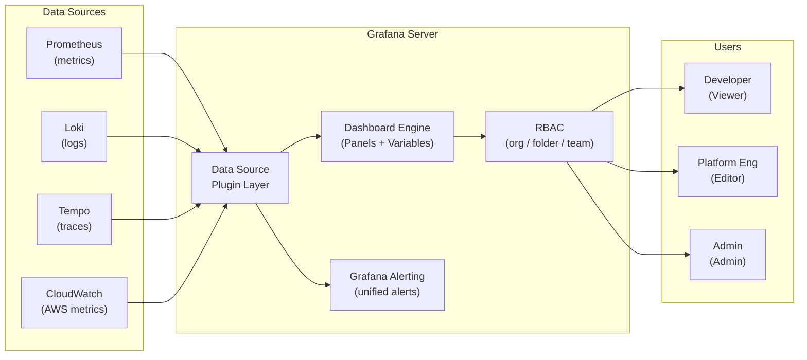
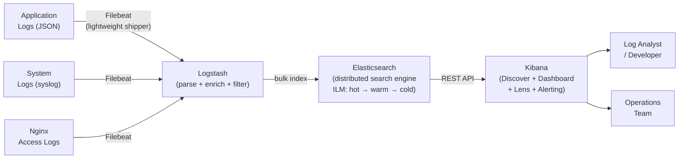

# Monitoring & Alerting Question 4 — Dashboarding Tools: Grafana, CloudWatch & ELK

> **Section:** Monitoring & Alerting &nbsp;|&nbsp; **Topic:** Observability Dashboards — Grafana, AWS CloudWatch, ELK/Kibana, and Tool Selection by Environment &nbsp;|&nbsp; **Level:** Mid (2–5 yrs) &nbsp;|&nbsp; **Frequency:** Very High
>
> _Part of the DevOps & DevSecOps Interview Preparation series._

---

## ❓ The Question

> **"What dashboarding tool do you use for monitoring in your project? How do you present metrics to your team?"**

You may also hear this phrased as:

- *"Walk me through the observability stack you've built — what tools do you use and why?"*
- *"How would you set up a Grafana dashboard from scratch for a Kubernetes application?"*
- *"What is the ELK stack and how does Kibana fit into it?"*
- *"How is CloudWatch different from Grafana for dashboarding?"*
- *"How do you manage dashboard-as-code? How do you prevent dashboard sprawl?"*
- *"Who has access to your dashboards — how do you manage RBAC for observability tooling?"*
- *"What panels and visualisations do you use in Grafana and why?"*

---

## 🎯 Why Interviewers Ask This

This question tests your **hands-on observability maturity**. Interviewers want to know whether you:

- Have **real dashboard-building experience** and can describe a specific setup rather than just naming tools.
- Understand **which tool fits which environment** — Grafana for Kubernetes, CloudWatch for AWS-native, Kibana for log-heavy or on-prem scenarios.
- Know the **tradeoffs between tools** — CloudWatch is zero-setup in AWS but limited; Grafana is flexible but requires data sources; ELK is powerful for logs but operationally heavy.
- Think about **dashboard quality** — not just "I have dashboards" but "I have dashboards with variables, templating, RED metrics, and SLO panels that tell a story."
- Know **dashboard-as-code** — Grafana JSON provisioning, Terraform for CloudWatch dashboards — dashboards that live in Git rather than being manually clicked into existence.
- Understand **RBAC and multi-tenancy** — who sees which dashboards, how you isolate teams.

> **The instant win:** Saying *"In our Kubernetes stack we use Grafana with Prometheus as the data source. I provision dashboards as JSON via a ConfigMap so they're version-controlled in Git. Every service has a RED dashboard — Rate, Errors, Duration — plus an SLO panel showing the error budget. For our AWS infrastructure we use CloudWatch dashboards since everything is already there. If I were on-prem I'd use Kibana for log analysis."*

---

## 📖 Key Terminologies

| Term | Plain-English Meaning |
|------|----------------------|
| **Grafana** | Open-source analytics and visualisation platform — connects to multiple data sources (Prometheus, Loki, CloudWatch, Elasticsearch) and renders dashboards |
| **Dashboard** | A collection of visualisation panels displaying related metrics, logs, or traces in one view |
| **Panel** | A single visualisation unit inside a dashboard — time series, stat, gauge, bar chart, table, heatmap, logs |
| **Data Source** | The backend Grafana queries — Prometheus, Loki, CloudWatch, Elasticsearch, InfluxDB, MySQL, and 60+ others |
| **PromQL** | Prometheus Query Language — the query syntax used in Grafana panels backed by Prometheus |
| **Dashboard variable** | A templating variable in Grafana (e.g., `$namespace`, `$service`) that lets users filter a dashboard without editing queries |
| **RED Method** | Rate, Errors, Duration — the three golden signals for monitoring request-driven services (coined by Tom Wilkie at Grafana) |
| **USE Method** | Utilisation, Saturation, Errors — the three signals for monitoring infrastructure resources (CPU, memory, disk) |
| **AWS CloudWatch** | AWS-managed monitoring and observability service — collects metrics, logs, and events from AWS services natively |
| **CloudWatch Dashboard** | A customisable CloudWatch view showing metrics as graphs, numbers, or alarms across AWS resources |
| **CloudWatch Logs Insights** | SQL-like query language for analysing CloudWatch log groups |
| **ELK Stack** | Elasticsearch (storage/search), Logstash (ingestion/parsing), Kibana (visualisation) — commonly used for log analytics |
| **OpenSearch** | AWS-managed fork of Elasticsearch + Kibana — the AWS-native ELK equivalent |
| **Kibana** | Visualisation frontend for Elasticsearch/OpenSearch — dashboards, KQL queries, Discover view |
| **KQL (Kibana Query Language)** | Query language for filtering documents in Kibana's Discover and dashboard views |
| **Grafana Loki** | Prometheus-inspired log aggregation system — stores logs with labels, queried with LogQL in Grafana |
| **Dashboard-as-code** | Managing dashboard definitions in version control (JSON provisioning, Terraform, Grafonnet/Jsonnet) |
| **RBAC** | Role-Based Access Control — controlling who can view, edit, or admin dashboards and data sources |
| **Provisioning** | Loading dashboards and data sources into Grafana automatically from config files — no manual UI clicks needed |

---

## 🗣️ How to Answer (Structured)

**1) Anchor the answer to your actual environment:**
> "My answer depends on the infrastructure stack. In my current Kubernetes-based project we use Grafana backed by Prometheus and Loki. For AWS infrastructure we use CloudWatch dashboards. If I were working on an on-premises project with heavy log analytics requirements I'd reach for the ELK stack with Kibana."

**2) Describe your Grafana setup concretely:**
> "In Grafana, every service we own has a standard RED dashboard — Rate (requests per second), Errors (error rate percentage), and Duration (p50/p95/p99 latency histograms). All dashboards are provisioned as JSON files in a Kubernetes ConfigMap, so they live in Git and deploy automatically. We use dashboard variables — `$namespace`, `$service`, `$pod` — so one dashboard template covers all services. There's also an SLO panel on every dashboard showing the current error budget burn rate."

**3) Explain CloudWatch for AWS environments:**
> "For AWS-native services — RDS, ECS, Lambda, ALB — CloudWatch is the right choice because the metrics are already there, zero instrumentation needed. We build CloudWatch dashboards in Terraform so they're version-controlled. CloudWatch Logs Insights lets us query structured JSON application logs directly without needing a separate log aggregation tier."

**4) Cover ELK for on-prem/log-heavy scenarios:**
> "The ELK stack makes sense when you have large volumes of unstructured or semi-structured log data from many sources — application logs, syslog, Apache, nginx. Logstash or Filebeat ships logs to Elasticsearch. Kibana provides the Discover view for ad-hoc exploration and the Dashboard view for recurring visualisations. Kibana Lens makes it easy to build dashboards without knowing KQL. I'd use OpenSearch if deploying on AWS since it's the managed equivalent."

**5) Close with dashboard quality and governance:**
> "Beyond the tooling choice, dashboard quality matters as much as tool selection. I follow the rule: every dashboard should tell a story — opening it should immediately answer 'is my service healthy?' Dashboards with 50 unrelated panels are worse than no dashboard because they obscure the signal. We audit dashboards quarterly and prune unused ones."

---

## 🔐 Security Perspective (DevSecOps)

Dashboards are read-only views — but they expose a great deal of sensitive operational intelligence:

- **Dashboards leak architecture.** A Grafana dashboard showing service names, internal hostnames, database endpoints, or AWS account IDs is an attacker's reconnaissance map. Implement Grafana RBAC so external-facing dashboards show aggregated metrics only — never raw infrastructure identifiers.

- **Grafana RBAC — viewer vs editor vs admin.** Grafana supports organisation-level and folder-level roles. Principle of least privilege: most users (developers, product managers) should be `Viewer` — they can see dashboards but can't edit data source configs, create alerts, or modify provisioned dashboards. Only the platform team should have `Editor` or `Admin`.

- **Data source credentials are secrets.** Grafana stores Prometheus, Elasticsearch, and CloudWatch credentials. Use Grafana's built-in secret management or inject credentials via environment variables from a secrets manager. Never commit Grafana config with credentials to Git.

- **Dashboard provisioning prevents shadow IT.** When dashboards are provisioned from Git (JSON files in ConfigMaps), they are immutable in the UI — a rogue engineer can't accidentally modify a production dashboard or create unapproved alert rules. Mark provisioned dashboards as `editable: false` in Grafana to enforce this.

- **Audit Grafana admin actions.** Grafana's audit log (Enterprise) or HTTP access logs record who viewed which dashboard, who changed data sources, and who created/deleted alerts. Feed this into your SIEM for compliance — particularly for PCI-DSS and SOC2 environments where access to performance data must be tracked.

- **Elasticsearch/OpenSearch without auth is a data breach.** Elasticsearch has historically defaulted to no authentication. A misconfigured ELK stack accessible on a public IP has been the source of countless data breaches exposing millions of log records including PII. Always enable X-Pack Security (Elasticsearch) or fine-grained access control (OpenSearch), enforce TLS, and deploy behind a private network.

- **CloudWatch dashboards have IAM permissions.** CloudWatch dashboard access is controlled by IAM. Use `cloudwatch:GetDashboard` and `cloudwatch:ListDashboards` for read-only. Never grant `cloudwatch:PutDashboard` or `cloudwatch:DeleteDashboards` to application roles — only to the CI/CD pipeline that provisions them.

> **One-liner for the room:** *"Dashboards expose your entire infrastructure topology — apply the same least-privilege access controls to Grafana folders and Kibana spaces as you would to production databases."*

---

## 🖼️ Visuals

### Source Image — Monitoring Tools by Environment (KodeKloud)


### Mermaid — Observability Stack by Environment

```mermaid
flowchart TD
    subgraph K8S["Kubernetes Environment"]
        APP1["Application\n(instrumented with\nPrometheus client)"]
        LOGS1["Application Logs\n(stdout → Fluent Bit)"]
        PROM["Prometheus\n(metrics TSDB)"]
        LOKI["Grafana Loki\n(log storage)"]
        GRAFANA["Grafana\n(dashboards + alerts)"]

        APP1 -->|"/metrics scrape"| PROM
        LOGS1 -->|"push logs"| LOKI
        PROM -->|"PromQL data source"| GRAFANA
        LOKI -->|"LogQL data source"| GRAFANA
    end

    subgraph AWS["AWS Environment"]
        EC2["EC2 / ECS / Lambda\n(AWS native metrics)"]
        CWA["CloudWatch Agent\n(custom metrics + logs)"]
        CW["AWS CloudWatch\n(metrics + logs)"]
        CWD["CloudWatch Dashboard\n(visualisation)"]

        EC2 -->|"native metrics"| CW
        EC2 -->|"custom metrics\n+ app logs"| CWA
        CWA -->|"PutMetricData\nPutLogEvents"| CW
        CW -->|"data source"| CWD
    end

    subgraph ONPREM["On-Premises Environment"]
        SERVERS["Servers / VMs\n(syslog + app logs)"]
        FB["Filebeat / Logstash\n(ship + parse)"]
        ES["Elasticsearch\n(index + search)"]
        KIBANA["Kibana\n(dashboards + Discover)"]

        SERVERS -->|"log shipping"| FB
        FB -->|"index documents"| ES
        ES -->|"data source"| KIBANA
    end
```



### Mermaid — Grafana Dashboard Architecture (Kubernetes)



### Mermaid — ELK Stack: Log Flow from Source to Kibana



---

## 📊 Quick Comparison — Grafana vs CloudWatch vs Kibana

| Factor | **Grafana** | **AWS CloudWatch** | **Kibana / OpenSearch Dashboards** |
|--------|------------|-------------------|------------------------------------|
| **Primary use case** | Metrics, logs, traces unified visualisation | AWS infrastructure + application metrics | Log analytics, full-text search |
| **Data sources** | 60+ (Prometheus, Loki, CW, ES, SQL, ...) | CloudWatch only (natively) | Elasticsearch / OpenSearch only |
| **Best for** | Kubernetes, multi-cloud, unified observability | AWS-native stacks, zero-infra monitoring | Log-heavy environments, on-prem, SIEM |
| **Setup effort** | Medium — needs Prometheus + data sources | Low — metrics already in CW for AWS | High — run ES + Logstash/Beats + Kibana |
| **Query language** | PromQL, LogQL, SQL (depends on source) | CloudWatch Metrics Insights, CW Logs Insights | KQL, Lucene, ES DSL |
| **Alert integration** | Built-in (routes to AlertManager/PD/Slack) | CloudWatch Alarms → SNS | Built-in alerting (Kibana 7.7+) |
| **Dashboard-as-code** | JSON provisioning, Grafonnet, Terraform | Terraform `aws_cloudwatch_dashboard` | Saved object API, kibana-object-saver |
| **RBAC** | Org/folder/team/dashboard level | IAM policies | Kibana Spaces + role-based feature controls |
| **Cost model** | Open-source (self-hosted) / Grafana Cloud SaaS | Pay per metric/API call/log GB | Open-source (self-hosted) / OpenSearch SaaS |
| **Real-time logs** | Via Loki data source | Via CloudWatch Logs live tail | Via Kibana Discover streaming |
| **Trace correlation** | Via Tempo (click log → trace) | Via X-Ray (linked from CW) | Via APM integration |

---

## 🛠️ Hands-On: Configuration & Commands

### 1) Grafana Dashboard Provisioning — Dashboard-as-Code via ConfigMap

```yaml
# kubernetes/grafana-dashboards-configmap.yaml
# Grafana picks up dashboards automatically from this ConfigMap
apiVersion: v1
kind: ConfigMap
metadata:
  name: grafana-dashboards-api-service
  namespace: monitoring
  labels:
    grafana_dashboard: "1"   # Label Grafana sidecar watches for
data:
  api-service-red.json: |
    {
      "__inputs": [],
      "__requires": [],
      "annotations": { "list": [] },
      "description": "RED Dashboard — Rate, Errors, Duration for api-service",
      "editable": false,
      "id": null,
      "panels": [
        {
          "title": "Request Rate (req/s)",
          "type": "timeseries",
          "gridPos": { "h": 8, "w": 12, "x": 0, "y": 0 },
          "targets": [{
            "expr": "sum(rate(http_requests_total{service=\"$service\",namespace=\"$namespace\"}[5m])) by (status)",
            "legendFormat": "{{ status }}"
          }]
        },
        {
          "title": "Error Rate (%)",
          "type": "stat",
          "gridPos": { "h": 4, "w": 6, "x": 12, "y": 0 },
          "targets": [{
            "expr": "sum(rate(http_requests_total{service=\"$service\",status=~\"5..\"}[5m])) / sum(rate(http_requests_total{service=\"$service\"}[5m])) * 100",
            "legendFormat": "Error Rate"
          }],
          "fieldConfig": {
            "defaults": {
              "thresholds": {
                "steps": [
                  { "color": "green", "value": 0 },
                  { "color": "yellow", "value": 1 },
                  { "color": "red", "value": 5 }
                ]
              },
              "unit": "percent"
            }
          }
        },
        {
          "title": "p99 Latency (ms)",
          "type": "timeseries",
          "gridPos": { "h": 8, "w": 12, "x": 0, "y": 8 },
          "targets": [{
            "expr": "histogram_quantile(0.99, sum(rate(http_request_duration_seconds_bucket{service=\"$service\"}[5m])) by (le)) * 1000",
            "legendFormat": "p99"
          }, {
            "expr": "histogram_quantile(0.95, sum(rate(http_request_duration_seconds_bucket{service=\"$service\"}[5m])) by (le)) * 1000",
            "legendFormat": "p95"
          }, {
            "expr": "histogram_quantile(0.50, sum(rate(http_request_duration_seconds_bucket{service=\"$service\"}[5m])) by (le)) * 1000",
            "legendFormat": "p50"
          }]
        }
      ],
      "templating": {
        "list": [
          {
            "name": "namespace",
            "type": "query",
            "datasource": "Prometheus",
            "query": "label_values(kube_namespace_labels, namespace)",
            "current": { "value": "production" }
          },
          {
            "name": "service",
            "type": "query",
            "datasource": "Prometheus",
            "query": "label_values(http_requests_total{namespace=\"$namespace\"}, service)",
            "refresh": 2
          }
        ]
      },
      "time": { "from": "now-3h", "to": "now" },
      "title": "API Service — RED Dashboard",
      "uid": "api-red-dashboard",
      "version": 1
    }
```

### 2) Grafana Data Source Configuration — Provisioning

```yaml
# grafana/provisioning/datasources/datasources.yaml
apiVersion: 1

datasources:
  # Prometheus — primary metrics source
  - name: Prometheus
    type: prometheus
    access: proxy
    url: http://prometheus-operated.monitoring.svc.cluster.local:9090
    isDefault: true
    jsonData:
      httpMethod: POST
      timeInterval: "15s"
      exemplarTraceIdDestinations:
        - name: traceID
          datasourceUid: tempo    # Click metric → jump to trace

  # Loki — log aggregation
  - name: Loki
    type: loki
    access: proxy
    url: http://loki.monitoring.svc.cluster.local:3100
    jsonData:
      derivedFields:
        - datasourceUid: tempo
          matcherRegex: "traceID=(\\w+)"
          name: TraceID
          url: '$${__value.raw}'   # Click log line → jump to trace

  # Tempo — distributed traces
  - name: Tempo
    type: tempo
    uid: tempo
    access: proxy
    url: http://tempo.monitoring.svc.cluster.local:3200

  # CloudWatch — AWS metrics (for hybrid environments)
  - name: CloudWatch
    type: cloudwatch
    access: proxy
    jsonData:
      authType: default               # Uses IAM role on the Grafana pod
      defaultRegion: us-east-1
      assumeRoleArn: "arn:aws:iam::111122223333:role/GrafanaCloudWatchRole"
```

### 3) Grafana RBAC — Folder and Team Permissions

```bash
# Grafana HTTP API — create team, assign users, set folder permissions

GRAFANA_URL="https://grafana.internal"
ADMIN_TOKEN="$(vault kv get -field=token secret/grafana/admin)"

# Create a team for the payments engineering team
curl -s -X POST "${GRAFANA_URL}/api/teams" \
  -H "Content-Type: application/json" \
  -H "Authorization: Bearer ${ADMIN_TOKEN}" \
  -d '{"name": "Payments Engineering", "email": "payments@example.com"}'

TEAM_ID=5  # returned from above

# Add users to the team
curl -s -X POST "${GRAFANA_URL}/api/teams/${TEAM_ID}/members" \
  -H "Content-Type: application/json" \
  -H "Authorization: Bearer ${ADMIN_TOKEN}" \
  -d '{"userId": 10}'

# Create a folder for payments dashboards
curl -s -X POST "${GRAFANA_URL}/api/folders" \
  -H "Content-Type: application/json" \
  -H "Authorization: Bearer ${ADMIN_TOKEN}" \
  -d '{"title": "Payments Service", "uid": "payments-folder"}'

# Grant payments team Edit access to their folder only
curl -s -X POST "${GRAFANA_URL}/api/folders/payments-folder/permissions" \
  -H "Content-Type: application/json" \
  -H "Authorization: Bearer ${ADMIN_TOKEN}" \
  -d '{
    "items": [
      {"teamId": '"${TEAM_ID}"', "permission": 2},
      {"role": "Viewer", "permission": 1}
    ]
  }'
# permission: 1=View, 2=Edit, 4=Admin
```

```yaml
# Grafana provisioning — datasource permissions (Grafana Enterprise)
# grafana/provisioning/access-control/roles.yaml
apiVersion: 1
roles:
  - name: payments:datasource:reader
    description: "Read Prometheus data source for payments team"
    permissions:
      - action: datasources:read
        scope: datasources:name:Prometheus
      - action: datasources:query
        scope: datasources:name:Prometheus
```

### 4) AWS CloudWatch Dashboard — Terraform IaC

```hcl
# cloudwatch_dashboard.tf
resource "aws_cloudwatch_dashboard" "api_service" {
  dashboard_name = "${var.environment}-api-service"

  dashboard_body = jsonencode({
    widgets = [
      # ── Request count ────────────────────────────────────────────
      {
        type   = "metric"
        x      = 0
        y      = 0
        width  = 12
        height = 6
        properties = {
          title  = "API Request Count"
          period = 60
          stat   = "Sum"
          metrics = [
            ["AWS/ApiGateway", "Count", "ApiName", var.api_name, "Stage", var.environment]
          ]
          view = "timeSeries"
        }
      },
      # ── 5xx error rate ───────────────────────────────────────────
      {
        type   = "metric"
        x      = 12
        y      = 0
        width  = 12
        height = 6
        properties = {
          title  = "5xx Error Rate (%)"
          period = 60
          stat   = "Average"
          metrics = [
            [{
              expression = "errors/requests*100"
              id         = "errorRate"
              label      = "Error Rate %"
            }],
            ["AWS/ApiGateway", "5XXError", "ApiName", var.api_name, { id = "errors", visible = false }],
            ["AWS/ApiGateway", "Count",    "ApiName", var.api_name, { id = "requests", visible = false }]
          ]
          yAxis = { left = { min = 0, max = 100 } }
        }
      },
      # ── P99 latency ──────────────────────────────────────────────
      {
        type   = "metric"
        x      = 0
        y      = 6
        width  = 12
        height = 6
        properties = {
          title  = "API Latency (ms)"
          period = 60
          metrics = [
            ["AWS/ApiGateway", "Latency", "ApiName", var.api_name, { stat = "p99", label = "p99" }],
            ["AWS/ApiGateway", "Latency", "ApiName", var.api_name, { stat = "p95", label = "p95" }],
            ["AWS/ApiGateway", "Latency", "ApiName", var.api_name, { stat = "Average", label = "avg" }]
          ]
        }
      },
      # ── RDS CPU ──────────────────────────────────────────────────
      {
        type   = "metric"
        x      = 12
        y      = 6
        width  = 12
        height = 6
        properties = {
          title  = "RDS CPU Utilisation (%)"
          period = 60
          stat   = "Average"
          metrics = [
            ["AWS/RDS", "CPUUtilization", "DBInstanceIdentifier", var.rds_identifier]
          ]
          annotations = {
            horizontal = [{ label = "Warning threshold", value = 80, color = "#FF9900" }]
          }
        }
      },
      # ── CloudWatch Logs Insights widget ──────────────────────────
      {
        type   = "log"
        x      = 0
        y      = 12
        width  = 24
        height = 6
        properties = {
          title  = "Application Errors (last 1h)"
          region = var.aws_region
          query  = "SOURCE '/aws/ecs/${var.environment}/api' | fields @timestamp, @message | filter @message like /ERROR/ | sort @timestamp desc | limit 50"
          view   = "table"
        }
      }
    ]
  })
}
```

### 5) CloudWatch Logs Insights — Useful Query Patterns

```sql
-- Error rate by endpoint (structured JSON logs)
fields @timestamp, httpMethod, path, statusCode
| filter statusCode >= 400
| stats count(*) as errorCount by path, statusCode
| sort errorCount desc
| limit 20

-- P99 latency per endpoint
fields @timestamp, path, durationMs
| filter ispresent(durationMs)
| stats pct(durationMs, 99) as p99, pct(durationMs, 95) as p95,
        avg(durationMs) as avgLatency, count(*) as requests
  by path
| sort p99 desc

-- Request count per minute (time series)
fields @timestamp
| filter statusCode >= 200
| stats count(*) as requestCount by bin(1m)

-- Find requests that took > 5 seconds
fields @timestamp, requestId, path, durationMs, userId
| filter durationMs > 5000
| sort durationMs desc
| limit 100

-- Count unique users hitting 401 errors (auth failure detection)
fields @timestamp, userId, sourceIp
| filter statusCode = 401
| stats count(*) as failedAttempts, count_distinct(sourceIp) as uniqueIPs by userId
| sort failedAttempts desc
```

### 6) Kibana Dashboard — KQL Queries and Index Pattern Setup

```bash
# Filebeat configuration — ship application logs to Elasticsearch
# /etc/filebeat/filebeat.yml

filebeat.inputs:
  - type: log
    enabled: true
    paths:
      - /var/log/myapp/*.log
    json.keys_under_root: true    # Parse JSON log lines into fields
    json.add_error_key: true
    fields:
      service: my-api
      environment: production
    fields_under_root: true

  - type: container
    paths:
      - /var/lib/docker/containers/*/*.log
    processors:
      - add_kubernetes_metadata:
          host: ${NODE_NAME}
          matchers:
            - logs_path:
                logs_path: "/var/lib/docker/containers/"

output.elasticsearch:
  hosts: ["elasticsearch.internal:9200"]
  protocol: "https"
  ssl.certificate_authorities: ["/etc/filebeat/ca.crt"]
  username: "filebeat_writer"
  password: "${FILEBEAT_PASSWORD}"   # From keystore
  index: "logs-%{[service]}-%{+YYYY.MM.dd}"

setup.ilm.enabled: true
setup.ilm.policy_name: "30-day-retention"
setup.template.name: "logs"
setup.template.pattern: "logs-*"
```

```
# Kibana KQL — useful filter queries in Discover view

# All errors in the last hour
statusCode >= 400

# Errors from a specific service
service: "my-api" AND statusCode >= 500

# Requests with high latency
durationMs > 2000 AND statusCode: 200

# Auth failures from unusual IPs (not internal range)
statusCode: 401 AND NOT sourceIp: 10.0.*

# Trace a specific user's requests
userId: "user-12345" AND @timestamp > "2024-01-15T10:00:00"

# Find log lines containing exception stack traces
message: "Exception" OR message: "Traceback"

# Filter by Kubernetes pod label
kubernetes.labels.app: "api" AND kubernetes.namespace: "production"
```

```json
// Kibana Index Lifecycle Management policy — 30-day retention
// PUT /_ilm/policy/30-day-retention
{
  "policy": {
    "phases": {
      "hot": {
        "min_age": "0ms",
        "actions": {
          "rollover": {
            "max_primary_shard_size": "50gb",
            "max_age": "1d"
          }
        }
      },
      "warm": {
        "min_age": "7d",
        "actions": {
          "shrink": { "number_of_shards": 1 },
          "forcemerge": { "max_num_segments": 1 }
        }
      },
      "cold": {
        "min_age": "14d",
        "actions": {
          "freeze": {}
        }
      },
      "delete": {
        "min_age": "30d",
        "actions": {
          "delete": {}
        }
      }
    }
  }
}
```

### 7) Grafana Tempo — Distributed Tracing Dashboard

```yaml
# Instrumenting a Python Flask app with OpenTelemetry traces → Tempo

# requirements.txt
# opentelemetry-api
# opentelemetry-sdk
# opentelemetry-exporter-otlp-proto-grpc
# opentelemetry-instrumentation-flask
# opentelemetry-instrumentation-requests

# app.py
from opentelemetry import trace
from opentelemetry.sdk.trace import TracerProvider
from opentelemetry.sdk.trace.export import BatchSpanProcessor
from opentelemetry.exporter.otlp.proto.grpc.trace_exporter import OTLPSpanExporter
from opentelemetry.instrumentation.flask import FlaskInstrumentor
import os

# Configure OTLP exporter → Tempo
tracer_provider = TracerProvider()
otlp_exporter = OTLPSpanExporter(
    endpoint=os.environ.get("OTEL_EXPORTER_OTLP_ENDPOINT", "http://tempo:4317"),
    insecure=True,
)
tracer_provider.add_span_processor(BatchSpanProcessor(otlp_exporter))
trace.set_tracer_provider(tracer_provider)

app = Flask(__name__)
FlaskInstrumentor().instrument_app(app)   # Auto-instruments all routes
```

```promql
# In Grafana: link from Loki log panel to Tempo trace
# Configure derived field in Loki data source:
# Match: "traceId=([a-f0-9]+)"
# URL:   ${__value.raw}   (points to Tempo data source)

# Click a log line → extracted traceId → open in Tempo
# See the full request path across all microservices
```

### 8) Grafana kube-prometheus-stack — Full Stack Kubernetes Install

```bash
# Install kube-prometheus-stack via Helm
# Includes: Prometheus, AlertManager, Grafana, node_exporter,
#           kube-state-metrics, and 30+ pre-built dashboards

helm repo add prometheus-community https://prometheus-community.github.io/helm-charts
helm repo update

# values.yaml customisation
cat > kube-prom-values.yaml << 'EOF'
grafana:
  enabled: true
  adminPassword: "${GRAFANA_ADMIN_PASSWORD}"  # From Vault/secret
  persistence:
    enabled: true
    size: 10Gi
  dashboardProviders:
    dashboardproviders.yaml:
      apiVersion: 1
      providers:
        - name: custom
          folder: "Custom"
          type: file
          options:
            path: /var/lib/grafana/dashboards/custom
  dashboardsConfigMaps:
    custom: "grafana-dashboards-api-service"  # Our ConfigMap from step 1
  sidecar:
    dashboards:
      enabled: true      # Auto-load ConfigMaps labelled grafana_dashboard: "1"
      label: grafana_dashboard
  grafana.ini:
    security:
      disable_gravatar: true
      cookie_secure: true
    auth.anonymous:
      enabled: false       # No anonymous access
    server:
      root_url: "https://grafana.internal"

prometheus:
  prometheusSpec:
    retention: 15d
    retentionSize: "50GiB"
    storageSpec:
      volumeClaimTemplate:
        spec:
          resources:
            requests:
              storage: 100Gi
    # Remote write to Thanos for long-term storage
    remoteWrite:
      - url: http://thanos-receive.monitoring.svc.cluster.local:19291/api/v1/receive

alertmanager:
  alertmanagerSpec:
    configSecret: alertmanager-secret   # alertmanager.yml from Kubernetes Secret

nodeExporter:
  enabled: true

kubeStateMetrics:
  enabled: true
EOF

helm upgrade --install kube-prometheus-stack \
  prometheus-community/kube-prometheus-stack \
  --namespace monitoring \
  --create-namespace \
  --values kube-prom-values.yaml
```

---

## 🤖 AI & The New Trend (2024–2025) — What Changed

### How AI is Reshaping Observability Dashboards

- **Grafana Assistant (GA) — Natural Language Dashboard Building (2024):** Grafana Labs launched an AI assistant that lets you describe what you want to visualise in plain English and generates the panel + PromQL/LogQL query automatically. *"Show me the p99 latency for the payments service compared to last week"* creates a time series panel with the correct query and annotations. This removes the PromQL learning barrier for developers.

- **AI-powered anomaly detection panels in Grafana Cloud:** Grafana's ML service (ALERTING WITH ML feature) automatically detects anomalous patterns in time series — no threshold needed. Instead of `CPU > 80%`, it learns your baseline and flags deviations. These appear as shaded regions on Grafana time series panels.

- **Amazon CloudWatch automatic dashboards (2024):** AWS expanded CloudWatch's automatic dashboards — for common services (ECS, Lambda, RDS, EKS), CloudWatch now generates pre-built dashboards automatically with no configuration. They appear in the CloudWatch console the moment you create the service.

- **OpenTelemetry + unified dashboards:** The industry is converging on OpenTelemetry for instrumentation, which means a single dashboard can show metrics, logs, and traces from any service regardless of language or framework. Grafana's LGTM stack (Loki, Grafana, Tempo, Mimir) is the open-source manifestation of this convergence.

- **Grafana Scenes (2024) — Interactive dashboards with code:** Grafana Scenes is a new React-based framework for building highly interactive, application-like dashboards that go beyond static panels — think drill-down navigation, complex filters, and custom UI elements. Used for building internal developer portals with embedded observability.

- **AWS Managed Grafana + Amazon Managed Service for Prometheus (AMP):** AWS now offers fully managed Grafana and Prometheus — zero operational overhead, IAM-integrated authentication, and VPC connectivity to data sources. Replacing self-hosted Grafana for AWS-heavy orgs.

### How AI Can Contribute to Your Day-to-Day

- **Generate Grafana panel JSON** — *"Write a Grafana panel JSON for a time series showing p99 latency by service from Prometheus, with a threshold annotation at 500ms."*
- **Write CloudWatch Logs Insights queries** — *"Write a CloudWatch Logs Insights query that finds the top 10 API paths by 5xx error count in the last 24 hours."*
- **KQL query generation** — *"Write a Kibana KQL query that finds all log entries where statusCode is 500 and the response time is greater than 2000ms from service 'api-gateway'."*
- **Dashboard review** — *"Review this Grafana dashboard JSON and identify any panels with missing variable interpolation, incorrect `by()` clauses in PromQL, or hardcoded time ranges."*

### ⚠️ Security Caveat

- AI-generated PromQL for Grafana may omit `namespace` or `cluster` label filters — causing a single dashboard panel to accidentally aggregate data across dev and prod. Always add environment filters to every panel query.
- Never let Grafana embed sensitive data (database connection strings, API keys) directly in dashboard variables — use Grafana's built-in secrets management or reference Kubernetes Secrets via environment variables.
- AI-generated Elasticsearch/Kibana configs may use wildcards in index patterns (`logs-*`) that expose logs from all environments in one view — restrict index patterns by environment for production Kibana deployments.

### What to Learn Right Now

1. **Grafana provisioning** — dashboard-as-code via JSON ConfigMaps, data source YAML provisioning
2. **PromQL for dashboards** — `rate()`, `histogram_quantile()`, `sum by()` — the three patterns that power 90% of Grafana panels
3. **CloudWatch Logs Insights** — the query language for log analysis on AWS
4. **OpenTelemetry + LGTM stack** — the future of unified observability (Loki/Grafana/Tempo/Mimir)
5. **Grafana RBAC** — folder-level permissions, team assignments, data source permissions
6. **ELK/OpenSearch ILM** — index lifecycle management to keep storage costs under control

---

## ✅ Prerequisites (Be Solid on These First)

- **Prometheus and PromQL** — Grafana's most common data source; PromQL is essential for building meaningful panels (Monitoring Q1).
- **Docker / Kubernetes basics** — Grafana, Prometheus, and Loki all deploy as containers/pods.
- **JSON** — Grafana dashboards are JSON; understanding the structure is essential for dashboard-as-code.
- **AWS fundamentals** — understanding EC2, ECS, RDS, Lambda metrics before CloudWatch dashboards make sense.
- **(Bonus) Elasticsearch basics** — index, document, shard, mapping — needed for ELK/Kibana deep work.
- **(Bonus) Helm** — `kube-prometheus-stack` is the standard way to deploy the full Grafana + Prometheus stack on Kubernetes.

---

## 📚 Further Reading (Current Docs)

- **Grafana documentation** — <https://grafana.com/docs/grafana/latest/>
- **Grafana dashboard provisioning** — <https://grafana.com/docs/grafana/latest/administration/provisioning/>
- **Grafana RBAC** — <https://grafana.com/docs/grafana/latest/administration/roles-and-permissions/>
- **kube-prometheus-stack Helm chart** — <https://github.com/prometheus-community/helm-charts/tree/main/charts/kube-prometheus-stack>
- **Grafana Loki** — <https://grafana.com/docs/loki/latest/>
- **Grafana Tempo (traces)** — <https://grafana.com/docs/tempo/latest/>
- **AWS CloudWatch Dashboards** — <https://docs.aws.amazon.com/AmazonCloudWatch/latest/monitoring/CloudWatch_Dashboards.html>
- **CloudWatch Logs Insights query syntax** — <https://docs.aws.amazon.com/AmazonCloudWatch/latest/logs/CWL_QuerySyntax.html>
- **AWS Managed Grafana** — <https://docs.aws.amazon.com/grafana/latest/userguide/what-is-Amazon-Managed-Service-Grafana.html>
- **Elasticsearch ILM** — <https://www.elastic.co/guide/en/elasticsearch/reference/current/index-lifecycle-management.html>
- **Kibana KQL** — <https://www.elastic.co/guide/en/kibana/current/kuery-query.html>
- **OpenSearch Dashboards** — <https://opensearch.org/docs/latest/dashboards/>
- **KodeKloud lesson (video):** <https://learn.kodekloud.com/user/courses/devops-interview-preparation-course/module/e9c0a8fa-ed69-494c-9d95-c5e3eb5ecfde/lesson/3a0f6a7a-569b-425f-acaa-9629ed0f8ae1>

---

## 🔁 Related / Follow-up Questions

1. **What is the RED method and how do you implement it in Grafana?** → RED = Rate (requests/sec), Errors (error rate %), Duration (latency percentiles). Every service dashboard should have these three panels. Rate uses `rate(http_requests_total[5m])`, Errors uses `rate(...{status=~"5.."}[5m]) / rate(...[5m]) * 100`, Duration uses `histogram_quantile(0.99, rate(http_request_duration_seconds_bucket[5m]))`. Together they answer "is my service working?" in 3 numbers.

2. **How is the USE method different from RED?** → USE = Utilisation, Saturation, Errors — for infrastructure resources not request-driven services. CPU utilisation (%), CPU saturation (run queue length), CPU errors (hardware errors). Use RED for services (APIs, microservices), USE for resources (CPUs, memory, disks, network interfaces).

3. **What is dashboard-as-code and why does it matter?** → Dashboard-as-code means storing dashboard definitions in version control (JSON in Git, Terraform, Grafonnet/Jsonnet) and provisioning them automatically rather than clicking in the UI. Benefits: version history, code review, rollback, reproducible environments, team collaboration. Prevents dashboard sprawl (hundreds of orphaned, undocumented dashboards).

4. **How does Grafana connect to multiple data sources in one dashboard?** → Each Grafana panel specifies its data source independently. A single dashboard can have one panel querying Prometheus (metrics), another querying Loki (logs), and another querying Tempo (traces) — all rendered side-by-side. This is the "unified observability" pattern — correlate metrics, logs, and traces in one view.

5. **What is Grafana Loki and how is it different from Elasticsearch?** → Loki is a Prometheus-inspired log aggregation system — it stores only the log labels (like Prometheus) and streams the log content compressed. Loki does NOT index log content, which makes it much cheaper than Elasticsearch. The tradeoff: Loki queries (LogQL) are less powerful for full-text search than Elasticsearch/Kibana. Loki is great for Kubernetes log aggregation where you already label everything with namespace/pod/app.

6. **How do you implement multi-tenancy in Grafana for multiple teams?** → Use Grafana organisations (hard isolation — each org has its own data sources, dashboards, users) for completely separate tenants (e.g., different companies in a SaaS product). Use folders + teams for softer isolation within one organisation — each team gets their own folder with Edit access and can see other teams' dashboards as Viewer. Enterprise Grafana adds fine-grained data source permissions per team.

7. **How do you handle dashboard sprawl in a large organisation?** → Three controls: (1) Dashboard-as-code — only provisioned dashboards are official; ad-hoc dashboards are clearly marked as exploratory. (2) Folder ownership — every folder has a team owner responsible for maintaining its dashboards. (3) Quarterly audits — delete dashboards with zero views in 90 days (Grafana usage analytics shows view counts). Adopt a "one RED dashboard per service" standard rather than dozens of purpose-specific dashboards.

8. **What CloudWatch metrics would you put on a dashboard for an EC2-based web application?** → Three tiers: (1) **ALB**: `RequestCount`, `HTTPCode_Target_5XX_Count`, `TargetResponseTime` (p99). (2) **EC2/ASG**: `CPUUtilization`, `NetworkIn/Out`, custom memory/disk via CloudWatch Agent. (3) **RDS**: `CPUUtilization`, `DatabaseConnections`, `ReadLatency`, `WriteLatency`, `FreeStorageSpace`. Add CloudWatch Alarms as annotations on the time series so you can see when alarms fired.

9. **How would you reduce ELK storage costs?** → Index Lifecycle Management (ILM): move hot indices to warm (shrink shards, force-merge) after 7 days, freeze after 14 days, delete after 30 days. Use data tiers: hot nodes (SSDs) for recent data, warm nodes (HDDs) for older data, cold storage (S3 via searchable snapshots) for compliance archival. Reduce stored fields: don't index fields you never query.

10. **What is Grafana Tempo and how does it fit into the observability stack?** → Tempo is a distributed tracing backend — it stores OpenTelemetry, Jaeger, or Zipkin traces. In the LGTM stack it's the "T". In Grafana, you can click a spike on a Prometheus panel to run an exemplar query that jumps to the exact trace that caused the spike, or click a Loki log line to jump to the trace associated with that request. This metrics → logs → traces correlation is the core value proposition of the unified observability stack.

11. **How do you make dashboards useful for non-technical stakeholders?** → Use Stat panels with traffic-light colours (green/yellow/red) for high-level status. Avoid raw metric numbers — format as human-readable (e.g., "99.97% availability" not "0.0003 error rate"). Create a separate "Executive Dashboard" with business metrics (orders/min, revenue rate, user sign-ups) alongside SLO status. Use annotations to show deployments and incidents so stakeholders can correlate business metrics with engineering events.

12. **When would you choose Datadog over self-hosted Grafana + Prometheus?** → Datadog makes sense when: (1) you want zero infrastructure to maintain — no Prometheus, Alertmanager, Loki, or Grafana servers to run. (2) You need native APM/distributed tracing with minimal instrumentation (Datadog auto-instrumentation). (3) You need a unified logs + metrics + traces + synthetics + RUM platform out of the box. Tradeoff: Datadog is expensive at scale (per-host licensing). Grafana + Prometheus is cheaper and more flexible but requires significant platform engineering to build and maintain.

---

> 📌 **30-second interview summary:** The right dashboarding tool depends on the environment. For **Kubernetes** I use **Grafana** backed by Prometheus and Loki — deployed via `kube-prometheus-stack`, provisioned as JSON in ConfigMaps so dashboards live in Git. Every service gets a **RED dashboard** (Rate, Errors, Duration) with templating variables so one dashboard covers all services. For **AWS-native** workloads I use **CloudWatch dashboards** in Terraform — zero setup, metrics already exist for all AWS services. For **on-premises or log-heavy** environments I use the **ELK stack** with Kibana — Filebeat ships logs, Elasticsearch indexes them, Kibana provides search and visualisation. Across all tools, the key principle is **dashboard-as-code** — dashboards live in version control, not in someone's brain or a manually-clicked UI that can't be reproduced.
