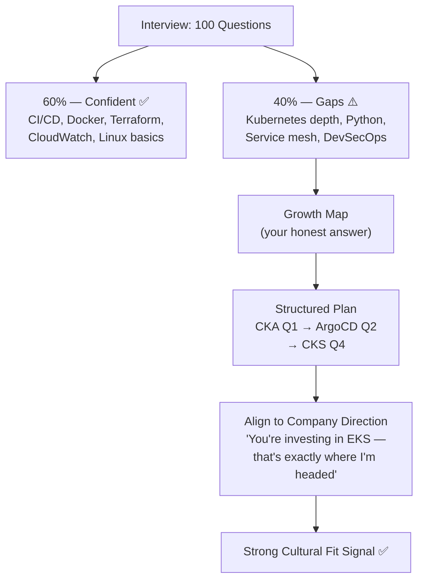
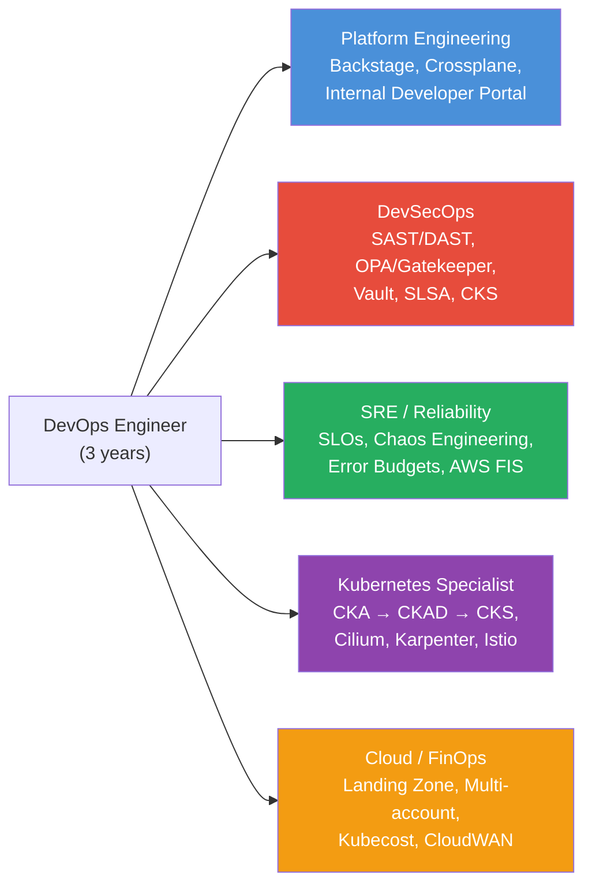

# DevOps Question 2 — What is Your Future Growth Plan as a DevOps Engineer?

> **Section:** DevOps Miscellaneous &nbsp;|&nbsp; **Topic:** Behavioural / Growth Mindset &nbsp;|&nbsp; **Level:** All levels &nbsp;|&nbsp; **Frequency:** Very High (opening or closing question)
>
> _Part of the DevOps & DevSecOps Interview Preparation series._

---

## ❓ The Question

> **"What do you think is the future trajectory of your journey as a DevOps engineer?"**

You may also hear this phrased as:

- "Where do you see yourself in 3–5 years?"
- "What's next for you in your DevOps career?"
- "What areas do you feel you need to improve in?"
- "How do you plan to grow within our organisation?"
- "What's your learning plan going forward?"
- "What will you do as a DevOps engineer from here?"

---

## 🎯 Why Interviewers Ask This

This question appears at the **start or end** of interviews and catches many candidates off guard — especially after a string of technical questions. It is **not** a filler question. The interviewer is evaluating:

- **Self-awareness** — Do you know your own skill gaps honestly, or do you over-claim?
- **Growth mindset** — Are you driven to improve, or content to coast on what you already know?
- **Cultural fit** — Does your direction align with where the team and company are heading?
- **Retention signal** — Will you stick around and develop, or jump ship once you've learned what you need?

A candidate who scores 60% on technical questions but articulates a clear, structured growth plan is often rated higher than one who answered 80% of questions but appeared complacent. Interviewers hire for trajectory as much as current capability.

> **The instant win:** Acknowledge specific gaps honestly and name a concrete plan — not "I want to learn everything" but "I know my Kubernetes depth needs to grow and here's how I'm doing it."

---

## 📖 Key Terminologies

| Term | Plain-English meaning |
|------|----------------------|
| **Growth mindset** | The belief that skills are developed through effort — not fixed traits. The opposite: fixed mindset ("I'm either good at it or not"). |
| **Skill gap** | The delta between where you are and where you need to be for a target role or project. |
| **Learning budget** | Company-allocated funds for courses, certifications, and conferences. Most tech companies offer $1,000–$5,000/year. Always ask about this. |
| **Mentorship** | Structured learning from a more experienced colleague. More valuable than courses for closing practical gaps fast. |
| **Certification** | A vendor-issued credential validating skills (e.g., CKA, AWS DevOps Pro). Signals structured commitment to a skill area. |
| **Platform Engineering** | A growing specialisation focused on building internal developer platforms (IDPs), self-service tooling, and golden paths for development teams. |
| **DevSecOps specialisation** | The path of embedding security deep into CI/CD, IaC, and runtime — rather than bolting it on at the end. |
| **SRE (Site Reliability Engineering)** | A specialisation focused on reliability, SLOs, error budgets, and reducing toil through automation. |
| **Toil** | Repetitive, manual, automatable operational work. Google SRE principle: if you're spending >50% on toil, that's a problem to fix, not a badge of honour. |
| **Error budget** | The allowed failure rate within an SLO period. When burned out → freeze deployments, improve reliability. |
| **CNCF Landscape** | The Cloud Native Computing Foundation's map of the cloud-native ecosystem — ~1,100 projects. A good compass for what's worth learning next. |

---

## 🗣️ How to Answer (Structured)

**1) Start with an honest baseline — name your current strengths:**
> "I'm confident with core DevOps: CI/CD pipelines in GitLab and GitHub Actions, Docker containerisation, Terraform for IaC, and CloudWatch monitoring on AWS."

**2) Acknowledge specific gaps — this is the key moment:**
> "Where I know I need more depth is Kubernetes — I can manage workloads and configure services, but I haven't designed a production multi-cluster setup or worked with a service mesh. I'm also building my Python scripting skills so I can write automation, not just consume it."

**3) State a concrete learning plan with timeline:**
> "My plan is to complete the CKA in the next 3 months — I'm already studying with KodeKloud labs. Alongside that, I have a personal EKS project where I'm experimenting with Karpenter and Cilium."

**4) Connect your growth to the company's direction:**
> "I've seen that your team is moving toward platform engineering and building internal tooling for developers. That's exactly where I want to go. I see a clear path from where I am today to contributing to that roadmap within 6–12 months."

**5) Close with what you want from the company:**
> "I'd love to work with senior engineers here who've already solved these problems at scale — that kind of practical mentorship accelerates the learning I can't get from a course alone."

---

## 🔐 Career Development Perspective (DevSecOps Lens)

Even for a behavioural question, thinking through the DevSecOps angle strengthens your answer:

- **Security is the fastest-growing gap across DevOps teams.** Interviewers — especially at fintech, healthcare, or cloud-native companies — are actively looking for DevOps engineers who voluntarily mention security growth. If you name SAST/DAST pipelines, OPA/Gatekeeper, or secrets management as a learning target, you stand out immediately.

- **Your growth plan signals your security posture mindset.** A candidate who says "I want to get CKS (Certified Kubernetes Security Specialist)" is showing they think about security at the infrastructure layer — not just the application layer.

- **Compliance awareness is a differentiator.** Mentioning SOC 2, PCI-DSS, HIPAA, or GDPR as motivation for your DevSecOps growth tells an interviewer you understand that security isn't just technical — it's a business obligation.

- **Don't mention growing into secrets sprawl or overly permissive IAM.** That sounds like a red flag — you're describing growth in areas that cause breaches. Instead frame security growth as: "I want to contribute to shifting security left — catching issues in the pipeline before they reach production."

> **One-liner for the room:** *"The DevOps field doesn't stand still, and neither should I. I know my gaps, I have a plan, and I want to grow alongside a team that's solving problems I haven't faced yet."*

---

## 🖼️ Visuals

### Mermaid — The 60/40 Rule: How gaps become your growth roadmap



### Mermaid — DevOps Specialisation Paths (pick 1–2 to go deep)



### Source image — KodeKloud whiteboard


> The whiteboard captures the interview reality: 50 minutes in, DevOps covers everything, 60% answered confidently, 40% are improvement areas — and those improvement areas become the HR-worthy answer that gets you the offer.

---

## 📊 Strong vs. Weak Answer Comparison

| Weak Answer | Strong Answer |
|-------------|---------------|
| "I want to learn everything." | "I want CKA depth + DevSecOps — specifically OPA/Gatekeeper." |
| "I'll just learn on the job." | "CKA in Q1, personal EKS project in Q2, CKS prep by Q4." |
| "I want to move into management." | "I want to grow as a technical IC and contribute to platform architecture decisions." |
| Vague: "I'll keep up to date." | Specific: "I follow KubeCon talks and track the CNCF Landscape monthly." |
| No connection to company | "Your move to platform engineering maps to exactly what I'm building toward." |
| "I'm already good at most things." | "I'm confident in 60%, and I know exactly what the other 40% is." |
| "I'll get every cert available." | "CKA, then AWS DevOps Pro — two certs that build on each other and pair with real projects." |

---

## 🛠️ Hands-On: Templates & Frameworks

### 1) Self-Assessment Grid — Fill this out before any interview

```
DEVOPS SKILLS SELF-ASSESSMENT (fill before every interview)
─────────────────────────────────────────────────────────────────
CATEGORY          SKILL                      YOUR STATUS
──────────────    ──────────────────────     ─────────────────
CI/CD             Jenkins, GitLab CI          ✅ Strong
                  GitHub Actions              ✅ Strong
                  ArgoCD / GitOps             ⚠️ Learning
                  Flux                        ❌ Not yet

Containers        Docker                      ✅ Strong
                  Docker Compose              ✅ Strong
                  Container security (Trivy)  ⚠️ Partial

Orchestration     Kubernetes basics            ✅ Comfortable
                  EKS production design        ⚠️ Growing
                  Helm chart authoring         ⚠️ Partial
                  Service mesh (Istio)         ❌ Gap
                  Karpenter / Cluster Autoscaler ⚠️ Learning

IaC               Terraform (basic)            ✅ Strong
                  Terraform modules            ⚠️ Growing
                  Terragrunt                   ❌ Gap
                  Pulumi / CDK                 ❌ Gap

Cloud (AWS)       Core services (EC2/S3/RDS)   ✅ Strong
                  EKS, ECS                     ⚠️ Growing
                  Networking (TGW/Direct Connect) ⚠️ Partial
                  AWS Security Hub, GuardDuty  ⚠️ Learning

Scripting         Bash                         ✅ Strong
                  Python                       ⚠️ Growing
                  Go                           ❌ Gap

Security          SAST/DAST in pipelines        ⚠️ Growing
                  OPA/Gatekeeper               ❌ Gap
                  IRSA / IAM for K8s           ⚠️ Partial
                  Secrets management (Vault)   ❌ Gap

Observability     CloudWatch                   ✅ Strong
                  Prometheus + Grafana          ⚠️ Growing
                  OpenTelemetry                ❌ Gap
─────────────────────────────────────────────────────────────────
✅ = Production-experienced  ⚠️ = Familiar, needs depth  ❌ = Gap
```

### 2) 12-Month Growth Plan Template (sample for a 3-year engineer)

```
QUARTER 1 (Months 1–3): Foundation Depth
  → CKA certification — KodeKloud labs + personal EKS cluster
  → Python: write one real automation tool (e.g., auto-tag untagged AWS resources)
  → Read: The Phoenix Project + Google SRE Book chapters 1–10

QUARTER 2 (Months 4–6): GitOps & Platform
  → Deploy ArgoCD — migrate one project to full GitOps model
  → Author 1 reusable Helm chart from scratch for a team service
  → Shadow senior engineer on 2+ architecture design reviews

QUARTER 3 (Months 7–9): Security Layer
  → Add SAST (Semgrep) + image scanning (Trivy) to existing pipelines
  → Learn OPA/Gatekeeper — write 3 admission controller policies
  → Study: AWS Security Hub, GuardDuty, Macie integration

QUARTER 4 (Months 10–12): Specialisation
  → Based on team direction — pick one:
     • Platform Eng: Deploy Backstage IDP with 1 plugin
     • DevSecOps: CKS certification prep + pass exam
  → Present a demo or internal tech talk: proof of learning
```

### 3) Company-Alignment Script (research this before the interview)

```
BEFORE EVERY INTERVIEW — ANSWER THESE:
────────────────────────────────────────────────────────────
Q: What cloud do they use?         → AWS / Azure / GCP / multi
Q: What containers/orchestration?  → ECS / EKS / K8s / Fargate
Q: DevSecOps requirements?         → fintech/healthcare = yes
Q: What does their JD mention?     → Mirror those tools in your plan
Q: Do they have an eng blog?       → Read it — mention a post
Q: Platform engineering signals?   → "internal tooling" in JD
────────────────────────────────────────────────────────────
Then complete the sentence:
"I noticed your team is investing in [X].
That aligns with my plan to [Y] over the next [Z] months."
```

### 4) Certifications Roadmap (2024/2025)

```
RECOMMENDED PATH FOR 3-YEAR DEVOPS ENGINEER:

Month 3:  CKA  (Certified Kubernetes Administrator)
          → Validates: cluster setup, workloads, RBAC, storage, networking

Month 6:  AWS DevOps Engineer Professional
          → Validates: CI/CD, monitoring, IaC, multi-account, incident management

Month 10: CKS  (Certified Kubernetes Security Specialist)
          → Validates: K8s hardening, supply chain security, OPA, runtime security
          → Prerequisite: valid CKA

ALTERNATIVE TRACKS:
  HashiCorp Terraform Associate → if IaC-focused role
  AWS Security Specialty (SCS)  → if DevSecOps-focused role
  CKAD                          → if application-developer hybrid role
```

---

## 🤖 AI & The New Trend (2024–2025)

> The DevOps field is evolving faster than any individual can fully track. AI is reshaping what skills matter, which tasks get automated, and which new specialisations are emerging. Knowing this makes your growth answer more current and credible.

### What AI is changing in DevOps careers

- **AI-assisted IaC generation** — Tools like Amazon Q Developer, GitHub Copilot, and Terraform AI extensions can generate Terraform modules from natural language. This raises the bar: knowing *how* to write Terraform is still required, but knowing *when* a generated module is correct or insecure is the new differentiator. Your growth plan should include reviewing AI-generated infrastructure critically, not just accepting it.

- **AI-powered observability** — AWS DevOps Guru, Datadog Watchdog, and Dynatrace Davis use ML to detect anomalies and predict failures before thresholds fire. These tools are reducing the need for manual threshold-tuning — the new skill is understanding *how* the AI makes decisions and *when* to override it.

- **Platform Engineering acceleration** — Backstage (the CNCF internal developer portal) is now seeing AI plugins that auto-generate service templates, onboarding docs, and dependency graphs. Platform engineers who can integrate AI capabilities into IDPs are among the most sought-after profiles in 2024/2025.

- **Security shift-left with AI** — AI-powered SAST tools (Semgrep, Snyk, CodeGuru) are getting dramatically better at finding real vulnerabilities with fewer false positives. The DevSecOps growth area is no longer "set up the tool" — it's "triage AI findings and build the policy that auto-blocks deployments when they fire."

- **AI for incident management** — Platforms like Rootly and Incident.io now use AI to auto-draft postmortem summaries, suggest runbook steps, and predict blast radius. Learning to use and evaluate these tools is now part of the modern SRE/DevOps skillset.

### How to mention AI in your growth answer

> "I'm also paying attention to how AI tooling is changing the role — specifically AI-assisted code review in pipelines and observability platforms like DevOps Guru. I want to understand these tools deeply enough that I can evaluate their outputs critically, not just pipe their recommendations through blindly."

This tells the interviewer: you're aware of the trend, not threatened by it, and thinking critically about how to use it responsibly — a senior-mindset signal.

### ⚠️ What NOT to say about AI in your growth answer
- "AI will replace DevOps so I'm pivoting to AI." — Dismisses your field and sounds reactive.
- "I use ChatGPT to write all my Terraform." — Signals you're not thinking critically about what gets deployed.
- "I don't use AI tools." — In 2024/2025, this signals you're behind the curve.

---

## ✅ Prerequisites (be solid on these first)

- **Core DevOps toolchain** — CI/CD (at least one major platform), Docker, Terraform basics, Linux CLI, a cloud provider (AWS/GCP/Azure). Without these, the growth plan conversation is premature.
- **Understanding your own experience level** — 1-year, 3-year, and 5-year engineers have genuinely different realistic growth targets. Know what's realistic for your level.
- **Basic DevSecOps awareness** — Even if security isn't your current focus, knowing the concepts (SAST, DAST, secrets management, RBAC) gives you areas to name as growth targets for security-conscious employers.
- **Familiarity with CNCF Landscape** — Knowing what exists (even if you haven't used it) lets you name specific tools in your growth plan rather than speaking in categories.
- **Some awareness of the company** — You can't tailor your growth answer to the company's direction without 20 minutes of research beforehand.

---

## 📚 Further Reading (current docs)

- **Google SRE Book (free)** — <https://sre.google/sre-book/table-of-contents/>
- **CNCF Landscape** — <https://landscape.cncf.io/>
- **CKA Curriculum** — <https://github.com/cncf/curriculum>
- **AWS DevOps Engineer Professional exam guide** — <https://aws.amazon.com/certification/certified-devops-engineer-professional/>
- **HashiCorp Terraform Associate** — <https://developer.hashicorp.com/certifications/infrastructure-automation>
- **Platform Engineering community** — <https://platformengineering.org/>
- **KodeKloud lesson (video):** <https://learn.kodekloud.com/user/courses/devops-interview-preparation-course/module/013fead8-a37c-42eb-83ec-e691a1238d08/lesson/4d4466fd-f551-417c-a8ed-0f83ef84059c>

---

## 🔁 Related / Follow-up Questions (they often go here next)

1. **"What are your weaknesses as a DevOps engineer?"** → Same answer structure as growth plan — name specific gaps (Kubernetes depth, Python, service mesh), pair each with a concrete improvement action. Never give a fake weakness ("I work too hard").

2. **"How do you stay up to date with DevOps trends?"** → Name specific, credible sources: KubeCon talks (YouTube), CNCF blog, AWS re:Invent sessions, DevOps Toolkit (YouTube), Kelsey Hightower's writing, the SRE Workbook. Avoid vague: "I read blogs."

3. **"What would you do in your first 30/60/90 days here?"** → First 30: listen, read docs, shadow team members. First 60: take ownership of one small thing end-to-end. First 90: deliver one improvement that wasn't assigned — show initiative, not just compliance.

4. **"Are you pursuing any certifications?"** → Always have a specific answer: "CKA — I'm aiming to sit the exam in [month]. I'm using KodeKloud labs." A vague "I'm thinking about it" is a weak signal.

5. **"What's something you learned recently that changed how you work?"** → Prepare a concrete example: "I learned about SLO-based alerting through the Google SRE book. I changed how I set alert thresholds — from arbitrary CPU percentages to burn-rate alerts tied to our error budget. It halved our pager noise."

6. **"How do you handle not knowing the answer to a technical question?"** → "I say 'I don't know the answer right now, but here's how I'd find out.' I'm comfortable with the boundary between what I know and what I need to learn — that's the same honesty I apply to my growth plan."

7. **"Do you prefer depth or breadth?"** → "At this stage of my career, I prefer strategic depth with deliberate breadth. I want to go deep in Kubernetes and DevSecOps because those are high-value specialisations — but I stay broadly aware of the ecosystem so I can make good tool choices and work effectively across teams."

8. **"How do you use the company's learning budget?"** → "I'd prioritise one certification path that directly adds value to the team, plus access to hands-on labs (KodeKloud or A Cloud Guru) so learning is practical, not just theoretical. And I'd ask about mentorship — pairing with a senior engineer once a week moves faster than any course."

---

> 📌 **30-second interview summary:** This question is placed strategically — at the start to understand your ambitions, or at the end to see if you close strong. The winning answer has three parts: (1) an honest baseline — naming your current confidence level and specific gaps; (2) a concrete learning plan — specific tools, certifications, and timeline, not "I'll keep learning"; (3) alignment with the company — connecting your growth direction to where they are heading. Candidates who can articulate this clearly signal self-awareness, drive, and cultural fit — three things no technical question can measure.

