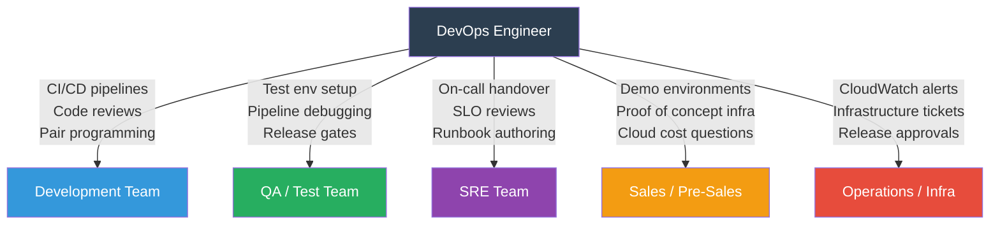

# DevOps Question 3 — What Does a Typical Day Look Like for a DevOps Engineer?

> **Section:** DevOps Miscellaneous &nbsp;|&nbsp; **Topic:** Behavioural / Day-in-the-Life &nbsp;|&nbsp; **Level:** All levels &nbsp;|&nbsp; **Frequency:** Very High (opening question)
>
> _Part of the DevOps & DevSecOps Interview Preparation series._

---

## ❓ The Question

> **"Tell me about yourself and what your day-to-day tasks are as a DevOps engineer."**

You may also hear this phrased as:

- "Walk me through a typical day in your current role."
- "What does your daily work actually look like?"
- "How do you spend most of your time as a DevOps engineer?"
- "What teams do you collaborate with on a daily basis?"
- "What kind of tasks do you own end-to-end?"

---

## 🎯 Why Interviewers Ask This

This is frequently the **opening question** of an interview — and it sets the tone for everything that follows. Interviewers use it to:

- **Understand your real scope** — Are you doing deep infrastructure work, CI/CD ownership, on-call, release management, or a mix?
- **Assess communication skills** — Can you describe complex technical work clearly and concisely?
- **Check team-fit signals** — Do you work collaboratively with Dev, QA, SRE, and product teams, or in silos?
- **Spot experience level** — A junior lists tasks. A mid-level explains the *why* behind their tasks. A senior talks about *impact*.
- **Validate the resume** — Your answer should match what's on your CV. Inconsistencies raise flags.

> **The instant win:** Structure your answer chronologically through your day, highlight cross-team collaboration, name real tools, and end with something that shows you invest in your own growth.

---

## 📖 Key Terminologies

| Term | Plain-English Meaning |
|------|----------------------|
| **Stand-up / Daily Scrum** | A short (15 min) daily team sync covering: what I did yesterday, what I'm doing today, any blockers. |
| **JIRA** | Project management tool for tracking tasks, bugs, and sprints. DevOps engineers use it to manage infra tickets, release tasks, and incident follow-ups. |
| **Slack** | Team communication platform — the primary channel for async updates, incident alerts, and cross-team collaboration in most tech companies. |
| **Sprint** | A fixed time-box (usually 2 weeks) in which a team commits to completing a set of tasks. |
| **Pair programming** | Two engineers working together on one task — one "drives" (writes code), one "navigates" (reviews in real time). Common in DevOps for pipeline work and runbook authoring. |
| **Code review / PR review** | Reviewing a colleague's pull request to catch bugs, security issues, or style problems before merge. |
| **On-call rotation** | A scheduled shift where one engineer is responsible for responding to production alerts — including nights and weekends. |
| **Toil** | Manual, repetitive, automatable work. Reducing toil is a core DevOps/SRE responsibility. |
| **Release management** | Coordinating and executing the deployment of a software version to production — including rollback planning and stakeholder sign-off. |
| **Runbook** | A documented step-by-step procedure for common operational tasks or incident responses. |
| **Infrastructure drift** | When the actual state of cloud infrastructure diverges from what's defined in IaC (Terraform/CloudFormation). Detected by `terraform plan`. |

---

## 🗣️ How to Answer (Structured)

**1) Open with your team context:**
> "As a DevOps engineer, I work closely with development, QA, SRE, and sometimes sales engineering teams — so my day is a mix of technical work, collaboration, and communication."

**2) Walk through your day chronologically:**
> "I start at 9 AM by checking Slack for overnight alerts or messages and reviewing my JIRA board to reprioritise if anything critical came in. I update ticket statuses and handle any quick operational tasks — restarting a service, reviewing a CloudWatch alarm, or unblocking a deploy."

**3) Name the stand-up:**
> "At 10 AM we have a 30-minute daily stand-up — I share what I did yesterday, what I'm working on today, and flag any blockers. Keeping it concise is important — the stand-up isn't for problem-solving, it's for alignment."

**4) Describe focused/deep work:**
> "From 10:30 to 1 PM is my deep-work window — I protect this time. This is where I work on JIRA tickets: building or improving pipelines, reviewing infrastructure PRs, doing AWS work — deploying changes, tuning auto-scaling, reviewing costs — or handling release tasks."

**5) Describe collaborative afternoon:**
> "After lunch I shift to collaboration — pair programming with a developer on a Dockerfile or pipeline issue, participating in design discussions for new features, or helping QA set up a test environment. This is also when I do any production deployments if we have a release window."

**6) Close with learning:**
> "I reserve 4–5 PM for learning — reading release notes, watching a KubeCon talk, working through a KodeKloud lab, or experimenting in a sandbox. The DevOps landscape changes fast and that hour compounds over months."

---

## 🔐 Security Perspective (DevSecOps)

A strong answer weaves security into the daily flow — not as a separate concern but as a natural part of each activity:

- **Morning JIRA review** — Include security tickets (Dependabot PRs, Trivy scan failures, GuardDuty findings) in your daily prioritisation, not just feature work.
- **PR/code reviews** — When reviewing infrastructure PRs, check for hard-coded secrets, overly permissive IAM, missing encryption settings, and public exposure. Don't just check for functionality.
- **AWS work** — Mention that you check CloudTrail for anomalous API calls alongside CloudWatch metrics when doing daily operations. Security is part of the operational review.
- **Release process** — Every deploy should include a security gate: SAST results checked, container image scanned, `terraform plan` reviewed for unintended resource exposure before `apply`.
- **Pair programming** — When pairing with developers, this is your best chance to embed secure coding practices — catching secrets in env vars, flagging `curl | bash` in Dockerfiles, flagging unbounded IAM roles.

> **One-liner for the room:** *"In my day, security isn't a phase at the end — it's a lens I apply to every task: reviewing infra PRs, checking AWS alerts, doing releases. It's part of the job, not a separate queue."*

---

## 🖼️ Visuals

### Mermaid — A DevOps Engineer's Daily Schedule

```mermaid
gantt
    title A Typical DevOps Engineer Day
    dateFormat HH:mm
    axisFormat %H:%M

    section Morning
    Check Slack + Update JIRA    :09:00, 60m
    Daily Stand-Up               :10:00, 30m

    section Deep Work
    JIRA tasks (AWS, pipelines, code review, releases) :10:30, 150m

    section Break
    Lunch                        :13:00, 60m

    section Collaboration
    Pair programming / design discussions / deploys :14:00, 120m

    section Growth
    Learning new tools / trends  :16:00, 60m
```



### Mermaid — DevOps Cross-Team Collaboration Map



### Source images — KodeKloud


---

## 📊 Daily Schedule Summary Table

| Time Slot | Activity | Tools / Systems | Key Focus |
|-----------|----------|----------------|-----------|
| 9:00 – 10:00 AM | Morning routine | Slack, JIRA, CloudWatch | Communications, task triage, quick ops |
| 10:00 – 10:30 AM | Daily stand-up | Zoom/Meet, JIRA | Team sync, blockers, alignment |
| 10:30 AM – 1:00 PM | Focused work | AWS, GitHub/GitLab, Terraform, Jenkins/ArgoCD | Tickets: pipelines, infra, code review, releases |
| 1:00 – 2:00 PM | Lunch | — | Recharge |
| 2:00 – 4:00 PM | Collaborative work | Slack huddles, GitHub PRs, Zoom | Pair programming, design discussions, deployments |
| 4:00 – 5:00 PM | Learning | KodeKloud, YouTube, docs | Continuous improvement, sandbox experiments |

---

## 🛠️ Hands-On: Tools Used Throughout a DevOps Day

### Morning — JIRA CLI + Slack (quick ops check)

```bash
# Check if any overnight CloudWatch alarms fired
aws cloudwatch describe-alarms \
  --state-value ALARM \
  --query 'MetricAlarms[*].{Name:AlarmName,State:StateValue,Reason:StateReason}' \
  --output table

# Quick EC2 instance health check (common morning task)
aws ec2 describe-instance-status \
  --filters Name=instance-state-name,Values=running \
  --query 'InstanceStatuses[?InstanceStatus.Status!=`ok`].{ID:InstanceId,Status:InstanceStatus.Status}' \
  --output table

# Restart an EC2 instance (a common JIRA ticket resolution)
aws ec2 reboot-instances --instance-ids i-0abc123def456789

# Check ECS service health across a cluster (morning sanity check)
aws ecs list-services --cluster production --output text | \
  xargs -I{} aws ecs describe-services --cluster production --services {} \
  --query 'services[*].{Service:serviceName,Running:runningCount,Desired:desiredCount}' \
  --output table
```

### Deep Work — Terraform infrastructure changes

```bash
# Morning infra drift check — see what changed vs what's in code
cd infrastructure/
terraform init -upgrade
terraform plan -out=daily-plan.tfplan

# Review the plan before applying
terraform show daily-plan.tfplan

# Apply only after PR review and approval
terraform apply daily-plan.tfplan

# Tag check — enforce tagging policy (common operational task)
aws resourcegroupstaggingapi get-resources \
  --tag-filters Key=Environment \
  --resource-type-filters ec2:instance \
  --query 'ResourceTagMappingList[?Tags[?Key==`Environment`] == `[]`].ResourceARN'
```

### Deep Work — Pipeline CI/CD review

```bash
# Check recent GitLab CI pipeline statuses (via GitLab CLI glab)
glab ci list --repo company/my-service --status failed

# View failed job logs directly from CLI
glab ci view <pipeline-id>

# Trigger a manual pipeline (e.g., re-run a failed deploy)
glab ci run --branch main

# GitHub: list open PRs waiting for review
gh pr list --repo company/my-service --label "needs-review" --assignee @me

# Check workflow run status (GitHub Actions)
gh run list --repo company/my-service --limit 10 --status failure
```

### Collaborative Work — Code review checklist items to check on PRs

```bash
# Scan a Dockerfile for common security issues (during PR review)
trivy image --exit-code 1 --severity HIGH,CRITICAL my-service:pr-branch

# Check for secrets accidentally committed (during PR review)
git-secrets --scan
# or
truffleHog git file://. --since-commit HEAD~5 --only-verified

# Validate Terraform before merge
tfsec .
checkov -d . --framework terraform

# Check a Kubernetes manifest for security issues
kubesec scan deployment.yaml
```

### Release Management — Production deployment steps

```bash
# 1. Confirm CI passed (never deploy on a red pipeline)
gh run list --repo company/my-service --branch release/1.4.2 --status success

# 2. Check current production version
kubectl get deployment my-service -n production \
  -o jsonpath='{.spec.template.spec.containers[0].image}'

# 3. Rolling deploy (Kubernetes)
kubectl set image deployment/my-service \
  my-service=my-service:1.4.2 \
  -n production

# Monitor rollout progress
kubectl rollout status deployment/my-service -n production --timeout=5m

# 4. Verify health post-deploy
kubectl get pods -n production -l app=my-service
aws elbv2 describe-target-health \
  --target-group-arn arn:aws:elasticloadbalancing:us-east-1:123:targetgroup/my-service/abc

# 5. Rollback immediately if error rate spikes
kubectl rollout undo deployment/my-service -n production
```

---

## 🤖 AI & The New Trend (2024–2025)

> The day-to-day of a DevOps engineer is being augmented — and in some areas transformed — by AI tools. Knowing this makes your answer more current.

### How AI is changing the daily DevOps workflow

- **Amazon Q Developer / GitHub Copilot for IaC** — Instead of writing Terraform from scratch, engineers describe the resource in natural language and review the output. The skill shifts from writing every line to reviewing AI-generated code critically — catching insecure defaults, wrong region settings, or missing tags.

- **AI-assisted code review** — Tools like CodeRabbit, Sourcegraph Cody, and GitHub Copilot PR review can now comment on pull requests, catching logic bugs and security issues before a human reviewer even opens the PR. DevOps engineers are learning to triage these AI comments, not replace human judgment with them.

- **AWS DevOps Guru for daily ops** — Instead of manually checking CloudWatch every morning, DevOps Guru uses ML to surface anomalies proactively. The morning routine is evolving: check DevOps Guru insights first, then go to CloudWatch for investigation.

- **AI-generated runbooks** — Incident management platforms (Rootly, Incident.io) now auto-generate runbook drafts from past incident data. DevOps engineers review and approve these rather than writing from scratch.

- **Natural language Jira queries** — Atlassian Intelligence in Jira can now summarise sprint progress, suggest ticket priorities, and draft ticket descriptions. The admin overhead of daily JIRA hygiene is shrinking.

- **AI for learning acceleration** — The 4–5 PM learning hour is more productive than ever: asking an LLM to explain a concept, generate a lab scenario, or create a quiz based on CKA exam topics. Self-directed learning velocity has increased significantly for engineers who use this intentionally.

### Mention this in your answer (optional but impactful):

> "I've started incorporating AI tools into my daily workflow — using Amazon Q Developer for first drafts of Terraform modules and CodeRabbit for automated PR comments. I treat them as a second set of eyes, not a replacement for judgment. It's made me faster on routine tasks and freed up focus for the harder problems."

---

## ✅ Prerequisites (be solid on these first)

- **JIRA basics** — Creating, updating, and transitioning tickets; understanding sprint boards vs. Kanban boards; writing clear ticket descriptions.
- **Slack / async communication** — Writing clear, concise update messages; using threads; not over-notifying a channel; knowing when to escalate to a call.
- **Git workflow** — PR creation, review comments, approving/requesting changes; understanding branch strategies (feature branches, trunk-based development).
- **AWS Console + CLI fundamentals** — Enough to check EC2 health, read CloudWatch, and navigate service dashboards as part of morning ops checks.
- **Basic Kubernetes kubectl** — `get pods`, `describe`, `logs`, `rollout status` — the daily diagnostic commands.
- **Agile/Scrum basics** — What a stand-up is, what a sprint is, how JIRA fits into that workflow.

---

## 📚 Further Reading (current docs)

- **Atlassian Jira documentation** — <https://support.atlassian.com/jira-software-cloud/>
- **GitHub CLI (`gh`) documentation** — <https://cli.github.com/manual/>
- **GitLab CLI (`glab`) documentation** — <https://gitlab.com/gitlab-org/cli>
- **AWS CLI command reference** — <https://awscli.amazonaws.com/v2/documentation/api/latest/index.html>
- **Amazon Q Developer** — <https://aws.amazon.com/q/developer/>
- **Atlassian Agile Coach (stand-up guide)** — <https://www.atlassian.com/agile/scrum/standups>
- **Google SRE — Eliminating Toil** — <https://sre.google/sre-book/eliminating-toil/>
- **KodeKloud lesson (video):** <https://learn.kodekloud.com/user/courses/devops-interview-preparation-course/module/013fead8-a37c-42eb-83ec-e691a1238d08/lesson/02e9b181-d5ed-4b39-9022-25eae1d47e9e>

---

## 🔁 Related / Follow-up Questions (they often go here next)

1. **"What tools do you use day-to-day?"** → Jira, Slack, GitHub/GitLab, Terraform, AWS CLI, kubectl, Prometheus/Grafana. Name what you've actually used — don't list tools you've only read about.

2. **"How do you prioritise your tasks each day?"** → "I start with any active incidents or P1 alerts. Then I look at sprint commitments — what's due this week. Then unblocking teammates (their blocked ticket is more urgent than my new work). Ad-hoc requests from stakeholders go through the JIRA backlog, not direct Slack pings — otherwise the sprint becomes noise."

3. **"How do you handle interruptions during focused work time?"** → "I batch async communication — Slack notifications are off during my 10:30–1:00 focus block unless I'm on-call. If a P1 fires, PagerDuty overrides everything. Everything else waits for the break. Context switching is expensive — a 5-minute Slack interrupt costs 20 minutes of focus recovery."

4. **"What does your on-call rotation look like?"** → Describe your rotation cadence (weekly shifts, primary + secondary), how alerts are routed (PagerDuty), how you hand over context at the end of a shift, and how postmortems feed back into runbooks. This shows you've done real production ops.

5. **"How do you collaborate with developers who don't understand infrastructure?"** → "I try to meet them where they are — pairing sessions instead of long written docs, building self-service tooling so they don't need to come to me for simple things, and writing runbooks in plain language. My goal is to make infrastructure as transparent as possible."

6. **"How does your day change during an incident?"** → The structured day disappears. You acknowledge the PagerDuty alert, join the war room, focus entirely on triage and resolution. The schedule resumes after the all-clear. The incident becomes a JIRA ticket and feeds the postmortem process — which itself is a future work block.

7. **"How do you balance on-call burden with feature/project work?"** → "Tracking toil is key. If on-call interruptions are consuming more than 20–30% of my week, that's a signal — either the system needs improvement or the alert thresholds need tuning. I bring that data to the team retrospective, not as a complaint but as a reliability metric."

8. **"How do you stay productive across multiple teams you support?"** → "Clear boundaries via JIRA — all requests through the board, not ad-hoc Slack. Service Agreements within the team (SLAs for ticket response times). Regular syncs with each team I support so they know my availability. And no — I don't attend every meeting I'm invited to."

---

> 📌 **30-second interview summary:** A DevOps engineer's day is not just technical — it's a blend of communication, execution, collaboration, and continuous learning. Structure your answer chronologically: morning communications and JIRA triage → stand-up → deep technical work (pipelines, infra, code review, releases) → collaborative afternoon (pair programming, design discussions, deployments) → learning hour. Across all of it, name the real tools you use, highlight your cross-team collaboration, and close with the learning habit — it's the signal that shows you'll grow alongside the company rather than plateau.
