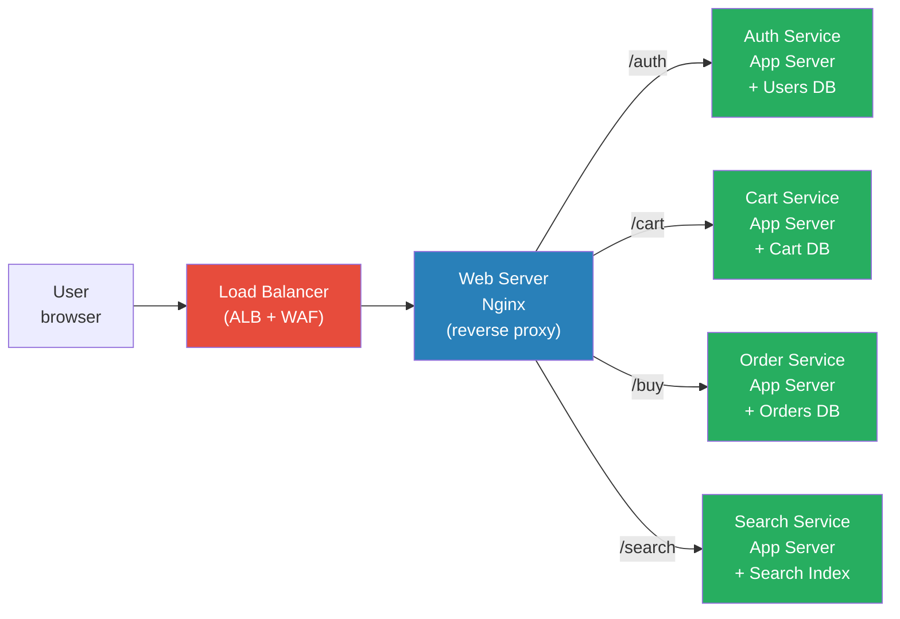

# DevOps Question 4 — What is the Difference Between a Web Server and an Application Server?

> **Section:** DevOps Miscellaneous &nbsp;|&nbsp; **Topic:** Web Architecture Fundamentals &nbsp;|&nbsp; **Level:** All levels &nbsp;|&nbsp; **Frequency:** High
>
> _Part of the DevOps & DevSecOps Interview Preparation series._

---

## ❓ The Question

> **"What is the difference between a web server and an application server?"**

You may also hear this phrased as:

- "Can you explain the roles of Nginx and Tomcat in a web application stack?"
- "Why do we need both a web server and an application server?"
- "Where does business logic live in a typical web application architecture?"
- "What happens between a user clicking a button and the database being queried?"
- "How does a microservices architecture relate to application servers?"

---

## 🎯 Why Interviewers Ask This

This is a **foundational architecture question** that tests whether you understand the components you deploy, configure, and monitor every day. Interviewers ask it to verify:

- You can **explain the request-response lifecycle** end to end — from the browser to the database and back.
- You understand **separation of concerns** in modern web architecture — frontend delivery vs. backend computation.
- You know **real-world tools** for each layer: Nginx/Apache for web serving, Tomcat/Gunicorn/Node.js for application serving.
- You can connect this knowledge to **DevOps responsibilities**: configuring reverse proxies, deploying services in containers, scaling each tier independently.
- You're not just an operator — you understand **what you're operating**.

> **The instant win:** Lead with the one-line distinction — "A web server delivers static content; an application server executes business logic" — then build the full picture with a practical example.

---

## 📖 Key Terminologies

| Term | Plain-English Meaning |
|------|----------------------|
| **Web Server** | A server that handles HTTP/HTTPS requests and serves static content (HTML, CSS, JS, images). Examples: Nginx, Apache HTTPD. |
| **Application Server** | A server that executes application logic, processes user inputs, runs business rules, and communicates with databases. Examples: Tomcat, Gunicorn, Node.js, Uvicorn. |
| **Static Content** | Files that are the same for every user — HTML pages, CSS stylesheets, JavaScript bundles, images. No computation needed; served directly from disk. |
| **Dynamic Content** | Content that varies per user or request — personalised dashboards, search results, account details. Requires computation and database queries. |
| **Reverse Proxy** | A web server positioned in front of application servers. It forwards incoming requests to the right backend service and returns the response. Nginx is the most common reverse proxy. |
| **Business Logic** | The rules that define how an application behaves — authentication, pricing, cart calculation, fraud detection. Lives in the application server, not the web server. |
| **Microservices** | An architectural style where the application is broken into small, independently deployable services — each with its own application server and database. |
| **Load Balancer** | Distributes incoming requests across multiple web/application servers to prevent any single server from being overwhelmed. |
| **CDN (Content Delivery Network)** | A geographically distributed cache of static content — serves files from the edge node closest to the user, reducing latency. |
| **API Gateway** | Entry point for microservice requests — routes, authenticates, rate-limits, and transforms requests before they reach the application servers. |
| **TLS Termination** | The process of decrypting HTTPS at the web server/load balancer layer so application servers only deal with plain HTTP internally. |

---

## 🗣️ How to Answer (Structured)

**1) Lead with the one-line distinction:**
> "A web server's job is to deliver content to the user — HTML pages, images, CSS. An application server's job is to process the logic behind that content — authentication, purchases, search — and produce data that the web server then renders."

**2) Use a concrete example (the www.xyz.com scenario):**
> "Imagine a user visits www.xyz.com. The web server immediately serves the homepage — static HTML and images. When the user clicks 'Login' and enters their email and password, the web server forwards that request to the application server. The application server validates the credentials against the database, creates a session, and sends the result back to the web server, which then renders the authenticated user's dashboard."

**3) Explain how this maps to microservices:**
> "As applications scale, you don't want one giant application server handling login, cart, payments, and fraud detection all in one place. Instead you split it into microservices — each is its own small application server with its own database. The web server (or API gateway) routes the user's request to the right service."

**4) Name real tools for each layer:**
> "In practice: Nginx as the web server and reverse proxy, Tomcat for Java apps, Gunicorn or Uvicorn for Python, Node.js for JavaScript backends. In containers, these all run as separate pods in Kubernetes — you scale each independently based on load."

**5) Close with the DevOps relevance:**
> "From a DevOps perspective this matters because the two layers scale differently, fail differently, and need different monitoring. I'd scale web servers horizontally behind an ALB for traffic spikes, while scaling application servers based on CPU and latency metrics. And I'd set different health checks and alert thresholds for each."

---

## 🔐 Security Perspective (DevSecOps)

The web server / application server boundary is one of the most important **security boundaries** in any web stack:

- **TLS termination at the web server** — HTTPS is decrypted at Nginx/ALB. Internal traffic between the web server and application servers can run over HTTP inside a private VPC subnet — but only if the subnet is properly isolated. Zero-trust environments now encrypt internal traffic too (mTLS via service mesh).

- **Web Application Firewall (WAF) at the web layer** — The web server / ALB is where you attach AWS WAF to filter SQL injection, XSS, and malformed requests *before* they ever reach the application server. Attacks are stopped at the edge.

- **No direct database access from the web server** — The web server should never query the database directly. The separation exists precisely to prevent this: static delivery tier → application logic tier → data tier. Bypassing this is a classic misconfiguration that enables SQL injection to reach the DB directly.

- **Application server should never be internet-facing** — Application servers sit in private subnets. Only the web server / load balancer is in the public subnet. If an application server has a public IP, that's a misconfiguration to flag immediately.

- **Secrets live in the application server layer, not the web server** — Database credentials, API keys, and tokens are consumed by the application server (via environment variables or Secrets Manager). The web server has no business knowing them. Leaking secrets into Nginx configs is a real-world mistake.

- **Separate IAM roles per tier** — In AWS, the EC2 or ECS task running Nginx should have a minimal IAM role (maybe none). The application server's IAM role should only allow the specific AWS API calls it needs (e.g., `secretsmanager:GetSecretValue` for its own secrets, nothing else).

> **One-liner for the room:** *"The web server is the public face — harden it with WAF, TLS, and rate limiting. The application server is the brain — keep it private, least-privilege IAM, and never directly reachable from the internet."*

---

## 🖼️ Visuals

### Mermaid — Full Request Flow: User → Web Server → App Server → Database

```mermaid
sequenceDiagram
    participant U as User (Browser)
    participant CDN as CDN / Edge
    participant WS as Web Server (Nginx)
    participant WAF as AWS WAF
    participant AS as App Server (Gunicorn / Tomcat)
    participant DB as Database (RDS)

    U->>CDN: GET www.xyz.com (static assets)
    CDN-->>U: HTML, CSS, JS (cached)

    U->>WAF: POST /login {email, password}
    WAF-->>WS: Filtered request (SQL injection blocked)
    WS->>AS: Forward /login request (reverse proxy)
    AS->>DB: SELECT user WHERE email=? (parameterised)
    DB-->>AS: User record + hashed password
    AS-->>WS: 200 OK + session token
    WS-->>U: Set-Cookie: session=xyz; Secure; HttpOnly
```

### Mermaid — Microservices Architecture: Multiple App Servers, One Web Layer



### Source image — KodeKloud whiteboard


---

## 📊 Quick Comparison — Web Server vs Application Server

| | **Web Server** | **Application Server** |
|---|----------------|----------------------|
| **Primary role** | Deliver static content, reverse proxy | Execute business logic, computation |
| **Content type** | Static (HTML, CSS, JS, images) | Dynamic (user-specific, computed) |
| **Interacts with** | User's browser, CDN, App Server | Database, message queues, external APIs |
| **Examples** | Nginx, Apache HTTPD, Caddy | Tomcat, Gunicorn, Uvicorn, Node.js, JBoss |
| **Network location** | Public subnet (internet-facing) | Private subnet (internal only) |
| **Scales based on** | Concurrent connections / bandwidth | CPU, memory, request processing time |
| **Stateless?** | Yes (each request independent) | Often stateful (sessions, transactions) |
| **Security controls** | TLS termination, WAF, rate limiting | Auth logic, secrets, IAM role |
| **AWS equivalent** | ALB + CloudFront + S3 (static) | ECS/EKS tasks, Lambda, Elastic Beanstalk |
| **Failure impact** | Users get no page | Users get page but actions fail |

> **Mnemonic:** *Web server = waiter (takes your order, delivers the meal). Application server = kitchen (actually cooks the food). The waiter never touches the recipe; the kitchen never talks to the customer directly.*

---

## 🛠️ Hands-On: Configuration & Commands

### 1) Nginx as Web Server + Reverse Proxy to Application Server

```nginx
# /etc/nginx/sites-available/xyz.conf

server {
    listen 80;
    server_name www.xyz.com;
    # Redirect all HTTP to HTTPS
    return 301 https://$host$request_uri;
}

server {
    listen 443 ssl http2;
    server_name www.xyz.com;

    # TLS termination at Nginx — app servers only see HTTP internally
    ssl_certificate     /etc/ssl/certs/xyz.com.crt;
    ssl_certificate_key /etc/ssl/private/xyz.com.key;
    ssl_protocols       TLSv1.2 TLSv1.3;
    ssl_ciphers         HIGH:!aNULL:!MD5;

    # Security headers
    add_header Strict-Transport-Security "max-age=31536000; includeSubDomains" always;
    add_header X-Frame-Options DENY;
    add_header X-Content-Type-Options nosniff;
    add_header Referrer-Policy strict-origin-when-cross-origin;

    # Serve static content directly from Nginx (no app server needed)
    location /static/ {
        root /var/www/xyz;
        expires 30d;
        add_header Cache-Control "public, immutable";
    }

    # Reverse proxy dynamic requests to the application server
    location /api/ {
        proxy_pass         http://app-server-upstream;
        proxy_set_header   Host $host;
        proxy_set_header   X-Real-IP $remote_addr;
        proxy_set_header   X-Forwarded-For $proxy_add_x_forwarded_for;
        proxy_set_header   X-Forwarded-Proto $scheme;
        proxy_read_timeout 60s;
        proxy_connect_timeout 10s;
    }

    # Auth service route
    location /auth/ {
        proxy_pass http://auth-service-upstream;
        proxy_set_header Host $host;
        proxy_set_header X-Real-IP $remote_addr;
    }
}

# Upstream block — application server pool (load balanced)
upstream app-server-upstream {
    least_conn;  # route to least-busy server
    server 10.0.1.10:8000;
    server 10.0.1.11:8000;
    server 10.0.1.12:8000;
    keepalive 32;
}

upstream auth-service-upstream {
    server 10.0.2.10:8001;
    server 10.0.2.11:8001;
}
```

### 2) Gunicorn — Python Application Server

```bash
# Install Gunicorn
pip install gunicorn

# Run a Django/Flask app with Gunicorn (application server)
# workers = 2 × CPU cores + 1 (standard rule)
gunicorn \
  --workers 5 \
  --worker-class uvicorn.workers.UvicornWorker \
  --bind 0.0.0.0:8000 \
  --timeout 60 \
  --access-logfile /var/log/gunicorn/access.log \
  --error-logfile /var/log/gunicorn/error.log \
  myapp.wsgi:application

# Run as a systemd service (production pattern)
cat > /etc/systemd/system/gunicorn.service << 'EOF'
[Unit]
Description=Gunicorn Application Server
After=network.target

[Service]
User=appuser
Group=appuser
WorkingDirectory=/app
ExecStart=/usr/local/bin/gunicorn \
  --workers 5 \
  --bind unix:/run/gunicorn.sock \
  --timeout 60 \
  myapp.wsgi:application
Restart=always

[Install]
WantedBy=multi-user.target
EOF

systemctl enable gunicorn
systemctl start gunicorn
```

### 3) Docker Compose — Web + App + DB (3-tier stack)

```yaml
# docker-compose.yml — 3-tier architecture
version: "3.9"

services:
  # ── Web Server (Nginx) — public-facing ──
  nginx:
    image: nginx:1.25-alpine
    ports:
      - "80:80"
      - "443:443"
    volumes:
      - ./nginx/nginx.conf:/etc/nginx/nginx.conf:ro
      - ./static:/var/www/static:ro
      - ./certs:/etc/ssl/certs:ro
    depends_on:
      - app
    networks:
      - public
      - internal

  # ── Application Server (Python/Gunicorn) — internal only ──
  app:
    build: ./app
    command: gunicorn --workers 4 --bind 0.0.0.0:8000 myapp.wsgi:application
    environment:
      - DB_HOST=postgres
      - DB_PORT=5432
      # Never put actual secrets here — use Docker secrets or AWS Secrets Manager
      - DB_SECRET_ARN=arn:aws:secretsmanager:us-east-1:123:secret:db-creds
    depends_on:
      - postgres
    networks:
      - internal   # NOT on public network — cannot be reached from outside
    expose:
      - "8000"

  # ── Database — internal only ──
  postgres:
    image: postgres:16-alpine
    environment:
      POSTGRES_DB: appdb
      POSTGRES_USER: appuser
      POSTGRES_PASSWORD_FILE: /run/secrets/db_password
    volumes:
      - pgdata:/var/lib/postgresql/data
    networks:
      - internal   # db also NOT on public network
    secrets:
      - db_password

networks:
  public:    # Nginx only
  internal:  # App + DB communication (no public exposure)

volumes:
  pgdata:

secrets:
  db_password:
    file: ./secrets/db_password.txt
```

### 4) Kubernetes — Separate Deployments for Web and App Tiers

```yaml
# web-server-deployment.yaml — Nginx (public-facing)
apiVersion: apps/v1
kind: Deployment
metadata:
  name: nginx-web
  namespace: production
spec:
  replicas: 2
  selector:
    matchLabels:
      app: nginx-web
  template:
    metadata:
      labels:
        app: nginx-web
    spec:
      containers:
        - name: nginx
          image: nginx:1.25-alpine
          ports:
            - containerPort: 80
            - containerPort: 443
          resources:
            requests:
              cpu: 100m
              memory: 128Mi
            limits:
              cpu: 500m
              memory: 256Mi
          volumeMounts:
            - name: nginx-config
              mountPath: /etc/nginx/conf.d
      volumes:
        - name: nginx-config
          configMap:
            name: nginx-config
---
# app-server-deployment.yaml — Application server (private)
apiVersion: apps/v1
kind: Deployment
metadata:
  name: app-server
  namespace: production
spec:
  replicas: 3
  selector:
    matchLabels:
      app: app-server
  template:
    metadata:
      labels:
        app: app-server
    spec:
      serviceAccountName: app-server-sa  # IRSA — IAM role bound to this service account
      containers:
        - name: app
          image: my-app:1.4.2
          ports:
            - containerPort: 8000
          env:
            - name: DB_HOST
              valueFrom:
                secretKeyRef:
                  name: db-secret
                  key: host
          resources:
            requests:
              cpu: 250m
              memory: 512Mi
            limits:
              cpu: 1000m
              memory: 1Gi
          livenessProbe:
            httpGet:
              path: /health
              port: 8000
            initialDelaySeconds: 10
            periodSeconds: 30
          readinessProbe:
            httpGet:
              path: /ready
              port: 8000
            initialDelaySeconds: 5
            periodSeconds: 10
---
# app-server-service.yaml — ClusterIP (internal only — no public exposure)
apiVersion: v1
kind: Service
metadata:
  name: app-server
  namespace: production
spec:
  type: ClusterIP   # NOT LoadBalancer or NodePort — internal only
  selector:
    app: app-server
  ports:
    - port: 8000
      targetPort: 8000
```

### 5) Health check commands for each tier

```bash
# Check web server (Nginx) health
curl -I https://www.xyz.com/health
# Expected: HTTP/2 200

# Check application server directly (from inside the cluster/VPC)
kubectl exec -n production deploy/nginx-web -- \
  curl -s http://app-server:8000/health
# Expected: {"status": "ok", "db": "connected"}

# Check Nginx is proxying correctly
kubectl exec -n production deploy/nginx-web -- \
  nginx -t
# Expected: nginx: configuration file /etc/nginx/nginx.conf test is successful

# View Nginx access logs (proxy requests to app server)
kubectl logs -n production deploy/nginx-web -f

# View application server logs
kubectl logs -n production deploy/app-server -f --tail=100
```

---

## 🤖 AI & The New Trend (2024–2025)

> The web server / application server boundary hasn't disappeared — but AI and cloud-native patterns are reshaping how each layer is implemented and operated.

### How this architecture is evolving

- **Serverless application servers (AWS Lambda / Fargate)** — The application server is increasingly a Lambda function or Fargate task rather than a long-running process. The web layer (CloudFront + API Gateway) stays, but the "application server" spins up on demand, scales to zero, and disappears. You no longer manage Gunicorn workers or Tomcat instances.

- **Edge computing blurs the line** — CloudFront Functions and Lambda@Edge now run lightweight application logic (auth checks, URL rewrites, A/B testing) at the CDN edge — before the request even reaches the origin web server. The boundary between web and application tiers is moving outward toward the user.

- **AI inference as an application server tier** — In 2024/2025, many architectures add an **AI inference tier** — a GPU-backed application server (SageMaker endpoint, Bedrock, or self-hosted Triton) that the application server calls for real-time ML predictions (fraud scoring, personalisation, LLM responses). DevOps engineers are now managing this third compute tier.

- **API Gateway replaces Nginx in microservices** — AWS API Gateway, Kong, or Envoy Proxy increasingly handles the routing, auth, and rate-limiting that Nginx used to do manually. Nginx is still common for containerised workloads inside EKS, but the trend is toward dedicated API management platforms.

- **Platform Engineering: abstracting the tiers** — Internal Developer Platforms (Backstage + Crossplane) let developers deploy a "web + app + db" stack from a template without knowing Nginx configs or Gunicorn settings. DevOps/platform engineers own the template; developers consume it. Understanding the tiers remains essential — you build the template.

### Mention this in interviews (shows you're current):

> "In containerised environments we still have the same architectural separation, but the implementation has shifted. Nginx runs as a sidecar or as a cluster-level ingress controller, and the application server is a set of autoscaling pods or Lambda functions. The same principles — static vs. dynamic, public vs. private — still apply, just expressed differently."

---

## ✅ Prerequisites (be solid on these first)

- **HTTP/HTTPS basics** — Request/response cycle, status codes (200, 301, 404, 502), headers (Content-Type, Authorization, Set-Cookie).
- **DNS fundamentals** — How a domain name resolves to an IP, what a CNAME is, how Route 53 fits.
- **Basic Linux / process model** — What a process is, what a port is, what a socket is. Nginx listens on port 80/443; Gunicorn listens on port 8000.
- **Networking layers** — Public vs. private subnets, security groups, VPC — so you understand why the application server can be private.
- **Containers basics** — How Docker networks work; why services in different containers talk over internal networks, not the internet.
- **Familiarity with at least one web server and one app server** — Even if you haven't configured Nginx from scratch, know what it does and where its config lives.

---

## 📚 Further Reading (current docs)

- **Nginx documentation** — <https://nginx.org/en/docs/>
- **Nginx as a reverse proxy** — <https://docs.nginx.com/nginx/admin-guide/web-server/reverse-proxy/>
- **Gunicorn documentation** — <https://docs.gunicorn.org/en/stable/>
- **AWS API Gateway** — <https://docs.aws.amazon.com/apigateway/latest/developerguide/>
- **AWS CloudFront (CDN)** — <https://docs.aws.amazon.com/AmazonCloudFront/latest/DeveloperGuide/>
- **AWS WAF** — <https://docs.aws.amazon.com/waf/latest/developerguide/>
- **OWASP: Defence in depth (web / app separation)** — <https://owasp.org/www-community/attacks/>
- **KodeKloud lesson (video):** <https://learn.kodekloud.com/user/courses/devops-interview-preparation-course/module/013fead8-a37c-42eb-83ec-e691a1238d08/lesson/c98ab837-c1e9-43f5-b533-3cb6190afd85>

---

## 🔁 Related / Follow-up Questions (they often go here next)

1. **"What is a reverse proxy and why do you use one?"** → A reverse proxy (Nginx, HAProxy) sits in front of one or more application servers. It forwards client requests to the appropriate backend and returns the response. Benefits: TLS termination, load balancing, caching static content, hiding internal architecture, and applying WAF rules — all at the edge before requests reach app servers.

2. **"What is the difference between a load balancer and a reverse proxy?"** → A reverse proxy forwards requests to a single backend (or a small set). A load balancer distributes requests across many backends to spread traffic and provide fault tolerance. In practice, Nginx does both. AWS ALB is primarily a load balancer but also acts as a reverse proxy.

3. **"What is TLS termination?"** → Decrypting HTTPS at the web server/ALB layer. The client connects over HTTPS (encrypted). The web server decrypts it and forwards plain HTTP to the application server internally. This offloads encryption overhead from app servers and centralises certificate management.

4. **"How does a CDN fit into this architecture?"** → A CDN (CloudFront) caches static content at edge locations worldwide, serving it from the nearest node to the user. Only requests for dynamic content (that misses the cache) reach the origin web server. This reduces latency and origin load dramatically.

5. **"What is a microservice and how does it relate to an application server?"** → A microservice is a single-responsibility application — the cart service, auth service, or order service. Each runs its own application server and its own database. The web server (or API gateway) routes requests to the appropriate microservice based on the URL path.

6. **"What happens when an application server goes down?"** → If there's no redundancy: users get 502 Bad Gateway from Nginx. With proper setup: Nginx upstream health checks detect the failure and stop routing to it; remaining healthy instances absorb the load; Auto Scaling launches a replacement; CloudWatch alarm fires; on-call engineer is paged.

7. **"How do you deploy changes to Nginx configuration safely?"** → Load the new config into version control (GitOps), apply via CI/CD, use `nginx -t` to validate before reload, and use `nginx -s reload` (graceful reload — existing connections finish, new config applies to new connections). Never `systemctl restart nginx` in production — it drops active connections.

8. **"What is a 502 Bad Gateway and how do you troubleshoot it?"** → Nginx received the request but couldn't get a valid response from the upstream (application server). First check: is the application server process running (`systemctl status gunicorn`)? Is it listening on the expected port (`ss -tlnp | grep 8000`)? Are there errors in the app server logs (`journalctl -u gunicorn -n 100`)? Is the upstream config in Nginx pointing to the right IP/port?

9. **"How would you scale the web tier vs. the application tier independently?"** → Web tier: scale horizontally via Auto Scaling Group triggered by ALB request count or concurrent connections. Application tier: scale based on CPU utilisation or custom latency metrics. In Kubernetes: separate HPA (Horizontal Pod Autoscaler) per deployment, each with its own scaling metric. The key insight: the two tiers have different bottlenecks and scale at different rates.

10. **"Where do you put session state in this architecture?"** → Not in the application server's memory — that breaks horizontal scaling (the next request might go to a different instance). Instead: external session store (Redis/ElastiCache), JWT tokens (stateless, validated by any instance), or sticky sessions on the load balancer (least preferred — creates uneven load).

---

> 📌 **30-second interview summary:** A web server (Nginx, Apache) delivers static content — HTML, CSS, images — and acts as a reverse proxy forwarding dynamic requests to the application server. An application server (Gunicorn, Tomcat, Node.js) executes business logic: authentication, cart, purchases, fraud detection — and talks to the database. As the application grows, the single application server splits into microservices, each owning its domain. From a DevOps perspective: the web server lives in the public subnet; the application server lives in the private subnet and is never internet-facing. You scale them independently, monitor them differently, and apply different security controls at each layer.
