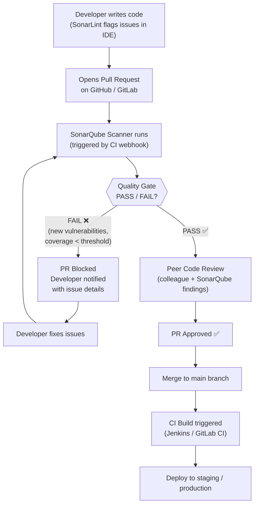
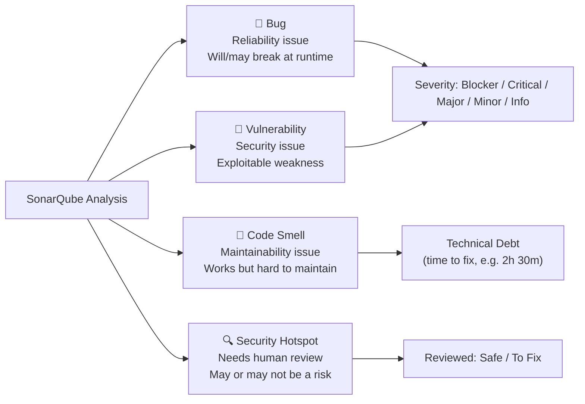

# DevOps Question 5 — What is SonarQube and How Does It Fit Into a CI/CD Pipeline?

> **Section:** DevOps Miscellaneous &nbsp;|&nbsp; **Topic:** Code Quality / SAST / DevSecOps Tooling &nbsp;|&nbsp; **Level:** Mid (2–5 yrs) &nbsp;|&nbsp; **Frequency:** High
>
> _Part of the DevOps & DevSecOps Interview Preparation series._

---

## ❓ The Question

> **"What is SonarQube and how have you used it in your workflow?"**

You may also hear this phrased as:

- "How do you enforce code quality standards in your CI/CD pipeline?"
- "What tools do you use for static code analysis?"
- "What is a Quality Gate in SonarQube?"
- "How do you prevent insecure code from being merged into production?"
- "What is the difference between a bug, a vulnerability, and a code smell?"

---

## 🎯 Why Interviewers Ask This

SonarQube is one of the most widely adopted code quality platforms across mid-to-large engineering teams. Interviewers ask this to verify:

- You understand **static application security testing (SAST)** — catching issues in code before runtime.
- You can integrate quality gates into **CI/CD pipelines** — not just run a scan manually but enforce it as a blocking step.
- You know the difference between **code quality** (maintainability, duplication, complexity) and **security** (vulnerabilities, hotspots).
- You understand the **developer feedback loop** — how SonarLint in the IDE connects to SonarQube in the pipeline.
- For DevSecOps roles: you treat code analysis as a **shift-left security control**, not an afterthought.

> **The instant win:** Even if you haven't operated SonarQube yourself, describe the workflow clearly — PR created → SonarQube scans → Quality Gate result blocks/passes the merge → peer review → CI build. That structured answer shows you understand where it fits.

---

## 📖 Key Terminologies

| Term | Plain-English Meaning |
|------|----------------------|
| **SonarQube** | An automated code review platform that analyses source code for bugs, security vulnerabilities, and maintainability issues. Self-hosted (Community/Enterprise) or SaaS (SonarCloud). |
| **SonarCloud** | The SaaS version of SonarQube — hosted by Sonarsource, no installation needed. Common for open-source and smaller teams. |
| **SonarLint** | An IDE plugin (VS Code, IntelliJ, Eclipse) that gives real-time feedback as you type — the same rules as SonarQube, applied before code is committed. |
| **Quality Gate** | A pass/fail threshold on code metrics (e.g., coverage > 80%, no new critical vulnerabilities). A failed Quality Gate blocks the PR from merging. |
| **Bug** | A coding error that will or could cause incorrect behaviour at runtime. SonarQube flags these as reliability issues. |
| **Vulnerability** | A security weakness in the code that can be exploited by an attacker — e.g., SQL injection, hardcoded credentials, XXE. |
| **Code Smell** | A maintainability issue — code that works but is hard to read, modify, or test. Examples: overly complex methods, duplicated code, poor naming. |
| **Security Hotspot** | Code that is security-sensitive but requires human review to determine if it is truly a vulnerability. Example: a custom crypto implementation — it might be fine, or it might be broken. |
| **SAST** | Static Application Security Testing — analysing source code (not running the app) for security issues. SonarQube is a SAST tool. |
| **DAST** | Dynamic Application Security Testing — testing a running application for vulnerabilities (e.g., OWASP ZAP). Complements SAST. |
| **Clean as You Code** | SonarQube's philosophy: focus on keeping *new* code clean rather than trying to fix all legacy issues at once. Quality Gate focuses on changed code. |
| **Technical Debt** | The cost (time) it would take to fix all the code smells and maintainability issues in the codebase. SonarQube quantifies this in minutes/hours/days. |

---

## 🗣️ How to Answer (Structured)

**1) Define it clearly in one sentence:**
> "SonarQube is an automated code review tool that analyses source code for bugs, security vulnerabilities, and maintainability issues — giving developers immediate feedback and preventing bad code from reaching production."

**2) Describe the five core capabilities:**
> "It has five key features: SonarLint for real-time IDE feedback, Quality Gates to enforce pass/fail thresholds on PRs, the Clean as You Code approach that focuses on new code rather than overwhelming developers with legacy debt, automated issue detection for bugs and vulnerabilities, and Security Hotspot flagging for code that needs manual security review."

**3) Walk through how it fits in the CI/CD workflow:**
> "In our pipeline, a developer opens a PR in GitHub. SonarQube automatically analyses the changed code — checking coverage, complexity, vulnerabilities, and smells. The Quality Gate result appears on the PR: green means all thresholds are met and the PR can proceed to peer review; red blocks the merge. The developer fixes the issues, SonarQube re-scans, and once the gate passes and a peer approves, the code merges and triggers a Jenkins or GitLab CI build."

**4) Mention SonarLint for shift-left:**
> "What I like about the SonarQube ecosystem is SonarLint — it runs the same rules in the developer's IDE. Issues are caught before the code is even committed, which is much cheaper to fix than catching them in the pipeline or, worse, in production."

**5) If you haven't used it directly — be honest and structured:**
> "I haven't operated a SonarQube instance myself, but I understand its role: it's a SAST tool that enforces quality and security standards as a CI gate. I've worked with similar tools — Semgrep for security rules and ESLint for JS quality — and the pattern is the same: scan on PR, enforce a threshold, block merge on failure."

---

## 🔐 Security Perspective (DevSecOps)

SonarQube is a core **shift-left security tool** in any DevSecOps programme:

- **SAST in the pipeline, not just the IDE** — SonarQube as a pipeline gate means security checks happen automatically on every PR, not only when a developer remembers to run a scan. No code reaches main without a clean SAST result.

- **Vulnerability detection vs. Security Hotspot — know the difference** — A Vulnerability is a confirmed security issue (e.g., a SQL query built via string concatenation — SQL injection is certain). A Security Hotspot is context-dependent: SonarQube flags it, but a human decides. Treating hotspots with the same urgency as vulnerabilities prevents false-positive fatigue.

- **Quality Gate as a compliance control** — In regulated environments (SOC 2, PCI-DSS, ISO 27001), having a Quality Gate that blocks merges on critical vulnerabilities provides an auditable, automated control. "No critical security issues were merged without review" becomes a verifiable statement.

- **Never commit credentials — SonarQube finds them** — SonarQube (and SonarCloud) detect hardcoded secrets: API keys, passwords, connection strings in source code. This is one of the most valuable daily catches — OWASP A07 (Identification and Authentication Failures) is often introduced by hardcoded credentials.

- **Coverage thresholds reduce attack surface** — A Quality Gate requiring >80% test coverage means less untested code paths — fewer blind spots where vulnerabilities hide undetected.

- **SonarQube + Dependency-Check = layered SAST** — SonarQube analyses your own code. OWASP Dependency-Check (or Snyk, Dependabot) analyses your dependencies. Together they cover both your code and your supply chain — two distinct SAST layers.

> **One-liner for the room:** *"SonarQube is the automated code reviewer that never gets tired — it checks every line, every PR, every time, and it blocks bad code before it reaches production. That's shift-left security in practice."*

---

## 🖼️ Visuals

### Mermaid — SonarQube CI/CD Integration Workflow



### Mermaid — SonarQube Issue Types and Severity Levels



### Source images — KodeKloud


---

## 📊 Quick Comparison — SonarQube Issue Types

| Issue Type | Category | Blocks Merge? | Example |
|-----------|----------|--------------|---------|
| **Bug** | Reliability | Yes (if Blocker/Critical) | Null pointer dereference, resource not closed |
| **Vulnerability** | Security | Yes (Critical) | SQL injection, hardcoded password, XXE |
| **Code Smell** | Maintainability | Only if threshold exceeded | Method too long, duplicated block, unused variable |
| **Security Hotspot** | Security review | No — requires human review | Use of `Math.random()` for security, custom crypto |
| **Coverage gap** | Quality Gate metric | Yes (if below threshold) | New code with <80% line coverage |
| **Duplication** | Quality Gate metric | Yes (if above threshold) | >3% duplicated lines on new code |

---

## 🛠️ Hands-On: Commands & Configuration

### 1) Run SonarQube Scanner (CLI)

```bash
# Install Sonar Scanner CLI
wget https://binaries.sonarsource.com/Distribution/sonar-scanner-cli/sonar-scanner-cli-5.0.1.3006-linux.zip
unzip sonar-scanner-cli-*.zip
export PATH=$PATH:$(pwd)/sonar-scanner-5.0.1.3006-linux/bin

# Run a scan against a SonarQube server
sonar-scanner \
  -Dsonar.projectKey=my-project \
  -Dsonar.projectName="My Application" \
  -Dsonar.projectVersion=1.0 \
  -Dsonar.sources=src \
  -Dsonar.tests=tests \
  -Dsonar.python.coverage.reportPaths=coverage.xml \
  -Dsonar.host.url=http://sonarqube.company.internal:9000 \
  -Dsonar.token=$SONAR_TOKEN

# Check Quality Gate result after scan completes
curl -u "$SONAR_TOKEN:" \
  "http://sonarqube.company.internal:9000/api/qualitygates/project_status?projectKey=my-project" \
  | jq '.projectStatus.status'
# Returns: "OK" or "ERROR"
```

### 2) sonar-project.properties (project config file)

```properties
# sonar-project.properties — place in project root
sonar.projectKey=my-app
sonar.projectName=My Application
sonar.projectVersion=1.0

# Source and test directories
sonar.sources=src
sonar.tests=tests
sonar.exclusions=**/node_modules/**,**/vendor/**,**/*.test.js

# Language-specific settings
sonar.language=python
sonar.python.version=3.11
sonar.python.coverage.reportPaths=coverage.xml

# For JavaScript/TypeScript
# sonar.javascript.lcov.reportPaths=coverage/lcov.info

# Quality Gate — fail the pipeline if gate fails
sonar.qualitygate.wait=true
sonar.qualitygate.timeout=300
```

### 3) GitLab CI Integration

```yaml
# .gitlab-ci.yml — SonarQube stage in CI pipeline
stages:
  - test
  - sonarqube
  - build
  - deploy

# Run tests and generate coverage report first
unit-tests:
  stage: test
  image: python:3.11-slim
  script:
    - pip install pytest pytest-cov
    - pytest --cov=src --cov-report=xml:coverage.xml tests/
  artifacts:
    reports:
      coverage_report:
        coverage_format: cobertura
        path: coverage.xml
    paths:
      - coverage.xml

# SonarQube analysis — blocks pipeline on Quality Gate failure
sonarqube-analysis:
  stage: sonarqube
  image:
    name: sonarsource/sonar-scanner-cli:latest
    entrypoint: [""]
  variables:
    SONAR_USER_HOME: "${CI_PROJECT_DIR}/.sonar"
    GIT_DEPTH: "0"   # full clone needed for blame/history features
  cache:
    key: "${CI_JOB_NAME}"
    paths:
      - .sonar/cache
  script:
    - sonar-scanner
      -Dsonar.projectKey=${CI_PROJECT_NAME}
      -Dsonar.projectName=${CI_PROJECT_NAME}
      -Dsonar.host.url=${SONAR_HOST_URL}
      -Dsonar.token=${SONAR_TOKEN}
      -Dsonar.sources=src
      -Dsonar.python.coverage.reportPaths=coverage.xml
      -Dsonar.qualitygate.wait=true
  allow_failure: false   # Fail the pipeline if Quality Gate fails
  only:
    - merge_requests
    - main
```

### 4) GitHub Actions Integration

```yaml
# .github/workflows/sonarqube.yml
name: SonarQube Analysis

on:
  push:
    branches: [main, develop]
  pull_request:
    types: [opened, synchronize, reopened]

jobs:
  sonarqube:
    name: SonarQube Scan
    runs-on: ubuntu-latest

    steps:
      - name: Checkout code
        uses: actions/checkout@v4
        with:
          fetch-depth: 0  # full history for blame annotations

      - name: Set up Python
        uses: actions/setup-python@v5
        with:
          python-version: "3.11"

      - name: Run tests with coverage
        run: |
          pip install pytest pytest-cov
          pytest --cov=src --cov-report=xml:coverage.xml tests/

      - name: SonarQube Scan
        uses: SonarSource/sonarqube-scan-action@master
        env:
          SONAR_TOKEN: ${{ secrets.SONAR_TOKEN }}
          SONAR_HOST_URL: ${{ secrets.SONAR_HOST_URL }}
        with:
          args: >
            -Dsonar.projectKey=my-app
            -Dsonar.python.coverage.reportPaths=coverage.xml
            -Dsonar.qualitygate.wait=true

      - name: Check Quality Gate
        uses: SonarSource/sonarqube-quality-gate-action@master
        timeout-minutes: 5
        env:
          SONAR_TOKEN: ${{ secrets.SONAR_TOKEN }}
```

### 5) SonarQube Quality Gate configuration (via API)

```bash
# Create a custom Quality Gate (stricter than default)
curl -u "$SONAR_TOKEN:" -X POST \
  "http://sonarqube.company.internal:9000/api/qualitygates/create" \
  -d "name=strict-production-gate"

# Add condition: no new Critical or Blocker bugs
curl -u "$SONAR_TOKEN:" -X POST \
  "http://sonarqube.company.internal:9000/api/qualitygates/create_condition" \
  -d "gateId=2&metric=new_reliability_rating&op=GT&error=1"

# Add condition: new code coverage >= 80%
curl -u "$SONAR_TOKEN:" -X POST \
  "http://sonarqube.company.internal:9000/api/qualitygates/create_condition" \
  -d "gateId=2&metric=new_coverage&op=LT&error=80"

# Add condition: no new Security vulnerabilities
curl -u "$SONAR_TOKEN:" -X POST \
  "http://sonarqube.company.internal:9000/api/qualitygates/create_condition" \
  -d "gateId=2&metric=new_security_rating&op=GT&error=1"

# Add condition: new duplicated lines < 3%
curl -u "$SONAR_TOKEN:" -X POST \
  "http://sonarqube.company.internal:9000/api/qualitygates/create_condition" \
  -d "gateId=2&metric=new_duplicated_lines_density&op=GT&error=3"

# Associate the gate with a project
curl -u "$SONAR_TOKEN:" -X POST \
  "http://sonarqube.company.internal:9000/api/qualitygates/select" \
  -d "gateId=2&projectKey=my-app"
```

### 6) Docker Compose — Self-hosted SonarQube

```yaml
# docker-compose-sonarqube.yml
version: "3.9"

services:
  sonarqube:
    image: sonarqube:10.4-community
    container_name: sonarqube
    depends_on:
      - sonar-db
    environment:
      SONAR_JDBC_URL: jdbc:postgresql://sonar-db:5432/sonar
      SONAR_JDBC_USERNAME: sonar
      SONAR_JDBC_PASSWORD: sonar
    ports:
      - "9000:9000"
    volumes:
      - sonarqube_data:/opt/sonarqube/data
      - sonarqube_logs:/opt/sonarqube/logs
      - sonarqube_extensions:/opt/sonarqube/extensions
    ulimits:
      nofile:
        soft: 65536
        hard: 65536

  sonar-db:
    image: postgres:15-alpine
    container_name: sonar-db
    environment:
      POSTGRES_DB: sonar
      POSTGRES_USER: sonar
      POSTGRES_PASSWORD: sonar
    volumes:
      - postgresql_data:/var/lib/postgresql/data

volumes:
  sonarqube_data:
  sonarqube_logs:
  sonarqube_extensions:
  postgresql_data:
```

```bash
# Start SonarQube
docker compose -f docker-compose-sonarqube.yml up -d

# Check SonarQube is ready
curl -s http://localhost:9000/api/system/status | jq '.status'
# Returns: "UP"

# Generate a token for CI integration
curl -u admin:admin -X POST \
  "http://localhost:9000/api/user_tokens/generate" \
  -d "name=ci-token&type=GLOBAL_ANALYSIS_TOKEN"
```

---

## 🤖 AI & The New Trend (2024–2025)

> SonarQube is evolving beyond rule-based static analysis into AI-assisted code review — and the competitive landscape is shifting fast.

### How AI is changing code quality and SAST

- **SonarQube AI Code Assurance (2024)** — Sonar has introduced AI-generated code detection. SonarQube can now flag code that was likely written by an AI assistant (GitHub Copilot, ChatGPT) and apply additional scrutiny — AI-generated code tends to have higher rates of subtle security issues and incorrect error handling. This is a 2024-specific feature worth mentioning in interviews.

- **Sonar's AI Fix Suggestions** — SonarCloud and SonarQube (Enterprise) now suggest AI-generated fixes for detected issues, not just the description of the problem. The developer sees "here's the issue and here's a suggested fix" — reducing the time from detection to resolution.

- **GitHub Advanced Security (GHAS)** — Microsoft/GitHub's built-in SAST (CodeQL) has become a major competitor to SonarQube, especially for teams already on GitHub Enterprise. CodeQL performs deep semantic analysis (tracking taint flow across function calls) that catches vulnerabilities SonarQube misses. In 2024, many orgs run both: SonarQube for quality metrics and CodeQL for deep security analysis.

- **Semgrep** — A lightweight, rule-based SAST tool gaining adoption fast. Teams write custom rules in YAML (matching code patterns), which is far easier than writing SonarQube plugins. Semgrep is replacing SonarQube's security rules in security-first teams.

- **Snyk Code** — Snyk's SAST offering, known for low false-positive rates and deep framework-aware analysis. Common in teams that also use Snyk for dependency scanning — one platform covering both SAST and SCA (Software Composition Analysis).

- **AI pair reviewer in PRs** — Tools like CodeRabbit, Codium PR-Agent, and GitHub Copilot for PRs now automatically comment on PRs with quality feedback — acting as a first-pass code reviewer before the human reviewer. SonarQube's PR decoration is now one of several signals the reviewer sees.

### What to mention in interviews (shows you're current):

> "SonarQube is still the standard for code quality metrics and Quality Gate enforcement. But in 2024/2025 I'm also seeing teams add Semgrep for custom security rules and Snyk Code for dependency-aware SAST. The trend is layering tools — no single scanner catches everything."

---

## ✅ Prerequisites (be solid on these first)

- **What a pull request is** — The code change workflow: feature branch → PR → review → merge. SonarQube plugs into this at the PR stage.
- **CI/CD basics** — Enough to understand where a `sonar-scanner` step fits in a GitLab CI YAML or GitHub Actions workflow.
- **Code coverage concept** — What it means (percentage of code lines executed by tests), why it matters, and why 100% isn't the goal (80% of meaningful paths is better than 100% trivial coverage).
- **What static analysis means** — Analysing source code without running it. Contrast with dynamic analysis (running the app and testing it). SAST = static, DAST = dynamic.
- **Basic security terminology** — SQL injection, XSS, hardcoded credentials — common vulnerability types SonarQube catches.

---

## 📚 Further Reading (current docs)

- **SonarQube official documentation** — <https://docs.sonarqube.org/latest/>
- **SonarCloud (SaaS)** — <https://sonarcloud.io/documentation>
- **SonarLint IDE plugin** — <https://www.sonarsource.com/products/sonarlint/>
- **Clean as You Code methodology** — <https://docs.sonarqube.org/latest/user-guide/clean-as-you-code/>
- **Quality Gates documentation** — <https://docs.sonarqube.org/latest/user-guide/quality-gates/>
- **GitHub Advanced Security / CodeQL** — <https://docs.github.com/en/code-security/code-scanning>
- **Semgrep documentation** — <https://semgrep.dev/docs/>
- **OWASP Top 10 (what SonarQube catches)** — <https://owasp.org/www-project-top-ten/>
- **KodeKloud lesson (video):** <https://learn.kodekloud.com/user/courses/devops-interview-preparation-course/module/013fead8-a37c-42eb-83ec-e691a1238d08/lesson/512dbf8b-fb7e-4a22-b9a6-b35fdd7c02cf>

---

## 🔁 Related / Follow-up Questions (they often go here next)

1. **"What is the difference between SAST and DAST?"** → SAST (Static) analyses source code without running the app — catches issues early in development. DAST (Dynamic) tests a running application by sending malicious inputs — catches runtime vulnerabilities SAST misses. DevSecOps best practice: run both. SonarQube = SAST. OWASP ZAP / Burp Suite = DAST.

2. **"What is a Quality Gate and how do you configure one?"** → A Quality Gate is a set of conditions (metrics thresholds) that code must meet before a PR can merge. Default conditions: no new Blocker bugs, security rating ≥ A, coverage ≥ 80% on new code. You configure thresholds via the SonarQube web UI or API, then associate the gate with your project.

3. **"What is the difference between a Vulnerability and a Security Hotspot in SonarQube?"** → A Vulnerability is a confirmed security issue — SonarQube is certain it's exploitable. A Security Hotspot is security-sensitive code that *might* be a vulnerability depending on context — it requires human review. Example: calling `random()` in a security context is a hotspot (maybe you just needed a random colour, not a cryptographic token — but it could be a problem).

4. **"How do you handle a large legacy codebase with thousands of SonarQube issues?"** → Use the "Clean as You Code" approach — don't try to fix everything at once. Configure the Quality Gate to enforce standards only on *new and changed* code. Over time the codebase improves naturally as old code gets touched. Set a separate long-term roadmap for reducing legacy debt by priority (Blocker → Critical → Major).

5. **"Can SonarQube replace peer code review?"** → No — and this is an important answer. SonarQube automates the objective, mechanical checks: rule violations, coverage thresholds, known vulnerability patterns. Peer review catches what SonarQube can't: incorrect business logic, poor design decisions, missing edge cases, unclear naming. SonarQube reduces the *noise* in peer review so humans focus on what matters.

6. **"How do you prevent SonarQube findings from slowing down development velocity?"** → Tune the Quality Gate to block only critical/blocker severity issues. Use the "new code" focus (don't block on legacy issues). Integrate SonarLint so developers fix issues before pushing. Review and dismiss false positives as "Won't Fix" with a justification comment. Track alert noise and tune rules that fire too often with too few true positives.

7. **"What is SonarLint and why is it important?"** → SonarLint is a free IDE plugin (VS Code, IntelliJ, Eclipse, PyCharm) that runs the same rules as SonarQube in real time as you type. Issues are flagged before the code is even committed — the cheapest possible fix point. When connected to SonarQube (Connected Mode), it uses your project's exact rule set so there are no surprises in the pipeline.

8. **"How does SonarQube integrate with Jira?"** → SonarQube can be connected to Jira via the SonarQube for Jira app. SonarQube issues can automatically create Jira tickets, and Jira ticket status syncs back to the SonarQube issue status. This connects the quality feedback loop to the team's existing task management workflow without requiring developers to use two systems.

---

> 📌 **30-second interview summary:** SonarQube is an automated code review platform that analyses source code for bugs (reliability), vulnerabilities (security), and code smells (maintainability). It plugs into the CI/CD pipeline at the PR stage: a developer opens a PR, SonarQube scans it, and the Quality Gate either passes the PR (all thresholds met) or blocks the merge (critical issues found). SonarLint provides the same feedback in the IDE before code is even committed. From a DevSecOps perspective, SonarQube is a key shift-left control — catching security issues at development time, not in production. If you haven't used it, describe the workflow clearly and mention equivalent tools (Semgrep, CodeQL, Snyk Code) — the pattern is what matters.
